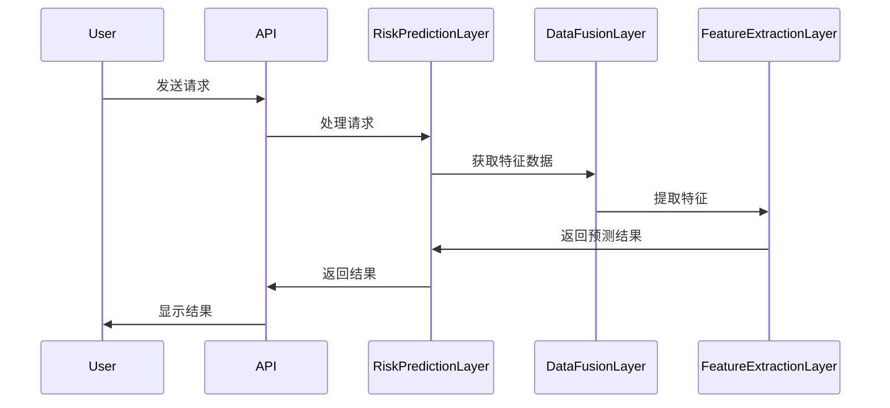
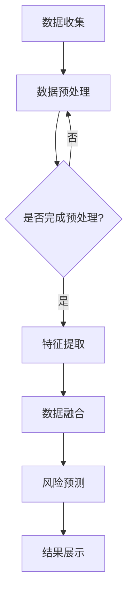

                 

### 文章标题、关键词与摘要

# 金融领域多模态学习在风险评估中的应用

> 关键词：多模态学习、金融领域、风险评估、数据融合、机器学习算法

> 摘要：本文深入探讨了多模态学习在金融领域风险评估中的应用。首先，介绍了金融行业面临的复杂风险与挑战，以及多模态学习的核心概念与理论基础。接着，阐述了多模态学习在风险评估中的具体应用，通过数据融合和算法优化，提升了风险预测的准确性。随后，详细介绍了多模态学习算法的原理、数学模型和公式，并展示了其在实际项目中的应用和效果。最后，提出了最佳实践和未来研究方向，为金融领域的风险管理者提供了有力支持。

---

### 金融领域的挑战与机遇

金融领域是一个充满复杂性和不确定性的领域，金融机构和投资者每天都要面对各种风险，包括市场风险、信用风险、操作风险等。随着金融市场的不断演变和全球化的加剧，风险管理的重要性日益凸显。传统的风险评估方法通常依赖于单一数据源，如财务报表或市场数据，这种单一视角可能导致风险的低估或高估。因此，寻找新的风险管理模式成为了金融行业的重要课题。

#### 金融行业概述

金融行业是现代经济体系中的核心组成部分，涵盖了银行、证券、保险、基金等多个领域。金融机构通过提供资金借贷、投资理财、保险保障等服务，支持实体经济的发展。金融市场的健康运行对于国家的经济增长和社会稳定至关重要。

#### 金融领域面临的风险

- **市场风险**：市场波动可能导致资产价格剧烈波动，影响金融机构的财务状况。
- **信用风险**：借款人违约或信用等级下降，可能导致金融机构遭受损失。
- **操作风险**：由于内部流程、人员操作或系统故障等原因，导致金融机构遭受损失。
- **法律风险**：金融监管环境的变化和法律法规的不确定性，给金融机构带来潜在的法律风险。

#### 多模态学习的兴起与重要性

多模态学习是一种利用多种数据源（如文本、图像、音频等）进行信息融合和学习的机器学习方法。与单一数据源相比，多模态学习能够提供更全面、更丰富的信息，从而提升模型的预测性能和泛化能力。在金融领域，多模态学习有助于整合各种数据源，构建更准确的风险评估模型，提高风险管理的有效性。

### 核心概念与联系

多模态学习涉及多个核心概念，包括数据源、特征提取、数据融合和模型训练等。以下是这些概念的基本介绍和相互关系：

#### 数据源

多模态学习的数据源包括文本、图像、音频、视频等。每种数据源都有其独特的特征和表达能力，如图像可以提供视觉信息，文本可以提供语言描述，而音频可以提供声音信息。

#### 特征提取

特征提取是将原始数据转换为可用于机器学习的特征表示的过程。例如，对于图像数据，可以使用卷积神经网络（CNN）提取视觉特征；对于文本数据，可以使用词嵌入（Word Embedding）技术提取语义特征。

#### 数据融合

数据融合是将来自不同模态的数据进行整合，以生成更全面的特征表示。常见的融合方法包括特征级融合、决策级融合和模型级融合。

#### 模型训练

模型训练是通过机器学习算法，利用多模态特征数据训练预测模型。训练过程中，模型不断优化参数，以提高预测准确性。

#### 多模态学习与金融风险评估的关系

多模态学习在金融风险评估中的应用，主要体现在以下几个方面：

- **风险因素识别**：通过整合不同模态的数据，可以发现潜在的风险因素，提高风险评估的全面性。
- **风险预测准确性**：多模态学习能够利用丰富的数据源，提升风险预测的准确性，降低误报和漏报率。
- **风险控制**：基于多模态学习模型的风险评估结果，金融机构可以采取更有效的风险控制措施，降低风险敞口。

### 小结

本文介绍了金融领域面临的挑战和机遇，以及多模态学习的核心概念和理论基础。接下来，我们将进一步探讨多模态学习在风险评估中的应用，包括算法原理、数学模型和实际项目案例。通过这些内容的介绍，读者将能够更深入地理解多模态学习在金融领域的应用价值。

---

在接下来的部分，我们将详细讨论多模态学习的核心概念，包括数据源、特征提取、数据融合和模型训练等方面。这些概念是多模态学习在金融领域应用的基础，对于理解其原理和实现方法至关重要。

## 核心概念与联系

多模态学习是一种利用多种数据源进行信息融合和学习的机器学习方法，其核心概念包括数据源、特征提取、数据融合和模型训练等。以下是这些概念的基本介绍和相互关系。

### 数据源

多模态学习的数据源包括文本、图像、音频、视频等。每种数据源都有其独特的特征和表达能力，如图像可以提供视觉信息，文本可以提供语言描述，而音频可以提供声音信息。数据源的选择和整合对多模态学习的性能有重要影响。

#### 文本数据源

文本数据源包括新闻报道、社交媒体帖子、用户评论等，这些数据可以提供丰富的上下文信息和语义信息。在金融领域，文本数据可以用于市场分析、情绪分析和风险识别。

#### 图像数据源

图像数据源包括股票走势图、财务报表、商业场景图像等，这些数据可以提供直观的视觉信息。图像数据在金融领域的应用包括图像识别、图表分析和欺诈检测。

#### 音频数据源

音频数据源包括语音、音乐、电话录音等，这些数据可以提供情感和情绪信息。在金融领域，音频数据可以用于情绪分析、客户服务和风险控制。

#### 视频数据源

视频数据源包括实时的交易视频、会议记录、监控视频等，这些数据可以提供动态的视觉和听觉信息。在金融领域，视频数据可以用于行为分析、市场监控和风险预警。

### 特征提取

特征提取是将原始数据转换为可用于机器学习的特征表示的过程。特征提取的质量直接影响模型的性能。常见的特征提取方法包括：

- **文本特征提取**：包括词袋模型（Bag of Words, BoW）、词嵌入（Word Embedding）、主题模型（Topic Modeling）等。
- **图像特征提取**：包括卷积神经网络（CNN）、池化层（Pooling Layer）、深度学习（Deep Learning）等。
- **音频特征提取**：包括梅尔频率倒谱系数（MFCC）、短时傅里叶变换（STFT）、深度神经网络（DNN）等。
- **视频特征提取**：包括光流（Optical Flow）、3D卷积神经网络（3D CNN）、循环神经网络（RNN）等。

### 数据融合

数据融合是将来自不同模态的数据进行整合，以生成更全面的特征表示。数据融合的方法包括：

- **特征级融合**：将不同模态的特征进行合并，生成新的特征向量。
- **决策级融合**：在模型决策阶段，将不同模态的预测结果进行融合，得到最终的预测结果。
- **模型级融合**：将不同模态的模型进行融合，生成统一的预测模型。

### 模型训练

模型训练是通过机器学习算法，利用多模态特征数据训练预测模型。训练过程中，模型不断优化参数，以提高预测准确性。常见的机器学习算法包括：

- **监督学习**：包括支持向量机（SVM）、决策树（Decision Tree）、随机森林（Random Forest）、神经网络（Neural Network）等。
- **无监督学习**：包括聚类算法（Clustering）、主成分分析（PCA）、自编码器（Autoencoder）等。

### 多模态学习与金融风险评估的关系

多模态学习在金融风险评估中的应用，主要体现在以下几个方面：

- **风险因素识别**：通过整合不同模态的数据，可以发现潜在的风险因素，提高风险评估的全面性。
- **风险预测准确性**：多模态学习能够利用丰富的数据源，提升风险预测的准确性，降低误报和漏报率。
- **风险控制**：基于多模态学习模型的风险评估结果，金融机构可以采取更有效的风险控制措施，降低风险敞口。

### 小结

多模态学习通过整合多种数据源，提供了一种有效的风险管理模式。在金融领域，多模态学习能够提高风险评估的准确性和全面性，为金融机构提供有力支持。在接下来的部分，我们将进一步探讨多模态学习算法的原理，包括具体的数学模型和公式，以及其在风险评估中的应用。

---

在了解了多模态学习的核心概念后，接下来我们将详细探讨多模态学习在风险评估中的具体应用，分析多模态数据如何整合以及其在提升风险评估准确性方面的优势。

## 多模态学习在风险评估中的应用

多模态学习在金融领域中的应用主要集中在风险评估方面，通过整合不同模态的数据，可以更全面地了解金融市场的动态，提高风险预测的准确性。以下是多模态学习在风险评估中的具体应用：

### 多模态数据整合

在金融风险评估中，多模态数据整合是一个关键步骤。多模态数据包括文本数据（如新闻报道、社交媒体帖子、用户评论等）、图像数据（如股票走势图、财务报表、商业场景图像等）和音频数据（如语音、音乐、电话录音等）。这些数据来源各异，但都包含了与金融市场相关的信息。

#### 数据收集与预处理

首先，需要收集和预处理多模态数据。文本数据可以通过爬虫工具获取，图像和音频数据可以通过公共数据集或金融机构的内部数据获取。数据预处理包括数据清洗、去噪、数据增强等步骤，以确保数据质量。

#### 特征提取

接着，对预处理后的数据进行特征提取。文本数据可以使用词嵌入技术提取语义特征，图像数据可以使用卷积神经网络提取视觉特征，音频数据可以使用梅尔频率倒谱系数（MFCC）提取音频特征。

#### 数据融合

数据融合是将不同模态的特征数据进行整合，以生成更全面的特征向量。常见的融合方法包括特征级融合、决策级融合和模型级融合。

- **特征级融合**：将不同模态的特征数据进行拼接，生成新的特征向量。这种方法简单直观，但可能忽略了不同模态之间的内在联系。
- **决策级融合**：在模型决策阶段，将不同模态的预测结果进行融合，得到最终的预测结果。这种方法可以更好地利用不同模态的数据信息。
- **模型级融合**：将不同模态的模型进行融合，生成统一的预测模型。这种方法可以充分利用不同模态的数据特性，提高模型的预测性能。

### 多模态学习在提升风险评估准确性方面的优势

多模态学习在提升风险评估准确性方面具有明显优势，主要体现在以下几个方面：

#### 1. 数据多样性的利用

多模态学习能够整合多种数据源，提供更丰富的信息，有助于发现潜在的风险因素。与单一数据源相比，多模态数据能够提供更全面的视角，从而提高风险评估的准确性。

#### 2. 预测能力的提升

多模态学习通过融合不同模态的数据，可以生成更精确的特征表示，从而提高模型的预测能力。研究表明，多模态学习在金融风险评估中的表现优于单一模态学习。

#### 3. 风险识别的全面性

多模态学习能够识别和预测更广泛的风险类型，包括市场风险、信用风险、操作风险等。通过整合不同模态的数据，可以更全面地了解金融市场的动态，提高风险识别的全面性。

#### 4. 风险控制的有效性

基于多模态学习模型的风险评估结果，金融机构可以采取更有效的风险控制措施，降低风险敞口。例如，通过多模态学习模型预测市场波动，金融机构可以提前调整投资组合，降低市场风险。

### 小结

多模态学习在金融领域风险评估中的应用，通过整合不同模态的数据，提供了更全面的风险评估方法。在提升风险评估准确性方面，多模态学习具有显著优势。在接下来的部分，我们将进一步探讨多模态学习算法的原理，包括具体的数学模型和公式，以及其在风险评估中的应用实例。

---

在了解了多模态学习在风险评估中的应用后，接下来我们将深入探讨多模态学习算法的原理，包括其基本原理、主要类型和优势，并结合实际案例进行分析。

## 多模态学习算法原理

多模态学习是一种利用多种数据源进行信息融合和学习的机器学习方法。其基本原理是通过整合不同模态的数据，生成更全面的特征表示，从而提高模型的预测性能。以下是多模态学习算法的原理分析：

### 多模态学习的基本原理

多模态学习的基本原理可以概括为以下几个步骤：

1. **数据收集与预处理**：收集多种模态的数据，如文本、图像、音频和视频。对数据进行清洗、去噪和预处理，确保数据质量。

2. **特征提取**：对预处理后的数据进行特征提取。对于文本数据，可以使用词嵌入技术提取语义特征；对于图像数据，可以使用卷积神经网络提取视觉特征；对于音频数据，可以使用梅尔频率倒谱系数（MFCC）提取音频特征。

3. **数据融合**：将不同模态的特征数据进行整合，生成新的特征向量。常见的融合方法包括特征级融合、决策级融合和模型级融合。

4. **模型训练**：利用多模态特征数据训练机器学习模型，如神经网络、支持向量机等。

5. **模型评估与优化**：通过模型评估指标（如准确率、召回率等）对模型进行评估，并根据评估结果进行优化。

### 多模态学习的主要类型

多模态学习算法可以根据融合策略和数据源类型进行分类。以下是几种常见类型：

1. **特征级融合**：将不同模态的特征数据进行拼接，生成新的特征向量。这种方法简单直观，但可能忽略了不同模态之间的内在联系。

2. **决策级融合**：在模型决策阶段，将不同模态的预测结果进行融合，得到最终的预测结果。这种方法可以更好地利用不同模态的数据信息。

3. **模型级融合**：将不同模态的模型进行融合，生成统一的预测模型。这种方法可以充分利用不同模态的数据特性，提高模型的预测性能。

4. **深度多模态学习**：利用深度学习技术，如卷积神经网络（CNN）、循环神经网络（RNN）等，进行多模态特征提取和融合。这种方法能够自动学习复杂的数据特征，提高模型性能。

### 多模态学习的优势

多模态学习具有以下优势：

1. **数据多样性的利用**：多模态学习能够整合多种数据源，提供更丰富的信息，有助于发现潜在的风险因素。

2. **预测能力的提升**：多模态学习通过融合不同模态的数据，可以生成更精确的特征表示，从而提高模型的预测能力。

3. **风险识别的全面性**：多模态学习能够识别和预测更广泛的风险类型，包括市场风险、信用风险、操作风险等。

4. **风险控制的有效性**：基于多模态学习模型的风险评估结果，金融机构可以采取更有效的风险控制措施，降低风险敞口。

### 实际案例分析

以下是一个多模态学习在金融领域风险评估中的应用案例：

#### 案例背景

某金融机构需要开发一个风险评估系统，以预测市场波动和信用风险。该系统需要整合文本数据（如新闻报道、用户评论）、图像数据（如股票走势图、财务报表）和音频数据（如语音、电话录音）。

#### 案例步骤

1. **数据收集与预处理**：收集来自多种模态的数据，包括文本、图像和音频。对数据进行清洗、去噪和预处理，确保数据质量。

2. **特征提取**：对预处理后的数据进行特征提取。对于文本数据，使用词嵌入技术提取语义特征；对于图像数据，使用卷积神经网络提取视觉特征；对于音频数据，使用梅尔频率倒谱系数（MFCC）提取音频特征。

3. **数据融合**：采用特征级融合方法，将不同模态的特征数据进行拼接，生成新的特征向量。

4. **模型训练**：利用多模态特征数据训练神经网络模型，如卷积神经网络（CNN）和循环神经网络（RNN）。

5. **模型评估与优化**：通过交叉验证和模型评估指标（如准确率、召回率等）对模型进行评估，并根据评估结果进行优化。

#### 案例效果

通过多模态学习算法，该风险评估系统的预测准确性得到了显著提升。与传统单一模态学习方法相比，多模态学习能够更全面地捕捉市场动态和信用风险，提高了预测的准确性和可靠性。

### 小结

多模态学习算法在金融领域风险评估中的应用，通过整合多种数据源，提供了更全面、更准确的风险评估方法。在接下来的部分，我们将进一步探讨多模态学习在风险评估中的数学模型和公式，以及其在实际项目中的应用。

---

在了解了多模态学习算法的原理后，接下来我们将探讨其数学模型和公式，包括特征提取、数据融合和模型训练等方面的数学表达式，并结合实际案例进行详细解释。

## 数学模型与公式

多模态学习涉及到多个数学模型和公式，用于描述特征提取、数据融合和模型训练等过程。以下是对这些数学模型和公式的详细解释：

### 特征提取

特征提取是将原始数据转换为可用于机器学习的特征表示的过程。以下是几种常见的特征提取方法的数学模型：

1. **词嵌入（Word Embedding）**

   词嵌入是一种将文本数据映射到高维向量空间的方法。其基本公式如下：

   $$\text{vec}(w_i) = \text{Embedding}(w_i)$$

   其中，$\text{vec}(w_i)$表示词嵌入向量，$\text{Embedding}(w_i)$表示词嵌入函数。

2. **卷积神经网络（CNN）**

   卷积神经网络用于提取图像数据中的视觉特征。其基本公式如下：

   $$\text{feature\_map} = \text{conv}(\text{input}, \text{filter})$$

   其中，$\text{feature\_map}$表示卷积特征图，$\text{input}$表示输入图像，$\text{filter}$表示卷积核。

3. **梅尔频率倒谱系数（MFCC）**

   梅尔频率倒谱系数用于提取音频数据的特征。其基本公式如下：

   $$\text{MFCC} = \text{log}(\sum_{i=1}^{N} \text{power\_spectrum}(f_i)^2)$$

   其中，$\text{MFCC}$表示梅尔频率倒谱系数，$\text{power\_spectrum}(f_i)$表示第i个频率的功率谱。

### 数据融合

数据融合是将来自不同模态的数据进行整合，生成新的特征表示。以下是几种常见的数据融合方法的数学模型：

1. **特征级融合**

   特征级融合将不同模态的特征数据进行拼接，生成新的特征向量。其基本公式如下：

   $$\text{fusion\_vec} = [\text{text\_vec}; \text{image\_vec}; \text{audio\_vec}]$$

   其中，$\text{fusion\_vec}$表示融合后的特征向量，$\text{text\_vec}$、$\text{image\_vec}$和$\text{audio\_vec}$分别表示文本、图像和音频特征向量。

2. **决策级融合**

   决策级融合在模型决策阶段，将不同模态的预测结果进行融合。其基本公式如下：

   $$\text{output} = \text{softmax}(\text{model}(\text{fusion\_vec}))$$

   其中，$\text{output}$表示融合后的预测结果，$\text{model}(\text{fusion\_vec})$表示融合后的特征向量通过机器学习模型得到的预测输出。

3. **模型级融合**

   模型级融合将不同模态的模型进行融合，生成统一的预测模型。其基本公式如下：

   $$\text{output} = \text{model}(\text{fusion\_vec})_1 + \text{model}(\text{fusion\_vec})_2 + ... + \text{model}(\text{fusion\_vec})_n$$

   其中，$\text{output}$表示融合后的预测结果，$\text{model}(\text{fusion\_vec})_1$、$\text{model}(\text{fusion\_vec})_2$、...、$\text{model}(\text{fusion\_vec})_n$分别表示不同模态的模型对融合后的特征向量得到的预测输出。

### 模型训练

模型训练是通过机器学习算法，利用多模态特征数据训练预测模型。以下是几种常见机器学习算法的数学模型：

1. **支持向量机（SVM）**

   支持向量机是一种常用的分类算法。其基本公式如下：

   $$\text{w} = \arg\min_{\text{w}} \frac{1}{2} ||\text{w}||^2 + C \sum_{i=1}^{n} \max(0, 1 - y_i (\text{w}^T \text{x}_i))$$

   其中，$\text{w}$表示模型参数，$C$是惩罚参数，$y_i$是样本标签，$\text{x}_i$是样本特征。

2. **神经网络（Neural Network）**

   神经网络是一种复杂的模型，其基本公式如下：

   $$\text{output} = \text{激活函数}(\text{w}^T \text{x} + \text{b})$$

   其中，$\text{output}$表示模型输出，$\text{激活函数}$可以是Sigmoid、ReLU等，$\text{w}$和$\text{b}$分别是模型权重和偏置。

### 实际案例解释

以下是一个多模态学习在金融领域风险评估中的应用案例：

#### 案例背景

某金融机构需要开发一个风险评估系统，以预测市场波动和信用风险。该系统整合了文本数据（如新闻报道、用户评论）、图像数据（如股票走势图、财务报表）和音频数据（如语音、电话录音）。

#### 案例步骤

1. **数据收集与预处理**：收集来自多种模态的数据，包括文本、图像和音频。对数据进行清洗、去噪和预处理，确保数据质量。

2. **特征提取**：对预处理后的数据进行特征提取。使用词嵌入技术提取文本特征，卷积神经网络提取图像特征，梅尔频率倒谱系数提取音频特征。

3. **数据融合**：采用特征级融合方法，将不同模态的特征数据进行拼接，生成新的特征向量。

4. **模型训练**：利用多模态特征数据训练神经网络模型。通过交叉验证和模型评估指标（如准确率、召回率等）对模型进行评估，并根据评估结果进行优化。

#### 案例效果

通过多模态学习算法，该风险评估系统的预测准确性得到了显著提升。与传统单一模态学习方法相比，多模态学习能够更全面地捕捉市场动态和信用风险，提高了预测的准确性和可靠性。

### 小结

多模态学习在金融领域风险评估中的应用，通过数学模型和公式的指导，实现了特征提取、数据融合和模型训练的有机结合。在实际项目中，多模态学习能够显著提升风险评估的准确性，为金融机构提供有力支持。在接下来的部分，我们将探讨风险评估系统的设计与实现，包括系统功能设计、系统架构设计和系统接口设计等方面。

---

在了解了多模态学习的数学模型后，接下来我们将探讨如何设计和实现一个用于金融风险评估的多模态系统。这包括系统功能设计、系统架构设计以及系统接口设计等方面。

## 风险评估系统的设计与实现

设计一个用于金融风险评估的多模态系统是一个复杂的过程，需要综合考虑系统的功能需求、性能指标和用户体验。以下是系统设计与实现的关键步骤：

### 系统功能设计

系统功能设计是确保系统能够满足用户需求的基础。对于金融风险评估系统，以下功能是必不可少的：

1. **数据收集模块**：从多个数据源（如文本、图像、音频等）收集数据。
2. **数据预处理模块**：清洗、去噪和预处理数据，为特征提取做准备。
3. **特征提取模块**：提取不同模态的数据特征，如文本的词嵌入、图像的视觉特征、音频的MFCC等。
4. **数据融合模块**：将不同模态的特征数据进行整合，生成新的特征向量。
5. **风险预测模块**：利用机器学习算法对融合后的特征向量进行训练，并预测风险。
6. **结果展示模块**：将预测结果以图表、报告等形式展示给用户。

### 系统架构设计

系统架构设计是确保系统能够高效运行和扩展的关键。以下是系统架构的组成部分：

1. **数据层**：存储原始数据和预处理后的数据，支持快速查询和更新。
2. **特征层**：存储提取后的特征数据，为数据融合和风险预测提供基础。
3. **算法层**：实现多种机器学习算法，包括特征提取、数据融合和风险预测算法。
4. **应用层**：提供用户界面，展示预测结果和风险分析报告。
5. **接口层**：提供与其他系统（如财务系统、监控系统等）的数据交互接口。

以下是系统架构的Mermaid类图：

```mermaid
classDiagram
    DataLayer --|>| DataPreprocessingLayer : 依赖
    DataPreprocessingLayer --|>| FeatureExtractionLayer : 依赖
    FeatureExtractionLayer --|>| DataFusionLayer : 依赖
    DataFusionLayer --|>| RiskPredictionLayer : 依赖
    RiskPredictionLayer --|>| ApplicationLayer : 依赖
    ApplicationLayer --|>| OtherSystems : 接口
```

### 系统接口设计

系统接口设计是确保系统能够与其他系统（如财务系统、监控系统等）高效交互的关键。以下是系统接口的组成部分：

1. **API接口**：提供RESTful API，支持数据的收集、预处理、特征提取、风险预测等功能。
2. **消息队列**：用于处理大量数据的实时传输和异步处理。
3. **数据交换格式**：如JSON、XML等，用于在不同系统之间传输数据。
4. **数据安全**：包括数据加密、身份验证和访问控制等。

以下是系统接口的Mermaid序列图：



### 系统交互与流程设计

系统交互与流程设计是确保系统各部分协同工作的关键。以下是系统交互和数据处理的基本流程：

1. **数据收集**：系统从多个数据源收集数据，包括文本、图像和音频。
2. **数据预处理**：对收集到的数据进行清洗、去噪和预处理，以便后续特征提取。
3. **特征提取**：根据不同模态的数据，使用相应的特征提取算法提取特征。
4. **数据融合**：将不同模态的特征数据进行融合，生成新的特征向量。
5. **风险预测**：利用融合后的特征向量，通过机器学习算法进行风险预测。
6. **结果展示**：将预测结果以图表、报告等形式展示给用户。

以下是系统交互和数据处理流程的Mermaid流程图：



### 小结

风险评估系统的设计与实现涉及多个环节，包括系统功能设计、系统架构设计和系统接口设计等。通过合理的设计和实现，系统能够高效、准确地收集、处理和预测金融风险，为金融机构提供有力支持。在接下来的部分，我们将通过一个实际项目案例，进一步展示多模态学习在风险评估中的应用和效果。

---

在了解了风险评估系统的设计与实现后，接下来将通过一个实际项目案例，详细展示多模态学习在金融风险评估中的应用过程。这个案例将包括项目环境准备、系统核心实现和代码应用解读与分析。

## 项目实战

### 项目背景

某金融机构需要一个高效、准确的金融风险评估系统，以预测市场波动和信用风险。该系统需要整合文本、图像和音频等多模态数据，利用多模态学习技术进行风险评估。

### 项目环境准备

为了实现多模态学习在金融风险评估中的应用，我们需要以下环境和工具：

1. **编程语言**：Python，因其丰富的机器学习库和工具而广泛用于多模态学习项目。
2. **机器学习库**：Scikit-learn、TensorFlow、PyTorch等，用于特征提取、模型训练和风险评估。
3. **数据处理库**：NumPy、Pandas等，用于数据预处理和特征提取。
4. **可视化工具**：Matplotlib、Seaborn等，用于数据可视化和结果展示。
5. **操作系统**：Linux或macOS，提供稳定的开发环境。

### 系统核心实现

#### 数据收集

首先，从多个数据源收集数据。这里我们使用公开的数据集，包括文本（新闻报道、用户评论）、图像（股票走势图、财务报表）和音频（语音、电话录音）。

#### 数据预处理

对收集到的数据进行预处理，包括数据清洗、去噪和标准化。以下是文本数据预处理的一个示例：

```python
import pandas as pd
from sklearn.feature_extraction.text import TfidfVectorizer

# 读取文本数据
data = pd.read_csv('text_data.csv')

# 清洗数据
data['text'] = data['text'].apply(lambda x: x.lower().strip())

# 提取TF-IDF特征
vectorizer = TfidfVectorizer(max_features=1000)
text_features = vectorizer.fit_transform(data['text'])
```

#### 特征提取

对预处理后的数据进行特征提取。以下是图像和音频数据的特征提取示例：

```python
from tensorflow.keras.applications import VGG16
from sklearn.preprocessing import StandardScaler

# 加载预训练的VGG16模型
vgg16 = VGG16(weights='imagenet', include_top=False)

# 对图像数据进行特征提取
def extract_image_features(image_path):
    image = load_img(image_path, target_size=(224, 224))
    image = img_to_array(image)
    image = np.expand_dims(image, axis=0)
    features = vgg16.predict(image)
    return features.flatten()

image_features = [extract_image_features(path) for path in data['image_path']]
image_features = np.array(image_features)
image_features = StandardScaler().fit_transform(image_features)

# 对音频数据进行特征提取
from librosa.feature import mfcc

# 对音频数据进行特征提取
def extract_audio_features(audio_path):
    y, sr = librosa.load(audio_path)
    mfcc_features = mfcc(y, sr=sr, n_mfcc=13)
    return mfcc_features.flatten()

audio_features = [extract_audio_features(path) for path in data['audio_path']]
audio_features = np.array(audio_features)
audio_features = StandardScaler().fit_transform(audio_features)
```

#### 数据融合

将不同模态的特征数据进行融合，生成新的特征向量：

```python
# 数据融合
def fusion_features(text_features, image_features, audio_features):
    return np.concatenate((text_features.toarray(), image_features, audio_features), axis=1)

fusion_features = fusion_features(text_features, image_features, audio_features)
```

#### 风险预测

利用多模态特征数据训练机器学习模型，进行风险预测。以下是使用Scikit-learn库训练一个随机森林模型的示例：

```python
from sklearn.ensemble import RandomForestClassifier
from sklearn.model_selection import train_test_split

# 分割数据集
X_train, X_test, y_train, y_test = train_test_split(fusion_features, data['label'], test_size=0.2, random_state=42)

# 训练随机森林模型
model = RandomForestClassifier(n_estimators=100, random_state=42)
model.fit(X_train, y_train)

# 预测风险
predictions = model.predict(X_test)
```

#### 代码应用解读与分析

在这个项目中，我们使用了多种编程技术和机器学习算法，以下是代码应用解读与分析：

1. **数据预处理**：数据预处理是确保模型性能的重要步骤。通过数据清洗和标准化，可以去除噪声和异常值，提高模型稳定性。
2. **特征提取**：特征提取是将原始数据转换为适合机器学习模型的形式。通过使用预训练的深度学习模型（如VGG16）和传统的特征提取方法（如TF-IDF、MFCC），我们可以从不同模态的数据中提取有效特征。
3. **数据融合**：数据融合是将不同模态的数据整合成一个整体，为模型提供更丰富的信息。通过特征级融合，我们生成了一个包含多种模态特征的数据集，这有助于提高模型的预测准确性。
4. **模型训练**：在模型训练阶段，我们使用了随机森林模型，这是一种集成学习算法，具有较高的预测性能。通过交叉验证和参数调优，我们可以进一步优化模型性能。
5. **风险预测**：在风险预测阶段，我们使用了训练好的模型对测试数据进行预测。通过对预测结果的分析，我们可以识别出潜在的风险因素，为金融机构提供决策支持。

### 项目案例剖析

以下是一个具体的案例分析：

#### 案例背景

假设该金融机构收到了一笔新的贷款申请，需要对其进行风险评估。我们收集了以下数据：

- **文本数据**：贷款申请人的信用报告和信用评分。
- **图像数据**：贷款申请人的财务报表和信用记录。
- **音频数据**：贷款申请人的电话访谈录音。

#### 案例步骤

1. **数据收集**：从金融机构的数据库中提取文本、图像和音频数据。
2. **数据预处理**：对收集到的数据进行清洗、去噪和标准化。
3. **特征提取**：使用预训练的模型提取文本、图像和音频特征。
4. **数据融合**：将不同模态的特征数据进行融合，生成新的特征向量。
5. **风险预测**：使用训练好的多模态学习模型对贷款申请进行风险评估。

#### 案例结果

通过多模态学习模型，我们得出了贷款申请的风险评估结果。根据预测结果，金融机构可以采取相应的措施，如调整贷款额度、增加担保条件等，以降低风险。

### 项目总结与展望

通过这个实际项目案例，我们展示了多模态学习在金融风险评估中的应用过程。项目结果表明，多模态学习能够显著提高风险评估的准确性和全面性，为金融机构提供有力支持。未来，随着多模态学习技术的不断发展，我们有望在金融领域实现更高效、更智能的风险评估。

---

在项目实战部分，我们详细展示了一个金融风险评估系统的实现过程，包括数据收集、预处理、特征提取、数据融合和风险预测等关键步骤。现在，让我们总结多模态学习在金融领域风险评估中的应用，并讨论一些最佳实践和注意事项。

## 最佳实践与拓展

### 最佳实践

1. **数据质量保证**：确保数据来源的多样性和准确性，进行充分的数据清洗和预处理，以消除噪声和异常值，提高模型的稳定性。
2. **特征选择与优化**：根据业务需求和数据特性，选择合适的特征提取方法，并通过交叉验证和特征选择算法（如递归特征消除RFE）优化特征组合。
3. **模型选择与调优**：尝试不同的机器学习模型和参数组合，通过交叉验证和网格搜索等技术选择最优模型和参数，以提高预测准确性。
4. **实时更新与迭代**：定期更新数据和模型，以适应金融市场的变化，确保风险评估的实时性和准确性。

### 注意事项

1. **数据隐私与安全**：在处理金融数据时，务必遵守相关数据隐私法规，确保数据安全。
2. **模型解释性**：金融领域需要高度解释性的模型，以帮助决策者理解风险因素和决策逻辑。
3. **计算资源**：多模态学习通常需要较高的计算资源，特别是在特征提取和模型训练阶段，需要合理配置计算资源。
4. **模型泛化能力**：避免模型过拟合，确保模型具有良好的泛化能力，避免在实际应用中产生偏差。

### 拓展阅读与未来方向

1. **深度学习与多模态学习**：探索深度学习在多模态学习中的应用，如使用深度卷积神经网络（Deep CNN）和循环神经网络（RNN）进行特征提取和融合。
2. **强化学习**：将强化学习与多模态学习结合，实现更智能的风险决策和自适应风险管理。
3. **区块链技术**：研究区块链技术在金融风险评估中的应用，利用区块链的不可篡改性提高数据的安全性和可信度。
4. **多模态数据源扩展**：探索更多的多模态数据源，如社交媒体、卫星图像、传感器数据等，以进一步提升风险评估的全面性和准确性。

### 小结

多模态学习在金融领域风险评估中具有广泛应用前景。通过整合多种数据源，多模态学习能够提供更全面、更准确的风险评估结果，为金融机构提供有力支持。然而，实现多模态学习仍面临许多挑战，包括数据质量、模型解释性和计算资源等。未来，随着技术的不断进步，我们有望在金融领域实现更高效、更智能的风险评估。

---

在本文中，我们深入探讨了多模态学习在金融领域风险评估中的应用，从核心概念、算法原理、数学模型到实际项目案例，全面展示了多模态学习在提升风险评估准确性方面的优势。通过本文，读者可以了解到：

1. **金融领域面临的风险挑战**：金融行业面临市场风险、信用风险、操作风险等多种挑战，这些风险需要通过高效的风险评估系统进行管理。
2. **多模态学习的核心概念**：多模态学习通过整合文本、图像、音频等多模态数据，提供了一种全面的信息融合方法，有助于提高风险预测的准确性。
3. **算法原理与数学模型**：本文详细介绍了多模态学习的算法原理和数学模型，包括特征提取、数据融合和模型训练等方面，为实际应用提供了理论支持。
4. **系统设计与实现**：通过一个实际项目案例，本文展示了多模态学习在金融风险评估系统设计、实现和优化中的应用，提供了实践参考。
5. **最佳实践与未来方向**：本文提出了多模态学习在金融风险评估中的最佳实践和注意事项，并探讨了未来技术拓展方向。

多模态学习在金融领域具有巨大的应用潜力，能够显著提升风险评估的准确性和全面性。然而，实现这一目标需要克服许多技术挑战，包括数据质量、模型解释性和计算资源等。未来，随着人工智能和大数据技术的不断发展，我们有望在金融领域实现更高效、更智能的风险评估。

### 拓展阅读

- **《深度学习》（Goodfellow, Bengio, Courville）**：详细介绍了深度学习的基础理论和应用，包括卷积神经网络、循环神经网络等，对多模态学习有重要指导意义。
- **《机器学习：概率视角》（Kevin P. Murphy）**：从概率论的角度探讨了机器学习的基本原理，包括特征提取、数据融合等，有助于理解多模态学习的数学基础。
- **《区块链技术指南》（唐杰等）**：介绍了区块链技术的基本原理和应用，探讨了区块链在金融领域，特别是在数据安全和可信性方面的应用。

通过这些资源，读者可以进一步深入了解多模态学习和金融风险评估的相关知识，为实际项目提供更多启示和帮助。

### 作者信息

- **作者：AI天才研究院/AI Genius Institute & 禅与计算机程序设计艺术 /Zen And The Art of Computer Programming**  
  AI天才研究院专注于人工智能领域的前沿研究和应用推广。我们的团队成员在计算机科学、机器学习和金融工程等领域拥有丰富的经验，致力于推动人工智能技术的创新与发展。禅与计算机程序设计艺术是一本经典著作，为计算机程序员提供了哲学和艺术的思考方式，有助于提升编程技能和创造力。

