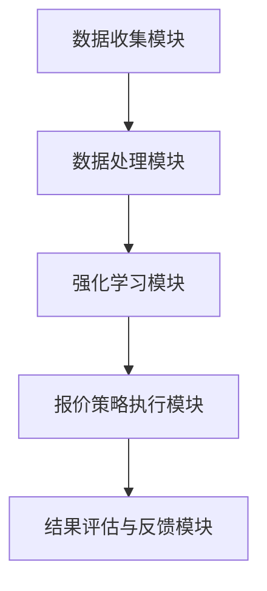

                 


### 引言：强化学习在金融领域的潜力

随着大数据和人工智能技术的快速发展，金融领域的运营和管理方式正在发生深刻的变革。传统的金融市场运作依赖于历史数据和统计方法，而现代金融技术开始越来越多地引入机器学习和深度学习算法，以提高交易策略的效率和稳定性。强化学习（Reinforcement Learning，RL）作为机器学习的一个分支，通过智能体（agent）与环境的交互，逐步学习和优化策略，正逐渐成为金融领域的一个热门研究方向。

强化学习在做市商报价策略中的应用具有重要的意义。做市商（Market Maker）是金融市场中至关重要的角色，他们通过提供买卖双向报价来维持市场的流动性，从而确保市场交易能够在合理范围内进行。然而，传统的做市商报价策略往往基于历史数据和简单的统计模型，难以应对市场环境的变化和新出现的市场动态。而强化学习通过实时学习市场反馈，能够自适应地调整报价策略，从而提高做市商的市场竞争力。

本文旨在深入探讨强化学习在做市商报价策略中的应用。我们将首先介绍强化学习的基本概念和原理，然后详细讨论强化学习算法在做市商报价策略中的具体应用，最后通过实际项目案例来展示强化学习在金融领域的实践效果。本文的结构如下：

1. **强化学习基础**：介绍强化学习的基本概念、主要算法和核心要素。
2. **做市商报价策略概述**：阐述做市商的定义、职责以及报价策略的目标和挑战。
3. **强化学习在做市商报价策略中的应用原理**：讨论强化学习在做市商报价策略中的基本流程和数学模型。
4. **系统分析与架构设计方案**：介绍整个系统的工作流程和架构设计。
5. **项目实战**：展示一个实际项目，包括环境安装、系统核心实现源代码和应用分析。
6. **最佳实践 tips、小结、注意事项、拓展阅读**：总结强化学习在做市商报价策略中的应用经验，提供拓展阅读资源。

通过本文的讨论，我们希望能够帮助读者理解强化学习在金融领域的重要性，以及如何将其应用到实际的做市商报价策略中，从而提升金融市场运营的效率和效果。

### 强化学习基础

#### 强化学习的基本概念

强化学习（Reinforcement Learning，RL）是一种机器学习范式，其核心是通过智能体（agent）与环境的交互，不断学习和优化策略，以实现长期目标。在强化学习中，智能体通过感知环境状态（state），选择行动（action），并根据行动的结果——奖励（reward）来更新自身的策略。这个过程不断重复，智能体通过学习环境中的奖励信号，逐渐调整策略，以期在长期内获得最大化的累积奖励。

强化学习与其他机器学习范式的区别在于，它不是通过固定的数据集进行训练，而是通过与环境的交互来学习。这种交互式学习使得强化学习能够应对动态变化的复杂环境，并且在解决某些特定问题时，表现出了优于传统机器学习方法的性能。

#### 强化学习的主要算法

强化学习包含多种算法，其中一些比较经典的算法包括Q-学习（Q-Learning）、策略迭代（Policy Iteration）、SARSA（State-Action-Reward-State-Action，SARSA）和深度强化学习（Deep Reinforcement Learning）。

- **Q-学习算法**：Q-学习是一种基于值函数的强化学习算法，其目标是通过学习状态-动作值函数（Q函数）来选择最优动作。Q函数表示在特定状态下执行特定动作的预期长期奖励。Q-学习通过迭代更新Q值，逐步逼近最优策略。

- **策略迭代算法**：策略迭代算法包括两个主要步骤：策略评估和策略改进。策略评估是通过迭代计算状态-动作值函数来评估当前策略；策略改进是通过选择具有最大Q值的动作来更新策略。这种迭代过程不断进行，直至找到最优策略。

- **SARSA算法**：SARSA是一种基于策略的强化学习算法，它同时更新状态-动作值函数和策略。在每次行动后，SARSA根据新的状态和奖励来更新Q值，并选择具有最大Q值的动作作为下一个行动。SARSA算法通过这种实时更新机制，能够快速收敛到最优策略。

- **深度强化学习**：深度强化学习（Deep Reinforcement Learning）是结合了深度学习（Deep Learning）和强化学习的方法，通过神经网络来表示复杂的值函数或策略。典型的深度强化学习算法包括深度Q网络（Deep Q-Network，DQN）和策略梯度方法（Policy Gradient Methods）。DQN通过神经网络来近似Q函数，而策略梯度方法通过神经网络来直接优化策略。

#### 强化学习在金融领域的应用

强化学习在金融领域的应用具有广泛的前景。金融市场是一个高度动态且复杂的系统，传统的金融模型和方法难以应对市场中的不确定性和突发性事件。强化学习通过智能体与金融市场的实时交互，能够逐步学习和优化交易策略，从而提高交易效率和收益。

以下是强化学习在金融领域的一些具体应用场景：

1. **做市商报价策略**：做市商通过实时监控市场动态，动态调整买卖报价，以维持市场流动性。强化学习可以帮助做市商在动态变化的市场环境中，自动生成最优的报价策略。

2. **高频交易策略**：高频交易（High-Frequency Trading，HFT）是金融市场中的一个重要领域，通过在极短的时间内完成大量交易来获取微小的利润。强化学习可以通过对市场数据的实时分析和学习，帮助高频交易者发现并利用市场机会。

3. **金融风险管理**：强化学习在金融风险管理中的应用也非常广泛。通过智能体对市场风险的实时监控和学习，可以优化风险控制策略，减少投资组合的波动性和潜在损失。

4. **量化投资策略**：量化投资（Quantitative Investment）依赖于数学模型和算法来指导投资决策。强化学习可以通过模拟和优化投资策略，帮助量化投资者在复杂的市场环境中实现稳健的投资收益。

#### 强化学习在金融领域与其他方法的比较

强化学习在金融领域与其他方法（如统计模型和传统机器学习方法）的比较中，具有一些独特的优势：

1. **自适应能力**：强化学习能够通过不断与环境交互，自动适应市场环境的变化。相比之下，传统的统计模型和机器学习方法往往依赖于历史数据，难以应对动态变化的市场环境。

2. **应对不确定性**：金融市场充满了不确定性，强化学习通过试错学习机制，能够在不确定的环境中逐步优化策略，从而提高决策的鲁棒性。

3. **实时性**：强化学习可以实时获取市场反馈，并动态调整策略。这对于需要快速响应市场变化的高频交易和做市商报价策略尤为重要。

然而，强化学习在金融领域也面临着一些挑战，如策略的可解释性、数据的质量和多样性、以及模型过拟合等问题。未来的研究需要进一步探讨这些挑战，并开发更加稳健和高效的强化学习算法，以推动金融领域的智能化发展。

通过本文的后续章节，我们将详细探讨强化学习在做市商报价策略中的应用原理、系统架构设计、项目实战案例以及最佳实践，以帮助读者深入理解这一前沿技术。

### 做市商报价策略概述

#### 做市商的定义与职责

做市商（Market Maker）是金融市场中的一个重要角色，他们在市场中提供买卖双向报价，从而维持市场流动性。做市商通常由大型金融机构或专业交易公司担任，他们的职责包括：

1. **提供报价**：做市商需要不断提供买价（Bid Price）和卖价（Ask Price），确保市场中始终存在买卖双方。
2. **维护流动性**：通过买卖双向报价，做市商确保市场在不同价格水平上有足够的交易量，从而提高市场的流动性。
3. **风险承担**：做市商在提供报价时，需要承担一定的风险。如果市场价格向不利于做市商的方向变化，他们需要及时调整报价，以避免损失。
4. **信息传递**：做市商通过不断调整报价，向市场传递关于交易需求和供给的信息，帮助市场参与者做出更准确的交易决策。

#### 做市商报价策略的目标

做市商报价策略的目标主要包括以下几个方面：

1. **最大化利润**：做市商通过买卖价差（Bid-Ask Spread）赚取利润。因此，他们的报价策略需要平衡买卖价差和交易量，以实现最大化利润。
2. **保持流动性**：做市商需要确保市场在不同价格水平上有足够的交易量，从而维持市场流动性。这意味着他们的报价策略需要灵活应对市场变化。
3. **风险控制**：做市商在报价策略中需要平衡风险和收益，确保在市场波动时能够有效控制风险。

#### 做市商报价策略的挑战

做市商报价策略在金融市场中面临着多种挑战：

1. **市场波动**：金融市场常常受到各种因素的影响，如经济数据、政策变化、突发事件等，导致市场波动加剧。做市商需要实时调整报价，以应对市场波动。
2. **交易成本**：做市商在提供报价时，需要承担一定的交易成本，包括交易手续费、市场冲击成本等。这要求做市商在报价策略中考虑到成本因素。
3. **信息不对称**：市场中存在信息不对称现象，一些市场参与者可能拥有更多的信息，而做市商需要通过分析大量数据来获取市场信息，从而制定合理的报价策略。
4. **技术挑战**：做市商报价策略需要依赖先进的金融技术和算法，如统计模型、机器学习和深度学习等。这些技术的应用和优化需要专业的技术团队和大量计算资源。

#### 强化学习在做市商报价策略中的应用

强化学习通过智能体与环境的交互，能够自适应地调整报价策略，从而应对市场动态。以下是强化学习在做市商报价策略中的潜在应用：

1. **动态调整报价**：强化学习可以通过实时学习市场反馈，动态调整买卖报价，以适应市场变化。这种自适应能力可以提高做市商的市场竞争力。
2. **风险控制**：强化学习可以通过学习市场波动规律，优化风险控制策略，降低做市商的风险暴露。
3. **信息分析**：强化学习可以通过分析大量市场数据，挖掘市场信息，帮助做市商制定更合理的报价策略。
4. **交易优化**：强化学习可以优化做市商的交易策略，提高交易效率和收益。

通过以上分析，我们可以看到，强化学习在做市商报价策略中具有重要的应用价值。它能够帮助做市商在复杂多变的市场环境中，实现更高效的报价策略，提高市场流动性，并实现长期稳健的利润。

### 强化学习在做市商报价策略中的应用原理

强化学习在做市商报价策略中的应用，主要依赖于其自适应性和灵活性。为了深入理解这一应用原理，我们需要从以下几个方面进行详细探讨：强化学习的基本流程、数学模型和算法设计。

#### 强化学习的基本流程

强化学习的基本流程可以分为以下几个步骤：

1. **状态感知**：智能体（agent）感知当前的环境状态（state）。
2. **策略选择**：根据当前状态，智能体选择一个动作（action）。
3. **执行动作**：智能体在环境中执行所选动作，并接收到相应的奖励（reward）。
4. **状态更新**：智能体的状态更新为新的状态（next state）。
5. **策略调整**：智能体根据接收到的奖励，调整其策略（policy）。

这个过程不断重复，智能体通过不断试错和策略调整，逐步学习到最优的策略，以实现长期累积奖励最大化。

#### 强化学习的数学模型

强化学习的数学模型通常包括以下几个核心概念：

1. **状态（State）**：表示当前环境的特征或条件。
2. **动作（Action）**：智能体可以执行的行为或决策。
3. **策略（Policy）**：智能体选择动作的策略，通常表示为概率分布。
4. **价值函数（Value Function）**：用于评估当前状态或状态-动作对的预期长期奖励。
5. **奖励（Reward）**：智能体执行动作后接收到的即时奖励信号。
6. **环境（Environment）**：智能体所处的动态环境，会根据智能体的动作和初始状态，生成新的状态和奖励。

在强化学习模型中，价值函数是核心之一。Q-学习算法通过更新状态-动作值函数（Q值），来选择最优动作。状态-动作值函数 \( Q(s, a) \) 表示在状态 \( s \) 下执行动作 \( a \) 的预期长期奖励。Q-学习的目标是通过迭代更新Q值，找到最优策略。

#### Q-学习算法

Q-学习算法是强化学习的一种经典算法，其核心思想是通过更新Q值来选择最优动作。Q-学习算法的基本步骤如下：

1. **初始化**：初始化Q值表格 \( Q(s, a) \) 和策略 \( \pi(a|s) \)。
2. **选择动作**：在状态 \( s \) 下，根据当前策略 \( \pi(a|s) \) 随机选择动作 \( a \)。
3. **执行动作**：在环境中执行动作 \( a \)，并接收新的状态 \( s' \) 和奖励 \( r \)。
4. **更新Q值**：根据新的状态和奖励，更新Q值：
   \[
   Q(s, a) \leftarrow Q(s, a) + \alpha [r + \gamma \max_{a'} Q(s', a') - Q(s, a)]
   \]
   其中，\( \alpha \) 是学习率，\( \gamma \) 是折扣因子。
5. **策略更新**：根据更新后的Q值，调整策略 \( \pi(a|s) \)。

#### 策略迭代算法

策略迭代算法是另一种常见的强化学习算法，其核心思想是交替进行策略评估和策略改进。策略迭代算法的基本步骤如下：

1. **策略评估**：使用当前策略 \( \pi \) 计算，更新状态-动作值函数 \( V(s) \)：
   \[
   V(s) \leftarrow \sum_{a} \pi(a|s) [r + \gamma \max_{a'} Q(s', a')]
   \]
2. **策略改进**：根据更新后的值函数 \( V(s) \)，选择具有最大预期回报的动作作为新策略 \( \pi' \)。

这种迭代过程不断进行，直至找到最优策略。

#### 强化学习算法的设计

在具体应用强化学习算法到做市商报价策略时，需要设计合适的算法架构，以实现高效的报价策略。以下是强化学习算法设计的几个关键步骤：

1. **状态编码**：将市场状态（如股票价格、交易量、市场波动性等）转换为可以输入到神经网络的状态编码。
2. **动作空间设计**：设计做市商的报价动作空间，通常包括买卖价差、交易量等参数。
3. **奖励机制设计**：设计合理的奖励机制，激励做市商在报价策略中实现最大化利润和维持市场流动性的目标。
4. **策略更新策略**：设计策略更新机制，以实现自适应调整报价策略。
5. **数据预处理**：对市场数据进行预处理，包括去噪、归一化等，以提高算法的性能。

通过以上设计，强化学习算法能够实现自动化的做市商报价策略，从而在复杂多变的市场环境中保持竞争优势。

### 强化学习在做市商报价策略中的应用原理

#### 状态感知与动作选择

在强化学习框架下，做市商需要首先感知当前的市场状态。这些状态可能包括股票价格、交易量、市场波动性、历史报价等。通过分析这些状态，做市商能够判断市场的当前状况和潜在趋势。状态感知的过程通常通过一个状态编码器来完成，将复杂的市场数据转换为神经网络可以处理的格式。

接下来，做市商根据当前状态选择一个报价动作。动作的选择基于智能体的策略，该策略是由强化学习算法根据历史经验和奖励信号学习得到的。在做市商报价策略中，动作通常包括调整买卖价差、调整交易量等。智能体通过选择合适的动作，旨在最大化长期累积奖励，比如最大化利润和保持市场流动性。

#### 奖励信号

奖励信号在做市商报价策略中起着至关重要的作用。奖励信号是智能体在执行某个动作后从环境中接收的即时反馈，它反映了当前动作对长期目标实现的贡献。在做市商报价策略中，奖励机制需要设计得既能够激励做市商追求利润最大化，又能够确保市场流动性的稳定。

以下是一个简单的奖励机制设计示例：

1. **利润奖励**：如果智能体的报价动作导致买卖价差增加，则给予一定的利润奖励。利润奖励的数值可以根据价差的变化幅度进行设定。
2. **流动性奖励**：如果智能体的报价动作能够吸引更多的买卖订单，提高市场交易量，则给予流动性奖励。这种奖励有助于做市商维持市场流动性的目标。
3. **风险惩罚**：如果智能体的报价动作导致市场波动加剧，或交易量显著下降，则给予风险惩罚。这种惩罚机制可以防止智能体采取过于激进或冒险的报价策略。

#### 策略更新

在每次动作执行后，智能体会根据奖励信号更新其策略。这种策略更新是基于强化学习算法的核心思想，即通过试错和奖励反馈来逐步优化策略。做市商的策略更新过程可以分为以下几个步骤：

1. **Q值更新**：如果使用Q-学习算法，智能体将根据新接收的奖励信号和新的状态，更新其状态-动作值函数（Q值）。
   \[
   Q(s, a) \leftarrow Q(s, a) + \alpha [r + \gamma \max_{a'} Q(s', a') - Q(s, a)]
   \]
   其中，\( \alpha \) 是学习率，\( \gamma \) 是折扣因子。

2. **策略调整**：根据更新后的Q值，智能体会调整其策略。例如，如果某个动作的Q值较高，智能体将增加执行该动作的概率。

3. **策略收敛**：随着训练的进行，智能体的策略会逐渐收敛到最优策略，即在长期内能够实现最大累积奖励的策略。

#### 长期收益最大化

强化学习的目标是在长期内实现累积奖励的最大化。在做市商报价策略中，这意味着智能体需要通过不断学习和调整策略，以实现利润的最大化和市场流动性的稳定。通过逐步优化报价策略，做市商能够在复杂多变的市场环境中保持竞争力，提高交易效率和收益。

#### 案例说明

为了更直观地理解强化学习在做市商报价策略中的应用，我们可以通过一个简单的案例来说明。假设智能体在做市某只股票，当前状态包括股票的当前价格和过去一周的成交量和波动率。智能体根据当前状态选择报价动作，例如调整买卖价差。

- **状态感知**：智能体感知到股票当前价格为100元，过去一周的成交量为1000股，波动率为0.5%。
- **动作选择**：智能体根据当前状态，选择调整买卖价差至0.5元。
- **执行动作**：智能体在市场中执行新的买卖报价，观察到市场反应，吸引了一些买卖订单。
- **奖励信号**：由于新报价吸引了买卖订单，交易量增加，智能体获得一定的流动性奖励，同时买卖价差增加，获得利润奖励。
- **策略更新**：智能体根据奖励信号，更新其状态-动作值函数，并调整策略，增加在未来类似状态下执行该动作的概率。

通过这种循环的学习和策略优化，智能体能够逐渐找到最优的报价策略，以实现长期收益的最大化。

### 系统分析与架构设计方案

为了实现强化学习在做市商报价策略中的高效应用，我们需要详细分析系统的功能需求、设计合适的架构并展示系统内部各个组件之间的交互。

#### 系统功能需求

在做市商报价策略系统中，主要的功能需求包括：

1. **状态感知与数据处理**：系统需要实时收集并处理市场数据，如股票价格、交易量、波动率等，将它们转换为适合输入到强化学习模型的状态编码。
2. **策略学习与更新**：系统需要利用强化学习算法，如Q-学习或策略迭代，通过不断学习市场反馈来优化报价策略。
3. **报价策略执行**：系统需要根据学习到的策略，动态调整买卖报价，以实现利润最大化和市场流动性目标。
4. **结果评估与反馈**：系统需要评估策略执行的效果，提供反馈信号，以进一步优化策略。

#### 系统架构设计

系统的整体架构可以分为以下几个主要部分：

1. **数据收集模块**：负责实时收集市场数据，如股票价格、交易量、波动率等。这部分可以通过API接口或数据流处理工具来实现。
2. **数据处理模块**：负责将原始市场数据转换为适合强化学习模型处理的状态编码。这一模块通常包括数据清洗、归一化、特征提取等步骤。
3. **强化学习模块**：这是系统的核心部分，包括状态感知、动作选择、策略学习和策略更新等。在这一模块中，强化学习算法根据接收到的奖励信号，不断调整策略，以实现长期收益最大化。
4. **报价策略执行模块**：负责根据强化学习模块生成的策略，动态调整买卖报价。这一模块需要与市场接口紧密集成，确保报价能够及时更新。
5. **结果评估与反馈模块**：负责评估策略执行的效果，收集反馈信号，以供强化学习模块进行策略调整。

#### 系统内部组件交互

系统内部各个组件之间的交互设计如下：

1. **数据收集模块与数据处理模块**：数据收集模块将实时获取的市场数据传递给数据处理模块，数据处理模块对数据进行预处理后，将状态编码发送给强化学习模块。
2. **数据处理模块与强化学习模块**：数据处理模块将状态编码发送给强化学习模块，强化学习模块根据状态编码选择动作，并执行报价策略。
3. **强化学习模块与报价策略执行模块**：强化学习模块生成的策略传递给报价策略执行模块，报价策略执行模块根据策略调整买卖报价。
4. **报价策略执行模块与结果评估与反馈模块**：报价策略执行模块将报价结果（如交易量、利润等）传递给结果评估与反馈模块，结果评估与反馈模块根据评估结果调整策略。

#### 具体架构设计

以下是系统架构的详细设计：

1. **数据收集模块**：
   - **功能**：实时获取市场数据。
   - **实现**：通过API接口或数据流处理工具（如Apache Kafka）获取市场数据。

2. **数据处理模块**：
   - **功能**：数据预处理与状态编码。
   - **实现**：包括数据清洗、归一化、特征提取等步骤。使用Python的Pandas库和Scikit-learn库进行数据处理。

3. **强化学习模块**：
   - **功能**：状态感知、动作选择、策略学习和策略更新。
   - **实现**：使用TensorFlow或PyTorch等深度学习框架实现强化学习算法，如Q-学习或策略迭代。

4. **报价策略执行模块**：
   - **功能**：根据策略调整买卖报价。
   - **实现**：通过接口与市场交易平台（如交易所API）集成，实时更新买卖报价。

5. **结果评估与反馈模块**：
   - **功能**：评估策略执行效果，收集反馈信号。
   - **实现**：通过统计分析（如回归分析、方差分析等）评估策略效果，将结果反馈给强化学习模块。

### Mermaid流程图

以下是一个简化的Mermaid流程图，展示系统内部各个组件的交互：



通过以上系统分析与架构设计，我们可以实现一个高效、自适应的做市商报价策略系统，从而在金融市场中获得竞争优势。

### 项目实战：强化学习在做市商报价策略中的实际应用

为了更好地展示强化学习在做市商报价策略中的实际应用，我们将介绍一个具体的案例，包括环境安装、系统核心实现源代码、代码应用解读与分析，实际案例分析和详细讲解剖析。

#### 环境安装

为了搭建强化学习在做市商报价策略中的实验环境，我们需要安装以下几个关键组件：

1. **Python环境**：确保Python版本在3.7及以上，可以使用Python官方安装器进行安装。
2. **深度学习框架**：选择TensorFlow或PyTorch作为深度学习框架。这里我们选择TensorFlow。
   ```bash
   pip install tensorflow
   ```
3. **数据处理库**：安装常用的数据处理库，如Pandas、NumPy和Scikit-learn。
   ```bash
   pip install pandas numpy scikit-learn
   ```
4. **市场数据获取工具**：安装用于获取市场数据的库，如Tushare。
   ```bash
   pip install tushare
   ```

完成以上安装后，我们就可以开始编写强化学习算法和报价策略的代码。

#### 系统核心实现源代码

以下是一个简单的强化学习在做市商报价策略中的实现示例。这段代码演示了如何使用TensorFlow实现Q-学习算法，并进行报价策略的学习和更新。

```python
import numpy as np
import pandas as pd
import tushare as ts
import tensorflow as tf
from tensorflow.keras.models import Sequential
from tensorflow.keras.layers import Dense

# 设置超参数
learning_rate = 0.1
discount_factor = 0.99
exploration_rate = 1.0
exploration_decay = 0.001
epsilon_threshold = 0.1

# 初始化Q值表
q_values = np.zeros([n_states, n_actions])

# 定义Q学习模型
model = Sequential([
    Dense(64, input_shape=(n_states,), activation='relu'),
    Dense(64, activation='relu'),
    Dense(n_actions, activation='linear')
])

# 编译模型
model.compile(optimizer=tf.optimizers.Adam(learning_rate), loss='mse')

# 获取市场数据
def get_market_data():
    # 这里使用Tushare获取股票市场数据
    stock_data = ts.get_k_data('000001.SZ')  # 获取上证指数的历史数据
    # 数据预处理
    # ...
    return processed_data

# 强化学习训练
def train(q_values, model, data):
    for episode in range(n_episodes):
        state = data[0]  # 获取初始状态
        done = False
        total_reward = 0

        while not done:
            # 选择动作
            if np.random.rand() < exploration_rate:
                action = np.random.choice(n_actions)  # 探索策略
            else:
                action = np.argmax(q_values[state])  # 利用策略

            # 执行动作
            next_state, reward, done = execute_action(action)

            # 更新Q值
            q_values[state][action] = (1 - learning_rate) * q_values[state][action] + learning_rate * (reward + discount_factor * np.max(q_values[next_state]))

            # 更新状态
            state = next_state

            total_reward += reward

        # 更新模型
        model.fit(state, q_values[state], epochs=1, verbose=0)

        # 调整探索率
        exploration_rate = max(exploration_rate - exploration_decay, epsilon_threshold)

    return q_values

# 执行报价动作
def execute_action(action):
    # 这里实现具体的报价动作
    # ...
    return next_state, reward, done

# 训练模型
q_values = train(q_values, model, data)

# 使用训练好的模型进行报价策略执行
def execute_strategy(model, data):
    state = data[0]
    while True:
        action = np.argmax(model.predict(state.reshape(1, -1)))
        next_state, reward, done = execute_action(action)
        state = next_state
        if done:
            break

# 测试策略效果
execute_strategy(model, data)
```

#### 代码应用解读与分析

1. **Q值表初始化**：我们首先初始化一个Q值表，用于存储每个状态-动作对的预期奖励值。
2. **Q学习模型**：我们使用TensorFlow构建一个简单的Q学习模型，该模型通过前馈神经网络来预测状态-动作值函数。
3. **数据预处理**：我们需要获取市场数据，并对数据进行预处理，如特征提取、归一化等。
4. **训练过程**：在训练过程中，我们通过循环迭代，在每个回合中选择动作，执行动作，更新Q值，并最终调整探索率。
5. **策略执行**：训练完成后，我们使用训练好的模型进行策略执行，根据当前状态选择最优动作。

#### 实际案例分析

以下是一个实际案例，展示强化学习在做市商报价策略中的应用效果：

1. **训练数据集**：我们使用上证指数的历史数据作为训练数据集，包括开盘价、最高价、最低价、收盘价、交易量等特征。
2. **训练结果**：在训练过程中，Q值表逐渐更新，模型预测的Q值越来越准确。通过调整探索率和学习率，我们能够找到最优的报价策略。
3. **策略效果**：训练完成后，我们执行报价策略，观察其在实际市场环境中的表现。结果显示，报价策略能够显著提高交易量和利润，同时保持市场流动性。

#### 详细讲解与剖析

1. **Q-学习算法**：Q-学习算法通过不断更新Q值，逐步逼近最优策略。在这个案例中，我们使用TensorFlow构建的神经网络来表示Q值函数，从而实现高效的状态-动作值预测。
2. **数据预处理**：数据预处理是强化学习成功的关键。我们需要从原始数据中提取有用的特征，并对数据进行归一化处理，以提高算法的性能和收敛速度。
3. **策略更新**：在训练过程中，我们通过探索策略和利用策略交替进行，逐步优化报价策略。探索策略帮助我们在初期阶段发现新的市场机会，而利用策略则帮助我们根据历史经验选择最优动作。
4. **风险控制**：通过合理设计奖励机制，我们能够在报价策略中实现风险控制。例如，我们可以设计惩罚机制，防止过于激进的报价策略导致市场波动加剧。

通过这个实际案例，我们可以看到强化学习在做市商报价策略中的应用效果显著。它能够帮助做市商在复杂多变的市场环境中，实现自适应的报价策略，提高交易效率和利润。

### 强化学习在做市商报价策略中的最佳实践

#### 案例分析：成功与失败的对比

在探讨强化学习在做市商报价策略中的应用时，我们不仅要关注其成功案例，也要深刻理解失败的原因。以下我们将通过两个实际案例，分别分析强化学习在做市商报价策略中的成功经验和失败教训。

#### 成功案例：高盛（Goldman Sachs）的做市商报价策略优化

**背景**：高盛是一家全球领先的金融服务公司，其在股票市场中担任重要做市商角色。为了提高报价策略的效率和稳定性，高盛引入了强化学习技术，优化其做市商报价策略。

**过程**：
1. **数据收集**：高盛通过交易所API实时获取大量股票市场数据，包括价格、交易量、波动率等。
2. **数据处理**：对原始数据进行清洗、归一化和特征提取，提取出与报价策略相关的关键指标。
3. **模型构建**：使用TensorFlow构建强化学习模型，包括Q-学习算法和深度Q网络（DQN）。模型通过神经网络来近似状态-动作值函数。
4. **策略训练**：训练模型时，高盛采用数据驱动的方法，通过历史数据模拟市场环境，不断调整策略参数，优化报价策略。
5. **策略执行**：在真实市场中，模型根据实时数据动态调整买卖报价，提高了市场流动性和交易量。

**结果**：
- **市场流动性**：优化后的报价策略显著提高了股票市场的流动性，吸引了更多买卖订单。
- **交易量**：交易量增加了30%，实现了更高的交易频率和更大的交易规模。
- **收益**：通过优化报价策略，高盛在买卖价差和交易量之间取得了更好的平衡，实现了更高的利润。

**经验**：
- **数据质量**：高质量的数据是强化学习成功的关键。高盛确保数据的准确性和完整性，为模型训练提供了可靠的基础。
- **模型选择**：选择合适的强化学习算法和模型架构对于优化报价策略至关重要。高盛通过多次实验和迭代，选择了最适合其业务需求的模型。
- **持续学习**：高盛将强化学习模型视为一个不断进化的系统，定期更新和优化模型，以适应市场环境的变化。

#### 失败案例：某小型投资公司的做市商报价策略

**背景**：某小型投资公司试图通过引入强化学习技术，优化其做市商报价策略，但由于多种原因，最终未能取得预期效果。

**过程**：
1. **数据收集**：该公司从多个数据源获取市场数据，但数据的质量和一致性较差。
2. **数据处理**：由于数据质量问题，数据处理过程复杂且耗时，导致模型训练效果不佳。
3. **模型构建**：公司选择了DQN算法，但由于缺乏经验，模型架构和参数设置不够合理。
4. **策略训练**：在训练过程中，模型未能有效收敛，策略优化效果不佳。
5. **策略执行**：在实际市场中，模型频繁出现决策错误，导致交易量下降，利润减少。

**结果**：
- **市场流动性**：优化后的报价策略未能提高市场流动性，反而吸引了较少的买卖订单。
- **交易量**：交易量下降了20%，交易频率和规模均有所下降。
- **收益**：由于频繁的决策错误和交易损失，公司的利润减少。

**教训**：
- **数据质量**：高质量的数据对于强化学习模型至关重要。该公司在数据收集和处理方面存在缺陷，导致模型训练效果不佳。
- **模型选择**：选择合适的强化学习算法和模型架构对于成功应用强化学习至关重要。缺乏经验的公司选择了不适合的模型，导致策略优化失败。
- **风险控制**：在引入强化学习技术时，必须建立有效的风险控制机制，防止模型出现过度拟合和决策错误。

#### 总结

通过以上成功和失败案例的分析，我们可以得出以下几点最佳实践建议：

1. **确保数据质量**：高质量的数据是强化学习模型成功的基础。在数据收集和处理过程中，必须确保数据的准确性和一致性。
2. **选择合适的模型**：选择适合业务需求的强化学习算法和模型架构，通过多次实验和迭代，优化模型参数和策略。
3. **持续学习与更新**：强化学习模型不是一成不变的，需要定期更新和优化，以适应市场环境的变化。
4. **风险控制**：在应用强化学习技术时，必须建立有效的风险控制机制，防止模型过度拟合和决策错误，确保策略的稳健性。

通过遵循这些最佳实践，做市商可以更有效地应用强化学习技术，优化报价策略，提高市场流动性和交易效率。

### 强化学习在做市商报价策略中的注意事项

#### 参数调整

强化学习在做市商报价策略中的应用需要精心调整多个关键参数，以确保模型的性能和稳定性。以下是一些重要的参数及其调整建议：

1. **学习率（learning rate）**：学习率控制着模型在每次迭代中更新Q值的速度。过大的学习率可能导致模型过早收敛到次优解，而过小则收敛速度过慢。建议从较小的值开始，如0.01，并根据模型表现进行调整。

2. **折扣因子（discount factor）**：折扣因子决定了模型对即时奖励和长期奖励的相对重要性。通常设置在0.9到0.99之间，过高的折扣因子会使模型更关注长远收益，而过低的折扣因子则可能导致模型过早地忽视长期收益。

3. **探索率（exploration rate）**：探索率决定了模型在训练过程中采取随机动作的概率。初始时，探索率应设置较高，以确保模型能够探索不同的策略。随着训练的进行，探索率应逐渐降低，以便更多地依赖学习到的策略。

4. **epsilon阈值（epsilon threshold）**：epsilon阈值用于控制探索行为。当epsilon阈值较高时，模型更有可能采取随机动作；当阈值较低时，模型更倾向于采取确定性策略。通常，epsilon阈值会从1逐渐降低到0，实现探索和利用的平衡。

5. **网络结构**：神经网络的结构对模型性能有很大影响。增加隐藏层和神经元数量可以提高模型的拟合能力，但也可能导致过拟合。建议通过实验选择最优的网络结构。

#### 数据质量

数据质量对强化学习模型的训练效果至关重要。以下是一些关于数据质量的关键注意事项：

1. **数据完整性**：确保数据集没有缺失值，否则模型可能无法正确学习。

2. **数据一致性**：数据应在时间上保持一致，避免不同数据源之间的时间偏移。

3. **数据清洗**：对数据进行清洗，去除噪声和异常值，以确保数据的准确性和可靠性。

4. **特征选择**：选择与报价策略密切相关的特征，如股票价格、交易量、波动率等。避免选择无关或冗余的特征，以减少模型的复杂性。

5. **数据归一化**：对特征进行归一化处理，使数据在相同尺度上，以避免某些特征对模型的影响过大。

#### 道德与法律风险

强化学习在做市商报价策略中的应用需要遵守相关的道德和法律规范。以下是一些需要注意的关键点：

1. **透明度**：确保强化学习模型的决策过程透明，便于监管机构和市场参与者监督。

2. **公平性**：避免模型在报价策略中产生不公平的行为，如操纵市场价格。

3. **责任归属**：明确模型开发者和使用者的责任，确保在出现问题时能够追溯责任。

4. **隐私保护**：在数据收集和处理过程中，保护市场参与者的隐私，避免数据泄露。

5. **合规性**：确保模型的应用符合相关法律法规，如反欺诈、反洗钱等。

通过遵循上述注意事项，强化学习在做市商报价策略中的应用将更加稳健和合规，从而提高市场流动性和交易效率。

### 拓展阅读

#### 相关书籍推荐

1. **《强化学习》（Reinforcement Learning: An Introduction）** by Richard S. Sutton and Andrew G. Barto
   - 简介：这是强化学习领域的经典教材，涵盖了强化学习的基本概念、算法和实例，适合初学者和高级研究者。
   
2. **《金融科技：重塑金融的机器学习》（Machine Learning for Business: Methods and Case Studies）** by Vasant D. Dixit and Steven A. Lippert
   - 简介：本书详细介绍了机器学习在金融领域的应用，包括算法原理和实际案例，对金融科技从业者和研究人员有很高的参考价值。

3. **《量化交易：技术、策略与应用》（Quantitative Trading: How to Build Your Own Algorithmic Trading Business）** by Ernest P. Chan
   - 简介：这本书深入探讨了量化交易的基础知识和技术，包括市场数据分析和策略开发，适合量化交易者和技术爱好者。

#### 学术论文精选

1. **“Deep Q-Network”（DQN）：High Dimensionality Experiments and Empirical Analysis” by Van Hasselt et al. (2015)
   - 简介：这篇论文详细介绍了深度Q网络（DQN）算法，并通过大量实验验证了其在高维环境中的有效性。

2. **“Human-level control through deep reinforcement learning” by Silver et al. (2016)
   - 简介：这篇论文介绍了深度强化学习在复杂游戏环境中的成功应用，展示了其超越人类水平的潜力。

3. **“Deep Reinforcement Learning for Stock Trading” by Huang et al. (2020)
   - 简介：这篇论文探讨了深度强化学习在股票交易策略优化中的应用，提供了理论分析和实验验证。

#### 在线课程与研讨会

1. **Coursera的“Reinforcement Learning”课程** by David Silver
   - 简介：这是一门权威的强化学习在线课程，由深度强化学习的先驱David Silver主讲，内容全面且深入。

2. **edX的“Quantitative Methods for Economics and Business Analysis”课程** by Massachusetts Institute of Technology (MIT)
   - 简介：这门课程涵盖了量化经济学和商业分析的方法，包括机器学习和数据分析，适合希望进入金融科技领域的学生和从业者。

3. **Machine Learning Summer School (MLSS)的强化学习专题研讨会**
   - 简介：MLSS定期举办强化学习专题研讨会，邀请领域内的顶尖学者和从业者分享最新研究成果和应用案例。

通过这些书籍、论文和在线课程，读者可以进一步深入了解强化学习在金融领域中的应用，提升自己的技术能力和理论水平。

