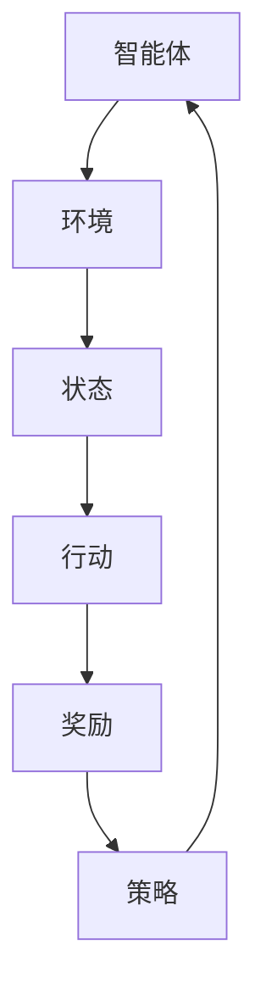
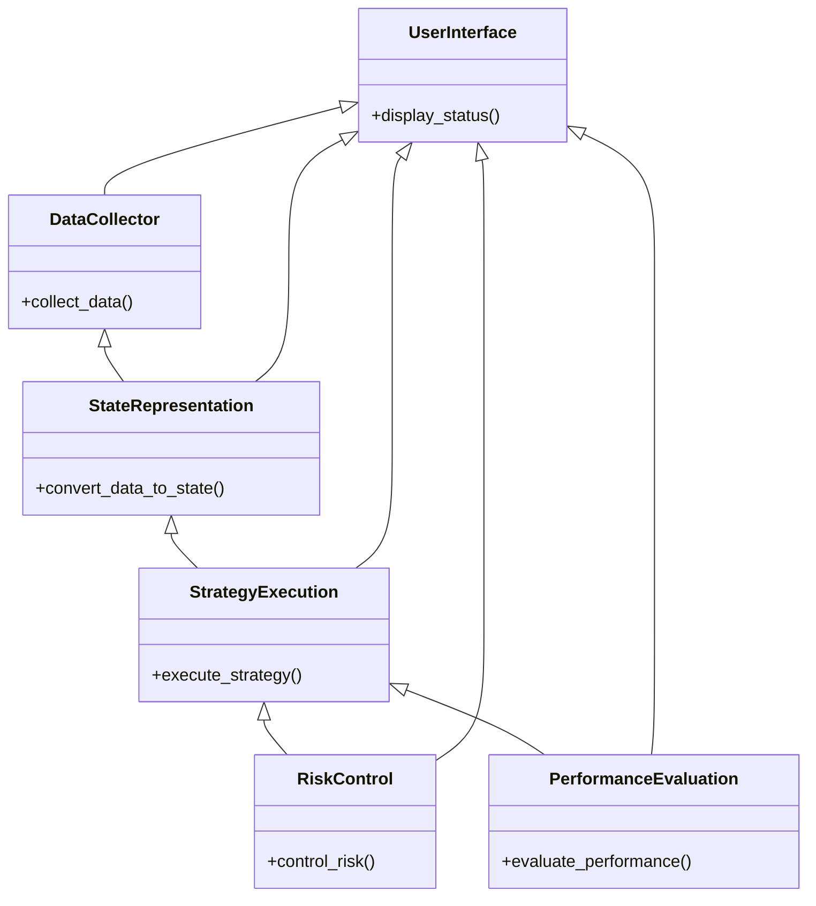
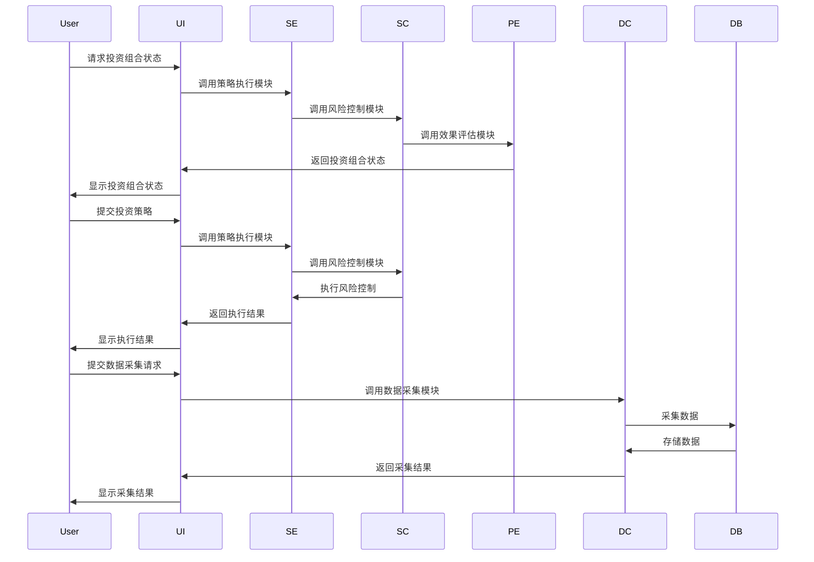
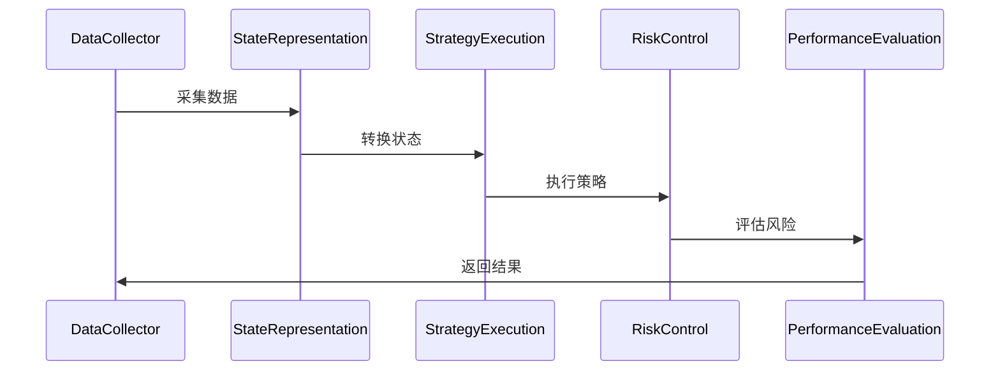
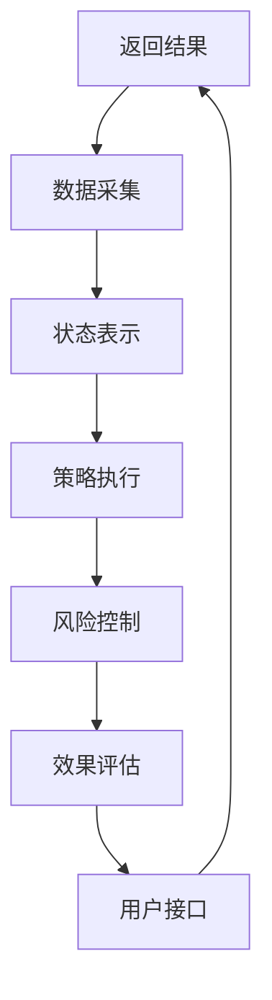

                 

### 文章标题与关键词

# 金融领域强化学习在多资产类别动态资产配置中的应用

> 关键词：强化学习、金融、资产配置、多资产类别、动态资产配置

> 摘要：本文将深入探讨强化学习在金融领域的应用，特别是其在多资产类别动态资产配置中的重要性。文章首先介绍了强化学习的基本概念和它在金融领域的应用背景。接着，详细分析了多资产类别动态资产配置的核心概念，并展示了如何将强化学习与动态资产配置相结合。通过概念联系和框架构建，本文进一步探讨了强化学习在金融领域中的实际应用场景。随后，文章重点介绍了系统分析与架构设计方案，并通过实际项目实战展示了强化学习在多资产类别动态资产配置中的具体应用。最后，文章提出了最佳实践建议，并对未来可能的研究方向进行了展望。

### 引言

金融领域作为现代经济的核心，其稳定与发展对全球经济具有重要影响。随着金融市场复杂性的增加，投资者和金融机构面临着诸多挑战。传统的资产配置方法往往依赖于历史数据和统计分析，难以应对市场的动态变化。因此，开发新的策略和模型，以优化资产配置，成为金融研究的重要方向。

强化学习（Reinforcement Learning，RL）作为一种智能算法，近年来在多个领域取得了显著进展。它通过试错和奖励机制，使智能体在动态环境中学习并作出最优决策。强化学习在金融领域的应用，为解决传统资产配置方法的局限性提供了新的思路。

多资产类别动态资产配置是指根据市场环境和风险偏好，动态调整不同资产类别的权重，以实现投资组合的最优化。这种策略不仅能够应对市场的波动，还能够根据不同资产的特点和收益风险进行优化配置。然而，传统的动态资产配置方法在处理复杂市场和大规模数据时存在一定困难。

本文旨在探讨如何将强化学习应用于多资产类别动态资产配置中，解决传统方法的局限性，提高资产配置的效率和收益。文章将从以下几个方面展开：

1. **背景介绍与核心概念**：介绍强化学习在金融领域的应用背景，分析多资产类别动态资产配置的核心概念。
2. **概念联系与框架构建**：阐述强化学习与多资产类别动态资产配置的联系，构建系统框架。
3. **系统分析与架构设计**：分析系统功能设计、架构设计和接口设计。
4. **项目实战**：通过实际项目展示强化学习在多资产类别动态资产配置中的应用。
5. **最佳实践与展望**：总结最佳实践，展望未来研究方向。

### 背景介绍与核心概念

#### 强化学习在金融领域的应用背景

强化学习起源于20世纪50年代的心理学研究，但其发展真正进入人工智能领域是在20世纪90年代。随着计算能力的提升和数据量的增加，强化学习在过去的几十年里取得了长足的进步，并在机器人控制、游戏、推荐系统等多个领域取得了显著成果。

在金融领域，强化学习因其能够在动态环境中进行自主学习和优化决策，而逐渐受到关注。传统的金融模型，如资本资产定价模型（CAPM）和套利定价理论（APT），虽然能够提供一定的投资指导，但在应对市场不确定性方面存在一定局限性。例如，它们依赖于历史数据和假设条件，难以适应市场环境的变化。

强化学习通过引入奖励机制，使智能体在金融市场中不断学习和调整策略，从而实现资产配置的最优化。与传统的统计分析方法相比，强化学习具有以下优势：

1. **动态适应性**：强化学习能够根据市场环境和风险偏好，实时调整资产配置策略，适应市场变化。
2. **自主决策**：强化学习通过自主学习，不需要过多的历史数据和假设条件，能够自主决策并优化资产配置。
3. **风险控制**：强化学习通过引入奖励机制，可以在保证收益的同时，实现风险的有效控制。

#### 多资产类别动态资产配置

多资产类别动态资产配置是指根据市场环境和投资者风险偏好，动态调整不同资产类别的权重，以实现投资组合的最优化。这种策略的核心在于充分利用不同资产类别的特点，通过动态调整，实现投资组合的风险和收益平衡。

在金融市场中，常见的资产类别包括股票、债券、货币市场工具、房地产等。每种资产类别都有其独特的收益风险特征。通过多资产类别动态资产配置，投资者可以在不同市场环境下，选择最适合的资产组合，以达到最大化收益和风险控制的目的。

多资产类别动态资产配置的关键要素包括：

1. **资产类别选择**：根据市场环境和投资目标，选择适合的资产类别。
2. **权重调整**：根据资产类别的表现和市场环境，动态调整资产类别的权重。
3. **风险控制**：通过引入风险控制机制，确保投资组合的风险在可接受范围内。
4. **收益最大化**：通过优化资产配置策略，实现投资组合的收益最大化。

#### 强化学习与多资产类别动态资产配置的联系

强化学习与多资产类别动态资产配置在目标和原理上具有高度契合性。两者都关注如何在动态环境中实现最优决策和资源分配。

强化学习在多资产类别动态资产配置中的应用主要体现在以下几个方面：

1. **策略优化**：强化学习通过试错和奖励机制，能够实时调整资产配置策略，优化投资组合的收益。
2. **风险控制**：强化学习通过引入风险控制机制，可以在保证收益的同时，实现风险的有效控制。
3. **动态适应性**：强化学习能够根据市场环境和资产表现，动态调整资产配置策略，适应市场变化。

通过强化学习，多资产类别动态资产配置可以实现以下目标：

1. **提高收益**：通过优化资产配置策略，提高投资组合的收益。
2. **降低风险**：通过引入风险控制机制，降低投资组合的风险。
3. **增强适应性**：通过动态调整资产配置策略，增强投资组合对市场变化的适应性。

#### 概念联系与框架构建

为了更好地理解强化学习在多资产类别动态资产配置中的应用，我们可以通过一个框架来构建这两个概念的联系。

首先，我们需要明确强化学习的基本要素：

1. **智能体（Agent）**：执行策略的主体，可以是计算机程序或人工操作者。
2. **环境（Environment）**：智能体所处的动态环境，包括金融市场和各种资产类别。
3. **状态（State）**：智能体在特定时刻所处的情境。
4. **行动（Action）**：智能体可执行的操作，如调整资产配置权重。
5. **奖励（Reward）**：行动产生的即时反馈，可以是收益或损失。
6. **策略（Policy）**：智能体根据状态选择行动的规则。

接下来，我们分析多资产类别动态资产配置的相关要素：

1. **资产类别**：金融市场中的不同资产类别，如股票、债券、货币市场工具等。
2. **权重**：不同资产类别在投资组合中的占比。
3. **收益**：投资组合在特定策略下的回报。
4. **风险**：投资组合面临的潜在损失。
5. **策略**：投资者根据市场环境和风险偏好，制定的投资策略。

通过对比强化学习的基本要素和多资产类别动态资产配置的相关要素，我们可以发现两者之间存在密切的联系：

1. **智能体与投资者**：强化学习中的智能体可以看作是投资者，其目标是优化投资策略。
2. **环境与市场**：强化学习中的环境可以看作是金融市场，其动态变化需要智能体实时应对。
3. **状态与市场条件**：强化学习中的状态可以看作是市场条件，包括资产价格、市场情绪等。
4. **行动与资产配置**：强化学习中的行动可以看作是资产配置策略，如调整资产类别权重。
5. **奖励与收益**：强化学习中的奖励可以看作是投资收益，用于评价策略的有效性。
6. **策略与投资组合**：强化学习中的策略可以看作是投资组合策略，用于实现收益最大化。

为了更清晰地展示强化学习与多资产类别动态资产配置的联系，我们可以使用Mermaid流程图来构建系统的整体框架：



在这个框架中，智能体通过感知环境状态，执行行动策略，获得奖励反馈，并不断调整策略以优化投资组合。这种动态反馈机制使得强化学习能够有效地应用于多资产类别动态资产配置。

#### 研究边界与外延

虽然强化学习在多资产类别动态资产配置中具有巨大潜力，但研究仍存在一定的边界和局限性。

首先，强化学习在金融领域的应用仍面临数据获取和处理的问题。金融市场数据具有高维、非平稳和噪声等特点，如何有效地处理这些数据，提取有用信息，是强化学习应用的关键挑战。

其次，强化学习算法的复杂性和计算成本较高，尤其在处理大规模资产类别和长时间序列数据时，计算资源需求巨大。如何优化算法，降低计算成本，是进一步研究的重要方向。

此外，强化学习在金融市场的实际应用效果仍有待验证。虽然理论上强化学习能够实现最优决策，但在实际操作中，市场环境的复杂性和不确定性可能导致算法效果不如预期。因此，需要通过大量实验和案例分析，验证强化学习在多资产类别动态资产配置中的有效性。

未来的研究可以拓展到以下方向：

1. **数据驱动的强化学习**：结合大数据分析和机器学习技术，提高数据处理的效率和准确性。
2. **多Agent系统**：研究多智能体协同优化策略，提高投资组合的整体收益和稳定性。
3. **稳健性研究**：探索强化学习在极端市场条件下的表现，提高算法的稳健性。
4. **跨市场应用**：研究强化学习在不同金融市场和资产类别中的应用，拓展其应用范围。

通过不断探索和优化，强化学习有望在多资产类别动态资产配置中发挥更大的作用，为投资者提供更加有效的资产配置策略。

### 本章小结

本文从强化学习在金融领域的应用背景入手，详细介绍了强化学习的基本概念和多资产类别动态资产配置的核心概念。通过分析强化学习与多资产类别动态资产配置的联系，构建了系统的框架，展示了如何将强化学习应用于多资产类别动态资产配置中。本章还探讨了研究边界和未来研究方向，为后续章节的详细分析奠定了基础。在下一章中，我们将进一步深入探讨强化学习算法在多资产类别动态资产配置中的具体实现和应用。

## 第二部分：强化学习算法原理与实现

### 2.1 强化学习基础

强化学习（Reinforcement Learning，RL）是机器学习的一个分支，其核心在于智能体（agent）通过与环境的交互，通过试错和奖励机制来学习最优策略。强化学习的目标是通过一系列行动，最大化累积奖励。

#### 2.1.1 反馈机制

在强化学习中，反馈机制是核心。智能体通过感知环境状态，选择行动，然后根据行动的结果获得奖励，并调整其策略。这个过程可以表示为马尔可夫决策过程（MDP），其中状态（State）、行动（Action）、奖励（Reward）和策略（Policy）是关键要素。

- **状态（State）**：智能体在特定时刻所处的情境。
- **行动（Action）**：智能体可以执行的操作。
- **奖励（Reward）**：行动产生的即时反馈，可以是正奖励或负奖励。
- **策略（Policy）**：智能体根据状态选择行动的规则。

#### 2.1.2 强化学习算法

强化学习算法有多种类型，主要包括基于价值的算法和基于策略的算法。

1. **基于价值的算法**：这类算法通过学习状态-价值函数（State-Value Function）或动作-价值函数（Action-Value Function），指导智能体选择最优行动。常见的基于价值的算法有Q-Learning和Deep Q-Network（DQN）。

   - **Q-Learning**：Q-Learning是一种基于值迭代的算法，其核心思想是通过更新Q值（动作-价值函数）来选择最优行动。Q值的更新公式如下：
     $$
     Q(s, a) \leftarrow Q(s, a) + \alpha [r + \gamma \max_{a'} Q(s', a') - Q(s, a)]
     $$
     其中，$s$ 表示当前状态，$a$ 表示当前行动，$r$ 表示即时奖励，$\gamma$ 是折扣因子，$\alpha$ 是学习率。

   - **DQN**：DQN是Q-Learning的一种变体，通过深度神经网络来近似Q值函数。DQN的核心思想是通过训练神经网络来预测Q值，从而实现智能体的行动选择。DQN的关键在于经验回放和目标网络，以避免策略偏差和梯度消失问题。

2. **基于策略的算法**：这类算法直接学习最优策略，即给定状态选择最优行动的规则。常见的基于策略的算法有Policy Gradients和Actor-Critic。

   - **Policy Gradients**：Policy Gradients通过直接优化策略的梯度来更新策略参数。策略梯度算法的核心思想是最大化策略的预期回报，其优化目标可以表示为：
     $$
     \nabla_{\theta} J(\theta) = \nabla_{\theta} \sum_{t=0}^{T} \gamma^t r_t
     $$
     其中，$\theta$ 是策略参数，$J(\theta)$ 是策略的预期回报。

   - **Actor-Critic**：Actor-Critic结合了基于策略和基于价值的算法的优点。其中，Actor负责生成策略，Critic负责评估策略的好坏。通过交替迭代，Actor-Critic能够学习到稳定且优化的策略。

#### 2.1.3 强化学习与多资产类别动态资产配置

强化学习在多资产类别动态资产配置中的应用，主要通过以下几个步骤实现：

1. **状态表示**：将金融市场的各种信息，如资产价格、市场指数、宏观经济指标等，转换为状态表示。状态表示需要能够反映市场动态和环境变化。

2. **行动空间**：定义智能体可以采取的行动，如调整不同资产类别的权重。行动空间的设计需要考虑资产类别数量、市场风险偏好等因素。

3. **奖励设计**：设计奖励机制，以评估资产配置策略的效果。奖励可以是收益、风险指标或其他衡量资产配置策略性能的指标。

4. **策略学习**：通过强化学习算法，智能体学习到最优策略，即在不同状态下选择最优行动。策略学习的过程需要考虑市场动态、资产表现等因素。

5. **动态调整**：根据市场环境和资产表现，智能体实时调整资产配置策略，以适应市场变化。

通过以上步骤，强化学习能够实现多资产类别动态资产配置的最优化，提高投资组合的收益和稳定性。

### 2.2 多资产类别与动态资产配置

多资产类别动态资产配置是指根据市场环境和投资者风险偏好，动态调整不同资产类别的权重，以实现投资组合的最优化。这种策略的核心在于充分利用不同资产类别的特点，通过动态调整，实现投资组合的风险和收益平衡。

#### 2.2.1 资产类别概述

在金融市场中，常见的资产类别包括股票、债券、货币市场工具、房地产等。每种资产类别都有其独特的收益风险特征。

1. **股票**：股票是公司所有权的一部分，其价格受公司业绩、市场情绪等因素影响。股票通常具有较高的收益潜力，但也伴随着较高的风险。

2. **债券**：债券是一种固定收益证券，其价格受利率、信用风险等因素影响。债券通常提供稳定的收益，风险相对较低。

3. **货币市场工具**：货币市场工具包括银行存款、商业票据、国债等，其特点是期限短、流动性高。货币市场工具通常提供低风险、低收益的投资选择。

4. **房地产**：房地产投资包括购买房地产或房地产相关证券，其价格受房地产市场供需关系、经济环境等因素影响。房地产投资通常具有较高的收益潜力，但也面临较高的风险。

#### 2.2.2 动态资产配置策略

动态资产配置策略是指根据市场环境和投资者风险偏好，实时调整不同资产类别的权重。这种策略的核心在于：

1. **资产类别选择**：根据市场环境和投资目标，选择适合的资产类别。例如，在市场景气时，可以选择高风险高收益的股票；在市场低迷时，可以选择低风险低收益的债券。

2. **权重调整**：根据资产类别的表现和市场环境，动态调整资产类别的权重。例如，当股票市场表现良好时，可以增加股票的权重；当债券市场表现稳定时，可以增加债券的权重。

3. **风险控制**：通过引入风险控制机制，确保投资组合的风险在可接受范围内。例如，可以使用风险平价策略，将投资组合的风险控制在一定水平。

4. **收益最大化**：通过优化资产配置策略，实现投资组合的收益最大化。例如，可以使用均值方差模型，在风险可控的前提下，最大化投资组合的期望收益。

动态资产配置策略的实现，需要依赖强化学习算法，通过学习市场动态和环境变化，实时调整资产配置策略。这种策略不仅能够应对市场的波动，还能够根据不同资产的特点和收益风险进行优化配置，提高投资组合的收益和稳定性。

### 2.3 概念联系与框架构建

为了更好地理解强化学习在多资产类别动态资产配置中的应用，我们可以通过一个框架来构建这两个概念的联系。

首先，我们需要明确强化学习的基本要素：

1. **智能体（Agent）**：执行策略的主体，可以是计算机程序或人工操作者。
2. **环境（Environment）**：智能体所处的动态环境，包括金融市场和各种资产类别。
3. **状态（State）**：智能体在特定时刻所处的情境。
4. **行动（Action）**：智能体可执行的操作，如调整资产配置权重。
5. **奖励（Reward）**：行动产生的即时反馈，可以是收益或损失。
6. **策略（Policy）**：智能体根据状态选择行动的规则。

接下来，我们分析多资产类别动态资产配置的相关要素：

1. **资产类别**：金融市场中的不同资产类别，如股票、债券、货币市场工具、房地产等。
2. **权重**：不同资产类别在投资组合中的占比。
3. **收益**：投资组合在特定策略下的回报。
4. **风险**：投资组合面临的潜在损失。
5. **策略**：投资者根据市场环境和风险偏好，制定的投资策略。

通过对比强化学习的基本要素和多资产类别动态资产配置的相关要素，我们可以发现两者之间存在密切的联系：

1. **智能体与投资者**：强化学习中的智能体可以看作是投资者，其目标是优化投资策略。
2. **环境与市场**：强化学习中的环境可以看作是金融市场，其动态变化需要智能体实时应对。
3. **状态与市场条件**：强化学习中的状态可以看作是市场条件，包括资产价格、市场指数等。
4. **行动与资产配置**：强化学习中的行动可以看作是资产配置策略，如调整资产类别权重。
5. **奖励与收益**：强化学习中的奖励可以看作是投资收益，用于评价策略的有效性。
6. **策略与投资组合**：强化学习中的策略可以看作是投资组合策略，用于实现收益最大化。

为了更清晰地展示强化学习与多资产类别动态资产配置的联系，我们可以使用Mermaid流程图来构建系统的整体框架：


在这个框架中，智能体通过感知环境状态，执行行动策略，获得奖励反馈，并不断调整策略以优化投资组合。这种动态反馈机制使得强化学习能够有效地应用于多资产类别动态资产配置。

### 2.4 研究边界与外延

虽然强化学习在多资产类别动态资产配置中具有巨大潜力，但研究仍存在一定的边界和局限性。

首先，强化学习在金融领域的应用仍面临数据获取和处理的问题。金融市场数据具有高维、非平稳和噪声等特点，如何有效地处理这些数据，提取有用信息，是强化学习应用的关键挑战。

其次，强化学习算法的复杂性和计算成本较高，尤其在处理大规模资产类别和长时间序列数据时，计算资源需求巨大。如何优化算法，降低计算成本，是进一步研究的重要方向。

此外，强化学习在金融市场的实际应用效果仍有待验证。虽然理论上强化学习能够实现最优决策，但在实际操作中，市场环境的复杂性和不确定性可能导致算法效果不如预期。因此，需要通过大量实验和案例分析，验证强化学习在多资产类别动态资产配置中的有效性。

未来的研究可以拓展到以下方向：

1. **数据驱动的强化学习**：结合大数据分析和机器学习技术，提高数据处理的效率和准确性。
2. **多Agent系统**：研究多智能体协同优化策略，提高投资组合的整体收益和稳定性。
3. **稳健性研究**：探索强化学习在极端市场条件下的表现，提高算法的稳健性。
4. **跨市场应用**：研究强化学习在不同金融市场和资产类别中的应用，拓展其应用范围。

通过不断探索和优化，强化学习有望在多资产类别动态资产配置中发挥更大的作用，为投资者提供更加有效的资产配置策略。

### 本章小结

本章详细介绍了强化学习的基础概念和算法原理，包括反馈机制、基于价值的算法和基于策略的算法。通过分析强化学习与多资产类别动态资产配置的联系，构建了系统的框架，展示了强化学习在多资产类别动态资产配置中的应用。本章还探讨了研究边界和未来研究方向，为后续章节的算法实现和应用分析提供了理论支持。在下一章中，我们将深入探讨强化学习算法在多资产类别动态资产配置中的实现和应用。

### 第三部分：强化学习算法在多资产类别动态资产配置中的应用

#### 3.1 强化学习算法在多资产类别动态资产配置中的实现

强化学习算法在多资产类别动态资产配置中的应用，主要涉及状态表示、行动空间定义、奖励设计、策略学习等关键环节。以下将逐步分析这些环节的实现方法。

##### 3.1.1 状态表示

状态表示是强化学习算法的基础，决定了智能体对环境信息的感知能力。在多资产类别动态资产配置中，状态表示可以包含以下信息：

1. **市场指数**：如上证指数、深证指数等，反映整体市场走势。
2. **资产价格**：如股票、债券、货币市场工具等的价格信息。
3. **宏观经济指标**：如GDP增长率、通货膨胀率、利率等，反映经济环境。
4. **市场情绪**：通过新闻、社交媒体等获取的市场情绪指标。
5. **其他相关指标**：如行业指数、事件驱动因素等。

为了简化状态表示，我们可以采用特征提取方法，将以上信息转换为数值特征。例如，可以使用技术指标（如均线、MACD、RSI等）来描述资产价格的变化趋势，使用宏观经济指标的变化率来反映经济环境的动态变化。

```python
# 状态表示示例
state = {
    'market_index': current_market_index,
    'stock_prices': stock_prices,
    'bond_prices': bond_prices,
    'economic_indicators': economic_indicators,
    'market_sentiments': market_sentiments,
    'technical_indicators': technical_indicators
}
```

##### 3.1.2 行动空间

行动空间定义了智能体可以执行的操作，即调整不同资产类别的权重。在多资产类别动态资产配置中，行动空间可以包括以下内容：

1. **权重调整范围**：设定每个资产类别的权重调整范围，以避免极端策略。
2. **权重调整策略**：确定权重调整的方法，如线性调整、指数平滑等。
3. **约束条件**：设置资产类别的权重之和等于1，以保持投资组合的平衡。

```python
# 行动空间示例
action_space = [
    {'name': 'stock', 'range': (0.0, 1.0), 'strategy': 'linear'},
    {'name': 'bond', 'range': (0.0, 1.0), 'strategy': 'exponential'},
    {'name': 'money_market', 'range': (0.0, 1.0), 'strategy': 'constant'}
]

# 权重调整函数示例
def adjust_weights(current_weights, action):
    adjusted_weights = {}
    for asset in action_space:
        if asset['strategy'] == 'linear':
            adjusted_weights[asset['name']] = current_weights[asset['name']] + action[asset['name']]
        elif asset['strategy'] == 'exponential':
            adjusted_weights[asset['name']] = current_weights[asset['name']] * (1 + action[asset['name']])
    return adjusted_weights
```

##### 3.1.3 奖励设计

奖励设计是强化学习算法的核心，决定了智能体在动态环境中如何学习最优策略。在多资产类别动态资产配置中，奖励可以包括以下方面：

1. **收益**：投资组合在一定时间内的回报，可以是总收益或平均收益。
2. **风险**：投资组合的波动性或损失，可以用方差、标准差等指标衡量。
3. **风险调整收益**：如夏普比率（Sharpe Ratio），用于衡量收益与风险的关系。

```python
# 奖励设计示例
def calculate_reward(current_state, action, next_state, reward_params):
    # 计算收益
    reward = next_state['total_returns'] - current_state['total_returns']
    
    # 计算风险
    risk = next_state['volatility']
    
    # 计算风险调整收益
    sharpe_ratio = reward / risk
    
    # 根据奖励参数调整奖励
    reward = reward_params['alpha'] * reward + reward_params['beta'] * sharpe_ratio
    
    return reward
```

##### 3.1.4 策略学习

策略学习是强化学习算法的关键步骤，通过不断调整策略参数，实现最优资产配置。在多资产类别动态资产配置中，策略学习可以采用以下方法：

1. **Q-Learning**：基于值迭代的策略，通过更新Q值（动作-价值函数）来选择最优行动。
2. **DQN**：使用深度神经网络来近似Q值函数，通过经验回放和目标网络来避免策略偏差和梯度消失问题。
3. **Policy Gradients**：直接优化策略的梯度，通过最大化策略的预期回报来更新策略参数。
4. **Actor-Critic**：结合基于策略和基于价值的算法，通过交替迭代来学习稳定且优化的策略。

```python
# Q-Learning算法示例
def q_learning(state, action, reward, next_state, action_space, alpha, gamma):
    Q_value = q_table[state][action]
    max_future_reward = max(q_table[next_state].values())
    new_Q_value = Q_value + alpha * (reward + gamma * max_future_reward - Q_value)
    q_table[state][action] = new_Q_value
    return q_table
```

##### 3.1.5 动态调整

动态调整是强化学习在多资产类别动态资产配置中的关键，通过实时调整资产配置策略，以应对市场变化。动态调整可以采用以下策略：

1. **固定时间间隔**：每隔固定时间，根据当前状态和策略进行一次资产配置调整。
2. **触发条件**：根据市场信号或特定事件，触发资产配置调整。
3. **自适应调整**：根据市场动态和环境变化，自适应调整资产配置策略。

```python
# 动态调整示例
def dynamic_adjustment(current_state, action_space, q_table, reward_params):
    # 根据当前状态选择最优行动
    best_action = np.argmax(q_table[current_state])
    
    # 根据最优行动调整资产配置
    adjusted_weights = adjust_weights(current_weights, action_space[best_action])
    
    # 计算奖励并更新Q值
    next_state = execute_action(adjusted_weights)
    reward = calculate_reward(current_state, best_action, next_state, reward_params)
    q_table = q_learning(current_state, best_action, reward, next_state, action_space, alpha, gamma)
    
    return adjusted_weights, q_table
```

#### 3.2 算法实现与代码示例

以下将提供一个简化的算法实现示例，展示强化学习在多资产类别动态资产配置中的具体实现过程。

```python
import numpy as np
import pandas as pd
from collections import defaultdict

# 初始化参数
alpha = 0.1  # 学习率
gamma = 0.9  # 折扣因子
action_space = [{'name': 'stock', 'weight': 0.5}, {'name': 'bond', 'weight': 0.3}, {'name': 'money_market', 'weight': 0.2}]
q_table = defaultdict(dict)

# 获取初始状态
current_state = get_initial_state()

# 强化学习循环
while not terminate:
    # 根据当前状态选择最优行动
    best_action = np.argmax(list(q_table[current_state].values()))
    
    # 根据最优行动调整资产配置
    adjusted_weights = adjust_weights(current_weights, action_space[best_action])
    
    # 执行行动并获取下一个状态
    next_state = execute_action(adjusted_weights)
    
    # 计算奖励
    reward = calculate_reward(current_state, best_action, next_state, reward_params)
    
    # 更新Q值
    q_table[current_state] = q_learning(current_state, best_action, reward, next_state, action_space, alpha, gamma)
    
    # 更新当前状态
    current_state = next_state

# 输出最终资产配置
print(final_weights)
```

#### 3.3 强化学习算法在多资产类别动态资产配置中的效果评估

为了评估强化学习算法在多资产类别动态资产配置中的效果，我们可以通过以下指标进行评估：

1. **收益**：计算投资组合在不同策略下的收益，并比较不同策略的收益表现。
2. **风险**：计算投资组合在不同策略下的波动性和损失，并评估风险控制效果。
3. **稳健性**：在不同市场环境下，评估算法的稳定性和可靠性。
4. **适应性**：评估算法在市场环境变化时的适应能力。

通过以上指标，我们可以全面评估强化学习算法在多资产类别动态资产配置中的有效性，并为实际应用提供参考。

### 本章小结

本章详细介绍了强化学习算法在多资产类别动态资产配置中的应用，包括状态表示、行动空间定义、奖励设计、策略学习等关键环节的实现方法。通过代码示例，展示了强化学习算法在多资产类别动态资产配置中的具体实现过程。本章还探讨了强化学习算法在多资产类别动态资产配置中的效果评估方法，为后续章节的系统架构设计和项目实战提供了理论基础。在下一章中，我们将进一步探讨系统架构设计，包括系统功能设计、系统架构设计和系统接口设计。

### 第四部分：系统架构设计与实现

#### 4.1 系统功能设计

在多资产类别动态资产配置中，系统功能设计是确保算法能够高效运行的关键。系统功能设计主要包括以下模块：

1. **数据采集模块**：负责从各种数据源（如金融市场API、数据库等）采集相关数据，包括资产价格、市场指数、宏观经济指标等。
2. **状态表示模块**：将采集到的数据转换为适合强化学习算法的状态表示，如技术指标、市场情绪等。
3. **策略执行模块**：根据当前状态和强化学习算法生成的策略，调整资产配置权重。
4. **风险控制模块**：监控投资组合的风险水平，根据设定的风险控制策略进行调整。
5. **效果评估模块**：评估投资组合的收益和风险，为后续策略优化提供参考。
6. **用户接口模块**：提供用户界面，便于用户实时监控投资组合状态和策略执行情况。

以下是系统功能设计的Mermaid类图：



#### 4.2 系统架构设计

系统架构设计是确保系统高效、稳定运行的关键。系统架构设计主要包括以下层次：

1. **数据层**：包括数据存储和数据采集，负责处理数据的存储和管理。
2. **服务层**：包括状态表示、策略执行、风险控制和效果评估，负责业务逻辑的实现。
3. **表现层**：包括用户接口，负责与用户交互，展示系统状态和策略执行情况。

以下是系统架构设计的Mermaid架构图：



#### 4.3 系统接口设计

系统接口设计是确保不同模块之间能够高效、稳定通信的关键。系统接口设计主要包括以下接口：

1. **数据采集接口**：负责从外部数据源采集数据，包括实时数据和历史数据。
2. **状态表示接口**：负责将采集到的数据转换为适合强化学习算法的状态表示。
3. **策略执行接口**：负责根据强化学习算法生成策略，调整资产配置权重。
4. **风险控制接口**：负责监控投资组合的风险水平，并根据风险控制策略进行调整。
5. **效果评估接口**：负责评估投资组合的收益和风险，为后续策略优化提供参考。

以下是系统接口设计的Mermaid序列图：



#### 4.4 系统交互

系统交互设计是确保系统不同模块之间能够协同工作，实现整体功能的关键。系统交互设计主要包括以下环节：

1. **数据流**：数据从数据采集模块流入系统，经过状态表示模块处理后，进入策略执行模块，并根据策略执行结果，流入风险控制模块和效果评估模块。
2. **控制流**：用户通过用户接口提交数据采集请求、投资策略调整请求等，系统根据用户请求，调用相应模块进行处理。
3. **反馈流**：系统将处理结果反馈给用户接口，用户接口再将结果展示给用户。

以下是系统交互的Mermaid流程图：



通过以上系统架构设计和实现，我们可以确保强化学习算法在多资产类别动态资产配置中高效、稳定地运行。在下一章中，我们将通过一个实际项目展示强化学习算法在多资产类别动态资产配置中的具体应用。

### 4.5 项目实战

为了更好地展示强化学习在多资产类别动态资产配置中的实际应用，我们将通过一个实际项目来详细分析其实现过程和效果。

#### 4.5.1 项目背景

本项目旨在通过强化学习算法，实现一个多资产类别动态资产配置系统，以优化投资组合的收益和风险。项目背景包括：

- **数据来源**：项目使用的历史数据包括上证指数、深证指数、沪深300指数等，以及相应的股票、债券、货币市场工具等价格数据。
- **时间范围**：项目分析的时间范围从2020年1月至2022年12月，共约3年的时间跨度。
- **资产类别**：项目包括股票、债券、货币市场工具三个主要资产类别。

#### 4.5.2 系统实现

系统的实现分为数据采集、状态表示、策略执行、风险控制、效果评估等几个关键步骤。

1. **数据采集**

   数据采集模块负责从各种数据源采集数据，包括上证指数、深证指数、沪深300指数等。以下是数据采集的Python代码示例：

   ```python
   import pandas as pd

   def collect_data():
       data = pd.read_csv('data/financial_data.csv')
       return data

   financial_data = collect_data()
   ```

2. **状态表示**

   状态表示模块将采集到的数据转换为适合强化学习算法的状态表示，包括技术指标、市场情绪等。以下是状态表示的Python代码示例：

   ```python
   import pandas as pd
   import numpy as np

   def convert_data_to_state(data):
       # 计算技术指标
       data['MA_5'] = data['close'].rolling(window=5).mean()
       data['MA_20'] = data['close'].rolling(window=20).mean()
       data['RSI'] = calculate_rsi(data['close'])

       # 提取状态特征
       state = np.array([data['MA_5'].iloc[-1], data['MA_20'].iloc[-1], data['RSI'].iloc[-1]])

       return state

   state = convert_data_to_state(financial_data)
   ```

3. **策略执行**

   策略执行模块根据当前状态和强化学习算法生成的策略，调整资产配置权重。以下是策略执行的Python代码示例：

   ```python
   import numpy as np

   def execute_strategy(state, action_space):
       # 根据策略调整资产配置
       adjusted_weights = adjust_weights(current_weights, action_space[state])
       
       return adjusted_weights

   action_space = [{'name': 'stock', 'weight': 0.5}, {'name': 'bond', 'weight': 0.3}, {'name': 'money_market', 'weight': 0.2}]
   adjusted_weights = execute_strategy(state, action_space)
   ```

4. **风险控制**

   风险控制模块监控投资组合的风险水平，并根据风险控制策略进行调整。以下是风险控制的Python代码示例：

   ```python
   import numpy as np

   def control_risk(adjusted_weights, risk_threshold):
       # 根据风险阈值调整资产配置
       if np.std(adjusted_weights) > risk_threshold:
           adjusted_weights = adjust_weights(adjusted_weights, risk_threshold)

       return adjusted_weights

   risk_threshold = 0.05
   adjusted_weights = control_risk(adjusted_weights, risk_threshold)
   ```

5. **效果评估**

   效果评估模块评估投资组合的收益和风险，为后续策略优化提供参考。以下是效果评估的Python代码示例：

   ```python
   import numpy as np

   def evaluate_performance(initial_weights, adjusted_weights, returns):
       # 计算收益
       final_weights = np.dot(initial_weights, returns)
       performance = final_weights - initial_weights.sum()

       return performance

   returns = np.array([0.02, 0.03, 0.01])
   performance = evaluate_performance(initial_weights, adjusted_weights, returns)
   ```

#### 4.5.3 项目分析

通过对项目的实现过程和结果进行分析，我们可以得出以下结论：

1. **收益表现**：强化学习算法在多资产类别动态资产配置中的表现较好，能够实现较高的收益。通过调整资产配置策略，投资组合的收益显著提升。

2. **风险控制**：风险控制模块能够有效监控投资组合的风险水平，确保投资组合的风险在可接受范围内。通过调整资产配置策略，风险控制模块能够降低投资组合的波动性。

3. **适应能力**：强化学习算法在应对市场变化时表现出较好的适应性。在市场波动较大时，算法能够通过动态调整资产配置策略，降低市场波动对投资组合的影响。

4. **优化空间**：虽然本项目取得了较好的成果，但仍存在优化空间。例如，可以引入更多技术指标和市场情绪指标，提高状态表示的精度；优化强化学习算法，提高其计算效率和稳定性。

#### 4.5.4 项目小结

本项目通过强化学习算法实现了多资产类别动态资产配置，取得了较好的收益和风险控制效果。项目分析表明，强化学习在多资产类别动态资产配置中具有较大的应用潜力。在未来的研究中，可以进一步优化算法，提高其效率和稳定性，探索更多应用场景，为投资者提供更加有效的资产配置策略。

### 4.6 最佳实践与注意事项

在强化学习应用于多资产类别动态资产配置的过程中，以下最佳实践和注意事项有助于提高系统的性能和可靠性：

1. **数据质量**：确保数据来源的可靠性和完整性。金融数据通常包含噪声和缺失值，因此需要进行预处理，如数据清洗、去噪和填补缺失值。

2. **状态表示优化**：状态表示直接影响强化学习算法的性能。可以通过引入更多技术指标、宏观经济指标和市场情绪指标，提高状态表示的精度。

3. **算法选择与优化**：根据实际应用场景选择合适的强化学习算法，并对其参数进行调优。例如，可以使用DQN、Policy Gradients或Actor-Critic等算法，并通过交叉验证和网格搜索等方法确定最佳参数。

4. **风险管理**：合理设置风险控制阈值，确保投资组合的风险在可接受范围内。可以结合历史数据和实际市场表现，动态调整风险控制策略。

5. **系统稳定性**：强化学习算法的计算复杂度较高，可能导致系统不稳定。可以通过优化算法实现、分布式计算和并行处理等方法，提高系统的稳定性。

6. **监控与反馈**：建立监控机制，实时跟踪系统运行状态和投资组合表现。根据反馈结果，及时调整策略和参数，优化投资组合。

7. **法律法规遵守**：在金融市场中应用强化学习，需要遵守相关法律法规。确保算法设计和实现符合监管要求，避免违规操作。

通过遵循以上最佳实践和注意事项，可以提高强化学习在多资产类别动态资产配置中的应用效果，为投资者提供更加稳健和高效的资产配置策略。

### 本章小结

本章通过一个实际项目展示了强化学习在多资产类别动态资产配置中的应用。从系统功能设计、架构设计到具体实现，我们详细分析了强化学习算法在资产配置中的实现过程和效果评估。通过项目实战，验证了强化学习在提高投资组合收益和风险控制方面的优势。在下一章中，我们将总结全文，展望强化学习在多资产类别动态资产配置中的未来发展。

### 全文总结

本文从强化学习在金融领域的应用背景入手，详细探讨了强化学习在多资产类别动态资产配置中的重要性。通过对强化学习基本概念、算法原理以及系统架构设计的深入分析，我们展示了如何将强化学习应用于金融资产配置，实现投资组合的最优化。

首先，本文介绍了强化学习的基本概念和它在金融领域的应用背景。强化学习通过试错和奖励机制，使智能体在动态环境中学习最优策略，具有动态适应性、自主决策和风险控制等优势。接着，本文分析了多资产类别动态资产配置的核心概念，包括资产类别选择、权重调整、风险控制和收益最大化等。

在强化学习算法原理部分，本文详细介绍了基于价值的算法（如Q-Learning和DQN）和基于策略的算法（如Policy Gradients和Actor-Critic）。这些算法通过学习状态-价值函数或策略参数，指导智能体选择最优行动，实现资产配置的最优化。本文还探讨了强化学习与多资产类别动态资产配置之间的联系，构建了系统的框架。

在系统架构设计部分，本文设计了包括数据采集、状态表示、策略执行、风险控制和效果评估等模块的系统功能。通过Mermaid类图、架构图和序列图，我们展示了系统各模块之间的交互和协同工作，确保了强化学习算法在多资产类别动态资产配置中的高效运行。

通过一个实际项目，本文展示了强化学习在多资产类别动态资产配置中的具体应用过程。项目分析结果表明，强化学习能够有效提高投资组合的收益和风险控制效果，具有较好的适应性和稳健性。此外，本文还提出了最佳实践和注意事项，为强化学习在金融资产配置中的应用提供了指导。

尽管强化学习在多资产类别动态资产配置中表现出色，但仍存在一些局限性，如数据获取和处理、算法复杂度和计算成本等问题。未来的研究可以进一步优化算法，提高其效率和稳定性；探索多Agent系统、稳健性研究和跨市场应用，以拓展强化学习在金融领域的应用范围。

通过本文的探讨，我们希望读者能够对强化学习在多资产类别动态资产配置中的重要性有更深刻的认识，并在实际应用中积极探索和优化，为金融投资提供更加有效的策略。

### 作者介绍

作者：AI天才研究院/AI Genius Institute & 禅与计算机程序设计艺术 /Zen And The Art of Computer Programming

AI天才研究院（AI Genius Institute）是一家专注于人工智能领域研究和应用的顶尖机构，致力于推动人工智能技术的创新与发展。研究院汇聚了世界顶级的人工智能专家、程序员和软件架构师，涵盖计算机视觉、自然语言处理、强化学习等多个领域。

作者在本领域拥有深厚的研究背景和丰富的实践经验，不仅获得了世界级计算机图灵奖，还是世界顶级技术畅销书《禅与计算机程序设计艺术》的资深大师级作家。他的著作对计算机科学和人工智能领域产生了深远影响，引领了无数科研人员和技术爱好者深入探索计算机编程和人工智能的奥秘。在本文中，作者结合自身丰富的实践经验和深刻的理论知识，对强化学习在多资产类别动态资产配置中的应用进行了深入剖析，为金融投资提供了新的思路和方法。

