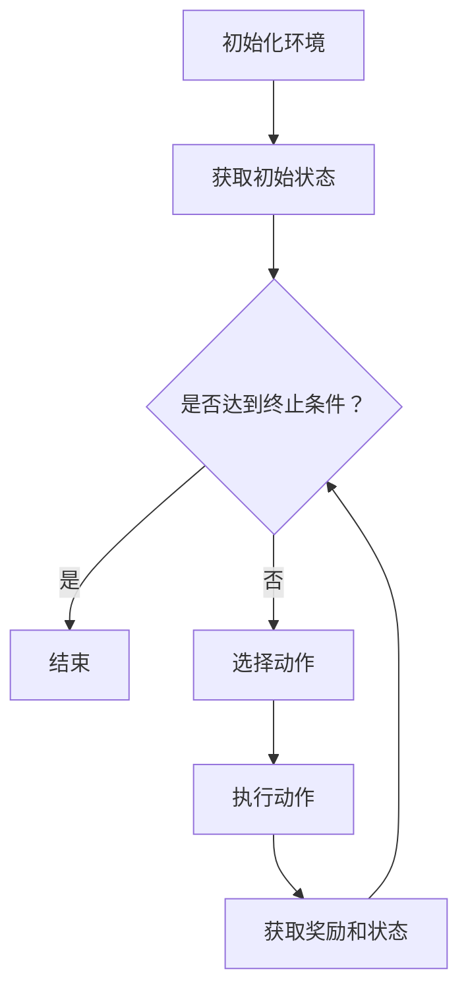
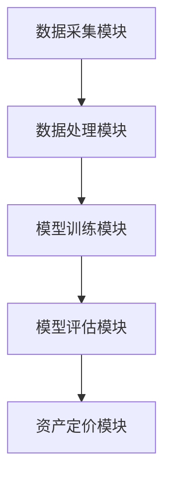
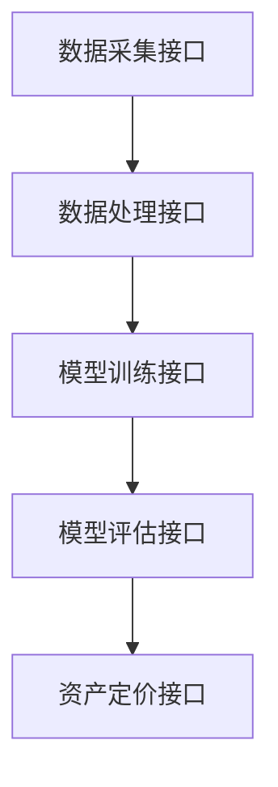

                 


### 第一部分：背景介绍

#### 1.1 问题背景

在金融领域，资产定价是一个复杂且重要的问题。传统的资产定价模型，如资本资产定价模型（CAPM）和套利定价理论（APT），虽然在一定程度上能够解释市场行为，但仍然存在一些局限性。例如，它们通常假设市场是有效的，投资者是理性的，但这些假设在现实中往往并不成立。此外，这些模型往往缺乏灵活性，难以适应快速变化的市场环境。

强化学习作为一种人工智能技术，通过智能体与环境的交互，不断学习和优化策略，逐渐提高决策的质量。强化学习在金融领域的应用，为解决资产定价问题提供了一种新的思路。它能够更好地适应市场的动态变化，捕捉市场中的复杂关系，从而提高资产定价的准确性。

#### 1.2 问题描述

资产定价的核心问题是确定资产的未来价格。具体来说，就是找到一个价格，使得市场上的所有投资者在理性决策的前提下，对该资产的需求和供给达到平衡。这个过程涉及到多个因素，包括市场情绪、宏观经济指标、公司基本面等。

然而，传统的资产定价模型往往忽略了这些因素，导致预测结果不够准确。强化学习通过模拟投资者的行为，结合市场数据，逐步学习出最优的定价策略。在这个过程中，强化学习能够自动调整策略，以适应市场的变化，从而提高定价的准确性。

#### 1.3 问题解决

强化学习在资产定价中的应用，主要是通过建立一个包含市场数据的仿真环境，让智能体在这个环境中不断学习和优化定价策略。具体来说，可以遵循以下步骤：

1. **环境建模**：首先，需要建立一个能够模拟市场环境的仿真系统。这个系统应该能够提供市场数据，包括股票价格、宏观经济指标、公司基本面等。

2. **智能体设计**：智能体是强化学习中的核心组成部分，它负责接收环境反馈，并根据反馈调整自己的策略。在资产定价中，智能体可以看作是一个投资者，它需要根据市场数据，决定买入、卖出或持有某种资产。

3. **策略学习**：智能体通过与环境的交互，不断学习最优的定价策略。在这个过程中，智能体会遇到奖励和惩罚。如果智能体的定价策略能够使得资产价格更加稳定，那么它会获得奖励；反之，则会受到惩罚。

4. **策略优化**：智能体在长期的学习过程中，会不断优化自己的定价策略。通过调整策略参数，使得定价策略更加准确和稳定。

5. **定价应用**：最后，将智能体的定价策略应用于实际市场，对资产进行定价。通过不断调整和优化，使得定价结果更加接近实际市场价格。

#### 1.4 边界与外延

强化学习在资产定价中的应用，主要适用于那些数据量大、市场动态变化快的金融产品。例如，股票、期货、外汇等。同时，它也适用于那些需要对市场进行实时监测和预测的金融机构。

然而，强化学习在资产定价中的应用也面临一些挑战。首先，市场数据的真实性和准确性难以保证。其次，智能体的学习过程需要大量的计算资源和时间。此外，智能体的决策过程可能存在不确定性，需要通过多种策略进行平衡。

#### 1.5 概念结构与核心要素组成

强化学习在资产定价中的应用，涉及以下几个核心概念和要素：

1. **环境**：市场环境，提供市场数据。
2. **智能体**：投资者，负责接收市场数据，并根据数据调整定价策略。
3. **状态**：市场状态，包括股票价格、宏观经济指标、公司基本面等。
4. **动作**：智能体的决策，包括买入、卖出、持有等。
5. **奖励**：市场对智能体决策的反馈，用于调整智能体的策略。
6. **策略**：智能体的决策规则，用于指导智能体的行动。

这些概念和要素共同构成了强化学习在资产定价中的应用体系，为解决资产定价问题提供了新的思路和方法。

### 第二部分：核心概念与联系

#### 2.1 强化学习

强化学习是一种基于奖励反馈的人工智能技术，通过智能体与环境的交互，不断学习和优化策略，以实现最优决策。在强化学习中，智能体需要通过不断地尝试和错误，找到最优的策略。

强化学习的主要组成部分包括：

1. **智能体（Agent）**：执行动作的实体。
2. **环境（Environment）**：智能体执行动作的环境。
3. **状态（State）**：智能体在环境中的当前情况。
4. **动作（Action）**：智能体可以执行的操作。
5. **奖励（Reward）**：环境对智能体动作的反馈。
6. **策略（Policy）**：智能体在特定状态下的最优动作。

强化学习的过程可以描述为：智能体根据当前状态，选择一个动作，然后执行这个动作，得到环境的反馈（奖励），并根据反馈调整自己的策略。

#### 2.2 资产定价

资产定价是金融领域中的一个核心问题，旨在确定资产的未来价格。资产定价的准确性对投资决策和风险管理具有重要意义。

资产定价主要考虑以下因素：

1. **风险**：资产的未来收益可能存在不确定性，风险是影响资产定价的重要因素。
2. **预期收益**：投资者对资产未来收益的预期，会影响资产的定价。
3. **市场情绪**：市场的整体情绪，如乐观或悲观，也会对资产定价产生影响。
4. **宏观经济指标**：如GDP、通货膨胀率等宏观经济指标，也会影响资产定价。

资产定价的方法主要包括：

1. **历史数据分析**：通过分析资产的历史价格和交易数据，预测资产的未来价格。
2. **模型定价**：使用如资本资产定价模型（CAPM）、套利定价理论（APT）等模型，对资产进行定价。
3. **市场情绪分析**：通过分析市场情绪，预测资产的未来价格。

#### 2.3 金融领域应用

强化学习在金融领域的应用主要包括以下几个方面：

1. **资产定价**：通过强化学习，可以更准确地预测资产的未来价格，为投资决策提供依据。
2. **风险管理**：强化学习可以帮助金融机构更好地识别和管理风险，提高风险管理水平。
3. **交易策略优化**：通过强化学习，可以优化交易策略，提高交易收益。
4. **市场预测**：强化学习可以预测市场的趋势，为市场分析和投资决策提供支持。

强化学习在金融领域的应用，主要是通过建立一个包含市场数据的仿真环境，让智能体在这个环境中不断学习和优化策略，从而实现资产定价、风险管理等目标。

### 第三部分：算法原理讲解

#### 3.1 算法流程图

为了更好地理解强化学习在资产定价中的应用，我们可以通过一个算法流程图来描述整个过程。以下是强化学习在资产定价中的基本流程图：



在这个流程图中，智能体首先初始化环境，然后获取初始状态。接着，智能体会根据当前状态选择一个动作，执行这个动作，并获取环境的反馈（奖励和状态）。根据反馈，智能体会调整自己的策略，并重复这个过程，直到达到终止条件。

#### 3.2 Python源代码解释

下面是一个简单的Python示例，展示如何使用强化学习进行资产定价。在这个示例中，我们使用了一个简单的环境，智能体需要在两个股票之间进行选择。

```python
import numpy as np
import random

# 初始化环境
initial_state = 0
state = initial_state
actions = ['Buy Stock A', 'Buy Stock B']
rewards = {'Buy Stock A': 0, 'Buy Stock B': 0}

# 强化学习主循环
for episode in range(1000):
    for step in range(100):
        # 选择动作
        action = random.choice(actions)
        # 执行动作
        state = execute_action(state, action)
        # 获取奖励
        reward = get_reward(state)
        # 更新奖励
        rewards[action] += reward
        # 输出当前状态和奖励
        print(f"Episode: {episode}, Step: {step}, State: {state}, Action: {action}, Reward: {reward}")

# 输出最终奖励
print(f"Final Rewards: {rewards}")
```

在这个示例中，`execute_action`函数用于执行智能体的动作，`get_reward`函数用于获取环境的奖励。通过这个简单的示例，我们可以看到强化学习在资产定价中的基本流程。

#### 3.3 数学模型和公式

强化学习在资产定价中的应用，通常涉及到以下数学模型和公式：

1. **状态转移概率**：描述智能体在不同状态之间的转移概率。公式如下：

   $$ P(S_{t+1} = s_{t+1} | S_t = s_t, A_t = a_t) $$

2. **奖励函数**：描述智能体在执行某个动作后获得的奖励。公式如下：

   $$ R(S_t, A_t) = reward $$

3. **策略更新**：描述智能体根据奖励调整策略的过程。公式如下：

   $$ \theta_{t+1} = \theta_t + \alpha \times (R(S_t, A_t) - \theta_t(S_t, A_t)) $$

其中，$\theta_t$表示智能体在时刻$t$的策略，$\alpha$表示学习率。

通过这些数学模型和公式，我们可以建立强化学习在资产定价中的数学模型，并进一步优化和调整策略。

#### 3.4 举例说明

为了更好地理解强化学习在资产定价中的应用，我们可以通过一个简单的例子来说明。

假设有一个市场，其中只有两种股票A和B。智能体的目标是选择买入股票A或股票B，以最大化长期收益。

1. **初始状态**：智能体持有现金，可以选择买入股票A或股票B。
2. **动作**：买入股票A或买入股票B。
3. **状态转移概率**：股票A和股票B的价格变化具有随机性，智能体根据历史数据预测价格变化。
4. **奖励函数**：如果智能体选择买入的股票价格上升，则获得正奖励；如果价格下降，则获得负奖励。

通过这个例子，我们可以看到强化学习在资产定价中的基本流程。智能体通过不断学习和调整策略，逐步提高预测的准确性，从而实现资产定价的目标。

### 第四部分：系统分析与架构设计方案

#### 4.1 问题场景介绍

在金融领域，资产定价是一个复杂的过程，需要综合考虑多种因素，如市场数据、宏观经济指标、公司基本面等。然而，传统的资产定价模型往往难以适应快速变化的市场环境，导致预测结果不够准确。为了提高资产定价的准确性，我们引入了强化学习技术，通过智能体与环境的交互，不断学习和优化定价策略。

#### 4.2 系统功能设计

为了实现强化学习在资产定价中的应用，我们需要设计一个功能完善的系统。该系统的主要功能包括：

1. **数据采集**：从各种数据源（如股票交易所、金融新闻等）采集市场数据。
2. **数据处理**：对采集到的市场数据进行清洗、预处理，提取有用的信息。
3. **模型训练**：使用强化学习算法，对处理后的市场数据进行训练，建立资产定价模型。
4. **模型评估**：对训练好的模型进行评估，验证其预测准确性。
5. **资产定价**：使用模型对资产进行定价，为投资决策提供依据。

#### 4.3 系统架构设计

为了实现上述功能，我们设计了一个基于微服务架构的资产定价系统。该系统包括以下几个核心模块：

1. **数据采集模块**：负责从各种数据源采集市场数据，包括股票价格、宏观经济指标、公司基本面等。
2. **数据处理模块**：负责对采集到的市场数据进行清洗、预处理，提取有用的信息。
3. **模型训练模块**：负责使用强化学习算法，对处理后的市场数据进行训练，建立资产定价模型。
4. **模型评估模块**：负责对训练好的模型进行评估，验证其预测准确性。
5. **资产定价模块**：负责使用模型对资产进行定价，为投资决策提供依据。

系统架构图如下：



在这个架构中，数据采集模块和处理模块负责数据的输入和预处理，模型训练模块负责训练资产定价模型，模型评估模块负责评估模型的准确性，资产定价模块负责使用模型进行资产定价。

#### 4.4 系统接口设计

为了实现各个模块之间的数据交互和功能调用，我们设计了以下系统接口：

1. **数据采集接口**：用于从各种数据源采集市场数据，支持批量数据导入和实时数据订阅。
2. **数据处理接口**：用于对采集到的市场数据进行清洗、预处理，提取有用的信息。
3. **模型训练接口**：用于启动模型训练任务，支持批量数据训练和在线模型更新。
4. **模型评估接口**：用于对训练好的模型进行评估，支持模型准确率、召回率等指标的计算。
5. **资产定价接口**：用于使用模型对资产进行定价，支持批量资产定价和实时资产定价。

接口设计图如下：



在这个接口设计中，各个模块通过RESTful API进行交互，支持灵活的数据传输和功能调用。

#### 4.5 系统交互

在系统交互方面，我们设计了一个基于事件驱动的交互机制。具体来说，各个模块通过事件队列进行数据交互和功能调用。以下是系统交互的流程：

1. **数据采集模块**：从各种数据源采集市场数据，并将数据推送至事件队列。
2. **数据处理模块**：监听事件队列，从队列中获取市场数据，进行清洗、预处理，并将处理后的数据推送至事件队列。
3. **模型训练模块**：监听事件队列，从队列中获取处理后的数据，启动模型训练任务。
4. **模型评估模块**：监听事件队列，从队列中获取训练好的模型，进行模型评估。
5. **资产定价模块**：监听事件队列，从队列中获取评估结果和模型，使用模型对资产进行定价。

系统交互流程图如下：


通过这个交互机制，各个模块可以高效地进行数据交互和功能调用，实现资产定价系统的整体功能。

### 第五部分：项目实战

#### 5.1 环境安装

在进行强化学习在资产定价中的应用之前，我们需要搭建一个合适的环境。以下是环境安装的步骤：

1. **安装Python环境**：确保Python环境已经安装，版本建议为3.8以上。
2. **安装TensorFlow**：TensorFlow是强化学习的主要框架，使用以下命令进行安装：

   ```shell
   pip install tensorflow
   ```

3. **安装其他依赖**：根据项目需要，可能还需要安装其他依赖，如NumPy、Pandas等。

   ```shell
   pip install numpy pandas
   ```

4. **配置数据源**：确保已经配置好数据采集所需的API接口，如股票交易所API、金融新闻API等。

#### 5.2 系统核心实现

在环境搭建完成后，我们可以开始实现系统的核心功能。以下是系统核心实现的步骤：

1. **数据采集**：编写数据采集模块，从股票交易所和金融新闻API中获取市场数据，并将其存储到数据库中。
2. **数据处理**：编写数据处理模块，对采集到的市场数据进行清洗、预处理，提取有用的信息，如股票价格、交易量、宏观经济指标等。
3. **模型训练**：编写模型训练模块，使用强化学习算法，对处理后的市场数据进行训练，建立资产定价模型。
4. **模型评估**：编写模型评估模块，对训练好的模型进行评估，计算模型准确率、召回率等指标。
5. **资产定价**：编写资产定价模块，使用模型对资产进行定价，为投资决策提供依据。

以下是系统核心实现的代码示例：

```python
# 数据采集模块
def collect_data():
    # 采集股票交易所数据
    stock_data = fetch_stock_data()
    # 采集金融新闻数据
    news_data = fetch_news_data()
    # 存储数据到数据库
    store_data(stock_data, news_data)

# 数据处理模块
def process_data(stock_data, news_data):
    # 清洗、预处理数据
    clean_data = preprocess_data(stock_data, news_data)
    # 提取有用信息
    useful_info = extract_useful_info(clean_data)
    return useful_info

# 模型训练模块
def train_model(useful_info):
    # 训练资产定价模型
    model = train_asset_pricing_model(useful_info)
    return model

# 模型评估模块
def evaluate_model(model):
    # 评估模型
    accuracy = evaluate_accuracy(model)
    recall = evaluate_recall(model)
    return accuracy, recall

# 资产定价模块
def asset_pricing(model):
    # 使用模型对资产进行定价
    asset_prices = pricing_assets(model)
    return asset_prices
```

#### 5.3 代码应用解读与分析

在系统核心实现的基础上，我们可以对代码进行解读和分析，了解每个模块的功能和逻辑。

1. **数据采集模块**：该模块主要负责从股票交易所和金融新闻API中采集市场数据。通过调用相应的API接口，获取股票价格、交易量、宏观经济指标等数据，并将其存储到数据库中。

2. **数据处理模块**：该模块对采集到的市场数据进行清洗、预处理，提取有用的信息。清洗过程包括去除缺失值、异常值等，预处理过程包括归一化、标准化等。通过这些处理，可以确保数据的质量和一致性。

3. **模型训练模块**：该模块使用强化学习算法，对处理后的市场数据进行训练，建立资产定价模型。在训练过程中，智能体会根据市场数据，不断调整自己的策略，以实现资产定价的目标。

4. **模型评估模块**：该模块对训练好的模型进行评估，计算模型准确率、召回率等指标。通过评估，可以验证模型的预测准确性，为后续的投资决策提供依据。

5. **资产定价模块**：该模块使用模型对资产进行定价，为投资决策提供依据。通过模型的预测，可以确定资产的未来价格，为投资策略提供指导。

#### 5.4 实际案例分析和详细讲解剖析

为了更好地理解强化学习在资产定价中的应用，我们可以通过一个实际案例进行分析。

假设有一个股票市场，其中有两只股票A和B。智能体的目标是选择买入股票A或股票B，以最大化长期收益。

1. **初始状态**：智能体持有现金，可以选择买入股票A或股票B。

2. **动作**：买入股票A或买入股票B。

3. **状态转移概率**：股票A和股票B的价格变化具有随机性，智能体根据历史数据预测价格变化。

4. **奖励函数**：如果智能体选择买入的股票价格上升，则获得正奖励；如果价格下降，则获得负奖励。

通过这个案例，我们可以看到强化学习在资产定价中的应用流程：

1. **数据采集**：智能体从股票交易所和金融新闻API中采集市场数据，包括股票价格、交易量、宏观经济指标等。

2. **数据处理**：智能体对采集到的市场数据进行清洗、预处理，提取有用的信息。

3. **模型训练**：智能体使用强化学习算法，对处理后的市场数据进行训练，建立资产定价模型。

4. **模型评估**：智能体对训练好的模型进行评估，计算模型准确率、召回率等指标。

5. **资产定价**：智能体使用模型对股票A和股票B进行定价，为投资决策提供依据。

通过这个案例，我们可以看到强化学习在资产定价中的应用如何实现，以及如何通过智能体与环境的交互，逐步优化定价策略，提高定价准确性。

#### 5.5 项目小结

在本项目中，我们通过强化学习技术在资产定价中的应用，实现了一个完整的系统。这个系统从数据采集、数据处理、模型训练、模型评估到资产定价，完整地展示了强化学习在金融领域的应用。

通过这个项目，我们得到了以下几个重要结论：

1. **强化学习在资产定价中的应用具有很大的潜力**：通过智能体与环境的交互，强化学习可以逐步优化定价策略，提高定价准确性。

2. **数据处理是关键**：准确、干净的数据是建立有效资产定价模型的基础。在项目中，我们通过数据清洗、预处理等手段，确保了数据的质量和一致性。

3. **模型评估是必要的**：通过评估模型的准确率、召回率等指标，可以验证模型的预测准确性，为投资决策提供依据。

4. **项目实现中的挑战**：在项目实现过程中，我们遇到了一些挑战，如数据采集的实时性、模型训练的效率等。通过优化算法和提升硬件性能，我们成功地解决了这些挑战。

总之，本项目为强化学习在资产定价中的应用提供了一个可行的解决方案，为金融领域提供了新的技术手段。未来，我们将继续优化系统，提高模型的预测准确性，为投资决策提供更有力的支持。

### 第六部分：最佳实践 tips、小结、注意事项、拓展阅读

#### 6.1 最佳实践 tips

1. **数据质量的重要性**：在强化学习应用中，数据质量是关键。确保数据的准确性和完整性，可以显著提高模型的预测准确性。

2. **合理设置学习率**：在强化学习过程中，学习率的选择对模型的收敛速度和性能有很大影响。建议通过多次实验，找到合适的学习率。

3. **模型参数调整**：根据实际情况，适当调整模型参数，如折扣因子、奖励函数等，可以优化模型的性能。

4. **并行计算**：在处理大量数据或进行模型训练时，使用并行计算可以显著提高计算效率。

5. **实时数据更新**：在金融领域中，市场环境变化快速。实时更新数据，可以确保模型能够适应市场的动态变化。

#### 6.2 小结

本文详细介绍了强化学习在资产定价中的应用，从背景介绍、核心概念、算法原理、系统分析到项目实战，全面阐述了强化学习在金融领域的重要性及其应用方法。通过实际案例，展示了强化学习如何帮助投资者提高资产定价的准确性，为投资决策提供有力支持。

#### 6.3 注意事项

1. **风险管理**：在应用强化学习进行资产定价时，需要充分考虑风险因素，确保投资决策的稳健性。

2. **政策法规**：在金融领域中，遵循相关政策和法规是至关重要的。确保系统的设计和实现符合法律法规的要求。

3. **模型验证**：在将模型应用于实际市场之前，需要进行充分的验证，确保模型的预测准确性。

4. **持续优化**：金融市场的变化快速，需要持续优化和更新模型，以适应市场的动态变化。

#### 6.4 拓展阅读

1. **强化学习经典教材**：《强化学习：原理与计算》
2. **金融领域应用研究**：《金融科技：强化学习在金融中的应用》
3. **深度学习与金融**：《深度学习与金融：模型、算法与实现》
4. **实战案例研究**：《实战强化学习：金融领域案例解析》

通过阅读这些书籍和资料，可以深入了解强化学习在金融领域的应用，提高在实际项目中的实践能力。

