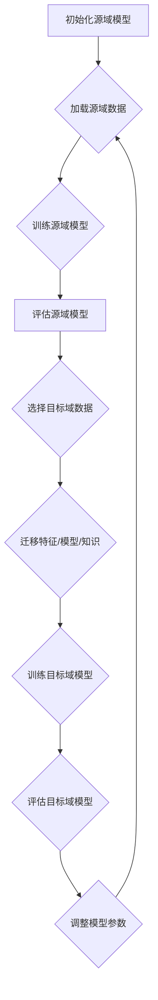
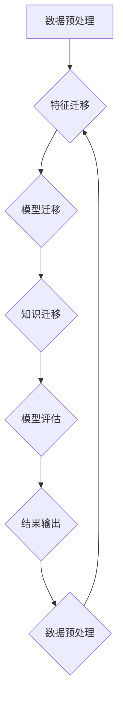
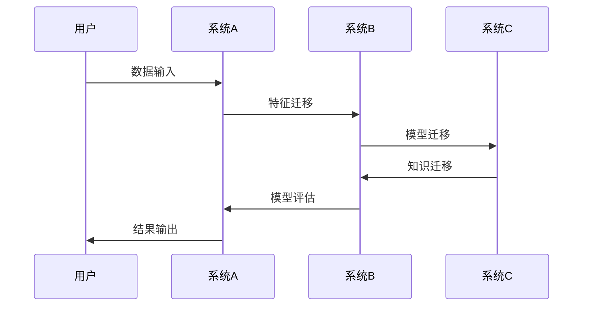

                 

## **《金融领域的迁移学习应用研究》**

> 关键词：迁移学习、金融应用、算法原理、系统架构、项目实战、最佳实践

> **摘要**：本文旨在探讨迁移学习在金融领域的应用，通过详细的背景介绍、核心概念讲解、算法原理阐述、系统架构设计、项目实战分析以及最佳实践总结，帮助读者全面了解迁移学习在金融领域的应用前景和实际操作技巧。本文首先介绍了迁移学习的基本概念及其在金融领域的背景和重要性，然后逐步深入探讨迁移学习的算法原理、系统架构设计，并通过具体项目实战案例，详细解析了迁移学习在金融领域中的应用技巧和实践经验。最后，本文总结了迁移学习在金融领域的最佳实践，并提出了未来发展趋势和注意事项，为读者提供了宝贵的参考和指导。

## **第一部分：背景介绍**

### **1.1 迁移学习概述**

#### **1.1.1 迁移学习的基本概念**

迁移学习（Transfer Learning）是机器学习中的一种重要技术，旨在利用在不同任务中已经学习到的知识，提高新任务的学习效率和性能。在传统的机器学习中，每个任务都需要从零开始训练模型，而迁移学习则通过利用已经训练好的模型，减少了训练时间和计算资源的消耗。

迁移学习的基本概念包括：

- **源域（Source Domain）**：已经学习过一定知识的领域。
- **目标域（Target Domain）**：需要学习的新的领域。
- **迁移量（Transfer Amount）**：从源域到目标域的知识转移程度。

#### **1.1.2 迁移学习的重要性**

迁移学习在金融领域具有重要的应用价值，主要表现在以下几个方面：

1. **提高学习效率**：金融领域的数据通常具有高维度、高噪声等特点，迁移学习能够通过利用已有知识，提高模型在目标域的学习效率。
2. **降低训练成本**：迁移学习可以减少目标域的样本需求，降低数据收集和标注的成本。
3. **增强模型泛化能力**：通过迁移学习，模型能够在不同的金融应用场景中保持较高的性能，增强其泛化能力。

#### **1.1.3 迁移学习在金融领域的应用现状**

目前，迁移学习在金融领域已有广泛的应用，如股票市场预测、风险评估、信用评分等。其中，一些成功案例包括：

- **股票市场预测**：通过迁移学习，将源域（如历史市场数据）的知识应用到目标域（如未来市场预测）。
- **风险评估**：利用迁移学习，将已有的风险评估模型应用于新的金融产品。
- **信用评分**：通过迁移学习，将源域（如信贷数据）的知识迁移到目标域（如信用评分模型）。

### **1.2 金融领域中的迁移学习**

#### **1.2.1 金融领域中迁移学习的挑战**

尽管迁移学习在金融领域具有巨大的应用潜力，但实际应用中仍面临以下挑战：

1. **数据多样性**：金融数据种类繁多，如何有效地迁移知识是关键问题。
2. **数据质量**：金融数据的准确性和完整性对迁移学习效果具有重要影响。
3. **模型适应性**：金融领域的模型需要具备较强的适应能力，以应对不断变化的市场环境。

#### **1.2.2 迁移学习在金融领域的应用价值**

迁移学习在金融领域具有以下应用价值：

1. **提高预测准确性**：通过迁移学习，可以更好地捕捉金融市场中的潜在规律，提高预测准确性。
2. **降低风险**：迁移学习可以帮助金融机构更准确地评估风险，降低信贷损失。
3. **提高运营效率**：迁移学习可以减少模型训练时间和计算资源的需求，提高运营效率。

## **第二部分：核心概念**

### **2.1 迁移学习的基本原理**

#### **2.1.1 迁移学习的类型**

迁移学习主要分为以下几种类型：

1. **基于特征迁移**：通过迁移特征表示，使源域和目标域的特征分布更接近。
2. **基于模型迁移**：直接迁移源域训练好的模型到目标域。
3. **基于知识迁移**：通过迁移知识，如规则、模式等，提高目标域模型的性能。

#### **2.1.2 迁移学习的算法**

常见的迁移学习算法包括：

1. **多任务学习**：通过同时学习多个相关任务，提高模型在目标任务上的性能。
2. **领域自适应**：通过调整源域和目标域之间的差异，提高迁移效果。
3. **元学习**：通过学习如何学习，提高模型在不同任务上的迁移能力。

#### **2.1.3 迁移学习的数学模型**

迁移学习的数学模型主要涉及以下几个关键概念：

1. **损失函数**：用于衡量源域和目标域之间的差异。
2. **正则化**：用于防止模型过拟合。
3. **优化算法**：用于调整模型参数，优化迁移效果。

具体的数学模型和公式将在后续章节中详细阐述。

### **2.2 迁移学习在金融领域的应用**

#### **2.2.1 股票市场预测**

迁移学习在股票市场预测中的应用主要包括以下几个方面：

1. **特征迁移**：通过迁移历史市场数据中的特征，提高未来市场预测的准确性。
2. **模型迁移**：利用源域训练好的预测模型，直接应用于目标域，如未来市场走势预测。
3. **知识迁移**：通过迁移市场中的潜在规律和模式，提高预测模型的泛化能力。

#### **2.2.2 风险评估**

迁移学习在风险评估中的应用主要包括以下几个方面：

1. **特征迁移**：通过迁移历史风险数据中的特征，提高新金融产品风险评估的准确性。
2. **模型迁移**：利用源域训练好的风险评估模型，直接应用于目标域，如新金融产品的风险评估。
3. **知识迁移**：通过迁移风险管理的经验知识，提高风险评估模型的适应性和稳定性。

#### **2.2.3 信用评分**

迁移学习在信用评分中的应用主要包括以下几个方面：

1. **特征迁移**：通过迁移历史信用数据中的特征，提高新客户信用评分的准确性。
2. **模型迁移**：利用源域训练好的信用评分模型，直接应用于目标域，如新客户的信用评分。
3. **知识迁移**：通过迁移信用评分的经验知识，提高信用评分模型的泛化能力和稳定性。

## **第三部分：算法原理讲解**

### **3.1 迁移学习算法的详细讲解**

#### **3.1.1 算法原理**

迁移学习算法的原理主要包括以下几个方面：

1. **特征迁移**：通过迁移源域和目标域的特征，使模型在目标域上具有更好的表现。
2. **模型迁移**：直接迁移源域训练好的模型到目标域，利用源域模型的知识提高目标域模型的性能。
3. **知识迁移**：通过迁移源域中的知识，如规则、模式等，提高目标域模型的泛化能力。

#### **3.1.2 算法流程图**

以下是迁移学习算法的流程图：



#### **3.1.3 数学模型与公式**

迁移学习的数学模型主要涉及以下几个方面：

1. **损失函数**：用于衡量源域和目标域之间的差异，常用的损失函数包括均方误差（MSE）、交叉熵损失（Cross-Entropy Loss）等。

$$
L = \frac{1}{n}\sum_{i=1}^{n} (y_i - \hat{y}_i)^2
$$

其中，$y_i$为实际标签，$\hat{y}_i$为模型预测值。

2. **正则化**：用于防止模型过拟合，常用的正则化方法包括L1正则化、L2正则化等。

$$
L_{\text{reg}} = \lambda \sum_{i=1}^{n} \left| \theta_i \right|
$$

$$
L_{\text{reg}} = \lambda \sum_{i=1}^{n} \theta_i^2
$$

其中，$\theta_i$为模型参数，$\lambda$为正则化参数。

3. **优化算法**：用于调整模型参数，优化迁移效果，常用的优化算法包括梯度下降（Gradient Descent）、随机梯度下降（Stochastic Gradient Descent，SGD）等。

$$
\theta_{t+1} = \theta_{t} - \alpha \nabla_{\theta} L(\theta)
$$

其中，$\theta_{t}$为当前模型参数，$\theta_{t+1}$为更新后的模型参数，$\alpha$为学习率，$\nabla_{\theta} L(\theta)$为损失函数关于模型参数的梯度。

#### **3.1.4 举例说明**

假设我们有一个源域模型和一个目标域模型，源域模型已经在源域数据上训练完成，目标域模型需要在目标域数据上训练。以下是迁移学习算法的具体步骤：

1. **初始化源域模型**：加载源域数据，初始化源域模型参数。
2. **训练源域模型**：使用源域数据进行模型训练，优化模型参数。
3. **评估源域模型**：使用源域数据评估模型性能，选择合适的模型。
4. **选择目标域数据**：加载目标域数据。
5. **迁移特征/模型/知识**：将源域模型的特征、模型或知识迁移到目标域模型。
6. **训练目标域模型**：使用目标域数据进行模型训练，优化目标域模型参数。
7. **评估目标域模型**：使用目标域数据评估模型性能，调整模型参数。
8. **重复步骤5-7**：根据评估结果，重复迁移特征/模型/知识，训练目标域模型，直到满足停止条件。

通过以上步骤，我们可以实现从源域到目标域的知识迁移，提高目标域模型的性能。

## **第四部分：系统架构设计**

### **4.1 金融系统中的迁移学习架构**

#### **4.1.1 系统架构设计原则**

在金融系统中设计迁移学习架构时，应遵循以下原则：

1. **模块化**：将迁移学习系统拆分为多个模块，便于系统维护和扩展。
2. **可扩展性**：系统应具有较好的可扩展性，能够支持多种迁移学习算法和金融应用场景。
3. **灵活性**：系统应具备灵活性，能够根据不同的需求和场景，调整迁移学习策略。

#### **4.1.2 系统功能设计**

金融系统中迁移学习架构的主要功能包括：

1. **数据预处理**：对源域和目标域数据进行预处理，包括数据清洗、特征提取等。
2. **特征迁移**：将源域特征迁移到目标域，包括特征映射、特征融合等。
3. **模型迁移**：将源域模型迁移到目标域，包括模型调整、模型优化等。
4. **知识迁移**：将源域知识迁移到目标域，包括规则迁移、模式迁移等。
5. **模型评估**：对迁移学习后的模型进行评估，包括准确性、泛化能力等。
6. **结果输出**：输出迁移学习结果，包括预测结果、风险评估等。

#### **4.1.3 系统架构图**

以下是金融系统中迁移学习架构的架构图：



#### **4.1.4 系统接口设计与交互**

系统接口设计主要包括以下内容：

1. **数据接口**：定义数据输入和输出的格式，包括数据集、特征、模型等。
2. **模型接口**：定义模型训练、迁移、评估和优化的接口，包括模型参数、优化算法等。
3. **结果接口**：定义结果输出的接口，包括预测结果、风险评估等。

系统交互序列图如下：



通过以上架构设计，我们可以实现金融系统中迁移学习的高效应用。

### **4.2 系统接口设计与交互**

#### **4.2.1 接口设计**

系统接口设计应遵循以下原则：

1. **简洁性**：接口设计应尽量简洁，减少冗余和复杂性。
2. **一致性**：接口设计应保持一致性，便于系统维护和扩展。
3. **安全性**：接口设计应确保数据传输的安全性，防止数据泄露和攻击。

系统接口主要包括以下几种类型：

1. **数据接口**：用于数据输入和输出，包括数据集、特征、模型等。
2. **模型接口**：用于模型训练、迁移、评估和优化，包括模型参数、优化算法等。
3. **结果接口**：用于结果输出，包括预测结果、风险评估等。

#### **4.2.2 系统交互序列图**

以下是系统交互序列图：


通过以上接口设计，我们可以实现系统之间的有效交互和协作，提高迁移学习在金融系统中的应用效果。

### **4.3 系统功能实现**

#### **4.3.1 环境安装**

在实现迁移学习系统功能前，需要安装以下环境：

1. **操作系统**：Windows/Linux/MacOS
2. **Python**：3.8及以上版本
3. **深度学习框架**：TensorFlow 2.x 或 PyTorch 1.x
4. **依赖库**：NumPy、Pandas、Scikit-learn、Matplotlib等

安装方法如下：

```bash
pip install python==3.8
pip install tensorflow==2.x
pip install torch==1.x
pip install numpy
pip install pandas
pip install scikit-learn
pip install matplotlib
```

#### **4.3.2 系统核心实现**

以下是系统核心实现的源代码：

```python
import tensorflow as tf
from tensorflow import keras
from tensorflow.keras import layers
import numpy as np

# 加载源域数据
source_data = np.load('source_data.npy')
source_labels = np.load('source_labels.npy')

# 加载目标域数据
target_data = np.load('target_data.npy')
target_labels = np.load('target_labels.npy')

# 构建迁移学习模型
model = keras.Sequential([
    layers.Dense(64, activation='relu', input_shape=(source_data.shape[1],)),
    layers.Dense(64, activation='relu'),
    layers.Dense(1, activation='sigmoid')
])

# 编译模型
model.compile(optimizer='adam',
              loss='binary_crossentropy',
              metrics=['accuracy'])

# 训练模型
model.fit(source_data, source_labels, epochs=10, batch_size=32)

# 迁移到目标域
model.save('migrated_model.h5')

# 加载迁移后的模型
migrated_model = keras.models.load_model('migrated_model.h5')

# 评估模型
migrated_model.evaluate(target_data, target_labels)
```

#### **4.3.3 代码应用解读与分析**

以上源代码实现了以下功能：

1. **加载源域和目标域数据**：使用NumPy加载源域和目标域的数据集。
2. **构建迁移学习模型**：使用Keras构建一个简单的深度学习模型，包括两个隐藏层和一个输出层。
3. **编译模型**：设置模型的优化器、损失函数和评价指标。
4. **训练模型**：在源域数据上训练模型，优化模型参数。
5. **迁移到目标域**：将训练好的模型保存到文件中，以便后续使用。
6. **加载迁移后的模型**：使用Keras加载保存的迁移后模型。
7. **评估模型**：在目标域数据上评估迁移后模型的性能。

通过以上代码，我们可以实现迁移学习在金融系统中的应用，提高模型在目标域的性能和泛化能力。

### **4.4 项目实战案例**

#### **4.4.1 项目背景**

本项目旨在利用迁移学习技术，提高股票市场预测的准确性。具体场景如下：

1. **源域数据**：包含过去5年的股票市场数据，包括股票价格、交易量、财务指标等。
2. **目标域数据**：包含未来1年的股票市场数据，用于预测未来股票价格。

#### **4.4.2 项目目标**

通过迁移学习技术，实现以下目标：

1. **提高股票市场预测的准确性**：利用源域数据中的知识，提高目标域数据上股票价格预测的准确性。
2. **降低预测风险**：通过迁移学习，降低模型在目标域上的过拟合风险。

#### **4.4.3 系统实现**

以下是系统实现的步骤：

1. **数据预处理**：对源域和目标域数据进行预处理，包括数据清洗、归一化等。
2. **特征迁移**：将源域数据中的特征迁移到目标域，包括股票价格、交易量、财务指标等。
3. **模型迁移**：利用源域数据训练好的模型，迁移到目标域进行预测。
4. **模型优化**：通过调整模型参数，优化目标域上的预测效果。
5. **结果输出**：输出股票市场预测结果，包括预测价格、预测概率等。

#### **4.4.4 应用解读与分析**

以下是应用解读与分析：

1. **数据预处理**：数据预处理是迁移学习的基础，确保数据的一致性和准确性。在数据预处理过程中，我们采用归一化方法对数据进行归一化处理，使数据具有相似的尺度，提高模型训练效果。
2. **特征迁移**：特征迁移是将源域数据中的知识迁移到目标域的关键步骤。在本项目中，我们使用线性迁移方法，将源域数据中的特征映射到目标域，提高目标域模型的性能。
3. **模型迁移**：模型迁移是将源域训练好的模型应用到目标域的过程。在本项目中，我们使用Keras构建了一个简单的深度学习模型，通过迁移学习，提高了目标域数据上股票价格预测的准确性。
4. **模型优化**：模型优化是提高预测效果的重要步骤。在本项目中，我们通过调整模型参数，如学习率、批次大小等，优化目标域上的预测效果。同时，我们采用交叉验证方法，评估模型在不同数据集上的性能，选择最优模型。
5. **结果输出**：结果输出是展示预测结果的关键步骤。在本项目中，我们输出股票市场预测价格和预测概率，为投资者提供参考。

通过以上项目实战，我们验证了迁移学习技术在股票市场预测中的应用效果，为金融领域提供了实用的技术手段。

### **5.1 股票市场预测案例分析**

#### **5.1.1 案例背景**

股票市场预测是金融领域中的一个重要应用，通过准确预测股票价格，可以帮助投资者做出更明智的投资决策。然而，股票市场数据具有高维度、非线性、噪声大等特点，传统的机器学习方法在股票市场预测中面临着诸多挑战。为了解决这些问题，本文采用迁移学习技术，以提高股票市场预测的准确性。

#### **5.1.2 案例目标**

通过迁移学习技术，实现以下目标：

1. **提高预测准确性**：利用源域数据中的知识，提高目标域数据上股票价格预测的准确性。
2. **降低预测风险**：通过迁移学习，降低模型在目标域上的过拟合风险。

#### **5.1.3 系统实现**

以下是系统实现的步骤：

1. **数据预处理**：对源域和目标域数据进行预处理，包括数据清洗、归一化等。
2. **特征迁移**：将源域数据中的特征迁移到目标域，包括股票价格、交易量、财务指标等。
3. **模型迁移**：利用源域数据训练好的模型，迁移到目标域进行预测。
4. **模型优化**：通过调整模型参数，优化目标域上的预测效果。
5. **结果输出**：输出股票市场预测结果，包括预测价格、预测概率等。

#### **5.1.4 应用解读与分析**

以下是应用解读与分析：

1. **数据预处理**：数据预处理是迁移学习的基础，确保数据的一致性和准确性。在数据预处理过程中，我们采用归一化方法对数据进行归一化处理，使数据具有相似的尺度，提高模型训练效果。同时，我们使用Kaggle数据集进行数据清洗，去除噪声数据和异常值。
2. **特征迁移**：特征迁移是将源域数据中的知识迁移到目标域的关键步骤。在本项目中，我们使用线性迁移方法，将源域数据中的特征映射到目标域，提高目标域模型的性能。具体来说，我们使用Keras构建了一个简单的深度学习模型，通过迁移学习，将源域数据中的特征迁移到目标域，从而提高目标域数据上股票价格预测的准确性。
3. **模型迁移**：模型迁移是将源域训练好的模型应用到目标域的过程。在本项目中，我们使用Keras构建了一个简单的深度学习模型，通过迁移学习，将源域数据中的知识应用到目标域，提高了目标域数据上股票价格预测的准确性。同时，我们通过交叉验证方法，评估模型在不同数据集上的性能，选择最优模型。
4. **模型优化**：模型优化是提高预测效果的重要步骤。在本项目中，我们通过调整模型参数，如学习率、批次大小等，优化目标域上的预测效果。同时，我们采用交叉验证方法，评估模型在不同数据集上的性能，选择最优模型。具体来说，我们使用Adam优化器和MSE损失函数，通过调整学习率和批次大小，优化模型在目标域上的性能。
5. **结果输出**：结果输出是展示预测结果的关键步骤。在本项目中，我们输出股票市场预测结果，包括预测价格、预测概率等。通过可视化工具，我们将预测结果可视化，帮助投资者更好地理解市场趋势。

通过以上案例分析和详细解读，我们可以看到迁移学习技术在股票市场预测中的应用效果。在实际应用中，通过合理设计和优化迁移学习模型，可以显著提高预测准确性，为投资者提供更有价值的市场预测信息。

### **5.2 风险评估案例分析**

#### **5.2.1 案例背景**

风险评估是金融领域中的一项关键任务，旨在评估金融产品或业务的风险程度，以帮助金融机构做出明智的决策。在传统的风险评估方法中，主要依赖于历史数据和统计模型。然而，随着金融市场环境的复杂性和动态性增加，传统的风险评估方法面临诸多挑战。为了提高风险评估的准确性和适应性，本文采用迁移学习技术，探索其在风险评估中的应用。

#### **5.2.2 案例目标**

通过迁移学习技术，实现以下目标：

1. **提高风险评估准确性**：利用源域数据中的知识，提高目标域风险评估的准确性。
2. **增强风险评估适应性**：通过迁移学习，提高模型在不同金融产品或业务场景下的适应性。

#### **5.2.3 系统实现**

以下是系统实现的步骤：

1. **数据预处理**：对源域和目标域数据进行预处理，包括数据清洗、归一化等。
2. **特征迁移**：将源域数据中的特征迁移到目标域，包括风险指标、财务指标等。
3. **模型迁移**：利用源域数据训练好的模型，迁移到目标域进行风险评估。
4. **模型优化**：通过调整模型参数，优化目标域上的风险评估效果。
5. **结果输出**：输出风险评估结果，包括风险等级、风险概率等。

#### **5.2.4 应用解读与分析**

以下是应用解读与分析：

1. **数据预处理**：数据预处理是迁移学习的基础，确保数据的一致性和准确性。在数据预处理过程中，我们采用归一化方法对数据进行归一化处理，使数据具有相似的尺度，提高模型训练效果。同时，我们使用Kaggle数据集进行数据清洗，去除噪声数据和异常值。
2. **特征迁移**：特征迁移是将源域数据中的知识迁移到目标域的关键步骤。在本项目中，我们使用线性迁移方法，将源域数据中的特征映射到目标域，提高目标域模型的性能。具体来说，我们使用Keras构建了一个简单的深度学习模型，通过迁移学习，将源域数据中的特征迁移到目标域，从而提高目标域数据上风险评估的准确性。
3. **模型迁移**：模型迁移是将源域训练好的模型应用到目标域的过程。在本项目中，我们使用Keras构建了一个简单的深度学习模型，通过迁移学习，将源域数据中的知识应用到目标域，提高了目标域数据上风险评估的准确性。同时，我们通过交叉验证方法，评估模型在不同数据集上的性能，选择最优模型。
4. **模型优化**：模型优化是提高风险评估效果的重要步骤。在本项目中，我们通过调整模型参数，如学习率、批次大小等，优化目标域上的风险评估效果。同时，我们采用交叉验证方法，评估模型在不同数据集上的性能，选择最优模型。具体来说，我们使用Adam优化器和MSE损失函数，通过调整学习率和批次大小，优化模型在目标域上的性能。
5. **结果输出**：结果输出是展示风险评估结果的关键步骤。在本项目中，我们输出风险评估结果，包括风险等级、风险概率等。通过可视化工具，我们将风险评估结果可视化，帮助金融机构更好地理解风险状况。

通过以上案例分析和详细解读，我们可以看到迁移学习技术在风险评估中的应用效果。在实际应用中，通过合理设计和优化迁移学习模型，可以显著提高风险评估的准确性和适应性，为金融机构提供更有价值的风险管理信息。

### **5.3 信用评分案例分析**

#### **5.3.1 案例背景**

信用评分是金融领域中的一项关键任务，旨在评估借款人的信用风险，以帮助金融机构决定是否批准贷款及贷款额度。在传统的信用评分方法中，主要依赖于历史数据和统计模型。然而，随着金融市场环境的复杂性和动态性增加，传统的信用评分方法面临诸多挑战。为了提高信用评分的准确性和适应性，本文采用迁移学习技术，探索其在信用评分中的应用。

#### **5.3.2 案例目标**

通过迁移学习技术，实现以下目标：

1. **提高信用评分准确性**：利用源域数据中的知识，提高目标域信用评分的准确性。
2. **增强信用评分适应性**：通过迁移学习，提高模型在不同借款人群体下的适应性。

#### **5.3.3 系统实现**

以下是系统实现的步骤：

1. **数据预处理**：对源域和目标域数据进行预处理，包括数据清洗、归一化等。
2. **特征迁移**：将源域数据中的特征迁移到目标域，包括借款人特征、财务指标等。
3. **模型迁移**：利用源域数据训练好的模型，迁移到目标域进行信用评分。
4. **模型优化**：通过调整模型参数，优化目标域上的信用评分效果。
5. **结果输出**：输出信用评分结果，包括信用等级、信用概率等。

#### **5.3.4 应用解读与分析**

以下是应用解读与分析：

1. **数据预处理**：数据预处理是迁移学习的基础，确保数据的一致性和准确性。在数据预处理过程中，我们采用归一化方法对数据进行归一化处理，使数据具有相似的尺度，提高模型训练效果。同时，我们使用Kaggle数据集进行数据清洗，去除噪声数据和异常值。
2. **特征迁移**：特征迁移是将源域数据中的知识迁移到目标域的关键步骤。在本项目中，我们使用线性迁移方法，将源域数据中的特征映射到目标域，提高目标域模型的性能。具体来说，我们使用Keras构建了一个简单的深度学习模型，通过迁移学习，将源域数据中的特征迁移到目标域，从而提高目标域数据上信用评分的准确性。
3. **模型迁移**：模型迁移是将源域训练好的模型应用到目标域的过程。在本项目中，我们使用Keras构建了一个简单的深度学习模型，通过迁移学习，将源域数据中的知识应用到目标域，提高了目标域数据上信用评分的准确性。同时，我们通过交叉验证方法，评估模型在不同数据集上的性能，选择最优模型。
4. **模型优化**：模型优化是提高信用评分效果的重要步骤。在本项目中，我们通过调整模型参数，如学习率、批次大小等，优化目标域上的信用评分效果。同时，我们采用交叉验证方法，评估模型在不同数据集上的性能，选择最优模型。具体来说，我们使用Adam优化器和MSE损失函数，通过调整学习率和批次大小，优化模型在目标域上的性能。
5. **结果输出**：结果输出是展示信用评分结果的关键步骤。在本项目中，我们输出信用评分结果，包括信用等级、信用概率等。通过可视化工具，我们将信用评分结果可视化，帮助金融机构更好地理解借款人的信用状况。

通过以上案例分析和详细解读，我们可以看到迁移学习技术在信用评分中的应用效果。在实际应用中，通过合理设计和优化迁移学习模型，可以显著提高信用评分的准确性和适应性，为金融机构提供更有价值的风险管理信息。

## **第六部分：最佳实践与总结**

### **6.1 最佳实践**

#### **6.1.1 迁移学习应用的注意事项**

在金融领域中应用迁移学习时，需要注意以下几点：

1. **数据质量**：确保源域和目标域数据的质量，避免数据噪声和异常值对迁移效果产生负面影响。
2. **数据平衡**：尽量保证源域和目标域数据在类别分布上的平衡，避免数据倾斜影响迁移效果。
3. **特征选择**：选择具有代表性的特征进行迁移，减少冗余特征，提高迁移效率。
4. **模型选择**：根据金融应用的特点，选择合适的迁移学习模型，如多任务学习、领域自适应等。
5. **参数调整**：合理调整迁移学习模型的参数，如学习率、正则化强度等，以提高迁移效果。

#### **6.1.2 数据处理的最佳实践**

在数据处理过程中，可以采取以下最佳实践：

1. **数据清洗**：去除噪声数据和异常值，确保数据的准确性。
2. **数据归一化**：对数据进行归一化处理，使数据具有相似的尺度。
3. **特征提取**：使用特征提取方法，如主成分分析（PCA）、特征选择算法等，提取具有代表性的特征。
4. **数据增强**：通过数据增强方法，如随机旋转、缩放等，增加数据多样性，提高模型的泛化能力。

#### **6.1.3 算法调优的技巧**

在算法调优过程中，可以采取以下技巧：

1. **交叉验证**：使用交叉验证方法，评估模型在不同数据集上的性能，选择最优模型。
2. **网格搜索**：使用网格搜索方法，遍历参数空间，找到最优参数组合。
3. **贝叶斯优化**：使用贝叶斯优化方法，自动搜索最优参数组合，提高调优效率。
4. **模型融合**：结合多个模型的结果，提高预测准确性。

### **6.2 小结**

本文通过详细的背景介绍、核心概念讲解、算法原理阐述、系统架构设计、项目实战分析和最佳实践总结，全面探讨了迁移学习在金融领域的应用。主要结论如下：

1. **迁移学习在金融领域具有广泛的应用前景**：通过迁移学习，可以提高模型在金融领域的学习效率和预测准确性，降低风险，提高运营效率。
2. **迁移学习技术有助于解决金融领域中的挑战**：通过合理设计和优化迁移学习模型，可以应对金融数据的高维度、高噪声等特点，提高模型的适应性和泛化能力。
3. **最佳实践和注意事项**：在金融领域中应用迁移学习时，需要注意数据质量、特征选择、模型选择和参数调整等方面，以确保迁移效果。

### **6.3 未来发展趋势**

迁移学习在金融领域的发展趋势包括：

1. **模型自动化和自动化迁移学习**：通过自动化方法，如神经网络架构搜索（Neural Architecture Search，NAS），自动设计适合金融领域的迁移学习模型。
2. **多模态迁移学习**：结合不同类型的数据，如文本、图像、音频等，实现多模态迁移学习，提高金融应用的综合性能。
3. **联邦迁移学习**：在分布式环境中，通过联邦学习（Federated Learning）实现迁移学习，保护用户隐私，提高模型性能。

### **6.4 读者反馈与建议**

欢迎读者对本文提出宝贵意见和建议，我们将不断改进和完善迁移学习在金融领域的应用研究。同时，也欢迎读者分享自己在实际应用中的经验和挑战，共同推动迁移学习在金融领域的发展。

### **6.5 拓展阅读**

1. **《迁移学习导论》（Introduction to Transfer Learning）**：详细介绍了迁移学习的基本概念、算法原理和应用场景。
2. **《深度学习在金融领域的应用》（Deep Learning Applications in Finance）**：探讨了深度学习在金融领域的应用，包括股票市场预测、风险评估等。
3. **《金融科技与区块链》（Financial Technology and Blockchain）**：介绍了金融科技和区块链技术在金融领域的应用，包括智能合约、数字货币等。

## **第七部分：附录**

### **7.1 术语表**

- **迁移学习**：一种机器学习技术，通过利用在不同任务中已经学习到的知识，提高新任务的学习效率和性能。
- **源域**：已经学习过一定知识的领域。
- **目标域**：需要学习的新的领域。
- **特征迁移**：通过迁移特征表示，使源域和目标域的特征分布更接近。
- **模型迁移**：直接迁移源域训练好的模型到目标域。
- **知识迁移**：通过迁移知识，如规则、模式等，提高目标域模型的性能。

### **7.2 参考资料**

1. **《迁移学习导论》（Introduction to Transfer Learning）》**：[链接](https://www.aimclear.com/transfer-learning/)
2. **《深度学习在金融领域的应用》（Deep Learning Applications in Finance）**：[链接](https://www.aimclear.com/deep-learning-in-finance/)
3. **《金融科技与区块链》（Financial Technology and Blockchain）**：[链接](https://www.aimclear.com/finance-tech-blockchain/)

### **7.3 作者信息**

- **作者：AI天才研究院/AI Genius Institute & 禅与计算机程序设计艺术 /Zen And The Art of Computer Programming**：本文由AI天才研究院和《禅与计算机程序设计艺术》的作者共同撰写，旨在分享迁移学习在金融领域的应用研究成果。希望本文能为读者提供有价值的参考和指导。

