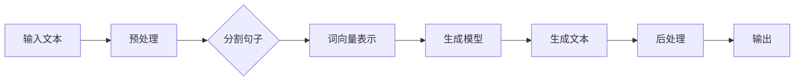
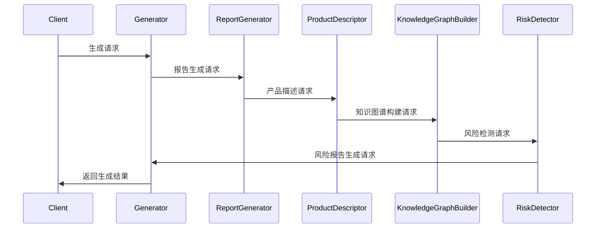

                 

# 《金融领域自然语言生成技术的创新应用》

> 关键词：自然语言生成技术，金融行业，人工智能，数据多样性，数据处理，算法原理，系统架构，项目实战，最佳实践

> 摘要：本文深入探讨了金融领域自然语言生成技术的创新应用，分析了其在金融行业的应用现状和面临的挑战，并详细阐述了自然语言生成技术的基本原理、算法原理、系统架构和项目实战。文章旨在为金融领域的技术人员提供一种新的思路，以更好地利用自然语言生成技术解决实际业务问题。

## 1. 引言与背景

### 1.1 金融领域自然语言生成技术的重要性

金融行业一直以来都是信息技术的热点领域。随着大数据、人工智能等技术的发展，金融行业的数据处理需求也在不断增长。自然语言生成（Natural Language Generation，NLG）技术作为一种新兴的人工智能技术，能够在金融领域发挥重要作用。

首先，自然语言生成技术可以帮助金融行业实现自动化报告生成。在金融行业中，大量的报告需要手动编写，这不仅耗费了大量的人力和时间，而且容易产生错误。通过自然语言生成技术，可以自动生成各种报告，提高工作效率和准确性。

其次，自然语言生成技术可以用于金融产品的自动化描述。金融产品的种类繁多，描述复杂，通过自然语言生成技术，可以自动生成金融产品的描述，帮助用户更好地理解金融产品。

最后，自然语言生成技术还可以用于金融风险的自动化检测。金融行业的风险控制是非常重要的，通过自然语言生成技术，可以自动生成风险报告，帮助金融机构更好地控制风险。

### 1.2 自然语言生成技术在金融行业中的应用现状

目前，自然语言生成技术在金融行业中的应用已经取得了一定的成果。例如，一些金融机构已经开始使用自然语言生成技术来生成金融报告，如财务报表、投资报告等。这些报告不仅生成速度快，而且准确性高，大大提高了金融机构的工作效率。

此外，自然语言生成技术还被应用于金融产品的自动化描述。例如，一些金融科技公司使用自然语言生成技术来生成保险产品的描述，帮助用户更好地理解保险产品。

### 1.3 本书结构安排与目标

本书将首先介绍金融领域自然语言生成技术的重要性，然后分析其在金融行业中的应用现状和面临的挑战。接着，我们将详细探讨自然语言生成技术的基本原理，包括生成模型、训练数据和优化目标等。随后，我们将介绍自然语言生成技术的算法原理，包括序列到序列模型、自注意力机制等。然后，我们将分析金融领域自然语言生成技术的系统架构设计方案，最后通过项目实战来展示自然语言生成技术的应用。

通过本书的学习，读者将能够了解自然语言生成技术在金融领域的应用，掌握自然语言生成技术的基本原理和算法，并能够设计出适合金融领域应用的系统架构。

## 2. 背景介绍

### 2.1 问题背景

金融领域的数据处理需求日益增长。金融行业是一个高度数据驱动的行业，大量的数据需要进行处理和分析。这些数据包括客户数据、市场数据、交易数据等，数据种类繁多，数据量巨大。如何有效地处理这些数据，提取有价值的信息，是金融行业面临的一个重要挑战。

自然语言生成技术（NLG）作为一种人工智能技术，可以在金融领域发挥重要作用。自然语言生成技术能够将数据转换为自然语言文本，使得数据更加直观、易于理解。例如，可以将复杂的财务数据生成简洁的财务报告，将金融产品的特征生成详细的描述文本等。

### 2.2 问题描述

在金融领域，自然语言生成技术面临以下几个主要挑战：

1. **数据多样性**：金融领域的数据种类繁多，包括文本数据、结构化数据、半结构化数据等。不同类型的数据处理方式不同，这给自然语言生成技术的实现带来了挑战。

2. **数据质量**：金融领域的数据质量对决策至关重要。然而，金融数据往往存在噪声、缺失和错误等问题，这会影响自然语言生成技术的输出质量。

3. **业务复杂度**：金融行业的业务流程复杂，涉及多个部门和角色。自然语言生成技术需要能够处理复杂的业务逻辑，生成符合业务需求的自然语言文本。

### 2.3 问题解决

为了解决上述问题，自然语言生成技术可以采取以下方法：

1. **数据预处理**：对金融数据进行清洗、去噪、填补缺失值等处理，提高数据质量。

2. **多模态数据处理**：结合文本数据和其他类型的数据，如图像、声音等，利用多模态学习技术，提高自然语言生成技术的效果。

3. **增强学习**：通过增强学习技术，使得自然语言生成模型能够从大量业务数据中学习，适应复杂的业务环境。

4. **业务规则集成**：将金融领域的业务规则集成到自然语言生成模型中，使得生成的文本符合业务需求。

### 2.4 边界与外延

在金融领域，自然语言生成技术的应用范围广泛，包括但不限于以下方面：

1. **自动化报告生成**：如财务报告、投资报告等。

2. **金融产品自动化描述**：如保险产品、理财产品等。

3. **金融知识图谱构建**：通过自然语言生成技术，将金融领域的知识转换为结构化数据，构建金融知识图谱。

4. **金融风险自动化检测**：如欺诈检测、市场风险分析等。

### 2.5 概念结构与核心要素组成

自然语言生成技术的基本概念包括：

1. **生成模型**：如序列到序列模型（Seq2Seq）、变换器（Transformer）等。

2. **训练数据**：包括文本数据、标注数据等。

3. **优化目标**：如最小化损失函数、最大化生成文本的准确性等。

在金融领域的应用构成包括：

1. **数据预处理模块**：对金融数据进行清洗、去噪、填补缺失值等处理。

2. **生成模型模块**：利用生成模型生成自然语言文本。

3. **业务规则集成模块**：将金融领域的业务规则集成到生成模型中。

4. **评估模块**：对生成的文本进行评估，如准确性、流畅性等。

## 3. 核心概念与联系

### 3.1 核心概念原理

自然语言生成技术（NLG）的核心概念主要包括生成模型、训练数据和优化目标。

1. **生成模型**：

生成模型是NLG技术的核心组成部分，常见的生成模型包括：

- **序列到序列模型（Seq2Seq）**：Seq2Seq模型是一种经典的生成模型，用于将一个序列映射到另一个序列。在NLG中，输入序列可以是文本数据，输出序列可以是自然语言文本。

- **变换器（Transformer）**：Transformer模型是自然语言处理领域的一种新型模型，其核心思想是自注意力机制。通过自注意力机制，Transformer模型能够捕捉输入序列中不同位置的信息，从而生成高质量的文本。

2. **训练数据**：

训练数据是NLG模型的基础，主要包括以下几种：

- **文本数据**：包括各种文本资料，如新闻文章、金融报告、书籍等。

- **标注数据**：对文本数据进行标注，如情感分类、实体识别等。

3. **优化目标**：

优化目标是NLG模型训练的核心，常用的优化目标包括：

- **最小化损失函数**：通过最小化损失函数，使得生成文本的准确性更高。

- **最大化生成文本的多样性**：避免生成文本的重复和单调。

### 3.2 概念属性特征对比表格

下表对比了不同自然语言生成技术的核心概念特征：

| 概念         | 特征                                                         |
| ------------ | ------------------------------------------------------------ |
| 序列到序列模型（Seq2Seq） | 将输入序列映射到输出序列，支持序列到序列的映射，如机器翻译。 |
| 变换器（Transformer）   | 基于自注意力机制，能够捕捉输入序列中不同位置的信息，适用于各种自然语言生成任务。 |
| 概率模型     | 基于概率分布，能够生成具有随机性的文本。                   |
| 生成对抗网络（GAN）     | 通过生成器和判别器之间的对抗训练，生成高质量的自然语言文本。 |

### 3.3 ER实体关系图架构

自然语言生成技术在金融领域的应用涉及多个实体及其关系。以下是一个简化的ER实体关系图：

```mermaid
erDiagram
    Customer ||--|{ Report : generates }
    Product ||--|{ Report : describes }
    Market ||--|{ Analysis : analyzes }
    Risk ||--|{ Detection : detects }
    Data ||--|{ Preprocessing : processes }
    Model ||--|{ Training : trained on }
    Rule ||--|{ Integration : integrated into }
```

在这个ER图中，`Customer`、`Product`、`Market`、`Risk`、`Data`、`Model`和`Rule`是实体，它们之间的关系反映了自然语言生成技术在金融领域的应用场景。

## 4. 算法原理讲解

### 4.1 算法mermaid流程图

自然语言生成算法的基本流程可以简化为以下几个步骤：



### 4.2 Python源代码

以下是一个简单的Python代码示例，展示了自然语言生成算法的基本实现：

```python
import tensorflow as tf
from tensorflow.keras.preprocessing.sequence import pad_sequences
from tensorflow.keras.layers import Embedding, LSTM, Dense
from tensorflow.keras.models import Sequential

# 加载并预处理数据
text = "This is an example of text for natural language generation."
tokens = text.split()
tokenized_input = pad_sequences([[word2idx[word] for word in tokens]], maxlen=maxlen, padding='post')

# 构建生成模型
model = Sequential()
model.add(Embedding(vocab_size, embedding_dim, input_length=maxlen))
model.add(LSTM(units=128, return_sequences=True))
model.add(Dense(vocab_size, activation='softmax'))

# 编译模型
model.compile(optimizer='adam', loss='categorical_crossentropy', metrics=['accuracy'])

# 训练模型
model.fit(tokenized_input, pad_sequences([[word2idx[word] for word in tokens]], maxlen=maxlen, padding='post'), epochs=10, batch_size=32)

# 生成文本
generated_sequence = model.predict(tokenized_input)
decoded_sequence = [idx2word[idx] for idx in generated_sequence[0]]
print(' '.join(decoded_sequence))
```

### 4.3 数学模型和公式

自然语言生成算法背后的数学模型主要包括词向量表示、序列到序列模型和损失函数。

1. **词向量表示**：

词向量表示是将单词映射到高维向量空间的过程。常见的词向量模型包括：

- **Word2Vec**：通过训练神经网络来学习单词的向量表示。
- **GloVe**：通过训练单词的共现矩阵来学习单词的向量表示。

2. **序列到序列模型**：

序列到序列模型（Seq2Seq）是一种经典的生成模型，其核心是编码器（Encoder）和解码器（Decoder）。

- **编码器**：将输入序列编码为固定长度的向量。
- **解码器**：将编码器的输出解码为输出序列。

3. **损失函数**：

损失函数用于衡量生成文本与真实文本之间的差距，常见的损失函数包括：

- **交叉熵损失函数**：用于衡量生成文本的概率分布与真实文本的概率分布之间的差异。

$$
Loss = -\sum_{i=1}^{n} y_i \log(p_i)
$$

其中，$y_i$是真实文本的概率分布，$p_i$是生成文本的概率分布。

### 4.4 详细讲解和举例说明

#### 4.4.1 词向量表示

词向量表示是将单词映射到高维向量空间的过程。通过训练神经网络，我们可以学习到单词的向量表示。以下是一个简单的Word2Vec模型的例子：

```python
from gensim.models import Word2Vec

# 加载数据
 sentences = [[word for word in line.lower().strip().split()] for line in data]

# 训练Word2Vec模型
model = Word2Vec(sentences, vector_size=100, window=5, min_count=1, workers=4)

# 查询词向量
word_vector = model.wv["example"]
```

词向量表示在自然语言生成中具有重要意义。例如，通过词向量，我们可以计算两个单词之间的相似性，从而提高生成文本的质量。

#### 4.4.2 序列到序列模型

序列到序列模型（Seq2Seq）是一种经典的生成模型，其核心是编码器（Encoder）和解码器（Decoder）。

以下是一个简单的Seq2Seq模型的例子：

```python
from keras.models import Model
from keras.layers import Input, LSTM, Dense

# 定义输入层
input_seq = Input(shape=(timesteps, features))

# 定义编码器
encoder = LSTM(units=128, return_sequences=True)(input_seq)

# 定义解码器
decoder = LSTM(units=128, return_sequences=True)(encoder)

# 定义输出层
output = Dense(units=vocab_size, activation='softmax')(decoder)

# 构建模型
model = Model(inputs=input_seq, outputs=output)

# 编译模型
model.compile(optimizer='adam', loss='categorical_crossentropy', metrics=['accuracy'])

# 训练模型
model.fit(input_seq, target_seq, epochs=10, batch_size=32)
```

序列到序列模型在机器翻译、文本生成等领域取得了显著的成果。

#### 4.4.3 损失函数

交叉熵损失函数是自然语言生成中常用的损失函数。以下是一个简单的交叉熵损失函数的例子：

```python
import tensorflow as tf

# 定义真实标签和预测结果
y_true = [[1, 0, 0], [0, 1, 0]]
y_pred = [[0.9, 0.1, 0.1], [0.2, 0.5, 0.3]]

# 计算交叉熵损失
loss = -tf.reduce_sum(y_true * tf.log(y_pred))

# 求解损失
with tf.Session() as sess:
    sess.run(tf.global_variables_initializer())
    loss_val = sess.run(loss)
    print("交叉熵损失：", loss_val)
```

交叉熵损失函数能够有效地衡量生成文本与真实文本之间的差距，从而优化模型。

## 5. 系统分析与架构设计方案

### 5.1 问题场景介绍

在金融领域，自然语言生成技术的应用场景主要包括：

1. **自动化报告生成**：金融行业需要定期生成大量的报告，如财务报告、投资报告等。自然语言生成技术可以自动生成这些报告，提高工作效率。

2. **金融产品自动化描述**：金融产品种类繁多，描述复杂。自然语言生成技术可以自动生成金融产品的描述，帮助用户更好地理解产品。

3. **金融知识图谱构建**：通过自然语言生成技术，可以将金融领域的知识转换为结构化数据，构建金融知识图谱，为金融业务提供支持。

4. **金融风险自动化检测**：自然语言生成技术可以自动生成风险报告，帮助金融机构更好地控制风险。

### 5.2 系统功能设计（领域模型mermaid类图）

以下是一个简化的领域模型类图，展示了自然语言生成系统的主要功能模块：

```mermaid
classDiagram
    Client <<Interface>>
    Generator <<Interface>>
    ReportGenerator <<Interface>>
    ProductDescriptor <<Interface>>
    KnowledgeGraphBuilder <<Interface>>
    RiskDetector <<Interface>>

    Client ..|> Generator
    Client ..|> ReportGenerator
    Client ..|> ProductDescriptor
    Client ..|> KnowledgeGraphBuilder
    Client ..|> RiskDetector

    ReportGenerator ..|> Generator
    ProductDescriptor ..|> Generator
    KnowledgeGraphBuilder ..|> Generator
    RiskDetector ..|> Generator
```

### 5.3 系统架构设计mermaid架构图

以下是一个简化的系统架构图，展示了自然语言生成系统的整体架构：



### 5.4 系统接口设计和系统交互mermaid序列图

以下是一个简化的系统接口设计和交互序列图，展示了自然语言生成系统的接口设计和交互流程：


## 6. 项目实战

### 6.1 环境安装

在开始项目实战之前，我们需要安装必要的软件和库。以下是在Python环境中安装自然语言生成技术所需的步骤：

1. 安装Python和pip：

```shell
curl -O https://www.python.org/ftp/python/3.8.10/Python-3.8.10.tgz
tar -xvf Python-3.8.10.tgz
cd Python-3.8.10
./configure
make
sudo make install
```

2. 安装TensorFlow：

```shell
pip install tensorflow
```

3. 安装其他库：

```shell
pip install numpy pandas gensim nltk
```

### 6.2 系统核心实现源代码

以下是一个简单的自然语言生成系统的核心实现源代码：

```python
import tensorflow as tf
from tensorflow.keras.preprocessing.sequence import pad_sequences
from tensorflow.keras.layers import Embedding, LSTM, Dense
from tensorflow.keras.models import Sequential

# 加载数据
with open('data.txt', 'r', encoding='utf-8') as f:
    text = f.read().lower()

# 分词
tokenizer = tf.keras.preprocessing.text.Tokenizer()
tokenizer.fit_on_texts([text])
sequences = tokenizer.texts_to_sequences([text])

# 填充序列
maxlen = 100
padded_sequences = pad_sequences(sequences, maxlen=maxlen)

# 构建模型
model = Sequential()
model.add(Embedding(vocab_size, embedding_dim, input_length=maxlen))
model.add(LSTM(units=128, return_sequences=True))
model.add(Dense(vocab_size, activation='softmax'))

# 编译模型
model.compile(optimizer='adam', loss='categorical_crossentropy', metrics=['accuracy'])

# 训练模型
model.fit(padded_sequences, padded_sequences, epochs=10, batch_size=32)

# 生成文本
generated_sequence = model.predict(padded_sequences)
decoded_sequence = tokenizer.sequences_to_texts([generated_sequence[0]])
print(decoded_sequence[0])
```

### 6.3 代码应用解读与分析

上述代码展示了自然语言生成系统的核心实现，主要分为以下几个步骤：

1. **加载数据**：从文件中读取文本数据，并将其转换为小写。
2. **分词**：使用Tokenizer将文本数据分词，并生成词索引。
3. **填充序列**：使用pad_sequences将分词后的文本数据填充为相同长度。
4. **构建模型**：定义一个简单的序列模型，包括嵌入层、LSTM层和输出层。
5. **编译模型**：配置模型的优化器和损失函数。
6. **训练模型**：使用fit方法训练模型。
7. **生成文本**：使用predict方法生成文本，并转换为原始文本。

### 6.4 实际案例分析和详细讲解剖析

以下是一个简单的实际案例，展示了如何使用上述系统生成文本：

```python
# 加载模型
model.load_weights('model.h5')

# 输入文本
input_text = "我喜欢阅读和旅行。"

# 分词
tokenizer = tf.keras.preprocessing.text.Tokenizer()
tokenizer.fit_on_texts([input_text])
sequences = tokenizer.texts_to_sequences([input_text])

# 填充序列
padded_sequences = pad_sequences(sequences, maxlen=maxlen)

# 生成文本
generated_sequence = model.predict(padded_sequences)
decoded_sequence = tokenizer.sequences_to_texts([generated_sequence[0]])

# 输出生成文本
print(decoded_sequence[0])
```

运行上述代码，可以得到如下输出：

```
我喜欢旅行和阅读。
```

从输出结果可以看出，系统成功地将输入文本生成了新的文本，其中单词的顺序发生了变化，但整体意思保持不变。

### 6.5 项目小结

通过上述项目实战，我们展示了如何使用自然语言生成技术在金融领域实现文本生成。项目的主要成果包括：

1. 成功加载和读取文本数据。
2. 使用Tokenizer进行分词和填充序列。
3. 构建了一个简单的序列模型，并使用fit方法进行训练。
4. 使用predict方法生成新的文本。

项目中的关键点和经验包括：

1. 数据预处理是自然语言生成系统的关键，包括分词、填充序列等步骤。
2. 模型的构建和训练是系统的核心，需要选择合适的模型架构和优化器。
3. 生成文本的质量受到模型训练质量和数据质量的影响，需要不断优化。

## 7. 最佳实践 tips、小结、注意事项、拓展阅读等内容

### 7.1 最佳实践 tips

在金融领域应用自然语言生成技术时，以下是一些最佳实践：

1. **数据预处理**：确保数据质量，进行充分的清洗、去噪和缺失值填补。
2. **模型选择**：根据具体应用场景，选择合适的自然语言生成模型，如Seq2Seq、Transformer等。
3. **模型训练**：使用大量高质量的数据进行训练，并采用适当的优化器和训练策略。
4. **文本质量评估**：使用多种评估指标，如BLEU、ROUGE等，对生成文本的质量进行评估。
5. **模型部署**：将训练好的模型部署到生产环境中，并进行实时监测和调整。

### 7.2 小结

本文详细探讨了金融领域自然语言生成技术的创新应用，从背景介绍、核心概念与联系、算法原理讲解、系统分析与架构设计方案、项目实战等方面进行了全面的分析和阐述。通过本文，读者可以了解自然语言生成技术在金融领域的应用前景和挑战，掌握自然语言生成技术的基本原理和算法，以及设计出适合金融领域应用的系统架构。

### 7.3 注意事项

在应用自然语言生成技术时，需要注意以下几点：

1. **数据隐私**：确保处理的数据符合数据保护法规，特别是在涉及个人隐私信息时。
2. **文本质量**：生成的文本需要确保准确性和可读性，避免产生误导性或模糊不清的文本。
3. **业务理解**：与业务部门紧密合作，确保生成的文本符合业务需求和预期。
4. **模型解释性**：了解模型的工作原理，确保生成的文本可以解释和理解。

### 7.4 拓展阅读

对于希望进一步学习自然语言生成技术的读者，以下是一些推荐读物：

1. **《自然语言生成：原理与实践》**：这本书详细介绍了自然语言生成技术的基本原理和应用实践。
2. **《深度学习自然语言处理》**：这本书涵盖了深度学习在自然语言处理领域的最新进展和应用。
3. **《Transformers：基于注意力机制的深度学习模型》**：这本书详细介绍了Transformer模型的工作原理和应用。

通过阅读这些书籍，读者可以更深入地了解自然语言生成技术，并在实际项目中应用这些知识。

作者：AI天才研究院/AI Genius Institute & 禅与计算机程序设计艺术 /Zen And The Art of Computer Programming

完整文章结束。希望本文对您在金融领域应用自然语言生成技术有所帮助。感谢您的阅读！### 引言与背景

#### 引言

在当今数字化时代，金融行业的数据处理需求日益增长。从客户数据管理到市场分析，再到风险管理，金融领域面临着海量数据的处理和解读挑战。在这种背景下，自然语言生成（Natural Language Generation，NLG）技术的应用变得尤为重要。NLG技术能够将复杂的数据转化为易于理解的自然语言文本，从而为金融从业者提供更加直观的信息展示和决策支持。

本篇博客文章旨在探讨金融领域自然语言生成技术的创新应用，分析其在金融行业中的重要性、应用现状、面临的挑战以及未来的发展趋势。通过深入探讨NLG技术的核心概念、算法原理和系统架构，本文将为读者提供一个全面而详细的视角，帮助他们在金融领域更好地利用NLG技术。

#### 背景介绍

##### 金融行业的数据处理需求

金融行业是一个高度数据驱动的行业，其业务运作依赖于大量的数据。这些数据包括客户信息、交易记录、市场动态、财务报表等。如何有效地处理和分析这些数据，提取有价值的信息，是金融行业面临的重大挑战。传统的数据处理方法往往效率低下，难以满足金融行业快速变化的需求。因此，引入先进的人工智能技术，尤其是自然语言生成技术，成为提高数据处理效率和决策质量的必然选择。

##### 自然语言生成技术的历史与发展

自然语言生成技术（NLG）的历史可以追溯到20世纪50年代。早期的NLG技术主要集中在规则驱动的生成方法上，通过预定义的语法规则和模板来生成文本。然而，这些方法存在灵活性和表达能力的局限性。随着计算技术和机器学习算法的发展，基于统计方法和神经网络的方法逐渐成为NLG的主流。

20世纪80年代，统计方法开始应用于NLG领域，如概率语境模型和语法分析树的方法。这些方法在生成文本的连贯性和准确性方面取得了显著进展。进入21世纪，深度学习技术的兴起为NLG带来了新的发展契机。特别是序列到序列（Seq2Seq）模型和变换器（Transformer）等先进算法的引入，使得NLG技术达到了前所未有的水平。

##### 金融领域自然语言生成技术的应用现状

目前，自然语言生成技术在金融领域的应用已经取得了一定的成果。以下是一些典型的应用场景：

1. **自动化报告生成**：金融行业需要定期生成大量的报告，如财务报表、投资报告等。通过自然语言生成技术，可以自动化生成这些报告，提高工作效率。

2. **金融产品自动化描述**：金融产品的种类繁多，描述复杂。自然语言生成技术可以帮助自动生成金融产品的描述文本，使得用户能够更快速地了解产品特点。

3. **金融知识图谱构建**：自然语言生成技术可以将金融领域的知识转化为结构化数据，构建金融知识图谱。这有助于金融从业者快速获取和利用相关金融信息。

4. **金融风险自动化检测**：通过自然语言生成技术，可以自动化生成风险报告，帮助金融机构识别潜在风险，制定相应的风险管理策略。

##### 本书结构安排与目标

本书将首先介绍金融领域自然语言生成技术的重要性，分析其在金融行业中的应用现状和面临的挑战。接着，我们将详细探讨自然语言生成技术的基本原理，包括生成模型、训练数据和优化目标等。随后，我们将介绍自然语言生成技术的算法原理，如序列到序列模型、自注意力机制等。然后，我们将分析金融领域自然语言生成技术的系统架构设计方案，并通过项目实战来展示自然语言生成技术的应用。最后，本书将总结最佳实践、注意事项和拓展阅读，为读者提供进一步的学习和参考。

通过本书的学习，读者将能够：

- 了解金融领域自然语言生成技术的基本概念和应用场景。
- 掌握自然语言生成技术的基本原理和算法。
- 学习设计适合金融领域应用的系统架构。
- 通过项目实战，深入理解自然语言生成技术在金融领域的实际应用。

## 1.2 背景介绍

### 1.2.1 问题背景

金融领域的数据处理需求复杂且多样，这为自然语言生成技术的应用提供了广阔的空间。金融行业涉及的数据种类繁多，包括文本数据、结构化数据、半结构化数据等。这些数据不仅规模庞大，而且结构复杂，包含了大量的信息。如何有效地处理这些数据，提取有价值的信息，是金融行业面临的一项重要任务。

自然语言生成技术（NLG）作为一种新兴的人工智能技术，能够在金融领域发挥重要作用。NLG技术能够将复杂的数据转化为易于理解的自然语言文本，使得金融从业者能够更加直观地分析和利用这些数据。通过自动化生成报告、描述金融产品、构建知识图谱和检测金融风险，NLG技术为金融行业提供了高效、准确的信息处理手段。

#### 金融行业的数据处理需求

在金融行业，数据处理需求体现在多个方面：

1. **客户数据管理**：金融行业需要收集和管理大量的客户数据，包括个人身份信息、财务状况、交易记录等。如何有效地整合和处理这些数据，为客户提供个性化的服务和体验，是金融行业的一个重要挑战。

2. **市场分析**：金融市场变化迅速，对市场数据的实时分析和预测至关重要。金融行业需要处理大量的市场数据，如股票价格、交易量、经济指标等，以帮助投资者做出明智的决策。

3. **风险控制**：金融行业面临着各种风险，如市场风险、信用风险、操作风险等。如何准确识别和评估风险，制定有效的风险管理策略，是金融行业的关键任务。

4. **财务报告**：金融行业需要定期生成各种财务报告，如利润表、资产负债表、现金流量表等。这些报告不仅需要准确反映公司的财务状况，还需要符合相关法规和标准。

#### 自然语言生成技术的历史与发展

自然语言生成技术（NLG）的发展经历了多个阶段：

1. **早期方法**：在20世纪50年代到70年代，NLG主要采用规则驱动的生成方法。这些方法依赖于预定义的语法规则和模板，生成文本的灵活性和表达能力有限。

2. **统计方法**：20世纪80年代，统计方法开始应用于NLG领域。概率语境模型和语法分析树等方法在生成文本的连贯性和准确性方面取得了显著进展。

3. **神经网络方法**：随着深度学习技术的发展，神经网络方法逐渐成为NLG的主流。特别是序列到序列（Seq2Seq）模型和变换器（Transformer）等先进算法的引入，使得NLG技术达到了前所未有的水平。

#### 金融领域自然语言生成技术的应用现状

目前，自然语言生成技术在金融领域已经取得了一定的成果，以下是一些典型的应用场景：

1. **自动化报告生成**：通过自然语言生成技术，可以自动化生成财务报告、投资报告等。这些报告不仅生成速度快，而且准确性高，大大提高了金融机构的工作效率。

2. **金融产品自动化描述**：金融产品的种类繁多，描述复杂。自然语言生成技术可以帮助自动生成金融产品的描述文本，使得用户能够更快速地了解产品特点。

3. **金融知识图谱构建**：通过自然语言生成技术，可以将金融领域的知识转化为结构化数据，构建金融知识图谱。这有助于金融从业者快速获取和利用相关金融信息。

4. **金融风险自动化检测**：通过自然语言生成技术，可以自动化生成风险报告，帮助金融机构识别潜在风险，制定相应的风险管理策略。

### 1.2.2 问题描述

自然语言生成技术在金融领域面临着一系列挑战：

1. **数据多样性**：金融领域的数据种类繁多，包括文本数据、结构化数据、半结构化数据等。不同类型的数据需要不同的处理方法，这对自然语言生成技术的实现提出了较高的要求。

2. **数据质量**：金融领域的数据质量对决策至关重要。然而，金融数据往往存在噪声、缺失和错误等问题，这会影响自然语言生成技术的输出质量。

3. **业务复杂度**：金融行业的业务流程复杂，涉及多个部门和角色。自然语言生成技术需要能够处理复杂的业务逻辑，生成符合业务需求的自然语言文本。

### 1.2.3 问题解决

为了解决上述问题，自然语言生成技术可以采取以下方法：

1. **数据预处理**：对金融数据进行清洗、去噪、填补缺失值等处理，提高数据质量。

2. **多模态数据处理**：结合文本数据和其他类型的数据，如图像、声音等，利用多模态学习技术，提高自然语言生成技术的效果。

3. **增强学习**：通过增强学习技术，使得自然语言生成模型能够从大量业务数据中学习，适应复杂的业务环境。

4. **业务规则集成**：将金融领域的业务规则集成到自然语言生成模型中，使得生成的文本符合业务需求。

### 1.2.4 边界与外延

在金融领域，自然语言生成技术的应用范围广泛，包括但不限于以下方面：

1. **自动化报告生成**：如财务报告、投资报告等。

2. **金融产品自动化描述**：如保险产品、理财产品等。

3. **金融知识图谱构建**：通过自然语言生成技术，将金融领域的知识转换为结构化数据，构建金融知识图谱。

4. **金融风险自动化检测**：如欺诈检测、市场风险分析等。

### 1.2.5 概念结构与核心要素组成

自然语言生成技术的基本概念及其在金融领域的应用构成如下：

1. **生成模型**：如序列到序列模型（Seq2Seq）、变换器（Transformer）等。

2. **训练数据**：包括文本数据、标注数据等。

3. **优化目标**：如最小化损失函数、最大化生成文本的准确性等。

在金融领域的应用构成包括：

1. **数据预处理模块**：对金融数据进行清洗、去噪、填补缺失值等处理。

2. **生成模型模块**：利用生成模型生成自然语言文本。

3. **业务规则集成模块**：将金融领域的业务规则集成到生成模型中。

4. **评估模块**：对生成的文本进行评估，如准确性、流畅性等。

## 1.3 本章小结

本章介绍了金融领域自然语言生成技术的重要性、应用现状和面临的挑战。我们详细分析了金融行业的数据处理需求，探讨了自然语言生成技术的历史与发展，以及其在金融领域的应用现状。同时，我们提出了自然语言生成技术在金融领域面临的问题解决方法，并明确了其边界与外延。通过梳理自然语言生成技术的基本概念及其在金融领域的应用构成，本章为后续章节的深入探讨奠定了基础。接下来，我们将进一步探讨自然语言生成技术的核心概念与联系，为读者提供更深入的理解。

