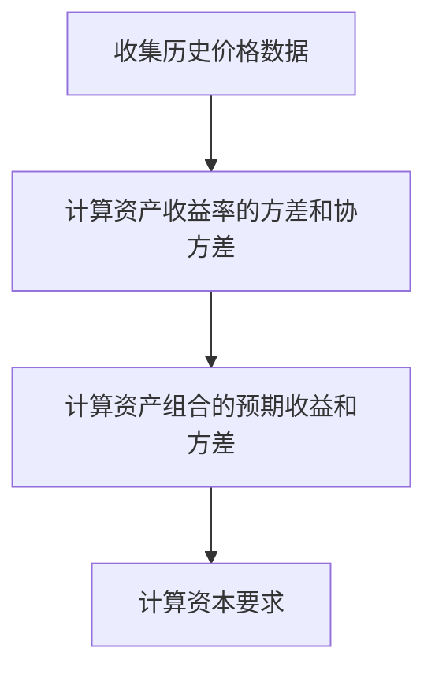
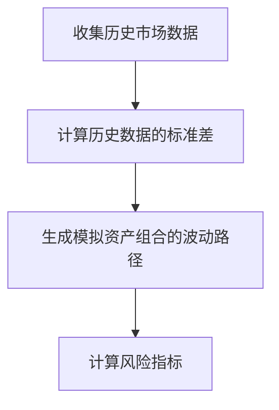
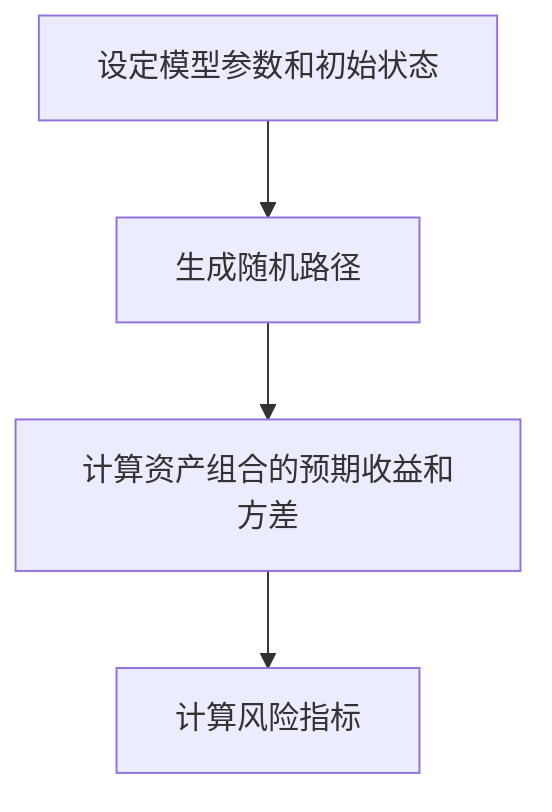
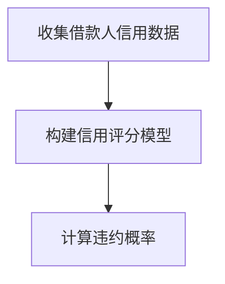
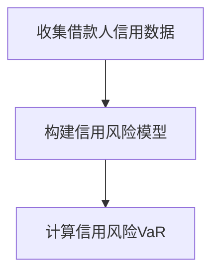
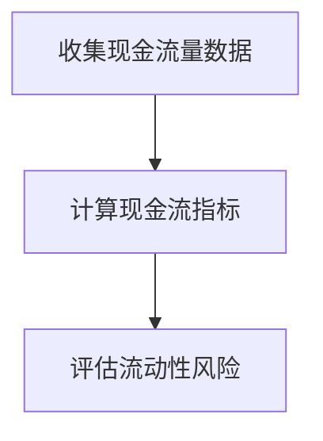
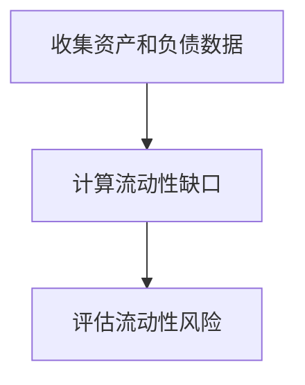

                 

### 第一部分：引言

**第1章：金融风险压力测试概述**

**1.1 问题背景与重要性**

金融风险压力测试，作为一种重要的风险管理手段，在金融行业中扮演着至关重要的角色。随着全球金融市场的发展和金融产品的复杂化，金融机构面临的风险种类和规模也在不断增加。金融风险压力测试的目的在于评估金融机构在极端市场条件下的稳健性，以发现潜在的风险点，确保金融系统的稳定运行。

**1.2 风险压力测试的定义**

风险压力测试是一种通过模拟极端市场情景，对金融机构的风险承受能力进行评估的方法。它旨在识别金融机构在面临极端市场条件时的潜在问题，并提供改进措施，以增强金融机构的抗风险能力。

**1.3 风险压力测试的目标与作用**

风险压力测试的主要目标包括：

1. **评估金融机构的资本充足程度**：通过测试不同市场情景下金融机构的资本消耗，评估其资本充足性，确保金融机构能够应对极端市场状况。
2. **识别潜在风险点**：通过模拟极端市场情景，识别金融机构在哪些方面存在潜在的风险，以便采取针对性的改进措施。
3. **改进风险管理策略**：基于风险压力测试的结果，金融机构可以调整其风险管理策略，优化风险控制措施，提高整体抗风险能力。

**1.4 风险压力测试的发展历程**

风险压力测试起源于20世纪90年代的金融行业，最初主要应用于银行业。随着金融市场的发展，风险压力测试的范围逐渐扩展到保险、证券等多个金融领域。近年来，随着人工智能和大数据技术的应用，风险压力测试的方法和工具也得到了不断更新和优化。

**1.5 风险压力测试的核心概念与术语**

在风险压力测试中，一些核心概念和术语包括：

1. **压力情景**：指模拟市场的一种极端状态，用于评估金融机构的风险承受能力。
2. **风险模型**：用于量化金融机构风险的一种数学模型。
3. **资本消耗**：指在压力情景下金融机构所需增加的资本量。
4. **敏感性分析**：通过改变某些关键参数，评估其对风险模型结果的影响。

**总结**

金融风险压力测试作为一种重要的风险管理工具，其在金融市场中的重要性日益凸显。通过对风险压力测试的深入理解，金融机构可以更好地识别和管理风险，确保其稳健运行。接下来，我们将进一步探讨金融风险模型的构建方法和压力测试的具体实施过程。

### **第2章：金融风险模型设计**

**2.1 风险因素识别与分类**

金融风险模型设计的第一步是识别和分类风险因素。风险因素可以根据其性质和影响范围进行分类。常见的风险因素包括：

1. **市场风险**：由于市场价格波动导致的风险，如利率风险、汇率风险、股票价格波动等。
2. **信用风险**：借款人无法按时偿还债务导致的风险。
3. **流动性风险**：由于资金流动性不足而无法满足短期债务需求的风险。
4. **操作风险**：由于内部流程、人员失误、系统故障等原因导致的风险。

**2.2 风险度量方法**

风险度量是金融风险模型设计的核心。不同的风险类型需要采用不同的度量方法。以下是几种常见的风险度量方法：

1. **市场风险度量**：
   - **价值调整的资本（Variance-Covariance 方法）**：通过计算资产组合的方差和协方差矩阵，评估市场风险。
   - **历史模拟法**：通过历史市场数据，模拟资产组合的未来波动情况，评估市场风险。
   - **蒙特卡罗模拟**：通过随机模拟市场情景，评估市场风险。

2. **信用风险度量**：
   - **违约概率模型**：如KMV的Credit Monitor模型，通过评估借款人的信用状况，计算其违约概率。
   - **风险价值（VaR）模型**：通过模拟借款人信用状况的变化，评估信用风险。

3. **流动性风险度量**：
   - **现金流量分析**：通过分析金融机构的现金流量，评估流动性风险。
   - **流动性缺口分析**：通过比较资产和负债的流动性，评估流动性风险。

**2.3 风险模型构建步骤**

构建金融风险模型通常包括以下步骤：

1. **风险因素识别与分类**：确定金融机构面临的风险类型。
2. **数据收集**：收集与风险因素相关的历史数据和市场数据。
3. **模型假设与设定**：根据风险因素的特点，设定模型的基本假设。
4. **模型构建**：根据数据和分析结果，构建数学模型。
5. **参数估计**：通过历史数据，估计模型参数。
6. **模型验证**：通过模拟不同的市场情景，验证模型的准确性和稳定性。

**2.4 风险模型评估方法**

评估金融风险模型的有效性是模型设计的重要环节。以下是几种常见的评估方法：

1. **回测**：通过历史数据，验证模型在实际市场情景下的表现。
2. **情景测试**：模拟不同的市场情景，评估模型的预测能力。
3. **敏感性分析**：通过调整模型参数，评估其对风险度量结果的影响。
4. **比较分析**：将模型结果与市场实际表现进行对比，评估模型的准确性。

**总结**

金融风险模型设计是风险管理的核心，通过对风险因素的识别、度量方法的运用、模型构建步骤的遵循和模型评估方法的实施，金融机构可以有效地识别和管理风险，提高其抗风险能力。在下一章中，我们将探讨压力情景的设定和压力测试的具体实施过程。

### **2.2 风险度量方法**

在金融风险模型设计中，风险度量方法的选择至关重要，因为它们决定了模型预测风险的能力。以下将详细介绍几种常见的风险度量方法，并使用Mermaid流程图来展示其基本原理和步骤。

#### **市场风险度量方法**

**1. **价值调整的资本（Variance-Covariance 方法）**

价值调整的资本方法是一种常用的市场风险度量方法。它通过计算资产组合的方差和协方差矩阵，评估市场风险。以下是该方法的基本步骤：

1. 收集历史价格数据
2. 计算资产收益率的方差和协方差
3. 计算资产组合的预期收益和方差
4. 计算资本要求

**2. 历史模拟法**

历史模拟法通过历史市场数据，模拟资产组合的未来波动情况，以评估市场风险。其步骤如下：

1. 收集历史市场数据
2. 计算历史数据的标准差
3. 生成模拟资产组合的波动路径
4. 计算风险指标（如VaR）

**3. 蒙特卡罗模拟**

蒙特卡罗模拟通过随机模拟市场情景，评估市场风险。其步骤如下：

1. 设定模型参数和初始状态
2. 生成随机路径
3. 计算资产组合的预期收益和方差
4. 计算风险指标

#### **信用风险度量方法**

**1. 违约概率模型**

违约概率模型通过评估借款人的信用状况，计算其违约概率。其步骤如下：

1. 收集借款人信用数据
2. 构建信用评分模型
3. 计算违约概率

**2. 风险价值（VaR）模型**

风险价值模型通过模拟借款人信用状况的变化，评估信用风险。其步骤如下：

1. 收集借款人信用数据
2. 构建信用风险模型
3. 计算信用风险VaR

#### **流动性风险度量方法**

**1. 现金流量分析**

现金流量分析通过分析金融机构的现金流量，评估流动性风险。其步骤如下：

1. 收集现金流量数据
2. 计算现金流量指标（如现金流缺口）
3. 评估流动性风险

**2. 流动性缺口分析**

流动性缺口分析通过比较资产和负债的流动性，评估流动性风险。其步骤如下：

1. 收集资产和负债数据
2. 计算流动性缺口
3. 评估流动性风险

**总结**

风险度量方法的选择取决于金融机构的风险类型和特征。市场风险、信用风险和流动性风险的度量方法各有特点，但它们的核心目标都是准确评估金融机构的风险水平。通过上述方法，金融机构可以更好地理解和控制风险，确保其稳健运营。在下一章节中，我们将进一步探讨压力情景的设定和压力测试的实施过程。### 第3章：压力情景设定

**3.1 压力情景分类**

压力情景是金融风险压力测试中的核心概念，用于模拟金融机构在极端市场条件下的表现。根据其来源和特征，压力情景可以分为以下几类：

1. **市场压力情景**：这类情景基于市场数据的极端波动，包括利率波动、汇率波动、股票市场波动等。
2. **信用压力情景**：这类情景模拟信用风险的增加，如借款人违约率的上升。
3. **流动性压力情景**：这类情景模拟流动性不足的情况，如银行间市场流动性紧张。
4. **操作压力情景**：这类情景模拟由于内部操作失误或系统故障导致的损失。

**3.2 压力情景设计方法**

设计压力情景的方法包括历史情景法和情景构建法。

1. **历史情景法**：该方法基于历史市场数据，选择具有代表性的极端市场情景作为压力情景。其步骤如下：
   - 收集历史市场数据
   - 选择极端市场事件
   - 重现历史市场情景

2. **情景构建法**：该方法通过专家判断和数据分析，构建新的极端市场情景。其步骤如下：
   - 识别潜在的风险因素
   - 构建情景假设
   - 设计情景参数

**3.3 压力情景参数设置**

压力情景参数的设置是压力情景设计的关键环节。参数设置需要考虑以下因素：

1. **情景持续时间**：设置情景模拟的时间长度，如1天、1周、1个月等。
2. **情景强度**：设置情景的极端程度，如利率波动范围、汇率波动幅度等。
3. **情景范围**：设置情景涉及的资产和业务范围，如特定市场、特定业务线等。

参数设置方法包括：
- **统计分析法**：通过历史数据分析，设置参数的期望值和波动性。
- **专家判断法**：通过专家的经验和判断，设置参数的合理范围。
- **结合法**：将统计分析和专家判断相结合，设置参数。

**总结**

压力情景设定是金融风险压力测试的关键步骤，通过分类、设计和参数设置，金融机构可以模拟极端市场条件下的风险表现，评估其抗风险能力。在下一章节中，我们将探讨压力测试模型的构建和参数调整。### 第4章：压力测试模型构建

**4.1 压力测试框架设计**

压力测试框架是整个测试过程的骨架，它决定了测试的全面性和有效性。设计压力测试框架时，需要考虑以下几个方面：

1. **目标设定**：明确压力测试的目标，如评估资本充足程度、识别潜在风险点等。
2. **测试范围**：确定测试涉及的资产、业务线和部门。
3. **测试类型**：选择合适的测试类型，包括市场风险测试、信用风险测试、流动性风险测试等。
4. **测试方法**：选择适合的测试方法，如历史情景法、情景构建法等。
5. **数据来源**：确定测试所需的数据来源，包括历史数据、市场数据、内部数据等。

**4.2 压力测试模型选择**

压力测试模型的选择取决于金融机构的风险特征和测试目标。以下是几种常见的压力测试模型：

1. **Variance-Covariance 模型**：适用于市场风险的度量，通过计算资产组合的方差和协方差矩阵来评估风险。
2. **历史模拟模型**：通过历史市场数据，模拟资产组合的未来波动情况，评估市场风险。
3. **蒙特卡罗模型**：通过随机模拟市场情景，评估市场风险。
4. **Credit Monitor 模型**：适用于信用风险的度量，通过评估借款人的信用状况，计算其违约概率。
5. **现金流模型**：适用于流动性风险的度量，通过分析金融机构的现金流量，评估流动性风险。

**4.3 压力测试模型参数调整**

压力测试模型的参数调整是确保测试结果准确性的关键。参数调整需要考虑以下几个方面：

1. **参数范围**：设置参数的合理范围，如利率波动的上下限、汇率波动的幅度等。
2. **参数估计**：使用历史数据和市场数据，对参数进行估计。
3. **参数敏感性**：分析参数变化对测试结果的影响，进行参数敏感性分析。
4. **参数优化**：通过优化参数，提高模型的预测准确性和稳定性。

**总结**

压力测试框架的设计、模型的选择和参数的调整是构建有效压力测试模型的关键步骤。通过这些步骤，金融机构可以全面评估其风险承受能力，识别潜在风险点，并采取相应的改进措施。在下一章节中，我们将探讨压力测试结果的分析方法。### 第5章：压力测试结果分析

**5.1 结果分析方法**

压力测试结果的分析是评估金融机构抗风险能力的重要环节。以下几种方法常用于结果分析：

1. **VaR分析**：通过计算在不同置信水平下的VaR值，评估金融机构在极端市场条件下的资本消耗。
2. **压力情景回测**：将压力测试结果与实际市场表现进行对比，验证模型的准确性和稳定性。
3. **敏感性分析**：通过调整模型参数，分析不同参数变化对风险度量结果的影响。
4. **风险管理策略评估**：基于压力测试结果，评估金融机构的风险管理策略的有效性。

**5.2 情景风险评估**

情景风险评估是压力测试结果分析的核心。以下步骤可用于情景风险评估：

1. **风险情景分类**：根据压力情景的严重程度和影响范围，对风险情景进行分类。
2. **风险情景权重**：为不同风险情景分配权重，反映其对金融机构的影响程度。
3. **风险情景评估**：对每个风险情景进行评估，计算其风险值。
4. **风险评估报告**：编写风险评估报告，总结各风险情景的风险评估结果。

**5.3 敏感性分析**

敏感性分析用于评估模型参数变化对风险度量结果的影响。以下步骤可用于敏感性分析：

1. **参数选择**：选择对模型结果影响较大的参数。
2. **参数变动范围**：设定参数的变动范围。
3. **敏感性计算**：计算参数变动对风险度量结果的影响。
4. **敏感性报告**：编写敏感性分析报告，总结参数变动对风险度量结果的影响。

**5.4 压力测试报告撰写**

压力测试报告是总结压力测试结果和分析结论的重要文档。以下内容应包含在压力测试报告中：

1. **测试目的和范围**：明确压力测试的目标和测试范围。
2. **测试方法和模型**：详细描述压力测试所使用的模型和方法。
3. **测试结果**：展示压力测试的结果，包括VaR值、风险情景评估结果等。
4. **风险评估和结论**：总结压力测试结果，评估金融机构的抗风险能力，提出改进建议。
5. **参考文献**：列出压力测试中引用的相关文献和数据来源。

**总结**

压力测试结果分析是金融风险管理的核心环节，通过VaR分析、情景风险评估、敏感性分析和报告撰写，金融机构可以全面了解其风险状况，制定有效的风险管理策略。在下一章节中，我们将探讨金融机构的实际压力测试案例。### 第6章：金融机构压力测试实践

**6.1 银行压力测试案例**

**案例背景**：某大型银行在2018年进行了一次全面的压力测试，旨在评估其在极端市场条件下的风险承受能力。

**测试目的**：评估该银行在利率波动、汇率波动和市场流动性紧张等极端情景下的资本充足程度。

**测试模型**：采用VaR模型和情景构建法，模拟不同市场情景下的风险暴露。

**测试过程**：

1. **数据收集**：收集过去5年的利率、汇率和市场流动性数据。
2. **情景构建**：构建多种极端市场情景，包括利率波动、汇率波动和市场流动性紧张。
3. **模型应用**：使用VaR模型计算不同情景下的资本消耗。
4. **结果分析**：分析测试结果，评估该银行在极端市场条件下的资本充足程度。

**测试结论**：测试结果显示，该银行在利率上升和汇率波动情景下，资本充足率有所下降，需要采取进一步的资本补充措施。在市场流动性紧张情景下，该银行表现出较强的抗风险能力。

**改进措施**：该银行计划增加资本储备，优化流动性管理策略，提高抗风险能力。

**6.2 保险业压力测试案例**

**案例背景**：某大型保险公司于2019年进行了一次全面的压力测试，旨在评估其在极端市场条件下的偿付能力。

**测试目的**：评估该保险公司在利率下降、股市波动和信用风险上升等极端情景下的偿付能力。

**测试模型**：采用情景构建法和信用风险模型，模拟不同市场情景下的风险暴露。

**测试过程**：

1. **数据收集**：收集过去5年的利率、股市波动和信用风险数据。
2. **情景构建**：构建多种极端市场情景，包括利率下降、股市波动和信用风险上升。
3. **模型应用**：使用信用风险模型计算不同情景下的风险暴露。
4. **结果分析**：分析测试结果，评估该保险公司的偿付能力。

**测试结论**：测试结果显示，该保险公司在利率下降和股市波动情景下，偿付能力有所下降，需要采取进一步的风险管理措施。在信用风险上升情景下，该保险公司表现出较强的偿付能力。

**改进措施**：该保险公司计划加强信用风险管理，优化资产配置，提高偿付能力。

**6.3 证券业压力测试案例**

**案例背景**：某大型证券公司于2020年进行了一次全面的压力测试，旨在评估其在极端市场条件下的财务稳健性。

**测试目的**：评估该证券公司在市场波动、利率上升和信用风险上升等极端情景下的财务稳健性。

**测试模型**：采用历史模拟法和市场风险模型，模拟不同市场情景下的风险暴露。

**测试过程**：

1. **数据收集**：收集过去5年的市场波动、利率和信用风险数据。
2. **情景构建**：构建多种极端市场情景，包括市场波动、利率上升和信用风险上升。
3. **模型应用**：使用市场风险模型计算不同情景下的风险暴露。
4. **结果分析**：分析测试结果，评估该证券公司的财务稳健性。

**测试结论**：测试结果显示，该证券公司在市场波动和利率上升情景下，财务稳健性有所下降，需要采取进一步的风险管理措施。在信用风险上升情景下，该证券公司表现出较强的财务稳健性。

**改进措施**：该证券公司计划优化市场风险控制，提高资金流动性，加强信用风险管理。

**总结**

通过实际案例可以看出，金融机构的压力测试有助于识别潜在风险，评估风险承受能力，并为改进风险管理策略提供依据。在未来的实践中，金融机构应继续优化压力测试模型，提高测试的准确性和全面性。### 第7章：压力测试模型优化与挑战

**7.1 模型优化方法**

随着金融市场环境的变化和金融产品的复杂化，压力测试模型也需要不断优化以保持其有效性和准确性。以下是一些常见的模型优化方法：

1. **数据质量提升**：提高压力测试所使用的数据质量，包括数据的完整性、准确性和代表性。可以通过数据清洗、数据集成和数据挖掘等技术来提升数据质量。

2. **模型参数调整**：定期对模型参数进行评估和调整，以适应市场环境的变化。可以通过历史数据分析和专家判断来优化模型参数。

3. **模型集成**：将多种模型结合起来，形成多模型集成，以提高模型的预测能力。这种方法可以通过组合不同模型的优势，降低模型的偏差和方差。

4. **机器学习应用**：利用机器学习技术，尤其是深度学习和强化学习，对压力测试模型进行优化。机器学习可以自动发现数据中的模式和规律，提高模型的预测能力。

5. **实时监控与反馈**：建立实时监控体系，对压力测试结果进行持续监控和反馈。通过实时数据和分析，及时调整模型和策略，提高模型的适应性和准确性。

**7.2 压力测试面临的挑战**

尽管压力测试在风险管理中发挥着重要作用，但其在实际应用中仍然面临一些挑战：

1. **数据可获得性**：获取高质量、完整和代表性的数据是压力测试的基础。然而，金融机构在数据收集过程中可能面临数据隐私、数据滞后和数据缺失等问题。

2. **模型复杂性**：金融市场的复杂性和产品多样性导致压力测试模型的复杂性增加。构建和优化这些模型需要大量时间和资源，同时也增加了模型出错的可能性。

3. **模型适应性**：金融市场环境不断变化，压力测试模型需要具备良好的适应性。然而，现有模型往往难以应对突发性事件和极端市场情景。

4. **人为因素**：压力测试的准确性受到人为因素的影响，如专家判断的主观性、数据录入的准确性等。这些问题可能导致测试结果的偏差。

5. **计算资源**：压力测试模型的运行需要大量的计算资源，尤其是在进行大规模模拟和实时监控时。这可能导致计算成本高昂，影响模型的实际应用。

**7.3 未来发展趋势与展望**

未来，压力测试模型将在以下几个方面发展：

1. **数据科学与人工智能的结合**：利用数据科学和人工智能技术，提高压力测试模型的预测能力和适应性。

2. **实时监测与预警系统**：建立实时监测和预警系统，对压力测试结果进行持续监控，及时识别和应对潜在风险。

3. **跨学科合作**：加强金融学、统计学、计算机科学等学科的交叉研究，提高压力测试模型的理论基础和应用实践。

4. **标准化与规范化**：推动压力测试模型的标准化和规范化，提高其普适性和可操作性。

**总结**

压力测试模型的优化和改进是提高金融机构风险管理能力的关键。通过不断优化模型、应对面临的挑战和把握未来发展趋势，金融机构可以更好地应对复杂的市场环境，确保其稳健运营。在下一章中，我们将对本文的主要内容进行回顾，并探讨金融风险管理的意义和未来研究方向。### 第8章：总结与展望

**8.1 主要内容回顾**

本文系统地介绍了金融风险压力测试模型的设计与应用，涵盖了以下几个方面：

1. **金融风险压力测试概述**：阐述了风险压力测试的背景、定义、目标与作用，以及其发展历程和核心概念。
2. **金融风险模型设计**：详细介绍了风险因素识别与分类、风险度量方法、风险模型构建步骤及评估方法。
3. **压力情景设定**：讨论了压力情景的分类、设计方法和参数设置。
4. **压力测试模型构建**：探讨了压力测试框架设计、模型选择和参数调整。
5. **压力测试结果分析**：介绍了结果分析方法、情景风险评估、敏感性分析和报告撰写。
6. **金融机构压力测试实践**：通过实际案例展示了银行、保险业和证券业的压力测试实践。
7. **模型优化与挑战**：分析了模型优化方法和压力测试面临的挑战及未来发展趋势。

**8.2 对金融机构的风险管理意义**

金融风险压力测试对于金融机构的风险管理具有重要意义：

1. **风险识别与评估**：通过压力测试，金融机构可以识别和评估潜在的风险点，提高风险管理的针对性和有效性。
2. **资本充足度评估**：压力测试可以帮助金融机构评估资本充足程度，确保其具备应对极端市场条件的能力。
3. **策略调整与优化**：基于压力测试结果，金融机构可以调整其风险管理策略，优化风险控制措施，提高抗风险能力。
4. **合规与监管**：压力测试结果有助于金融机构满足监管要求，提升其合规水平。

**8.3 研究与实践中应注意的问题**

在研究和实践中，金融机构应注意以下几个方面的问题：

1. **数据质量**：确保压力测试所使用的数据质量，包括数据的完整性、准确性和代表性。
2. **模型适应性**：模型应具备良好的适应性，能够应对突发性事件和极端市场情景。
3. **专家判断**：在模型构建和参数调整过程中，应充分借鉴专家的经验和判断。
4. **计算资源**：合理安排计算资源，确保压力测试模型的运行效率。

**8.4 进一步研究方向与建议**

未来，金融风险压力测试的研究和实践可以从以下几个方面进行：

1. **数据科学和人工智能的结合**：进一步探索如何利用数据科学和人工智能技术提高压力测试的预测能力和适应性。
2. **跨学科合作**：加强金融学、统计学、计算机科学等学科的交叉研究，提高压力测试模型的理论基础和应用实践。
3. **标准化与规范化**：推动压力测试模型的标准化和规范化，提高其普适性和可操作性。
4. **实时监测与预警系统**：建立实时监测和预警系统，对压力测试结果进行持续监控，及时识别和应对潜在风险。

**总结**

金融风险压力测试是现代金融机构风险管理的重要工具。通过本文的回顾，我们不仅了解了压力测试的基本概念和方法，还看到了其在实际应用中的重要性。未来的研究与实践应继续关注模型优化、数据质量和跨学科合作，以提升金融机构的风险管理能力，确保其稳健运营。作者：AI天才研究院/AI Genius Institute & 禅与计算机程序设计艺术 /Zen And The Art of Computer Programming

