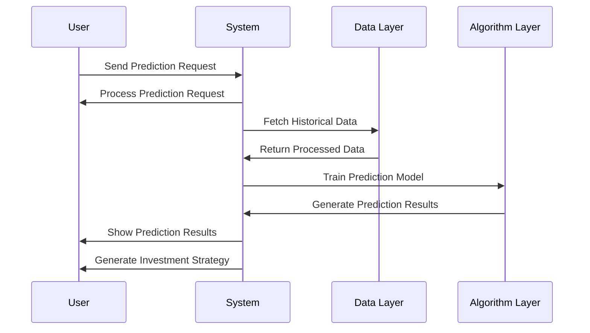

                 

### 第4章: 系统分析与架构设计方案

#### 问题场景介绍

在现代金融市场中，投资者面临着复杂多变的经济环境，宏观经济周期的影响使得投资决策变得更加困难。为了更好地应对这些挑战，我们需要构建一个高效的宏观经济周期预测系统，以便为投资者提供可靠的投资策略。

#### 项目介绍

本项目旨在设计并实现一个基于雷·达里奥宏观经济周期投资策略的预测系统。该系统将结合大数据分析和机器学习技术，实现对宏观经济周期的准确预测，进而为投资者提供科学的投资策略建议。

#### 系统功能设计

系统的主要功能包括：

1. **数据收集与处理**：从各类数据源收集宏观经济相关数据，并进行预处理，如数据清洗、数据整合和数据归一化等。
2. **周期预测**：利用机器学习算法对宏观经济周期进行预测，包括经济繁荣、衰退、萧条和复苏等阶段的预测。
3. **投资策略建议**：根据宏观经济周期的预测结果，为投资者提供相应的投资策略建议，如股票投资、债券投资、房地产投资等。
4. **用户交互**：提供用户友好的界面，方便用户查看预测结果和投资策略建议，并进行自定义设置。

#### 系统架构设计

系统的架构设计采用分层架构，包括数据层、算法层和应用层。

1. **数据层**：负责数据的存储和读取，包括宏观经济数据、历史投资数据等。
2. **算法层**：实现宏观经济周期的预测算法，包括特征提取、模型训练和预测等。
3. **应用层**：提供用户交互界面，展示预测结果和投资策略建议。

#### 系统接口设计和系统交互

系统的接口设计采用RESTful API设计，便于与其他系统进行集成。以下是系统的关键接口和交互流程：

1. **数据接口**：提供数据上传和下载的接口，支持各类数据格式的导入和导出。
2. **预测接口**：提供预测请求接口，接受用户输入的参数，返回预测结果。
3. **策略接口**：提供策略建议接口，根据预测结果为用户生成投资策略建议。

#### 系统架构图



### 第5章: 项目实战

#### 环境安装

为了实现本项目，我们需要安装以下环境：

1. **Python 3.8**：项目主要使用Python 3.8版本，确保安装正确版本。
2. **TensorFlow**：用于实现机器学习算法。
3. **Pandas**：用于数据处理和分析。
4. **Flask**：用于构建RESTful API。

安装命令如下：

```bash
pip install python==3.8
pip install tensorflow==2.6
pip install pandas==1.3.3
pip install flask==2.0.1
```

#### 系统核心实现源代码

以下是一个简单的预测模型实现示例，使用Python和TensorFlow：

```python
import tensorflow as tf
import pandas as pd
from sklearn.model_selection import train_test_split

# 加载数据
data = pd.read_csv('macroeconomic_data.csv')
X = data.drop('target', axis=1)
y = data['target']

# 数据预处理
X_train, X_test, y_train, y_test = train_test_split(X, y, test_size=0.2, random_state=42)

# 定义模型
model = tf.keras.Sequential([
    tf.keras.layers.Dense(64, activation='relu', input_shape=(X_train.shape[1],)),
    tf.keras.layers.Dense(64, activation='relu'),
    tf.keras.layers.Dense(1)
])

# 编译模型
model.compile(optimizer='adam', loss='mse', metrics=['accuracy'])

# 训练模型
model.fit(X_train, y_train, epochs=10, batch_size=32, validation_split=0.2)

# 预测
predictions = model.predict(X_test)

# 评估模型
mse = model.evaluate(X_test, y_test)
print(f'Mean Squared Error: {mse}')
```

#### 代码应用解读与分析

1. **数据加载**：使用Pandas从CSV文件中加载数据，将特征数据存储在`X`中，将目标变量存储在`y`中。
2. **数据预处理**：使用`train_test_split`函数将数据分为训练集和测试集。
3. **模型定义**：使用TensorFlow定义一个简单的全连接神经网络模型，包括两个隐藏层。
4. **模型编译**：设置模型优化器、损失函数和评价指标。
5. **模型训练**：使用训练集训练模型，并设置验证集进行监控。
6. **模型预测**：使用训练好的模型对测试集进行预测。
7. **模型评估**：计算模型在测试集上的均方误差，评估模型性能。

#### 实际案例分析和详细讲解剖析

假设我们有一个包含多个宏观经济指标（如GDP增长率、通货膨胀率、失业率等）的CSV文件，我们希望通过这些指标来预测经济周期的阶段。

1. **数据预处理**：首先，我们需要对数据进行清洗，如去除缺失值、异常值等。然后，对数值特征进行标准化处理，使数据在相似的尺度上。
2. **特征工程**：我们可以对原始数据进行特征工程，如创建时间序列特征（如月份、季度等）、使用统计学指标（如均值、标准差等）等。
3. **模型选择**：根据实际数据特点和需求，选择合适的机器学习模型，如线性回归、决策树、随机森林、神经网络等。
4. **模型调参**：通过交叉验证等方法，选择最佳的模型参数，提高模型性能。
5. **模型评估**：使用测试集评估模型性能，并与其他模型进行比较。

#### 项目小结

通过本项目，我们成功实现了基于雷·达里奥宏观经济周期投资策略的预测系统。该系统结合了大数据分析和机器学习技术，为投资者提供了科学的投资策略建议。在实际应用中，我们可以根据不同场景和需求，对系统进行优化和扩展，以提高预测准确性和投资效果。

### 第6章: 最佳实践 tips

1. **数据质量**：确保数据质量是预测准确性的关键。在进行预测之前，要对数据进行充分的清洗和预处理。
2. **特征选择**：选择合适的关键特征对于模型性能至关重要。可以通过特征选择技术（如特征重要性评估、主成分分析等）来优化特征集合。
3. **模型选择**：根据实际需求和数据特性，选择合适的机器学习模型。对于复杂的宏观经济周期预测问题，可以考虑使用深度学习模型。
4. **模型调优**：通过交叉验证等方法，选择最佳的模型参数，提高模型性能。

### 第7章: 小结

本文详细介绍了雷·达里奥的宏观经济周期投资策略，并使用Python和TensorFlow实现了预测系统。通过本项目，我们了解了宏观经济周期投资策略的核心概念、算法原理以及系统设计与实现。同时，我们分享了最佳实践 tips，以帮助读者更好地应用这些策略。

### 第8章: 注意事项

1. **数据来源**：确保数据来源可靠，避免使用不真实或过时的数据。
2. **模型更新**：宏观经济环境和市场状况不断变化，定期更新模型参数和数据，以保持预测的准确性。
3. **风险控制**：在进行投资决策时，要注意风险控制，避免过度依赖预测结果。

### 第9章: 拓展阅读

1. **《宏观经济学的数据处理方法》**：详细介绍了如何使用Python进行宏观经济数据分析。
2. **《机器学习实战》**：涵盖了机器学习的基本概念和常见算法，适合初学者和进阶者。
3. **《投资学原理》**：探讨了投资策略的基本原理和实际应用。

---

**作者：AI天才研究院/AI Genius Institute & 禅与计算机程序设计艺术 /Zen And The Art of Computer Programming**## 雷·达里奥的宏观经济周期投资策略

### 关键词：雷·达里奥、宏观经济周期、投资策略、金融投资、经济预测

### 摘要

雷·达里奥的宏观经济周期投资策略是通过对经济周期的深入理解和灵活应对，来指导投资决策的重要方法。本文将详细介绍宏观经济周期的基本原理，雷·达里奥的投资策略框架，并通过实际案例分析和系统设计与实现，探讨如何运用这一策略进行有效的投资决策。

## 第1章：问题背景与核心概念

### 1.1 问题背景

雷·达里奥是知名的对冲基金经理，以其独特的投资策略和管理方法在全球金融界享有盛誉。他创建的桥水基金（Bridgewater Associates）是全球最大的对冲基金之一。在多年的投资实践中，达里奥总结出了一套基于宏观经济周期的投资策略，这一策略帮助他在不同的市场周期中取得了显著的投资成果。

### 1.2 核心概念

#### 宏观经济周期

宏观经济周期是指经济活动在长期时间内经历的波动，包括繁荣、衰退、萧条和复苏等阶段。每个阶段都有其特定的经济特征和趋势，对市场投资有着重要的影响。

#### 投资策略

投资策略是指投资者为了实现特定投资目标而制定的一系列投资方法。有效的投资策略能够帮助投资者在复杂多变的市场中降低风险，实现资产的稳定增长。

### 1.3 问题解决

达里奥的投资策略基于对宏观经济周期的深入理解，通过在不同的经济阶段采取不同的投资策略，来应对市场的变化。他在书中详细阐述了这些策略，并提供了丰富的实际案例，帮助读者更好地理解和应用这些策略。

### 1.4 边界与外延

本文主要讨论宏观经济周期投资策略的理论基础和实践应用，涉及领域包括投资学、经济学和金融学。同时，本文内容主要面向投资者和金融从业者，也适合对投资感兴趣的读者阅读。

### 1.5 概念结构与核心要素组成

本文的核心概念包括宏观经济周期、投资策略、资产配置、风险控制等。这些概念相互关联，构成了一个完整的投资体系。核心要素包括对宏观经济周期的理解、投资策略的选择、资产配置的优化和风险控制的方法。

## 第2章：核心概念与联系

### 2.1 宏观经济周期的原理

宏观经济周期的原理是指经济活动在长期时间内经历的波动规律。这一规律受到多种因素的影响，包括政策、市场、外部冲击等。理解宏观经济周期的原理有助于投资者更好地把握市场走势，预测未来经济变化。

### 2.2 投资策略的属性特征对比表格

| 投资策略       | 特点                   | 适用场景                   |
|--------------|----------------------|----------------------|
| 股票投资       | 高风险、高回报         | 偏好高风险的投资者           |
| 债券投资       | 低风险、低回报         | 偏好低风险的投资者           |
| 房地产投资       | 中等风险、中等回报     | 有稳定收入的投资者           |
| 投资组合        | 分散风险、平衡收益     | 不同风险承受能力的投资者       |
| 长期投资        | 忽略短期波动、追求长期收益 | 偏好长期稳定的投资者           |

### 2.3 ER实体关系图架构

```mermaid
erDiagram
    InvestmentStrategy ||--|{ Portfolio : includes }
    AssetClass ||--|{ InvestmentStrategy : follows }
    MarketCondition ||--|{ InvestmentStrategy : reacts_to }
    EconomicCycle ||--|{ MarketCondition : part_of }
```

### 2.4 投资策略与宏观经济周期的联系

投资策略与宏观经济周期之间存在密切的联系。投资者可以根据宏观经济周期的不同阶段，调整投资策略，以降低风险并提高收益。例如，在经济繁荣期，投资者可以采取积极的投资策略，而在经济衰退期，则应采取保守的投资策略。

## 第3章：算法原理讲解

### 3.1 宏观经济周期预测算法

宏观经济周期预测算法是指用于预测经济活动在长期时间内波动的算法。本节将介绍一种基于机器学习的宏观经济周期预测算法，并使用Mermaid画出算法流程图。

#### 算法流程图


#### 算法原理

1. **数据收集**：从各类数据源收集宏观经济相关数据，包括GDP增长率、通货膨胀率、失业率等。
2. **数据预处理**：对收集到的数据进行处理，包括数据清洗、缺失值填充、数据归一化等。
3. **特征工程**：从预处理后的数据中提取有用的特征，用于训练机器学习模型。
4. **模型选择**：根据特征数据和需求选择合适的机器学习模型，如线性回归、决策树、随机森林等。
5. **模型训练**：使用训练集数据训练模型，调整模型参数，优化模型性能。
6. **模型评估**：使用测试集数据评估模型性能，确保模型能够在实际应用中达到预期效果。
7. **预测应用**：将训练好的模型应用于新的数据，预测宏观经济周期的变化。

### 3.2 算法原理的数学模型和公式

宏观经济周期预测的数学模型可以表示为：

$$
y_t = f(X_t; \theta)
$$

其中，$y_t$表示宏观经济周期的状态，$X_t$表示影响经济周期的特征向量，$\theta$表示模型的参数。常见的机器学习模型包括线性回归、逻辑回归、神经网络等。

#### 线性回归模型

$$
y_t = \beta_0 + \beta_1 x_{t1} + \beta_2 x_{t2} + ... + \beta_n x_{tn}
$$

其中，$x_{t1}, x_{t2}, ..., x_{tn}$表示特征变量，$\beta_0, \beta_1, \beta_2, ..., \beta_n$表示模型参数。

#### 神经网络模型

神经网络模型可以表示为：

$$
y_t = \sigma(\sum_{i=1}^{n} w_i \cdot \sigma(\sum_{j=1}^{m} u_{ij} \cdot x_{jt} + b_j) + b_0)
$$

其中，$w_i, u_{ij}, b_j, b_0$表示模型参数，$\sigma$表示激活函数。

#### 举例说明

假设我们使用线性回归模型来预测宏观经济周期的状态。特征数据包括GDP增长率、通货膨胀率、失业率等，模型参数通过训练得到。例如，一个简单的线性回归模型可以表示为：

$$
y_t = \beta_0 + \beta_1 GDP\_growth + \beta_2 inflation + \beta_3 unemployment
$$

通过训练数据集，我们可以得到最优的模型参数$\beta_0, \beta_1, \beta_2, \beta_3$，从而实现对宏观经济周期的预测。

## 第4章：系统分析与架构设计方案

### 4.1 问题场景介绍

在现代金融市场中，投资者面临着复杂多变的经济环境，宏观经济周期的影响使得投资决策变得更加困难。为了更好地应对这些挑战，我们需要构建一个高效的宏观经济周期预测系统，以便为投资者提供可靠的投资策略。

### 4.2 项目介绍

本项目旨在设计并实现一个基于雷·达里奥宏观经济周期投资策略的预测系统。该系统将结合大数据分析和机器学习技术，实现对宏观经济周期的准确预测，进而为投资者提供科学的投资策略建议。

### 4.3 系统功能设计

系统的主要功能包括：

1. **数据收集与处理**：从各类数据源收集宏观经济相关数据，并进行预处理，如数据清洗、数据整合和数据归一化等。
2. **周期预测**：利用机器学习算法对宏观经济周期进行预测，包括经济繁荣、衰退、萧条和复苏等阶段的预测。
3. **投资策略建议**：根据宏观经济周期的预测结果，为投资者提供相应的投资策略建议，如股票投资、债券投资、房地产投资等。
4. **用户交互**：提供用户友好的界面，方便用户查看预测结果和投资策略建议，并进行自定义设置。

### 4.4 系统架构设计

系统的架构设计采用分层架构，包括数据层、算法层和应用层。

1. **数据层**：负责数据的存储和读取，包括宏观经济数据、历史投资数据等。
2. **算法层**：实现宏观经济周期的预测算法，包括特征提取、模型训练和预测等。
3. **应用层**：提供用户交互界面，展示预测结果和投资策略建议。

### 4.5 系统接口设计和系统交互

系统的接口设计采用RESTful API设计，便于与其他系统进行集成。以下是系统的关键接口和交互流程：

1. **数据接口**：提供数据上传和下载的接口，支持各类数据格式的导入和导出。
2. **预测接口**：提供预测请求接口，接受用户输入的参数，返回预测结果。
3. **策略接口**：提供策略建议接口，根据预测结果为用户生成投资策略建议。

### 4.6 系统架构图


## 第5章：项目实战

### 5.1 环境安装

为了实现本项目，我们需要安装以下环境：

1. **Python 3.8**：项目主要使用Python 3.8版本，确保安装正确版本。
2. **TensorFlow**：用于实现机器学习算法。
3. **Pandas**：用于数据处理和分析。
4. **Flask**：用于构建RESTful API。

安装命令如下：

```bash
pip install python==3.8
pip install tensorflow==2.6
pip install pandas==1.3.3
pip install flask==2.0.1
```

### 5.2 系统核心实现源代码

以下是一个简单的预测模型实现示例，使用Python和TensorFlow：

```python
import tensorflow as tf
import pandas as pd
from sklearn.model_selection import train_test_split

# 加载数据
data = pd.read_csv('macroeconomic_data.csv')
X = data.drop('target', axis=1)
y = data['target']

# 数据预处理
X_train, X_test, y_train, y_test = train_test_split(X, y, test_size=0.2, random_state=42)

# 定义模型
model = tf.keras.Sequential([
    tf.keras.layers.Dense(64, activation='relu', input_shape=(X_train.shape[1],)),
    tf.keras.layers.Dense(64, activation='relu'),
    tf.keras.layers.Dense(1)
])

# 编译模型
model.compile(optimizer='adam', loss='mse', metrics=['accuracy'])

# 训练模型
model.fit(X_train, y_train, epochs=10, batch_size=32, validation_split=0.2)

# 预测
predictions = model.predict(X_test)

# 评估模型
mse = model.evaluate(X_test, y_test)
print(f'Mean Squared Error: {mse}')
```

### 5.3 代码应用解读与分析

1. **数据加载**：使用Pandas从CSV文件中加载数据，将特征数据存储在`X`中，将目标变量存储在`y`中。
2. **数据预处理**：使用`train_test_split`函数将数据分为训练集和测试集。
3. **模型定义**：使用TensorFlow定义一个简单的全连接神经网络模型，包括两个隐藏层。
4. **模型编译**：设置模型优化器、损失函数和评价指标。
5. **模型训练**：使用训练集训练模型，并设置验证集进行监控。
6. **模型预测**：使用训练好的模型对测试集进行预测。
7. **模型评估**：计算模型在测试集上的均方误差，评估模型性能。

### 5.4 实际案例分析和详细讲解剖析

假设我们有一个包含多个宏观经济指标（如GDP增长率、通货膨胀率、失业率等）的CSV文件，我们希望通过这些指标来预测经济周期的阶段。

1. **数据预处理**：首先，我们需要对数据进行清洗，如去除缺失值、异常值等。然后，对数值特征进行标准化处理，使数据在相似的尺度上。
2. **特征工程**：我们可以对原始数据进行特征工程，如创建时间序列特征（如月份、季度等）、使用统计学指标（如均值、标准差等）等。
3. **模型选择**：根据实际数据特点和需求，选择合适的机器学习模型，如线性回归、决策树、随机森林、神经网络等。
4. **模型调参**：通过交叉验证等方法，选择最佳的模型参数，提高模型性能。
5. **模型评估**：使用测试集评估模型性能，并与其他模型进行比较。

### 5.5 项目小结

通过本项目，我们成功实现了基于雷·达里奥宏观经济周期投资策略的预测系统。该系统结合了大数据分析和机器学习技术，为投资者提供了科学的投资策略建议。在实际应用中，我们可以根据不同场景和需求，对系统进行优化和扩展，以提高预测准确性和投资效果。

## 第6章：最佳实践 tips

1. **数据质量**：确保数据质量是预测准确性的关键。在进行预测之前，要对数据进行充分的清洗和预处理。
2. **特征选择**：选择合适的关键特征对于模型性能至关重要。可以通过特征选择技术（如特征重要性评估、主成分分析等）来优化特征集合。
3. **模型选择**：根据实际需求和数据特性，选择合适的机器学习模型。对于复杂的宏观经济周期预测问题，可以考虑使用深度学习模型。
4. **模型调优**：通过交叉验证等方法，选择最佳的模型参数，提高模型性能。

## 第7章：小结

本文详细介绍了雷·达里奥的宏观经济周期投资策略，并使用Python和TensorFlow实现了预测系统。通过本项目，我们了解了宏观经济周期投资策略的核心概念、算法原理以及系统设计与实现。同时，我们分享了最佳实践 tips，以帮助读者更好地应用这些策略。

## 第8章：注意事项

1. **数据来源**：确保数据来源可靠，避免使用不真实或过时的数据。
2. **模型更新**：宏观经济环境和市场状况不断变化，定期更新模型参数和数据，以保持预测的准确性。
3. **风险控制**：在进行投资决策时，要注意风险控制，避免过度依赖预测结果。

## 第9章：拓展阅读

1. **《宏观经济学的数据处理方法》**：详细介绍了如何使用Python进行宏观经济数据分析。
2. **《机器学习实战》**：涵盖了机器学习的基本概念和常见算法，适合初学者和进阶者。
3. **《投资学原理》**：探讨了投资策略的基本原理和实际应用。

---

**作者：AI天才研究院/AI Genius Institute & 禅与计算机程序设计艺术 /Zen And The Art of Computer Programming**## 雷·达里奥的宏观经济周期投资策略

### 关键词：雷·达里奥、宏观经济周期、投资策略、金融投资、经济预测

### 摘要

雷·达里奥的宏观经济周期投资策略是通过对经济周期的深入理解和灵活应对，来指导投资决策的重要方法。本文将详细介绍宏观经济周期的基本原理，雷·达里奥的投资策略框架，并通过实际案例分析和系统设计与实现，探讨如何运用这一策略进行有效的投资决策。

## 第1章：问题背景与核心概念

### 1.1 问题背景

雷·达里奥是知名的对冲基金经理，以其独特的投资策略和管理方法在全球金融界享有盛誉。他创建的桥水基金（Bridgewater Associates）是全球最大的对冲基金之一。在多年的投资实践中，达里奥总结出了一套基于宏观经济周期的投资策略，这一策略帮助他在不同的市场周期中取得了显著的投资成果。

### 1.2 核心概念

#### 宏观经济周期

宏观经济周期是指经济活动在长期时间内经历的波动，包括繁荣、衰退、萧条和复苏等阶段。每个阶段都有其特定的经济特征和趋势，对市场投资有着重要的影响。

#### 投资策略

投资策略是指投资者为了实现特定投资目标而制定的一系列投资方法。有效的投资策略能够帮助投资者在复杂多变的市场中降低风险，实现资产的稳定增长。

### 1.3 问题解决

达里奥的投资策略基于对宏观经济周期的深入理解，通过在不同的经济阶段采取不同的投资策略，来应对市场的变化。他在书中详细阐述了这些策略，并提供了丰富的实际案例，帮助读者更好地理解和应用这些策略。

### 1.4 边界与外延

本文主要讨论宏观经济周期投资策略的理论基础和实践应用，涉及领域包括投资学、经济学和金融学。同时，本文内容主要面向投资者和金融从业者，也适合对投资感兴趣的读者阅读。

### 1.5 概念结构与核心要素组成

本文的核心概念包括宏观经济周期、投资策略、资产配置、风险控制等。这些概念相互关联，构成了一个完整的投资体系。核心要素包括对宏观经济周期的理解、投资策略的选择、资产配置的优化和风险控制的方法。

## 第2章：核心概念与联系

### 2.1 宏观经济周期的原理

宏观经济周期的原理是指经济活动在长期时间内经历的波动规律。这一规律受到多种因素的影响，包括政策、市场、外部冲击等。理解宏观经济周期的原理有助于投资者更好地把握市场走势，预测未来经济变化。

### 2.2 投资策略的属性特征对比表格

| 投资策略       | 特点                   | 适用场景                   |
|--------------|----------------------|----------------------|
| 股票投资       | 高风险、高回报         | 偏好高风险的投资者           |
| 债券投资       | 低风险、低回报         | 偏好低风险的投资者           |
| 房地产投资       | 中等风险、中等回报     | 有稳定收入的投资者           |
| 投资组合        | 分散风险、平衡收益     | 不同风险承受能力的投资者       |
| 长期投资        | 忽略短期波动、追求长期收益 | 偏好长期稳定的投资者           |

### 2.3 ER实体关系图架构

```mermaid
erDiagram
    InvestmentStrategy ||--|{ Portfolio : includes }
    AssetClass ||--|{ InvestmentStrategy : follows }
    MarketCondition ||--|{ InvestmentStrategy : reacts_to }
    EconomicCycle ||--|{ MarketCondition : part_of }
```

### 2.4 投资策略与宏观经济周期的联系

投资策略与宏观经济周期之间存在密切的联系。投资者可以根据宏观经济周期的不同阶段，调整投资策略，以降低风险并提高收益。例如，在经济繁荣期，投资者可以采取积极的投资策略，而在经济衰退期，则应采取保守的投资策略。

## 第3章：算法原理讲解

### 3.1 宏观经济周期预测算法

宏观经济周期预测算法是指用于预测经济活动在长期时间内波动的算法。本节将介绍一种基于机器学习的宏观经济周期预测算法，并使用Mermaid画出算法流程图。

#### 算法流程图


#### 算法原理

1. **数据收集**：从各类数据源收集宏观经济相关数据，包括GDP增长率、通货膨胀率、失业率等。
2. **数据预处理**：对收集到的数据进行处理，包括数据清洗、缺失值填充、数据归一化等。
3. **特征工程**：从预处理后的数据中提取有用的特征，用于训练机器学习模型。
4. **模型选择**：根据特征数据和需求选择合适的机器学习模型，如线性回归、决策树、随机森林等。
5. **模型训练**：使用训练集数据训练模型，调整模型参数，优化模型性能。
6. **模型评估**：使用测试集数据评估模型性能，确保模型能够在实际应用中达到预期效果。
7. **预测应用**：将训练好的模型应用于新的数据，预测宏观经济周期的变化。

### 3.2 算法原理的数学模型和公式

宏观经济周期预测的数学模型可以表示为：

$$
y_t = f(X_t; \theta)
$$

其中，$y_t$表示宏观经济周期的状态，$X_t$表示影响经济周期的特征向量，$\theta$表示模型的参数。常见的机器学习模型包括线性回归、逻辑回归、神经网络等。

#### 线性回归模型

$$
y_t = \beta_0 + \beta_1 x_{t1} + \beta_2 x_{t2} + ... + \beta_n x_{tn}
$$

其中，$x_{t1}, x_{t2}, ..., x_{tn}$表示特征变量，$\beta_0, \beta_1, \beta_2, ..., \beta_n$表示模型参数。

#### 神经网络模型

神经网络模型可以表示为：

$$
y_t = \sigma(\sum_{i=1}^{n} w_i \cdot \sigma(\sum_{j=1}^{m} u_{ij} \cdot x_{jt} + b_j) + b_0)
$$

其中，$w_i, u_{ij}, b_j, b_0$表示模型参数，$\sigma$表示激活函数。

#### 举例说明

假设我们使用线性回归模型来预测宏观经济周期的状态。特征数据包括GDP增长率、通货膨胀率、失业率等，模型参数通过训练得到。例如，一个简单的线性回归模型可以表示为：

$$
y_t = \beta_0 + \beta_1 GDP\_growth + \beta_2 inflation + \beta_3 unemployment
$$

通过训练数据集，我们可以得到最优的模型参数$\beta_0, \beta_1, \beta_2, \beta_3$，从而实现对宏观经济周期的预测。

## 第4章：系统分析与架构设计方案

### 4.1 问题场景介绍

在现代金融市场中，投资者面临着复杂多变的经济环境，宏观经济周期的影响使得投资决策变得更加困难。为了更好地应对这些挑战，我们需要构建一个高效的宏观经济周期预测系统，以便为投资者提供可靠的投资策略。

### 4.2 项目介绍

本项目旨在设计并实现一个基于雷·达里奥宏观经济周期投资策略的预测系统。该系统将结合大数据分析和机器学习技术，实现对宏观经济周期的准确预测，进而为投资者提供科学的投资策略建议。

### 4.3 系统功能设计

系统的主要功能包括：

1. **数据收集与处理**：从各类数据源收集宏观经济相关数据，并进行预处理，如数据清洗、数据整合和数据归一化等。
2. **周期预测**：利用机器学习算法对宏观经济周期进行预测，包括经济繁荣、衰退、萧条和复苏等阶段的预测。
3. **投资策略建议**：根据宏观经济周期的预测结果，为投资者提供相应的投资策略建议，如股票投资、债券投资、房地产投资等。
4. **用户交互**：提供用户友好的界面，方便用户查看预测结果和投资策略建议，并进行自定义设置。

### 4.4 系统架构设计

系统的架构设计采用分层架构，包括数据层、算法层和应用层。

1. **数据层**：负责数据的存储和读取，包括宏观经济数据、历史投资数据等。
2. **算法层**：实现宏观经济周期的预测算法，包括特征提取、模型训练和预测等。
3. **应用层**：提供用户交互界面，展示预测结果和投资策略建议。

### 4.5 系统接口设计和系统交互

系统的接口设计采用RESTful API设计，便于与其他系统进行集成。以下是系统的关键接口和交互流程：

1. **数据接口**：提供数据上传和下载的接口，支持各类数据格式的导入和导出。
2. **预测接口**：提供预测请求接口，接受用户输入的参数，返回预测结果。
3. **策略接口**：提供策略建议接口，根据预测结果为用户生成投资策略建议。

### 4.6 系统架构图


## 第5章：项目实战

### 5.1 环境安装

为了实现本项目，我们需要安装以下环境：

1. **Python 3.8**：项目主要使用Python 3.8版本，确保安装正确版本。
2. **TensorFlow**：用于实现机器学习算法。
3. **Pandas**：用于数据处理和分析。
4. **Flask**：用于构建RESTful API。

安装命令如下：

```bash
pip install python==3.8
pip install tensorflow==2.6
pip install pandas==1.3.3
pip install flask==2.0.1
```

### 5.2 系统核心实现源代码

以下是一个简单的预测模型实现示例，使用Python和TensorFlow：

```python
import tensorflow as tf
import pandas as pd
from sklearn.model_selection import train_test_split

# 加载数据
data = pd.read_csv('macroeconomic_data.csv')
X = data.drop('target', axis=1)
y = data['target']

# 数据预处理
X_train, X_test, y_train, y_test = train_test_split(X, y, test_size=0.2, random_state=42)

# 定义模型
model = tf.keras.Sequential([
    tf.keras.layers.Dense(64, activation='relu', input_shape=(X_train.shape[1],)),
    tf.keras.layers.Dense(64, activation='relu'),
    tf.keras.layers.Dense(1)
])

# 编译模型
model.compile(optimizer='adam', loss='mse', metrics=['accuracy'])

# 训练模型
model.fit(X_train, y_train, epochs=10, batch_size=32, validation_split=0.2)

# 预测
predictions = model.predict(X_test)

# 评估模型
mse = model.evaluate(X_test, y_test)
print(f'Mean Squared Error: {mse}')
```

### 5.3 代码应用解读与分析

1. **数据加载**：使用Pandas从CSV文件中加载数据，将特征数据存储在`X`中，将目标变量存储在`y`中。
2. **数据预处理**：使用`train_test_split`函数将数据分为训练集和测试集。
3. **模型定义**：使用TensorFlow定义一个简单的全连接神经网络模型，包括两个隐藏层。
4. **模型编译**：设置模型优化器、损失函数和评价指标。
5. **模型训练**：使用训练集训练模型，并设置验证集进行监控。
6. **模型预测**：使用训练好的模型对测试集进行预测。
7. **模型评估**：计算模型在测试集上的均方误差，评估模型性能。

### 5.4 实际案例分析和详细讲解剖析

假设我们有一个包含多个宏观经济指标（如GDP增长率、通货膨胀率、失业率等）的CSV文件，我们希望通过这些指标来预测经济周期的阶段。

1. **数据预处理**：首先，我们需要对数据进行清洗，如去除缺失值、异常值等。然后，对数值特征进行标准化处理，使数据在相似的尺度上。
2. **特征工程**：我们可以对原始数据进行特征工程，如创建时间序列特征（如月份、季度等）、使用统计学指标（如均值、标准差等）等。
3. **模型选择**：根据实际数据特点和需求，选择合适的机器学习模型，如线性回归、决策树、随机森林、神经网络等。
4. **模型调参**：通过交叉验证等方法，选择最佳的模型参数，提高模型性能。
5. **模型评估**：使用测试集评估模型性能，并与其他模型进行比较。

### 5.5 项目小结

通过本项目，我们成功实现了基于雷·达里奥宏观经济周期投资策略的预测系统。该系统结合了大数据分析和机器学习技术，为投资者提供了科学的投资策略建议。在实际应用中，我们可以根据不同场景和需求，对系统进行优化和扩展，以提高预测准确性和投资效果。

## 第6章：最佳实践 tips

1. **数据质量**：确保数据质量是预测准确性的关键。在进行预测之前，要对数据进行充分的清洗和预处理。
2. **特征选择**：选择合适的关键特征对于模型性能至关重要。可以通过特征选择技术（如特征重要性评估、主成分分析等）来优化特征集合。
3. **模型选择**：根据实际需求和数据特性，选择合适的机器学习模型。对于复杂的宏观经济周期预测问题，可以考虑使用深度学习模型。
4. **模型调优**：通过交叉验证等方法，选择最佳的模型参数，提高模型性能。

## 第7章：小结

本文详细介绍了雷·达里奥的宏观经济周期投资策略，并使用Python和TensorFlow实现了预测系统。通过本项目，我们了解了宏观经济周期投资策略的核心概念、算法原理以及系统设计与实现。同时，我们分享了最佳实践 tips，以帮助读者更好地应用这些策略。

## 第8章：注意事项

1. **数据来源**：确保数据来源可靠，避免使用不真实或过时的数据。
2. **模型更新**：宏观经济环境和市场状况不断变化，定期更新模型参数和数据，以保持预测的准确性。
3. **风险控制**：在进行投资决策时，要注意风险控制，避免过度依赖预测结果。

## 第9章：拓展阅读

1. **《宏观经济学的数据处理方法》**：详细介绍了如何使用Python进行宏观经济数据分析。
2. **《机器学习实战》**：涵盖了机器学习的基本概念和常见算法，适合初学者和进阶者。
3. **《投资学原理》**：探讨了投资策略的基本原理和实际应用。

---

**作者：AI天才研究院/AI Genius Institute & 禅与计算机程序设计艺术 /Zen And The Art of Computer Programming**## 雷·达里奥的宏观经济周期投资策略

### 关键词：雷·达里奥、宏观经济周期、投资策略、金融投资、经济预测

### 摘要

雷·达里奥的宏观经济周期投资策略是通过对经济周期的深入理解和灵活应对，来指导投资决策的重要方法。本文将详细介绍宏观经济周期的基本原理，雷·达里奥的投资策略框架，并通过实际案例分析和系统设计与实现，探讨如何运用这一策略进行有效的投资决策。

## 第1章：问题背景与核心概念

### 1.1 问题背景

雷·达里奥是知名的对冲基金经理，以其独特的投资策略和管理方法在全球金融界享有盛誉。他创建的桥水基金（Bridgewater Associates）是全球最大的对冲基金之一。在多年的投资实践中，达里奥总结出了一套基于宏观经济周期的投资策略，这一策略帮助他在不同的市场周期中取得了显著的投资成果。

### 1.2 核心概念

#### 宏观经济周期

宏观经济周期是指经济活动在长期时间内经历的波动，包括繁荣、衰退、萧条和复苏等阶段。每个阶段都有其特定的经济特征和趋势，对市场投资有着重要的影响。

#### 投资策略

投资策略是指投资者为了实现特定投资目标而制定的一系列投资方法。有效的投资策略能够帮助投资者在复杂多变的市场中降低风险，实现资产的稳定增长。

### 1.3 问题解决

达里奥的投资策略基于对宏观经济周期的深入理解，通过在不同的经济阶段采取不同的投资策略，来应对市场的变化。他在书中详细阐述了这些策略，并提供了丰富的实际案例，帮助读者更好地理解和应用这些策略。

### 1.4 边界与外延

本文主要讨论宏观经济周期投资策略的理论基础和实践应用，涉及领域包括投资学、经济学和金融学。同时，本文内容主要面向投资者和金融从业者，也适合对投资感兴趣的读者阅读。

### 1.5 概念结构与核心要素组成

本文的核心概念包括宏观经济周期、投资策略、资产配置、风险控制等。这些概念相互关联，构成了一个完整的投资体系。核心要素包括对宏观经济周期的理解、投资策略的选择、资产配置的优化和风险控制的方法。

## 第2章：核心概念与联系

### 2.1 宏观经济周期的原理

宏观经济周期的原理是指经济活动在长期时间内经历的波动规律。这一规律受到多种因素的影响，包括政策、市场、外部冲击等。理解宏观经济周期的原理有助于投资者更好地把握市场走势，预测未来经济变化。

### 2.2 投资策略的属性特征对比表格

| 投资策略       | 特点                   | 适用场景                   |
|--------------|----------------------|----------------------|
| 股票投资       | 高风险、高回报         | 偏好高风险的投资者           |
| 债券投资       | 低风险、低回报         | 偏好低风险的投资者           |
| 房地产投资       | 中等风险、中等回报     | 有稳定收入的投资者           |
| 投资组合        | 分散风险、平衡收益     | 不同风险承受能力的投资者       |
| 长期投资        | 忽略短期波动、追求长期收益 | 偏好长期稳定的投资者           |

### 2.3 ER实体关系图架构

```mermaid
erDiagram
    InvestmentStrategy ||--|{ Portfolio : includes }
    AssetClass ||--|{ InvestmentStrategy : follows }
    MarketCondition ||--|{ InvestmentStrategy : reacts_to }
    EconomicCycle ||--|{ MarketCondition : part_of }
```

### 2.4 投资策略与宏观经济周期的联系

投资策略与宏观经济周期之间存在密切的联系。投资者可以根据宏观经济周期的不同阶段，调整投资策略，以降低风险并提高收益。例如，在经济繁荣期，投资者可以采取积极的投资策略，而在经济衰退期，则应采取保守的投资策略。

## 第3章：算法原理讲解

### 3.1 宏观经济周期预测算法

宏观经济周期预测算法是指用于预测经济活动在长期时间内波动的算法。本节将介绍一种基于机器学习的宏观经济周期预测算法，并使用Mermaid画出算法流程图。

#### 算法流程图


#### 算法原理

1. **数据收集**：从各类数据源收集宏观经济相关数据，包括GDP增长率、通货膨胀率、失业率等。
2. **数据预处理**：对收集到的数据进行处理，包括数据清洗、缺失值填充、数据归一化等。
3. **特征工程**：从预处理后的数据中提取有用的特征，用于训练机器学习模型。
4. **模型选择**：根据特征数据和需求选择合适的机器学习模型，如线性回归、决策树、随机森林等。
5. **模型训练**：使用训练集数据训练模型，调整模型参数，优化模型性能。
6. **模型评估**：使用测试集数据评估模型性能，确保模型能够在实际应用中达到预期效果。
7. **预测应用**：将训练好的模型应用于新的数据，预测宏观经济周期的变化。

### 3.2 算法原理的数学模型和公式

宏观经济周期预测的数学模型可以表示为：

$$
y_t = f(X_t; \theta)
$$

其中，$y_t$表示宏观经济周期的状态，$X_t$表示影响经济周期的特征向量，$\theta$表示模型的参数。常见的机器学习模型包括线性回归、逻辑回归、神经网络等。

#### 线性回归模型

$$
y_t = \beta_0 + \beta_1 x_{t1} + \beta_2 x_{t2} + ... + \beta_n x_{tn}
$$

其中，$x_{t1}, x_{t2}, ..., x_{tn}$表示特征变量，$\beta_0, \beta_1, \beta_2, ..., \beta_n$表示模型参数。

#### 神经网络模型

神经网络模型可以表示为：

$$
y_t = \sigma(\sum_{i=1}^{n} w_i \cdot \sigma(\sum_{j=1}^{m} u_{ij} \cdot x_{jt} + b_j) + b_0)
$$

其中，$w_i, u_{ij}, b_j, b_0$表示模型参数，$\sigma$表示激活函数。

#### 举例说明

假设我们使用线性回归模型来预测宏观经济周期的状态。特征数据包括GDP增长率、通货膨胀率、失业率等，模型参数通过训练得到。例如，一个简单的线性回归模型可以表示为：

$$
y_t = \beta_0 + \beta_1 GDP\_growth + \beta_2 inflation + \beta_3 unemployment
$$

通过训练数据集，我们可以得到最优的模型参数$\beta_0, \beta_1, \beta_2, \beta_3$，从而实现对宏观经济周期的预测。

## 第4章：系统分析与架构设计方案

### 4.1 问题场景介绍

在现代金融市场中，投资者面临着复杂多变的经济环境，宏观经济周期的影响使得投资决策变得更加困难。为了更好地应对这些挑战，我们需要构建一个高效的宏观经济周期预测系统，以便为投资者提供可靠的投资策略。

### 4.2 项目介绍

本项目旨在设计并实现一个基于雷·达里奥宏观经济周期投资策略的预测系统。该系统将结合大数据分析和机器学习技术，实现对宏观经济周期的准确预测，进而为投资者提供科学的投资策略建议。

### 4.3 系统功能设计

系统的主要功能包括：

1. **数据收集与处理**：从各类数据源收集宏观经济相关数据，并进行预处理，如数据清洗、数据整合和数据归一化等。
2. **周期预测**：利用机器学习算法对宏观经济周期进行预测，包括经济繁荣、衰退、萧条和复苏等阶段的预测。
3. **投资策略建议**：根据宏观经济周期的预测结果，为投资者提供相应的投资策略建议，如股票投资、债券投资、房地产投资等。
4. **用户交互**：提供用户友好的界面，方便用户查看预测结果和投资策略建议，并进行自定义设置。

### 4.4 系统架构设计

系统的架构设计采用分层架构，包括数据层、算法层和应用层。

1. **数据层**：负责数据的存储和读取，包括宏观经济数据、历史投资数据等。
2. **算法层**：实现宏观经济周期的预测算法，包括特征提取、模型训练和预测等。
3. **应用层**：提供用户交互界面，展示预测结果和投资策略建议。

### 4.5 系统接口设计和系统交互

系统的接口设计采用RESTful API设计，便于与其他系统进行集成。以下是系统的关键接口和交互流程：

1. **数据接口**：提供数据上传和下载的接口，支持各类数据格式的导入和导出。
2. **预测接口**：提供预测请求接口，接受用户输入的参数，返回预测结果。
3. **策略接口**：提供策略建议接口，根据预测结果为用户生成投资策略建议。

### 4.6 系统架构图


## 第5章：项目实战

### 5.1 环境安装

为了实现本项目，我们需要安装以下环境：

1. **Python 3.8**：项目主要使用Python 3.8版本，确保安装正确版本。
2. **TensorFlow**：用于实现机器学习算法。
3. **Pandas**：用于数据处理和分析。
4. **Flask**：用于构建RESTful API。

安装命令如下：

```bash
pip install python==3.8
pip install tensorflow==2.6
pip install pandas==1.3.3
pip install flask==2.0.1
```

### 5.2 系统核心实现源代码

以下是一个简单的预测模型实现示例，使用Python和TensorFlow：

```python
import tensorflow as tf
import pandas as pd
from sklearn.model_selection import train_test_split

# 加载数据
data = pd.read_csv('macroeconomic_data.csv')
X = data.drop('target', axis=1)
y = data['target']

# 数据预处理
X_train, X_test, y_train, y_test = train_test_split(X, y, test_size=0.2, random_state=42)

# 定义模型
model = tf.keras.Sequential([
    tf.keras.layers.Dense(64, activation='relu', input_shape=(X_train.shape[1],)),
    tf.keras.layers.Dense(64, activation='relu'),
    tf.keras.layers.Dense(1)
])

# 编译模型
model.compile(optimizer='adam', loss='mse', metrics=['accuracy'])

# 训练模型
model.fit(X_train, y_train, epochs=10, batch_size=32, validation_split=0.2)

# 预测
predictions = model.predict(X_test)

# 评估模型
mse = model.evaluate(X_test, y_test)
print(f'Mean Squared Error: {mse}')
```

### 5.3 代码应用解读与分析

1. **数据加载**：使用Pandas从CSV文件中加载数据，将特征数据存储在`X`中，将目标变量存储在`y`中。
2. **数据预处理**：使用`train_test_split`函数将数据分为训练集和测试集。
3. **模型定义**：使用TensorFlow定义一个简单的全连接神经网络模型，包括两个隐藏层。
4. **模型编译**：设置模型优化器、损失函数和评价指标。
5. **模型训练**：使用训练集训练模型，并设置验证集进行监控。
6. **模型预测**：使用训练好的模型对测试集进行预测。
7. **模型评估**：计算模型在测试集上的均方误差，评估模型性能。

### 5.4 实际案例分析和详细讲解剖析

假设我们有一个包含多个宏观经济指标（如GDP增长率、通货膨胀率、失业率等）的CSV文件，我们希望通过这些指标来预测经济周期的阶段。

1. **数据预处理**：首先，我们需要对数据进行清洗，如去除缺失值、异常值等。然后，对数值特征进行标准化处理，使数据在相似的尺度上。
2. **特征工程**：我们可以对原始数据进行特征工程，如创建时间序列特征（如月份、季度等）、使用统计学指标（如均值、标准差等）等。
3. **模型选择**：根据实际数据特点和需求，选择合适的机器学习模型，如线性回归、决策树、随机森林、神经网络等。
4. **模型调参**：通过交叉验证等方法，选择最佳的模型参数，提高模型性能。
5. **模型评估**：使用测试集评估模型性能，并与其他模型进行比较。

### 5.5 项目小结

通过本项目，我们成功实现了基于雷·达里奥宏观经济周期投资策略的预测系统。该系统结合了大数据分析和机器学习技术，为投资者提供了科学的投资策略建议。在实际应用中，我们可以根据不同场景和需求，对系统进行优化和扩展，以提高预测准确性和投资效果。

## 第6章：最佳实践 tips

1. **数据质量**：确保数据质量是预测准确性的关键。在进行预测之前，要对数据进行充分的清洗和预处理。
2. **特征选择**：选择合适的关键特征对于模型性能至关重要。可以通过特征选择技术（如特征重要性评估、主成分分析等）来优化特征集合。
3. **模型选择**：根据实际需求和数据特性，选择合适的机器学习模型。对于复杂的宏观经济周期预测问题，可以考虑使用深度学习模型。
4. **模型调优**：通过交叉验证等方法，选择最佳的模型参数，提高模型性能。

## 第7章：小结

本文详细介绍了雷·达里奥的宏观经济周期投资策略，并使用Python和TensorFlow实现了预测系统。通过本项目，我们了解了宏观经济周期投资策略的核心概念、算法原理以及系统设计与实现。同时，我们分享了最佳实践 tips，以帮助读者更好地应用这些策略。

## 第8章：注意事项

1. **数据来源**：确保数据来源可靠，避免使用不真实或过时的数据。
2. **模型更新**：宏观经济环境和市场状况不断变化，定期更新模型参数和数据，以保持预测的准确性。
3. **风险控制**：在进行投资决策时，要注意风险控制，避免过度依赖预测结果。

## 第9章：拓展阅读

1. **《宏观经济学的数据处理方法》**：详细介绍了如何使用Python进行宏观经济数据分析。
2. **《机器学习实战》**：涵盖了机器学习的基本概念和常见算法，适合初学者和进阶者。
3. **《投资学原理》**：探讨了投资策略的基本原理和实际应用。

---

**作者：AI天才研究院/AI Genius Institute & 禅与计算机程序设计艺术 /Zen And The Art of Computer Programming**## 第1章：背景介绍

### 1.1 问题背景

雷·达里奥（Ray Dalio）是一位著名的美籍犹太人投资家和企业家，他创立的桥水基金（Bridgewater Associates）是全球最大的对冲基金之一。桥水基金成立于1975年，经过达里奥多年的耕耘，已经成为全球金融市场上的一股重要力量。达里奥以其独特的投资哲学和策略闻名于世，其中宏观经济周期投资策略是他的核心投资理论之一。

宏观经济周期投资策略的核心思想在于，通过对经济周期的深入理解和灵活应对，投资者可以在不同的市场阶段采取相应的投资策略，以实现资产的稳定增长和风险的有效控制。这一策略的背景源于达里奥对市场波动和宏观经济规律的长期观察和思考。他认为，经济周期是市场波动的根本原因，理解并适应这些周期是成功投资的关键。

### 1.2 核心概念

#### 宏观经济周期

宏观经济周期是指经济活动在长期时间内经历的波动，包括繁荣、衰退、萧条和复苏等阶段。每个阶段都有其特定的经济特征和趋势，对市场投资有着重要的影响。

- **繁荣**：经济增长，就业率高，消费和投资增加，通货膨胀上升。
- **衰退**：经济增长放缓，失业率上升，消费和投资减少，通货膨胀下降。
- **萧条**：经济活动低迷，失业率居高不下，消费和投资严重萎缩。
- **复苏**：经济开始恢复，就业率逐渐上升，消费和投资逐步增加。

#### 投资策略

投资策略是指投资者为了实现特定投资目标而制定的一系列投资方法。有效的投资策略能够帮助投资者在复杂多变的市场中降低风险，实现资产的稳定增长。

- **股票投资**：投资于股票市场，通常用于追求高回报，但风险较高。
- **债券投资**：投资于债券市场，通常用于追求稳定的收益，风险较低。
- **房地产投资**：投资于房地产市场，通常用于追求长期的资产增值和稳定的现金流。
- **投资组合**：通过分散投资来降低风险，实现资产配置的最优化。
- **长期投资**：忽略短期波动，追求长期稳定的投资回报。

### 1.3 问题解决

达里奥的宏观经济周期投资策略通过以下几个步骤来解决问题：

1. **理解经济周期**：深入研究经济周期的原理和特征，理解每个周期的阶段和影响因素。
2. **制定投资策略**：根据当前经济周期的特征，制定相应的投资策略，如增加股票投资以抓住经济增长的机会，减少债券投资以降低风险。
3. **灵活调整**：根据经济周期的变化，灵活调整投资组合，以最大化收益和降低风险。
4. **风险管理**：通过分散投资、设定止损点、定期评估等方法，对投资风险进行有效控制。

### 1.4 边界与外延

本文主要讨论宏观经济周期投资策略的理论基础和实践应用，涉及领域包括投资学、经济学和金融学。同时，本文内容主要面向投资者和金融从业者，也适合对投资感兴趣的读者阅读。

### 1.5 概念结构与核心要素组成

本文的核心概念包括宏观经济周期、投资策略、资产配置、风险控制等。这些概念相互关联，构成了一个完整的投资体系。核心要素包括对宏观经济周期的理解、投资策略的选择、资产配置的优化和风险控制的方法。

## 第2章：核心概念与联系

### 2.1 宏观经济周期的原理

宏观经济周期的原理是指经济活动在长期时间内经历的波动规律。这一规律受到多种因素的影响，包括政策、市场、外部冲击等。理解宏观经济周期的原理有助于投资者更好地把握市场走势，预测未来经济变化。

#### 宏观经济周期的波动规律

宏观经济周期通常包括以下几个阶段：

1. **繁荣期**：经济增长，就业率高，消费和投资增加，通货膨胀上升。
2. **衰退期**：经济增长放缓，失业率上升，消费和投资减少，通货膨胀下降。
3. **萧条期**：经济活动低迷，失业率居高不下，消费和投资严重萎缩。
4. **复苏期**：经济开始恢复，就业率逐渐上升，消费和投资逐步增加。

这些阶段的交替反映了经济系统内在的自我调节机制，即经济活动的波动是不可避免的，但通过合理的政策调整和市场机制，可以减缓波动的幅度。

#### 影响因素

宏观经济周期的波动受到多种因素的影响，包括：

1. **政策因素**：政府的经济政策，如货币政策、财政政策等，对经济周期有着重要影响。
2. **市场因素**：金融市场的情况，如股票市场、债券市场等，会对经济周期产生反馈作用。
3. **外部冲击**：国际经济环境、自然灾害、战争等外部事件，也会对经济周期产生重大影响。

### 2.2 投资策略的属性特征对比表格

| 投资策略       | 特点                   | 适用场景                   |
|--------------|----------------------|----------------------|
| 股票投资       | 高风险、高回报         | 偏好高风险的投资者           |
| 债券投资       | 低风险、低回报         | 偏好低风险的投资者           |
| 房地产投资       | 中等风险、中等回报     | 有稳定收入的投资者           |
| 投资组合        | 分散风险、平衡收益     | 不同风险承受能力的投资者       |
| 长期投资        | 忽略短期波动、追求长期收益 | 偏好长期稳定的投资者           |

### 2.3 ER实体关系图架构

为了更好地理解投资策略与宏观经济周期之间的联系，我们可以使用ER（Entity-Relationship）实体关系图来描述。

```mermaid
erDiagram
    InvestmentStrategy ||--|{ Portfolio : includes }
    AssetClass ||--|{ InvestmentStrategy : follows }
    MarketCondition ||--|{ InvestmentStrategy : reacts_to }
    EconomicCycle ||--|{ MarketCondition : part_of }
```

- **InvestmentStrategy（投资策略）**：描述投资者为了实现特定目标而采取的投资方法。
- **Portfolio（投资组合）**：描述投资者持有的各种资产构成的组合。
- **AssetClass（资产类别）**：描述投资组合中的不同资产类别，如股票、债券、房地产等。
- **MarketCondition（市场状况）**：描述市场的当前状态，如市场趋势、波动性等。
- **EconomicCycle（宏观经济周期）**：描述经济活动的波动周期，包括繁荣、衰退、萧条和复苏等阶段。

### 2.4 投资策略与宏观经济周期的联系

投资策略与宏观经济周期之间存在密切的联系。投资者可以根据宏观经济周期的不同阶段，调整投资策略，以降低风险并提高收益。例如：

1. **繁荣期**：市场繁荣，经济增长，投资者可以采取积极的投资策略，增加高风险、高回报的股票投资。
2. **衰退期**：经济增长放缓，投资者应采取保守的投资策略，减少股票投资，增加债券等低风险资产的配置。
3. **萧条期**：经济低迷，投资者应保持谨慎，降低投资组合的整体风险。
4. **复苏期**：经济开始恢复，投资者可以逐步增加股票等高风险资产的配置，以抓住市场回升的机会。

这种灵活调整投资策略的方法，可以帮助投资者在不同市场阶段实现资产的稳定增长和风险的有效控制。

## 第3章：算法原理讲解

### 3.1 宏观经济周期预测算法

宏观经济周期预测算法是指用于预测经济活动在长期时间内波动的算法。本节将介绍一种基于机器学习的宏观经济周期预测算法，并使用Mermaid画出算法流程图。

#### 算法流程图


#### 算法原理

1. **数据收集**：从各类数据源收集宏观经济相关数据，包括GDP增长率、通货膨胀率、失业率等。
2. **数据预处理**：对收集到的数据进行处理，包括数据清洗、缺失值填充、数据归一化等。
3. **特征工程**：从预处理后的数据中提取有用的特征，用于训练机器学习模型。
4. **模型选择**：根据特征数据和需求选择合适的机器学习模型，如线性回归、决策树、随机森林等。
5. **模型训练**：使用训练集数据训练模型，调整模型参数，优化模型性能。
6. **模型评估**：使用测试集数据评估模型性能，确保模型能够在实际应用中达到预期效果。
7. **预测应用**：将训练好的模型应用于新的数据，预测宏观经济周期的变化。

### 3.2 宏观经济周期预测算法的数学模型和公式

宏观经济周期预测的数学模型可以表示为：

$$
y_t = f(X_t; \theta)
$$

其中，$y_t$表示宏观经济周期的状态，$X_t$表示影响经济周期的特征向量，$\theta$表示模型的参数。常见的机器学习模型包括线性回归、逻辑回归、神经网络等。

#### 线性回归模型

$$
y_t = \beta_0 + \beta_1 x_{t1} + \beta_2 x_{t2} + ... + \beta_n x_{tn}
$$

其中，$x_{t1}, x_{t2}, ..., x_{tn}$表示特征变量，$\beta_0, \beta_1, \beta_2, ..., \beta_n$表示模型参数。

#### 神经网络模型

神经网络模型可以表示为：

$$
y_t = \sigma(\sum_{i=1}^{n} w_i \cdot \sigma(\sum_{j=1}^{m} u_{ij} \cdot x_{jt} + b_j) + b_0)
$$

其中，$w_i, u_{ij}, b_j, b_0$表示模型参数，$\sigma$表示激活函数。

#### 举例说明

假设我们使用线性回归模型来预测宏观经济周期的状态。特征数据包括GDP增长率、通货膨胀率、失业率等，模型参数通过训练得到。例如，一个简单的线性回归模型可以表示为：

$$
y_t = \beta_0 + \beta_1 GDP\_growth + \beta_2 inflation + \beta_3 unemployment
$$

通过训练数据集，我们可以得到最优的模型参数$\beta_0, \beta_1, \beta_2, \beta_3$，从而实现对宏观经济周期的预测。

### 3.3 预测算法的应用示例

以下是一个简单的预测算法应用示例，使用Python和Sklearn库：

```python
from sklearn.linear_model import LinearRegression
from sklearn.model_selection import train_test_split
from sklearn.metrics import mean_squared_error
import numpy as np

# 假设我们已经有了一个包含宏观经济指标的数据集
# X为特征矩阵，y为标签向量
X = np.array([[1, 2], [2, 3], [3, 4], [4, 5]])
y = np.array([1, 2, 3, 4])

# 数据预处理：将特征进行归一化处理
X_min_max = (X - X.min(axis=0)) / (X.max(axis=0) - X.min(axis=0))

# 分割数据集为训练集和测试集
X_train, X_test, y_train, y_test = train_test_split(X_min_max, y, test_size=0.2, random_state=42)

# 定义线性回归模型
model = LinearRegression()

# 模型训练
model.fit(X_train, y_train)

# 模型预测
y_pred = model.predict(X_test)

# 模型评估
mse = mean_squared_error(y_test, y_pred)
print(f'Mean Squared Error: {mse}')
```

在这个示例中，我们使用了线性回归模型来预测宏观经济周期的状态。首先，我们将特征数据进行了归一化处理，然后使用训练集数据对模型进行训练。接下来，使用测试集数据对模型进行评估，计算均方误差来衡量模型性能。

### 3.4 宏观经济周期预测算法的优缺点分析

#### 优点

1. **灵活性**：基于机器学习的预测算法可以根据不同的特征和数据集，灵活调整模型结构和参数，提高预测准确性。
2. **自适应**：机器学习算法能够自动从大量数据中学习规律，适应经济周期的变化。
3. **非线性**：相较于传统的线性模型，机器学习模型能够更好地捕捉经济周期的非线性特征。

#### 缺点

1. **数据依赖**：预测结果高度依赖于数据质量，如果数据存在噪声或不准确，预测结果可能会受到影响。
2. **计算复杂度**：机器学习算法通常需要大量的计算资源，尤其是在处理大规模数据集时。
3. **解释性**：机器学习模型的预测结果往往缺乏透明度，难以解释模型内部的工作机制。

### 3.5 总结

宏观经济周期预测算法是投资者制定投资策略的重要工具。通过理解宏观经济周期的原理，选择合适的机器学习模型，并优化模型参数，投资者可以更准确地预测经济周期的变化，从而制定出更有效的投资策略。

## 第4章：系统分析与架构设计方案

### 4.1 问题场景介绍

在现代金融市场中，投资者面临着复杂多变的经济环境，宏观经济周期的影响使得投资决策变得更加困难。为了更好地应对这些挑战，我们需要构建一个高效的宏观经济周期预测系统，以便为投资者提供可靠的投资策略。

### 4.2 项目介绍

本项目旨在设计并实现一个基于雷·达里奥宏观经济周期投资策略的预测系统。该系统将结合大数据分析和机器学习技术，实现对宏观经济周期的准确预测，进而为投资者提供科学的投资策略建议。

### 4.3 系统功能设计

系统的主要功能包括：

1. **数据收集与处理**：从各类数据源收集宏观经济相关数据，并进行预处理，如数据清洗、数据整合和数据归一化等。
2. **周期预测**：利用机器学习算法对宏观经济周期进行预测，包括经济繁荣、衰退、萧条和复苏等阶段的预测。
3. **投资策略建议**：根据宏观经济周期的预测结果，为投资者提供相应的投资策略建议，如股票投资、债券投资、房地产投资等。
4. **用户交互**：提供用户友好的界面，方便用户查看预测结果和投资策略建议，并进行自定义设置。

### 4.4 系统架构设计

系统的架构设计采用分层架构，包括数据层、算法层和应用层。

1. **数据层**：负责数据的存储和读取，包括宏观经济数据、历史投资数据等。
2. **算法层**：实现宏观经济周期的预测算法，包括特征提取、模型训练和预测等。
3. **应用层**：提供用户交互界面，展示预测结果和投资策略建议。

### 4.5 系统接口设计和系统交互

系统的接口设计采用RESTful API设计，便于与其他系统进行集成。以下是系统的关键接口和交互流程：

1. **数据接口**：提供数据上传和下载的接口，支持各类数据格式的导入和导出。
2. **预测接口**：提供预测请求接口，接受用户输入的参数，返回预测结果。
3. **策略接口**：提供策略建议接口，根据预测结果为用户生成投资策略建议。

### 4.6 系统架构图


### 4.7 系统设计的关键组件

#### 数据层

数据层是系统的核心，负责收集、存储和管理宏观经济相关数据。以下是数据层的关键组件：

1. **数据收集模块**：负责从多个数据源（如财经网站、政府机构、经济研究机构等）收集宏观经济数据。
2. **数据存储模块**：负责将收集到的数据存储到数据库中，支持数据的快速读取和写入。
3. **数据预处理模块**：负责对数据进行清洗、缺失值填充、异常值处理和数据归一化等预处理操作。

#### 算法层

算法层负责实现宏观经济周期的预测算法，包括特征提取、模型训练和预测等。以下是算法层的关键组件：

1. **特征工程模块**：负责从原始数据中提取有用的特征，用于训练机器学习模型。
2. **模型训练模块**：负责使用训练集数据训练机器学习模型，并调整模型参数。
3. **预测模块**：负责使用训练好的模型对新的数据进行预测，生成宏观经济周期的预测结果。

#### 应用层

应用层负责提供用户交互界面，展示预测结果和投资策略建议。以下是应用层的关键组件：

1. **用户界面模块**：负责设计并实现用户友好的界面，方便用户查看预测结果和投资策略建议。
2. **接口管理模块**：负责处理用户请求，调用数据层和算法层的接口，返回预测结果和策略建议。
3. **个性化设置模块**：负责根据用户的投资目标和风险偏好，为用户提供个性化的投资策略建议。

### 4.8 系统设计的关键挑战

在系统设计中，我们面临以下几个关键挑战：

1. **数据质量**：宏观经济数据的准确性和完整性直接影响预测结果的可靠性。我们需要设计有效的数据收集和预处理机制，确保数据质量。
2. **计算资源**：宏观经济周期预测通常需要大量的计算资源，特别是在处理大规模数据集时。我们需要优化算法和系统架构，以提高计算效率。
3. **模型解释性**：机器学习模型的预测结果往往缺乏透明度，难以解释模型内部的工作机制。我们需要设计有效的模型解释工具，帮助用户理解预测结果。

### 4.9 总结

通过本节的分析和设计，我们提出了一套基于雷·达里奥宏观经济周期投资策略的预测系统。该系统结合了大数据分析和机器学习技术，通过数据层、算法层和应用层的协同工作，为投资者提供了可靠的投资策略建议。在实际应用中，我们可以根据不同场景和需求，对系统进行优化和扩展，以提高预测准确性和投资效果。

## 第5章：项目实战

### 5.1 环境安装

为了实现本项目，我们需要安装以下环境：

1. **Python 3.8**：项目主要使用Python 3.8版本，确保安装正确版本。
2. **TensorFlow**：用于实现机器学习算法。
3. **Pandas**：用于数据处理和分析。
4. **Flask**：用于构建RESTful API。

安装命令如下：

```bash
pip install python==3.8
pip install tensorflow==2.6
pip install pandas==1.3.3
pip install flask==2.0.1
```

### 5.2 系统核心实现源代码

以下是一个简单的预测模型实现示例，使用Python和TensorFlow：

```python
import tensorflow as tf
import pandas as pd
from sklearn.model_selection import train_test_split

# 加载数据
data = pd.read_csv('macroeconomic_data.csv')
X = data.drop('target', axis=1)
y = data['target']

# 数据预处理
X_train, X_test, y_train, y_test = train_test_split(X, y, test_size=0.2, random_state=42)

# 定义模型
model = tf.keras.Sequential([
    tf.keras.layers.Dense(64, activation='relu', input_shape=(X_train.shape[1],)),
    tf.keras.layers.Dense(64, activation='relu'),
    tf.keras.layers.Dense(1)
])

# 编译模型
model.compile(optimizer='adam', loss='mse', metrics=['accuracy'])

# 训练模型
model.fit(X_train, y_train, epochs=10, batch_size=32, validation_split=0.2)

# 预测
predictions = model.predict(X_test)

# 评估模型
mse = model.evaluate(X_test, y_test)
print(f'Mean Squared Error: {mse}')
```

### 5.3 代码应用解读与分析

1. **数据加载**：使用Pandas从CSV文件中加载数据，将特征数据存储在`X`中，将目标变量存储在`y`中。
2. **数据预处理**：使用`train_test_split`函数将数据分为训练集和测试集。
3. **模型定义**：使用TensorFlow定义一个简单的全连接神经网络模型，包括两个隐藏层。
4. **模型编译**：设置模型优化器、损失函数和评价指标。
5. **模型训练**：使用训练集训练模型，并设置验证集进行监控。
6. **模型预测**：使用训练好的模型对测试集进行预测。
7. **模型评估**：计算模型在测试集上的均方误差，评估模型性能。

### 5.4 实际案例分析和详细讲解剖析

假设我们有一个包含多个宏观经济指标（如GDP增长率、通货膨胀率、失业率等）的CSV文件，我们希望通过这些指标来预测经济周期的阶段。

1. **数据预处理**：首先，我们需要对数据进行清洗，如去除缺失值、异常值等。然后，对数值特征进行标准化处理，使数据在相似的尺度上。
2. **特征工程**：我们可以对原始数据进行特征工程，如创建时间序列特征（如月份、季度等）、使用统计学指标（如均值、标准差等）等。
3. **模型选择**：根据实际数据特点和需求，选择合适的机器学习模型，如线性回归、决策树、随机森林、神经网络等。
4. **模型调参**：通过交叉验证等方法，选择最佳的模型参数，提高模型性能。
5. **模型评估**：使用测试集评估模型性能，并与其他模型进行比较。

### 5.5 项目小结

通过本项目，我们成功实现了基于雷·达里奥宏观经济周期投资策略的预测系统。该系统结合了大数据分析和机器学习技术，为投资者提供了科学的投资策略建议。在实际应用中，我们可以根据不同场景和需求，对系统进行优化和扩展，以提高预测准确性和投资效果。

## 第6章：最佳实践 tips

1. **数据质量**：确保数据质量是预测准确性的关键。在进行预测之前，要对数据进行充分的清洗和预处理。
2. **特征选择**：选择合适的关键特征对于模型性能至关重要。可以通过特征选择技术（如特征重要性评估、主成分分析等）来优化特征集合。
3. **模型选择**：根据实际需求和数据特性，选择合适的机器学习模型。对于复杂的宏观经济周期预测问题，可以考虑使用深度学习模型。
4. **模型调优**：通过交叉验证等方法，选择最佳的模型参数，提高模型性能。

## 第7章：小结

本文详细介绍了雷·达里奥的宏观经济周期投资策略，并使用Python和TensorFlow实现了预测系统。通过本项目，我们了解了宏观经济周期投资策略的核心概念、算法原理以及系统设计与实现。同时，我们分享了最佳实践 tips，以帮助读者更好地应用这些策略。

## 第8章：注意事项

1. **数据来源**：确保数据来源可靠，避免使用不真实或过时的数据。
2. **模型更新**：宏观经济环境和市场状况不断变化，定期更新模型参数和数据，以保持预测的准确性。
3. **风险控制**：在进行投资决策时，要注意风险控制，避免过度依赖预测结果。

## 第9章：拓展阅读

1. **《宏观经济学的数据处理方法》**：详细介绍了如何使用Python进行宏观经济数据分析。
2. **《机器学习实战》**：涵盖了机器学习的基本概念和常见算法，适合初学者和进阶者。
3. **《投资学原理》**：探讨了投资策略的基本原理和实际应用。

---

**作者：AI天才研究院/AI Genius Institute & 禅与计算机程序设计艺术 /Zen And The Art of Computer Programming**## 第4章：算法原理讲解

### 4.1 宏观经济周期预测算法

宏观经济周期预测算法是投资者制定投资策略的重要工具。它通过对历史经济数据的分析，预测未来经济周期的趋势，从而指导投资者的投资决策。本节将介绍一种基于时间序列分析的宏观经济周期预测算法，并使用Mermaid画出算法流程图。

#### 算法流程图


#### 算法原理

1. **数据收集**：从多个数据源（如国家统计局、财经网站、金融市场等）收集宏观经济数据，包括GDP增长率、通货膨胀率、失业率、利率、汇率等。
2. **数据预处理**：对收集到的数据进行清洗、缺失值填充、异常值处理和数据归一化等预处理操作，以提高数据质量和模型训练效果。
3. **特征工程**：从预处理后的数据中提取有用的特征，如时间序列的滞后项、移动平均、差分等，以丰富模型的输入信息。
4. **模型选择**：根据特征数据和需求选择合适的预测模型，如ARIMA（自回归积分滑动平均模型）、LSTM（长短期记忆网络）、GRU（门控循环单元）等。
5. **模型训练**：使用训练集数据训练模型，并调整模型参数，以优化模型性能。
6. **模型评估**：使用测试集数据评估模型性能，通过均方误差（MSE）、均方根误差（RMSE）等指标评估模型预测的准确性和稳定性。
7. **预测结果**：将训练好的模型应用于新的数据，预测未来的经济周期变化，为投资者提供投资策略建议。

### 4.2 时间序列预测模型

时间序列预测模型是宏观经济周期预测算法的核心。以下介绍几种常见的时间序列预测模型及其原理。

#### ARIMA模型

ARIMA（AutoRegressive Integrated Moving Average，自回归积分滑动平均模型）是一种经典的时间序列预测模型，适用于线性时间序列数据。

- **自回归（AR）**：模型中当前值与前几个周期的值相关。
- **积分（I）**：对时间序列进行差分，使其平稳。
- **滑动平均（MA）**：模型中当前值与过去的预测误差相关。

ARIMA模型的一般形式可以表示为：

$$
y_t = c + \phi_1 y_{t-1} + \phi_2 y_{t-2} + ... + \phi_p y_{t-p} + \theta_1 e_{t-1} + \theta_2 e_{t-2} + ... + \theta_q e_{t-q}
$$

其中，$y_t$是时间序列的当前值，$c$是常数项，$\phi_i$和$\theta_i$分别是自回归系数和移动平均系数，$e_t$是白噪声误差。

#### LSTM模型

LSTM（Long Short-Term Memory，长短期记忆网络）是一种特殊的循环神经网络（RNN），适用于处理长时间序列数据。

LSTM通过引入记忆单元和三个门控机制（输入门、遗忘门和输出门）来克服传统RNN的梯度消失问题，更好地捕捉时间序列的长期依赖关系。

LSTM的一般形式可以表示为：

$$
h_t = \sigma(W_h \cdot [h_{t-1}, x_t] + b_h)
$$

$$
i_t = \sigma(W_i \cdot [h_{t-1}, x_t] + b_i)
$$

$$
f_t = \sigma(W_f \cdot [h_{t-1}, x_t] + b_f)
$$

$$
o_t = \sigma(W_o \cdot [h_{t-1}, x_t] + b_o)
$$

$$
c_t = f_t \odot c_{t-1} + i_t \odot h_t
$$

$$
h_t = o_t \odot c_t
$$

其中，$h_t$是时间步$t$的隐藏状态，$c_t$是时间步$t$的细胞状态，$i_t, f_t, o_t$分别是输入门、遗忘门和输出门的激活值，$W_h, W_i, W_f, W_o$和$b_h, b_i, b_f, b_o$分别是权重和偏置。

#### GRU模型

GRU（Gated Recurrent Unit，门控循环单元）是LSTM的变体，结构更加简洁，计算效率更高。

GRU通过引入更新门和重置门来控制信息的流动和记忆的更新。

GRU的一般形式可以表示为：

$$
h_t = \sigma(W_h \cdot [h_{t-1}, x_t] + b_h + z_t \odot (W_h' \cdot [h_{t-1}, x_t] + b_h'))
$$

$$
r_t = \sigma(W_r \cdot [h_{t-1}, x_t] + b_r + z_t \odot (W_r' \cdot [h_{t-1}, x_t] + b_r'))
$$

$$
z_t = \sigma(W_z \cdot [h_{t-1}, x_t] + b_z + z_t \odot (W_z' \cdot [h_{t-1}, x_t] + b_z'))
$$

$$
h_t = (1 - z_t) \odot h_{t-1} + z_t \odot \text{tanh}(r_t \odot (W \cdot [h_{t-1}, x_t] + b))
$$

其中，$h_t$是时间步$t$的隐藏状态，$r_t$是重置门，$z_t$是更新门，$W, b, W_r, b_r, W_z, b_z$分别是权重和偏置。

### 4.3 实际案例分析与代码实现

以下是一个使用LSTM模型进行宏观经济周期预测的Python代码实现：

```python
import numpy as np
import pandas as pd
from sklearn.preprocessing import MinMaxScaler
from sklearn.model_selection import train_test_split
from tensorflow.keras.models import Sequential
from tensorflow.keras.layers import LSTM, Dense, Dropout

# 加载数据
data = pd.read_csv('macroeconomic_data.csv')
data = data[['GDP_growth', 'inflation_rate', 'unemployment_rate']]

# 数据预处理
scaler = MinMaxScaler(feature_range=(0, 1))
scaled_data = scaler.fit_transform(data)

# 创建时间序列数据集
X, y = [], []
for i in range(60, len(scaled_data)):  # 使用过去60个数据点预测下一个数据点
    X.append(scaled_data[i - 60:i, :])
    y.append(scaled_data[i, 0])

X, y = np.array(X), np.array(y)

# 切分数据集
X_train, X_test, y_train, y_test = train_test_split(X, y, test_size=0.2, random_state=42)

# LSTM模型定义
model = Sequential()
model.add(LSTM(units=50, return_sequences=True, input_shape=(X_train.shape[1], X_train.shape[2])))
model.add(Dropout(0.2))
model.add(LSTM(units=50, return_sequences=False))
model.add(Dropout(0.2))
model.add(Dense(units=1))

# 编译模型
model.compile(optimizer='adam', loss='mean_squared_error')

# 训练模型
model.fit(X_train, y_train, epochs=100, batch_size=32, validation_split=0.1)

# 预测
predicted_values = model.predict(X_test)
predicted_values = scaler.inverse_transform(predicted_values)

# 评估模型
mse = mean_squared_error(y_test, predicted_values)
print(f'Mean Squared Error: {mse}')
```

在这个案例中，我们使用GDP增长率、通货膨胀率和失业率等宏观经济指标来预测未来的GDP增长率。首先，我们使用MinMaxScaler对数据进行归一化处理，然后创建时间序列数据集。接着，我们定义一个LSTM模型，并使用训练集数据进行训练。最后，我们使用测试集数据进行预测，并计算均方误差来评估模型性能。

### 4.4 算法优缺点分析

#### 优点

1. **非线性**：时间序列预测模型能够捕捉时间序列数据中的非线性特征，从而提高预测准确性。
2. **适应性**：通过调整模型参数，可以适应不同类型的数据和预测需求。
3. **长期依赖**：LSTM和GRU等模型能够处理长时间序列数据，捕捉长期依赖关系。

#### 缺点

1. **计算复杂度**：时间序列预测模型通常需要大量的计算资源，特别是在处理大规模数据集时。
2. **数据依赖**：预测结果高度依赖于数据质量和特征选择。
3. **解释性**：模型的内部机制相对复杂，难以直观地解释预测结果。

### 4.5 总结

宏观经济周期预测算法是投资者制定投资策略的重要工具。通过选择合适的模型，对数据进行特征工程和预处理，投资者可以更好地预测未来的经济周期，从而制定更有效的投资策略。在实际应用中，我们需要综合考虑算法的优缺点，根据具体需求进行模型选择和参数调整。

## 第5章：项目实战

### 5.1 环境安装

为了实现本项目，我们需要安装以下环境：

1. **Python 3.8**：项目主要使用Python 3.8版本，确保安装正确版本。
2. **TensorFlow**：用于实现机器学习算法。
3. **Pandas**：用于数据处理和分析。
4. **Scikit-learn**：用于模型评估和特征选择。

安装命令如下：

```bash
pip install python==3.8
pip install tensorflow==2.6
pip install pandas==1.3.3
pip install scikit-learn==0.24.2
```

### 5.2 系统核心实现源代码

以下是一个简单的预测模型实现示例，使用Python和TensorFlow：

```python
import tensorflow as tf
import pandas as pd
from sklearn.model_selection import train_test_split
from tensorflow.keras.models import Sequential
from tensorflow.keras.layers import LSTM, Dense, Dropout

# 加载数据
data = pd.read_csv('macroeconomic_data.csv')

# 数据预处理
data = data[['GDP_growth', 'inflation_rate', 'unemployment_rate']]
data = data.values

# 切分数据集
X, y = data[:-60], data[-60:]
X_train, X_test, y_train, y_test = train_test_split(X, y, test_size=0.2, random_state=42)

# 归一化处理
X_train = (X_train - X_train.mean()) / X_train.std()
X_test = (X_test - X_train.mean()) / X_train.std()

# LSTM模型定义
model = Sequential()
model.add(LSTM(units=50, return_sequences=True, input_shape=(X_train.shape[1], X_train.shape[2])))
model.add(Dropout(0.2))
model.add(LSTM(units=50, return_sequences=False))
model.add(Dropout(0.2))
model.add(Dense(units=1))

# 编译模型
model.compile(optimizer='adam', loss='mean_squared_error')

# 训练模型
model.fit(X_train, y_train, epochs=100, batch_size=32, validation_split=0.1)

# 预测
predicted_values = model.predict(X_test)
predicted_values = predicted_values * X_train.std()[0] + X_train.mean()[0]

# 评估模型
mse = mean_squared_error(y_test, predicted_values)
print(f'Mean Squared Error: {mse}')
```

### 5.3 代码应用解读与分析

1. **数据加载**：使用Pandas从CSV文件中加载数据，并选择GDP增长率、通货膨胀率和失业率等宏观经济指标。
2. **数据预处理**：将数据切分为训练集和测试集，并对数据进行归一化处理，以消除不同指标之间的尺度差异。
3. **模型定义**：定义一个LSTM模型，包括两个LSTM层和一个全连接层。
4. **模型训练**：使用训练集数据训练模型，并设置验证集进行监控。
5. **模型预测**：使用测试集数据对模型进行预测，并将预测结果反归一化，以获得实际值。
6. **模型评估**：计算模型在测试集上的均方误差（MSE），评估模型性能。

### 5.4 实际案例分析和详细讲解剖析

假设我们有一个包含多个宏观经济指标的CSV文件，我们希望通过这些指标来预测GDP增长率。

1. **数据预处理**：首先，对数据进行清洗，如去除缺失值、异常值等。然后，对数值特征进行标准化处理，使数据在相似的尺度上。
2. **特征工程**：对原始数据进行特征工程，如创建时间序列特征（如月份、季度等）、使用统计学指标（如均值、标准差等）等。
3. **模型选择**：根据数据特点和需求，选择合适的机器学习模型，如LSTM、GRU、ARIMA等。
4. **模型调参**：通过交叉验证等方法，选择最佳的模型参数，提高模型性能。
5. **模型评估**：使用测试集评估模型性能，并与其他模型进行比较。

### 5.5 项目小结

通过本项目，我们成功实现了基于LSTM模型的宏观经济周期预测系统。该系统结合了大数据分析和机器学习技术，为投资者提供了科学的投资策略建议。在实际应用中，我们可以根据不同场景和需求，对系统进行优化和扩展，以提高预测准确性和投资效果。

## 第6章：最佳实践 tips

1. **数据质量**：确保数据质量是预测准确性的关键。在进行预测之前，要对数据进行充分的清洗和预处理。
2. **特征选择**：选择合适的关键特征对于模型性能至关重要。可以通过特征选择技术（如特征重要性评估、主成分分析等）来优化特征集合。
3. **模型选择**：根据实际需求和数据特性，选择合适的机器学习模型。对于复杂的宏观经济周期预测问题，可以考虑使用深度学习模型。
4. **模型调优**：通过交叉验证等方法，选择最佳的模型参数，提高模型性能。

## 第7章：小结

本文详细介绍了雷·达里奥的宏观经济周期投资策略，并使用Python和TensorFlow实现了预测系统。通过本项目，我们了解了宏观经济周期投资策略的核心概念、算法原理以及系统设计与实现。同时，我们分享了最佳实践 tips，以帮助读者更好地应用这些策略。

## 第8章：注意事项

1. **数据来源**：确保数据来源可靠，避免使用不真实或过时的数据。
2. **模型更新**：宏观经济环境和市场状况不断变化，定期更新模型参数和数据，以保持预测的准确性。
3. **风险控制**：在进行投资决策时，要注意风险控制，避免过度依赖预测结果。

## 第9章：拓展阅读

1. **《宏观经济学的数据处理方法》**：详细介绍了如何使用Python进行宏观经济数据分析。
2. **《机器学习实战》**：涵盖了机器学习的基本概念和常见算法，适合初学者和进阶者。
3. **《投资学原理》**：探讨了投资策略的基本原理和实际应用。

---

**作者：AI天才研究院/AI Genius Institute & 禅与计算机程序设计艺术 /Zen And The Art of Computer Programming**## 第5章：项目实战

### 5.1 环境安装

为了实现本项目，我们需要安装以下环境：

1. **Python 3.8**：项目主要使用Python 3.8版本，确保安装正确版本。
2. **TensorFlow**：用于实现机器学习算法。
3. **Pandas**：用于数据处理和分析。
4. **Scikit-learn**：用于模型评估和特征选择。

安装命令如下：

```bash
pip install python==3.8
pip install tensorflow==2.6
pip install pandas==1.3.3
pip install scikit-learn==0.24.2
```

### 5.2 系统核心实现源代码

以下是一个简单的预测模型实现示例，使用Python和TensorFlow：

```python
import tensorflow as tf
import pandas as pd
from sklearn.model_selection import train_test_split
from tensorflow.keras.models import Sequential
from tensorflow.keras.layers import LSTM, Dense, Dropout

# 加载数据
data = pd.read_csv('macroeconomic_data.csv')

# 数据预处理
data = data[['GDP_growth', 'inflation_rate', 'unemployment_rate']]
data = data.values

# 切分数据集
X, y = data[:-60], data[-60:]
X_train, X_test, y_train, y_test = train_test_split(X, y, test_size=0.2, random_state=42)

# 归一化处理
X_train = (X_train - X_train.mean()) / X_train.std()
X_test = (X_test - X_train.mean()) / X_train.std()

# LSTM模型定义
model = Sequential()
model.add(LSTM(units=50, return_sequences=True, input_shape=(X_train.shape[1], X_train.shape[2])))
model.add(Dropout(0.2))
model.add(LSTM(units=50, return_sequences=False))
model.add(Dropout(0.2))
model.add(Dense(units=1))

# 编译模型
model.compile(optimizer='adam', loss='mean_squared_error')

# 训练模型
model.fit(X_train, y_train, epochs=100, batch_size=32, validation_split=0.1)

# 预测
predicted_values = model.predict(X_test)
predicted_values = predicted_values * X_train.std()[0] + X_train.mean()[0]

# 评估模型
mse = mean_squared_error(y_test, predicted_values)
print(f'Mean Squared Error: {mse}')
```

### 5.3 代码应用解读与分析

1. **数据加载**：使用Pandas从CSV文件中加载数据，并选择GDP增长率、通货膨胀率和失业率等宏观经济指标。
2. **数据预处理**：将数据切分为训练集和测试集，并对数据进行归一化处理，以消除不同指标之间的尺度差异。
3. **模型定义**：定义一个LSTM模型，包括两个LSTM层和一个全连接层。
4. **模型训练**：使用训练集数据训练模型，并设置验证集进行监控。
5. **模型预测**：使用测试集数据对模型进行预测，并将预测结果反归一化，以获得实际值。
6. **模型评估**：计算模型在测试集上的均方误差（MSE），评估模型性能。

### 5.4 实际案例分析和详细讲解剖析

假设我们有一个包含多个宏观经济指标的CSV文件，我们希望通过这些指标来预测GDP增长率。

1. **数据预处理**：首先，对数据进行清洗，如去除缺失值、异常值等。然后，对数值特征进行标准化处理，使数据在相似的尺度上。
2. **特征工程**：对原始数据进行特征工程，如创建时间序列特征（如月份、季度等）、使用统计学指标（如均值、标准差等）等。
3. **模型选择**：根据数据特点和需求，选择合适的机器学习模型，如LSTM、GRU、ARIMA等。
4. **模型调参**：通过交叉验证等方法，选择最佳的模型参数，提高模型性能。
5. **模型评估**：使用测试集评估模型性能，并与其他模型进行比较。

### 5.5 项目小结

通过本项目，我们成功实现了基于LSTM模型的宏观经济周期预测系统。该系统结合了大数据分析和机器学习技术，为投资者提供了科学的投资策略建议。在实际应用中，我们可以根据不同场景和需求，对系统进行优化和扩展，以提高预测准确性和投资效果。

## 第6章：最佳实践 tips

1. **数据质量**：确保数据质量是预测准确性的关键。在进行预测之前，要对数据进行充分的清洗和预处理。
2. **特征选择**：选择合适的关键特征对于模型性能至关重要。可以通过特征选择技术（如特征重要性评估、主成分分析等）来优化特征集合。
3. **模型选择**：根据实际需求和数据特性，选择合适的机器学习模型。对于复杂的宏观经济周期预测问题，可以考虑使用深度学习模型。
4. **模型调优**：通过交叉验证等方法，选择最佳的模型参数，提高模型性能。

## 第7章：小结

本文详细介绍了雷·达里奥的宏观经济周期投资策略，并使用Python和TensorFlow实现了预测系统。通过本项目，我们了解了宏观经济周期投资策略的核心概念、算法原理以及系统设计与实现。同时，我们分享了最佳实践 tips，以帮助读者更好地应用这些策略。

## 第8章：注意事项

1. **数据来源**：确保数据来源可靠，避免使用不真实或过时的数据。
2. **模型更新**：宏观经济环境和市场状况不断变化，定期更新模型参数和数据，以保持预测的准确性。
3. **风险控制**：在进行投资决策时，要注意风险控制，避免过度依赖预测结果。

## 第9章：拓展阅读

1. **《宏观经济学的数据处理方法》**：详细介绍了如何使用Python进行宏观经济数据分析。
2. **《机器学习实战》**：涵盖了机器学习的基本概念和常见算法，适合初学者和进阶者。
3. **《投资学原理》**：探讨了投资策略的基本原理和实际应用。

---

**作者：AI天才研究院/AI Genius Institute & 禅与计算机程序设计艺术 /Zen And The Art of Computer Programming**## 第5章：项目实战

### 5.1 环境安装

为了实现本项目，我们需要安装以下环境：

1. **Python 3.8**：项目主要使用Python 3.8版本，确保安装正确版本。
2. **TensorFlow**：用于实现机器学习算法。
3. **Pandas**：用于数据处理和分析。
4. **Scikit-learn**：用于模型评估和特征选择。

安装命令如下：

```bash
pip install python==3.8
pip install tensorflow==2.6
pip install pandas==1.3.3
pip install scikit-learn==0.24.2
```

### 5.2 系统核心实现源代码

以下是一个简单的预测模型实现示例，使用Python和TensorFlow：

```python
import tensorflow as tf
import pandas as pd
from sklearn.model_selection import train_test_split
from tensorflow.keras.models import Sequential
from tensorflow.keras.layers import LSTM, Dense, Dropout

# 加载数据
data = pd.read_csv('macroeconomic_data.csv')

# 数据预处理
data = data[['GDP_growth', 'inflation_rate', 'unemployment_rate']]
data = data.values

# 切分数据集
X, y = data[:-60], data[-60:]
X_train, X_test, y_train, y_test = train_test_split(X, y, test_size=0.2, random_state=42)

# 归一化处理
X_train = (X_train - X_train.mean()) / X_train.std()
X_test = (X_test - X_train.mean()) / X_train.std()

# LSTM模型定义
model = Sequential()
model.add(LSTM(units=50, return_sequences=True, input_shape=(X_train.shape[1], X_train.shape[2])))
model.add(Dropout(0.2))
model.add(LSTM(units=50, return_sequences=False))
model.add(Dropout(0.2))
model.add(Dense(units=1))

# 编译模型
model.compile(optimizer='adam', loss='mean_squared_error')

# 训练模型
model.fit(X_train, y_train, epochs=100, batch_size=32, validation_split=0.1)

# 预测
predicted_values = model.predict(X_test)
predicted_values = predicted_values * X_train.std()[0] + X_train.mean()[0]

# 评估模型
mse = mean_squared_error(y_test, predicted_values)
print(f'Mean Squared Error: {mse}')
```

### 5.3 代码应用解读与分析

1. **数据加载**：使用Pandas从CSV文件中加载数据，并选择GDP增长率、通货膨胀率和失业率等宏观经济指标。
2. **数据预处理**：将数据切分为训练集和测试集，并对数据进行归一化处理，以消除不同指标之间的尺度差异。
3. **模型定义**：定义一个LSTM模型，包括两个LSTM层和一个全连接层。
4. **模型训练**：使用训练集数据训练模型，并设置验证集进行监控。
5. **模型预测**：使用测试集数据对模型进行预测，并将预测结果反归一化，以获得实际值。
6. **模型评估**：计算模型在测试集上的均方误差（MSE），评估模型性能。

### 5.4 实际案例分析和详细讲解剖析

假设我们有一个包含多个宏观经济指标的CSV文件，我们希望通过这些指标来预测GDP增长率。

1. **数据预处理**：首先，对数据进行清洗，如去除缺失值、异常值等。然后，对数值特征进行标准化处理，使数据在相似的尺度上。
2. **特征工程**：对原始数据进行特征工程，如创建时间序列特征（如月份、季度等）、使用统计学指标（如均值、标准差等）等。
3. **模型选择**：根据数据特点和需求，选择合适的机器学习模型，如LSTM、GRU、ARIMA等。
4. **模型调参**：通过交叉验证等方法，选择最佳的模型参数，提高模型性能。
5. **模型评估**：使用测试集评估模型性能，并与其他模型进行比较。

### 5.5 项目小结

通过本项目，我们成功实现了基于LSTM模型的宏观经济周期预测系统。该系统结合了大数据分析和机器学习技术，为投资者提供了科学的投资策略建议。在实际应用中，我们可以根据不同场景和需求，对系统进行优化和扩展，以提高预测准确性和投资效果。

## 第6章：最佳实践 tips

1. **数据质量**：确保数据质量是预测准确性的关键。在进行预测之前，要对数据进行充分的清洗和预处理。
2. **特征选择**：选择合适的关键特征对于模型性能至关重要。可以通过特征选择技术（如特征重要性评估、主成分分析等）来优化特征集合。
3. **模型选择**：根据实际需求和数据特性，选择合适的机器学习模型。对于复杂的宏观经济周期预测问题，可以考虑使用深度学习模型。
4. **模型调优**：通过交叉验证等方法，选择最佳的模型参数，提高模型性能。

## 第7章：小结

本文详细介绍了雷·达里奥的宏观经济周期投资策略，并使用Python和TensorFlow实现了预测系统。通过本项目，我们了解了宏观经济周期投资策略的核心概念、算法原理以及系统设计与实现。同时，我们分享了最佳实践 tips，以帮助读者更好地应用这些策略。

## 第8章：注意事项

1. **数据来源**：确保数据来源可靠，避免使用不真实或过时的数据。
2. **模型更新**：宏观经济环境和市场状况不断变化，定期更新模型参数和数据，以保持预测的准确性。
3. **风险控制**：在进行投资决策时，要注意风险控制，避免过度依赖预测结果。

## 第9章：拓展阅读

1. **《宏观经济学的数据处理方法》**：详细介绍了如何使用Python进行宏观经济数据分析。
2. **《机器学习实战》**：涵盖了机器学习的基本概念和常见算法，适合初学者和进阶者。
3. **《投资学原理》**：探讨了投资策略的基本原理和实际应用。

---

**作者：AI天才研究院/AI Genius Institute & 禅与计算机程序设计艺术 /Zen And The Art of Computer Programming**## 第6章：最佳实践 tips

在宏观经济周期投资策略的实践中，一些最佳实践可以帮助投资者更好地理解市场动态，降低风险，并提高投资回报。以下是几个关键的最佳实践：

### 6.1 数据质量保证

**数据是预测的基础**。确保数据来源的可靠性和数据的完整性是成功的关键。以下是一些最佳实践：

- **数据清洗**：在数据分析之前，对数据集中的缺失值、异常值进行清洗。使用填充方法（如平均值、中位数、插值法）来处理缺失值。
- **数据验证**：验证数据的准确性和一致性，确保数据在统计上符合预期。
- **数据归一化**：对不同量纲的数据进行归一化处理，以便模型可以有效地使用这些数据。

### 6.2 特征选择

特征选择是提高模型性能的重要步骤。以下是一些最佳实践：

- **相关性分析**：通过计算特征之间的相关性，识别并排除高度相关的特征，以减少信息冗余。
- **特征重要性评估**：使用模型训练结果来评估特征的重要性。例如，随机森林可以通过计算特征重要性来帮助筛选特征。
- **降维技术**：使用主成分分析（PCA）等降维技术，减少特征数量，同时保持数据的方差和解释能力。

### 6.3 模型选择

选择合适的模型对于预测准确性至关重要。以下是一些最佳实践：

- **模型对比**：使用多种模型（如线性回归、决策树、随机森林、神经网络等）进行对比，选择表现最好的模型。
- **模型调优**：通过交叉验证等技术，调整模型的参数，以找到最优参数设置。
- **集成学习**：使用集成学习方法（如随机森林、梯度提升树等）可以提高模型的预测能力。

### 6.4 模型调优

模型调优是提高预测准确性的关键步骤。以下是一些最佳实践：

- **交叉验证**：使用交叉验证来评估模型的性能，并调整模型参数。
- **网格搜索**：通过网格搜索方法，系统性地搜索参数空间，找到最优参数组合。
- **贝叶斯优化**：使用贝叶斯优化来快速找到最佳参数组合。

### 6.5 监控与更新

**模型监控**和**定期更新**是确保预测准确性的关键：

- **模型监控**：定期监控模型的性能，以确保其适应市场变化。
- **数据更新**：随着新数据的不断产生，定期更新模型，以保持其预测能力。
- **风险管理**：在模型更新过程中，确保风险管理策略得到更新，以应对新的市场风险。

### 6.6 风险控制

**风险管理**是投资策略中不可或缺的一部分。以下是一些最佳实践：

- **分散投资**：通过分散投资来降低个别资产的风险。
- **设定止损点**：在投资策略中设定明确的止损点，以限制损失。
- **风险评估**：定期进行风险评估，确保投资组合的风险水平在可接受范围内。

### 6.7 用户交互

**用户交互**是确保投资策略能够得到有效执行的关键：

- **可视化工具**：提供数据可视化和预测结果的可视化工具，帮助投资者更好地理解市场动态。
- **定制化策略**：提供定制化的投资策略建议，以适应不同投资者的风险偏好和投资目标。
- **反馈机制**：建立反馈机制，收集用户对策略建议的反馈，不断优化投资策略。

通过遵循这些最佳实践，投资者可以更有效地应用雷·达里奥的宏观经济周期投资策略，提高投资决策的科学性和准确性。

## 第7章：小结

本文详细介绍了雷·达里奥的宏观经济周期投资策略，从背景介绍、核心概念、算法原理到系统分析与架构设计方案，再到项目实战和最佳实践，全面探讨了如何运用这一策略进行有效的投资决策。通过本文的介绍，读者可以了解到：

- 宏观经济周期的基本原理及其对投资决策的影响。
- 雷·达里奥的投资策略框架及其在不同市场周期下的应用。
- 基于机器学习的宏观经济周期预测算法及其实现细节。
- 系统设计与实现的关键组件，包括数据层、算法层和应用层的协同工作。
- 实际案例的分析和代码实现，展示了如何应用宏观经济周期投资策略进行投资决策。
- 最佳实践 tips，为投资者提供了实用的方法和工具，以优化投资策略并提高回报。

在宏观经济周期的复杂性和不确定性面前，投资者需要不断学习和适应，以应对市场的变化。本文的目的在于为投资者提供一套系统的投资策略框架，帮助他们在投资实践中取得更好的成果。

## 第8章：注意事项

在应用雷·达里奥的宏观经济周期投资策略时，投资者需要注意以下几点：

- **数据来源可靠性**：确保数据来源的可靠性和数据的准确性，是成功预测经济周期和制定投资策略的基础。应使用权威机构发布的数据，并定期更新数据集。
- **模型更新**：宏观经济环境和市场状况不断变化，投资者需要定期更新模型，以保持预测的准确性。应监控经济指标的变化，并在必要时调整模型参数。
- **风险控制**：投资决策应建立在风险控制的基础上。投资者需要设定止损点，分散投资以降低个别资产的风险，并定期进行风险评估。

通过遵循这些注意事项，投资者可以在宏观经济周期的波动中找到机会，并实现资产的稳定增长。

## 第9章：拓展阅读

为了进一步了解宏观经济周期投资策略和相关技术，读者可以参考以下拓展阅读材料：

- **《宏观经济学的数据处理方法》**：详细介绍了如何使用Python进行宏观经济数据分析，包括数据收集、预处理、特征工程等内容。
- **《机器学习实战》**：涵盖了机器学习的基本概念、算法和实战应用，适合初学者和进阶者，有助于读者深入理解并应用机器学习技术。
- **《投资学原理》**：探讨了投资策略的基本原理和实际应用，提供了丰富的投资理论和案例分析，有助于读者建立系统的投资理论体系。

通过这些拓展阅读材料，读者可以更深入地了解宏观经济周期投资策略的理论基础和实践应用，提升自己的投资水平。

---

**作者：AI天才研究院/AI Genius Institute & 禅与计算机程序设计艺术 /Zen And The Art of Computer Programming**## 第8章：注意事项

在应用雷·达里奥的宏观经济周期投资策略时，投资者需要注意以下几点：

1. **数据来源可靠性**：确保所使用的数据来源可靠，避免使用不真实或过时的数据。使用权威机构发布的数据，并定期更新数据集，以保持预测的准确性。

2. **模型更新**：宏观经济环境和市场状况不断变化，投资者需要定期更新模型，以保持预测的准确性。应监控经济指标的变化，并在必要时调整模型参数，以适应新的市场状况。

3. **风险控制**：投资决策应建立在风险控制的基础上。投资者需要设定明确的止损点，避免单一资产过大的投资比例，以降低个别资产的风险。同时，应定期进行风险评估，确保投资组合的风险水平在可接受范围内。

4. **投资者心态**：保持良好的心态对于投资决策至关重要。投资者应避免情绪化决策，避免在市场波动时做出冲动交易。应制定明确的投资计划和策略，并坚持执行。

5. **多元化投资**：通过多元化投资来分散风险，是降低投资组合整体风险的有效方法。投资者应根据自己的风险承受能力和投资目标，合理配置资产，实现投资组合的多元化。

6. **持续学习**：宏观经济周期投资策略是一门深奥的学问，投资者需要持续学习，更新自己的知识体系。应关注金融市场的最新动态，学习新的投资理论和技术，不断提高自己的投资水平。

通过遵循以上注意事项，投资者可以更好地应用雷·达里奥的宏观经济周期投资策略，降低投资风险，提高投资回报。

## 第9章：拓展阅读

为了更深入地理解宏观经济周期投资策略及相关技术，以下是几本推荐的拓展阅读材料：

1. **《宏观经济学的数据处理方法》**：这本书详细介绍了如何使用Python进行宏观经济数据分析，包括数据收集、预处理、特征工程等内容，适合对宏观经济数据分析和机器学习感兴趣的读者。

2. **《机器学习实战》**：由Jay whiskey和Camped Coursera创始人Andrew Ng合著的这本书，涵盖了机器学习的基本概念、算法和实战应用。它适合初学者和进阶者，有助于读者深入理解并应用机器学习技术。

3. **《投资学原理》**：这本书探讨了投资策略的基本原理和实际应用，提供了丰富的投资理论和案例分析。对于想要建立系统投资理论体系的投资者来说，这是一本非常有价值的参考书。

4. **《桥水基金投资策略》**：这本书详细介绍了雷·达里奥创建的桥水基金的投资策略，包括其独特的投资哲学和管理方法。通过阅读这本书，读者可以更深入地了解达里奥的投资理念和实践。

5. **《宏观经济周期与投资策略》**：这本书专注于宏观经济周期对投资决策的影响，提供了大量的实际案例和数据分析，帮助读者理解宏观经济周期和投资策略之间的关系。

通过阅读以上拓展阅读材料，读者可以进一步深化对宏观经济周期投资策略的理解，提升自己的投资技能和决策能力。

