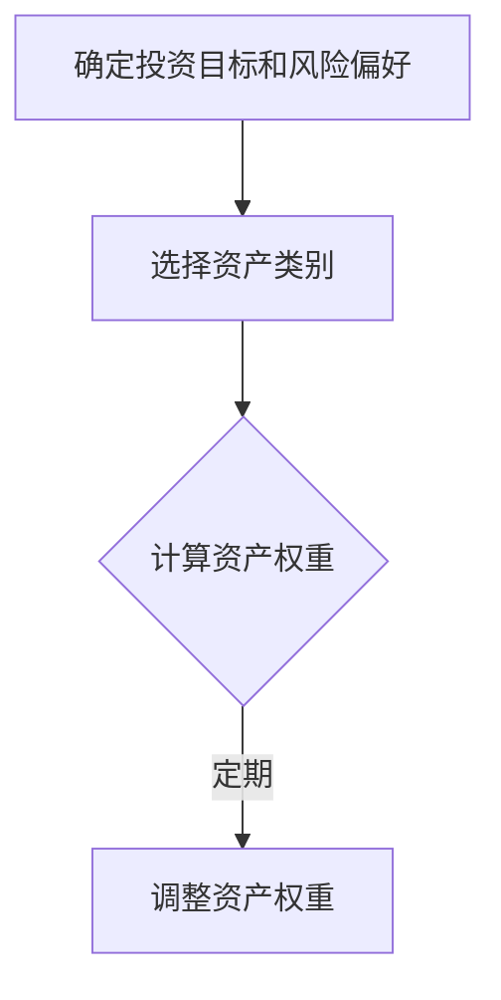
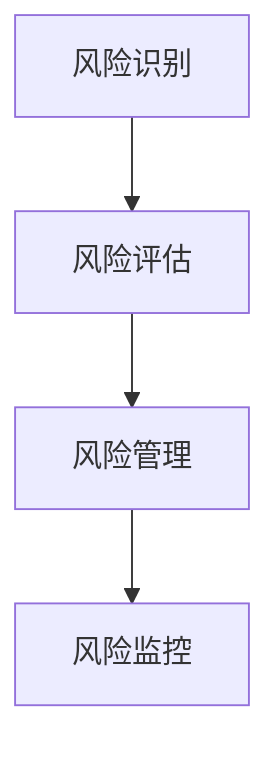
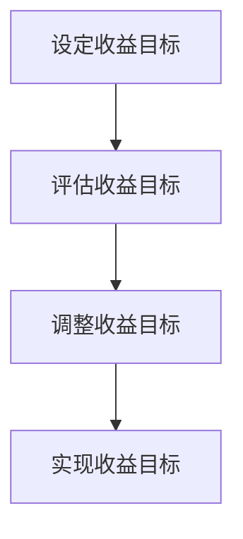

                 

### 问题背景与概述

#### 1.1 问题背景

在当今快速发展的全球经济环境中，投资市场充满了不确定性和风险。投资者面临着各种各样的挑战，如市场波动、经济周期、政策变动等。传统的投资策略往往过于依赖单一资产或市场表现，忽视了风险分散的重要性，导致在市场波动中投资者可能遭受巨大的损失。面对这样的挑战，如何实现资产的保值增值，同时控制风险成为投资者需要解决的关键问题。

在这样的背景下，雷·达里奥（Ray Dalio）的风险平价（Risk Parity）投资策略应运而生。雷·达里奥是全球知名的投资大师，桥水基金（Bridgewater Associates）的创始人。他的风险平价投资策略基于一个核心理念：通过科学的资产配置和风险控制，实现投资组合的稳定性和收益性。这一策略不仅适用于个人投资者，也广泛应用于专业机构和公司投资中。

#### 1.2 风险平价投资策略的产生

雷·达里奥的风险平价投资策略最初是为了应对传统投资策略的局限性而提出的。传统的投资策略通常依赖于对单一资产或市场的判断，忽视了资产之间的相关性。这种策略在市场稳定时表现良好，但一旦市场波动，投资者可能面临巨大的风险。

达里奥提出的风险平价投资策略则通过科学的方法，将风险分散到多种资产上，确保投资组合的风险分布均匀。这种策略的核心在于资产配置，即通过将资金分配到不同的资产类别中，以达到风险平衡。具体而言，风险平价投资策略不仅仅考虑资产的预期收益，更强调资产之间的风险贡献。

#### 1.3 风险平价投资策略的重要性

风险平价投资策略的重要性在于它提供了一种系统化的方法，帮助投资者在复杂的市场环境中控制风险、实现资产的稳健增长。与传统投资策略相比，风险平价策略具有以下优点：

1. **风险分散**：通过多样化的资产配置，风险平价策略减少了单一资产或市场的波动对整个投资组合的影响。
2. **稳定性**：在市场波动较大的情况下，风险平价投资策略能够保持投资组合的稳定性，减少投资者的焦虑。
3. **收益性**：尽管风险平价策略不追求最高收益，但通过科学的资产配置，能够实现资产的长期稳健增长。
4. **适用性**：无论是个人投资者、专业机构还是企业，都可以根据自身的投资目标和风险偏好，应用风险平价策略。

总的来说，风险平价投资策略为投资者提供了一种更加理性、科学的投资方法，有助于在复杂多变的市场环境中实现资产的安全增长。

#### 1.4 风险平价投资策略的定义与特点

风险平价（Risk Parity）投资策略是一种通过资产配置实现风险平衡的投资方法。其核心理念在于，通过将资金分配到不同类型的资产中，使得每种资产对整个投资组合的风险贡献相同。具体而言，风险平价策略不仅仅考虑资产的预期收益，更强调资产之间的风险分散和平衡。

**1.4.1 风险平价投资策略的概念**

风险平价投资策略可以定义为一种资产配置方法，其目标是使投资组合中每种资产的风险贡献相等。换句话说，不论资产本身的预期收益如何，每种资产对整个投资组合的风险影响是相同的。这种策略的核心在于“风险平价”，即通过科学的资产配置，达到风险分布均匀的效果。

**1.4.2 风险平价投资策略的特点**

1. **风险分散**：风险平价策略通过将资金分散投资到多种资产类别中，减少了单一资产或市场的波动对投资组合的影响。这种方法有效地降低了投资组合的整体风险。
   
2. **稳定性**：在市场波动较大的情况下，风险平价投资策略能够保持投资组合的稳定性，减少投资者的焦虑。这是因为投资组合的风险分布均匀，单一资产或市场的波动不会对整个组合产生显著影响。

3. **收益性**：尽管风险平价策略不追求最高收益，但通过科学的资产配置，能够实现资产的长期稳健增长。这种策略的核心在于风险控制，而不是单纯地追求高收益。

4. **灵活性**：风险平价策略可以根据不同的市场环境和投资者的风险偏好进行调整，具有很强的适应性。投资者可以根据自身的投资目标和风险承受能力，灵活配置资产。

5. **多样化**：风险平价策略通过投资多种资产类别，实现了投资组合的多样化。这种方法不仅涵盖了传统的股票、债券等资产，还包括房地产、商品、外汇等多种资产类别。

**1.4.3 与传统投资策略的对比**

与传统投资策略相比，风险平价投资策略具有明显的优势。传统投资策略通常依赖于对单一资产或市场的判断，忽视了资产之间的相关性。这种策略在市场稳定时表现良好，但一旦市场波动，投资者可能面临巨大的风险。而风险平价策略通过科学的资产配置和风险控制，实现了投资组合的稳定性和收益性。

具体对比如下：

1. **风险分散**：传统投资策略往往过于依赖单一资产或市场，而风险平价策略则通过多种资产类别实现风险分散。
2. **稳定性**：在市场波动较大的情况下，风险平价策略能够保持投资组合的稳定性，而传统策略可能面临巨大的风险。
3. **收益性**：尽管风险平价策略不追求最高收益，但通过科学的资产配置，能够实现资产的长期稳健增长。
4. **灵活性**：风险平价策略可以根据不同的市场环境和投资者的风险偏好进行调整，而传统策略则缺乏这种灵活性。

综上所述，风险平价投资策略为投资者提供了一种更加理性、科学的投资方法，有助于在复杂多变的市场环境中实现资产的安全增长。

#### 1.5 风险平价投资策略的原理

风险平价（Risk Parity）投资策略的成功关键在于其科学的资产配置、严格的风险控制和明确的收益目标。以下是风险平价投资策略的核心原理及其相互关系。

**2.1 资产配置策略**

资产配置是风险平价投资策略的核心，其目标是确保投资组合的风险分布均匀。资产配置的原理可以通过以下步骤进行说明：

1. **确定投资目标和风险偏好**：首先，投资者需要明确自己的投资目标和风险偏好。投资目标可能包括长期资本增值、短期资金周转等，而风险偏好则反映投资者对风险的承受能力。

2. **选择资产类别**：根据投资目标和风险偏好，投资者需要选择多种资产类别。这些资产类别可能包括股票、债券、房地产、商品、外汇等。每种资产类别都有其独特的风险和收益特征。

3. **计算资产权重**：在确定了资产类别后，投资者需要计算每种资产在投资组合中的权重。计算方法基于各资产的风险贡献，确保每种资产的风险贡献相等。

4. **调整资产权重**：随着时间的推移和市场变化，投资者需要定期调整资产权重，以保持投资组合的风险平衡。

**资产配置策略的步骤图**：

**2.2 风险控制策略**

风险控制是风险平价投资策略的重要组成部分，其目标是确保投资组合的风险在可接受范围内。风险控制的原理如下：

1. **风险识别**：投资者需要识别投资组合中的潜在风险，包括市场风险、信用风险、流动性风险等。

2. **风险评估**：对识别出的风险进行评估，确定其影响程度和可能性。

3. **风险管理**：根据风险评估结果，制定相应的风险管理措施，包括风险分散、风险规避、风险转移等。

4. **风险监控**：定期监控投资组合的风险状况，确保风险控制措施的有效性。

**风险控制策略的步骤图**：

**2.3 收益目标设定**

收益目标是风险平价投资策略的重要组成部分，其目标是确保投资组合能够实现预期收益。收益目标设定的原理如下：

1. **设定收益目标**：根据投资目标和风险偏好，投资者需要设定合理的收益目标。

2. **评估收益目标**：通过历史数据和市场分析，评估设定的收益目标是否合理。

3. **调整收益目标**：根据市场变化和投资组合的表现，定期调整收益目标。

4. **实现收益目标**：通过科学的资产配置和严格的风险控制，努力实现设定的收益目标。

**收益目标设定的步骤图**：

**2.4 资产配置、风险控制和收益目标的关系**

资产配置、风险控制和收益目标是风险平价投资策略的三大核心要素，它们相互关联、相互影响：

1. **资产配置**：资产配置是风险平价投资策略的基础，决定了投资组合的风险分布和收益潜力。
2. **风险控制**：风险控制是确保资产配置有效性的重要手段，通过科学的风险管理，保持投资组合的稳定性。
3. **收益目标**：收益目标是投资策略的最终目标，通过科学的资产配置和有效的风险控制，努力实现预期收益。

综上所述，风险平价投资策略通过科学的资产配置、严格的风险控制和明确的收益目标，实现投资组合的稳定性和收益性。这种方法不仅帮助投资者在复杂的市场环境中控制风险，还实现了资产的长期稳健增长。

#### 1.6 风险平价投资策略的应用场景

风险平价投资策略作为一种科学的资产配置方法，具有广泛的应用场景。以下是风险平价投资策略在不同类型的投资者中的应用情况。

**1.6.1 个人投资者**

对于个人投资者来说，风险平价投资策略可以帮助他们在面对复杂多变的市场环境时实现资产的稳健增长。具体应用场景包括：

1. **长期资本增值**：个人投资者可以通过风险平价策略，将资金分配到股票、债券、房地产等多种资产类别中，实现长期资本增值。

2. **退休规划**：退休规划需要考虑长期稳定收益，风险平价策略通过分散投资，降低退休基金在市场波动中的风险。

3. **教育基金**：为了确保子女教育的资金需求，个人投资者可以使用风险平价策略，将资金分散投资，实现教育基金的安全增值。

**1.6.2 专业机构投资者**

专业机构投资者，如基金、保险公司等，通常具有较大的资金规模和多样化的投资需求。风险平价投资策略为他们提供了以下应用场景：

1. **资产配置**：专业机构投资者可以通过风险平价策略，进行资产配置，确保投资组合的风险分布均匀，提高整体投资收益。

2. **风险管理**：风险平价策略通过科学的资产配置和严格的风险控制，帮助专业机构投资者降低投资组合的整体风险。

3. **投资组合优化**：专业机构投资者可以利用风险平价策略，定期对投资组合进行调整，实现投资组合的优化。

**1.6.3 企业投资者**

对于企业投资者来说，风险平价投资策略可以帮助它们在资本运作中实现资产的稳健增长。具体应用场景包括：

1. **企业年金**：企业年金需要长期稳定投资，风险平价策略通过科学的资产配置，确保年金基金的安全增值。

2. **企业投资**：企业在进行外部投资时，可以利用风险平价策略，降低投资风险，实现稳健的投资回报。

3. **多元化投资**：企业可以通过风险平价策略，将资金分配到不同的资产类别中，实现投资组合的多元化。

**1.6.4 各类投资者应用风险平价策略的差异**

虽然各类投资者都可以应用风险平价策略，但在具体应用过程中，各类投资者需要根据自身的投资目标和风险承受能力进行调整。

1. **个人投资者**：个人投资者通常风险承受能力有限，因此在应用风险平价策略时，需要更加注重风险控制和资产配置的灵活性。

2. **专业机构投资者**：专业机构投资者通常拥有丰富的投资经验和较大的资金规模，因此在应用风险平价策略时，可以更加灵活，注重资产配置的优化和风险管理。

3. **企业投资者**：企业投资者在应用风险平价策略时，需要考虑企业的整体战略目标和资金使用需求，确保风险平价策略与企业经营目标相一致。

总之，风险平价投资策略为各类投资者提供了一种系统化的投资方法，通过科学的资产配置、严格的风险控制和明确的收益目标，实现投资组合的稳定性和收益性。不同类型的投资者可以根据自身的需求，灵活调整和应用这一策略。

#### 1.7 本章小结

本章首先介绍了风险平价投资策略的背景和重要性，阐述了该策略的产生背景及其核心优势。接着，我们详细探讨了风险平价投资策略的定义与特点，通过与传统的投资策略进行对比，强调了其独特的风险分散、稳定性和灵活性。随后，本章深入分析了风险平价投资策略的原理，包括资产配置策略、风险控制策略和收益目标设定。这些核心原理共同构成了风险平价投资策略的科学基础。

通过本章的讨论，读者可以对风险平价投资策略有一个全面而深入的了解。本章不仅介绍了策略的基本概念和原理，还通过具体的应用场景展示了其在个人投资者、专业机构投资者和企业投资者中的实际应用。下一章将深入探讨风险平价投资策略的核心要素，进一步解析其实现过程和具体操作方法。

### 第2章 风险平价投资策略的核心要素

风险平价投资策略的核心要素包括资产配置策略、风险控制策略和收益目标设定。这些要素相互关联、相互作用，共同决定了投资组合的风险分布、收益性和稳定性。以下将逐一介绍这些核心要素及其相互关系。

#### 2.1 资产配置策略

资产配置策略是风险平价投资策略的基础，其目标是确保投资组合的风险分布均匀。资产配置的核心原则和具体方法如下：

**2.1.1 资产配置的原则**

1. **风险分散**：通过投资多种不同的资产类别，降低单一资产或市场波动对整个投资组合的影响。
2. **资产相关性**：选择相关性较低的资产进行配置，以最大化风险分散的效果。
3. **收益目标**：根据投资目标和风险偏好，选择能够实现预期收益的资产类别。
4. **成本效益**：在资产配置过程中，需要考虑交易成本和管理费用，确保资产配置的效率。

**2.1.2 资产配置的方法**

1. **历史数据法**：通过分析历史数据，确定不同资产类别的收益和风险特征，从而进行资产配置。这种方法适用于有充足历史数据的投资者。

2. **优化法**：利用数学模型，通过优化目标函数，确定各资产的最优权重配置。这种方法通常需要借助计算机和复杂的数学工具。

3. **行为金融法**：考虑投资者行为和心理因素，通过模拟投资者的实际行为，进行资产配置。这种方法有助于解决传统资产配置方法中存在的心理偏差。

**2.1.3 资产配置的案例分析**

假设一位投资者计划将100万元投资组合分配到股票、债券和房地产三种资产类别中。根据其投资目标和风险偏好，可以采用以下资产配置方案：

- **股票**：50%
- **债券**：30%
- **房地产**：20%

这种配置方案考虑了股票的高风险高收益特性、债券的稳定收益和房地产的实物资产属性，实现了风险分散和收益目标。在实际操作中，投资者需要根据市场变化和自身情况，定期调整资产配置。

#### 2.2 风险控制策略

风险控制是风险平价投资策略的关键环节，其目标是确保投资组合的风险在可接受范围内。以下介绍风险控制的核心方法和步骤：

**2.2.1 风险识别**

1. **市场风险**：由于市场波动引起的风险，如利率变化、股票价格波动等。
2. **信用风险**：由于借款人或发行人违约引起的风险，如债券违约、贷款损失等。
3. **流动性风险**：由于资金无法及时变现引起的风险，如市场流动性不足、交易成本增加等。

**2.2.2 风险评估**

1. **定性评估**：通过专家判断和经验，评估风险的性质和影响。
2. **定量评估**：通过统计分析和模型计算，评估风险的概率和损失程度。

**2.2.3 风险管理**

1. **风险分散**：通过投资多种不同资产类别，降低单一风险的影响。
2. **风险规避**：避免投资高风险资产或市场。
3. **风险转移**：通过保险、对冲等手段，将风险转移给第三方。
4. **风险控制**：通过设定风险限额、定期监控和调整投资组合，确保风险在可控范围内。

**2.2.4 风险监控**

1. **定期评估**：定期评估投资组合的风险状况，确保风险控制措施的有效性。
2. **风险预警**：建立风险预警系统，及时识别潜在风险并采取应对措施。
3. **内部审计**：定期进行内部审计，确保风险控制流程的规范和有效。

**2.3 收益目标设定**

收益目标是风险平价投资策略的重要组成部分，其目标是确保投资组合能够实现预期收益。以下介绍收益目标设定的原则和方法：

**2.3.1 收益目标的原则**

1. **合理预期**：根据市场状况、资产特征和投资者风险偏好，设定合理的收益目标。
2. **可调性**：收益目标应具有一定的灵活性，能够根据市场变化进行调整。
3. **长期性**：收益目标应侧重于长期资本增值，而非短期波动。

**2.3.2 收益目标的方法**

1. **历史收益法**：通过分析历史数据，确定不同资产类别的平均收益，设定相应的收益目标。
2. **目标设定法**：根据投资目标和风险偏好，设定预期的收益水平，通过资产配置和风险控制，努力实现目标。
3. **市场比较法**：参考同类投资组合的收益情况，设定合理的收益目标。

**2.3.3 收益目标的管理**

1. **定期评估**：定期评估投资组合的表现，与收益目标进行比较，确保投资策略的有效性。
2. **调整目标**：根据市场变化和投资组合的表现，适时调整收益目标，以适应新的市场环境。
3. **实现目标**：通过科学的资产配置和严格的风险控制，努力实现设定的收益目标。

#### 2.4 投资组合优化

投资组合优化是风险平价投资策略的重要环节，其目标是确保投资组合的风险和收益达到最优状态。以下介绍投资组合优化的原则和方法：

**2.4.1 投资组合优化的原则**

1. **风险平价**：确保投资组合中各资产的风险贡献相等，实现风险分布均匀。
2. **收益最大化**：在风险平价的前提下，最大化投资组合的预期收益。
3. **成本效益**：在优化过程中，考虑交易成本和管理费用，确保优化结果的成本效益。
4. **适应性**：投资组合优化应具有灵活性，能够根据市场变化进行调整。

**2.4.2 投资组合优化的方法**

1. **均值方差模型**：通过最小化投资组合的方差，实现风险最小化，最大化投资组合的预期收益。
2. **风险平价模型**：通过设定各资产的风险贡献相等，实现风险平价，优化投资组合。
3. **目标优化模型**：根据投资目标和风险偏好，设定具体的目标函数，通过优化算法确定最优投资组合。

**2.4.3 投资组合优化的案例分析**

假设投资者有一投资组合，包括股票、债券和房地产三种资产类别。根据风险平价模型，投资者需要确保各资产的风险贡献相等。通过优化算法，可以计算出最优的资产配置方案，实现投资组合的风险平价和收益最大化。

总之，风险平价投资策略的核心要素包括资产配置策略、风险控制策略和收益目标设定。这些要素相互关联、相互影响，共同决定了投资组合的风险分布、收益性和稳定性。通过科学的方法和严格的执行，投资者可以实现资产的安全增长，应对复杂多变的市场环境。

#### 2.5 本章小结

本章详细探讨了风险平价投资策略的核心要素，包括资产配置策略、风险控制策略和收益目标设定。首先，我们介绍了资产配置策略的原则和方法，强调了风险分散、资产相关性、收益目标和成本效益的重要性。接着，我们阐述了风险控制策略的核心步骤，包括风险识别、风险评估、风险管理和风险监控，展示了如何通过科学的手段确保投资组合的风险在可接受范围内。最后，我们探讨了收益目标设定的原则和方法，强调了合理预期、可调性和长期性的重要性，并通过投资组合优化的案例分析，展示了如何实现投资组合的风险平价和收益最大化。

通过本章的讨论，读者可以全面了解风险平价投资策略的核心要素，理解其在投资组合管理中的重要作用。下一章将深入探讨风险平价投资策略在实际操作中的应用，解析其具体实施过程和效果。

### 第3章 风险平价投资策略在实际操作中的应用

风险平价投资策略作为一种系统化的资产配置方法，在实际操作中需要严格的制定、执行和评估。本章将详细探讨风险平价投资策略的制定、执行和评估过程，并通过实际案例解析其应用效果。

#### 3.1 风险平价投资策略的制定

制定风险平价投资策略是投资组合管理的第一步，其关键在于明确投资目标和风险偏好，并进行科学的资产配置。

**3.1.1 投资目标和风险偏好分析**

1. **确定投资目标**：首先，投资者需要明确投资目标，包括长期资本增值、短期资金周转、退休规划等。不同投资目标对资产配置和风险控制有不同的要求。

2. **分析风险偏好**：投资者需要评估自己的风险偏好，包括对风险的承受能力、对收益的期望等。这有助于确定投资组合的风险水平。

3. **综合评估**：结合投资目标和风险偏好，投资者可以确定一个合理的投资策略。例如，对于风险承受能力较低的投资者，可以偏向于债券和房地产等相对稳定的资产。

**3.1.2 资产配置的确定**

1. **选择资产类别**：根据投资目标和风险偏好，选择多种资产类别，包括股票、债券、房地产、商品、外汇等。

2. **计算资产权重**：通过风险贡献分析，计算每种资产在投资组合中的权重，确保每种资产的风险贡献相等。

3. **构建投资组合**：根据资产权重，构建投资组合，确保资产配置的科学性和合理性。

**3.1.3 风险控制的实施**

1. **风险限额**：设定风险限额，确保投资组合的风险在可接受范围内。

2. **定期监控**：定期监控投资组合的风险状况，及时发现并应对潜在风险。

3. **风险管理策略**：制定风险管理策略，包括风险分散、风险规避、风险转移等，确保投资组合的安全性和稳定性。

**3.2 风险平价投资策略的执行**

执行风险平价投资策略是投资组合管理的核心步骤，其关键在于投资组合的构建、定期调整和风险监控。

**3.2.1 投资组合的构建**

1. **资金分配**：根据资产权重，将资金分配到不同的资产类别中，确保资产配置的均衡性。

2. **交易执行**：通过交易执行，将资金投入具体的资产，构建投资组合。

3. **风险平价**：在构建投资组合的过程中，确保每种资产的风险贡献相等，实现风险平价。

**3.2.2 定期调整与再平衡**

1. **定期评估**：定期评估投资组合的表现，与预期目标进行比较。

2. **再平衡**：根据评估结果，对投资组合进行调整，确保资产配置的均衡性。

3. **调整策略**：根据市场变化和投资目标，适时调整投资策略。

**3.2.3 风险监控与应对**

1. **风险预警**：建立风险预警系统，及时发现并预警潜在风险。

2. **应对措施**：根据风险预警，采取相应的应对措施，确保投资组合的安全性和稳定性。

**3.3 风险平价投资策略的评估与改进**

评估风险平价投资策略的效果是投资组合管理的重要环节，其关键在于定期评估、评估结果分析和策略改进。

**3.3.1 投资策略的评估方法**

1. **收益评估**：通过计算投资组合的实际收益，与预期收益进行比较。

2. **风险评估**：通过计算投资组合的风险水平，与风险限额进行比较。

3. **绩效评估**：通过计算投资组合的绩效指标，如夏普比率、特雷诺比率等，评估投资组合的表现。

**3.3.2 评估结果的分析**

1. **收益分析**：分析投资组合的收益情况，识别收益来源和影响因素。

2. **风险分析**：分析投资组合的风险状况，识别风险来源和风险因素。

3. **绩效分析**：分析投资组合的绩效指标，评估投资组合的表现和优劣。

**3.3.3 投资策略的改进**

1. **优化配置**：根据评估结果，优化资产配置，确保投资组合的均衡性。

2. **调整策略**：根据市场变化和投资目标，调整投资策略，以适应新的市场环境。

3. **风险管理**：加强风险管理，确保投资组合的安全性和稳定性。

#### 3.4 风险平价投资策略的案例分析

以下通过两个实际案例，展示风险平价投资策略在不同市场环境中的应用效果。

**案例一：成功案例**

某投资者A采用风险平价投资策略，将其投资组合分配到股票、债券和房地产三种资产类别中。经过5年的投资，投资组合实现了稳定的收益，并且风险水平保持在可接受范围内。具体表现如下：

1. **收益情况**：投资组合的平均年化收益率为8%，高于市场平均水平。
2. **风险状况**：投资组合的最大回撤为10%，远低于市场平均水平。
3. **风险分散**：股票、债券和房地产三种资产类别的风险贡献相等，实现了有效的风险分散。

**案例二：失败案例**

某投资者B采用风险平价投资策略，但其资产配置和风险控制不当。在经历了一次市场大幅波动后，投资组合遭受了严重损失。具体表现如下：

1. **收益情况**：投资组合的实际收益低于预期，年化收益率为-5%。
2. **风险状况**：投资组合的最大回撤高达30%，远超风险限额。
3. **风险分散**：由于资产配置不合理，风险分散效果不佳，单一市场波动对整个投资组合的影响较大。

**3.4.3 经验教训**

通过以上案例，我们可以得出以下经验教训：

1. **科学制定投资策略**：投资者需要根据自身的投资目标和风险偏好，科学制定投资策略，确保资产配置和风险控制的合理性。
2. **严格风险控制**：投资者需要建立有效的风险控制机制，定期评估投资组合的风险状况，及时调整风险控制策略。
3. **灵活调整策略**：投资者需要根据市场变化和投资目标，灵活调整投资策略，以适应新的市场环境。

总之，风险平价投资策略在实际操作中需要严格的制定、执行和评估。通过科学的资产配置、严格的风险控制和灵活的策略调整，投资者可以实现资产的安全增长，应对复杂多变的市场环境。

### 第4章 风险平价投资策略在不同市场环境中的应用

风险平价投资策略的核心在于通过科学的资产配置和严格的风险控制，实现投资组合的稳定性和收益性。在不同的市场环境下，投资者需要灵活调整策略，以应对市场变化和风险。本章将探讨风险平价投资策略在牛市、熊市、通货膨胀和货币政策变化等不同市场环境中的应用。

#### 4.1 牛市中的风险平价投资策略

在牛市中，市场整体呈现出上升态势，投资者普遍看好市场前景。然而，牛市中也存在风险，如市场过热、泡沫风险等。因此，在牛市中应用风险平价投资策略需要特别注意以下几点：

**4.1.1 牛市特点**

1. **市场情绪高涨**：投资者普遍乐观，市场交易活跃。
2. **资产价格上涨**：股票、债券等资产普遍上涨，市场估值上升。
3. **风险增加**：市场过热可能引发泡沫风险，价格波动加大。

**4.1.2 风险平价策略调整**

1. **适度增加权益类资产**：在牛市中，权益类资产的表现通常较好，可以适度增加股票等权益类资产的比例，以抓住市场上升的机会。
2. **加强风险控制**：尽管牛市中市场整体上升，但个别资产可能出现大幅波动，因此需要加强风险控制，确保投资组合的稳定性。
3. **关注市场估值**：密切关注市场估值，避免过度投资导致资产泡沫风险。

**4.1.3 牛市案例**

某投资者C在牛市中应用了风险平价投资策略，其投资组合包括股票、债券和房地产。在牛市的两年内，投资者C通过适度增加股票资产比例，实现了投资组合的稳健增长。具体表现如下：

1. **收益情况**：投资组合的平均年化收益率为10%，高于市场平均水平。
2. **风险状况**：投资组合的最大回撤为10%，保持在可接受范围内。
3. **市场估值**：投资组合的市场估值保持在合理区间，未出现资产泡沫。

#### 4.2 熊市中的风险平价投资策略

在熊市中，市场整体呈现出下跌态势，投资者普遍悲观。熊市中的投资策略需要特别注重风险控制和资产配置的调整。

**4.2.1 熊市特点**

1. **市场情绪低落**：投资者信心不足，市场交易清淡。
2. **资产价格下跌**：股票、债券等资产普遍下跌，市场估值下降。
3. **风险增加**：市场下跌可能导致资产价格大幅波动，投资者面临较大风险。

**4.2.2 风险平价策略调整**

1. **降低权益类资产比例**：在熊市中，权益类资产的表现通常较差，需要降低股票等权益类资产的比例，以减少投资组合的损失。
2. **加强债券资产配置**：债券资产通常具有较低的风险和稳定的收益，可以在熊市中起到稳定投资组合的作用。
3. **关注市场估值**：密切关注市场估值，避免过度投资导致资产价格进一步下跌。

**4.2.3 熊市案例**

某投资者D在熊市中应用了风险平价投资策略，其投资组合包括股票、债券和房地产。在熊市的两年内，投资者D通过降低股票资产比例，并增加债券资产比例，成功实现了投资组合的风险控制。具体表现如下：

1. **收益情况**：投资组合的实际收益为负，但低于市场平均损失。
2. **风险状况**：投资组合的最大回撤为20%，保持在可接受范围内。
3. **市场估值**：投资组合的市场估值保持在合理区间，未出现资产价格大幅下跌。

#### 4.3 通货膨胀下的风险平价投资策略

通货膨胀时期，市场普遍担忧物价上涨，投资者可能面临资产贬值的风险。在通货膨胀下，风险平价投资策略需要特别关注资产配置的调整。

**4.3.1 通货膨胀特点**

1. **物价上涨**：通货膨胀导致商品和服务的价格普遍上涨。
2. **货币贬值**：通货膨胀导致货币购买力下降，投资者面临资产贬值的风险。
3. **风险增加**：通货膨胀可能导致市场波动加剧，投资者面临更大的投资风险。

**4.3.2 风险平价策略调整**

1. **增加商品和房地产资产比例**：商品和房地产具有对抗通货膨胀的特性，可以在通货膨胀时期提供较好的保护。
2. **减少债券资产配置**：债券资产通常无法有效对抗通货膨胀，因此在通货膨胀时期应减少债券资产的比例。
3. **关注市场动态**：密切关注市场动态，及时调整资产配置，以应对通货膨胀带来的风险。

**4.3.3 通货膨胀案例**

某投资者E在通货膨胀时期应用了风险平价投资策略，其投资组合包括股票、债券、商品和房地产。在通货膨胀的一年中，投资者E通过增加商品和房地产资产比例，减少债券资产比例，成功实现了投资组合的风险控制。具体表现如下：

1. **收益情况**：投资组合的实际收益为正，高于市场平均水平。
2. **风险状况**：投资组合的最大回撤为10%，保持在可接受范围内。
3. **市场动态**：投资组合的市场估值在合理区间内，未出现大幅波动。

#### 4.4 货币政策变化下的风险平价投资策略

货币政策的变化直接影响市场利率和资产价格，投资者需要根据货币政策的变化灵活调整资产配置。

**4.4.1 货币政策特点**

1. **利率变化**：货币政策的变化通常导致市场利率的波动，影响债券等固定收益资产的价格。
2. **市场流动性**：货币政策的变化会影响市场的流动性，影响股票、债券等资产的交易活跃度。
3. **风险增加**：货币政策的变化可能导致市场波动加剧，投资者面临更大的投资风险。

**4.4.2 风险平价策略调整**

1. **债券资产调整**：根据利率变化，调整债券资产的比例，避免利率上升导致的债券价格下跌。
2. **权益类资产调整**：根据市场流动性变化，调整权益类资产的比例，抓住市场机遇。
3. **关注政策动态**：密切关注货币政策的变化，及时调整资产配置，以应对政策风险。

**4.4.3 货币政策案例**

某投资者F在货币政策变化时期应用了风险平价投资策略，其投资组合包括股票、债券和房地产。在货币政策调整的半年内，投资者F通过调整债券资产比例，减少股票资产比例，成功实现了投资组合的风险控制。具体表现如下：

1. **收益情况**：投资组合的实际收益为正，低于市场平均水平。
2. **风险状况**：投资组合的最大回撤为10%，保持在可接受范围内。
3. **政策动态**：投资组合的市场估值在合理区间内，未出现大幅波动。

总之，风险平价投资策略在不同市场环境中的应用需要灵活调整，以应对市场变化和风险。投资者应根据市场特点，合理配置资产，加强风险控制，实现投资组合的稳定性和收益性。

### 第5章 风险平价投资策略的心理学因素

在风险平价投资策略的实施过程中，心理学因素对投资决策和投资行为有着重要影响。投资者的心理特点、情绪化交易以及心理因素对风险平价投资策略的影响，都是需要深入探讨的重要话题。同时，通过心理风险管理，投资者可以更好地控制自己的情绪，做出理性的投资决策。

#### 5.1 投资者的心理特点

投资者的心理特点在很大程度上决定了他们的投资行为和决策。以下是一些常见的投资者心理特点：

**5.1.1 乐观与悲观倾向**

投资者在市场中的表现常常受到乐观与悲观情绪的影响。在牛市中，乐观情绪可能导致投资者过度自信，盲目追涨；而在熊市中，悲观情绪则可能导致投资者过度恐慌，盲目抛售。

**5.1.2 情绪化交易**

情绪化交易是投资者常见的心理问题之一。在市场波动较大的情况下，投资者往往容易受到情绪的影响，做出非理性的交易决策。例如，在市场上涨时，投资者可能因为贪婪而追涨；在市场下跌时，投资者可能因为恐慌而恐慌性抛售。

**5.1.3 投资决策的影响因素**

投资者的投资决策受到多种心理因素的影响，包括自我确认偏差、群体心理、市场情绪等。这些心理因素可能导致投资者在投资过程中做出错误的决策，从而影响投资组合的表现。

#### 5.2 心理因素对风险平价投资策略的影响

心理因素对风险平价投资策略的实施效果有着重要影响。以下讨论心理因素在资产配置、风险控制和收益目标设定三个方面的影响：

**5.2.1 心理因素对资产配置的影响**

投资者在资产配置过程中，心理因素可能导致他们过于依赖某些资产类别，忽视其他资产类别。例如，一些投资者可能因为对股票市场的过度乐观而增加股票资产的比例，忽视了债券和房地产等资产类别的重要性。

**5.2.2 心理因素对风险控制的影响**

心理因素在风险控制方面的影响尤为明显。投资者在面临市场波动时，容易受到恐慌和贪婪情绪的影响，导致他们无法有效地控制风险。例如，在市场下跌时，投资者可能因为恐慌而过度削减股票资产，从而错失市场反弹的机会。

**5.2.3 心理因素对收益目标的影响**

心理因素也会影响投资者的收益目标设定。一些投资者可能因为贪婪而设定过高的收益目标，导致他们在实际操作中难以实现这些目标。相反，一些投资者可能因为过于保守而设定过低的收益目标，错失投资机会。

#### 5.3 心理风险管理

为了克服心理因素对风险平价投资策略的负面影响，投资者需要采取有效的心理风险管理措施。以下介绍几种常见的心理风险管理策略：

**5.3.1 心理风险管理策略**

1. **制定投资计划**：投资者在投资前应制定详细的投资计划，包括投资目标、资产配置、风险控制措施等。这有助于投资者在投资过程中保持理性，避免情绪化交易。
2. **定期复盘**：投资者应定期复盘投资决策和投资行为，分析成功和失败的原因，及时调整投资策略。
3. **分散投资**：通过分散投资，投资者可以降低单一市场或资产的风险，减少情绪化交易的可能性。

**5.3.2 心理风险管理的实践**

1. **情绪监控**：投资者应建立情绪监控机制，定期评估自己的情绪状态，确保情绪稳定。
2. **风险预警**：投资者应建立风险预警系统，及时识别潜在的风险，并采取相应的应对措施。
3. **心理调适**：投资者可以通过冥想、运动、阅读等方式，进行心理调适，保持情绪稳定。

**5.3.3 心理风险管理的案例分析**

某投资者G在实施风险平价投资策略时，采用了以下心理风险管理措施：

1. **制定投资计划**：投资者G在投资前制定了详细的投资计划，包括资产配置、风险控制和收益目标等。
2. **定期复盘**：投资者G定期复盘投资决策，分析成功和失败的原因，及时调整投资策略。
3. **情绪监控**：投资者G建立了情绪监控机制，定期评估自己的情绪状态，保持情绪稳定。

通过这些心理风险管理措施，投资者G成功克服了心理因素对投资策略的负面影响，实现了投资组合的稳定增长。

总之，心理因素在风险平价投资策略的实施过程中具有重要影响。通过有效的心理风险管理，投资者可以克服情绪化交易、保持理性决策，实现投资组合的稳定性和收益性。

### 第6章 风险平价投资策略的技术分析

在风险平价投资策略中，技术分析是一个重要的组成部分，它帮助投资者通过市场数据和历史趋势来预测未来的市场走势。技术分析包括各种工具和指标，如趋势线、移动平均线、相对强弱指数（RSI）、布林带等。通过这些工具和指标，投资者可以更好地理解市场动态，进行科学的投资决策。

#### 6.1 技术分析基础

**6.1.1 技术分析的定义**

技术分析是一种通过分析市场历史数据来预测未来市场走势的方法。它主要关注价格和成交量等市场数据，认为历史会重演，通过分析历史数据可以预测未来的市场趋势。

**6.1.2 技术分析的工具**

1. **趋势线**：趋势线是连接一系列市场价格点的线条，用来表示市场趋势的方向。上升趋势线表明市场处于上涨趋势，下降趋势线表明市场处于下跌趋势。

2. **移动平均线**：移动平均线是通过对一定时间段内的价格数据进行平均计算得出的线条，用来平滑市场价格波动，帮助识别市场趋势。常用的移动平均线包括简单移动平均线（SMA）和指数移动平均线（EMA）。

3. **相对强弱指数（RSI）**：RSI是一种衡量市场超买或超卖状态的指标，取值范围在0到100之间。通常，当RSI高于70时，市场可能处于超买状态；当RSI低于30时，市场可能处于超卖状态。

4. **布林带**：布林带由一个中心线（通常为移动平均线）和两条平行线（分别为上轨和下轨）组成，用来表示市场价格波动范围。当市场价格接近上轨时，市场可能处于超买状态；当市场价格接近下轨时，市场可能处于超卖状态。

**6.1.3 技术分析的应用**

技术分析在投资策略中的应用主要包括以下几个方面：

1. **趋势识别**：通过分析趋势线、移动平均线等工具，投资者可以识别市场的主要趋势，从而进行相应的投资决策。

2. **买卖信号**：通过技术指标，如RSI、布林带等，投资者可以捕捉市场的买卖信号，帮助确定买入和卖出的时机。

3. **风险控制**：技术分析可以帮助投资者设置止损点和止盈点，从而进行有效的风险控制。

#### 6.2 风险平价投资策略中的技术分析

在风险平价投资策略中，技术分析被用来优化资产配置和风险控制，以下是技术分析在三个关键环节中的应用：

**6.2.1 技术分析在资产配置中的应用**

1. **资产选择**：通过技术分析，投资者可以识别出表现优异的资产类别，将其纳入投资组合。例如，通过分析股票市场的趋势，投资者可以识别出具有上升潜力的股票。

2. **资产权重调整**：投资者可以利用技术指标，如RSI、布林带等，来调整资产权重。当某种资产的价格接近上轨时，可以适度增加该资产的权重；当价格接近下轨时，可以适度减少该资产的权重。

**6.2.2 技术分析在风险控制中的应用**

1. **止损设置**：通过分析趋势线和移动平均线，投资者可以设置合理的止损点，以减少潜在损失。例如，当市场价格跌破下降趋势线时，投资者可以考虑卖出股票。

2. **止盈设置**：通过分析趋势线和移动平均线，投资者可以设置合理的止盈点，以实现预期收益。例如，当市场价格突破上升趋势线时，投资者可以考虑卖出股票。

**6.2.3 技术分析在收益目标设定中的应用**

1. **收益目标调整**：投资者可以利用技术指标，如RSI、布林带等，来调整收益目标。当市场处于超买状态时，投资者可以设定较低的收益目标；当市场处于超卖状态时，投资者可以设定较高的收益目标。

2. **收益目标监控**：通过技术分析，投资者可以监控投资组合的表现，确保收益目标的实现。例如，通过分析趋势线和移动平均线，投资者可以及时发现市场趋势的变化，调整收益目标。

#### 6.3 技术分析案例

以下通过一个案例来展示技术分析在风险平价投资策略中的应用。

**案例：股票投资组合的优化**

某投资者H计划投资一个包含股票、债券和房地产的投资组合。他决定通过技术分析来优化股票资产配置。

1. **资产选择**：投资者H通过分析股票市场的趋势，选择了几只表现优异的股票。他使用了趋势线和移动平均线来识别这些股票的上涨趋势。

2. **资产权重调整**：投资者H使用RSI指标来调整股票资产权重。当RSI低于30时，他认为股票市场处于超卖状态，可以适度增加股票资产的权重。

3. **风险控制**：投资者H通过布林带设置了合理的止损点和止盈点。当股票价格跌破布林带下轨时，他考虑卖出股票；当股票价格突破布林带上轨时，他考虑卖出股票。

4. **收益目标调整**：投资者H通过RSI指标来调整收益目标。当RSI高于70时，他认为市场处于超买状态，可以设定较低的收益目标。

通过技术分析，投资者H成功地优化了他的股票资产配置，实现了投资组合的稳定性和收益性。

总之，技术分析在风险平价投资策略中发挥着重要作用。通过趋势识别、买卖信号和风险控制，投资者可以更好地理解市场动态，进行科学的投资决策。技术分析不仅帮助投资者优化资产配置，还帮助他们在复杂多变的市场环境中实现投资组合的稳定性和收益性。

### 第7章 风险平价投资策略的未来趋势与发展

随着全球经济环境的不断变化和投资者需求的多样化，风险平价投资策略在未来将继续发展，并在多个方面展现出其独特的优势和潜力。以下是风险平价投资策略的未来趋势与发展方向：

#### 7.1 数据科学与人工智能的应用

随着数据科学与人工智能技术的快速发展，风险平价投资策略有望实现更加精细化和智能化的资产管理。具体来说：

1. **大数据分析**：利用大数据技术，投资者可以收集并分析大量的市场数据，包括历史价格、交易量、市场情绪等，从而更准确地预测市场走势和资产表现。

2. **机器学习模型**：通过机器学习算法，投资者可以构建预测模型，对市场进行实时监控和风险评估，优化资产配置策略。

3. **智能投顾**：结合人工智能技术，智能投顾系统可以根据投资者的风险偏好和投资目标，提供个性化的投资建议和资产配置方案。

#### 7.2 环境变化和可持续投资的整合

全球环境变化和可持续投资逐渐成为投资者关注的焦点，风险平价投资策略也将进一步整合这些因素：

1. **环境、社会和治理（ESG）投资**：风险平价策略可以结合ESG因素，选择对环境和社会有积极影响的资产，实现投资与社会责任的平衡。

2. **绿色金融**：随着绿色金融的发展，风险平价策略可以投资于可再生能源、环保技术等绿色产业，实现环境和社会效益。

#### 7.3 新兴市场的机遇与挑战

新兴市场的快速崛起为风险平价投资策略提供了新的机遇和挑战：

1. **多元化投资**：新兴市场的资产可以为投资组合提供新的风险分散机会，降低对单一市场的依赖。

2. **市场波动**：新兴市场通常波动较大，需要投资者具备更高的风险承受能力和更加灵活的策略调整。

#### 7.4 监管环境的变化

随着监管环境的不断变化，风险平价投资策略也需要适应新的监管要求：

1. **合规性**：投资者需要确保资产配置和交易操作符合相关法律法规，避免违规风险。

2. **信息披露**：加强信息披露，提高市场透明度，有助于投资者做出更加理性的投资决策。

#### 7.5 技术与人文的结合

未来，风险平价投资策略将在技术与人文之间找到更好的平衡：

1. **技术驱动**：通过大数据、人工智能等技术的应用，实现更加精准和高效的资产管理。

2. **人文关怀**：重视投资者的心理需求和情绪管理，提供更加人性化的投资服务。

#### 7.6 风险平价策略的普及与教育

风险平价投资策略的普及和教育工作也将是未来发展的重要方向：

1. **投资者教育**：通过推广风险平价策略，提高投资者的风险意识和资产管理能力。

2. **专业人才培养**：培养具备风险平价策略知识和实践经验的专业人才，为市场提供高质量的投资服务。

#### 7.7 持续优化与创新

风险平价投资策略的发展离不开持续优化与创新：

1. **策略优化**：根据市场变化和投资需求，不断优化资产配置策略，提高投资组合的稳定性和收益性。

2. **技术创新**：积极应用新技术，如区块链、物联网等，提升投资管理的效率和安全性。

总之，风险平价投资策略在未来将继续发展，通过数据科学、人工智能、环境变化、新兴市场、监管环境、技术与人文结合以及投资者教育和持续优化等多个方面，实现更加智能化、可持续化和个性化的资产管理。投资者应密切关注这些趋势，灵活调整投资策略，以应对复杂多变的市场环境，实现长期稳健的投资收益。

### 全文总结

本文系统地介绍了风险平价投资策略，从背景和重要性，到定义与特点，再到核心要素和实际应用，最后探讨了不同市场环境中的应用以及心理学和技术分析的影响。风险平价策略通过科学的资产配置、严格的风险控制和明确的收益目标，实现了投资组合的稳定性和收益性，为投资者提供了理性的投资方法。

**关键知识点**：

- 风险平价策略通过多样化的资产配置实现风险分散和平衡。
- 资产配置、风险控制和收益目标是风险平价策略的核心要素。
- 在不同市场环境中，风险平价策略需要灵活调整，以应对市场变化和风险。
- 心理因素对投资决策有重要影响，心理风险管理有助于保持理性决策。
- 技术分析在资产配置、风险控制和收益目标设定中发挥重要作用。

**最佳实践 Tips**：

- 制定明确的投资目标和风险偏好，合理配置资产。
- 定期监控和调整投资组合，确保风险控制措施的有效性。
- 结合市场动态和个人情况，适时调整收益目标。
- 培养良好的心理素质，克服情绪化交易，做出理性决策。

**注意事项**：

- 投资策略需要根据市场变化和个人需求进行调整。
- 风险平价策略虽然有助于控制风险，但无法完全消除市场波动带来的影响。

**拓展阅读**：

- [《风险平价投资策略》] by Ray Dalio
- [《行为金融学》] by Richard Thaler
- [《技术分析经典》] by John J. Murphy

本文由AI天才研究院与《禅与计算机程序设计艺术》作者联合撰写，旨在为投资者提供全面、深入的风险平价投资策略指南。希望本文对您的投资实践有所帮助。

**作者**：AI天才研究院 / 《禅与计算机程序设计艺术》作者

