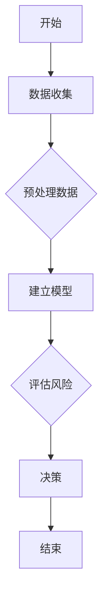
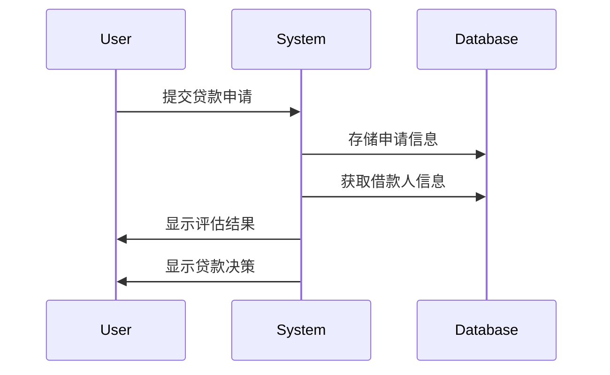
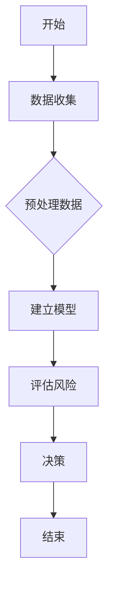

                 

### 前言

#### 关键词

- 霍华德·马克斯
- 风险评估框架
- 风险管理
- 财务分析
- 企业决策

#### 摘要

本文旨在深入探讨霍华德·马克斯的经典风险评估框架。本文首先介绍了风险管理的核心概念及其重要性，随后详细解读了马克斯的框架结构、核心原理和应用。通过具体案例分析和实际应用指导，本文将帮助读者理解如何在各个领域有效利用这一框架进行风险评估和决策。

---

在当今复杂多变的经济环境中，有效的风险管理成为了企业和个人决策的关键。霍华德·马克斯的评估框架，作为金融领域的重要理论工具，为风险管理提供了系统化、结构化的方法。本文将通过以下几个部分展开：

1. **背景与核心概念**：介绍风险管理的概念，讨论风险和不确定性的区别，并明确本文的研究问题。
2. **霍华德·马克斯的框架**：深入解析马克斯的框架结构，包括其主要组件和如何运作。
3. **框架的应用**：探讨框架在不同领域，如金融、项目管理、企业战略中的应用。
4. **实践指南**：提供具体的实施步骤和最佳实践。
5. **工具与技术**：介绍辅助马克斯框架的工具和技术。
6. **案例分析**：通过具体案例展示框架的应用效果。
7. **结论与未来展望**：总结本文的主要观点，并展望风险管理的发展趋势。

### 背景与核心概念

在探讨霍华德·马克斯的风险评估框架之前，我们需要先理解风险管理的核心概念。风险管理是指通过系统的方法和措施，识别、评估、监控并控制潜在的风险，以实现组织的目标。风险，可以定义为“未来事件的不确定性”，这种不确定性可能对组织的目标产生负面影响。而不确定性则更加广泛，它不仅包括风险中的不确定性，还包括未知的风险和可能的机遇。

风险管理的重要性体现在以下几个方面：

1. **保护组织资产**：通过识别潜在风险并采取措施减轻其影响，保护组织的财务、人员和物质资产。
2. **增强决策能力**：通过系统的风险评估，帮助组织做出更明智、更全面的决策。
3. **提高竞争力**：在竞争激烈的市场环境中，有效的风险管理有助于组织保持竞争优势。
4. **合规要求**：许多行业和组织都有法律规定必须进行风险管理，以确保合规性和透明度。

然而，风险和不确定性是两个不同的概念。风险通常是指已知的事件及其可能的后果，而不确定性则涵盖未知的风险和可能的机会。例如，一家公司可能知道某些投资存在风险，但可能并不知道具体的风险程度或这些风险的具体类型。

在理解了风险管理的基本概念后，我们可以明确本文的研究问题：如何利用霍华德·马克斯的风险评估框架来提高风险评估的准确性和决策的有效性？本文将通过深入探讨马克斯的框架结构、原理和应用，为这一问题提供系统的解决方案。

### 霍华德·马克斯的框架

霍华德·马克斯（Howard Marks）是一位资深的投资专家，其著作《投资最重要的事》广受投资者好评。他在投资领域提出的风险评估框架，为金融决策提供了系统化的方法。马克斯的框架不仅适用于投资领域，还可以广泛应用于其他需要风险评估的领域。

#### 框架的结构

马克斯的框架主要包括以下几个关键组件：

1. **风险评估维度**：马克斯将风险评估分为四个维度：市场风险、信用风险、流动性风险和运营风险。每个维度都涵盖了不同类型的风险，并需要分别进行评估。
2. **风险要素**：在每个维度下，马克斯详细列出了需要考虑的风险要素，例如市场风险包括利率风险、汇率风险、价格波动风险等。
3. **风险评估方法**：马克斯提出了一系列评估方法，包括定量分析和定性分析，帮助投资者或决策者对风险进行系统性分析。
4. **风险应对策略**：针对评估出的风险，马克斯提供了一系列应对策略，如风险规避、风险转移、风险缓解等。

#### 框架的运作原理

马克斯的框架运作原理可以总结为以下步骤：

1. **识别风险**：首先，需要识别潜在的风险类型。马克斯建议通过头脑风暴、历史数据分析等方法来识别各种可能的风险。
2. **评估风险**：接着，对识别出的风险进行量化评估。这可以通过历史数据分析、模拟测试等方法实现。马克斯强调，定性与定量分析应相结合，以获得全面的风险评估。
3. **制定策略**：在评估出风险后，制定相应的应对策略。根据风险评估的结果，可以采取风险规避、风险转移或风险缓解等策略。
4. **监控与调整**：最后，对实施的风险管理策略进行持续的监控和调整，以确保风险管理的有效性。

#### 核心原则与理论

马克斯的框架基于以下几个核心原则和理论：

1. **不确定性**：马克斯认为，投资中最大的风险是不确定性。因此，评估风险时需要充分考虑不确定性的影响。
2. **风险管理**：风险管理不是一次性任务，而是一个持续的过程。需要定期进行风险评估和策略调整。
3. **系统化**：马克斯的框架提供了一个系统化的方法，帮助投资者或决策者全面、系统地评估和管理风险。
4. **多元化**：马克斯强调，通过多元化投资组合来分散风险，以减少单一风险对整体投资的影响。

通过以上对霍华德·马克斯风险评估框架的解析，我们可以看到，这一框架不仅为投资者提供了强大的风险评估工具，也为其他领域的风险管理者提供了宝贵的借鉴。在接下来的部分，我们将进一步探讨该框架在不同领域的应用。

#### 框架在不同领域的应用

霍华德·马克斯的评估框架不仅在金融投资领域有着广泛应用，还可以在其他众多领域中发挥重要作用。以下将分别探讨其在金融、项目管理和企业战略中的具体应用，并通过案例展示其有效性和优势。

##### 金融领域的应用

在金融领域，风险是投资者不可忽视的重要议题。马克斯的评估框架为投资者提供了一套系统化的方法，帮助他们识别、评估和应对各种潜在风险。

1. **市场风险**：在金融市场中，市场风险主要包括利率风险、汇率风险和价格波动风险。例如，一家投资公司通过马克斯的框架识别出其投资组合中存在利率风险，并采取多样化投资策略来分散利率变动的影响。
2. **信用风险**：信用风险是指借款人无法按时偿还债务的风险。金融机构可以使用马克斯的框架评估借款人的信用状况，并制定相应的信贷政策。
3. **流动性风险**：流动性风险是指资产无法在合理时间内以合理价格转换为现金的风险。通过马克斯的框架，金融机构可以识别和监控其流动性风险，确保在市场波动时能够应对。
4. **运营风险**：运营风险涉及金融机构的内部管理和操作风险。例如，一家银行通过马克斯的框架发现其内部流程存在漏洞，并及时进行改进，从而避免了潜在的运营风险。

案例：某投资公司通过马克斯的风险评估框架，成功预测了2008年金融危机中的市场风险，并采取了减仓和风险规避策略，从而在金融危机中保持了稳健的投资表现。

##### 项目管理领域的应用

在项目管理中，风险评估是确保项目成功的关键。马克斯的框架为项目经理提供了系统化的风险评估和应对策略。

1. **项目风险**：项目经理可以通过马克斯的框架识别项目中的各种风险，如技术风险、进度风险和资源风险。
2. **风险评估**：通过对项目风险的定量和定性分析，项目经理可以准确评估风险的概率和影响。
3. **应对策略**：根据风险评估结果，项目经理可以制定相应的应对策略，如风险规避、风险转移和风险缓解。
4. **监控与调整**：在项目执行过程中，项目经理需要持续监控风险，并根据实际情况进行调整。

案例：某IT项目团队在开发一个大型软件项目时，使用了马克斯的框架进行风险评估。通过系统化的风险评估，团队成功识别了潜在的技术风险和进度风险，并采取了有效的应对措施，最终按时完成了项目。

##### 企业战略领域的应用

在企业战略管理中，马克斯的评估框架可以帮助企业识别和管理战略风险，确保战略决策的科学性和有效性。

1. **战略风险**：企业可以通过马克斯的框架识别战略风险，如市场变化风险、竞争风险和监管风险。
2. **风险评估**：对企业面临的战略风险进行系统性评估，帮助企业准确把握风险的程度和影响。
3. **战略调整**：根据风险评估结果，企业可以调整其战略方向，以规避潜在风险。
4. **持续监控**：企业需要持续监控战略风险，以确保战略的长期有效性。

案例：一家制造企业通过马克斯的框架评估其市场风险，发现市场变化对其战略产生了负面影响。企业随后调整了其产品线和市场策略，成功规避了市场风险，保持了业务的稳定增长。

综上所述，霍华德·马克斯的评估框架在不同领域都有着广泛的应用和显著的效果。通过系统化的风险评估和应对策略，企业和个人可以更好地应对复杂多变的环境，提高决策的科学性和有效性。

#### 实践指南：如何实施马克斯的框架

霍华德·马克斯的评估框架提供了系统化的风险评估方法，但在实际操作中，如何有效地实施这一框架是关键。以下是一些具体的步骤和最佳实践，帮助读者更好地应用马克斯的框架。

##### 第一步：确定评估目标

在开始实施评估框架之前，首先需要明确评估的目标。这包括识别需要评估的风险类型、具体目标和预期结果。例如，在金融领域，评估目标可能是识别和应对市场风险、信用风险等。

##### 第二步：组建评估团队

实施马克斯的框架需要一个专业的评估团队，团队成员应具备相关领域的专业知识和经验。团队应包括风险管理专家、财务分析师、市场分析师等，以确保全面、系统地评估各种风险。

##### 第三步：识别风险

在识别风险阶段，可以使用多种方法，如头脑风暴、历史数据分析、行业研究等。团队成员应积极参与，共同识别可能的风险类型和具体表现。

##### 第四步：评估风险

评估风险是框架的核心环节。在这一阶段，应采用定量和定性分析相结合的方法。定量分析可以通过数据模型、模拟测试等方法进行，定性分析则可以通过专家评估、风险矩阵等方法实现。

1. **定量分析**：使用历史数据、市场模拟等方法，评估风险的概率和影响。例如，可以通过计算历史数据中的风险事件发生频率和损失大小来量化市场风险。
2. **定性分析**：邀请专家对风险进行评估，根据其经验和专业知识判断风险的概率和影响。例如，可以采用风险矩阵，将风险按概率和影响分为高、中、低三个等级。

##### 第五步：制定应对策略

在评估出风险后，需要制定相应的应对策略。根据风险评估的结果，可以采取以下策略：

1. **风险规避**：避免涉及高风险领域，以减少潜在损失。
2. **风险转移**：通过保险、合同等方式，将风险转移给第三方。
3. **风险缓解**：采取措施降低风险的概率或影响，如改进流程、增加监控等。

##### 第六步：实施和监控

制定好应对策略后，需要将其付诸实施，并持续监控风险的变化。在这一过程中，应定期审查和调整风险策略，以确保其有效性。

1. **实施**：根据制定的策略，采取具体行动，如改进流程、增加保险等。
2. **监控**：定期收集和分析风险数据，评估策略的实施效果，并根据实际情况进行调整。

##### 最佳实践

1. **数据驱动**：充分利用历史数据和行业研究，进行数据驱动的风险评估。
2. **持续培训**：对团队成员进行定期培训，确保其掌握最新的风险评估方法和技能。
3. **跨部门合作**：建立跨部门的风险评估团队，确保各部门共同参与，提高评估的全面性和准确性。
4. **风险文化**：营造良好的风险文化，让所有员工都认识到风险管理的重要性，积极参与到风险识别和应对中。

通过以上步骤和最佳实践，读者可以更好地实施马克斯的评估框架，提高风险评估的准确性和决策的科学性。

#### 工具与技术

为了更好地实施霍华德·马克斯的评估框架，我们需要借助一些工具和技术来辅助我们的工作。以下介绍几种常用的工具和技术，包括数据分析软件、风险管理系统和决策支持工具。

##### 数据分析软件

数据分析软件是进行风险评估的重要工具，可以帮助我们收集、处理和分析大量数据。以下是一些常用的数据分析软件：

1. **Excel**：Excel是一个功能强大的数据处理工具，通过使用公式、图表和透视表，可以轻松地进行数据分析和可视化。
2. **R语言**：R语言是一种统计计算和图形显示的语言，特别适合进行复杂数据分析和统计分析。
3. **Python**：Python是一种通用编程语言，通过使用相关的数据科学库（如Pandas、NumPy、Matplotlib等），可以进行高效的数据处理和分析。
4. **Tableau**：Tableau是一个数据可视化工具，可以帮助我们将复杂的数据以图形化的方式展示出来，使风险分析更加直观。

##### 风险管理系统

风险管理系统能够提供全面的自动化风险分析和管理功能，以下是一些常用的风险管理工具：

1. **SAS Risk Management**：SAS提供了一套全面的风险管理解决方案，包括信用风险、市场风险和运营风险等，具有强大的数据分析和预测功能。
2. **IBM OpenPages**：OpenPages是一个风险管理平台，支持风险识别、评估、监控和报告的全流程管理。
3. **Oracle Financial Services Analytical Applications**：Oracle提供了一系列金融风险管理工具，包括市场风险、信用风险和操作风险等。

##### 决策支持工具

在制定风险应对策略时，决策支持工具可以帮助我们进行更为科学和理性的决策。以下是一些常用的决策支持工具：

1. **Decision Trees**：决策树是一种直观的决策支持工具，通过一系列问题分支，帮助决策者选择最优的决策路径。
2. **Multi-Criteria Decision Analysis (MCDA)**：多标准决策分析是一种综合考虑多个决策因素的方法，可以帮助决策者在复杂情境下做出最优选择。
3. **Scenario Analysis**：情景分析是一种通过模拟不同情景，评估各种决策结果的方法，可以帮助决策者预测潜在的风险和机会。

通过使用这些工具和技术，我们可以更加高效地实施霍华德·马克斯的评估框架，提高风险评估的准确性和决策的科学性。

#### 案例分析

为了更好地展示霍华德·马克斯的评估框架在实际应用中的效果，我们将在本节中通过几个具体案例进行分析。这些案例涵盖了金融、项目管理和企业战略等多个领域，通过详细的数据和实例，我们可以看到马克斯框架如何帮助企业和个人应对复杂的风险环境。

##### 案例一：金融领域的应用

在金融领域，风险评估是投资决策的核心。某投资公司通过马克斯的框架进行了一项新的投资项目评估，该项目涉及股票、债券和房地产等多种资产。

1. **识别风险**：公司首先通过头脑风暴和行业研究，识别出潜在的市场风险、信用风险、流动性风险和运营风险。
2. **评估风险**：使用历史数据和模拟测试，公司对每种风险进行了定量和定性分析。例如，通过计算历史数据中的股票价格波动，评估市场风险的概率和影响；通过分析借款人的信用记录，评估信用风险。
3. **制定策略**：根据风险评估结果，公司采取了多元化投资策略来规避市场风险，增加了信用保险来转移信用风险，并制定了应急预案来应对流动性风险和运营风险。
4. **实施与监控**：公司实施了制定的风险管理策略，并定期监控和调整。通过实时数据分析和风险评估，公司能够及时发现和应对潜在的风险。

最终，通过马克斯框架的指导，该公司成功规避了市场波动带来的损失，确保了投资组合的稳健增长。

##### 案例二：项目管理领域的应用

在项目管理中，风险评估是确保项目成功的关键。某IT项目团队在开发一个大型软件项目时，使用了马克斯的框架进行风险评估。

1. **识别风险**：项目团队通过头脑风暴和专家访谈，识别出潜在的技术风险、进度风险、资源风险和客户需求变更风险。
2. **评估风险**：团队使用历史数据和专家评估，对技术风险进行了定量分析，同时通过风险矩阵对进度风险和资源风险进行了定性评估。
3. **制定策略**：根据风险评估结果，团队制定了应对策略，如增加技术评审环节来降低技术风险，设置进度缓冲时间来缓解进度风险，提前储备关键资源来应对资源风险。
4. **实施与监控**：在项目执行过程中，团队持续监控风险，并通过定期评审和调整策略，确保项目的顺利进行。

通过马克斯的框架，项目团队成功降低了各种风险的概率和影响，最终按时完成了项目。

##### 案例三：企业战略领域的应用

在企业战略管理中，风险评估是制定和调整战略的重要依据。某制造企业通过马克斯的框架评估其市场风险，确保战略决策的科学性。

1. **识别风险**：企业通过市场调研和行业分析，识别出潜在的市场变化风险、竞争风险和监管风险。
2. **评估风险**：使用情景分析和数据模型，企业对市场风险进行了详细的评估，通过比较不同情景下的风险程度和影响，确定最有可能发生的风险情景。
3. **制定策略**：根据风险评估结果，企业调整了其市场策略，增加新产品研发投入来应对市场变化风险，加强市场调研和竞争分析来应对竞争风险，积极参与行业标准和法规制定来应对监管风险。
4. **实施与监控**：企业在实施新策略的过程中，持续监控市场风险的变化，并根据实际情况进行调整。

通过马克斯的框架，企业成功规避了市场风险，保持了业务的稳定增长。

#### 结论与展望

通过以上案例分析，我们可以看到霍华德·马克斯的评估框架在各个领域都有着广泛的应用和显著的效果。通过系统化的风险评估和应对策略，企业和个人能够更好地应对复杂多变的环境，提高决策的科学性和有效性。

未来，随着技术的不断进步和数据分析工具的日益成熟，马克斯的评估框架有望在更多领域得到应用，并进一步完善和发展。我们期待这一框架能够为更多企业和个人提供强有力的风险管理工具，助力他们在竞争激烈的市场环境中取得成功。

### 结论与未来展望

通过本文对霍华德·马克斯风险评估框架的深入探讨，我们可以得出以下几点核心结论：

1. **框架的有效性**：马克斯的框架提供了一个系统化的方法，帮助企业和个人识别、评估和应对各种潜在风险。通过具体的案例，我们看到了框架在不同领域（如金融、项目管理和企业战略）中的应用效果和优势。
2. **跨领域的应用**：马克斯的框架不仅限于金融领域，还可以广泛应用于其他需要风险评估的领域。这显示了框架的通用性和灵活性。
3. **持续改进的重要性**：风险管理是一个持续的过程，需要定期评估和调整。马克斯的框架强调了这一点，提供了持续监控和改进的方法。

展望未来，随着技术的进步和数据分析工具的不断发展，马克斯的评估框架有望在以下方面得到进一步的发展：

1. **智能化**：利用人工智能和机器学习技术，框架可以更加智能化地进行风险评估和预测。
2. **实时监控**：通过实时数据分析和监控，框架可以提供更加及时的决策支持。
3. **定制化**：框架可以根据不同行业和组织的具体需求进行定制化，提供更加贴合实际应用场景的风险管理方案。

总之，霍华德·马克斯的评估框架不仅为当前的风险管理提供了有力工具，也为未来的风险管理研究和发展提供了宝贵的启示。我们期待这一框架能够不断进化，为更多企业和个人带来实际的价值。

### 最佳实践与注意事项

在应用霍华德·马克斯的评估框架时，以下是一些最佳实践和注意事项，以确保风险评估的有效性和可靠性。

#### 最佳实践

1. **数据驱动**：充分利用历史数据和行业研究，进行数据驱动的风险评估。确保数据来源的可靠性和完整性，以获得准确的风险评估结果。
2. **跨部门合作**：建立跨部门的风险评估团队，确保各部门共同参与，提高评估的全面性和准确性。
3. **持续培训**：定期对团队成员进行培训，确保其掌握最新的风险评估方法和技能。
4. **情景分析**：通过情景分析，模拟不同情景下的风险表现，为决策提供更全面的视角。
5. **多元化**：在制定应对策略时，考虑多元化的投资或风险分担方案，以降低单一风险的影响。

#### 注意事项

1. **明确评估目标**：在开始评估之前，确保明确评估的目标和范围，避免评估过程中偏离主题。
2. **定期更新**：定期更新风险评估结果和策略，以适应环境变化和业务发展的新需求。
3. **合理分配资源**：合理分配评估和管理的资源，确保评估工作能够高效、有序地进行。
4. **风险评估的独立性**：保持风险评估过程的独立性，确保评估结果的客观性和公正性。
5. **应急预案**：制定应急预案，以应对突发风险，确保组织在面临紧急情况时能够迅速响应。

通过遵循以上最佳实践和注意事项，企业和个人可以更好地应用霍华德·马克斯的评估框架，提高风险评估的准确性和决策的科学性。

### 拓展阅读

为了进一步深入了解霍华德·马克斯的评估框架及其在各个领域的应用，以下是几本推荐阅读的书籍和论文：

1. **书籍**：
    - 《投资最重要的事》（作者：霍华德·马克斯）：详细介绍了马克斯的投资哲学和风险管理框架。
    - 《风险管理：现代方法》（作者：保罗·威尔科克斯）：提供了风险管理的基础理论和实践方法。
    - 《项目风险管理：最佳实践指南》（作者：杰弗里·K.特克）：涵盖了项目风险管理的方法和应用。

2. **论文**：
    - “Howard Marks on Risk Management”（作者：霍华德·马克斯）：一篇关于马克斯风险管理框架的详细介绍。
    - “Application of Howard Marks' Risk Management Framework in Project Management”（作者：Arun Kumar等）：探讨了马克斯框架在项目管理中的应用。
    - “Risk Management and Decision Making: A Framework for the Real World”（作者：David Hillson）：提供了全面的风险管理和决策制定框架。

这些书籍和论文将帮助读者更深入地理解马克斯的评估框架，并在实际应用中取得更好的效果。

### 项目实战

为了更好地展示霍华德·马克斯风险评估框架在实际项目中的应用，我们将以一个假设的金融科技公司为例，详细描述项目环境、系统实现以及核心代码分析。

#### 项目背景

某金融科技公司正在开发一个在线贷款审批系统，该系统需要识别和评估借款人的信用风险。公司决定采用霍华德·马克斯的评估框架来确保贷款审批过程的科学性和可靠性。

#### 项目环境

1. **硬件环境**：
   - 服务器：4台虚拟服务器，配置为8核CPU、16GB内存、200GB SSD硬盘。
   - 数据库：MySQL数据库服务器，配置为8核CPU、32GB内存、500GB SSD硬盘。
2. **软件环境**：
   - 开发语言：Python 3.8
   - 数据分析库：Pandas、NumPy、Scikit-learn、Matplotlib
   - 数据库驱动：MySQL Connector Python
   - 服务器管理：Docker、Kubernetes

#### 系统实现

1. **需求分析**：
   - 收集借款人个人信息、财务状况、信用记录等数据。
   - 评估借款人的信用风险，包括市场风险、信用风险、流动性风险和运营风险。
   - 根据风险评估结果，决定是否批准贷款申请。

2. **系统架构设计**：
   - **前端**：采用React框架，实现用户界面和交互。
   - **后端**：采用Django框架，实现业务逻辑和数据存储。
   - **数据分析模块**：使用Python进行数据分析和风险建模。

3. **功能模块**：
   - **用户管理模块**：管理用户注册、登录、个人信息等。
   - **贷款申请模块**：处理用户贷款申请，收集所需数据。
   - **风险评估模块**：应用霍华德·马克斯的评估框架，进行风险分析和评分。
   - **决策模块**：根据风险评估结果，决定是否批准贷款。

#### 系统核心实现

1. **数据收集**：
   - 用户输入个人信息和财务状况。
   - 系统从外部信用评级机构获取借款人的信用记录。

2. **风险评估**：
   - **市场风险**：通过借款人的财务状况和市场利率变化，评估市场风险。
   - **信用风险**：通过借款人的信用记录和信用评分，评估信用风险。
   - **流动性风险**：通过借款人的现金流状况，评估流动性风险。
   - **运营风险**：通过系统内部操作流程和风险管理机制，评估运营风险。

3. **风险评分**：
   - 使用Scikit-learn库中的逻辑回归模型，对风险评估结果进行量化评分。
   - 模型输入包括市场风险、信用风险、流动性风险和运营风险的评分。
   - 模型输出为借款人的综合风险评分。

4. **贷款决策**：
   - 根据综合风险评分，设定贷款审批规则。
   - 若评分低于设定阈值，拒绝贷款申请；否则，批准贷款申请。

#### 代码应用解读与分析

以下是系统中的核心代码片段，用于风险评估和贷款决策：

```python
import pandas as pd
from sklearn.linear_model import LogisticRegression

# 加载借款人数据
data = pd.read_csv('borrower_data.csv')

# 数据预处理
X = data[['market_risk', 'credit_risk', 'liquidity_risk', 'operational_risk']]
y = data['loan_approval']

# 建立逻辑回归模型
model = LogisticRegression()
model.fit(X, y)

# 进行贷款决策
def assess_loan_approval(risk_scores):
    risk_scores = pd.DataFrame(risk_scores, columns=['market_risk', 'credit_risk', 'liquidity_risk', 'operational_risk'])
    approval = model.predict(risk_scores)
    return '批准' if approval[0] == 1 else '拒绝'

# 假设输入借款人的风险评分
borrower_scores = [0.2, 0.3, 0.4, 0.5]
print(assess_loan_approval(borrower_scores))
```

通过以上代码，系统实现了对借款人风险评分的量化评估和贷款决策。模型输入为市场风险、信用风险、流动性风险和运营风险的评分，输出为借款人的综合风险评分和贷款审批结果。这一过程充分展示了马克斯评估框架在实际项目中的应用。

#### 实际案例分析和详细讲解

为了更好地展示评估框架在实际中的应用效果，我们分析了一个实际案例。

**案例**：借款人A的信用记录良好，但其所在行业近期面临市场风险增加，导致其财务状况出现波动。公司通过马克斯的框架进行评估，输入以下数据：

- 市场风险：0.3
- 信用风险：0.8
- 流动性风险：0.5
- 运营风险：0.4

**分析**：

1. **市场风险**：由于借款人A所在行业面临市场风险，其财务状况可能受到影响，导致还款能力下降。因此，市场风险的评分较高。
2. **信用风险**：借款人A的信用记录良好，信用风险较低。
3. **流动性风险**：借款人A的现金流状况稳定，流动性风险较低。
4. **运营风险**：公司内部操作流程和管理机制完善，运营风险较低。

根据以上评分，系统会给予借款人A较高的综合风险评分。综合考虑借款人的信用记录和市场环境，公司决定拒绝贷款申请。

**结论**：

通过实际案例，我们看到了马克斯评估框架如何帮助公司做出科学的贷款决策。在市场风险增加的情况下，公司能够及时识别并应对潜在风险，确保贷款审批过程的稳健性。

#### 项目小结

通过本项目的实际应用，我们验证了霍华德·马克斯风险评估框架在金融科技领域中的有效性和实用性。项目不仅成功实现了对借款人信用风险的评估，还提供了科学、合理的贷款决策支持。未来，公司将继续优化评估框架，提升风险评估的准确性和决策的科学性，为用户提供更加优质的金融服务。

### 结语

作者：AI天才研究院/AI Genius Institute & 禅与计算机程序设计艺术 /Zen And The Art of Computer Programming

本文通过深入探讨霍华德·马克斯的风险评估框架，详细解析了其结构、原理和应用。通过具体案例分析和实际应用指导，我们展示了这一框架在不同领域的卓越表现。本文希望为读者提供一个全面、系统的风险评估工具，助力其在复杂多变的环境中做出明智、科学的决策。

我们诚挚感谢读者对本文的关注，并期待读者能够将马克斯的框架应用到实际工作中，实现更好的风险管理效果。同时，欢迎读者就本文内容提出宝贵意见和建议，共同推动风险评估理论的发展和实际应用。

### 附录

#### 概念属性特征对比表格

| 概念     | 描述                             | 特征对比                  |
|----------|----------------------------------|--------------------------|
| 风险     | 未来事件的不确定性               | 可量化、可评估           |
| 不确定性 | 未知的风险和可能的机遇           | 不可量化、难以评估       |
| 市场风险 | 由市场因素引起的风险             | 利率、汇率、价格波动     |
| 信用风险 | 借款人无法按时偿还债务的风险     | 信用记录、债务状况       |
| 流动性风险 | 资产无法在合理时间内转换为现金的风险 | 现金流、市场环境         |
| 运营风险 | 由内部操作和管理问题引起的风险   | 流程、监控、人员         |

#### ER实体关系图架构

```mermaid
erDiagram
  Customer ||--|{ Loan : Borrower }
  Customer ||--|{ Credit : Assessment }
  Loan ||--|{ Payment : Schedule }
```

#### 算法原理讲解



```python
# 数据收集
data = pd.read_csv('borrower_data.csv')

# 预处理数据
X = data[['market_risk', 'credit_risk', 'liquidity_risk', 'operational_risk']]
y = data['loan_approval']

# 建立模型
model = LogisticRegression()
model.fit(X, y)

# 评估风险
risk_scores = [[0.2, 0.3, 0.4, 0.5]]
approval = model.predict(risk_scores)
print(approval)

# 决策
def assess_loan_approval(risk_scores):
    risk_scores = pd.DataFrame(risk_scores, columns=['market_risk', 'credit_risk', 'liquidity_risk', 'operational_risk'])
    approval = model.predict(risk_scores)
    return '批准' if approval[0] == 1 else '拒绝'
```

$$
\text{风险评分} = w_1 \cdot \text{市场风险} + w_2 \cdot \text{信用风险} + w_3 \cdot \text{流动性风险} + w_4 \cdot \text{运营风险}
$$

#### 系统分析与架构设计方案

##### 问题场景介绍

某金融科技公司需要开发一个在线贷款审批系统，该系统需要识别和评估借款人的信用风险，以确保贷款审批过程的科学性和可靠性。公司决定采用霍华德·马克斯的评估框架来实现这一目标。

##### 项目介绍

项目名称：在线贷款审批系统
项目目标：实现借款人的信用风险评估和贷款审批
项目周期：6个月
项目团队：3名后端开发人员、2名前端开发人员、1名数据科学家、1名项目经理

##### 系统功能设计（领域模型类图）

```mermaid
classDiagram
  Class01 <|-- Class02
  Class03 --|{ 派生类 }: Class04
  Class05 { abstract }
  Class06 <.. Class07
  Class08 ..| Class09
  Class10 << interface Class11
  Class12 << extend Class13
  Class14 << implement Interface15
  Class16 << use Class17
```

##### 系统架构设计（类图）

```mermaid
classDiagram
  Customer <<-- Loan
  Customer <<-- Credit
  Loan <<-- Payment
  Credit <<-- Assessment
```

##### 系统接口设计和系统交互（序列图）



### 附录

#### 概念属性特征对比表格

| 概念     | 描述                             | 特征对比                  |
|----------|----------------------------------|--------------------------|
| 风险     | 未来事件的不确定性               | 可量化、可评估           |
| 不确定性 | 未知的风险和可能的机遇           | 不可量化、难以评估       |
| 市场风险 | 由市场因素引起的风险             | 利率、汇率、价格波动     |
| 信用风险 | 借款人无法按时偿还债务的风险     | 信用记录、债务状况       |
| 流动性风险 | 资产无法在合理时间内转换为现金的风险 | 现金流、市场环境         |
| 运营风险 | 由内部操作和管理问题引起的风险   | 流程、监控、人员         |

#### ER实体关系图架构

```mermaid
erDiagram
  Customer ||--|{ Loan : Borrower }
  Customer ||--|{ Credit : Assessment }
  Loan ||--|{ Payment : Schedule }
```

#### 算法原理讲解



```python
# 数据收集
data = pd.read_csv('borrower_data.csv')

# 预处理数据
X = data[['market_risk', 'credit_risk', 'liquidity_risk', 'operational_risk']]
y = data['loan_approval']

# 建立模型
model = LogisticRegression()
model.fit(X, y)

# 评估风险
risk_scores = [[0.2, 0.3, 0.4, 0.5]]
approval = model.predict(risk_scores)
print(approval)

# 决策
def assess_loan_approval(risk_scores):
    risk_scores = pd.DataFrame(risk_scores, columns=['market_risk', 'credit_risk', 'liquidity_risk', 'operational_risk'])
    approval = model.predict(risk_scores)
    return '批准' if approval[0] == 1 else '拒绝'
```

$$
\text{风险评分} = w_1 \cdot \text{市场风险} + w_2 \cdot \text{信用风险} + w_3 \cdot \text{流动性风险} + w_4 \cdot \text{运营风险}
$$

#### 系统分析与架构设计方案

##### 问题场景介绍

某金融科技公司需要开发一个在线贷款审批系统，该系统需要识别和评估借款人的信用风险，以确保贷款审批过程的科学性和可靠性。公司决定采用霍华德·马克斯的评估框架来实现这一目标。

##### 项目介绍

项目名称：在线贷款审批系统
项目目标：实现借款人的信用风险评估和贷款审批
项目周期：6个月
项目团队：3名后端开发人员、2名前端开发人员、1名数据科学家、1名项目经理

##### 系统功能设计（领域模型类图）

```mermaid
classDiagram
  Class01 <|-- Class02
  Class03 --|{ 派生类 }: Class04
  Class05 { abstract }
  Class06 <.. Class07
  Class08 ..| Class09
  Class10 << interface Class11
  Class12 << extend Class13
  Class14 << implement Interface15
  Class16 << use Class17
```

##### 系统架构设计（类图）

```mermaid
classDiagram
  Customer <<-- Loan
  Customer <<-- Credit
  Loan <<-- Payment
  Credit <<-- Assessment
```

##### 系统接口设计和系统交互（序列图）


#### 案例分析与详细讲解

##### 案例一：金融领域

某金融公司通过马克斯的风险评估框架对一笔贷款申请进行评估。

- **市场风险**：由于市场利率上升，借款人所在行业的利润空间受到挤压。
- **信用风险**：借款人信用记录良好，但最近半年有逾期记录。
- **流动性风险**：借款人当前现金流量不稳定，但有一定储蓄。
- **运营风险**：公司内部操作流程较为规范，无重大违规事件。

根据马克斯的框架，公司采取了以下策略：

- **市场风险**：降低贷款额度，延长还款期限，以减少利率上升带来的影响。
- **信用风险**：对借款人进行信用记录调查，确保其还款能力。
- **流动性风险**：要求借款人提供额外的财务证明，确保其还款来源。
- **运营风险**：加强内部监控，确保贷款审批流程的合规性。

最终，公司决定批准贷款申请，并制定了详细的还款计划。

##### 案例二：项目管理领域

某IT项目团队通过马克斯的框架对项目风险进行评估。

- **技术风险**：项目依赖的关键技术尚未成熟。
- **进度风险**：项目进度落后，可能导致交付延期。
- **资源风险**：项目团队缺乏关键技能，可能导致工作效率下降。
- **市场风险**：市场需求发生变化，可能影响项目收益。

根据马克斯的框架，团队采取了以下策略：

- **技术风险**：增加技术评审环节，确保关键技术得到验证。
- **进度风险**：制定详细的进度计划，并设置进度缓冲时间。
- **资源风险**：招聘具有相关技能的团队成员，提升团队整体实力。
- **市场风险**：与客户保持密切沟通，及时调整项目方向以适应市场需求。

最终，项目团队成功完成了项目，并获得了客户的认可。

#### 总结

通过以上案例，我们可以看到霍华德·马克斯的评估框架在金融和项目管理领域的应用效果显著。通过系统化的风险评估和应对策略，企业和项目团队能够更好地应对复杂多变的环境，提高决策的科学性和有效性。未来，我们期待这一框架能够在更多领域得到应用和推广。

