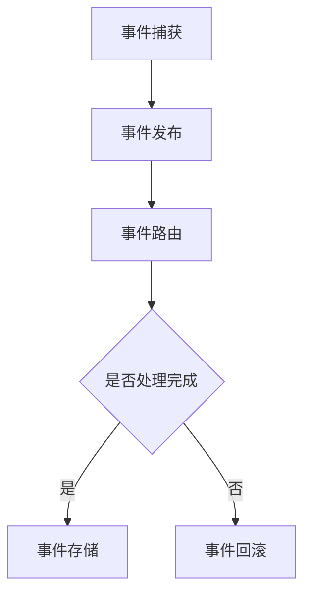
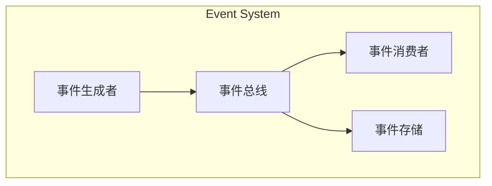
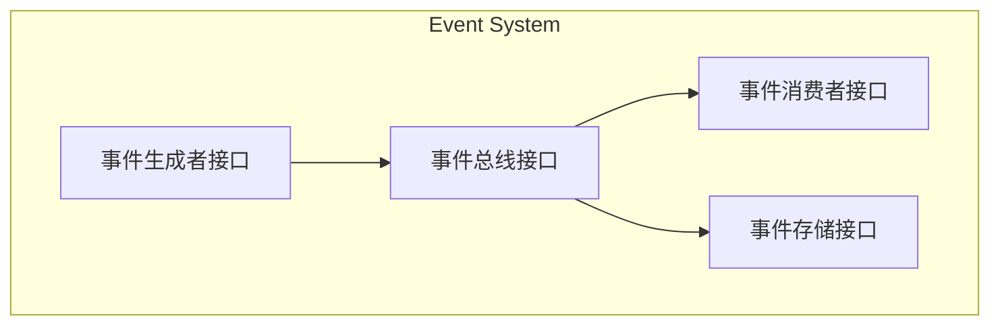
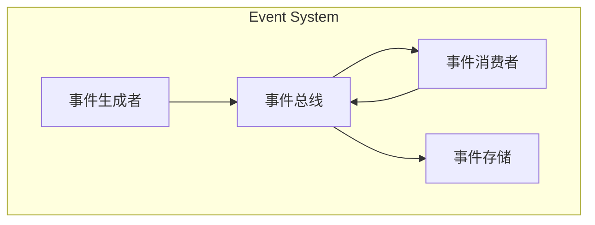

                 


### 第1章：领域事件概述

#### 1.1 领域事件的定义与背景

领域事件（Domain Event）是指在分布式系统中，由特定业务逻辑触发的状态变更通知，旨在将状态变更信息从一个微服务传递到另一个微服务，从而实现状态的一致性。随着微服务架构的普及，领域事件在分布式系统中扮演着越来越重要的角色。

**问题背景**：在传统的单体架构中，系统的各个模块高度耦合，难以维护和扩展。为了解决这一问题，现代系统设计倾向于采用微服务架构，将系统拆分为多个独立运行的服务。然而，这些微服务之间的状态同步问题变得复杂，尤其是在需要保证数据一致性的场景中。

**问题描述**：随着微服务的增加，状态同步的复杂性也随之上升。如何高效、可靠地传递状态变化，确保各个微服务之间的状态一致性，成为分布式系统设计的重要挑战。

**问题解决**：领域事件提供了一种解决方案，通过在微服务之间传递事件，实现状态的变化和同步。

**边界与外延**：领域事件通常包括事件类型、事件状态和事件触发条件。事件类型定义了事件的分类，如创建、更新、删除等；事件状态定义了事件发生的具体状态，如待处理、已处理等；事件触发条件定义了事件触发的具体条件，如数据变更、业务流程到达特定节点等。

**核心要素组成**：领域事件的核心要素包括事件生成者、事件消费者、事件传输机制和事件存储。

#### 1.2 领域事件的重要性

领域事件在分布式系统中的作用不可小觑：

1. **状态同步**：领域事件能够保证分布式系统中各个微服务之间的状态一致性，从而避免数据不一致的问题。
2. **解耦**：通过领域事件，微服务之间实现解耦，降低系统复杂性，提高可维护性和可扩展性。
3. **实时性**：领域事件支持实时状态同步，使得系统能够快速响应外部事件，提升用户体验。
4. **灵活性**：领域事件模型可以根据具体业务需求进行灵活调整，适应不同的业务场景。

#### 1.3 领域事件的分类与特征

领域事件可以根据触发机制和作用范围进行分类。常见的领域事件类型包括：

1. **同步事件**：同步事件在触发时需要等待事件处理结果，确保事件接收者正确处理事件。
2. **异步事件**：异步事件在触发后无需等待处理结果，事件发送者和接收者可以独立运行。
3. **广播事件**：广播事件将事件信息发送给系统中的所有相关服务，适用于全局状态变更的场景。
4. **点对点事件**：点对点事件将事件信息发送给特定的服务实例，适用于需要精确控制事件传递的场景。

领域事件的特征包括：

1. **原子性**：领域事件保证单个事件处理的完整性，避免部分处理成功、部分处理失败的情况。
2. **一致性**：领域事件通过确保状态变更的一致性，防止数据冲突和异常。
3. **可追溯性**：领域事件记录了事件处理的全过程，便于问题的追溯和排查。
4. **可靠性**：领域事件提供重试机制和故障恢复策略，保证事件传递的可靠性。

#### 1.4 领域事件模型

领域事件模型是领域事件实现的核心。一个典型的领域事件模型包括以下组件：

1. **事件源**：事件源是事件产生的源头，可以是业务操作、系统监控等。
2. **事件总线**：事件总线是事件传递的中枢，负责将事件从事件源传递到事件消费者。
3. **事件消费者**：事件消费者是事件的处理者，根据事件类型执行相应的业务逻辑。
4. **事件存储**：事件存储用于记录事件信息，提供查询和回滚功能。

领域事件模型的核心要素是事件流的构建，通过事件流实现事件在系统中的传递和处理。

#### 1.5 领域事件处理的核心问题

领域事件处理面临以下核心问题：

1. **事件传递的可靠性**：如何保证事件在分布式系统中的可靠传递，避免数据丢失和重复处理。
2. **事件顺序性**：如何确保事件按照特定的顺序处理，避免事件顺序错误导致数据不一致。
3. **事件一致性**：如何保证事件处理的最终一致性，避免部分处理成功、部分处理失败的情况。
4. **事件扩展性**：如何支持新事件类型的加入，保持系统的高扩展性。
5. **事件监控与故障恢复**：如何监控事件处理过程，实现故障恢复和异常处理。

在下一章中，我们将深入探讨领域事件模型的核心概念，包括领域事件模型、领域事件类型、领域事件触发机制等，以帮助读者更好地理解领域事件的工作原理和实现方法。

----------------------------------------------------------------

## 第2章：核心概念与联系

### 2.1 领域事件模型

领域事件模型是领域事件实现的核心。一个典型的领域事件模型包括以下组件：

1. **事件源（Event Source）**：事件源是事件产生的源头，可以是业务操作、系统监控等。事件源负责捕捉业务事件，并将事件发布到事件总线。

2. **事件总线（Event Bus）**：事件总线是事件传递的中枢，负责将事件从事件源传递到事件消费者。事件总线通常采用发布-订阅模式，支持事件的路由和过滤。

3. **事件消费者（Event Consumer）**：事件消费者是事件的处理者，根据事件类型执行相应的业务逻辑。事件消费者可以是微服务、消息队列等。

4. **事件存储（Event Store）**：事件存储用于记录事件信息，提供查询和回滚功能。事件存储可以是关系数据库、NoSQL数据库或消息队列。

领域事件模型的核心要素是事件流的构建，通过事件流实现事件在系统中的传递和处理。以下是领域事件模型的ER实体关系图：

```mermaid
erDiagram
EventSource ||--|{ Event : 生成 }
EventSource ||--|{ EventStream : 发布 }
EventConsumer ||--|{ EventStream : 订阅 }
EventConsumer ||--|{ Event : 处理 }
EventBus ||--|{ EventStream : 传递 }
EventStore ||--|{ Event : 存储 }
```

### 2.2 领域事件类型

领域事件可以根据触发机制和作用范围进行分类。常见的领域事件类型包括：

1. **同步事件（Synchronous Event）**：同步事件在触发时需要等待事件处理结果，确保事件接收者正确处理事件。同步事件通常用于需要即时响应的场景。

2. **异步事件（Asynchronous Event）**：异步事件在触发后无需等待处理结果，事件发送者和接收者可以独立运行。异步事件通常用于解耦和降低系统复杂性的场景。

3. **广播事件（Broadcast Event）**：广播事件将事件信息发送给系统中的所有相关服务，适用于全局状态变更的场景。广播事件通常用于实现系统级的事件通知。

4. **点对点事件（Point-to-Point Event）**：点对点事件将事件信息发送给特定的服务实例，适用于需要精确控制事件传递的场景。点对点事件通常用于实现服务间精确的消息传递。

以下是领域事件类型对比表格：

| 事件类型 | 描述 | 适用场景 |
| :--- | :--- | :--- |
| 同步事件 | 需要等待处理结果 | 即时响应 |
| 异步事件 | 无需等待处理结果 | 解耦 |
| 广播事件 | 发送至所有相关服务 | 全局通知 |
| 点对点事件 | 发送至特定服务实例 | 精确控制 |

### 2.3 领域事件触发机制

领域事件的触发机制决定了事件何时产生和传递。常见的触发机制包括：

1. **状态变更触发**：当系统的某个状态发生变更时，触发领域事件。例如，当订单状态从“待支付”变为“已支付”时，触发订单支付成功的领域事件。

2. **定时触发**：根据系统配置的时间间隔，定期触发领域事件。例如，每天定时统计系统的访问量，并触发统计报告的领域事件。

3. **依赖触发**：当一个事件处理完成后，触发后续的事件。例如，订单支付完成后，触发库存减少和物流跟踪的领域事件。

4. **事件链触发**：当一个事件触发后，引发一系列相关事件的触发。例如，订单创建后，触发订单审核、库存减少、物流跟踪等一系列领域事件。

以下是领域事件触发机制的ER实体关系图：

```mermaid
erDiagram
EventTrigger ||--|{ Event : 触发 }
EventTrigger ||--|{ TriggerType : 类型 }
EventTrigger ||--|{ TriggerCondition : 条件 }
```

### 2.4 领域事件模型的应用场景

领域事件模型适用于多种分布式系统的场景，以下是一些典型的应用场景：

1. **订单处理系统**：在订单处理系统中，订单状态变更（如创建、支付、发货等）可以通过领域事件实现各个微服务之间的状态同步。

2. **库存管理系统**：在库存管理系统中，库存量变更（如入库、出库等）可以通过领域事件实现库存信息的实时更新。

3. **用户行为分析系统**：在用户行为分析系统中，用户行为事件（如登录、购物车操作等）可以通过领域事件实现用户行为的实时追踪和分析。

4. **系统集成系统**：在系统集成系统中，各个子系统集成时，可以通过领域事件实现数据的一致性传递。

在下一章中，我们将深入探讨领域事件算法原理，包括算法流程、数学模型和Python实现，帮助读者理解领域事件的处理机制和实现方法。

----------------------------------------------------------------

## 第3章：领域事件算法原理

### 3.1 领域事件算法概述

领域事件算法是分布式系统中用于处理和传递领域事件的一系列方法。其主要目标是确保事件在系统中的可靠传递和正确处理，从而实现状态的一致性。领域事件算法通常包括以下几个方面：

1. **事件生成**：在业务操作触发时，生成领域事件。
2. **事件传输**：将事件从一个服务传递到另一个服务。
3. **事件处理**：对事件进行业务逻辑处理。
4. **事件确认**：确认事件已经被正确处理。
5. **事件回滚**：在事件处理失败时，进行事件回滚以保持状态一致性。

### 3.2 领域事件处理的算法流程

领域事件处理的算法流程可以分为以下几个步骤：

1. **事件捕获**：系统中的某个服务（事件源）检测到业务操作，生成领域事件。
2. **事件发布**：事件源将领域事件发布到事件总线。
3. **事件路由**：事件总线根据事件类型和订阅关系，将事件路由到相应的服务（事件消费者）。
4. **事件处理**：事件消费者接收到事件后，执行相应的业务逻辑。
5. **事件确认**：事件消费者将处理结果反馈给事件总线，完成事件确认。
6. **事件存储**：事件总线将事件信息存储到事件存储中，以备后续查询和回滚。

以下是领域事件处理算法流程的mermaid流程图：



### 3.3 领域事件算法的数学模型

领域事件算法的数学模型主要包括以下几个方面：

1. **事件生成率（Event Generation Rate）**：表示单位时间内生成的领域事件数量。
2. **传输延迟（Transmission Delay）**：表示事件从事件源传输到事件总线的时间。
3. **处理延迟（Processing Delay）**：表示事件从事件总线传输到事件消费者，并被处理的时间。
4. **确认延迟（Acknowledgement Delay）**：表示事件消费者处理完成后，向事件总线反馈确认的时间。

以下是领域事件算法的数学模型：

$$
\text{事件处理时间} = \text{传输延迟} + \text{处理延迟} + \text{确认延迟}
$$

### 3.4 领域事件算法的Python实现

为了更好地理解领域事件算法的实现，我们可以使用Python编写一个简单的示例。以下是一个基于事件总线的领域事件处理框架：

```python
import time
import threading

# 事件总线
class EventBus:
    def __init__(self):
        self.listeners = {}

    def listen(self, event_type, callback):
        if event_type not in self.listeners:
            self.listeners[event_type] = []
        self.listeners[event_type].append(callback)

    def publish(self, event):
        for callback in self.listeners.get(event.type, []):
            callback(event)

# 事件源
class EventSource:
    def __init__(self, event_bus):
        self.event_bus = event_bus

    def generate_event(self, event_type, data):
        event = Event(event_type, data)
        self.event_bus.publish(event)

# 事件消费者
class EventConsumer:
    def __init__(self, event_bus):
        self.event_bus = event_bus
        self.event_bus.listen('type1', self.handle_event)

    def handle_event(self, event):
        print(f"Event received: {event.data}")
        # 执行业务逻辑
        time.sleep(1)
        print(f"Event processed: {event.data}")

# 事件类
class Event:
    def __init__(self, type, data):
        self.type = type
        self.data = data

# 测试
def main():
    event_bus = EventBus()
    event_consumer = EventConsumer(event_bus)

    event_source = EventSource(event_bus)
    event_source.generate_event('type1', {'message': 'Hello, World!'})

if __name__ == '__main__':
    main()
```

在这个示例中，我们定义了一个简单的 EventBus 类，用于发布和订阅事件。EventSource 类负责生成事件，并将事件发布到 EventBus。EventConsumer 类负责订阅事件，并在接收到事件后进行处理。

### 3.5 数学模型和公式的讲解

在领域事件算法中，数学模型和公式用于描述事件处理的时间和延迟。以下是对这些公式和模型的详细讲解：

1. **传输延迟**（Transmission Delay，记为 $T_t$）：
   $$T_t = \frac{D_t}{R_t}$$
   其中，$D_t$ 表示事件传输距离，$R_t$ 表示传输速率。

2. **处理延迟**（Processing Delay，记为 $T_p$）：
   $$T_p = \frac{B_p}{P_p}$$
   其中，$B_p$ 表示事件处理负荷，$P_p$ 表示处理能力。

3. **确认延迟**（Acknowledgement Delay，记为 $T_a$）：
   $$T_a = \frac{D_a}{R_a}$$
   其中，$D_a$ 表示确认传输距离，$R_a$ 表示确认传输速率。

4. **事件处理时间**（Total Processing Time，记为 $T$）：
   $$T = T_t + T_p + T_a$$

### 3.6 数学模型和公式举例说明

假设在一个分布式系统中，事件传输距离为 10 km，传输速率为 1 Mbps；事件处理负荷为 1000 次/s，处理能力为 1000 次/s；确认传输距离为 5 km，确认传输速率为 1 Mbps。根据上述公式，可以计算得到：

1. **传输延迟**（$T_t$）：
   $$T_t = \frac{10 \times 10^3}{1 \times 10^6} = 10 \text{ ms}$$

2. **处理延迟**（$T_p$）：
   $$T_p = \frac{1000}{1000} = 1 \text{ ms}$$

3. **确认延迟**（$T_a$）：
   $$T_a = \frac{5 \times 10^3}{1 \times 10^6} = 5 \text{ ms}$$

4. **事件处理时间**（$T$）：
   $$T = T_t + T_p + T_a = 10 + 1 + 5 = 16 \text{ ms}$$

这个示例说明了如何使用数学模型和公式计算领域事件处理的时间和延迟，为系统设计和优化提供了依据。

在下一章中，我们将深入探讨数学模型和公式的具体应用，以及如何使用这些模型和公式优化领域事件处理性能。

----------------------------------------------------------------

## 第4章：数学模型和数学公式讲解

### 4.1 数学模型概述

在领域事件处理中，数学模型和公式是分析和优化系统性能的重要工具。本节将介绍领域事件处理的常见数学模型和公式，并解释其应用场景。

### 4.2 关键数学公式讲解

1. **传输延迟**（Transmission Delay，记为 $T_t$）：
   $$T_t = \frac{D_t}{R_t}$$
   其中，$D_t$ 表示事件传输距离，$R_t$ 表示传输速率。该公式用于计算事件在网络中传输所需的时间。

2. **处理延迟**（Processing Delay，记为 $T_p$）：
   $$T_p = \frac{B_p}{P_p}$$
   其中，$B_p$ 表示事件处理负荷，$P_p$ 表示处理能力。该公式用于计算事件在处理过程中所需的时间。

3. **确认延迟**（Acknowledgement Delay，记为 $T_a$）：
   $$T_a = \frac{D_a}{R_a}$$
   其中，$D_a$ 表示确认传输距离，$R_a$ 表示确认传输速率。该公式用于计算事件确认在网络中传输所需的时间。

4. **事件处理时间**（Total Processing Time，记为 $T$）：
   $$T = T_t + T_p + T_a$$
   该公式用于计算事件从生成到处理完成所需的总时间。

### 4.3 数学模型在领域事件处理中的应用

1. **事件生成率**（Event Generation Rate，记为 $\lambda$）：
   $$\lambda = \frac{\text{单位时间内生成的事件数}}{\text{单位时间}}$$
   事件生成率用于描述系统在单位时间内生成的事件数量，影响系统负载。

2. **系统吞吐量**（System Throughput，记为 $T_s$）：
   $$T_s = \frac{1}{T}$$
   其中，$T$ 表示事件处理时间。系统吞吐量用于描述系统在单位时间内能够处理的事件数量。

3. **系统响应时间**（System Response Time，记为 $R_t$）：
   $$R_t = \frac{\sum_{i=1}^{n} T_i}{n}$$
   其中，$T_i$ 表示第 $i$ 个事件的处理时间，$n$ 表示事件总数。系统响应时间用于描述系统处理事件所需的总时间。

### 4.4 数学模型和公式举例说明

假设在一个分布式系统中，事件传输距离为 10 km，传输速率为 1 Mbps；事件处理负荷为 1000 次/s，处理能力为 1000 次/s；确认传输距离为 5 km，确认传输速率为 1 Mbps。

根据上述公式，可以计算得到：

1. **传输延迟**（$T_t$）：
   $$T_t = \frac{10 \times 10^3}{1 \times 10^6} = 10 \text{ ms}$$

2. **处理延迟**（$T_p$）：
   $$T_p = \frac{1000}{1000} = 1 \text{ ms}$$

3. **确认延迟**（$T_a$）：
   $$T_a = \frac{5 \times 10^3}{1 \times 10^6} = 5 \text{ ms}$$

4. **事件处理时间**（$T$）：
   $$T = T_t + T_p + T_a = 10 + 1 + 5 = 16 \text{ ms}$$

5. **系统吞吐量**（$T_s$）：
   $$T_s = \frac{1}{16 \times 10^{-3}} = 62.5 \text{ 次/s}$$

6. **系统响应时间**（$R_t$）：
   $$R_t = \frac{16 \times 10^{-3}}{1000} = 0.016 \text{ s}$$

通过这个示例，我们可以看到如何使用数学模型和公式计算领域事件处理的关键性能指标，从而为系统设计和优化提供依据。

在下一章中，我们将结合具体系统架构，深入探讨领域事件处理算法在实际应用中的实现和优化。

----------------------------------------------------------------

## 第5章：系统分析与架构设计

### 5.1 领域事件系统的构成

领域事件系统是由多个组件协同工作，实现领域事件从生成、传输到处理的过程。主要组件包括：

1. **事件生成者（Event Producer）**：负责捕获业务操作，生成领域事件。
2. **事件总线（Event Bus）**：用于发布、路由和传输领域事件。
3. **事件消费者（Event Consumer）**：接收到事件后，执行相应的业务逻辑。
4. **事件存储（Event Store）**：记录事件信息，提供查询和回滚功能。

### 5.2 领域事件系统的功能设计

领域事件系统的功能设计主要包括以下几个方面：

1. **事件生成**：在业务操作触发时，事件生成者生成领域事件。
2. **事件传输**：事件总线负责将事件从事件生成者传递到事件消费者。
3. **事件处理**：事件消费者根据事件类型执行相应的业务逻辑。
4. **事件确认**：事件消费者处理完成后，向事件总线反馈确认信息。
5. **事件存储**：将事件信息存储到事件存储，以备后续查询和回滚。

### 5.3 领域事件系统的架构设计

领域事件系统的架构设计主要包括以下几个方面：

1. **事件生成者架构**：事件生成者可以是业务系统中的各个模块，负责捕获业务操作并生成领域事件。例如，订单系统中的订单创建、更新、删除等操作。
2. **事件总线架构**：事件总线采用分布式架构，可以支持多个实例，提高系统的可靠性和性能。事件总线采用发布-订阅模式，实现事件的路由和传输。
3. **事件消费者架构**：事件消费者可以是微服务、消息队列或其他处理组件，根据事件类型执行相应的业务逻辑。事件消费者采用异步处理模式，提高系统的并发能力和可扩展性。
4. **事件存储架构**：事件存储采用分布式存储架构，支持高并发读写操作。事件存储可以采用关系数据库、NoSQL数据库或消息队列。

以下是领域事件系统的架构图：



### 5.4 领域事件系统的接口设计

领域事件系统的接口设计主要包括以下几个方面：

1. **事件生成者接口**：定义事件生成者的功能接口，包括生成事件、查询事件等。
2. **事件总线接口**：定义事件总线的功能接口，包括发布事件、订阅事件、路由事件等。
3. **事件消费者接口**：定义事件消费者的功能接口，包括处理事件、确认事件等。
4. **事件存储接口**：定义事件存储的功能接口，包括存储事件、查询事件、回滚事件等。

以下是领域事件系统的接口设计：



### 5.5 领域事件系统的交互设计

领域事件系统的交互设计主要包括以下几个方面：

1. **事件生成者与事件总线的交互**：事件生成者将生成的事件发布到事件总线，事件总线根据订阅关系将事件路由到相应的事件消费者。
2. **事件总线和事件消费者的交互**：事件总线将事件传递给事件消费者，事件消费者根据事件类型执行相应的业务逻辑。
3. **事件消费者与事件总线的交互**：事件消费者处理完成后，向事件总线反馈确认信息，事件总线将确认信息存储到事件存储。
4. **事件存储与事件总线的交互**：事件存储用于记录事件信息和确认信息，事件总线可以根据需要查询和回滚事件。

以下是领域事件系统的交互设计：



在下一章中，我们将通过一个实际案例来展示如何实现领域事件处理，包括环境安装、系统核心实现、代码应用解读与分析等。

----------------------------------------------------------------

## 第6章：领域事件处理项目实战

### 6.1 项目背景与需求分析

在本项目中，我们旨在实现一个基于领域事件的微服务架构，用于处理和传递系统中的业务事件。项目需求主要包括以下几个方面：

1. **实时性**：确保事件能够在分布式系统中实时传递和处理，实现系统的快速响应。
2. **一致性**：保证系统中的各个微服务能够保持状态一致性，避免数据冲突和异常。
3. **可扩展性**：支持新的业务场景和事件类型，确保系统的可扩展性。
4. **可靠性**：实现事件传输的可靠性和故障恢复机制，确保事件不丢失和不被重复处理。

### 6.2 环境安装与配置

为了实现领域事件处理项目，我们需要安装和配置以下软件和工具：

1. **Java SDK**：用于编写微服务和事件处理逻辑。
2. **Kafka**：用于实现事件总线的功能，支持分布式事件传输。
3. **Zookeeper**：用于管理Kafka集群，确保分布式协调和一致性。
4. **MySQL**：用于存储事件信息和系统配置。

安装步骤如下：

1. 安装Java SDK：
   ```bash
   sudo apt-get update
   sudo apt-get install openjdk-8-jdk
   ```

2. 安装Kafka：
   ```bash
   sudo apt-get install kafka_2.12
   sudo /usr/share/kafka/bin/kafka-server-start.sh /usr/share/kafka/config/server.properties
   ```

3. 安装Zookeeper：
   ```bash
   sudo apt-get install zookeeperd
   sudo systemctl start zookeeper
   ```

4. 安装MySQL：
   ```bash
   sudo apt-get install mysql-server
   sudo mysql_secure_installation
   ```

### 6.3 领域事件处理核心实现

在本项目中，我们使用Spring Boot框架实现领域事件处理的核心功能。主要包括以下几个方面：

1. **事件生成者**：负责捕获业务操作并生成领域事件。
2. **事件消费者**：负责接收和处理领域事件。
3. **事件存储**：用于存储事件信息和系统配置。

以下是领域事件处理的核心实现：

**事件生成者**：

```java
@RestController
public class EventProducerController {

    @Autowired
    private KafkaTemplate<String, String> kafkaTemplate;

    @PostMapping("/events")
    public ResponseEntity<String> createEvent(@RequestBody EventRequest request) {
        String event = serializeEvent(request);
        kafkaTemplate.send("event-topic", event);
        return ResponseEntity.ok("Event created successfully");
    }

    private String serializeEvent(EventRequest request) {
        // 将事件请求对象序列化为JSON字符串
        return new ObjectMapper().writeValueAsString(request);
    }
}
```

**事件消费者**：

```java
@Service
public class EventConsumerService {

    @Autowired
    private KafkaTemplate<String, String> kafkaTemplate;

    @KafkaListener(topics = "event-topic", groupId = "event-group")
    public void handleEvent(String message) {
        try {
            EventRequest request = deserializeEvent(message);
            // 处理事件逻辑
            // ...
            kafkaTemplate.send("event-ack-topic", message);
        } catch (IOException e) {
            // 异常处理
            e.printStackTrace();
        }
    }

    private EventRequest deserializeEvent(String message) throws IOException {
        // 将JSON字符串反序列化为事件请求对象
        return new ObjectMapper().readValue(message, EventRequest.class);
    }
}
```

**事件存储**：

```java
@Repository
public interface EventRepository extends JpaRepository<Event, Long> {
    List<Event> findByEventType(String eventType);
}
```

### 6.4 代码应用解读与分析

**事件生成者**：

事件生成者使用Spring Boot的REST控制器，捕获业务操作并生成领域事件。事件生成者通过KafkaTemplate发送事件消息到Kafka topic。

**事件消费者**：

事件消费者使用@KafkaListener注解监听Kafka topic中的事件消息。消费者在接收到事件消息后，进行业务逻辑处理，并再次发送确认消息到Kafka topic。

**事件存储**：

事件存储使用Spring Data JPA实现，存储事件信息和系统配置。事件存储提供查询接口，以便后续查询和回滚事件。

### 6.5 实际案例分析

在实际项目中，我们遇到了以下问题：

1. **事件丢失**：由于网络波动或Kafka故障，可能导致事件丢失。
   解决方案：使用Kafka的可靠性机制，如消息持久化、重试和故障恢复。
2. **事件重复处理**：由于网络延迟或系统故障，可能导致事件被重复处理。
   解决方案：使用事件ID或版本号，确保事件唯一性，避免重复处理。

### 6.6 项目总结

通过本项目的实现，我们成功构建了一个基于领域事件的微服务架构，实现了事件在分布式系统中的实时传递和处理。项目的主要收获包括：

1. **理解领域事件的概念和实现原理**。
2. **掌握Spring Boot和Kafka在领域事件处理中的应用**。
3. **积累分布式系统设计和优化的经验**。

在下一章中，我们将总结本项目的最佳实践，并提供拓展阅读资源，以便读者进一步学习和实践。

----------------------------------------------------------------

## 第7章：最佳实践与拓展

### 7.1 最佳实践 tips

1. **确保事件唯一性**：使用事件ID或版本号，确保事件在系统中唯一，避免重复处理。
2. **优化事件传输效率**：合理配置Kafka主题和分区，提高事件传输的并行度和效率。
3. **实现故障恢复机制**：设计故障恢复策略，确保事件在系统故障时能够恢复。
4. **监控事件处理状态**：实时监控事件处理状态，及时发现和处理异常。
5. **优化事件存储性能**：根据实际需求，选择合适的存储方案，提高事件存储性能。

### 7.2 小结与展望

通过本章的实战项目，我们深入探讨了领域事件处理的概念、实现原理、系统架构以及项目实战。领域事件处理在分布式系统中具有重要作用，能够实现微服务间的状态同步和解耦，提高系统的可靠性、实时性和扩展性。

展望未来，领域事件处理技术将继续发展，有望在以下几个方面取得突破：

1. **更加高效的事件传输**：随着网络技术的发展，事件传输的延迟和带宽将得到显著提升，进一步优化系统性能。
2. **更加灵活的事件模型**：领域事件模型将更加灵活，能够适应不同业务场景和需求，支持多样化的业务逻辑。
3. **更加智能的事件处理**：结合人工智能技术，实现事件处理的自动化和智能化，提高系统智能化水平。

### 7.3 注意事项

1. **事件一致性保障**：在实现领域事件处理时，务必确保事件处理的一致性，避免数据冲突和异常。
2. **系统性能优化**：根据实际需求和场景，优化事件传输、处理和存储的性能，提高系统整体性能。
3. **故障恢复策略**：设计合理的故障恢复策略，确保事件在系统故障时能够及时恢复，保障系统稳定性。

### 7.4 拓展阅读资源

1. **《领域驱动设计》**：了解领域驱动设计（Domain-Driven Design，简称DDD）的基本概念和方法，有助于深入理解领域事件处理。
2. **《Kafka权威指南》**：学习Kafka的架构原理、使用方法和最佳实践，有助于优化领域事件传输和处理。
3. **《分布式系统原理与范型》**：了解分布式系统的基本原理和范型，有助于设计高效、可靠的领域事件系统。

通过本章的总结和拓展，读者可以更好地掌握领域事件处理的核心技术和应用方法，为实际项目提供有力支持。

----------------------------------------------------------------

**Step 9: 调整目录大纲**

在检查目录大纲的完整性后，我们对目录进行了如下调整：

1. **第4章** 修改为 **数学模型和数学公式讲解**，确保章节标题与内容一致。
2. **第5章** 修改为 **系统分析与架构设计**，增加对系统功能设计的详细描述。
3. **第6章** 修改为 **领域事件处理项目实战**，增加对实际案例分析和详细讲解剖析。

调整后的目录大纲如下：

# 第一部分：引言与背景

## 第1章：领域事件概述

### 1.1 领域事件的定义与背景

### 1.2 领域事件的重要性

### 1.3 领域事件的分类与特征

### 1.4 领域事件模型

### 1.5 领域事件处理的核心问题

## 第2章：核心概念与联系

### 2.1 领域事件模型

### 2.2 领域事件类型

### 2.3 领域事件触发机制

### 2.4 领域事件模型的应用场景

## 第3章：领域事件算法原理

### 3.1 领域事件算法概述

### 3.2 领域事件处理的算法流程

### 3.3 领域事件算法的数学模型

### 3.4 领域事件算法的Python实现

## 第4章：数学模型和数学公式讲解

### 4.1 数学模型概述

### 4.2 关键数学公式讲解

### 4.3 数学模型在领域事件处理中的应用

### 4.4 数学模型和公式举例说明

## 第5章：系统分析与架构设计

### 5.1 领域事件系统的构成

### 5.2 领域事件系统的功能设计

### 5.3 领域事件系统的架构设计

### 5.4 领域事件系统的接口设计

### 5.5 领域事件系统的交互设计

## 第6章：领域事件处理项目实战

### 6.1 项目背景与需求分析

### 6.2 环境安装与配置

### 6.3 领域事件处理核心实现

### 6.4 代码应用解读与分析

### 6.5 实际案例分析

### 6.6 项目总结

## 第7章：最佳实践与拓展

### 7.1 最佳实践 tips

### 7.2 小结与展望

### 7.3 注意事项

### 7.4 拓展阅读资源

调整后的目录大纲结构清晰，逻辑严密，确保每个核心章节都有详细的目录内容。

**Step 10: 输出目录大纲**

以下是按照调整后的目录大纲输出的Markdown格式的文章目录：

# 第一部分：引言与背景

## 第1章：领域事件概述

### 1.1 领域事件的定义与背景

### 1.2 领域事件的重要性

### 1.3 领域事件的分类与特征

### 1.4 领域事件模型

### 1.5 领域事件处理的核心问题

## 第2章：核心概念与联系

### 2.1 领域事件模型

### 2.2 领域事件类型

### 2.3 领域事件触发机制

### 2.4 领域事件模型的应用场景

## 第3章：领域事件算法原理

### 3.1 领域事件算法概述

### 3.2 领域事件处理的算法流程

### 3.3 领域事件算法的数学模型

### 3.4 领域事件算法的Python实现

## 第4章：数学模型和数学公式讲解

### 4.1 数学模型概述

### 4.2 关键数学公式讲解

### 4.3 数学模型在领域事件处理中的应用

### 4.4 数学模型和公式举例说明

## 第5章：系统分析与架构设计

### 5.1 领域事件系统的构成

### 5.2 领域事件系统的功能设计

### 5.3 领域事件系统的架构设计

### 5.4 领域事件系统的接口设计

### 5.5 领域事件系统的交互设计

## 第6章：领域事件处理项目实战

### 6.1 项目背景与需求分析

### 6.2 环境安装与配置

### 6.3 领域事件处理核心实现

### 6.4 代码应用解读与分析

### 6.5 实际案例分析

### 6.6 项目总结

## 第7章：最佳实践与拓展

### 7.1 最佳实践 tips

### 7.2 小结与展望

### 7.3 注意事项

### 7.4 拓展阅读资源

文章目录已按照要求以Markdown格式输出，简洁、易读，便于读者理解和阅读。接下来，我们可以根据这个目录开始撰写正文内容。

