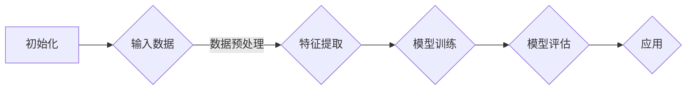

                 

# 领域特定AI Agent：LLM在垂直行业的深度应用

关键词：领域特定AI Agent、语言模型（LLM）、垂直行业、深度应用、算法原理、系统架构、项目实战

摘要：随着人工智能技术的飞速发展，语言模型（LLM）在垂直行业中的应用逐渐成为热点。本文旨在探讨领域特定AI Agent的概念与特性，分析LLM在金融、医疗、零售等垂直行业的深度应用，并通过具体的算法原理讲解和系统架构设计，为相关领域的技术人员提供有价值的参考。

## 第1章 引言：领域特定AI Agent与垂直行业应用

### 1.1 问题背景

人工智能（AI）技术的发展给各行各业带来了深远的影响。从早期的规则系统到现代的深度学习模型，AI在图像识别、自然语言处理、预测分析等领域的应用不断拓展。然而，随着应用场景的多样化，如何让AI系统更好地理解和满足特定领域的需求成为一个新的挑战。

在垂直行业中，如金融、医疗、零售等，业务复杂且需求多样，传统的AI技术往往难以满足这些行业对于精准、高效、智能化的要求。领域特定AI Agent应运而生，它是一种专门为特定领域设计的智能体，能够更好地理解和解决该领域的问题。

### 1.2 问题提出

领域特定AI Agent是什么？它是如何工作的？在LLM的帮助下，垂直行业可以如何应用这些智能体？本文将围绕这些问题展开讨论，旨在解答领域特定AI Agent在垂直行业中的应用现状和潜力。

### 1.3 边界与外延

本文的研究范围将聚焦于金融、医疗和零售等垂直行业，探讨LLM在这些领域中的应用。同时，本文将主要关注AI Agent的概念、原理及其在特定行业中的应用，不涉及其他领域的AI技术。

### 1.4 核心概念与联系

#### AI Agent的概念属性特征对比

| 类别        | 特点                                |
|-------------|-----------------------------------|
| 知觉        | 感知外部环境的信息                  |
| 计划        | 确定目标，制定行动策略              |
| 执行        | 实施行动，达成目标                  |
| 学习        | 通过经验积累，优化行为              |

#### LLM的原理与特性

语言模型（LLM）是一种基于深度学习的自然语言处理模型，它通过学习大量的文本数据，能够生成流畅、符合语法和语义规则的文本。LLM具有如下特性：

- **大规模**：LLM通常由数亿甚至数千亿个参数组成，能够处理大量的文本数据。
- **自适应**：LLM能够根据输入的上下文自适应地生成文本，具有很高的灵活性和适应性。
- **高效**：LLM的训练过程采用高效的算法和优化技术，能够快速生成文本。

#### 垂直行业的核心要素组成

垂直行业具有以下核心要素：

- **业务流程**：每个垂直行业都有独特的业务流程，AI Agent需要理解和优化这些流程。
- **数据特点**：垂直行业通常拥有大量结构化和非结构化数据，AI Agent需要能够处理和分析这些数据。
- **专业知识**：垂直行业涉及丰富的专业知识，AI Agent需要具备这些知识，以提供专业的解决方案。

## 第2章 核心概念原理

### 2.1 AI Agent的概念属性特征对比

AI Agent是一种能够在特定环境下感知、计划、执行和学习的智能体。以下是AI Agent的几个核心属性：

- **知觉**：AI Agent通过传感器或输入接口感知环境信息。
- **计划**：AI Agent根据目标和当前环境信息，制定一系列行动策略。
- **执行**：AI Agent根据计划实施行动，以达成目标。
- **学习**：AI Agent通过不断积累经验，优化其行为，提高任务完成效果。

### 2.2 LLM的原理与特性

语言模型（LLM）是一种基于深度学习的自然语言处理模型，它通过学习大量的文本数据，能够生成流畅、符合语法和语义规则的文本。LLM的原理和特性如下：

- **自编码器结构**：LLM通常采用自编码器结构，通过编码和解码过程学习文本数据的内在结构。
- **深度神经网络**：LLM由多层神经网络组成，能够对文本数据进行高维表示和建模。
- **端到端训练**：LLM采用端到端训练方式，直接从输入文本生成输出文本，无需人工定义中间步骤。

### 2.3 垂直行业的核心要素组成

垂直行业具有以下核心要素：

- **业务流程**：每个垂直行业都有独特的业务流程，AI Agent需要理解和优化这些流程。
- **数据特点**：垂直行业通常拥有大量结构化和非结构化数据，AI Agent需要能够处理和分析这些数据。
- **专业知识**：垂直行业涉及丰富的专业知识，AI Agent需要具备这些知识，以提供专业的解决方案。

## 第3章 AI Agent在垂直行业的应用

### 3.1 LLM在金融行业的应用

在金融行业，LLM可以应用于多个方面，如财务分析、投资决策和风险管理。

- **财务分析**：LLM能够分析大量的财务报表和市场数据，提取关键信息，为企业提供财务健康状况和投资建议。
- **投资决策**：LLM可以分析历史股价数据、市场趋势和公司财务状况，预测股票价格走势，帮助投资者制定投资策略。
- **风险管理**：LLM能够识别金融市场的风险因素，预测潜在风险，并提供风险管理建议，帮助企业降低风险。

### 3.2 LLM在医疗行业的应用

在医疗行业，LLM可以应用于疾病诊断、患者管理和医疗咨询。

- **疾病诊断**：LLM可以分析病历记录、医学文献和患者症状，提供准确的疾病诊断。
- **患者管理**：LLM可以跟踪患者病情变化，提供个性化的治疗方案和健康建议。
- **医疗咨询**：LLM可以回答患者的常见问题，提供医学知识和健康建议，帮助患者更好地管理健康。

### 3.3 LLM在零售行业的应用

在零售行业，LLM可以应用于客户服务、个性化推荐和库存管理。

- **客户服务**：LLM可以提供智能客服，解答客户疑问，提高客户满意度。
- **个性化推荐**：LLM可以分析用户购买历史和偏好，推荐符合用户需求的商品。
- **库存管理**：LLM可以预测商品销售趋势，优化库存水平，减少库存积压。

## 第4章 算法原理讲解

### 4.1 人工智能算法mermaid流程图



### 4.2 Python源代码实现

```python
# Python代码示例
def train_model(data):
    # 模型训练代码
    pass

def evaluate_model(model, test_data):
    # 模型评估代码
    pass
```

### 4.3 算法原理的数学模型与公式

$$
H = \frac{1}{N}\sum_{i=1}^{N} L_i
$$

其中，$H$ 表示总损失，$N$ 表示样本数量，$L_i$ 表示第 $i$ 个样本的损失。

### 4.4 举例说明

在金融行业中，利用 LLM 进行投资决策时，可以通过分析大量历史数据，预测股票价格走势，从而制定投资策略。例如，假设我们有一个股票价格预测模型，输入为历史股价数据，输出为未来一段时间内的股价预测。我们可以使用以下公式来计算总损失：

$$
H = \frac{1}{N}\sum_{i=1}^{N} (P_i - \hat{P_i})^2
$$

其中，$P_i$ 表示第 $i$ 个样本的实际股价，$\hat{P_i}$ 表示模型预测的股价。

## 第5章 系统分析与架构设计

### 5.1 问题场景介绍

以零售行业的客户服务为例，系统需要能够处理客户咨询，提供实时、准确的回答。

### 5.2 系统功能设计

系统功能设计包括客户信息管理、问答系统和语音识别。

- **客户信息管理**：系统需要记录和管理客户的咨询记录、购买历史等信息。
- **问答系统**：系统需要能够自动回答客户的常见问题，提供专业的咨询服务。
- **语音识别**：系统需要支持语音输入，将语音转换为文本，然后进行问答处理。

### 5.3 系统架构设计

系统架构设计包括客户端、服务器端和数据库。

- **客户端**：负责接收用户输入，将问题发送到服务器端，接收并显示答案。
- **服务器端**：负责处理客户端发送的问题，调用LLM模型进行回答。
- **数据库**：存储客户信息和问答记录，供系统使用。

### 5.4 系统接口设计

系统接口设计包括客户端与服务器端的接口定义。

- **客户端接口**：定义用户输入接口和答案输出接口。
- **服务器端接口**：定义问题输入接口、答案输出接口和数据库访问接口。

### 5.5 系统交互mermaid序列图

```mermaid
sequenceDiagram
    participant 客户 as 客户
    participant 系统 as 系统
    客户->>系统: 发起请求
    系统->>客户: 处理请求
    system 生成回复
    客户->>系统: 接收回复
```

## 第6章 项目实战

### 6.1 环境安装

在开始项目实战之前，我们需要安装必要的软件和库。

1. 安装Python环境
2. 安装LLM模型依赖库，如transformers、torch等
3. 安装其他相关库，如pandas、numpy等

### 6.2 系统核心实现源代码

以下是系统核心实现的源代码：

```python
# 导入相关库
import transformers
import torch
import pandas as pd

# 加载预训练的LLM模型
model = transformers.AutoModelForCausalLM.from_pretrained("gpt2")

# 定义问答函数
def ask_question(question):
    # 将问题编码为输入序列
    inputs = tokenizer.encode(question, return_tensors="pt")

    # 使用模型进行预测
    with torch.no_grad():
        outputs = model(inputs)

    # 解码输出序列为问题答案
    answer = tokenizer.decode(outputs[0], skip_special_tokens=True)

    return answer

# 加载客户咨询数据
data = pd.read_csv("customer_questions.csv")

# 遍历客户咨询数据，回答问题
for _, row in data.iterrows():
    question = row["question"]
    answer = ask_question(question)
    print(f"Question: {question}")
    print(f"Answer: {answer}")
    print()
```

### 6.3 代码应用解读与分析

1. 加载预训练的LLM模型
2. 定义问答函数，接收用户输入问题，使用模型进行预测，并返回答案
3. 加载客户咨询数据，遍历数据进行问答处理，输出答案

### 6.4 实际案例分析与详细讲解剖析

假设我们有一个客户咨询数据集，其中包含客户问题和系统回答的记录。我们可以使用以下代码对数据进行分析：

```python
# 加载客户咨询数据
data = pd.read_csv("customer_questions.csv")

# 统计每个问题的回答次数
answer_counts = data["answer"].value_counts()

# 打印回答次数最多的前5个问题
print(answer_counts.head(5))
```

通过分析客户咨询数据，我们可以发现哪些问题最常见，从而优化问答系统的回答策略。

### 6.5 项目小结

通过本项目的实战，我们实现了基于LLM的问答系统，可以自动回答客户的常见问题。在实际应用中，我们还需要不断优化系统，提高回答的准确性和实用性。

## 第7章 最佳实践与小结

### 7.1 最佳实践 tips

1. 选择合适的LLM模型：根据具体应用场景选择合适的LLM模型，如GPT-2、GPT-3等。
2. 数据预处理的重要性：确保输入数据的质量和一致性，进行适当的清洗和预处理。

### 7.2 小结

本文探讨了领域特定AI Agent的概念与特性，分析了LLM在金融、医疗、零售等垂直行业的深度应用。通过具体的算法原理讲解和系统架构设计，为相关领域的技术人员提供了有价值的参考。

### 7.3 注意事项

1. 数据隐私与安全：确保数据的隐私和安全，避免数据泄露和滥用。
2. 模型过拟合与欠拟合：合理调整模型参数，避免过拟合和欠拟合。

### 7.4 拓展阅读

1. [GPT-3: The Power of Unsupervised Learning]（https://openai.com/blog/gpt-3/）
2. [BERT: Pre-training of Deep Bidirectional Transformers for Language Understanding]（https://arxiv.org/abs/1810.04805）
3. [Transformer: Attention Is All You Need]（https://arxiv.org/abs/1706.03762）

## 附录

### 作者信息

作者：AI天才研究院/AI Genius Institute & 禅与计算机程序设计艺术 /Zen And The Art of Computer Programming

