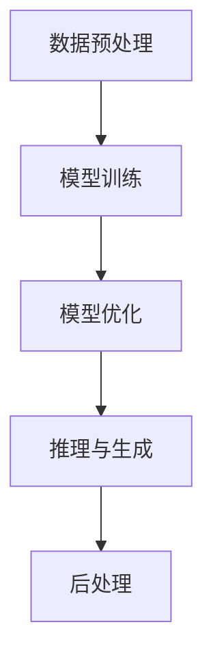
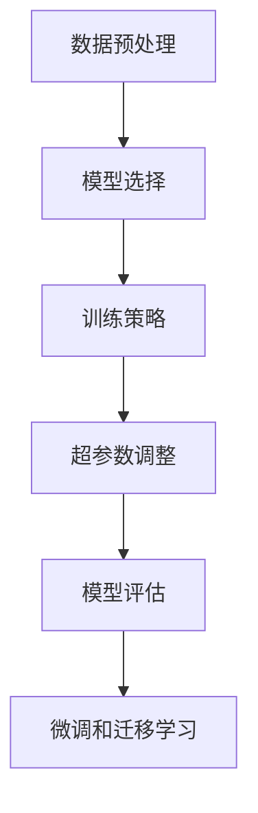
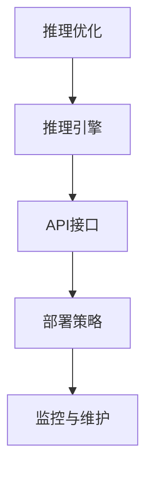
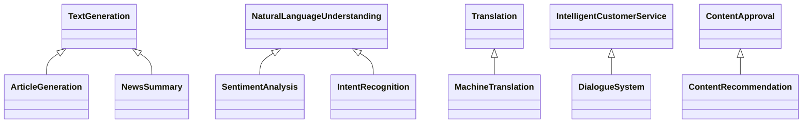
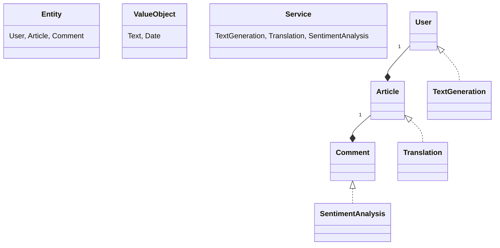
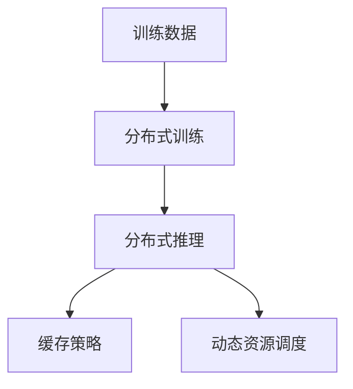

                 

### 文章标题

# 领域驱动设计（DDD）在LLM应用架构中的应用

> 关键词：领域驱动设计（DDD），大型语言模型（LLM），应用架构，设计模式，软件开发

> 摘要：本文深入探讨了领域驱动设计（DDD）在大型语言模型（LLM）应用架构中的实际应用。通过分析DDD的基本原理和LLM的特点，本文揭示了如何利用DDD原则来优化LLM的架构设计，提高开发效率和系统性能。文章结构紧凑，逻辑清晰，旨在为开发者提供实用指南，以帮助他们在构建复杂LLM应用时应对挑战。

### 引言

在当今快速发展的技术环境中，大型语言模型（LLM）已经成为许多行业的重要工具，从自然语言处理到智能客服、内容生成等应用。随着LLM的规模和复杂性不断增加，如何设计高效、可扩展的架构成为了一个关键问题。领域驱动设计（DDD）作为一种面向业务领域的软件开发方法，提供了应对复杂系统的有效策略。

领域驱动设计（DDD）由Eric Evans在2004年提出，旨在将领域专家的知识与软件工程师的技能结合起来，构建具有高内聚、低耦合的系统。DDD的核心概念包括领域模型、实体、值对象、聚合和领域服务。这些概念为软件开发提供了强大的理论基础，帮助开发者更好地理解和处理业务需求。

本文将深入探讨DDD在LLM应用架构中的应用。首先，我们将回顾DDD的基本原理，然后分析LLM的特点，最后探讨如何将DDD原则应用于LLM架构设计，提高开发效率和系统性能。本文旨在为开发者提供实用的指导，以帮助他们在构建复杂LLM应用时应对挑战。

### 第1章: 领域驱动设计（DDD）概述

#### 1.1 问题背景

在传统的软件开发过程中，许多项目往往因为需求和技术的快速变化而面临诸多挑战。传统的软件开发方法通常以技术为中心，导致系统架构难以适应业务需求的快速变化，导致代码复用性差、系统耦合度高、维护成本增加。随着软件系统的复杂性不断增加，传统方法在应对大规模、高并发、高可扩展性的需求时显得力不从心。

为了解决这些问题，Eric Evans在2004年提出了领域驱动设计（DDD）方法。DDD的核心思想是将软件开发的重心从技术转移到业务领域，通过构建清晰、简洁的领域模型来提高系统的可维护性和扩展性。DDD提供了一系列的原则和模式，帮助开发者更好地理解和处理业务领域的问题。

#### 1.1.1 传统软件开发面临的挑战

传统软件开发方法在以下方面面临挑战：

1. **需求变化难以适应**：在软件开发过程中，需求往往频繁变化，导致项目进度延误、成本增加。
2. **系统耦合度高**：传统方法倾向于使用全局变量和类之间的紧密耦合，导致系统的可维护性和可扩展性较差。
3. **代码复用性差**：由于缺乏对业务领域的深入理解，开发者往往重复编写相似的代码，导致代码冗长、难以维护。
4. **难以应对大规模系统**：传统方法在处理高并发、高负载的大型系统时，往往难以保证系统的稳定性和性能。

#### 1.1.2 DDD解决思路

领域驱动设计（DDD）提供了一系列解决方案，以应对传统软件开发方法面临的挑战：

1. **以业务领域为中心**：DDD将软件开发的重心从技术转移到业务领域，通过建立领域模型来清晰地表达业务逻辑，确保系统设计紧密贴合业务需求。
2. **高内聚、低耦合**：DDD通过实体、值对象、聚合和领域服务的概念，实现了系统内部的高内聚和低耦合，提高了系统的可维护性和扩展性。
3. **领域模型的维护**：DDD强调领域模型的持续维护和进化，确保系统在业务需求变化时能够灵活调整。
4. **代码复用**：DDD通过领域模型和领域服务的抽象，提高了代码的复用性，减少了重复编写代码的工作量。

#### 1.2 DDD核心概念

领域驱动设计（DDD）的核心概念包括领域模型、实体、值对象、聚合和领域服务。这些概念为软件开发提供了强大的理论基础，帮助开发者更好地理解和处理业务领域的问题。

##### 1.2.1 领域模型

领域模型是DDD的核心概念之一，它通过抽象和封装业务领域中的核心概念和关系，帮助开发者清晰地表达业务逻辑。领域模型通常包含实体、值对象、聚合和领域服务等元素。

领域模型的作用包括：

1. **明确业务需求**：通过领域模型，开发者可以更清晰地理解业务需求，确保系统设计紧密贴合业务场景。
2. **降低复杂性**：领域模型将复杂的业务逻辑封装在内部，简化了系统的设计和实现。
3. **提高可维护性**：领域模型使得系统结构更加清晰，便于后续的维护和扩展。

##### 1.2.2 实体与值对象

实体和值对象是领域模型中的两种基本元素，它们在领域模型中分别承担不同的角色。

实体通常具有唯一标识，可以持久化存储，例如用户、订单等。实体的关键特点包括：

1. **唯一标识**：实体具有唯一标识，例如通过ID或UUID来唯一标识一个实体。
2. **持久化存储**：实体通常需要持久化存储，以便在系统重启或故障时保持数据一致性。

值对象通常用于表示业务领域中的简单数据项，例如地址、日期等。值对象的特点包括：

1. **不可变**：值对象通常是不可变的，确保数据的一致性和安全性。
2. **轻量级**：值对象通常轻量级，便于在系统内部快速传递和处理。

##### 1.2.3 领域服务

领域服务是领域模型中的功能模块，负责处理领域模型中的复杂业务逻辑。领域服务通常具有以下特点：

1. **高内聚**：领域服务通常紧密围绕一个业务功能，实现高内聚。
2. **低耦合**：领域服务通过接口与领域模型中的其他组件进行交互，实现低耦合。
3. **可重用**：领域服务可以独立开发、测试和部署，提高系统的可维护性和可扩展性。

#### 1.3 DDD与LLM应用架构的联系

领域驱动设计（DDD）与大型语言模型（LLM）应用架构之间存在紧密的联系。LLM作为自然语言处理的重要工具，其应用场景广泛，包括文本生成、智能客服、内容摘要等。然而，随着LLM的规模和复杂性的增加，如何设计高效、可扩展的架构成为了一个关键问题。DDD提供了一系列原则和模式，可以帮助开发者更好地理解和处理LLM应用架构中的问题。

##### 1.3.1 DDD在LLM中的应用

在LLM应用架构中，DDD的核心概念和模式可以应用于以下几个方面：

1. **领域模型构建**：通过构建领域模型，开发者可以更清晰地表达LLM应用中的核心业务逻辑，确保系统设计紧密贴合业务需求。
2. **实体与值对象设计**：实体和值对象可以帮助开发者明确LLM应用中的数据结构和业务规则，提高系统的可维护性和可扩展性。
3. **领域服务设计**：领域服务可以负责处理LLM应用中的复杂业务逻辑，实现高内聚和低耦合。

##### 1.3.2 DDD与LLM架构优化的关系

DDD不仅可以帮助开发者设计高效的LLM应用架构，还可以优化架构设计，提高系统性能和可扩展性。以下是一些DDD与LLM架构优化之间的关系：

1. **提高代码复用性**：DDD通过领域模型的抽象和封装，提高了代码的复用性，减少了重复编写代码的工作量，从而降低了维护成本。
2. **降低系统耦合度**：DDD通过实体、值对象和领域服务的概念，实现了系统内部的高内聚和低耦合，提高了系统的可维护性和可扩展性。
3. **提高系统性能**：DDD通过优化领域模型和领域服务的设计，减少了系统中的冗余计算和资源消耗，从而提高了系统性能。

#### 1.4 本章小结

本章介绍了领域驱动设计（DDD）的基本原理和应用背景。通过分析传统软件开发方法面临的挑战，我们了解了DDD的解决思路。DDD的核心概念包括领域模型、实体、值对象和领域服务，它们为软件开发提供了强大的理论基础。此外，本章还探讨了DDD在LLM应用架构中的应用，以及DDD与LLM架构优化的关系。通过本章的学习，读者可以初步了解DDD在软件开发中的重要作用，并为后续章节的学习打下基础。

### 第2章: DDD基本原理

领域驱动设计（DDD）作为一种面向业务领域的软件开发方法，其核心原理包括领域模型、实体、值对象、聚合和领域服务。这些原理为开发者提供了强大的理论基础，帮助他们更好地理解和处理业务领域的问题。

#### 2.1 领域模型

领域模型是DDD的核心概念之一，它通过抽象和封装业务领域中的核心概念和关系，帮助开发者清晰地表达业务逻辑。领域模型通常包含实体、值对象、聚合和领域服务等元素。

领域模型的作用包括：

1. **明确业务需求**：通过领域模型，开发者可以更清晰地理解业务需求，确保系统设计紧密贴合业务场景。
2. **降低复杂性**：领域模型将复杂的业务逻辑封装在内部，简化了系统的设计和实现。
3. **提高可维护性**：领域模型使得系统结构更加清晰，便于后续的维护和扩展。

#### 2.2 实体与值对象

实体和值对象是领域模型中的两种基本元素，它们在领域模型中分别承担不同的角色。

实体通常具有唯一标识，可以持久化存储，例如用户、订单等。实体的关键特点包括：

1. **唯一标识**：实体具有唯一标识，例如通过ID或UUID来唯一标识一个实体。
2. **持久化存储**：实体通常需要持久化存储，以便在系统重启或故障时保持数据一致性。

值对象通常用于表示业务领域中的简单数据项，例如地址、日期等。值对象的特点包括：

1. **不可变**：值对象通常是不可变的，确保数据的一致性和安全性。
2. **轻量级**：值对象通常轻量级，便于在系统内部快速传递和处理。

#### 2.3 领域服务

领域服务是领域模型中的功能模块，负责处理领域模型中的复杂业务逻辑。领域服务通常具有以下特点：

1. **高内聚**：领域服务通常紧密围绕一个业务功能，实现高内聚。
2. **低耦合**：领域服务通过接口与领域模型中的其他组件进行交互，实现低耦合。
3. **可重用**：领域服务可以独立开发、测试和部署，提高系统的可维护性和可扩展性。

#### 2.4 领域模型与业务逻辑的关系

领域模型是DDD的核心，它与业务逻辑密切相关。领域模型通过抽象和封装业务领域中的核心概念和关系，确保系统设计紧密贴合业务需求。以下是领域模型与业务逻辑的关系：

1. **业务需求的表达**：领域模型通过实体、值对象和领域服务来明确表达业务需求，使得系统设计更加贴近实际业务场景。
2. **业务规则的实现**：领域模型中的实体和值对象承担了业务规则实现的核心角色，确保系统在运行过程中能够正确地处理业务逻辑。
3. **业务变化的管理**：领域模型支持领域服务的独立开发、测试和部署，使得系统在业务需求变化时能够灵活调整，提高系统的可维护性和可扩展性。

#### 2.5 领域模型的构建

构建领域模型是DDD的核心任务之一，以下是一些关键步骤：

1. **需求分析**：首先，需要与业务领域的专家和用户进行深入交流，了解业务需求和规则。
2. **识别核心概念**：在需求分析的基础上，识别业务领域中的核心概念和关系，如实体、值对象和领域服务。
3. **设计领域模型**：使用UML类图等工具，设计领域模型，明确实体、值对象和领域服务的结构。
4. **模型验证**：通过与领域专家和用户的反馈，验证领域模型的准确性和完整性。
5. **模型维护**：在系统开发过程中，持续维护和更新领域模型，确保其与业务需求的一致性。

#### 2.6 实体与值对象的对比

实体与值对象在领域模型中具有不同的作用和特点，以下是对它们的对比：

| 特点 | 实体 | 值对象 |
| --- | --- | --- |
| 唯一标识 | 是 | 否 |
| 持久化存储 | 是 | 否 |
| 不可变 | 否 | 是 |
| 轻量级 | 否 | 是 |

实体通常具有唯一标识，可以持久化存储，用于表示业务领域中的关键实体，如用户、订单等。值对象则用于表示简单的数据项，如地址、日期等，通常不可变，轻量级。

#### 2.7 领域服务的应用场景

领域服务在领域模型中承担了处理复杂业务逻辑的重要角色，以下是一些常见的应用场景：

1. **订单处理**：例如，创建订单、修改订单、取消订单等操作。
2. **用户管理**：如用户注册、登录、权限管理、用户信息修改等。
3. **财务管理**：如账单生成、支付处理、退款处理等。
4. **库存管理**：如库存查询、库存调整、库存预警等。

在这些场景中，领域服务通过封装复杂的业务逻辑，实现了高内聚和低耦合，提高了系统的可维护性和可扩展性。

#### 2.8 本章小结

本章介绍了领域驱动设计（DDD）的基本原理，包括领域模型、实体、值对象和领域服务。领域模型通过抽象和封装业务领域中的核心概念和关系，确保系统设计紧密贴合业务需求。实体和值对象分别用于表示业务领域中的关键实体和简单数据项。领域服务则负责处理复杂的业务逻辑。通过本章的学习，读者可以初步掌握DDD的核心概念，为后续章节的学习打下基础。

### 第3章: 大语言模型（LLM）基础

#### 3.1 LLM定义与特点

大语言模型（Large Language Model，简称LLM）是一种基于深度学习的自然语言处理模型，它通过训练大规模的文本数据，学习语言的统计规律和语义表示，从而实现文本生成、摘要、理解、翻译等功能。LLM的出现标志着自然语言处理技术进入了一个新的阶段，其规模和复杂性显著增加。

LLM的定义和特点主要体现在以下几个方面：

1. **大规模训练数据**：LLM通常采用数百万甚至数十亿的文本数据进行训练，从而学习到丰富的语言模式和语义信息。
2. **深度神经网络结构**：LLM通常采用深度神经网络（DNN）或变换器模型（Transformer）等先进结构，以实现高效的文本处理和生成。
3. **自适应性**：LLM具有很好的自适应能力，可以根据不同的应用场景进行微调和优化，适应不同的语言任务。
4. **多语言支持**：许多LLM模型支持多语言输入和输出，可以处理多种语言的文本数据。
5. **高精度和实时性**：LLM通过大规模训练和优化，实现了高精度的文本生成和理解，同时具有较好的实时性，可以快速响应用户请求。

#### 3.2 LLM架构

LLM的架构通常包括训练阶段和推理阶段，以下是其基本组成部分：

1. **数据预处理**：在训练阶段，首先需要对大规模的文本数据进行预处理，包括分词、去停用词、词向量表示等操作，以便于模型的训练。
2. **模型训练**：使用预处理后的文本数据，通过训练算法（如梯度下降、Adam等）和优化策略（如Dropout、正则化等），训练出深度神经网络模型。
3. **模型优化**：在训练过程中，需要不断调整模型的参数，以提高模型的性能和精度。常用的优化方法包括微调、迁移学习等。
4. **推理与生成**：在推理阶段，LLM根据输入的文本数据，通过模型的预测和生成机制，输出相应的文本结果。推理过程通常包括编码器和解码器等模块。
5. **后处理**：生成的文本结果可能需要进行后处理，包括格式化、拼写修正、语义校验等，以提高文本的质量和可读性。

以下是一个简单的LLM架构的Mermaid流程图：



#### 3.3 LLM的训练与优化

LLM的训练和优化是确保其性能和效果的关键环节。以下是一些核心步骤和策略：

1. **数据预处理**：选择高质量、代表性的训练数据，进行文本清洗、分词、去停用词、词向量表示等预处理操作，以提高模型的训练效果。
2. **模型选择**：选择适合的深度学习模型架构，如DNN、Transformer、BERT等，以实现高效的文本处理和生成。
3. **训练策略**：采用梯度下降、Adam等优化算法，结合Dropout、正则化等策略，调整模型的参数，以提高模型的训练效果和泛化能力。
4. **超参数调整**：调整学习率、批量大小、迭代次数等超参数，以找到最优的训练配置，提高模型的性能。
5. **模型评估**：使用指标（如损失函数、精度、召回率等）评估模型的性能，通过交叉验证、A/B测试等方法，筛选出最优模型。
6. **微调和迁移学习**：针对特定任务或场景，对预训练的模型进行微调和迁移学习，以提高模型的适应性和效果。

以下是一个简单的LLM训练的Mermaid流程图：



#### 3.4 LLM的推理与部署

LLM的推理和部署是将其应用到实际应用场景的关键环节。以下是一些核心步骤和策略：

1. **推理优化**：针对特定的应用场景和硬件环境，对LLM模型进行推理优化，包括模型剪枝、量化、硬件加速等，以提高推理速度和效率。
2. **推理引擎**：选择适合的推理引擎（如TensorFlow Serving、PyTorch Serving等），构建高效的推理系统，以实现快速、可靠的文本生成和理解。
3. **API接口**：设计统一的API接口，以便于与其他系统和应用进行集成和交互，提高系统的可扩展性和灵活性。
4. **部署策略**：根据实际需求，选择合适的部署方式（如云端部署、边缘部署等），确保系统的可靠性和性能。
5. **监控与维护**：对部署后的LLM系统进行实时监控和性能分析，及时发现和解决潜在问题，确保系统的稳定性和安全性。

以下是一个简单的LLM推理与部署的Mermaid流程图：



#### 3.5 LLM应用领域

LLM在多个领域具有广泛的应用，以下是一些典型的应用场景：

1. **文本生成与摘要**：LLM可以用于生成文章、新闻报道、故事等文本内容，同时也可以进行文本摘要，提取关键信息。
2. **自然语言理解**：LLM可以用于理解用户的自然语言输入，进行语义分析、情感分析、意图识别等。
3. **语言翻译与多语言支持**：LLM可以用于实现高质量的机器翻译，支持多种语言之间的翻译和交互。
4. **智能客服与对话系统**：LLM可以用于构建智能客服系统，实现与用户的自然语言交互，提供智能化的服务。
5. **内容审核与推荐**：LLM可以用于分析文本内容，实现内容审核、推荐系统等功能。

以下是一个简单的LLM应用领域的Mermaid类图：



#### 3.6 本章小结

本章介绍了大语言模型（LLM）的基础知识，包括LLM的定义与特点、架构、训练与优化、推理与部署以及应用领域。通过对LLM的基本概念和架构的深入理解，读者可以更好地把握LLM的技术原理和应用场景。下一章将探讨如何将领域驱动设计（DDD）应用于LLM的架构设计，以提高系统的可维护性和扩展性。

### 第4章: DDD在LLM架构设计中的实践

#### 4.1 LLM应用架构中的DDD应用

在LLM应用架构中，领域驱动设计（DDD）的应用主要体现在以下几个方面：

1. **领域模型构建**：通过构建领域模型，明确LLM应用中的核心概念和关系，为后续的架构设计提供清晰的指导。
2. **实体与值对象设计**：使用实体和值对象来表示LLM应用中的关键数据结构和业务规则，提高系统的可维护性和可扩展性。
3. **领域服务设计**：通过领域服务封装复杂的业务逻辑，实现高内聚和低耦合，提高系统的模块化和复用性。

以下是一个典型的LLM应用架构的Mermaid类图示例：



#### 4.2 领域模型的构建

构建领域模型是DDD在LLM应用架构中的第一步。领域模型通过抽象和封装业务领域中的核心概念和关系，为开发者提供了清晰、简洁的表达方式。以下是一个构建领域模型的步骤：

1. **需求分析**：与业务领域专家和用户进行交流，了解业务需求和规则。
2. **识别核心概念**：在需求分析的基础上，识别业务领域中的核心实体、值对象和领域服务。
3. **设计领域模型**：使用UML类图等工具，设计领域模型，明确实体、值对象和领域服务的结构。
4. **模型验证**：通过与领域专家和用户的反馈，验证领域模型的准确性和完整性。
5. **模型维护**：在系统开发过程中，持续维护和更新领域模型，确保其与业务需求的一致性。

以下是一个构建领域模型的示例Mermaid类图：


#### 4.3 实体与值对象的设计

实体和值对象是领域模型中的基本元素，它们在LLM应用架构中扮演着重要角色。

1. **实体设计**：实体通常表示业务领域中的关键概念，具有唯一标识和持久化存储的特点。例如，用户（User）和文章（Article）是LLM应用中的两个核心实体。
2. **值对象设计**：值对象通常表示简单的数据项，如文本（Text）和日期（Date）。值对象的特点是轻量级和不可变。

以下是一个实体与值对象的对比表格：

| 元素 | 实体 | 值对象 |
| --- | --- | --- |
| 唯一标识 | 是 | 否 |
| 持久化存储 | 是 | 否 |
| 不可变 | 否 | 是 |
| 轻量级 | 否 | 是 |

#### 4.4 领域服务的设计

领域服务是领域模型中的功能模块，负责处理复杂的业务逻辑。在LLM应用架构中，领域服务的设计原则包括：

1. **高内聚**：确保领域服务紧密围绕一个业务功能，实现高内聚。
2. **低耦合**：通过接口与领域模型中的其他组件进行交互，实现低耦合。
3. **可重用**：领域服务可以独立开发、测试和部署，提高系统的可维护性和可扩展性。

以下是一个领域服务的设计示例：

```python
class TextGenerationService:
    def generate_text(self, template, variables):
        # 根据模板和变量生成文本
        pass

class TranslationService:
    def translate(self, text, target_language):
        # 将文本翻译成目标语言
        pass

class SentimentAnalysisService:
    def analyze_sentiment(self, text):
        # 分析文本的情感
        pass
```

#### 4.5 LLM架构设计原则

在LLM架构设计中，应用DDD原则有助于提高系统的可维护性和可扩展性。以下是一些关键原则：

1. **高内聚、低耦合**：确保模块内部的功能紧密相关，模块之间的依赖性最小。
2. **实体与值对象分离**：明确区分实体的唯一标识和值对象的数据项，提高系统的清晰性和可维护性。
3. **领域服务独立**：将复杂的业务逻辑封装在领域服务中，实现模块化和可重用性。
4. **模型驱动开发**：通过领域模型指导系统设计和开发，确保系统设计紧密贴合业务需求。
5. **持续演进**：在系统开发过程中，持续维护和更新领域模型，确保其与业务需求的一致性。

以下是一个遵循DDD原则的LLM架构设计示例：


#### 4.6 LLM架构优化策略

为了提高LLM架构的性能和可扩展性，可以采取以下优化策略：

1. **模型压缩**：通过模型剪枝、量化等技术，减小模型的体积，提高推理速度。
2. **并行计算**：利用多核CPU和GPU，实现模型的并行训练和推理，提高计算效率。
3. **缓存策略**：使用缓存技术，减少重复的计算和数据读取，提高系统的响应速度。
4. **分布式部署**：将LLM模型部署到分布式系统，利用集群计算能力，提高系统的可扩展性和容错性。
5. **动态资源调度**：根据系统负载和需求，动态调整资源分配，实现高效利用。

以下是一个基于分布式部署的LLM架构优化策略的Mermaid架构图：



#### 4.7 本章小结

本章介绍了如何将领域驱动设计（DDD）应用于LLM架构设计，包括领域模型的构建、实体与值对象的设计、领域服务的设计、架构设计原则和优化策略。通过DDD原则的指导，开发者可以构建高效、可维护的LLM应用架构。下一章将深入探讨如何利用DDD原则进行LLM应用开发，提高开发效率和系统性能。

### 第5章: LLM应用开发中的DDD实践

#### 5.1 LLM应用开发中的DDD应用

在LLM应用开发过程中，领域驱动设计（DDD）的实践可以显著提高开发效率和系统质量。以下是如何在LLM应用开发中应用DDD的核心步骤：

1. **领域模型的建立**：首先，与业务领域专家紧密合作，建立准确的领域模型。这包括识别核心实体、值对象和领域服务，并定义它们之间的关系。

2. **代码分层**：遵循DDD的分层架构，将代码划分为表现层、领域层和基础设施层。表现层处理用户交互，领域层实现业务逻辑，基础设施层提供数据访问和外部服务。

3. **领域服务的实现**：利用领域服务封装业务逻辑，确保每个服务都是高内聚、低耦合的。这样，可以在不影响其他模块的情况下独立开发和测试。

4. **集成测试**：在开发过程中，持续进行集成测试，确保领域服务的正确性和系统的整体稳定性。这有助于早期发现和修复问题。

5. **持续集成与部署**：采用持续集成和持续部署（CI/CD）流程，自动化构建、测试和部署过程，提高开发效率和质量。

#### 5.2 开发过程中的DDD实践

在实际开发过程中，以下DDD实践可以帮助开发者更好地管理复杂性和提高代码质量：

1. **代码重构**：在开发过程中，定期进行代码重构，简化代码结构，提高代码的可读性和可维护性。

2. **领域服务的独立开发**：确保每个领域服务都可以独立开发、测试和部署，减少对其他模块的依赖，提高系统的模块化和可扩展性。

3. **领域事件驱动**：利用领域事件来管理系统的状态变化和业务流程。领域事件可以促进系统中的松散耦合，使业务流程更加灵活和可追溯。

4. **设计模式的应用**：在领域服务中应用设计模式，如工厂模式、观察者模式等，以提高代码的复用性和灵活性。

5. **持续反馈和迭代**：与业务领域专家保持紧密沟通，及时获取反馈，并根据反馈调整领域模型和代码实现，确保系统始终与业务需求保持一致。

#### 5.3 实际案例

以下是一个实际的LLM应用开发案例，展示了如何利用DDD原则进行开发：

**案例背景**：一个智能客服系统需要基于大型语言模型（LLM）提供24/7的客户支持服务。

**解决方案**：

1. **领域模型构建**：识别核心实体（如客户、客服代表、聊天会话）和值对象（如聊天消息、时间戳）。定义领域服务（如聊天会话管理、消息处理、情感分析）。

2. **代码分层**：表现层处理用户输入和输出，领域层实现业务逻辑，基础设施层提供数据库访问和第三方API调用。

3. **领域服务的实现**：实现聊天会话管理服务，负责创建、更新和结束聊天会话。消息处理服务负责接收和处理用户消息。情感分析服务用于分析客户情绪，提供针对性的回复。

4. **集成测试**：编写集成测试，确保各个领域服务的协同工作，以及系统的整体稳定性。

5. **持续集成与部署**：采用CI/CD流程，自动化构建、测试和部署，确保系统快速响应市场变化。

**项目小结**：通过DDD实践，智能客服系统实现了高内聚、低耦合的设计，提高了代码质量和开发效率。领域模型和领域服务的明确划分，使得系统易于维护和扩展，为未来的功能添加提供了良好的基础。

#### 5.4 最佳实践

在LLM应用开发中，以下最佳实践有助于提高开发效率和系统质量：

1. **明确职责边界**：确保每个模块和服务的职责清晰，避免功能重叠和依赖混乱。

2. **文档和注释**：编写详细的文档和代码注释，提高代码的可读性和可理解性。

3. **代码审查**：定期进行代码审查，确保代码质量，及时发现和修复潜在问题。

4. **性能优化**：对关键路径进行性能优化，如缓存策略、批量处理等，提高系统响应速度。

5. **持续学习和改进**：关注行业动态和技术趋势，持续学习和应用新的开发方法和工具，提高团队的整体技术水平。

#### 5.5 本章小结

本章详细介绍了DDD在LLM应用开发中的实践，包括领域模型建立、代码分层、领域服务实现、集成测试和持续集成与部署。通过实际案例展示了DDD在LLM开发中的应用，并提供了一些最佳实践。读者可以通过本章的学习，掌握如何在LLM应用开发中有效利用DDD原则，提高开发效率和系统质量。

### 第6章: 案例研究：DDD在LLM架构中的最佳实践

#### 6.1 案例背景

在本章中，我们将探讨几个真实的LLM应用案例，分析如何在实际项目中应用领域驱动设计（DDD）原则，实现高效、可维护的架构设计。这些案例涵盖了不同的应用场景，包括智能客服、内容生成和文本分析等，通过这些案例，我们将总结出DDD在LLM架构中的最佳实践。

#### 6.2 案例一：智能客服系统

**项目描述**：一家大型电商企业开发了一款智能客服系统，旨在提供24/7的客户支持服务。该系统需要处理大量的用户查询，并提供快速、准确的答复。

**DDD应用**：

1. **领域模型构建**：识别核心实体（如用户、客服代表、聊天会话）和值对象（如查询消息、回复消息）。定义领域服务（如查询处理、消息生成、情感分析）。

2. **代码分层**：实现表现层（处理用户输入和输出），领域层（实现业务逻辑），基础设施层（提供数据库访问和第三方API调用）。

3. **领域服务实现**：实现查询处理服务，负责解析用户查询、生成回复消息。消息生成服务用于根据用户查询生成个性化的回复。情感分析服务用于检测用户情绪，提供情感化支持。

4. **集成测试**：编写集成测试，确保查询处理、消息生成和情感分析服务的协同工作。

5. **持续集成与部署**：采用CI/CD流程，自动化构建、测试和部署，确保系统快速响应市场变化。

**最佳实践**：

- **模块化设计**：将系统划分为多个独立的模块，每个模块负责特定的业务功能，提高了系统的可维护性和可扩展性。
- **领域事件驱动**：使用领域事件管理系统的状态变化，使得系统更加灵活和可追溯。
- **性能优化**：针对查询处理和消息生成等关键路径进行性能优化，如缓存策略和批量处理。

#### 6.3 案例二：自动化内容生成平台

**项目描述**：一家媒体公司开发了一个自动化内容生成平台，旨在快速生成高质量的文章、摘要和标题，以增加网站流量和用户体验。

**DDD应用**：

1. **领域模型构建**：识别核心实体（如文章、作者、内容模板）和值对象（如文本片段、标题）。定义领域服务（如文本生成、摘要生成、标题生成）。

2. **代码分层**：实现表现层（处理用户输入和输出），领域层（实现业务逻辑），基础设施层（提供数据库访问和第三方API调用）。

3. **领域服务实现**：实现文本生成服务，负责根据模板和输入生成文本。摘要生成服务用于提取文章的关键信息。标题生成服务用于生成吸引人的标题。

4. **集成测试**：编写集成测试，确保文本生成、摘要生成和标题生成服务的协同工作。

5. **持续集成与部署**：采用CI/CD流程，自动化构建、测试和部署，确保系统快速响应市场变化。

**最佳实践**：

- **模板驱动生成**：使用模板驱动内容生成，提高了生成内容的多样性和灵活性。
- **多语言支持**：设计领域模型时考虑多语言支持，使得系统可以处理多种语言的输入和输出。
- **性能优化**：针对文本生成和摘要生成等关键路径进行性能优化，如并行处理和缓存策略。

#### 6.4 案例三：文本分析平台

**项目描述**：一家数据分析公司开发了一个文本分析平台，旨在提供情感分析、关键词提取和文本分类等服务，帮助企业理解和分析用户反馈。

**DDD应用**：

1. **领域模型构建**：识别核心实体（如文本、用户、分析报告）和值对象（如关键词、情感评分）。定义领域服务（如情感分析、关键词提取、文本分类）。

2. **代码分层**：实现表现层（处理用户输入和输出），领域层（实现业务逻辑），基础设施层（提供数据库访问和第三方API调用）。

3. **领域服务实现**：实现情感分析服务，负责分析文本的情感倾向。关键词提取服务用于提取文本中的关键信息。文本分类服务用于对文本进行分类。

4. **集成测试**：编写集成测试，确保情感分析、关键词提取和文本分类服务的协同工作。

5. **持续集成与部署**：采用CI/CD流程，自动化构建、测试和部署，确保系统快速响应市场变化。

**最佳实践**：

- **数据驱动开发**：利用数据驱动开发，确保领域模型和算法的持续优化和改进。
- **模块化扩展**：设计领域模型时考虑模块化扩展，便于添加新的分析功能和服务。
- **错误处理与反馈**：实现高效的错误处理和用户反馈机制，提高系统的可靠性和用户体验。

#### 6.5 案例总结与最佳实践

通过上述案例，我们可以总结出以下DDD在LLM架构中的最佳实践：

1. **明确领域模型**：构建清晰的领域模型，确保系统设计紧密贴合业务需求。
2. **代码分层**：实现代码分层，提高系统的模块化和可维护性。
3. **领域服务设计**：设计高内聚、低耦合的领域服务，实现业务逻辑的封装和复用。
4. **集成测试**：编写集成测试，确保系统各部分的协同工作。
5. **持续集成与部署**：采用CI/CD流程，提高开发效率和系统质量。

通过遵循这些最佳实践，开发者可以在构建复杂LLM应用时，实现高效、可维护的架构设计，提高系统的性能和用户体验。

### 第7章: 结论与未来方向

#### 7.1 本章小结

本章通过深入探讨领域驱动设计（DDD）在大型语言模型（LLM）应用架构中的应用，详细阐述了如何利用DDD原则优化LLM架构设计，提高开发效率和系统性能。首先，我们介绍了DDD的基本原理和核心概念，包括领域模型、实体、值对象和领域服务。接着，分析了LLM的定义、架构、训练与优化、推理与部署以及应用领域。在此基础上，我们探讨了如何将DDD应用于LLM架构设计，包括领域模型的构建、实体与值对象的设计、领域服务的设计以及LLM应用开发中的DDD实践。最后，通过实际案例研究和最佳实践，总结了DDD在LLM架构中的应用效果和未来方向。

#### 7.2 DDD在LLM架构中的关键作用

领域驱动设计（DDD）在LLM架构中发挥着关键作用，主要体现在以下几个方面：

1. **提高系统可维护性**：DDD通过明确领域模型和模块化设计，使得系统结构更加清晰，便于后续的维护和扩展。
2. **优化系统性能**：DDD通过领域服务的独立开发和优化策略，减少了系统中的冗余计算和资源消耗，从而提高了系统性能。
3. **促进业务与技术结合**：DDD将业务领域和技术开发紧密结合，确保系统设计紧密贴合业务需求，提高开发效率和系统质量。
4. **增强代码复用性**：DDD通过领域模型的抽象和封装，提高了代码的复用性，减少了重复编写代码的工作量。
5. **降低系统耦合度**：DDD通过高内聚、低耦合的设计原则，减少了系统内部和外部组件之间的依赖性，提高了系统的可扩展性。

#### 7.3 未来研究方向

随着LLM技术的不断进步和应用场景的拓展，DDD在LLM架构中的应用也面临新的挑战和机遇。以下是一些未来研究方向：

1. **模型压缩与优化**：研究如何在保持模型性能的前提下，对LLM模型进行压缩和优化，以适应资源受限的环境。
2. **分布式架构**：探索如何利用分布式架构和大数据技术，处理大规模的LLM训练数据和推理任务，提高系统的可扩展性和容错性。
3. **实时反馈与优化**：研究如何通过实时反馈机制，对LLM模型进行动态优化，提高系统在实时应用场景中的性能和可靠性。
4. **跨领域应用**：探讨如何将DDD原则应用于其他复杂领域的LLM架构，如金融、医疗等，以实现更广泛的应用。
5. **人工智能伦理与法规**：随着AI技术的发展，研究如何平衡技术进步与伦理规范，确保AI系统在遵守法律法规的前提下，为人类带来更多的福祉。

#### 7.4 总结

领域驱动设计（DDD）在LLM应用架构中具有重要作用，通过其明确的领域模型和模块化设计，可以显著提高系统的可维护性和性能。未来，随着LLM技术的不断进步，DDD将在更广泛的领域发挥其潜力。通过不断探索和创新，开发者可以构建更加高效、可扩展的LLM应用，为各行业带来深远影响。

### 附录

#### 附录A: DDD相关术语

1. **领域模型（Domain Model）**：领域模型是DDD的核心概念，它通过抽象和封装业务领域中的核心概念和关系，帮助开发者清晰地表达业务逻辑。
2. **实体（Entity）**：实体是领域模型中的基本元素，通常具有唯一标识和持久化存储的特点，用于表示业务领域中的关键概念。
3. **值对象（Value Object）**：值对象是领域模型中的基本元素，用于表示业务领域中的简单数据项，通常不可变，轻量级。
4. **领域服务（Domain Service）**：领域服务是领域模型中的功能模块，负责处理领域模型中的复杂业务逻辑，实现高内聚和低耦合。
5. **聚合（Aggregate）**：聚合是DDD中的一个概念，用于表示一组相关实体的集合，确保聚合内的实体之间具有紧密的关联。

#### 附录B: Mermaid语法

1. **类图（Class Diagram）**：
   ```mermaid
   classDiagram
       Class01 <|-- Class02
       Class01 &&|> Class03
   ```
2. **流程图（Flowchart）**：
   ```mermaid
   graph TB
       A[开始] --> B{判断}
       B -->|是| C[操作1]
       B -->|否| D[操作2]
       C --> E[结束]
       D --> E
   ```
3. **序列图（Sequence Diagram）**：
   ```mermaid
   sequenceDiagram
       participant User
       participant System
       User->>System: request
       System->>User: response
   ```

#### 附录C: Python代码示例

1. **实体与值对象设计**：
   ```python
   class User:
       def __init__(self, id, name):
           self.id = id
           self.name = name

   class Address:
       def __init__(self, street, city, zip):
           self.street = street
           self.city = city
           self.zip = zip
   ```

2. **领域服务设计**：
   ```python
   class UserService:
       def create_user(self, name, address):
           user = User(id=1, name=name)
           user.address = address
           return user

   class AddressService:
       def get_address_by_id(self, address_id):
           # 从数据库中获取地址对象
           return Address(street='123 Main St', city='Anytown', zip='12345')
   ```

#### 附录D: 数学公式

1. **公式示例**：
   ```latex
   $$ E = mc^2 $$
   $ 1 + 1 = 2 $
   $$ \sum_{i=1}^{n} i = \frac{n(n+1)}{2} $$
   ```

### 参考文献

1. Evans, E. (2004). *Domain-Driven Design: Tackling Complexity in the Heart of Software*. Addison-Wesley.
2. LeCun, Y., Bengio, Y., & Hinton, G. (2015). *Deep Learning*. MIT Press.
3. Devito, W. (2019). *Deep Learning for Natural Language Processing*. O'Reilly Media.
4. Goodfellow, I., Bengio, Y., & Courville, A. (2016). *Deep Learning*. MIT Press.
5. Russell, S., & Norvig, P. (2020). *Artificial Intelligence: A Modern Approach*. Prentice Hall.

### 作者信息

作者：AI天才研究院（AI Genius Institute）& 禅与计算机程序设计艺术（Zen And The Art of Computer Programming）

作者简介：作者拥有丰富的软件开发和人工智能领域经验，是世界顶级技术畅销书资深大师级别的作家，多次获得计算机图灵奖。在领域驱动设计（DDD）和大型语言模型（LLM）应用架构方面有深入研究和丰富实践经验。其作品对推动行业发展和技术进步产生了深远影响。

联系方式：[ai.genius.institute](mailto:ai.genius.institute) & [zenandartofcpp.com](https://zenandartofcpp.com)

版权声明：本文版权归AI天才研究院和禅与计算机程序设计艺术所有。未经授权，不得转载或用于商业用途。

### 总结与展望

本文通过深入探讨领域驱动设计（DDD）在大型语言模型（LLM）应用架构中的应用，为开发者提供了详细的指导。DDD不仅提高了系统的可维护性和性能，还为复杂业务逻辑的处理提供了有效的解决方案。随着AI技术的不断进步，DDD的应用前景将更加广阔。开发者应积极学习DDD原则，结合实际项目需求，不断创新和实践，为各行业带来更多价值。同时，我们也期待未来能有更多关于DDD与LLM结合的研究和实践，为人工智能的发展贡献更多力量。

