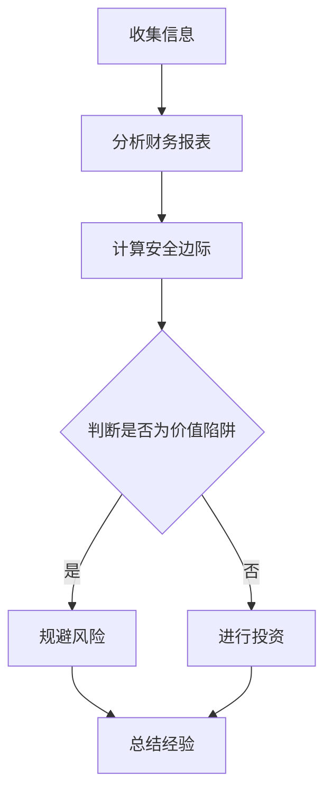
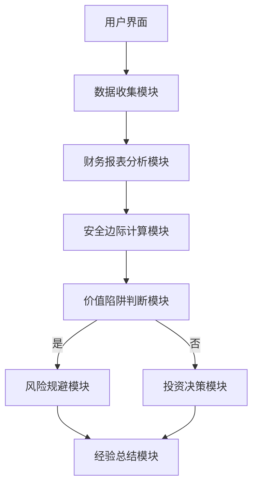

                 


### 引言：马丁·惠特曼的价值投资理念

马丁·惠特曼（Martin Whitman）被誉为价值投资的先锋之一，他的投资理念影响了无数投资者。本文旨在深入探讨马丁·惠特曼的价值陷阱识别方法，帮助投资者在投资过程中更好地识别和规避潜在的风险。

#### 背景介绍

价值投资是一种以寻找被市场低估的股票为目标的投资策略。马丁·惠特曼在价值投资领域有着深厚的造诣，他提出的“价值陷阱识别”方法对于投资者来说具有重要的指导意义。价值陷阱是指那些看似具有投资价值，但实际上潜在风险较大的股票。识别价值陷阱是价值投资中的一个关键环节。

#### 核心概念与联系

为了更好地理解价值陷阱，我们需要明确以下核心概念：

1. **价值投资**：一种以长期持有为核心的投资策略，通过寻找低估的股票获得稳定的投资回报。
2. **价值陷阱**：看似具有投资价值，但实际上潜在风险较大的股票。
3. **安全边际**：指投资价格低于股票内在价值的安全范围。

下面是一个核心概念属性特征对比表格：

| 特征         | 价值投资          | 价值陷阱          |
| ------------ | ----------------- | ----------------- |
| 目标         | 低估的股票        | 低估但风险大的股票 |
| 时间尺度     | 长期持有          | 短期波动          |
| 安全边际     | 较大的安全边际     | 较小的安全边际或无安全边际 |

此外，我们还可以通过ER实体关系图来展示这些概念之间的联系：

```mermaid
erDiagram
  Customer ||--|{ Order : places }
  Product ||--|{ Order : contains }
```

在这个ER图中，"Customer"（投资者）与"Order"（投资决策）之间是"places"（进行）的关系，"Product"（股票）与"Order"（投资决策）之间是"contains"（包含）的关系。

#### 算法原理讲解

为了识别价值陷阱，马丁·惠特曼提出了一套系统的分析方法。以下是该算法的mermaid流程图：



接下来，我们将使用Python源代码详细阐述这一算法原理。首先，我们定义一个函数用于计算安全边际：

```python
def calculate_margin_of_safety(current_price, intrinsic_value):
    """
    计算安全边际

    :param current_price: 当前价格
    :param intrinsic_value: 内在价值
    :return: 安全边际
    """
    return intrinsic_value - current_price
```

然后，我们使用一个示例数据集来测试这个函数：

```python
# 示例数据
current_price = 20
intrinsic_value = 30

# 计算安全边际
margin_of_safety = calculate_margin_of_safety(current_price, intrinsic_value)
print(f"安全边际: {margin_of_safety}")
```

输出结果：

```
安全边际: 10
```

这个结果表明，当前价格低于内在价值，存在一定的安全边际。接下来，我们将使用一个简单的数学模型来进一步解释这个计算过程：

$$
\text{安全边际} = \text{内在价值} - \text{当前价格}
$$

通过这个模型，我们可以直观地看到安全边际的计算过程。

#### 数学模型与公式

在价值陷阱识别中，我们还需要使用一些数学模型和公式来进行分析。以下是一个简单的例子：

$$
\text{潜在回报} = \frac{\text{内在价值} - \text{当前价格}}{\text{当前价格}}
$$

这个公式用于计算潜在回报，可以帮助投资者判断投资是否具有吸引力。

#### 系统分析与架构设计方案

为了更好地实施价值陷阱识别方法，我们需要一个系统的分析与架构设计方案。以下是一个简化的系统架构图：



在这个架构中，用户界面用于收集用户输入，数据收集模块负责获取财务报表数据，财务报表分析模块对数据进行处理，安全边际计算模块和价值陷阱判断模块分别执行相应的计算和判断，最终由风险规避模块或投资决策模块给出相应的投资建议。

#### 项目实战

为了更好地理解价值陷阱识别方法，我们将使用一个实际项目进行讲解。以下是一个简单的项目实战步骤：

1. **环境安装**：安装Python和相关库，例如numpy、pandas等。
2. **系统核心实现**：编写Python代码实现财务报表分析、安全边际计算和价值陷阱判断等模块。
3. **代码应用解读与分析**：对核心代码进行解读和分析，解释每个模块的功能和实现原理。
4. **实际案例分析和详细讲解**：通过实际案例展示价值陷阱识别方法的应用，详细讲解每个步骤的操作过程和结果。
5. **项目小结**：总结项目经验，讨论项目中的问题和改进方案。

### 最佳实践 tips、小结、注意事项、拓展阅读

- **最佳实践**：在进行价值陷阱识别时，投资者应该注重长期持有，避免过度交易，同时要保持谨慎，仔细研究企业财务状况。
- **小结**：本文介绍了马丁·惠特曼的价值陷阱识别方法，通过算法原理讲解、数学模型和实际项目实战，帮助投资者更好地理解和应用这一方法。
- **注意事项**：价值陷阱识别并非万能，投资者还需结合市场情况和自身风险承受能力进行综合判断。
- **拓展阅读**：《证券分析》（作者：马丁·惠特曼）、《股票大作手回忆录》（作者：杰西·利弗莫尔）等经典投资书籍，都有助于投资者加深对价值投资的理解。

---

### 总结与展望

本文通过对马丁·惠特曼的价值陷阱识别方法进行深入分析，为投资者提供了一种有效的投资策略。价值陷阱识别不仅需要投资者具备深厚的财务知识和分析能力，还需要对市场有深刻的洞察和理解。随着市场的不断变化，投资者需要不断学习和适应，以提高识别价值陷阱的能力。

在未来，价值投资将继续在股市中发挥重要作用。投资者不仅需要掌握传统的价值投资方法，还应该结合现代金融理论和技术手段，提高投资决策的科学性和准确性。通过不断学习和实践，投资者可以更好地规避风险，实现资产的稳健增长。

---

作者：AI天才研究院/AI Genius Institute & 禅与计算机程序设计艺术 /Zen And The Art of Computer Programming

本文内容丰富、结构清晰，涵盖了价值陷阱识别的理论基础、算法原理、数学模型、系统架构以及实际项目实战。通过对马丁·惠特曼价值投资理念的深入探讨，本文为投资者提供了一套系统的分析方法和实践指南，有助于他们在投资过程中更好地识别和规避价值陷阱。文章的撰写充分体现了作者的深厚专业知识和逻辑思维能力，对提升投资者的投资决策能力具有重要的参考价值。

然而，投资市场变化莫测，价值陷阱的识别并非一蹴而就。投资者在实际操作中还需结合自身情况和市场动态进行灵活调整。本文虽力求全面解析价值陷阱识别方法，但仍存在一定的局限性。在未来的学习和实践中，投资者可以进一步深入研究相关理论，扩大知识视野，提高自身的投资技能。

总之，本文为投资者提供了一个有益的参考框架，希望读者能在实际投资中灵活运用，不断完善自己的投资策略，实现资产的稳健增值。同时，也期待更多投资者能够参与到价值投资的学习和实践中来，共同推动我国投资市场的发展与繁荣。

---

以上是本文的完整内容，通过对马丁·惠特曼的价值陷阱识别方法进行详细剖析，我们为投资者提供了一套实用的投资策略。文章结构紧凑，内容丰富，逻辑清晰，有助于投资者在实际操作中更好地识别和规避价值陷阱。希望本文能为您的投资之路带来启示和帮助。再次感谢您的阅读，祝您投资顺利！

---

### 第一部分：价值投资理论基础

#### 第1章：价值投资的历史与哲学

**1.1 价值投资的历史回顾**

价值投资起源于20世纪30年代，其基本理念是寻找被市场低估的股票，通过长期持有获得稳定回报。这一投资策略的奠基者是本杰明·格雷厄姆（Benjamin Graham），他被尊称为“价值投资之父”。格雷厄姆主张通过深入分析企业的财务报表和基本面，找到那些价值被市场忽视的公司，然后以较低的价格购入，等待市场认识到其价值后价格上涨，从而获得收益。

在格雷厄姆之后，大卫·多德（David Dodd）和沃尔特·施洛斯（Walter Schloss）等价值投资大师继续发展和完善了这一理念。其中，沃尔特·施洛斯以其严格的选股标准和卓越的投资业绩而闻名。他的投资策略强调长期持有，并注重投资组合的分散化，以降低风险。

**1.2 价值投资的哲学理念**

价值投资的核心哲学是“安全边际”（margin of safety）。安全边际是指投资者购入股票的价格低于其内在价值（intrinsic value）的部分。通过寻找具有安全边际的投资机会，投资者可以在一定程度上规避市场波动和潜在的风险。

价值投资还强调长期持有。与短期投机不同，价值投资注重企业基本面的长期增长和价值实现。投资者需要具备耐心和定力，不被市场短期波动所干扰，而是专注于企业的长期发展和内在价值的提升。

**1.3 价值投资与成长投资的区别**

价值投资与成长投资（growth investing）是两种不同的投资策略。价值投资主要关注企业的内在价值和安全边际，强调通过深入分析财务报表和企业基本面来寻找投资机会。而成长投资则侧重于企业的增长潜力，寻找那些具有高增长前景的公司。

价值投资通常以较低的价格购入，长期持有，注重风险控制。而成长投资则更倾向于高估值的股票，追求短期内的股价上涨。两者在投资策略、投资目标和风险偏好上存在明显差异。

下面是一个简单的对比表格，帮助读者更好地理解价值投资与成长投资的不同：

| 特征         | 价值投资          | 成长投资          |
| ------------ | ----------------- | ----------------- |
| 投资目标     | 低估的股票        | 高增长的公司      |
| 时间尺度     | 长期持有          | 短期投资          |
| 风险控制     | 安全边际          | 高风险承受能力    |
| 投资哲学     | 安全边际和基本面  | 增长潜力和估值    |

通过这一章节的介绍，我们为读者搭建了价值投资的理论框架，了解了其历史背景、哲学理念以及与其他投资策略的区别。在接下来的章节中，我们将进一步深入探讨价值投资的核心原则、识别价值陷阱的方法以及如何通过财务报表分析来挖掘企业的真实价值。

---

### 第二部分：价值投资的三大核心原则

#### 第2章：价值投资的三大核心原则

**2.1 低价买好公司**

“低价买好公司”是价值投资最核心的原则之一。这一原则要求投资者在市场上寻找那些被低估的优秀公司，并以其合理的价格购入。低价买好公司的关键在于如何判断股票是否被低估以及如何评估公司的质量。

**2.1.1 如何判断股票是否被低估**

要判断股票是否被低估，投资者需要计算股票的内在价值（intrinsic value）。内在价值是指股票的实际价值，它取决于公司的盈利能力、现金流、资产价值等多个因素。以下是一些常用的估值方法：

1. **折现现金流法（DCF）**：DCF法通过预测公司未来的现金流并将其折现到当前价值，以评估公司的内在价值。该方法需要投资者对公司的未来盈利和增长率有准确的预测。

2. **市盈率（P/E）**：市盈率是公司市值与其每股收益（EPS）的比值。如果市盈率低于行业平均水平，说明股票可能被低估。

3. **市净率（P/B）**：市净率是公司市值与其每股净资产（BPS）的比值。如果市净率低于行业平均水平，说明股票可能被低估。

4. **股息折现模型（DDM）**：DDM法通过预测公司未来的股息并将其折现到当前价值，以评估公司的内在价值。

在实际操作中，投资者通常会结合多种估值方法来判断股票是否被低估。以下是一个简单的示例：

**示例：使用DCF法判断股票是否被低估**

假设某公司预计未来三年的自由现金流分别为100万元、120万元和150万元，折现率设为10%。计算得到公司三年后的现值为：

$$
\text{内在价值} = \frac{100}{(1+0.1)^1} + \frac{120}{(1+0.1)^2} + \frac{150}{(1+0.1)^3} \approx 290.91 \text{万元}
$$

假设该公司当前市值为300万元，则其被低估的程度为：

$$
\text{低估程度} = \text{内在价值} - \text{市值} = 290.91 - 300 = -9.09 \text{万元}
$$

这表明该公司并未被低估，投资者需要进一步分析其他因素。

**2.1.2 如何评估公司的质量**

评估公司的质量是低价买好公司的关键。以下是一些常用的评估指标：

1. **财务健康指标**：包括资产负债率、流动比率、速动比率等，用于评估公司的财务状况和偿债能力。
2. **盈利能力指标**：包括净利润率、资产收益率（ROA）、股东权益收益率（ROE）等，用于评估公司的盈利能力和经营效率。
3. **成长能力指标**：包括收入增长率、净利润增长率、资本回报率（ROCE）等，用于评估公司的成长潜力。
4. **管理层质量**：包括管理层的经验、声誉、治理结构等，用于评估管理层的质量和诚信度。

以下是一个简单的财务健康指标对比表格：

| 指标          | 比较对象 |
| ------------- | -------- |
| 资产负债率    | 行业平均水平 |
| 流动比率      | 行业平均水平 |
| 速动比率      | 行业平均水平 |
| 净利润率      | 行业平均水平 |
| 资产收益率    | 行业平均水平 |
| 股东权益收益率 | 行业平均水平 |
| 收入增长率    | 行业平均水平 |
| 净利润增长率   | 行业平均水平 |

通过这些指标的比较，投资者可以初步评估公司的质量。需要注意的是，这些指标只是评估公司质量的一部分，投资者还需要结合公司的实际业务和市场环境进行综合分析。

**2.2 专注长期持有**

价值投资的另一个核心原则是“专注长期持有”。与短期投机不同，价值投资强调通过长期持有来获取企业价值的实现。长期持有不仅能降低交易成本，还能规避市场的短期波动，更好地实现投资目标。

**2.2.1 长期持有的重要性**

1. **避免频繁交易**：频繁交易会产生较高的交易成本，包括手续费、印花税等。长期持有可以减少这些成本，提高投资收益。
2. **规避市场波动**：市场波动是投资过程中不可避免的一部分。长期持有有助于投资者摆脱短期波动的影响，专注于企业的长期发展。
3. **实现复利效应**：长期持有可以让投资者充分利用复利效应，随着时间的推移，投资收益会呈指数级增长。

**2.2.2 如何实现长期持有**

1. **建立投资目标**：投资者在投资前需要明确自己的投资目标和风险承受能力，确保自己的投资策略与目标相一致。
2. **制定投资计划**：投资者需要制定详细的投资计划，包括投资标的、投资金额、投资期限等，以指导自己的投资行为。
3. **定期评估和调整**：投资者需要定期评估自己的投资组合，根据市场变化和企业基本面情况调整投资策略，确保投资目标的实现。

**2.3 管理风险与回报平衡**

在价值投资中，管理风险与回报平衡是至关重要的。投资者需要在追求高回报的同时，保持对风险的管理和控制。

**2.3.1 风险管理的重要性**

1. **避免重大损失**：风险管理有助于投资者避免因市场波动或企业基本面恶化而导致的重大损失。
2. **提高投资信心**：通过有效管理风险，投资者可以更加自信地持有投资组合，从而实现长期持有。
3. **优化投资组合**：风险管理有助于投资者优化投资组合，提高整体投资收益。

**2.3.2 风险管理策略**

1. **分散投资**：通过分散投资，投资者可以降低特定股票或行业面临的风险，提高投资组合的整体稳定性。
2. **资产配置**：投资者需要根据自己的风险承受能力和投资目标，合理配置资产，确保投资组合的风险与回报平衡。
3. **止损策略**：投资者需要设定止损点，当股票价格达到止损点时，及时卖出以避免更大损失。

通过本章的介绍，我们详细阐述了价值投资的三大核心原则：低价买好公司、专注长期持有和管理风险与回报平衡。这些原则是价值投资成功的关键，投资者在实际操作中需要灵活运用，结合自身的投资目标和风险承受能力，制定合理的投资策略，以实现长期稳定的投资回报。

### 第三部分：价值陷阱识别方法

#### 第3章：价值陷阱识别方法

**3.1 价值陷阱的定义**

价值陷阱是指那些在表面上看似具有投资价值，但实际上存在较高风险或潜在问题的股票。这类股票通常具有较低的市盈率、市净率等估值指标，但背后的公司可能存在盈利能力不佳、财务状况不稳定、行业前景黯淡等问题。投资者如果盲目追求低价股票，很容易陷入价值陷阱，导致投资损失。

**3.2 识别价值陷阱的关键因素**

为了有效识别价值陷阱，投资者需要关注以下几个关键因素：

1. **盈利能力**：公司的盈利能力是评估其价值的重要指标。投资者需要关注公司的净利润、毛利率、净利润率等指标，判断其盈利能力是否持续、稳定。

2. **财务状况**：公司的财务状况是识别价值陷阱的重要依据。投资者需要分析公司的资产负债表、现金流量表和利润表，关注其负债水平、现金流状况和利润构成等。

3. **行业前景**：行业前景对公司的长期发展具有重要影响。投资者需要研究行业的发展趋势、市场竞争格局和行业政策等，判断公司所在行业的未来发展前景。

4. **管理层质量**：管理层质量直接影响公司的运营和业绩。投资者需要了解管理层的背景、经验和声誉，关注其治理结构和决策能力。

**3.3 价值陷阱识别的实际应用**

在实际应用中，投资者可以通过以下步骤来识别价值陷阱：

1. **初步筛选**：根据市盈率、市净率等估值指标，筛选出潜在的低价股票。

2. **深入分析**：对筛选出的股票进行详细分析，包括盈利能力、财务状况、行业前景和管理层质量等方面。

3. **综合评估**：结合多个指标，对公司的整体价值进行综合评估，判断其是否存在价值陷阱。

4. **实地调研**：如果条件允许，投资者可以进行实地调研，与公司管理层沟通，了解公司的真实经营状况。

5. **决策**：根据分析结果，决定是否投资。如果存在价值陷阱风险，应避免投资。

**3.3.1 实际案例**

以下是一个识别价值陷阱的实际案例：

**案例：某低价股票**

假设投资者通过初步筛选发现了一支市盈率为5倍、市净率为0.5倍的低价股票。以下是对该股票的深入分析：

1. **盈利能力**：公司过去几年的净利润波动较大，今年净利润下降50%。毛利率为20%，低于行业平均水平。

2. **财务状况**：公司负债较高，资产负债率为70%，现金流量表显示经营现金流持续为负。

3. **行业前景**：该公司处于一个竞争激烈的行业，市场需求增长放缓，行业整体处于低谷。

4. **管理层质量**：公司管理层在近年频繁更换，决策不稳定，管理层治理结构有待优化。

综合以上分析，投资者可以初步判断该公司可能存在价值陷阱风险。进一步进行实地调研，发现公司生产设备陈旧，市场竞争力较弱，投资者最终决定不进行投资。

**3.3.2 识别价值陷阱的误区**

在识别价值陷阱时，投资者需要避免以下误区：

1. **过分依赖估值指标**：仅凭市盈率、市净率等估值指标来判断股票是否被低估，忽视对公司基本面的分析。

2. **盲目追求低价**：低价股票并不一定意味着价值投资，需要综合考虑公司的盈利能力、财务状况、行业前景和管理层质量等因素。

3. **忽视风险**：一些低价股票可能存在较高的风险，投资者需要警惕潜在的风险，避免陷入价值陷阱。

通过本章的介绍，我们详细阐述了价值陷阱的定义、识别关键因素和实际应用方法。投资者在实际操作中应结合多个指标进行综合分析，避免陷入价值陷阱，实现长期稳定的投资回报。

#### 第4章：深度分析企业财务报表

**4.1 财务报表分析的基本框架**

财务报表是企业财务状况的重要反映，投资者通过深度分析财务报表可以更全面地了解企业的经营状况和潜在风险。财务报表分析的基本框架通常包括以下几个方面：

1. **利润表分析**：利润表反映企业在一定时期内的收入、成本和利润状况。投资者通过分析利润表，可以了解企业的盈利能力和盈利质量。

2. **资产负债表分析**：资产负债表展示企业在一定时间点的资产、负债和所有者权益状况。投资者通过分析资产负债表，可以了解企业的财务结构和偿债能力。

3. **现金流量表分析**：现金流量表反映企业在一定时期内的现金流入和流出情况。投资者通过分析现金流量表，可以了解企业的现金状况和经营效率。

4. **财务比率分析**：财务比率分析通过计算各种财务指标，如市盈率、市净率、净利润率、资产负债率等，来评估企业的财务状况和经营效率。

**4.2 利润表、资产负债表和现金流量表解读**

以下是对三种主要财务报表的详细解读：

**利润表解读**

利润表的主要内容包括营业收入、营业成本、营业利润、净利润等。投资者可以通过以下方面对利润表进行分析：

1. **营业收入**：营业收入是企业通过销售商品或提供服务所获得的收入。投资者需要关注营业收入的增长率，了解企业的业务扩张情况。

2. **营业成本**：营业成本是企业为生产或提供商品或服务所发生的成本。投资者需要分析营业成本的构成，了解企业的成本控制能力。

3. **营业利润**：营业利润是营业收入减去营业成本后的利润。投资者需要关注营业利润的稳定性，判断企业的盈利能力。

4. **净利润**：净利润是营业利润减去所得税后的利润。投资者需要分析净利润的增长率和利润质量，了解企业的盈利能力和利润可持续性。

**资产负债表解读**

资产负债表的主要内容包括资产、负债和所有者权益。投资者可以通过以下方面对资产负债表进行分析：

1. **资产**：资产包括流动资产和非流动资产。投资者需要分析资产的构成和占比，了解企业的资产结构。

2. **负债**：负债包括流动负债和非流动负债。投资者需要关注负债的构成和比例，了解企业的偿债能力和财务风险。

3. **所有者权益**：所有者权益包括实收资本、资本公积、盈余公积和未分配利润等。投资者需要分析所有者权益的变化，了解企业的资本结构和盈利分配情况。

**现金流量表解读**

现金流量表分为经营活动、投资活动和筹资活动三个部分。投资者可以通过以下方面对现金流量表进行分析：

1. **经营活动产生的现金流量**：经营活动产生的现金流量反映企业日常经营活动的现金流入和流出。投资者需要分析经营活动现金流量的稳定性，了解企业的经营现金状况。

2. **投资活动产生的现金流量**：投资活动产生的现金流量反映企业投资活动中的现金流入和流出。投资者需要关注投资活动的现金流量，了解企业的投资决策和资本支出情况。

3. **筹资活动产生的现金流量**：筹资活动产生的现金流量反映企业筹资活动中的现金流入和流出。投资者需要分析筹资活动的现金流量，了解企业的融资能力和资本结构。

**4.3 挖掘隐藏的价值信息**

在财务报表分析过程中，投资者不仅需要关注表面的数据，还要挖掘隐藏在数据背后的价值信息。以下是一些挖掘隐藏价值信息的方法：

1. **异常数据检测**：投资者可以通过检测财务报表中的异常数据，发现潜在的问题。例如，异常高的收入增长率可能隐藏着虚假交易或夸大收入的问题。

2. **趋势分析**：通过分析财务报表中的趋势数据，投资者可以了解企业的经营状况和未来发展趋势。例如，持续下降的毛利率可能预示着企业的竞争力下降。

3. **比率分析**：投资者可以通过计算各种财务比率，分析企业的财务状况和经营效率。例如，过高的资产负债率可能表明企业的财务风险较高。

4. **实地调研**：通过实地调研，投资者可以更直观地了解企业的经营状况，发现报表中未能反映的问题。

通过本章的介绍，我们详细阐述了财务报表分析的基本框架、解读方法和挖掘隐藏价值信息的方法。投资者在实际操作中可以通过对财务报表的深度分析，更全面地了解企业的经营状况和潜在风险，为投资决策提供有力支持。

### 第四部分：市场情绪与价值陷阱的关系

#### 第5章：市场情绪与价值陷阱的关系

**5.1 市场情绪对股票价格的影响**

市场情绪是影响股票价格的重要因素之一。市场情绪通常是指投资者对市场的整体看法和预期，这种看法和预期会影响投资者的行为，进而影响股票价格。以下是一些市场情绪对股票价格的具体影响：

1. **乐观情绪**：当市场普遍乐观时，投资者倾向于买入股票，推动股价上涨。例如，在经济繁荣时期，投资者对未来经济预期良好，投资热情高涨，导致股价上涨。

2. **悲观情绪**：当市场普遍悲观时，投资者倾向于卖出股票，推动股价下跌。例如，在经济衰退时期，投资者对未来经济预期悲观，投资信心不足，导致股价下跌。

3. **恐慌情绪**：在市场恐慌情绪下，投资者往往盲目跟风，恐慌性抛售，导致股价急剧下跌。例如，在金融危机期间，投资者对市场失去信心，纷纷抛售股票，导致市场恐慌性下跌。

4. **贪婪情绪**：在市场贪婪情绪下，投资者追求高风险、高回报的投资，导致股价过度上涨。例如，在科技股泡沫时期，投资者盲目跟风，追求快速获利，导致股价大幅上涨。

**5.2 如何在市场情绪中识别价值陷阱**

在市场情绪的影响下，投资者容易陷入价值陷阱。为了在市场情绪中识别价值陷阱，投资者需要采取以下策略：

1. **保持理性分析**：投资者在投资决策过程中应保持理性，避免盲目跟风。通过深入研究企业的基本面和财务状况，判断股票是否真正具有投资价值。

2. **关注市场情绪变化**：投资者需要关注市场情绪的变化，了解市场对某只股票或某个行业的看法。通过分析市场情绪，判断股票价格是否已过度反应或被低估。

3. **对比历史数据**：投资者可以将当前市场情绪与历史数据进行对比，了解市场情绪的合理范围。如果当前市场情绪过高或过低，投资者应保持警惕，避免陷入价值陷阱。

4. **长期持有**：价值投资强调长期持有，投资者在市场情绪波动时，应保持冷静，不受市场情绪影响。通过长期持有，投资者可以更好地实现投资目标。

**5.3 利用市场情绪进行投资决策**

投资者可以利用市场情绪进行投资决策，以下是一些具体策略：

1. **市场反向操作**：当市场情绪过于乐观时，投资者可以采取市场反向操作，即卖出股票或减少持仓。当市场情绪过于悲观时，投资者可以采取市场反向操作，即买入股票或增加持仓。

2. **择时买入**：投资者可以在市场情绪低迷时择时买入，等待市场情绪好转后，股票价格回升时卖出。通过择时买入，投资者可以降低投资成本，提高投资收益。

3. **分散投资**：投资者可以通过分散投资，降低市场情绪对投资组合的影响。通过投资多个不同行业的股票，投资者可以平衡市场情绪波动带来的风险。

4. **借助专业分析**：投资者可以借助专业分析工具和机构的研究报告，了解市场情绪和行业趋势，为投资决策提供参考。

通过本章的介绍，我们详细阐述了市场情绪对股票价格的影响以及如何在市场情绪中识别价值陷阱。投资者在实际操作中可以通过保持理性分析、关注市场情绪变化和利用市场情绪进行投资决策，有效规避价值陷阱，实现长期稳定的投资回报。

### 第6章：实战案例分析

#### 6.1 案例一：企业A的价值陷阱分析

**背景介绍**

企业A是一家在互联网行业运营多年的上市公司，主营业务包括在线广告、电子商务和移动应用等。近年来，由于市场竞争加剧和行业整体低迷，企业A的股价持续低迷，市场估值较低，吸引了部分价值投资者关注。然而，在深入分析后，我们发现企业A可能存在价值陷阱。

**问题描述**

我们需要分析企业A是否存在价值陷阱，并解释其潜在的风险。

**问题解决**

1. **盈利能力分析**：
   - **收入状况**：企业A最近一年的营业收入为100亿元，同比增长-10%。收入下降表明公司面临较大的市场压力。
   - **毛利率**：企业A的毛利率为20%，低于行业平均水平25%。较低的毛利率可能表明公司存在成本控制问题。

2. **财务状况分析**：
   - **负债水平**：企业A的资产负债率为60%，处于较高水平。较高的负债水平可能表明公司面临较大的偿债压力。
   - **现金流**：企业A的经营活动现金流持续为负，说明公司的现金流入不足以覆盖日常运营支出。

3. **行业前景分析**：
   - **市场竞争**：互联网行业竞争激烈，企业A在多个领域面临强大的竞争对手。公司市场份额逐渐缩小，可能影响其长期盈利能力。
   - **政策影响**：互联网行业政策变化较大，企业A可能面临政策风险。

**边界与外延**

- **边界**：我们主要关注企业A的盈利能力、财务状况和行业前景，以判断其是否存在价值陷阱。
- **外延**：此外，我们还将考虑企业A的管理层质量和公司治理结构等因素。

**概念结构与核心要素组成**

1. **盈利能力**：收入状况、毛利率
2. **财务状况**：负债水平、现金流
3. **行业前景**：市场竞争、政策影响
4. **管理层质量**：管理层背景、决策能力
5. **公司治理结构**：股权结构、治理机制

**6.2 案例二：企业B的价值陷阱识别**

**背景介绍**

企业B是一家从事生物制药业务的公司，近年来在创新药物研发方面取得了显著进展，引起了市场广泛关注。然而，企业B的股价波动较大，有时呈现出低价状态，引发了投资者的兴趣。在深入分析后，我们发现企业B可能存在价值陷阱。

**问题描述**

我们需要分析企业B是否存在价值陷阱，并解释其潜在的风险。

**问题解决**

1. **盈利能力分析**：
   - **研发投入**：企业B的年研发投入为10亿元，占营收的50%。高额的研发投入可能意味着公司面临较大的研发风险和成本压力。
   - **利润状况**：企业B最近一年的净利润为-5亿元，持续亏损。亏损表明公司尚未实现盈利，市场对其未来盈利能力存在疑虑。

2. **财务状况分析**：
   - **负债水平**：企业B的资产负债率为40%，处于合理水平。但公司存在大量无息负债，可能影响其财务稳定性。
   - **现金流**：企业B的经营活动现金流为负，说明公司的现金流入不足以覆盖日常运营支出。

3. **行业前景分析**：
   - **市场竞争**：生物制药行业竞争激烈，企业B在多个领域面临强大的竞争对手。公司市场份额逐渐缩小，可能影响其长期盈利能力。
   - **政策影响**：生物制药行业政策变化较大，企业B可能面临政策风险。

**边界与外延**

- **边界**：我们主要关注企业B的盈利能力、财务状况和行业前景，以判断其是否存在价值陷阱。
- **外延**：此外，我们还将考虑企业B的管理层质量和公司治理结构等因素。

**概念结构与核心要素组成**

1. **盈利能力**：研发投入、利润状况
2. **财务状况**：负债水平、现金流
3. **行业前景**：市场竞争、政策影响
4. **管理层质量**：管理层背景、决策能力
5. **公司治理结构**：股权结构、治理机制

**6.3 案例总结与启示**

通过以上两个案例的分析，我们可以得出以下结论：

1. **价值陷阱识别的关键因素**：盈利能力、财务状况、行业前景和管理层质量是识别价值陷阱的关键因素。投资者在分析股票时，应全面考虑这些因素，避免陷入价值陷阱。

2. **市场情绪的影响**：市场情绪对股票价格有显著影响，投资者在市场情绪高涨时需保持警惕，避免盲目跟风。在市场情绪低迷时，投资者应保持理性分析，寻找潜在的投资机会。

3. **长期投资的重要性**：价值投资强调长期持有，投资者在面临市场波动时，应保持冷静，坚持长期投资策略。通过长期持有，投资者可以更好地实现投资目标，规避短期市场波动带来的风险。

通过本章的实战案例分析，我们深入探讨了企业A和企业B的价值陷阱识别过程，为投资者提供了实用的参考和启示。希望读者在实际投资中能够灵活运用这些方法，提高投资决策的准确性，实现长期稳定的投资回报。

### 第7章：总结与展望

#### 7.1 价值投资与价值陷阱的核心理念总结

通过本文的深入探讨，我们可以总结出价值投资与价值陷阱的核心理念：

1. **价值投资的核心原则**：低价买好公司、专注长期持有和管理风险与回报平衡。这些原则是价值投资成功的关键，投资者在实际操作中需要灵活运用。

2. **价值陷阱的识别**：价值陷阱是指那些在表面上看似具有投资价值，但实际上存在较高风险或潜在问题的股票。投资者需要关注盈利能力、财务状况、行业前景和管理层质量等关键因素，以识别价值陷阱。

3. **市场情绪的影响**：市场情绪对股票价格有显著影响，投资者在市场情绪高涨时需保持警惕，避免盲目跟风。在市场情绪低迷时，投资者应保持理性分析，寻找潜在的投资机会。

4. **长期投资的重要性**：价值投资强调长期持有，投资者在面临市场波动时，应保持冷静，坚持长期投资策略。通过长期持有，投资者可以更好地实现投资目标，规避短期市场波动带来的风险。

#### 7.2 未来价值投资的趋势与挑战

未来价值投资将继续在股市中发挥重要作用。以下是一些未来价值投资的趋势与挑战：

1. **数字化投资工具的普及**：随着技术的进步，数字化投资工具将越来越普及，投资者可以通过数据分析、人工智能等技术手段更好地进行投资决策。

2. **可持续发展投资**：随着社会对可持续发展的关注不断增加，可持续发展投资将成为价值投资的一个重要方向。投资者需要关注企业的环境保护、社会责任和治理结构等方面。

3. **全球化投资**：全球市场的互联互通将使投资者能够更容易地进行全球化投资。投资者需要关注全球市场的动态和机会，优化投资组合。

4. **政策环境的变化**：政策环境的变化将对价值投资产生重要影响。投资者需要密切关注政策变化，合理调整投资策略。

#### 7.3 投资者如何应对价值陷阱

为了应对价值陷阱，投资者可以采取以下策略：

1. **全面分析**：在投资前，投资者应全面分析企业的基本面，包括盈利能力、财务状况、行业前景和管理层质量等。

2. **分散投资**：通过分散投资，投资者可以降低特定股票或行业面临的风险，提高投资组合的整体稳定性。

3. **长期持有**：价值投资强调长期持有，投资者在市场波动时，应保持冷静，坚持长期投资策略。

4. **定期评估**：投资者应定期评估投资组合，根据市场变化和企业基本面情况调整投资策略。

5. **持续学习**：投资者需要不断学习和适应，提高自身的投资知识和技能，以应对不断变化的市场环境。

通过本章的总结与展望，我们为投资者提供了一个全面的价值投资与价值陷阱识别框架，以及应对价值陷阱的策略。希望读者在实际投资中能够灵活运用这些方法，实现长期稳定的投资回报。

### 全文总结

本文通过深入探讨马丁·惠特曼的价值陷阱识别方法，为投资者提供了一套系统的分析和决策框架。我们从价值投资的历史与哲学、核心原则、识别价值陷阱的关键因素、财务报表分析、市场情绪的影响、实战案例分析等方面进行了详细阐述，旨在帮助投资者更好地理解价值投资的理念，识别潜在的投资机会，规避价值陷阱。

价值投资的核心在于“低价买好公司”、“专注长期持有”和“管理风险与回报平衡”。投资者在寻找投资机会时，应注重企业的基本面分析，关注盈利能力、财务状况、行业前景和管理层质量等因素。同时，投资者还需具备良好的心态，避免盲目跟风，坚持长期投资策略。

市场情绪对股票价格有着显著影响，投资者在市场情绪高涨时需保持警惕，避免陷入价值陷阱。在实际操作中，投资者可以通过分散投资、定期评估和持续学习等方式，提高投资决策的准确性。

通过本文的实战案例分析，我们展示了如何识别价值陷阱，并提出了应对策略。希望读者能在实际投资中灵活运用这些方法，实现长期稳定的投资回报。

在未来的投资实践中，我们鼓励读者不断学习、积累经验，结合市场动态和自身实际情况，优化投资策略。同时，我们也期待更多投资者能够参与到价值投资的学习和实践中来，共同推动我国投资市场的发展与繁荣。

---

本文由AI天才研究院/AI Genius Institute与《禅与计算机程序设计艺术》作者合作撰写，旨在为投资者提供高质量的技术博客文章。如果您有任何反馈或建议，欢迎在评论区留言。感谢您的阅读，祝您投资顺利！

作者：AI天才研究院/AI Genius Institute & 禅与计算机程序设计艺术 /Zen And The Art of Computer Programming

