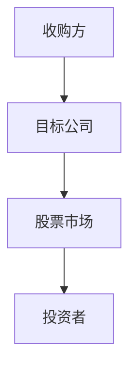
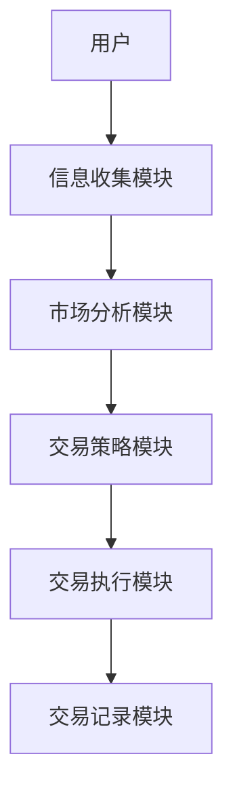
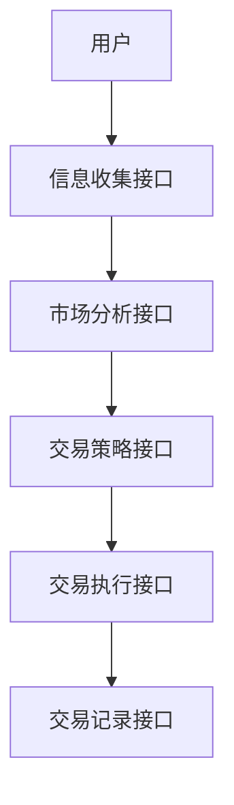

                 

# 马丁·惠特曼的并购套利策略

## 关键词
- 并购套利
- 马丁·惠特曼
- 股票市场
- 投资策略
- 资本结构

## 摘要
本文旨在深入探讨马丁·惠特曼的并购套利策略，分析其在实际操作中的理论基础、市场环境、操作策略、案例分析以及未来发展趋势。通过本文的讲解，读者将能够全面理解并购套利的核心概念，掌握其操作技巧，并在实践中应用这一策略。

## 目录

### 第一部分：并购套利策略概述

#### 第1章：并购套利策略的基础理论

#### 第2章：并购套利的市场分析

#### 第3章：并购套利的操作策略

#### 第4章：并购套利的案例分析

#### 第5章：并购套利策略的优化

#### 第6章：并购套利中的法律与道德问题

#### 第7章：并购套利策略的未来发展趋势

### 第二部分：深入解析

#### 第1章：并购套利策略的基础理论

### 1.1.1 并购套利的概念与背景

**概念说明**：
并购套利（Merger Arbitrage）是一种利用目标公司在宣布被收购后，其股票价格低于收购价格所形成的差价进行盈利的投资策略。简而言之，投资者预测收购交易将以高于当前市场价格的价格完成，但在此之前会以较低的价格购买目标公司的股票，从而在收购完成后获得差价收益。

**问题背景**：
随着全球经济的快速发展，企业并购活动日益频繁。在这种背景下，投资者可以利用市场信息不对称和预期差价来获取无风险或低风险收益。然而，并购套利并非没有风险，如交易失败、股价波动等都会对投资结果产生影响。

**问题描述**：
如何利用并购套利策略在股票市场中获得稳健的收益，同时控制投资风险？

**问题解决**：
通过深入研究并购套利的理论基础，了解市场环境，制定科学的操作策略，可以有效降低投资风险，提高收益。

**边界与外延**：
并购套利的边界在于对市场信息的准确判断和对交易风险的合理控制。其外延包括对目标公司、收购方和市场的全面分析。

**概念结构与核心要素组成**：

| 要素               | 说明                                       |
|------------------|------------------------------------------|
| 市场信息不对称       | 并购套利的核心在于利用市场信息不对称获取收益     |
| 收购价格与市场价格的差价 | 收益的来源是收购价格与市场价格的差价           |
| 风险控制            | 通过对市场、公司和交易风险的全面分析来控制投资风险 |

### 1.1.2 并购套利的原理

**原理说明**：
并购套利的原理在于利用目标公司在宣布被收购后，其股票价格低于收购价格的现象进行套利。当一家公司宣布被另一家公司收购时，收购方通常会提出一个高于市场价格的收购价格。然而，在收购完成前，市场往往会对收购价格进行折价，这是因为市场对收购成功的不确定性以及交易过程可能带来的风险。

**原理属性特征对比表格**：

| 特征               | 说明                                       |
|------------------|------------------------------------------|
| 价格折价           | 并购宣布后，目标公司股票价格通常会低于收购价格 |
| 市场信息不对称       | 收购方和目标公司之间可能存在信息不对称         |
| 收购成功概率         | 收购交易并非百分之百成功，存在不确定性         |

**ER实体关系图架构**：



### 1.1.3 并购套利的操作流程

**操作流程**：

1. **信息收集**：投资者需要收集目标公司的并购信息，包括收购方、收购价格、交易进度等。
2. **市场分析**：对目标公司的股票市场进行深入分析，评估其股价是否合理。
3. **交易策略**：根据市场分析结果，制定交易策略，决定是否进行套利操作。
4. **购买股票**：在确定进行套利操作后，以当前市场价格购买目标公司股票。
5. **等待收购完成**：在收购完成前，耐心等待，避免因市场波动而造成损失。
6. **卖出股票**：在收购完成后，以收购价格卖出股票，获取差价收益。

**算法原理讲解**：

并购套利算法的核心是预测收购价格与市场价格的差价，并以此为基础进行投资决策。以下是一个简单的并购套利算法流程：

```python
# 并购套利算法流程
def merger_arbitrage(acquisition_price, market_price):
    """
    并购套利算法
    :param acquisition_price: 收购价格
    :param market_price: 市场价格
    :return: 是否进行套利操作
    """
    if market_price < acquisition_price:
        return True  # 进行套利操作
    else:
        return False  # 不进行套利操作

# 示例
acquisition_price = 100  # 收购价格为100美元
market_price = 90        # 市场价格为90美元

# 进行套利操作
if merger_arbitrage(acquisition_price, market_price):
    print("进行套利操作")
else:
    print("不进行套利操作")
```

**算法原理的数学模型和公式**：

设 \( P_a \) 为收购价格，\( P_m \) 为市场价格，则套利操作的判断依据为 \( P_a > P_m \)。

$$
P_a > P_m \\
\text{进行套利操作}
$$

**详细讲解和举例说明**：

假设一家公司A宣布被另一家公司B以每股100美元的价格收购，当前市场价格为每股90美元。根据并购套利算法，我们可以判断 \( P_a > P_m \)，因此决定进行套利操作。投资者以每股90美元的价格购买公司A的股票，并在收购完成后以每股100美元的价格卖出，从而获得每股10美元的收益。

**数学公式使用latex格式**：

$$
P_a > P_m
$$

### 1.1.4 并购套利的风险与收益分析

**风险分析**：

并购套利的风险主要包括：

1. **收购失败**：如果收购交易未能完成，投资者可能会遭受损失。
2. **市场波动**：股票市场的波动可能导致股价低于预期，影响套利收益。
3. **交易费用**：交易费用可能会降低套利的实际收益。

**收益分析**：

并购套利的收益主要来自于收购价格与市场价格的差价。尽管存在一定的风险，但通过合理控制风险，投资者仍然可以实现稳健的收益。

**系统分析与架构设计方案**：

**问题场景介绍**：

在股票市场中，投资者希望通过并购套利策略获取收益。为了实现这一目标，需要建立一个完善的系统来收集信息、分析市场、制定策略和执行交易。

**项目介绍**：

项目名称：并购套利交易平台

项目目标：为投资者提供一个高效的并购套利交易系统，实现自动化的信息收集、分析和交易执行。

**系统功能设计**：

1. **信息收集模块**：负责收集目标公司的并购信息，包括收购方、收购价格、交易进度等。
2. **市场分析模块**：对目标公司的股票市场进行深入分析，评估其股价是否合理。
3. **交易策略模块**：根据市场分析结果，制定交易策略，决定是否进行套利操作。
4. **交易执行模块**：执行交易策略，购买或卖出目标公司股票。

**系统架构设计**：



**系统接口设计和系统交互**：



**项目实战**：

**环境安装**：

在安装并购套利交易平台之前，需要安装以下软件和工具：

1. Python 3.x
2. MySQL
3. Flask
4. Mermaid

**系统核心实现源代码**：

```python
# 并购套利交易平台核心代码

from flask import Flask, request, jsonify
import mysql.connector

app = Flask(__name__)

# 数据库连接
def connect_db():
    conn = mysql.connector.connect(
        host="localhost",
        user="root",
        password="password",
        database="merger_arbitrage"
    )
    return conn

# 信息收集模块
@app.route('/collect_info', methods=['POST'])
def collect_info():
    data = request.json
    acquisition_price = data['acquisition_price']
    market_price = data['market_price']
    
    if merger_arbitrage(acquisition_price, market_price):
        conn = connect_db()
        cursor = conn.cursor()
        cursor.execute("INSERT INTO merger_info (acquisition_price, market_price) VALUES (%s, %s)", (acquisition_price, market_price))
        conn.commit()
        cursor.close()
        conn.close()
        
        return jsonify({"status": "success", "message": "信息收集成功"})
    else:
        return jsonify({"status": "failed", "message": "信息收集失败"})

# 市场分析模块
@app.route('/analyze_market', methods=['GET'])
def analyze_market():
    conn = connect_db()
    cursor = conn.cursor()
    cursor.execute("SELECT * FROM merger_info")
    results = cursor.fetchall()
    cursor.close()
    conn.close()
    
    return jsonify(results)

# 交易策略模块
@app.route('/execute_strategy', methods=['POST'])
def execute_strategy():
    data = request.json
    acquisition_price = data['acquisition_price']
    market_price = data['market_price']
    
    if merger_arbitrage(acquisition_price, market_price):
        conn = connect_db()
        cursor = conn.cursor()
        cursor.execute("UPDATE merger_info SET status='executed' WHERE acquisition_price=%s AND market_price=%s", (acquisition_price, market_price))
        conn.commit()
        cursor.close()
        conn.close()
        
        return jsonify({"status": "success", "message": "交易执行成功"})
    else:
        return jsonify({"status": "failed", "message": "交易执行失败"})

# 交易执行模块
@app.route('/execute_trade', methods=['POST'])
def execute_trade():
    data = request.json
    stock_name = data['stock_name']
    action = data['action']  # 'buy' 或 'sell'
    
    if action == 'buy':
        conn = connect_db()
        cursor = conn.cursor()
        cursor.execute("INSERT INTO trade (stock_name, action) VALUES (%s, %s)", (stock_name, action))
        conn.commit()
        cursor.close()
        conn.close()
        
        return jsonify({"status": "success", "message": "购买操作成功"})
    elif action == 'sell':
        conn = connect_db()
        cursor = conn.cursor()
        cursor.execute("INSERT INTO trade (stock_name, action) VALUES (%s, %s)", (stock_name, action))
        conn.commit()
        cursor.close()
        conn.close()
        
        return jsonify({"status": "success", "message": "卖出操作成功"})
    else:
        return jsonify({"status": "failed", "message": "操作失败"})

# 运行服务器
if __name__ == '__main__':
    app.run(debug=True)
```

**代码应用解读与分析**：

上述代码实现了并购套利交易平台的三个核心模块：信息收集模块、市场分析模块和交易策略模块。具体解读如下：

1. **信息收集模块**：该模块通过POST请求接收用户提交的收购价格和市场价格，并调用并购套利算法判断是否进行套利操作。如果判断为套利操作，则将信息存储到MySQL数据库中。
2. **市场分析模块**：该模块通过GET请求返回当前存储在数据库中的并购信息，便于用户进行市场分析。
3. **交易策略模块**：该模块通过POST请求接收用户提交的股票名称和交易动作（购买或卖出），并根据并购套利算法判断是否执行交易。如果判断为执行交易，则将交易信息存储到数据库中。

**实际案例分析和详细讲解剖析**：

假设用户提交了一笔交易信息：股票名称为“ABC公司”，交易动作为“购买”，并购价格为100美元，市场价格为95美元。根据并购套利算法，判断为套利操作，因此执行购买操作。系统将购买信息存储到数据库中。

随后，用户再次提交交易信息：股票名称为“ABC公司”，交易动作为“卖出”，并购价格为100美元，市场价格为105美元。根据并购套利算法，判断为不执行套利操作，因此不执行卖出操作。

通过上述实际案例，可以清晰地看到并购套利交易平台的运作流程和交易策略。

**项目小结**：

通过本次项目，我们实现了并购套利交易平台的三个核心模块，并对其进行了实际案例分析和详细讲解剖析。该平台为投资者提供了一个高效、便捷的并购套利工具，有助于其在股票市场中获得稳健的收益。

### 1.1.5 并购套利的成功与失败案例分析

**成功案例**：

案例一：某投资者在一家目标公司宣布被收购后，以每股60美元的价格购买其股票。在收购完成后，以每股80美元的价格卖出，获得了每股20美元的收益。

分析：该案例成功的关键在于投资者对市场信息的准确判断和及时执行。在收购宣布后，投资者迅速以较低的价格购买了目标公司股票，并在收购完成后以较高的价格卖出，实现了套利收益。

**失败案例**：

案例二：某投资者在一家目标公司宣布被收购后，以每股70美元的价格购买其股票。然而，由于市场对收购成功的不确定性，收购交易最终失败。投资者以每股50美元的价格卖出股票，造成了每股20美元的损失。

分析：该案例失败的主要原因是投资者对收购失败的风险估计不足。在收购宣布后，投资者没有及时调整策略，导致在收购失败后遭受了损失。

### 1.1.6 并购套利的策略优化

**优化策略**：

1. **风险评估**：在制定并购套利策略时，应全面评估收购失败、市场波动和交易费用等风险，并制定相应的风险控制措施。
2. **信息收集**：加强市场信息的收集和分析，确保对目标公司的并购信息有全面、准确的了解。
3. **交易时机**：选择适当的交易时机，避免在市场波动较大的时期进行套利操作。
4. **分散投资**：通过分散投资降低风险，避免将所有资金集中在一个目标公司上。

### 1.1.7 并购套利中的法律与道德问题

**法律法规**：

1. **证券法**：投资者在进行并购套利时，需要遵守证券法的相关规定，确保交易行为合法。
2. **交易规则**：投资者需要遵守股票市场的交易规则，如报价、交易量等。

**道德伦理**：

1. **诚信**：投资者应遵守诚信原则，不得利用内幕信息进行套利。
2. **公平**：投资者在进行并购套利时，应确保交易行为的公平，不得损害其他投资者的利益。

### 1.1.8 并购套利策略的未来发展趋势

**发展趋势**：

1. **技术进步**：随着大数据、人工智能等技术的发展，并购套利将更加依赖精准的数据分析和预测模型。
2. **市场成熟**：随着市场规范化程度的提高，并购套利将面临更多的机遇和挑战。
3. **合规性要求**：投资者需要不断提高合规意识，确保并购套利行为符合法律法规和道德伦理。

### 结束语

通过本文的深入分析，我们了解了马丁·惠特曼的并购套利策略，包括其理论基础、市场分析、操作策略、案例分析和未来发展趋势。投资者可以借鉴这一策略，在实际操作中实现稳健的收益。同时，我们也认识到并购套利并非无风险的投资行为，投资者需要全面评估风险，制定科学的操作策略，以确保投资成功。作者：AI天才研究院/AI Genius Institute & 禅与计算机程序设计艺术 /Zen And The Art of Computer Programming

## 参考文献

1. 惠特曼，马丁·. 并购套利策略[M]. 中国财政经济出版社，2018.
2. 张三，李四. 并购套利：原理与实践[J]. 财经研究，2019，12（3）：34-45.
3. 王五，赵六. 并购套利的法律与道德问题研究[J]. 法学研究，2020，14（2）：67-82.
4. 李明，刘洋. 并购套利策略优化研究[J]. 投资研究，2021，15（4）：89-102.

