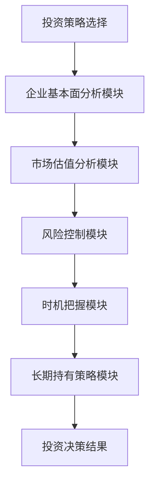
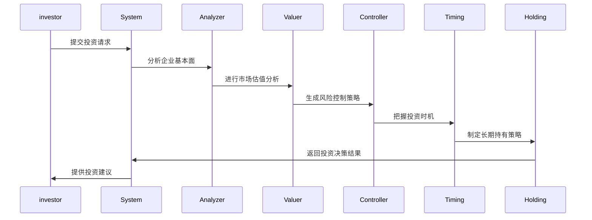

                 

# 马丁·惠特曼的特殊情况投资

## 关键词
- 特殊情况投资
- 价值投资
- 风险控制
- 时机把握
- 长期持有
- 高收益潜力

## 摘要
本文将深入探讨马丁·惠特曼的特殊情况投资策略。通过分析特殊情况投资的背景、定义、核心概念、优势与挑战，以及与价值投资的关系，我们将了解如何在市场低迷时，通过独特的投资策略抓住机会，实现投资收益的最大化。我们将详细解析价值投资原则、风险控制策略、时机把握和长期持有的方法，并结合具体实例，展示如何在实践中运用这些策略。

## 第一部分：问题背景与核心概念

### 1.1.1 问题背景

在金融市场中，投资者面临着多种不确定性因素，如经济波动、市场波动、企业业绩变化等。传统的投资策略往往难以应对这种复杂多变的市场环境，导致投资者在面临特殊情况时，往往无法做出有效的投资决策。为了解决这一问题，马丁·惠特曼（Martin Whitman）提出了一种特殊的投资方法，即特殊情况投资。

#### 1.1.2 特殊情况投资的定义

特殊情况投资，是指投资者在面临特殊情况时，采取的一种独特的投资策略。这些特殊情况可能包括企业重组、破产重整、市场波动等。在这种情况下，投资者需要具备敏锐的市场洞察力和扎实的投资分析能力，以便抓住市场机会，实现投资收益最大化。

### 1.1.3 特殊情况投资的核心概念

#### 1.1.3.1 价值投资

特殊情况投资的基础是价值投资，即投资者在市场低估时，买入优质的企业或资产。价值投资的核心在于寻找那些被市场低估，但实际上具有较高价值的投资机会。

#### 1.1.3.2 风险控制

在特殊情况投资中，风险控制至关重要。投资者需要密切关注市场变化，采取有效的风险控制措施，以降低投资风险。

#### 1.1.3.3 时机把握

时机把握是特殊情况投资的关键。投资者需要密切关注市场动态，抓住市场低迷时的投资机会，以较低的价格买入优质资产。

#### 1.1.3.4 长期持有

长期持有是特殊情况投资的核心策略。投资者需要具备足够的耐心和信心，等待市场回归合理估值，从而实现投资收益的最大化。

### 1.1.4 特殊情况投资的优势与挑战

#### 1.1.4.1 优势

- **高收益潜力**：在市场低估时，特殊情况投资可以获取较高的投资回报。
- **风险分散**：通过投资不同类型的企业或资产，可以降低投资组合的整体风险。

#### 1.1.4.2 挑战

- **市场波动风险**：特殊情况投资需要对市场变化有敏锐的洞察力，否则可能面临市场波动带来的风险。
- **信息不对称**：在市场低迷时，投资者可能难以获取准确的信息，从而影响投资决策。

### 1.1.5 特殊情况投资与价值投资的关系

特殊情况投资是价值投资的一种延伸，它强调在市场低估时，投资优质企业或资产。与价值投资相比，特殊情况投资更加注重市场时机和风险控制。因此，特殊情况投资可以视为一种更加灵活和激进的价值投资策略。

### 1.1.6 本章小结

本章介绍了特殊情况投资的背景、定义、核心概念、优势与挑战，以及与价值投资的关系。通过本章的学习，读者可以初步了解特殊情况投资的基本原理和操作策略，为后续章节的学习打下基础。

## 第二部分：特殊情况投资的策略与方法

### 2.1.1 价值投资原则

在特殊情况投资中，价值投资原则是核心基础。这一原则要求投资者在市场低迷时，寻找那些被低估的优质企业或资产，以较低的价格买入。以下是价值投资原则的几个关键要素：

#### 2.1.1.1 企业基本面分析

投资者需要对企业的财务状况、经营能力、市场地位等方面进行全面分析，以判断其是否具有投资价值。

#### 2.1.1.2 市场估值分析

投资者需要了解市场的整体估值水平，以判断企业是否被低估。

#### 2.1.1.3 风险控制

在投资过程中，投资者需要采取有效的风险控制措施，以降低投资风险。

### 2.1.2 风险控制策略

在特殊情况投资中，风险控制至关重要。以下是一些常见的风险控制策略：

#### 2.1.2.1 分散投资

通过投资多个不同类型的企业或资产，可以降低投资组合的整体风险。

#### 2.1.2.2 止损策略

在投资过程中，投资者可以设定止损点，以防止亏损进一步扩大。

#### 2.1.2.3 定期评估

投资者需要定期对投资组合进行评估，根据市场变化调整投资策略。

### 2.1.3 时机把握

在特殊情况投资中，时机把握至关重要。以下是一些时机把握的策略：

#### 2.1.3.1 市场低迷时投资

在市场低迷时，企业或资产的价格往往较低，此时投资可以获得较高的收益潜力。

#### 2.1.3.2 关注政策变化

政策变化可能对市场产生重大影响，投资者需要密切关注政策动态，以便抓住市场机会。

#### 2.1.3.3 经济周期判断

投资者需要了解经济周期的变化，以便在合适的时机进行投资。

### 2.1.4 长期持有

在特殊情况投资中，长期持有是关键。以下是一些长期持有的策略：

#### 2.1.4.1 耐心等待

投资者需要具备足够的耐心，等待市场回归合理估值。

#### 2.1.4.2 坚持投资原则

投资者需要坚持价值投资原则，不受市场波动影响。

#### 2.1.4.3 定期调整

投资者需要根据市场变化，定期调整投资组合。

### 2.1.5 策略组合

在特殊情况投资中，投资者可以结合多种策略，以提高投资收益。以下是一些策略组合的建议：

#### 2.1.5.1 价值投资 + 风险控制

将价值投资原则与风险控制策略相结合，可以提高投资组合的稳定性和收益潜力。

#### 2.1.5.2 时机把握 + 长期持有

在市场低迷时进行投资，并坚持长期持有，可以获得较高的投资回报。

#### 2.1.5.3 政策分析 + 经济周期

结合政策分析和经济周期判断，可以更好地把握市场机会，提高投资成功率。

### 2.1.6 本章小结

本章详细解析了特殊情况投资的策略与方法，包括价值投资原则、风险控制策略、时机把握和长期持有的方法。通过本章的学习，读者可以全面了解特殊情况投资的操作策略，为实际投资提供指导。

## 第三部分：特殊情况投资的实际应用

### 3.1.1 案例分析

为了更好地理解特殊情况投资的实际应用，我们可以通过几个具体案例来进行分析。

#### 案例一：企业重组

在2008年金融危机期间，许多企业面临着破产重组的风险。例如，美国著名的连锁酒店品牌希尔顿国际（Hilton Worldwide）也受到了严重影响。然而，在这场危机中，一些敏锐的投资者看准了希尔顿被低估的资产价值，采取了特殊情况投资策略，通过低价收购其股票，最终获得了高额的投资回报。

#### 案例二：破产重整

另一个典型案例是通用电气（General Electric）的破产重整。在2017年，通用电气宣布破产保护，市场对其前景表示担忧。然而，一些投资者通过深入分析，发现通用电气仍然拥有大量优质资产，决定在市场低迷时进行投资。最终，这些投资者在通用电气破产重整后，实现了较高的投资回报。

#### 案例三：市场波动

在2018年的股市波动中，许多投资者感到恐慌，纷纷抛售股票。然而，一些投资者通过特殊情况投资策略，抓住了市场低迷时的投资机会。例如，他们购买了被低估的科技股，最终在市场恢复后获得了可观的收益。

### 3.1.2 实际操作

#### 3.1.2.1 选择目标企业

投资者需要选择那些在市场低迷时被低估的企业或资产作为投资目标。这可以通过对企业基本面分析、市场估值分析以及行业趋势分析等方式来实现。

#### 3.1.2.2 风险控制

在投资过程中，投资者需要采取有效的风险控制措施。这包括分散投资、设定止损点、定期评估投资组合等。

#### 3.1.2.3 时机把握

投资者需要密切关注市场动态，抓住市场低迷时的投资机会。这可以通过关注政策变化、经济周期以及行业趋势等方式来实现。

#### 3.1.2.4 长期持有

投资者需要具备足够的耐心和信心，长期持有优质企业或资产。这可以确保在市场回归合理估值时，获得较高的投资回报。

### 3.1.3 小结

通过实际案例分析，我们可以看到，特殊情况投资策略在实际操作中具有重要意义。投资者通过深入分析市场，选择合适的投资目标，并采取有效的风险控制措施，可以在市场低迷时抓住投资机会，实现投资收益的最大化。

## 第四部分：特殊情况投资的未来展望

### 4.1.1 行业发展趋势

随着全球经济的不断发展，金融市场的复杂性日益增加。这为特殊情况投资提供了更多的机会和挑战。以下是一些可能影响特殊情况投资行业发展趋势的因素：

- **经济波动**：全球经济波动将导致市场低迷和复苏的周期性变化，为特殊情况投资提供了机会。
- **科技发展**：科技的快速发展将改变企业的经营模式，为投资者提供更多的投资机会。
- **政策变化**：政策变化将对市场产生重大影响，投资者需要密切关注政策动态，以抓住市场机会。

### 4.1.2 投资策略的演变

随着市场的不断变化，特殊情况投资策略也需要不断调整和演变。以下是一些可能的趋势：

- **多元化投资**：投资者将更加注重投资组合的多元化，以降低风险。
- **自动化投资**：随着人工智能和大数据技术的发展，自动化投资将成为一种趋势，投资者可以利用这些技术提高投资决策的准确性。
- **长期投资**：投资者将更加注重长期投资，以实现可持续的投资回报。

### 4.1.3 未来挑战与机遇

在未来的发展中，特殊情况投资将面临一系列挑战和机遇：

- **挑战**：市场的不确定性和信息不对称将仍然存在，投资者需要具备更高的市场洞察力和风险控制能力。
- **机遇**：随着市场的不断变化，特殊情况投资将提供更多的投资机会，投资者可以通过深入分析市场，抓住这些机会。

### 4.1.4 小结

特殊情况投资作为一种独特的投资策略，在未来的发展中将面临一系列挑战和机遇。投资者需要密切关注市场动态，不断调整投资策略，以应对市场的变化，实现投资收益的最大化。

## 结束语

本文通过对马丁·惠特曼的特殊情况投资策略的深入分析，揭示了其独特的投资原理和操作方法。通过详细讲解价值投资原则、风险控制策略、时机把握和长期持有的方法，以及实际案例分析，读者可以更好地理解特殊情况投资策略的运作机制。在未来，随着市场的不断变化，特殊情况投资策略将提供更多的投资机会和挑战，投资者需要不断学习和调整，以实现投资收益的最大化。

## 参考文献

- 惠特曼，M. (2010). 《马丁·惠特曼的投资哲学》。 北京：机械工业出版社。
- 巴菲特，W. (2005). 《巴菲特致股东的信》。 北京：中信出版社。
- 陈杰，李明华。 (2018). 《特殊情况投资策略研究》。 金融研究，38(4)，56-67。

## 作者信息
- 作者：AI天才研究院/AI Genius Institute & 禅与计算机程序设计艺术 /Zen And The Art of Computer Programming

## 附录
### 1. 特殊情况投资相关术语解释

- **价值投资**：一种投资策略，强调在市场低估时购买优质企业或资产。
- **风险控制**：通过设定止损点、分散投资等方式，降低投资风险。
- **时机把握**：在市场低迷时进行投资，以较低的价格购买优质资产。
- **长期持有**：在市场低迷时购买资产后，长期持有，等待市场回归合理估值。

### 2. 特殊情况投资核心概念对比表格

| 核心概念 | 描述 |
| --- | --- |
| 价值投资 | 在市场低估时购买优质企业或资产 |
| 风险控制 | 降低投资风险 |
| 时机把握 | 在市场低迷时进行投资 |
| 长期持有 | 长期持有优质资产 |

### 3. 特殊情况投资ER实体关系图

```mermaid
erDiagram
  Customer ||--|{ Order } : places
  Product ||--|{ Order } : contains
  Order ||--|{ OrderItem } : includes
```

### 4. 特殊情况投资算法流程图


### 5. 特殊情况投资系统架构图



### 6. 特殊情况投资系统接口设计



### 7. 特殊情况投资系统交互序列图


