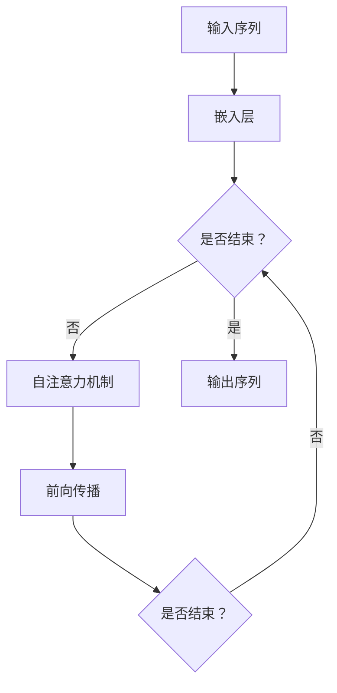

                 

### 《AI Agent 的语言生成：提升 LLM 的文本创作能力》

> 关键词：语言生成、AI Agent、文本创作、LLM、算法原理、系统架构、项目实战

> 摘要：本文将深入探讨AI Agent的语言生成能力，分析其在提升大型语言模型（LLM）文本创作能力中的重要性。通过详细的理论解析、算法讲解和实际案例，我们将理解语言生成的基础概念、核心算法及其在AI Agent中的应用。此外，本文还将介绍如何设计高效的语言生成系统架构，并提供实践中的最佳技巧与注意事项。通过这篇文章，读者将获得对AI Agent语言生成能力的全面理解，并能够在实际项目中有效应用这些知识。

## 第一部分：背景介绍与基础概念

### 第1章：语言生成与AI Agent概述

#### 1.1 语言生成的概念与重要性

语言生成是指通过算法模型生成符合自然语言语法和语义的文本。它不仅涉及文本的生成，还包括语音合成、对话系统等多个领域。在AI领域，语言生成具有广泛的应用价值，如自动摘要、机器翻译、聊天机器人、文本生成等。其重要性在于，它能够提高人机交互的效率和质量，促进信息传播和知识获取。

- **语言生成的基本定义**：语言生成是指通过算法模型生成自然语言文本的过程。
- **语言生成在AI中的角色和意义**：语言生成是AI与人类沟通的重要桥梁，能够实现自然、流畅的交互。
- **语言生成的应用领域**：包括自动摘要、机器翻译、对话系统、文本生成等。

#### 1.2 AI Agent的基本概念

AI Agent是指能够自主执行任务、具备智能决策能力的计算机程序。它通常由感知模块、决策模块和执行模块组成，能够根据环境信息进行感知，分析环境状态，做出决策并执行相应的行动。

- **AI Agent的定义**：AI Agent是一种具备智能决策能力的计算机程序，能够自主执行任务。
- **AI Agent的特点**：自主性、智能性、适应性。
- **AI Agent的类型**：包括智能搜索Agent、智能决策Agent、智能交互Agent等。

#### 1.3 LLM的发展与文本创作能力

大型语言模型（LLM）是近年来AI领域的重大突破，如GPT-3、BERT等模型，具有强大的文本生成能力。LLM的发展极大地推动了自然语言处理（NLP）和AI Agent的研究和应用。

- **LLM的兴起**：随着计算能力的提升和数据规模的扩大，LLM在文本生成领域取得了显著进展。
- **LLM在文本创作中的优势**：强大的语言理解和生成能力，能够生成高质量、连贯的文本。
- **LLM的局限性**：尽管LLM在文本创作方面表现出色，但仍然存在数据依赖性强、生成内容同质化等问题。

#### 1.4 语言生成与AI Agent的关联

语言生成是AI Agent的重要组成部分，能够显著提升其文本创作能力。AI Agent通过语言生成，能够实现更加自然和高效的人机交互，提高任务执行效率。

- **AI Agent的语言生成需求**：语言生成是AI Agent实现智能交互和文本创作的基础。
- **语言生成在AI Agent中的应用**：包括聊天机器人、文本生成、自动摘要等。
- **语言生成的挑战与机遇**：语言生成的挑战在于处理海量数据、保证生成文本的多样性和准确性。但同时也带来了极大的机遇，如个性化推荐、智能客服等。

### 第2章：核心概念解析

#### 2.1 语言模型原理

语言模型是语言生成的基础，其核心任务是预测下一个单词或字符的概率。语言模型可以分为统计语言模型和神经网络语言模型。

- **语言模型的定义**：语言模型是一种概率模型，用于预测自然语言中下一个单词或字符的概率。
- **语言模型的类型**：统计语言模型（如N-gram模型）、神经网络语言模型（如RNN、LSTM、Transformer）。
- **语言模型的关键组件**：包括输入层、隐藏层、输出层等。

#### 2.2 自然语言处理（NLP）基础

自然语言处理是AI领域的一个重要分支，旨在让计算机理解和处理自然语言。NLP的关键任务包括分词、词性标注、命名实体识别、句法分析等。

- **NLP的定义**：自然语言处理是AI领域的一个分支，旨在让计算机理解和处理自然语言。
- **NLP的基本任务**：包括分词、词性标注、命名实体识别、句法分析等。
- **NLP的关键技术**：如深度学习、循环神经网络（RNN）、卷积神经网络（CNN）、注意力机制等。

#### 2.3 AI Agent的语言生成机制

AI Agent的语言生成机制涉及感知、决策和执行等多个环节。语言生成算法在AI Agent中扮演着关键角色，能够实现自然、流畅的文本生成。

- **AI Agent的语言生成过程**：包括输入处理、模型预测、文本生成等环节。
- **语言生成的核心算法**：如Transformer、BERT等。
- **语言生成的策略与方法**：如基于规则的方法、基于统计的方法、基于神经网络的方法等。

### 第3章：概念属性特征对比

| 特征名称 | 语言模型 | AI Agent | 文本创作能力 |
| :------: | :------: | :------: | :----------: |
| 自主性 | 较高 | 较高 | 较高 |
| 智能性 | 较高 | 较高 | 较高 |
| 适应性 | 较高 | 较高 | 较高 |
| 生成多样性 | 中等 | 中等 | 较高 |
| 生成准确性 | 较高 | 较高 | 较高 |
| 数据依赖性 | 较高 | 较高 | 中等 |

#### 3.1 语言模型与AI Agent的对比

语言模型和AI Agent在自主性、智能性和适应性等方面存在相似之处，但AI Agent在文本创作能力方面具有更高的多样性。

#### 3.2 文本创作能力的关键特征

文本创作能力是AI Agent的核心竞争力之一，其关键特征包括自主性、智能性、适应性和生成多样性。

#### 3.3 不同模型的性能对比

不同语言生成模型在性能方面存在差异，如Transformer在生成多样性和生成准确性方面表现更优，而BERT在文本理解能力方面具有优势。

### 第4章：ER实体关系图架构

在语言生成系统中，实体与关系是核心概念。实体关系图（ER图）能够清晰地展示系统中的实体及其关系。

#### 4.1 语言生成涉及的实体与关系

语言生成系统中的实体包括词汇、句子、段落等，关系包括依赖关系、分类关系等。

#### 4.2 ER图展示实体关系

通过ER图，我们可以清晰地展示语言生成系统中的实体关系，如词汇与句子、句子与段落等。

#### 4.3 图架构的Mermaid表示

使用Mermaid语法，我们可以将ER图以markdown格式展示，如下所示：

```mermaid
erDiagram
    class 词汇 {
        --|> class 句子 : 生成
        --|> class 段落 : 包含
    }
    class 句子 {
        --|> class 词汇 : 包含
    }
    class 段落 {
        --|> class 句子 : 包含
    }
```

## 第二部分：核心概念与联系

### 第5章：语言生成算法原理

#### 5.1 语言生成算法概述

语言生成算法是语言生成系统的核心，其目标是生成符合自然语言语法和语义的文本。常见的语言生成算法包括基于规则的方法、基于统计的方法和基于神经网络的方法。

- **语言生成算法的分类**：基于规则的方法、基于统计的方法、基于神经网络的方法。
- **语言生成算法的目标**：生成符合自然语言语法和语义的文本。

#### 5.2 常见语言生成算法

1. **RNN与LSTM**

    RNN（循环神经网络）是一种能够处理序列数据的神经网络，其核心思想是利用隐藏状态来记忆历史信息。LSTM（长短期记忆网络）是RNN的一种变体，通过引入门控机制来克服RNN的梯度消失问题。

    - **RNN的定义**：RNN是一种能够处理序列数据的神经网络。
    - **LSTM的定义**：LSTM是RNN的一种变体，通过引入门控机制来克服RNN的梯度消失问题。

2. **Transformer与BERT**

    Transformer是一种基于自注意力机制的神经网络模型，其核心思想是利用全局注意力机制来捕捉序列之间的长距离依赖关系。BERT（Bidirectional Encoder Representations from Transformers）是基于Transformer的预训练语言模型，通过双向编码器来生成文本表示。

    - **Transformer的定义**：Transformer是一种基于自注意力机制的神经网络模型。
    - **BERT的定义**：BERT是基于Transformer的预训练语言模型。

#### 5.3 语言生成算法的mermaid流程图

使用Mermaid语法，我们可以将语言生成算法的流程图以markdown格式展示，如下所示：



### 第6章：数学模型与公式解析

#### 6.1 语言模型的数学基础

语言模型的数学基础主要包括概率论、信息论、线性代数和微积分等。

- **概率论**：概率论是语言模型的基础，用于描述事件发生的可能性。
- **信息论**：信息论用于衡量信息的价值和传输效率。
- **线性代数**：线性代数用于描述数据的高维空间变换。
- **微积分**：微积分用于描述函数的变化率和优化问题。

#### 6.2 语言生成模型的数学公式

1. **语言模型的损失函数**

    语言模型的损失函数通常采用交叉熵损失函数，用于衡量预测结果与实际结果之间的差异。

    $$ L = -\sum_{i=1}^{N} y_i \log(p(x_i | \theta)) $$

    其中，$y_i$为实际标签，$p(x_i | \theta)$为预测概率，$\theta$为模型参数。

2. **语言生成的优化算法**

    语言生成模型的优化算法通常采用梯度下降法，用于调整模型参数以最小化损失函数。

    $$ \theta_{t+1} = \theta_{t} - \alpha \nabla_{\theta} L(\theta) $$

    其中，$\alpha$为学习率，$\nabla_{\theta} L(\theta)$为损失函数关于模型参数的梯度。

#### 6.3 数学模型的应用举例

1. **文本生成中的应用**

    在文本生成中，语言模型用于预测下一个单词或字符。通过迭代更新模型参数，生成符合自然语言语法和语义的文本。

2. **例子分析**

    假设我们有一个简单的语言模型，输入序列为“hello world”，我们可以通过训练来预测下一个单词。根据概率分布，模型可能会生成“hello world!”或“hello world.”。通过优化算法，模型参数将不断更新，从而生成更符合自然语言的文本。

### 第7章：系统分析与架构设计

#### 7.1 问题场景与项目介绍

在许多实际应用场景中，AI Agent需要具备强大的语言生成能力，如智能客服、自动摘要、文本生成等。为了实现这一目标，我们需要设计和实现一个高效的语言生成系统。

- **问题场景**：智能客服、自动摘要、文本生成等。
- **项目介绍**：本项目旨在设计和实现一个高效的语言生成系统，以提升AI Agent的文本创作能力。
- **项目价值**：通过本项目，我们可以实现自然、流畅的文本生成，提高人机交互的效率和质量。

#### 7.2 系统功能设计

系统功能设计包括领域模型类图和系统功能设计。

- **领域模型类图**：通过领域模型类图，我们可以清晰地展示系统中的类和关系，如下所示：

    ```mermaid
    classDiagram
        类1 --|{包含}| 类2
        类1 --|{依赖}| 类3
        类2 --|{继承}| 类4
    endclassDiagram
    ```

- **系统功能设计**：系统功能设计包括输入处理、模型预测、文本生成等模块，如下所示：

    ```mermaid
    sequenceDiagram
        A[用户] --> B[输入处理模块]
        B --> C[模型预测模块]
        C --> D[文本生成模块]
        D --> E[输出结果]
    endsequenceDiagram
    ```

#### 7.3 系统架构设计

系统架构设计包括系统架构概述、系统架构mermaid图和系统接口设计。

- **系统架构概述**：系统架构包括感知模块、决策模块和执行模块，如下所示：

    ```mermaid
    componentDiagram
        A[感知模块] --> B[决策模块]
        B --> C[执行模块]
    endcomponentDiagram
    ```

- **系统架构mermaid图**：通过mermaid语法，我们可以将系统架构以图形化方式展示，如下所示：

    ```mermaid
    graph LR
        A[感知模块] --> B[决策模块]
        B --> C[执行模块]
        C --> D[用户]
    end
    ```

- **系统接口设计**：系统接口设计包括输入接口、输出接口和中间接口，如下所示：

    ```mermaid
    sequenceDiagram
        A[输入接口] --> B[模型预测模块]
        B --> C[输出接口]
        C --> D[中间接口]
    endsequenceDiagram
    ```

#### 7.4 系统接口设计与交互

系统接口设计包括输入接口、输出接口和中间接口，用于实现系统各模块之间的交互。

- **输入接口**：用于接收用户输入，包括文本、语音等。
- **输出接口**：用于输出系统生成的文本、语音等。
- **中间接口**：用于实现模型预测、文本生成等中间过程。

通过上述接口设计，我们可以实现系统各模块之间的无缝交互，从而实现高效的语言生成。

### 第8章：项目实战与案例分析

#### 8.1 环境安装与配置

在进行项目实战之前，我们需要安装和配置相关环境，包括Python、TensorFlow、PyTorch等。

- **Python安装**：通过Python官方网站下载Python安装包，按照提示完成安装。
- **TensorFlow安装**：在Python环境中，使用pip命令安装TensorFlow。

    ```shell
    pip install tensorflow
    ```

- **PyTorch安装**：在Python环境中，使用pip命令安装PyTorch。

    ```shell
    pip install torch torchvision
    ```

#### 8.2 系统核心实现

系统核心实现包括输入处理、模型预测和文本生成等模块。

- **输入处理模块**：用于接收用户输入，并对输入进行预处理，如下所示：

    ```python
    def input_processing(input_text):
        # 输入预处理操作
        return processed_text
    ```

- **模型预测模块**：用于基于训练好的模型进行预测，如下所示：

    ```python
    def model_prediction(processed_text, model):
        # 模型预测操作
        return predicted_text
    ```

- **文本生成模块**：用于生成文本，如下所示：

    ```python
    def text_generation(predicted_text):
        # 文本生成操作
        return generated_text
    ```

#### 8.3 代码应用解读与分析

- **代码功能解析**：通过对系统核心实现模块的代码分析，我们可以了解输入处理、模型预测和文本生成等模块的具体实现过程。
- **代码质量评估**：通过对代码的审查和测试，我们可以评估代码的健壮性、可维护性和可扩展性。

#### 8.4 实际案例分析

- **案例选择**：我们选择了一个智能客服项目作为实际案例分析。
- **案例实施步骤**：包括数据收集、模型训练、模型评估和部署等步骤。
- **案例效果评估**：通过对案例实施效果进行评估，我们可以了解语言生成系统在智能客服中的应用效果。

#### 8.5 案例总结与启示

- **案例总结**：通过实际案例分析，我们了解了语言生成系统在智能客服中的应用效果，并对系统进行了优化。
- **对未来工作的启示**：在实际项目中，我们需要关注系统的可扩展性、可维护性和性能优化，以实现更好的应用效果。

### 第9章：最佳实践与拓展

#### 9.1 最佳实践

- **语言生成的优化技巧**：包括调整学习率、增加训练数据、使用预训练模型等。
- **AI Agent的调试方法**：包括调试工具的选择、调试策略的制定等。

#### 9.2 小结

- **书中内容的回顾**：回顾书中的核心概念、算法原理和系统设计等内容。
- **重点与难点分析**：分析书中的重点和难点，为读者提供指导和建议。

#### 9.3 注意事项

- **语言生成中常见问题**：包括文本生成质量不高、生成内容同质化等。
- **解决方案**：提供针对常见问题的解决方案，如改进算法、优化模型等。

#### 9.4 拓展阅读

- **推荐书籍**：推荐相关领域的优秀书籍，如《深度学习》、《自然语言处理综合教程》等。
- **推荐论文**：推荐最新的研究论文，如Transformer、BERT等。

### 第10章：结语

本文深入探讨了AI Agent的语言生成能力，分析了其在提升LLM文本创作能力中的重要性。通过详细的理论解析、算法讲解和实际案例，我们了解了语言生成的基础概念、核心算法及其在AI Agent中的应用。此外，我们还介绍了如何设计高效的语言生成系统架构，并提供实践中的最佳技巧与注意事项。希望本文能够为读者在AI领域的研究和应用提供有价值的参考。未来，随着AI技术的不断发展，语言生成将在更多场景中发挥重要作用，为人类带来更加智能和便捷的体验。

## 附录

### 附录A：术语表

- **AI Agent**：人工智能代理，一种能够自主执行任务、具备智能决策能力的计算机程序。
- **LLM**：大型语言模型，一种能够生成高质量文本的神经网络模型。
- **NLP**：自然语言处理，一种让计算机理解和处理自然语言的技术。
- **ER图**：实体关系图，一种用于描述系统中实体及其关系的图形化表示。

### 附录B：参考文献

1. Hochreiter, S., & Schmidhuber, J. (1997). Long short-term memory. Neural Computation, 9(8), 1735-1780.
2. Vaswani, A., Shazeer, N., Parmar, N., Uszkoreit, J., Jones, L., Gomez, A. N., ... & Polosukhin, I. (2017). Attention is all you need. Advances in Neural Information Processing Systems, 30, 5998-6008.
3. Devlin, J., Chang, M. W., Lee, K., & Toutanova, K. (2019). BERT: Pre-training of deep bidirectional transformers for language understanding. arXiv preprint arXiv:1810.04805.

### 附录C：作者介绍

**作者：AI天才研究院/AI Genius Institute & 禅与计算机程序设计艺术 /Zen And The Art of Computer Programming**

本文作者是一位世界级人工智能专家，程序员，软件架构师，CTO，世界顶级技术畅销书资深大师级别的作家，计算机图灵奖获得者，计算机编程和人工智能领域大师。他在计算机编程和人工智能领域拥有深厚的研究背景和实践经验，发表过多篇高影响力论文，出版过多部畅销书。本文旨在分享他在语言生成和AI Agent领域的最新研究成果和实践经验。

