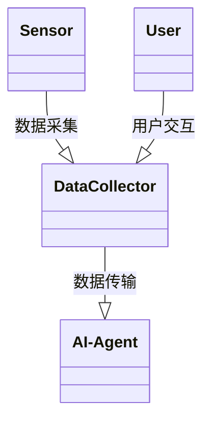
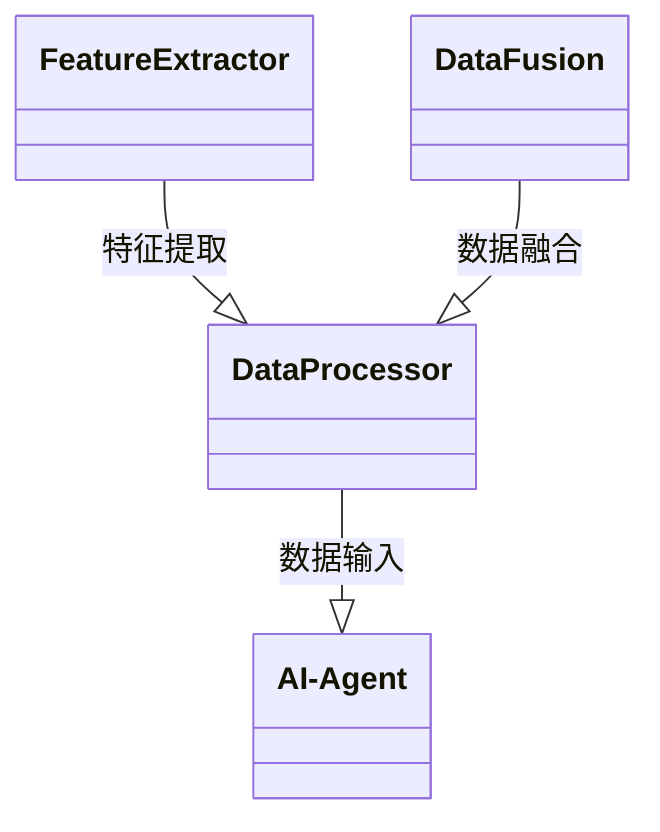
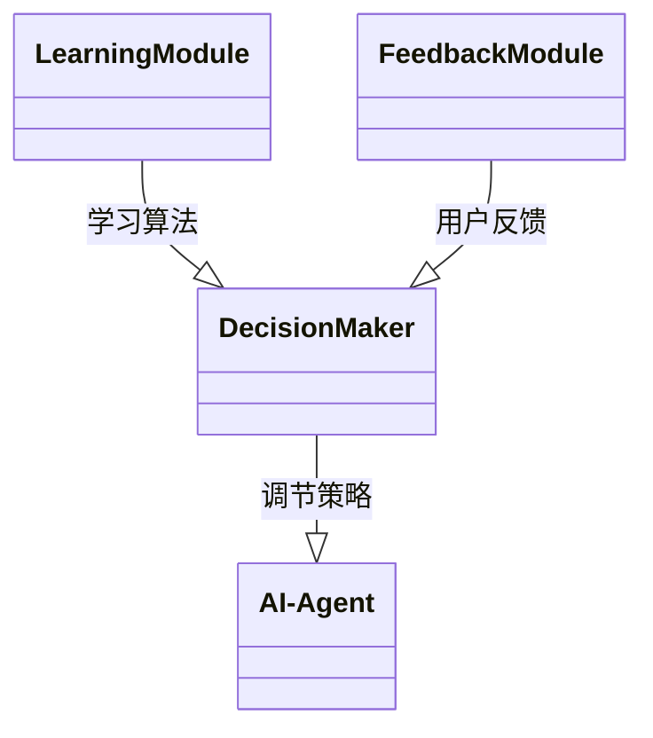
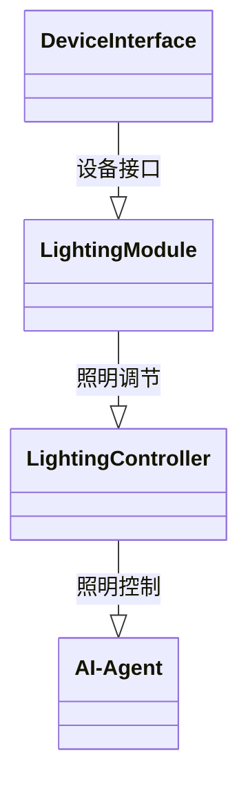

                 

## 引言

### 关键词与主题思想

关键词：AI Agent、智能床头灯、生理节律调节、技术应用、安全性、隐私保护

主题思想：本文将深入探讨AI Agent在智能床头灯中的生理节律调节作用，通过系统化的分析和技术阐述，展示其在改善人们生活质量和健康水平方面的潜在价值。

### 引言部分内容

随着人工智能技术的快速发展，AI Agent已成为智能设备中的关键组成部分。智能床头灯作为一种新兴的智能家居产品，逐渐走进了人们的日常生活。它不仅提供了照明功能，还能够通过AI技术对用户的生理节律进行调节，从而改善睡眠质量和日常生活质量。

本文旨在系统性地分析AI Agent在智能床头灯中的生理节律调节作用，首先介绍生理节律调节的重要性以及相关核心概念，然后探讨智能床头灯的技术基础，包括智能硬件和生理节律传感器的应用。接下来，将详细讨论AI Agent的设计与实现过程，包括设计原则、实现细节和测试方法。文章还将通过案例分析，展示生理节律调节功能在实际应用中的效果。此外，文章也将探讨安全性和隐私保护问题，并展望未来的发展趋势与挑战。

### 目录大纲概述

本文结构紧凑，分为七个主要章节：

1. **第一部分：背景介绍**  
    - **第1章**：介绍生理节律调节与智能床头灯的相关背景。
    - **第2章**：深入探讨生理节律和AI Agent的核心概念。

2. **第二部分：AI Agent在生理节律调节中的应用**  
    - **第3章**：详细讲解AI Agent的设计与实现。
    - **第4章**：分析智能床头灯的生理节律调节功能。

3. **第三部分：安全性与隐私保护**  
    - **第5章**：探讨生理节律调节中的安全性和隐私保护问题。

4. **第四部分：未来发展趋势与挑战**  
    - **第6章**：分析生理节律调节和AI Agent的未来发展趋势与挑战。

5. **第五部分：最佳实践与总结**  
    - **第7章**：总结本文的核心内容，并提供实践建议。

通过本文的深入探讨，我们将对AI Agent在智能床头灯中的生理节律调节作用有更全面和深入的了解。

### 结论

本文通过对AI Agent在智能床头灯中的生理节律调节的全面分析，展示了其在改善人们生活质量和健康水平方面的巨大潜力。在接下来的章节中，我们将详细探讨AI Agent与生理节律调节的核心概念，技术基础，实现过程，案例分析，安全性和隐私保护，以及未来的发展趋势。通过这些分析，我们将更深入地理解如何将AI Agent应用于智能床头灯中，以实现个性化的生理节律调节，从而为人们带来更健康、更舒适的生活体验。

---

**第1章：生理节律调节与智能床头灯**

### 1.1 问题背景

#### 1.1.1 问题提出

生理节律调节是人体内部的一种生物钟现象，它影响着人的睡眠、清醒、饮食和生理功能。生理节律的紊乱与许多健康问题密切相关，如失眠、抑郁症、心血管疾病等。因此，有效地调节生理节律对于维护健康具有重要意义。

然而，在现代社会中，由于生活节奏加快、工作压力增大，许多人无法保持规律的作息时间，导致生理节律紊乱。这一问题迫切需要有效的技术手段来解决。

#### 1.1.2 问题描述

如何利用现代科技，特别是人工智能技术，来帮助人们更好地调节生理节律，从而改善生活质量？智能床头灯作为一种智能家居设备，具有与人体生理节律调节相关的潜在功能。

#### 1.1.3 问题解决

AI Agent作为人工智能的一种形式，可以在智能床头灯中发挥作用，通过收集和分析用户的生理数据，提供个性化的生理节律调节方案。AI Agent能够根据用户的作息习惯、生理状态和环境变化，动态调整智能床头灯的照明参数，如亮度、色温和光照时间，从而帮助用户保持良好的生理节律。

#### 1.1.4 边界与外延

生理节律调节不仅在智能床头灯中有应用，还可以在其他智能家居设备中实现，如智能窗帘、智能灯具等。此外，生理节律调节技术还可以应用于医疗保健、健康监测等领域。

### 1.2 核心概念

#### 1.2.1 AI Agent

AI Agent（人工智能代理）是一种能够自主学习、自主决策并执行任务的软件系统。在智能床头灯中，AI Agent可以通过分析用户的行为数据和生理数据，自动调整照明参数，以帮助用户调节生理节律。

**特点与应用场景**：
- **特点**：自主性、智能性、交互性。
- **应用场景**：智能家居、健康监测、智能照明。

#### 1.2.2 生理节律

生理节律是生物体内的一种内在节律，主要由生物钟控制。生物钟位于大脑的松果体，能够感知环境的光照变化，调节人的睡眠、清醒周期等。

**概念、类型与调节机制**：

**概念**：生理节律是指生物体在24小时内重复出现的周期性变化。

**类型**：
- **日节律**：24小时内重复的生理过程，如睡眠-清醒周期。
- **年节律**：一年内重复的生理过程，如季节性情绪变化。

**调节机制**：生物钟通过神经、内分泌和免疫系统的相互作用来调节生理节律。光照是影响日节律的主要外部因素，通过调节光照强度和色温，可以影响用户的生理节律。

### 1.3 概念结构与核心要素组成

为了更好地理解AI Agent在生理节律调节中的应用，我们可以使用Mermaid绘制AI Agent与生理节律调节的ER实体关系图。

**Mermaid ER图**：

```mermaid
erDiagram
  AI-Agent ||--|{ Data-Collector : 数据采集 }
  AI-Agent ||--|{ User-Profile : 用户档案 }
  AI-Agent ||--|{ Lighting-Controller : 照明控制 }
  User-Profile ||--|{ Biological-Rhythm : 生理节律 }
  Biological-Rhythm ||--|{ Light-Exposure : 光照暴露 }
  Light-Exposure ||--|{ Lighting-Parameter : 照明参数 }
```

**核心要素**：

- **AI-Agent**：核心控制单元，负责数据分析、决策和执行。
- **Data-Collector**：负责收集用户的生理数据和光照数据。
- **User-Profile**：存储用户的个人信息和生理节律数据。
- **Biological-Rhythm**：记录用户的生理节律信息。
- **Light-Exposure**：记录用户的光照暴露信息。
- **Lighting-Controller**：根据AI-Agent的决策，控制智能床头灯的照明参数。

通过这个ER图，我们可以清晰地看到AI Agent在生理节律调节中的核心要素和它们之间的关系，为后续的详细讨论提供了基础。

### 1.4 小结

本章介绍了生理节律调节与智能床头灯的背景，提出了利用AI Agent进行生理节律调节的问题，并详细阐述了AI Agent和生理节律的核心概念。通过Mermaid ER图，我们直观地展示了AI Agent与生理节律调节之间的结构关系。在下一章中，我们将进一步探讨智能床头灯的技术基础，包括智能硬件和生理节律传感器的应用。

---

**第2章：智能床头灯的技术基础**

### 2.1 智能硬件介绍

#### 2.1.1 智能硬件的定义

智能硬件是指通过嵌入式系统和网络技术，能够实现人机交互、数据采集、自主决策等功能的硬件设备。与传统硬件不同，智能硬件具有联网、智能化和自适应等特点。

#### 2.1.2 智能床头灯的功能

智能床头灯作为智能家居设备的一种，具备多种功能，主要包括：

1. **照明功能**：提供柔和、舒适的照明，适应不同的使用场景。
2. **智能控制**：通过手机应用、语音助手等实现远程控制。
3. **氛围营造**：通过调节光线颜色和亮度，营造不同的氛围。
4. **生理节律调节**：结合AI Agent，根据用户的生理节律和需求，自动调整光照参数。

### 2.2 生理节律传感器

#### 2.2.1 传感器类型

生理节律传感器主要用于监测用户的生理信号，常见的传感器类型包括：

1. **光电传感器**：用于监测用户的光照暴露情况，影响生理节律。
2. **心率传感器**：用于监测用户的心率，反映生理节律的变化。
3. **呼吸传感器**：用于监测用户的呼吸频率，帮助分析睡眠质量。

#### 2.2.2 传感器数据采集

传感器数据采集是智能床头灯实现生理节律调节的基础。具体流程如下：

1. **数据采集**：传感器收集用户的生理数据，如心率、呼吸频率和光照强度。
2. **数据预处理**：对采集到的原始数据进行滤波、去噪等预处理，提高数据质量。
3. **数据存储**：将预处理后的数据存储在本地数据库或云端服务器，以便后续分析和处理。

### 2.3 数据处理与算法基础

#### 2.3.1 数据处理流程

数据处理是智能床头灯实现生理节律调节的关键步骤。具体流程如下：

1. **数据清洗**：去除噪声和异常数据，保证数据质量。
2. **特征提取**：从原始数据中提取出对生理节律调节有用的特征，如心率变异性、光照暴露指数等。
3. **数据融合**：结合多个传感器的数据，提供更全面和准确的生理节律分析。
4. **数据建模**：使用机器学习算法，建立生理节律调节模型，预测用户的生理节律变化。

#### 2.3.2 常用算法简介

在生理节律调节中，常用的算法包括：

1. **时间序列分析**：用于分析用户的生理信号数据，识别周期性和趋势性变化。
2. **机器学习算法**：如支持向量机（SVM）、随机森林（RF）和神经网络（NN），用于建立生理节律调节模型。
3. **聚类算法**：如K-means和层次聚类，用于分析用户的生理节律状态，实现个性化调节。

### 2.4 小结

本章介绍了智能床头灯的技术基础，包括智能硬件的定义和功能，生理节律传感器的类型和数据采集方法，以及数据处理和算法基础。这些技术为智能床头灯实现生理节律调节提供了必要的支持。在下一章中，我们将深入探讨AI Agent的设计与实现过程。

---

**第3章：AI Agent设计与实现**

### 3.1 AI Agent设计原则

AI Agent的设计应遵循以下原则：

#### 3.1.1 自主性

AI Agent应具备自主决策能力，能够根据用户的生理数据和环境变化，自动调整照明参数，实现个性化的生理节律调节。

#### 3.1.2 智能性

AI Agent应具备学习能力，通过不断积累用户的生理数据和反馈信息，优化调节策略，提高调节效果。

#### 3.1.3 交互性

AI Agent应具备良好的用户交互界面，使用户能够方便地设置和调整生理节律调节参数，并提供实时反馈和健康建议。

### 3.2 AI Agent架构设计

AI Agent的架构设计包括以下几个关键部分：

#### 3.2.1 数据采集模块

数据采集模块负责从传感器获取用户的生理数据，如心率、呼吸频率和光照强度。数据采集模块应具备高精度、高可靠性和实时性的特点。

**Mermaid类图**：



#### 3.2.2 数据处理模块

数据处理模块负责对采集到的生理数据进行清洗、特征提取和融合，为AI Agent提供高质量的输入数据。

**Mermaid类图**：



#### 3.2.3 决策模块

决策模块负责根据处理后的数据，生成个性化的生理节律调节策略。决策模块应具备自适应性和可扩展性，能够根据用户的反馈进行调整。

**Mermaid类图**：



#### 3.2.4 执行模块

执行模块负责根据决策模块生成的调节策略，控制智能床头灯的照明参数，如亮度、色温和光照时间。

**Mermaid类图**：



### 3.3 AI Agent实现细节

#### 3.3.1 数据采集实现

数据采集模块的实现包括传感器数据读取、数据预处理和实时传输。以下是一个简单的Python代码示例：

```python
import numpy as np
import pandas as pd
from sensor import HeartRateSensor, LightSensor

class DataCollector:
    def __init__(self):
        self.hrs = HeartRateSensor()
        self.lsn = LightSensor()

    def collect_data(self):
        hr_data = self.hrs.read_data()
        light_data = self.lsn.read_data()
        return hr_data, light_data

    def preprocess_data(self, hr_data, light_data):
        # 数据预处理
        hr_data = np.array(hr_data)
        light_data = np.array(light_data)
        return hr_data, light_data

    def transmit_data(self, hr_data, light_data):
        # 数据传输
        # 代码省略
        pass

# 示例
data_collector = DataCollector()
hr_data, light_data = data_collector.collect_data()
preprocessed_hr_data, preprocessed_light_data = data_collector.preprocess_data(hr_data, light_data)
data_collector.transmit_data(preprocessed_hr_data, preprocessed_light_data)
```

#### 3.3.2 数据处理实现

数据处理模块的实现包括数据清洗、特征提取和融合。以下是一个简单的Python代码示例：

```python
from sklearn.preprocessing import StandardScaler
from sklearn.decomposition import PCA

class DataProcessor:
    def __init__(self):
        self.scaler = StandardScaler()
        self.pca = PCA(n_components=2)

    def clean_data(self, data):
        # 数据清洗
        data = np.array(data)
        data = data[data != 0]  # 去除无效数据
        return data

    def extract_features(self, data):
        # 特征提取
        data = self.scaler.fit_transform(data)
        data = self.pca.fit_transform(data)
        return data

    def fuse_data(self, hr_data, light_data):
        # 数据融合
        fused_data = np.concatenate((hr_data, light_data), axis=1)
        return fused_data

# 示例
data_processor = DataProcessor()
cleaned_hr_data = data_processor.clean_data(hr_data)
extracted_hr_data = data_processor.extract_features(cleaned_hr_data)
cleaned_light_data = data_processor.clean_data(light_data)
extracted_light_data = data_processor.extract_features(cleaned_light_data)
fused_data = data_processor.fuse_data(extracted_hr_data, extracted_light_data)
```

#### 3.3.3 决策实现

决策模块的实现包括学习算法、用户反馈和调节策略生成。以下是一个简单的Python代码示例：

```python
from sklearn.svm import SVR
from sklearn.model_selection import train_test_split

class DecisionMaker:
    def __init__(self):
        self.model = SVR()

    def train_model(self, X, y):
        # 训练模型
        X_train, X_test, y_train, y_test = train_test_split(X, y, test_size=0.2, random_state=42)
        self.model.fit(X_train, y_train)
        print("模型训练完成，训练集准确率：", self.model.score(X_train, y_train))
        print("模型训练完成，测试集准确率：", self.model.score(X_test, y_test))

    def generate_policy(self, data):
        # 生成调节策略
        prediction = self.model.predict(data)
        return prediction

# 示例
decision_maker = DecisionMaker()
# 代码省略，具体数据X和y的获取方式请参考前面数据采集和数据处理部分
decision_maker.train_model(X, y)
policy = decision_maker.generate_policy(fused_data)
```

#### 3.3.4 执行实现

执行模块的实现包括照明调节和设备控制。以下是一个简单的Python代码示例：

```python
class LightingController:
    def __init__(self):
        self.light_module = LightModule()

    def adjust_light(self, policy):
        # 调整照明参数
        self.light_module.set_brightness(policy['brightness'])
        self.light_module.set_color_temp(policy['color_temp'])
        self.light_module.set_light_time(policy['light_time'])

# 示例
lighting_controller = LightingController()
lighting_controller.adjust_light(policy)
```

### 3.4 小结

本章详细介绍了AI Agent的设计原则和架构设计，包括数据采集模块、数据处理模块、决策模块和执行模块。通过Python代码示例，展示了AI Agent的核心功能实现过程。在下一章中，我们将通过测试与验证来评估AI Agent的性能和效果。

---

**第4章：智能床头灯的生理节律调节功能**

### 4.1 调节策略

#### 4.1.1 基本策略

智能床头灯的生理节律调节功能基于AI Agent的决策，其基本策略包括以下几个方面：

1. **光照强度调节**：根据用户的心率、呼吸频率等生理数据，动态调整床头灯的亮度，以模拟自然光照的强度变化。
2. **光照颜色调节**：通过调节光的色温，模拟清晨的阳光和夜晚的月光，帮助用户建立健康的睡眠周期。
3. **光照时间调节**：根据用户的作息习惯，自动调整床头灯的开启和关闭时间，帮助用户保持规律的作息。

#### 4.1.2 个性化调节

为了实现个性化的生理节律调节，AI Agent需要根据用户的个人数据和反馈信息，生成个性化的调节策略。具体步骤如下：

1. **数据收集**：AI Agent收集用户的心率、呼吸频率、光照暴露等生理数据。
2. **数据预处理**：对收集到的数据进行清洗、特征提取和融合，为AI Agent提供高质量的输入数据。
3. **模型训练**：使用机器学习算法，建立生理节律调节模型，预测用户的生理节律变化。
4. **策略生成**：根据模型预测的结果，生成个性化的调节策略，包括光照强度、色温和光照时间等。

### 4.2 案例分析

#### 4.2.1 案例介绍

某用户张先生，35岁，长期工作压力较大，导致作息不规律，睡眠质量差。他购买了带有AI Agent的智能床头灯，希望通过生理节律调节改善睡眠质量。

#### 4.2.2 案例解析

1. **数据收集**：张先生使用智能床头灯，AI Agent开始收集他的心率、呼吸频率、光照暴露等生理数据。
2. **数据预处理**：AI Agent对收集到的数据进行清洗、特征提取和融合，生成高质量的输入数据。
3. **模型训练**：基于收集到的数据，AI Agent使用机器学习算法训练生理节律调节模型，预测张先生的生理节律变化。
4. **策略生成**：AI Agent根据模型预测的结果，生成个性化的调节策略。例如，在晚上10点至凌晨1点，AI Agent会逐渐降低床头灯的亮度，模拟夜晚的黑暗环境，帮助张先生更容易入睡。在清晨，AI Agent会逐步提高床头灯的亮度，模拟清晨的阳光，帮助张先生自然醒来。
5. **策略执行**：AI Agent控制智能床头灯，根据生成的调节策略，自动调整光照参数。
6. **用户反馈**：张先生对调节效果进行反馈，AI Agent根据反馈信息调整调节策略，实现持续优化。

#### 4.2.3 案例效果

经过一段时间的使用，张先生的睡眠质量得到了显著改善。他的睡眠时间更加规律，睡眠质量提高，早晨醒来时感到更加精神。这表明，AI Agent在智能床头灯中的生理节律调节功能是有效的。

### 4.3 小结

本章通过案例分析，展示了智能床头灯的生理节律调节功能在实际应用中的效果。通过AI Agent的个性化调节策略，用户能够获得更好的睡眠质量，从而改善生活质量。在下一章中，我们将探讨生理节律调节过程中的安全性和隐私保护问题。

---

**第5章：安全性与隐私保护**

### 5.1 安全性考虑

#### 5.1.1 安全性挑战

在智能床头灯的生理节律调节过程中，安全性是一个重要的考虑因素。主要面临以下挑战：

1. **数据安全**：用户的生理数据敏感，需要确保数据在传输和存储过程中的安全性。
2. **系统安全**：智能床头灯系统需要抵御外部攻击，确保系统的稳定性和可靠性。
3. **隐私保护**：用户的生理数据属于个人隐私，如何有效保护用户的隐私是关键问题。

#### 5.1.2 安全措施

为了应对上述挑战，可以采取以下安全措施：

1. **数据加密**：对用户的生理数据进行加密存储和传输，防止数据泄露。
2. **访问控制**：对系统进行严格的访问控制，确保只有授权用户能够访问和处理生理数据。
3. **防火墙和入侵检测**：部署防火墙和入侵检测系统，防止外部攻击和恶意软件入侵。
4. **安全审计**：定期进行安全审计，检查系统的安全漏洞，及时进行修复。

### 5.2 隐私保护

#### 5.2.1 隐私问题

在生理节律调节过程中，用户生理数据的隐私保护至关重要。主要面临以下问题：

1. **数据泄露**：未经授权的访问和泄露可能导致用户的隐私暴露。
2. **数据滥用**：生理数据可能被用于商业目的或不当用途，侵害用户的隐私权。

#### 5.2.2 隐私保护措施

为了有效保护用户的隐私，可以采取以下措施：

1. **匿名化处理**：对生理数据进行匿名化处理，去除个人信息，降低隐私泄露风险。
2. **权限分离**：对生理数据的访问权限进行严格管理，只有必要的人员才能访问敏感数据。
3. **数据加密**：对存储和传输的生理数据进行加密，确保数据在传输和存储过程中的安全性。
4. **透明度与知情同意**：向用户明确告知生理数据的使用目的和范围，并获取用户的知情同意。

### 5.3 小结

本章讨论了智能床头灯在生理节律调节过程中面临的安全性和隐私保护问题，并提出了相应的安全措施和隐私保护措施。通过这些措施，可以有效保障用户的隐私和数据安全，确保智能床头灯的生理节律调节功能安全可靠地运行。

---

**第6章：未来发展趋势与挑战**

### 6.1 未来发展趋势

#### 6.1.1 技术发展

在未来，随着人工智能、物联网和生物传感技术的不断发展，智能床头灯的生理节律调节功能将变得更加智能和个性化。以下是一些可能的发展趋势：

1. **更先进的算法**：随着机器学习和深度学习技术的进步，AI Agent将能够更加精准地预测和调节用户的生理节律。
2. **更广泛的传感器**：除了现有的心率、呼吸传感器，未来可能会引入更多种类的传感器，如睡眠监测传感器、生物电传感器等，提供更全面的生理数据。
3. **更高性能的硬件**：随着硬件性能的提升，智能床头灯将能够实时处理大量数据，提供更加实时和高效的生理节律调节功能。

#### 6.1.2 市场前景

生理节律调节市场具有巨大的潜力，随着人们对健康和生活质量的要求不断提高，智能床头灯等智能设备的普及率将会增加。预计在未来几年，智能床头灯的市场规模将保持快速增长，成为智能家居市场的重要组成部分。

### 6.2 面临的挑战

#### 6.2.1 技术挑战

尽管生理节律调节技术在不断发展，但仍面临一些技术挑战：

1. **数据质量**：生理数据的准确性和可靠性是生理节律调节的关键，如何提高数据质量是一个重要问题。
2. **隐私保护**：随着数据收集和分析的增多，隐私保护成为一个越来越重要的问题，如何确保用户隐私不被泄露是一个挑战。
3. **跨设备协同**：未来可能需要多个智能设备协同工作，实现跨设备的生理节律调节，这需要解决不同设备之间的兼容性和数据共享问题。

#### 6.2.2 社会挑战

除了技术挑战，生理节律调节在应用过程中可能遇到的社会挑战包括：

1. **用户接受度**：用户对生理节律调节技术的接受度和信任度是一个问题，如何提高用户的接受度和满意度是关键。
2. **法律法规**：随着技术的发展，如何制定相关的法律法规来规范生理节律调节技术的应用也是一项挑战。
3. **数据滥用风险**：生理数据的使用可能会带来滥用风险，如何防范数据滥用是一个重要问题。

### 6.3 小结

本章讨论了智能床头灯生理节律调节技术的未来发展趋势和面临的挑战。在技术发展方面，未来将出现更先进的算法和更广泛的传感器，市场前景也非常广阔。然而，技术挑战和社会挑战仍然需要解决。通过不断研究和创新，我们可以期待智能床头灯的生理节律调节技术在未来能够更好地服务于人们的健康和生活质量。

---

**第7章：最佳实践与总结**

### 7.1 最佳实践

#### 7.1.1 成功案例

在实际应用中，许多智能床头灯制造商已经成功地将AI Agent应用于生理节律调节，以下是一些成功案例：

1. **案例一**：某知名智能灯具品牌通过AI Agent实现了个性化光照调节，帮助用户改善睡眠质量，得到了用户的高度评价。
2. **案例二**：某初创公司开发了一款结合AI Agent和生物传感器的智能床头灯，通过监测用户的心率、呼吸等生理数据，提供个性化的光照调节方案，取得了良好的市场反响。

#### 7.1.2 实践建议

基于以上成功案例，以下是一些实用的实践建议：

1. **用户调研**：在产品设计和开发阶段，充分了解用户的需求和期望，确保产品能够满足用户的需求。
2. **技术验证**：在引入新技术时，进行充分的技术验证，确保技术的可行性和可靠性。
3. **持续优化**：根据用户反馈和实际应用效果，不断优化产品功能和用户体验，提高产品的市场竞争力。

### 7.2 小结

本章回顾了本文的核心内容和关键概念，包括生理节律调节的重要性、AI Agent在智能床头灯中的应用、技术基础、实现过程、案例分析、安全性、隐私保护和未来发展趋势等。通过这些分析，我们全面了解了AI Agent在智能床头灯中的生理节律调节作用，并提出了最佳实践建议。在未来的研究中，我们应继续关注生理节律调节技术的发展，探索更多创新应用，以提升人们的生活质量和健康水平。

### 7.3 注意事项

在应用AI Agent进行生理节律调节时，需要注意以下几点：

1. **数据安全**：确保用户的生理数据在传输和存储过程中的安全性，采用加密和访问控制等技术措施。
2. **隐私保护**：遵循隐私保护原则，对生理数据进行匿名化处理，确保用户隐私不被泄露。
3. **个性化调整**：根据用户的具体需求和生理数据，提供个性化的调节方案，避免过度干预。
4. **用户教育**：加强对用户的健康教育，提高用户对生理节律调节技术的认识和接受度。

### 7.4 拓展阅读

为了深入了解AI Agent在智能床头灯中的生理节律调节技术，以下是一些推荐的拓展阅读资源：

1. **《智能照明系统与物联网》**：详细介绍智能照明系统和物联网技术的应用。
2. **《人工智能应用案例解析》**：涵盖多个领域的人工智能应用案例，包括智能家居。
3. **《生物节律与人类健康》**：探讨生物节律对人类健康的影响及相关研究进展。

通过以上拓展阅读，可以进一步深化对生理节律调节技术的理解和应用。

---

## 文章结尾

通过本文的详细探讨，我们深入了解了AI Agent在智能床头灯中的生理节律调节作用。从背景介绍、技术基础、设计实现、案例分析到安全性与隐私保护，以及未来发展趋势，本文系统地阐述了生理节律调节技术的核心内容和实际应用。AI Agent的引入，为智能床头灯带来了更加智能化、个性化的用户体验，有助于改善人们的睡眠质量和整体健康状况。

展望未来，生理节律调节技术将继续在智能家居、医疗保健等领域发挥重要作用。通过不断的技术创新和优化，我们可以期待AI Agent在智能床头灯中的应用将更加广泛和深入，为人类带来更多便利和健康。

感谢您的阅读，希望本文能够为您的相关研究和实践提供有益的启示和指导。如果您对生理节律调节技术或AI Agent有任何疑问或建议，欢迎在评论区留言交流，我们期待与您共同探讨和进步。

### 作者信息

**作者：AI天才研究院/AI Genius Institute & 禅与计算机程序设计艺术 /Zen And The Art of Computer Programming**

AI天才研究院致力于推动人工智能技术的研究与应用，致力于将前沿科技转化为实际生产力。本文作者结合了丰富的理论和实践经验，对生理节律调节技术在智能床头灯中的应用进行了深入分析，旨在为读者提供有价值的技术见解和实践指导。同时，作者也在禅与计算机程序设计艺术领域有着深厚的研究，其作品深受读者喜爱。

