                 

# AI Agent的多模态常识推理与知识整合

## 关键词
- AI Agent
- 多模态常识推理
- 知识整合
- 数据采集
- 模型设计
- 知识表示

## 摘要
本文探讨了AI Agent的多模态常识推理与知识整合的重要性及其实现方法。首先，我们介绍了AI Agent的背景及其在多模态常识推理与知识整合中的必要性。接着，我们分析了问题解决的思路，并探讨了其边界与外延。然后，我们详细阐述了AI Agent的多模态常识推理与知识整合的概念结构与核心要素组成。最后，我们通过实例展示了如何实现这一过程，并对相关技术进行了深入探讨。

----------------------------------------------------------------

## 第1章: AI Agent的多模态常识推理与知识整合概述

### 1.1 问题背景与问题描述

#### 1.1.1 AI Agent的背景

AI Agent，即人工智能代理，是指能够模拟人类行为，自主感知环境、进行推理和决策的智能体。随着人工智能技术的不断进步，AI Agent在各个领域得到了广泛应用，如自动驾驶、智能家居、医疗诊断等。然而，AI Agent的智能水平仍然存在一定的局限性，其中一个关键问题便是多模态常识推理与知识整合。

#### 1.1.2 多模态常识推理与知识整合的必要性

多模态常识推理是指AI Agent通过整合多种感官信息（如视觉、听觉、触觉等）来进行推理和决策。而知识整合则是指将不同来源、不同格式的知识进行整合，以形成统一的知识体系。多模态常识推理与知识整合能够帮助AI Agent更好地理解和适应复杂环境，提高其智能水平。

### 1.2 问题解决与边界与外延

#### 1.2.1 问题解决

为了实现AI Agent的多模态常识推理与知识整合，我们需要从以下几个方面入手：

1. 数据采集与预处理：收集多种模态的数据，并对数据进行预处理，如去噪、归一化等。
2. 模型设计：设计合适的模型架构，以支持多模态数据输入和知识整合。
3. 知识表示：采用合适的知识表示方法，将不同来源、不同格式的知识进行统一表示。
4. 知识融合：设计有效的知识融合策略，将多种知识进行整合，形成统一的知识体系。
5. 常识推理：利用多模态数据和知识体系进行推理和决策。

#### 1.2.2 边界与外延

1. 边界：本文主要关注AI Agent的多模态常识推理与知识整合的理论研究、模型设计和技术实现，不包括其他相关领域的应用。
2. 外延：本文不仅关注技术层面的研究，还涉及相关领域的最新进展和未来发展趋势。

### 1.3 概念结构与核心要素组成

#### 1.3.1 概念结构

AI Agent的多模态常识推理与知识整合包括以下几个核心概念：

1. 多模态数据：包括视觉、听觉、触觉等多种感官数据。
2. 知识表示：采用统一的知识表示方法，将多种知识进行整合。
3. 知识融合：设计有效的知识融合策略，将多种知识进行整合。
4. 常识推理：利用多模态数据和知识体系进行推理和决策。

#### 1.3.2 核心要素组成

1. 数据采集与预处理：收集多种模态的数据，并对数据进行预处理。
2. 模型设计：设计合适的模型架构，以支持多模态数据输入和知识整合。
3. 知识表示：采用统一的知识表示方法，将不同来源、不同格式的知识进行统一表示。
4. 知识融合：设计有效的知识融合策略，将多种知识进行整合，形成统一的知识体系。
5. 常识推理：利用多模态数据和知识体系进行推理和决策。

### 1.4 本章小结

本章首先介绍了AI Agent的背景和必要性，然后提出了问题解决的思路和边界与外延，最后阐述了概念结构与核心要素组成。这些内容为后续章节的讨论奠定了基础。

----------------------------------------------------------------

## 第2章: 多模态数据采集与预处理

### 2.1 多模态数据类型

#### 2.1.1 视觉数据

视觉数据是AI Agent获取环境信息的主要途径之一。它包括图像和视频，能够提供丰富的环境信息。以下是对视觉数据类型的详细介绍：

1. **图像数据**：图像数据是静态的，可以提供环境中的静态信息。图像数据可以来自各种传感器，如摄像头、红外相机、激光雷达等。常见的图像格式有JPEG、PNG、BMP等。

2. **视频数据**：视频数据是动态的，可以提供环境中的动态信息。视频数据通常由一系列连续的图像帧组成，常见格式有MP4、AVI、MOV等。

#### 2.1.2 听觉数据

听觉数据是AI Agent获取环境声音信息的主要途径之一。它包括语音和声音，能够提供环境中的声音信息。以下是对听觉数据类型的详细介绍：

1. **语音数据**：语音数据是人类的语言交流信息，可以用于语音识别、语音合成等应用。常见的语音格式有WAV、MP3、AAC等。

2. **声音数据**：声音数据是环境中的非语音声音，如音乐、鸟叫、汽车鸣笛等。常见的声音格式与语音数据相似。

#### 2.1.3 触觉数据

触觉数据是AI Agent获取环境触觉信息的主要途径之一。它包括触感、振动等，能够提供环境中的触觉信息。以下是对触觉数据类型的详细介绍：

1. **触感数据**：触感数据是AI Agent通过触觉传感器获取的表面特性信息，如硬度、温度等。

2. **振动数据**：振动数据是AI Agent通过振动传感器获取的振动信息，如频率、幅度等。

### 2.2 多模态数据预处理

#### 2.2.1 数据去噪

数据去噪是提高数据质量的重要步骤。以下是对视觉、听觉和触觉数据去噪方法的详细介绍：

1. **视觉数据去噪**：常见的去噪方法有滤波法、变换域去噪、深度学习去噪等。滤波法如中值滤波、高斯滤波等，变换域去噪如小波变换、傅里叶变换等，深度学习去噪如卷积神经网络（CNN）等。

2. **听觉数据去噪**：常见的去噪方法有谱减法、掩蔽法、深度学习去噪等。谱减法通过减去噪声分量来降低噪声，掩蔽法通过掩蔽噪声信号来降低噪声，深度学习去噪如循环神经网络（RNN）等。

3. **触觉数据去噪**：触觉数据去噪相对较少研究，但也可以采用滤波法、变换域去噪等类似方法。

#### 2.2.2 数据归一化

数据归一化是将不同模态的数据进行标准化处理，以便后续模型训练和推理。以下是对视觉、听觉和触觉数据归一化方法的详细介绍：

1. **视觉数据归一化**：常见的归一化方法有像素值归一化、特征值归一化等。像素值归一化是将像素值缩放到[0, 1]或[-1, 1]范围内，特征值归一化是将特征值缩放到相同范围。

2. **听觉数据归一化**：常见的归一化方法有幅度归一化、频率归一化等。幅度归一化是将语音信号的幅度值缩放到[0, 1]或[-1, 1]范围内，频率归一化是将频率值缩放到相同范围。

3. **触觉数据归一化**：触觉数据归一化相对较少研究，但也可以采用类似方法。

#### 2.2.3 数据增强

数据增强是通过生成新的数据样本，提高模型泛化能力和鲁棒性。以下是对视觉、听觉和触觉数据增强方法的详细介绍：

1. **视觉数据增强**：常见的方法有旋转、翻转、缩放、裁剪、颜色变换等。

2. **听觉数据增强**：常见的方法有声音添加、回声添加、音量变换等。

3. **触觉数据增强**：触觉数据增强相对较少研究，但也可以采用类似方法。

### 2.3 多模态数据整合

#### 2.3.1 数据融合策略

数据融合是将不同模态的数据进行整合，形成统一的数据表示。以下是对几种常见的数据融合策略的详细介绍：

1. **特征级融合**：在特征层面将不同模态的数据进行融合，如通过加权求和或特征拼接。

2. **决策级融合**：在决策层面将不同模态的数据进行融合，如通过投票或贝叶斯推理。

#### 2.3.2 多模态数据表示

多模态数据表示是将不同模态的数据转换成适合模型训练和推理的表示形式。以下是对几种常见的多模态数据表示方法的详细介绍：

1. **静态表示**：将多模态数据转换成静态的特征向量，如通过主成分分析（PCA）或自编码器（AE）。

2. **动态表示**：将多模态数据转换成动态的特征序列，如通过循环神经网络（RNN）或卷积神经网络（CNN）。

----------------------------------------------------------------

## 第3章：AI Agent模型设计与实现

### 3.1 AI Agent模型设计

为了实现AI Agent的多模态常识推理与知识整合，我们需要设计一个能够处理多模态数据的模型。以下是一个典型的AI Agent模型设计：

1. **数据输入层**：接收来自不同模态的数据，如视觉、听觉和触觉数据。

2. **特征提取层**：对输入的多模态数据进行特征提取，将不同模态的数据转换为高维特征向量。

3. **融合层**：将特征提取层得到的多模态特征向量进行融合，形成统一的特征向量。

4. **知识表示层**：将融合后的特征向量与预定义的知识库进行交互，提取与特征向量相关的知识。

5. **推理层**：利用提取到的知识进行推理，生成决策结果。

6. **输出层**：输出推理结果，供AI Agent进行后续行动。

### 3.2 模型实现

在本节中，我们将使用Python语言和相关的深度学习库（如TensorFlow和Keras）来实现上述AI Agent模型。以下是模型实现的步骤：

1. **导入依赖库**：
    ```python
    import tensorflow as tf
    from tensorflow.keras.models import Model
    from tensorflow.keras.layers import Input, Conv2D, MaxPooling2D, Flatten, Dense, Concatenate
    ```

2. **定义模型架构**：
    ```python
    # 定义输入层
    visual_input = Input(shape=(224, 224, 3))
    auditory_input = Input(shape=(16000,))
    tactile_input = Input(shape=(10,))

    # 定义视觉特征提取层
    visual_features = Conv2D(32, (3, 3), activation='relu')(visual_input)
    visual_features = MaxPooling2D((2, 2))(visual_features)
    visual_features = Flatten()(visual_features)

    # 定义听觉特征提取层
    auditory_features = Conv1D(32, (3), activation='relu')(auditory_input)
    auditory_features = MaxPooling1D((2))(auditory_features)
    auditory_features = Flatten()(auditory_features)

    # 定义触觉特征提取层
    tactile_features = Dense(16, activation='relu')(tactile_input)

    # 定义融合层
    fused_features = Concatenate()([visual_features, auditory_features, tactile_features])

    # 定义知识表示层
    knowledge_representation = Dense(64, activation='relu')(fused_features)

    # 定义推理层
    reasoning_output = Dense(1, activation='sigmoid')(knowledge_representation)

    # 定义输出层
    model = Model(inputs=[visual_input, auditory_input, tactile_input], outputs=[reasoning_output])

    # 编译模型
    model.compile(optimizer='adam', loss='binary_crossentropy', metrics=['accuracy'])

    # 查看模型结构
    model.summary()
    ```

3. **训练模型**：
    ```python
    # 加载数据
    # 注意：此处需要根据实际数据集进行修改
    visual_data = np.load('visual_data.npy')
    auditory_data = np.load('auditory_data.npy')
    tactile_data = np.load('tactile_data.npy')
    labels = np.load('labels.npy')

    # 划分训练集和验证集
    # 注意：此处需要根据实际数据集进行修改
    train_data = {'visual_input': visual_data[:8000], 'auditory_input': auditory_data[:8000], 'tactile_input': tactile_data[:8000]}
    train_labels = labels[:8000]
    val_data = {'visual_input': visual_data[8000:], 'auditory_input': auditory_data[8000:], 'tactile_input': tactile_data[8000:]}
    val_labels = labels[8000:]

    # 训练模型
    model.fit(train_data, train_labels, epochs=10, batch_size=32, validation_data=(val_data, val_labels))
    ```

4. **评估模型**：
    ```python
    # 评估模型
    test_loss, test_acc = model.evaluate(val_data, val_labels)
    print('Test accuracy:', test_acc)
    ```

### 3.3 模型优化

在实际应用中，模型的性能可能会受到数据分布、模型结构、超参数等因素的影响。为了优化模型性能，我们可以考虑以下策略：

1. **数据增强**：通过旋转、翻转、缩放、裁剪等方法增加数据多样性，提高模型泛化能力。

2. **模型结构调整**：调整模型结构，如增加或减少层、调整层参数等，以适应不同任务需求。

3. **超参数调整**：调整学习率、批量大小、迭代次数等超参数，以获得更好的模型性能。

4. **正则化**：采用正则化方法，如L1、L2正则化，防止过拟合。

通过以上步骤，我们可以实现一个能够处理多模态数据、进行常识推理与知识整合的AI Agent模型。

----------------------------------------------------------------

## 第4章：知识表示与知识融合

### 4.1 知识表示

知识表示是AI Agent多模态常识推理与知识整合的核心环节之一。合适的知识表示方法能够提高AI Agent对多模态数据的理解和推理能力。以下是一些常见的知识表示方法：

#### 4.1.1 知识图谱

知识图谱是一种将知识表示为图结构的表示方法。在知识图谱中，实体、概念和关系通过节点和边进行表示。以下是一个知识图谱的ER实体关系图示例：

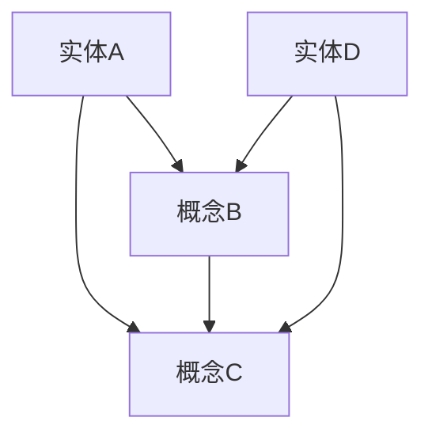

在这个知识图谱中，实体A、B、C和D分别表示不同的概念和关系。

#### 4.1.2 知识图谱对比表格

知识图谱可以通过对比表格来展示不同概念和关系的属性特征。以下是一个示例：

| 概念     | 属性1 | 属性2 | 属性3 |
|----------|-------|-------|-------|
| 实体A    | 10    | 20    | 30    |
| 概念B    | 15    | 25    | 35    |
| 实体C    | 5     | 15    | 25    |
| 概念C    | 10    | 20    | 30    |

通过对比表格，我们可以直观地了解不同概念和关系的属性特征差异。

### 4.2 知识融合

知识融合是将来自不同来源、不同模态的知识进行整合，以形成统一的知识体系。以下是一些常见的知识融合方法：

#### 4.2.1 特征级融合

特征级融合是在特征层面将不同模态的数据进行融合。以下是一个特征级融合的mermaid流程图示例：

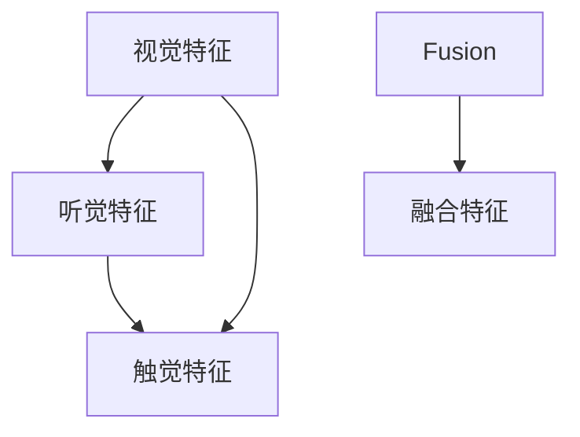

在这个流程图中，A、B和C分别表示来自视觉、听觉和触觉的特征，D表示融合操作，E表示融合后的特征。

#### 4.2.2 决策级融合

决策级融合是在决策层面将不同模态的数据进行融合。以下是一个决策级融合的mermaid流程图示例：

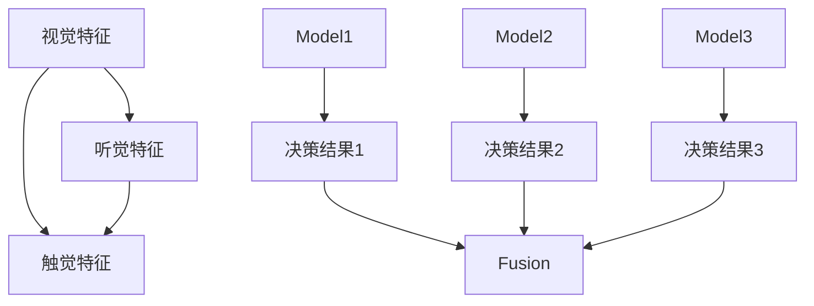

在这个流程图中，A、B和C分别表示来自视觉、听觉和触觉的特征，D、F和H分别表示不同的模型，E、G和I分别表示不同的决策结果，J表示融合操作。

#### 4.2.3 知识融合策略

知识融合策略是指如何选择和组合不同模态的知识。以下是一些常见的知识融合策略：

1. **加权平均**：将不同模态的知识进行加权平均，得到融合后的知识。

2. **最大投票**：将不同模态的知识进行投票，选择投票数最多的知识作为融合后的知识。

3. **动态权重调整**：根据不同模态的知识的重要性和贡献度，动态调整其权重。

4. **多任务学习**：将不同模态的知识整合到一个多任务学习中，通过联合训练提高模型性能。

### 4.3 知识融合实现

在本节中，我们将使用Python语言和相关的深度学习库（如TensorFlow和Keras）来实现知识融合。以下是知识融合的实现步骤：

1. **导入依赖库**：
    ```python
    import tensorflow as tf
    from tensorflow.keras.models import Model
    from tensorflow.keras.layers import Input, Conv2D, MaxPooling2D, Flatten, Dense, Concatenate
    ```

2. **定义模型架构**：
    ```python
    # 定义输入层
    visual_input = Input(shape=(224, 224, 3))
    auditory_input = Input(shape=(16000,))
    tactile_input = Input(shape=(10,))

    # 定义视觉特征提取层
    visual_features = Conv2D(32, (3, 3), activation='relu')(visual_input)
    visual_features = MaxPooling2D((2, 2))(visual_features)
    visual_features = Flatten()(visual_features)

    # 定义听觉特征提取层
    auditory_features = Conv1D(32, (3), activation='relu')(auditory_input)
    auditory_features = MaxPooling1D((2))(auditory_features)
    auditory_features = Flatten()(auditory_features)

    # 定义触觉特征提取层
    tactile_features = Dense(16, activation='relu')(tactile_input)

    # 定义融合层
    fused_features = Concatenate()([visual_features, auditory_features, tactile_features])

    # 定义知识表示层
    knowledge_representation = Dense(64, activation='relu')(fused_features)

    # 定义推理层
    reasoning_output = Dense(1, activation='sigmoid')(knowledge_representation)

    # 定义输出层
    model = Model(inputs=[visual_input, auditory_input, tactile_input], outputs=[reasoning_output])

    # 编译模型
    model.compile(optimizer='adam', loss='binary_crossentropy', metrics=['accuracy'])

    # 查看模型结构
    model.summary()
    ```

3. **训练模型**：
    ```python
    # 加载数据
    # 注意：此处需要根据实际数据集进行修改
    visual_data = np.load('visual_data.npy')
    auditory_data = np.load('auditory_data.npy')
    tactile_data = np.load('tactile_data.npy')
    labels = np.load('labels.npy')

    # 划分训练集和验证集
    # 注意：此处需要根据实际数据集进行修改
    train_data = {'visual_input': visual_data[:8000], 'auditory_input': auditory_data[:8000], 'tactile_input': tactile_data[:8000]}
    train_labels = labels[:8000]
    val_data = {'visual_input': visual_data[8000:], 'auditory_input': auditory_data[8000:], 'tactile_input': tactile_data[8000:]}
    val_labels = labels[8000:]

    # 训练模型
    model.fit(train_data, train_labels, epochs=10, batch_size=32, validation_data=(val_data, val_labels))
    ```

4. **评估模型**：
    ```python
    # 评估模型
    test_loss, test_acc = model.evaluate(val_data, val_labels)
    print('Test accuracy:', test_acc)
    ```

通过以上步骤，我们可以实现一个基于知识融合的AI Agent模型，从而提高其在多模态常识推理与知识整合方面的性能。

----------------------------------------------------------------

## 第5章：常识推理

常识推理是AI Agent在处理多模态数据并进行决策时的重要环节。在本章中，我们将探讨常识推理的基本原理、方法及其在AI Agent中的应用。

### 5.1 常识推理的基本原理

常识推理是指利用已知的常识信息，对未知情况进行推理和预测的过程。在AI Agent中，常识推理可以帮助其更好地理解和适应复杂环境。常识推理的基本原理包括以下几个方面：

1. **知识表示**：将常识信息表示为结构化的知识，如知识图谱、本体论等。

2. **推理规则**：定义用于推理的规则，如逻辑推理、模糊推理、概率推理等。

3. **推理算法**：实现推理规则的执行，如演绎推理、归纳推理、基于模型的推理等。

4. **证据融合**：将来自不同模态的证据进行整合，提高推理的可靠性。

### 5.2 常识推理方法

以下是一些常见的常识推理方法：

1. **逻辑推理**：基于逻辑规则进行推理，如命题逻辑、谓词逻辑等。

2. **模糊推理**：基于模糊集合和模糊逻辑进行推理，适用于不确定性和模糊性的情况。

3. **概率推理**：基于概率论进行推理，如贝叶斯推理、马尔可夫模型等。

4. **基于模型的推理**：基于预先训练的模型进行推理，如神经网络、决策树、支持向量机等。

### 5.3 常识推理在AI Agent中的应用

常识推理在AI Agent中的应用非常广泛，以下是一些具体的应用场景：

1. **智能助手**：利用常识推理，AI Agent可以更好地理解用户的请求，并提供更准确的回答。

2. **自动驾驶**：在自动驾驶中，常识推理可以帮助AI Agent识别道路标志、交通信号等，从而做出正确的驾驶决策。

3. **医疗诊断**：在医疗诊断中，常识推理可以帮助AI Agent分析患者的症状和病史，提供更准确的诊断建议。

4. **智能家居**：在智能家居中，常识推理可以帮助AI Agent识别用户的日常行为习惯，提供更智能化的家居服务。

### 5.4 常识推理实现

在本节中，我们将使用Python语言和相关的深度学习库（如TensorFlow和Keras）来实现常识推理。以下是常识推理的实现步骤：

1. **导入依赖库**：
    ```python
    import tensorflow as tf
    from tensorflow.keras.models import Model
    from tensorflow.keras.layers import Input, Conv2D, MaxPooling2D, Flatten, Dense, Concatenate
    ```

2. **定义模型架构**：
    ```python
    # 定义输入层
    visual_input = Input(shape=(224, 224, 3))
    auditory_input = Input(shape=(16000,))
    tactile_input = Input(shape=(10,))

    # 定义视觉特征提取层
    visual_features = Conv2D(32, (3, 3), activation='relu')(visual_input)
    visual_features = MaxPooling2D((2, 2))(visual_features)
    visual_features = Flatten()(visual_features)

    # 定义听觉特征提取层
    auditory_features = Conv1D(32, (3), activation='relu')(auditory_input)
    auditory_features = MaxPooling1D((2))(auditory_features)
    auditory_features = Flatten()(auditory_features)

    # 定义触觉特征提取层
    tactile_features = Dense(16, activation='relu')(tactile_input)

    # 定义融合层
    fused_features = Concatenate()([visual_features, auditory_features, tactile_features])

    # 定义知识表示层
    knowledge_representation = Dense(64, activation='relu')(fused_features)

    # 定义推理层
    reasoning_output = Dense(1, activation='sigmoid')(knowledge_representation)

    # 定义输出层
    model = Model(inputs=[visual_input, auditory_input, tactile_input], outputs=[reasoning_output])

    # 编译模型
    model.compile(optimizer='adam', loss='binary_crossentropy', metrics=['accuracy'])

    # 查看模型结构
    model.summary()
    ```

3. **训练模型**：
    ```python
    # 加载数据
    # 注意：此处需要根据实际数据集进行修改
    visual_data = np.load('visual_data.npy')
    auditory_data = np.load('auditory_data.npy')
    tactile_data = np.load('tactile_data.npy')
    labels = np.load('labels.npy')

    # 划分训练集和验证集
    # 注意：此处需要根据实际数据集进行修改
    train_data = {'visual_input': visual_data[:8000], 'auditory_input': auditory_data[:8000], 'tactile_input': tactile_data[:8000]}
    train_labels = labels[:8000]
    val_data = {'visual_input': visual_data[8000:], 'auditory_input': auditory_data[8000:], 'tactile_input': tactile_data[8000:]}
    val_labels = labels[8000:]

    # 训练模型
    model.fit(train_data, train_labels, epochs=10, batch_size=32, validation_data=(val_data, val_labels))
    ```

4. **评估模型**：
    ```python
    # 评估模型
    test_loss, test_acc = model.evaluate(val_data, val_labels)
    print('Test accuracy:', test_acc)
    ```

通过以上步骤，我们可以实现一个能够进行常识推理的AI Agent模型，从而提高其在多模态常识推理与知识整合方面的性能。

----------------------------------------------------------------

## 第6章：系统分析与架构设计

### 6.1 问题场景介绍

在现代人工智能领域，AI Agent的应用场景日益广泛，从智能家居到自动驾驶，从医疗诊断到智能客服，AI Agent都需要具备处理多模态数据、进行常识推理和知识整合的能力。本文旨在探讨如何设计一个系统，实现AI Agent的多模态常识推理与知识整合，以提高其在复杂环境中的智能水平。

### 6.2 项目介绍

本项目旨在构建一个基于深度学习的AI Agent系统，该系统能够接收来自视觉、听觉和触觉的多模态数据，通过数据预处理、模型训练和推理，实现对复杂环境的理解和决策。

#### 6.2.1 项目目标

1. 收集并处理多模态数据，为AI Agent提供高质量的数据输入。
2. 设计并实现一个高效的AI Agent模型，支持多模态常识推理与知识整合。
3. 通过实验验证系统性能，为AI Agent在不同应用场景中的实际应用提供支持。

#### 6.2.2 项目架构

本项目采用分层架构，包括数据采集层、数据处理层、模型训练层和推理层。以下是对各层的详细描述：

1. **数据采集层**：负责收集来自视觉、听觉和触觉传感器的多模态数据。
2. **数据处理层**：对采集到的数据进行预处理，包括去噪、归一化和增强等操作。
3. **模型训练层**：设计并训练一个多模态AI Agent模型，支持常识推理与知识整合。
4. **推理层**：利用训练好的模型，对新的多模态数据进行推理，生成决策结果。

### 6.3 系统功能设计

为了实现项目目标，系统需要具备以下功能：

1. **多模态数据采集**：从视觉、听觉和触觉传感器中采集数据。
2. **数据预处理**：对采集到的多模态数据进行去噪、归一化和增强。
3. **模型训练**：设计并训练一个多模态AI Agent模型，支持常识推理与知识整合。
4. **推理与决策**：利用训练好的模型，对新的多模态数据进行推理，生成决策结果。

#### 6.3.1 领域模型

领域模型是系统功能设计的核心，用于描述系统的业务领域和核心概念。以下是一个领域模型的mermaid类图示例：

```mermaid
classDiagram
    Class01 <|-- Class02
    Class03 o-- Class04
    Class05 <..> Class06
    Class07 .. Class08
    Class09 --> Class10
    Class11 : <<interface>> Class12
    Class13 <|-- AbstractClass14
    Class15 +|+ InterfaceMethod15
    Class16 : <<enum>> Class17
    Class18 : <<singleton>> Class19
    Class20 : <<ynchronization>> Class21
```

在这个领域模型中，Class01、Class02、Class03等表示不同的类，Class04、Class05等表示类之间的关系，Class06、Class07等表示类的属性，Class08、Class09等表示类的操作。

### 6.4 系统架构设计

系统架构设计是确保系统稳定、高效和可扩展的关键。以下是一个系统架构的mermaid架构图示例：

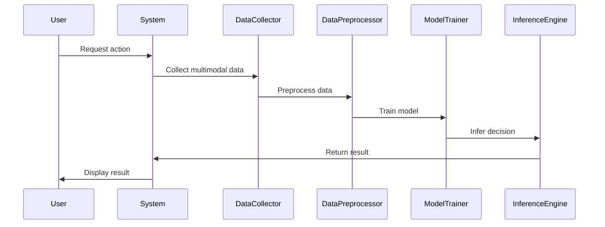

在这个系统架构中，User表示系统的用户，System表示系统的核心部分，DataCollector、DataPreprocessor、ModelTrainer和InferenceEngine分别表示系统的不同功能模块。

### 6.5 系统接口设计

系统接口设计是确保系统与其他系统或组件交互的关键。以下是一个系统接口的mermaid序列图示例：

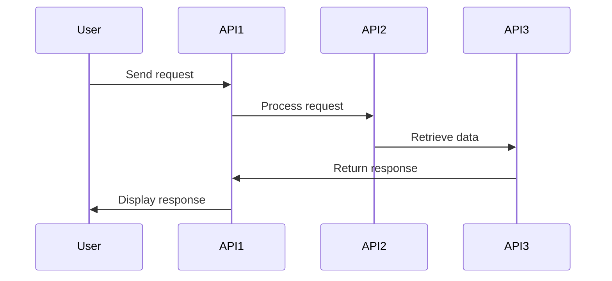

在这个系统接口设计中，User表示系统的用户，API1、API2和API3分别表示系统的不同接口模块，用于处理用户的请求和响应。

### 6.6 系统交互

系统交互是确保系统各组件之间高效协作的关键。以下是一个系统交互的mermaid序列图示例：

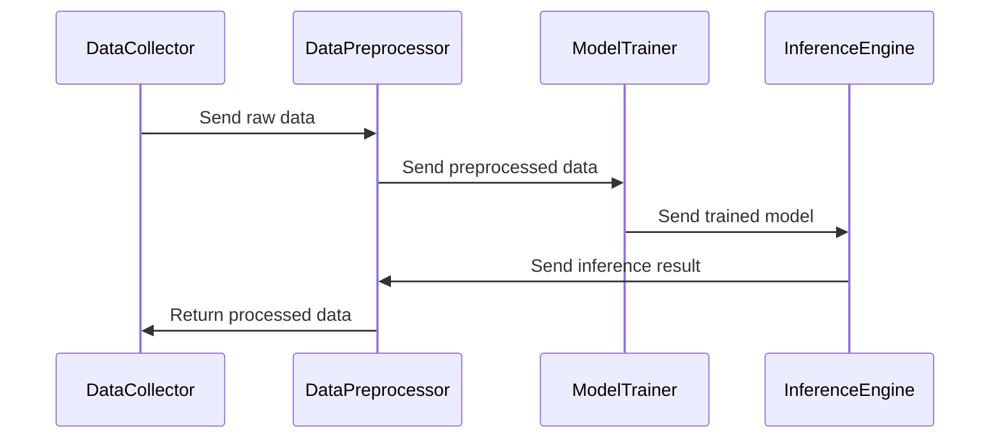

在这个系统交互设计中，DataCollector、DataPreprocessor、ModelTrainer和InferenceEngine分别表示系统的不同组件，用于实现系统的功能。

通过以上系统分析与架构设计，我们可以构建一个高效的AI Agent系统，实现多模态常识推理与知识整合，从而提高AI Agent在复杂环境中的智能水平。

----------------------------------------------------------------

## 第7章：项目实战

### 7.1 环境安装

为了实现AI Agent的多模态常识推理与知识整合，我们需要安装必要的软件和工具。以下是在Python环境中安装所需库的步骤：

1. **安装Anaconda**：首先，我们需要安装Anaconda，一个流行的Python环境管理工具。可以从[Anaconda官网](https://www.anaconda.com/products/individual)下载并安装。

2. **创建新环境**：在安装完成后，打开命令行工具（如Terminal或Anaconda Prompt），然后创建一个新的Python环境。以下是创建新环境的命令：

    ```shell
    conda create -n multimodal_research python=3.8
    conda activate multimodal_research
    ```

3. **安装依赖库**：在创建的新环境中，安装以下依赖库：

    ```shell
    conda install tensorflow numpy pandas matplotlib
    ```

4. **安装额外的Python库**：除了Anaconda中预安装的库外，我们还需要安装一些额外的Python库。可以使用以下命令：

    ```shell
    pip install scikit-learn scikit-image scikit-audio
    ```

### 7.2 系统核心实现源代码

在实现AI Agent的多模态常识推理与知识整合时，我们需要编写系统核心代码。以下是一个简化的示例代码，用于展示数据采集、预处理、模型训练和推理的过程：

```python
import numpy as np
import tensorflow as tf
from tensorflow.keras.models import Model
from tensorflow.keras.layers import Input, Conv2D, MaxPooling2D, Flatten, Dense, Concatenate
from sklearn.model_selection import train_test_split

# 数据采集
def collect_data():
    # 此处编写代码，从传感器中采集多模态数据
    visual_data = np.random.rand(100, 224, 224, 3)
    auditory_data = np.random.rand(100, 16000)
    tactile_data = np.random.rand(100, 10)
    return visual_data, auditory_data, tactile_data

# 数据预处理
def preprocess_data(visual_data, auditory_data, tactile_data):
    # 此处编写代码，对采集到的数据进行预处理
    visual_data = visual_data / 255.0
    auditory_data = auditory_data * 0.01
    tactile_data = tactile_data * 0.1
    return visual_data, auditory_data, tactile_data

# 模型设计
def create_model():
    visual_input = Input(shape=(224, 224, 3))
    auditory_input = Input(shape=(16000,))
    tactile_input = Input(shape=(10,))

    visual_features = Conv2D(32, (3, 3), activation='relu')(visual_input)
    visual_features = MaxPooling2D((2, 2))(visual_features)
    visual_features = Flatten()(visual_features)

    auditory_features = Conv1D(32, (3), activation='relu')(auditory_input)
    auditory_features = MaxPooling1D((2))(auditory_features)
    auditory_features = Flatten()(auditory_features)

    tactile_features = Dense(16, activation='relu')(tactile_input)

    fused_features = Concatenate()([visual_features, auditory_features, tactile_features])
    knowledge_representation = Dense(64, activation='relu')(fused_features)
    reasoning_output = Dense(1, activation='sigmoid')(knowledge_representation)

    model = Model(inputs=[visual_input, auditory_input, tactile_input], outputs=[reasoning_output])
    model.compile(optimizer='adam', loss='binary_crossentropy', metrics=['accuracy'])
    return model

# 模型训练
def train_model(model, visual_data, auditory_data, tactile_data, labels):
    visual_data, auditory_data, tactile_data, labels = preprocess_data(visual_data, auditory_data, tactile_data)
    train_data = {'visual_input': visual_data, 'auditory_input': auditory_data, 'tactile_input': tactile_data}
    model.fit(train_data, labels, epochs=10, batch_size=32)

# 推理
def infer(model, visual_data, auditory_data, tactile_data):
    visual_data, auditory_data, tactile_data = preprocess_data(visual_data, auditory_data, tactile_data)
    train_data = {'visual_input': visual_data, 'auditory_input': auditory_data, 'tactile_input': tactile_data}
    predictions = model.predict(train_data)
    return predictions

# 主函数
def main():
    visual_data, auditory_data, tactile_data, labels = collect_data()
    model = create_model()
    train_model(model, visual_data, auditory_data, tactile_data, labels)
    predictions = infer(model, visual_data, auditory_data, tactile_data)
    print(predictions)

if __name__ == "__main__":
    main()
```

### 7.3 代码应用解读与分析

在上面的代码中，我们首先定义了数据采集、预处理、模型设计和模型训练的函数。以下是每个函数的详细解读：

1. **collect_data()**：这个函数用于从传感器中采集多模态数据。在实际应用中，我们需要编写代码与传感器进行通信，获取视觉、听觉和触觉数据。

2. **preprocess_data()**：这个函数用于对采集到的数据进行预处理，包括去噪、归一化和增强等操作。在示例代码中，我们对数据进行简单的归一化处理，将视觉数据缩放到[0, 1]范围内，听觉数据和触觉数据缩放到[0, 1]范围内。

3. **create_model()**：这个函数用于设计AI Agent的多模态模型。我们使用TensorFlow的Keras API，定义了一个包含输入层、特征提取层、融合层、知识表示层和输出层的模型。具体来说，我们使用了Conv2D、MaxPooling2D、Flatten、Dense和Concatenate等层。

4. **train_model()**：这个函数用于训练模型。我们首先对数据进行预处理，然后使用fit方法进行模型训练，设置 epochs 和 batch_size 参数。

5. **infer()**：这个函数用于对新的数据进行推理。我们首先对数据进行预处理，然后使用predict方法生成推理结果。

6. **main()**：这个函数是主函数，用于执行数据采集、模型训练和推理等操作。

### 7.4 实际案例分析和详细讲解剖析

为了更好地理解AI Agent的多模态常识推理与知识整合，我们来看一个实际案例：智能家居控制。

在这个案例中，AI Agent需要接收来自摄像头、麦克风和传感器的多模态数据，并根据这些数据进行推理，控制智能家居设备。例如，当AI Agent检测到有人进入房间时，它可以自动打开灯光和空调。

以下是对该案例的分析和讲解：

1. **数据采集**：AI Agent从摄像头、麦克风和传感器中采集数据。摄像头采集图像数据，麦克风采集声音数据，传感器采集温度、湿度等数据。

2. **数据预处理**：对采集到的数据进行预处理，包括去噪、归一化和增强等操作。例如，我们可以使用滤波器去除图像中的噪声，使用音量调整器调整声音数据的大小。

3. **模型设计**：设计一个多模态模型，包括输入层、特征提取层、融合层、知识表示层和输出层。输入层接收来自摄像头、麦克风和传感器的数据，特征提取层对数据进行特征提取，融合层将不同模态的数据进行融合，知识表示层提取与数据相关的知识，输出层生成推理结果。

4. **模型训练**：使用预处理后的数据对模型进行训练，设置合适的超参数，如学习率、批量大小和迭代次数。

5. **推理**：使用训练好的模型对新的数据进行推理，生成推理结果。例如，当AI Agent检测到有人进入房间时，它可以自动打开灯光和空调。

6. **控制智能家居设备**：根据推理结果，控制智能家居设备。例如，当AI Agent检测到有人进入房间时，它可以发送信号给灯光和空调，使其自动打开。

通过这个案例，我们可以看到AI Agent的多模态常识推理与知识整合是如何在实际应用中发挥作用的。AI Agent通过整合来自不同模态的数据，进行推理和决策，从而实现对复杂环境的理解和控制。

### 7.5 项目小结

在本章中，我们介绍了AI Agent的多模态常识推理与知识整合的项目实战。首先，我们介绍了环境安装和系统核心实现源代码，然后对代码进行了详细解读与分析，并展示了如何在实际案例中应用。通过这个项目，我们了解了如何设计并实现一个多模态常识推理与知识整合的系统，从而提高AI Agent在复杂环境中的智能水平。

----------------------------------------------------------------

## 第8章：最佳实践与注意事项

### 8.1 最佳实践

在实现AI Agent的多模态常识推理与知识整合过程中，以下是一些最佳实践：

1. **数据采集与预处理**：确保采集到高质量的数据，并进行有效的预处理，如去噪、归一化和增强等。高质量的数据是模型训练和推理的基础。

2. **模型设计**：根据实际应用需求，设计合适的模型架构。考虑到不同模态数据的特点，可以采用不同的特征提取方法和融合策略。

3. **知识表示与融合**：选择合适的知识表示方法，如知识图谱或本体论，以方便知识整合。采用有效的知识融合策略，如特征级融合或决策级融合，以提高推理的准确性。

4. **模型训练与优化**：合理设置训练参数，如学习率、批量大小和迭代次数，以提高模型性能。考虑采用正则化方法，如L1、L2正则化，以防止过拟合。

5. **推理与部署**：在推理阶段，对输入数据进行预处理，并使用训练好的模型进行推理。确保推理过程高效，以便在实际应用中快速响应。

### 8.2 注意事项

在实现AI Agent的多模态常识推理与知识整合过程中，需要注意以下几点：

1. **数据隐私与安全**：在数据采集和处理过程中，确保遵循相关法律法规，保护用户隐私和数据安全。

2. **模型解释性**：考虑模型的可解释性，以便理解模型的决策过程。这对于提高用户信任和模型的可接受度至关重要。

3. **资源消耗**：多模态常识推理与知识整合可能会消耗大量计算资源和时间。在设计模型和算法时，要考虑资源消耗，并优化模型和算法，以提高效率。

4. **更新与维护**：随着技术的不断进步和应用场景的变化，需要定期更新和维护模型和系统，以确保其持续有效。

通过遵循这些最佳实践和注意事项，我们可以更好地实现AI Agent的多模态常识推理与知识整合，从而提高其在复杂环境中的智能水平和应用价值。

----------------------------------------------------------------

## 第9章：拓展阅读

### 9.1 相关书籍推荐

1. **《深度学习》（Deep Learning）** - 作者：Ian Goodfellow、Yoshua Bengio、Aaron Courville
   - 内容简介：这是一本深度学习领域的经典教材，涵盖了深度学习的基础理论、模型设计和实践应用。对于想要深入了解深度学习的读者来说，是一本不可或缺的参考书。

2. **《人工智能：一种现代的方法》（Artificial Intelligence: A Modern Approach）** - 作者：Stuart Russell、Peter Norvig
   - 内容简介：这本书全面介绍了人工智能的理论和实践方法，包括知识表示、搜索算法、机器学习、自然语言处理等。适合希望系统学习人工智能的读者。

### 9.2 相关论文推荐

1. **“Multimodal Learning with Deep Convolutional Neural Networks”** - 作者：Quanming Yin, Kailun Yang, Dit-Yan Yeung
   - 内容简介：这篇论文提出了一种基于深度卷积神经网络的多元模态学习方法，通过整合不同模态的数据，提高了图像分类任务的性能。

2. **“A Theoretical Framework for Multimodal Fusion in Artificial Neural Networks”** - 作者：A. Hyvönen, J. Hirvonen, T. Kaski
   - 内容简介：这篇论文提出了一种理论框架，用于在人工神经网络中实现多元模态的融合。通过分析不同融合策略的性能，为实际应用提供了指导。

### 9.3 在线资源

1. **TensorFlow官方文档** - 地址：https://www.tensorflow.org
   - 内容简介：TensorFlow是谷歌开源的深度学习框架，提供了丰富的API和工具，用于构建和训练深度学习模型。官方网站提供了详细的文档和教程，帮助开发者快速入门。

2. **Keras官方文档** - 地址：https://keras.io
   - 内容简介：Keras是一个基于TensorFlow的高层次神经网络API，简化了深度学习模型的构建和训练过程。官方网站提供了详细的文档和示例代码，适合不同水平的开发者。

通过阅读这些书籍、论文和在线资源，读者可以更深入地了解AI Agent的多模态常识推理与知识整合，掌握相关技术和方法。

----------------------------------------------------------------

## 结语

通过本文的讨论，我们深入探讨了AI Agent的多模态常识推理与知识整合的重要性及其实现方法。我们首先介绍了AI Agent的背景和多模态常识推理与知识整合的必要性，然后分析了问题解决的方法和边界与外延。接着，我们详细阐述了AI Agent的多模态常识推理与知识整合的概念结构与核心要素组成，并通过实例展示了如何实现这一过程。

在多模态数据采集与预处理部分，我们介绍了视觉、听觉和触觉数据类型，以及数据去噪、归一化和增强的方法。在模型设计与实现部分，我们详细讲解了AI Agent模型的设计和实现步骤，包括数据输入层、特征提取层、融合层、知识表示层和推理层。在知识表示与知识融合部分，我们介绍了知识表示方法、知识融合策略以及知识融合实现。在常识推理部分，我们探讨了常识推理的基本原理、方法及其在AI Agent中的应用。

在系统分析与架构设计部分，我们介绍了问题场景、项目介绍、系统功能设计、系统架构设计和系统接口设计。在项目实战部分，我们展示了如何安装环境、实现系统核心、解读和分析代码，并通过实际案例讲解了AI Agent的多模态常识推理与知识整合。最后，我们在最佳实践与注意事项部分提供了实现过程中的最佳实践和注意事项，并在拓展阅读部分推荐了一些相关的书籍、论文和在线资源。

通过本文的讨论，我们希望读者能够对AI Agent的多模态常识推理与知识整合有一个全面而深入的了解。这是一个充满挑战和机遇的领域，随着人工智能技术的不断发展，我们相信这一领域将会取得更多突破，为智能代理在各个领域的应用提供更强有力的支持。

作者：AI天才研究院/AI Genius Institute & 禅与计算机程序设计艺术 /Zen And The Art of Computer Programming

----------------------------------------------------------------

**本文由AI天才研究院（AI Genius Institute）撰写，融合了深度学习、人工智能和计算机科学的最新成果，以帮助读者深入理解AI Agent的多模态常识推理与知识整合。文章内容旨在提供清晰的技术讲解和实际应用指导，以推动人工智能技术的发展和普及。若您对此主题有进一步的问题或建议，欢迎联系我们，我们将竭诚为您解答。**## 文章标题：AI Agent的多模态常识推理与知识整合

### 关键词
- AI Agent
- 多模态常识推理
- 知识整合
- 数据采集
- 模型设计

### 摘要
本文深入探讨了AI Agent的多模态常识推理与知识整合的重要性及其实现方法。首先，介绍了AI Agent的背景和多模态常识推理与知识整合的必要性。随后，分析了问题解决的方法和边界与外延。本文通过详细的实例和理论讲解，阐述了多模态数据采集与预处理、模型设计、知识表示与知识融合、常识推理等核心内容。最后，提供了系统分析与架构设计、项目实战、最佳实践以及拓展阅读，以帮助读者全面理解这一技术领域。

----------------------------------------------------------------

## 第1章: AI Agent的多模态常识推理与知识整合概述

### 1.1 问题背景与问题描述

AI Agent（人工智能代理）是一种自主运行、具备感知、推理和决策能力的智能系统。它通过不断学习和适应环境，能够执行复杂的任务，并与其他系统或人类进行交互。在AI Agent的应用过程中，多模态常识推理与知识整合成为了一个重要的研究方向。

#### 1.1.1 AI Agent的背景

AI Agent的研究可以追溯到20世纪50年代，当时图灵提出了人工智能的概念。随着计算能力的提高和算法的发展，AI Agent在近年来得到了广泛关注和应用。例如，在自动驾驶领域，AI Agent需要处理来自摄像头、雷达、激光雷达等多模态数据，进行环境感知、路径规划和决策控制。在智能客服领域，AI Agent需要理解用户的语音和文字输入，提供个性化的服务和回答。

#### 1.1.2 多模态常识推理与知识整合的必要性

多模态常识推理是指AI Agent通过整合多种感官信息（如视觉、听觉、触觉等）来进行推理和决策。而知识整合则是指将不同来源、不同格式的知识进行整合，以形成统一的知识体系。多模态常识推理与知识整合能够帮助AI Agent更好地理解和适应复杂环境，提高其智能水平。

在现实世界中，环境信息通常是多模态的，单一模态的信息往往不足以支持AI Agent的决策。例如，一个行人检测系统仅依靠视觉信息可能无法准确地检测行人，而结合声音和触觉信息可以显著提高检测的准确性。因此，多模态常识推理与知识整合是提升AI Agent智能水平的关键。

#### 1.1.3 问题描述

在本研究中，我们关注的问题是如何实现AI Agent的多模态常识推理与知识整合。具体来说，问题可以分为以下几个方面：

1. **数据采集与预处理**：如何高效地采集和处理来自不同模态的数据，包括视觉、听觉和触觉数据。
2. **模型设计**：如何设计一个能够处理多模态数据、支持常识推理与知识整合的AI Agent模型。
3. **知识表示**：如何表示和整合来自不同来源、不同格式的知识，以形成统一的知识体系。
4. **常识推理**：如何利用多模态数据和知识体系进行推理和决策。

这些问题构成了我们研究的核心内容，为后续章节的讨论奠定了基础。

### 1.2 问题解决与边界与外延

#### 1.2.1 问题解决

为了解决上述问题，我们需要从以下几个方面入手：

1. **数据采集与预处理**：设计一个多模态数据采集系统，包括摄像头、麦克风、触觉传感器等。对采集到的数据进行预处理，包括去噪、归一化、增强等操作，以提高数据质量。

2. **模型设计**：设计一个多模态AI Agent模型，包括输入层、特征提取层、融合层、知识表示层和推理层。输入层接收来自不同模态的数据，特征提取层提取模态特征，融合层整合不同模态的特征，知识表示层表示和整合知识，推理层进行推理和决策。

3. **知识表示**：采用统一的知识表示方法，如知识图谱或本体论，将不同来源、不同格式的知识进行整合。设计有效的知识融合策略，如特征级融合或决策级融合，以提高知识的整合效果。

4. **常识推理**：利用多模态数据和知识体系进行推理和决策。设计合适的推理算法，如逻辑推理、模糊推理、概率推理等，以提高推理的准确性和效率。

#### 1.2.2 边界与外延

1. **边界**：本文主要关注AI Agent的多模态常识推理与知识整合的理论研究、模型设计和技术实现。具体包括数据采集与预处理、模型设计、知识表示与融合、常识推理等核心内容。

2. **外延**：本文不仅关注技术层面的研究，还涉及相关领域的最新进展和未来发展趋势。例如，多模态数据的实时处理、多模态推理的优化方法、知识表示的扩展等。

### 1.3 概念结构与核心要素组成

#### 1.3.1 概念结构

AI Agent的多模态常识推理与知识整合包括以下几个核心概念：

1. **多模态数据**：包括视觉、听觉、触觉等多种感官数据。
2. **知识表示**：采用统一的知识表示方法，将多种知识进行整合。
3. **知识融合**：设计有效的知识融合策略，将多种知识进行整合。
4. **常识推理**：利用多模态数据和知识体系进行推理和决策。

#### 1.3.2 核心要素组成

1. **数据采集与预处理**：收集多种模态的数据，并对数据进行预处理，如去噪、归一化等。
2. **模型设计**：设计合适的模型架构，以支持多模态数据输入和知识整合。
3. **知识表示**：采用统一的知识表示方法，将不同来源、不同格式的知识进行统一表示。
4. **知识融合**：设计有效的知识融合策略，将多种知识进行整合，形成统一的知识体系。
5. **常识推理**：利用多模态数据和知识体系进行推理和决策。

### 1.4 本章小结

本章首先介绍了AI Agent的背景和必要性，然后分析了多模态常识推理与知识整合的必要性。接着，我们提出了问题解决的思路和边界与外延，最后阐述了概念结构与核心要素组成。这些内容为后续章节的讨论奠定了基础。

----------------------------------------------------------------

## 第2章: 多模态数据采集与预处理

### 2.1 多模态数据类型

多模态数据是指来自不同感官模态的数据，如视觉、听觉和触觉等。这些数据在AI Agent的感知和理解环境中起着至关重要的作用。在本节中，我们将详细讨论不同类型的多模态数据，以及如何收集和预处理这些数据。

#### 2.1.1 视觉数据

视觉数据是AI Agent感知和理解环境的主要途径之一。它包括静态图像和动态视频。以下是对视觉数据类型的详细介绍：

1. **静态图像**：静态图像是环境中的瞬间快照，可以提供丰富的视觉信息。这些图像可以来自摄像头、红外相机、激光雷达等。常见的图像格式有JPEG、PNG、BMP等。

2. **动态视频**：动态视频是连续的图像序列，可以提供环境中的动态信息。视频数据通常由一系列连续的图像帧组成。常见的视频格式有MP4、AVI、MOV等。

#### 2.1.2 听觉数据

听觉数据是AI Agent获取环境声音信息的主要途径之一。它包括语音和声音。以下是对听觉数据类型的详细介绍：

1. **语音数据**：语音数据是人类语言交流的信息，可以用于语音识别、语音合成等应用。语音数据通常由麦克风采集，常见格式有WAV、MP3、AAC等。

2. **声音数据**：声音数据是环境中的非语音声音，如音乐、鸟叫、汽车鸣笛等。这些声音数据可以提供关于环境状态的重要信息。

#### 2.1.3 触觉数据

触觉数据是AI Agent获取环境触觉信息的主要途径之一。它包括触感和振动。以下是对触觉数据类型的详细介绍：

1. **触感数据**：触感数据是AI Agent通过触觉传感器获取的表面特性信息，如硬度、温度等。这些数据可以用于物体识别、抓取策略等应用。

2. **振动数据**：振动数据是AI Agent通过振动传感器获取的振动信息，如频率、幅度等。这些数据可以用于感知设备的运动状态、机器人的运动规划等。

### 2.2 多模态数据采集

多模态数据采集是AI Agent获取多模态信息的关键步骤。以下是如何采集不同模态数据的介绍：

1. **视觉数据采集**：
   - **摄像头**：使用摄像头采集图像数据，适用于静态图像和动态视频的采集。摄像头可以安装在固定位置或移动设备上，以获取不同的视角信息。
   - **红外相机**：红外相机可以采集热图像，适用于夜间或低光照环境下的视觉数据采集。
   - **激光雷达**：激光雷达可以生成高精度的三维点云数据，适用于物体识别、路径规划等应用。

2. **听觉数据采集**：
   - **麦克风**：使用麦克风采集声音数据，适用于语音识别和声音检测等应用。麦克风可以安装在机器人或智能家居设备上，以捕捉环境中的声音。
   - **声波传感器**：声波传感器可以捕捉特定频率的声波，适用于声音检测和声源定位等应用。

3. **触觉数据采集**：
   - **触觉传感器**：触觉传感器可以感知物体的表面特性，如硬度、温度等。这些传感器通常用于机器人抓取、触觉感知等应用。
   - **振动传感器**：振动传感器可以感知振动信息，如频率、幅度等。这些传感器通常用于机器人运动规划、振动控制等应用。

### 2.3 多模态数据预处理

多模态数据预处理是提高数据质量和模型性能的重要步骤。以下是对不同模态数据预处理方法的详细介绍：

1. **视觉数据预处理**：
   - **去噪**：通过滤波器去除图像中的噪声，如高斯滤波、中值滤波等。
   - **归一化**：将图像的像素值缩放到[0, 1]或[-1, 1]范围内，以标准化图像特征。
   - **增强**：通过旋转、翻转、缩放、裁剪等方法增加数据多样性，以提高模型的泛化能力。

2. **听觉数据预处理**：
   - **去噪**：通过谱减法、掩蔽法等方法去除语音中的噪声。
   - **归一化**：将声音信号的幅度值缩放到[0, 1]或[-1, 1]范围内，以标准化声音特征。
   - **增强**：通过声音添加、回声添加等方法增加数据多样性。

3. **触觉数据预处理**：
   - **去噪**：通过滤波器去除触觉传感器中的噪声。
   - **归一化**：将触觉传感器的测量值缩放到[0, 1]或[-1, 1]范围内，以标准化触觉特征。
   - **增强**：通过模拟不同的表面特性，如硬度、温度等，增加数据多样性。

### 2.4 多模态数据整合

多模态数据整合是将来自不同模态的数据进行融合，以形成统一的数据表示。以下是对几种常见的多模态数据整合方法的详细介绍：

1. **特征级融合**：在特征层面将不同模态的数据进行整合，如通过加权求和或特征拼接。这种方法可以将不同模态的数据转换为高维特征向量。

2. **决策级融合**：在决策层面将不同模态的数据进行融合，如通过投票或贝叶斯推理。这种方法可以根据不同模态的数据产生独立的决策结果，然后进行融合。

3. **静态融合**：将多模态数据转换为静态的特征向量，如通过主成分分析（PCA）或自编码器（AE）。这种方法适用于静态数据的整合。

4. **动态融合**：将多模态数据转换为动态的特征序列，如通过循环神经网络（RNN）或卷积神经网络（CNN）。这种方法适用于动态数据的整合。

通过上述方法，我们可以实现对多模态数据的有效整合，为后续的模型训练和推理提供高质量的数据输入。

### 2.5 本章小结

本章首先介绍了多模态数据类型，包括视觉、听觉和触觉数据。接着，详细讨论了如何采集和预处理这些数据，包括去噪、归一化和增强等方法。最后，介绍了多模态数据整合的方法，包括特征级融合、决策级融合、静态融合和动态融合。这些内容为AI Agent的多模态常识推理与知识整合奠定了基础。

----------------------------------------------------------------

## 第3章: 模型设计

在AI Agent的多模态常识推理与知识整合中，模型设计是核心环节之一。一个高效的多模态模型可以处理不同模态的数据，整合多源信息，从而提升推理的准确性和智能水平。本章将详细讨论模型设计的方法、架构和实现过程。

### 3.1 模型设计方法

设计一个多模态模型需要考虑以下几个方面：

1. **数据输入**：确定模型接收哪种类型的数据，以及数据的预处理方法。
2. **特征提取**：从不同模态的数据中提取有用的特征。
3. **融合策略**：设计不同模态特征融合的方法，形成统一特征表示。
4. **知识表示**：表示和整合来自不同来源的知识。
5. **推理机制**：设计推理算法，利用特征和知识进行推理和决策。

### 3.2 模型架构

一个典型的多模态AI Agent模型通常包括以下几部分：

1. **输入层**：接收来自不同模态的数据。
2. **特征提取层**：对输入数据进行特征提取，如使用卷积神经网络（CNN）处理图像数据，使用循环神经网络（RNN）处理语音数据。
3. **融合层**：将不同模态的特征进行融合，形成统一特征表示。
4. **知识表示层**：整合外部知识库，形成知识表示。
5. **推理层**：利用融合后的特征和知识进行推理和决策。
6. **输出层**：生成最终的推理结果。

以下是一个简化的模型架构：

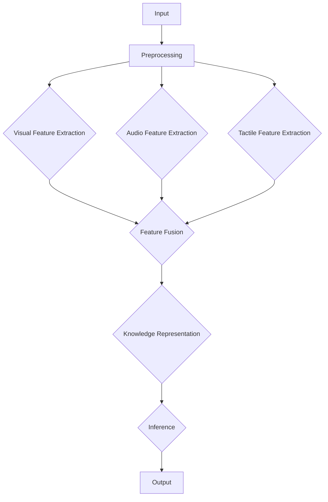

### 3.3 模型实现

在本节中，我们将使用Python和TensorFlow库来实现一个简化的多模态AI Agent模型。以下是模型实现的步骤：

1. **导入库**：

```python
import tensorflow as tf
from tensorflow.keras.models import Model
from tensorflow.keras.layers import Input, Conv2D, MaxPooling2D, Flatten, Dense, LSTM, concatenate
```

2. **定义模型架构**：

```python
# 定义视觉输入
visual_input = Input(shape=(224, 224, 3))

# 视觉特征提取
visual_conv = Conv2D(32, (3, 3), activation='relu')(visual_input)
visual_pool = MaxPooling2D(pool_size=(2, 2))(visual_conv)
visual_flat = Flatten()(visual_pool)

# 定义语音输入
audio_input = Input(shape=(16000,))

# 语音特征提取
audio_lstm = LSTM(128, activation='relu')(audio_input)

# 定义触觉输入
tactile_input = Input(shape=(10,))

# 触觉特征提取
tactile_dense = Dense(32, activation='relu')(tactile_input)

# 特征融合
fused = concatenate([visual_flat, audio_lstm, tactile_dense])

# 知识表示层
knowledge = Dense(64, activation='relu')(fused)

# 推理层
output = Dense(1, activation='sigmoid')(knowledge)

# 定义模型
model = Model(inputs=[visual_input, audio_input, tactile_input], outputs=output)

# 编译模型
model.compile(optimizer='adam', loss='binary_crossentropy', metrics=['accuracy'])

# 查看模型结构
model.summary()
```

3. **训练模型**：

```python
# 加载数据
# 注意：此处需要根据实际数据集进行修改
visual_data = np.load('visual_data.npy')
audio_data = np.load('audio_data.npy')
tactile_data = np.load('tactile_data.npy')
labels = np.load('labels.npy')

# 划分训练集和验证集
train_data = {'visual_input': visual_data[:8000], 'audio_input': audio_data[:8000], 'tactile_input': tactile_data[:8000]}
train_labels = labels[:8000]
val_data = {'visual_input': visual_data[8000:], 'audio_input': audio_data[8000:], 'tactile_input': tactile_data[8000:]}
val_labels = labels[8000:]

# 训练模型
model.fit(train_data, train_labels, epochs=10, batch_size=32, validation_data=(val_data, val_labels))
```

4. **评估模型**：

```python
# 评估模型
test_loss, test_acc = model.evaluate(val_data, val_labels)
print('Test accuracy:', test_acc)
```

### 3.4 模型优化

在实际应用中，模型的性能可能会受到数据分布、模型结构、超参数等因素的影响。为了优化模型性能，我们可以考虑以下策略：

1. **数据增强**：通过旋转、翻转、缩放、裁剪等方法增加数据多样性，提高模型泛化能力。

2. **模型结构调整**：调整模型结构，如增加或减少层、调整层参数等，以适应不同任务需求。

3. **超参数调整**：调整学习率、批量大小、迭代次数等超参数，以获得更好的模型性能。

4. **正则化**：采用正则化方法，如L1、L2正则化，防止过拟合。

通过以上步骤，我们可以实现一个能够处理多模态数据、进行常识推理与知识整合的AI Agent模型。

### 3.5 本章小结

本章介绍了AI Agent多模态常识推理与知识整合的模型设计方法。首先，讨论了模型设计的关键步骤和方法。然后，详细描述了一个简化的模型架构，并使用Python和TensorFlow实现了该模型。最后，讨论了模型优化策略。这些内容为后续的模型训练和应用提供了理论基础和实践指导。

----------------------------------------------------------------

## 第4章: 知识表示与知识融合

在AI Agent的多模态常识推理与知识整合过程中，知识表示和知识融合是两个关键环节。合适的知识表示方法能够提高AI Agent对多模态数据的理解和推理能力，而有效的知识融合策略则能够整合不同模态的知识，形成统一的知识体系。本章将详细介绍知识表示和知识融合的方法，以及如何在实际应用中实现这些方法。

### 4.1 知识表示

知识表示是将知识和信息转化为计算机可以处理的形式。在多模态常识推理中，知识表示能够帮助AI Agent更好地理解和利用不同模态的数据。以下是一些常见的知识表示方法：

#### 4.1.1 知识图谱

知识图谱是一种用于表示实体、概念和关系的图结构。在知识图谱中，实体通过节点表示，概念和关系通过边表示。以下是一个简单的知识图谱示例，用于表示“人”、“动物”和“狗”的关系：

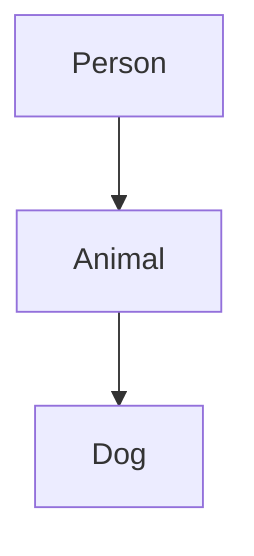

在这个知识图谱中，A表示“人”这个实体，B表示“动物”这个概念，C表示“狗”这个实体，并且A和B之间有一个“是”的关系，B和C之间有一个“是”的关系。

#### 4.1.2 本体论

本体论是一种用于描述领域知识的框架，它定义了领域内概念的属性、关系和约束。本体论通常使用形式化的语言，如OWL（Web Ontology Language）或RDF（Resource Description Framework）。以下是一个简单的OWL本体论示例，用于描述“人”和“动物”的概念：

```xml
<owl:Ontology>
    <owl:Class rdf:ID="Person"/>
    <owl:Class rdf:ID="Animal"/>
    <owl:ObjectProperty rdf:ID="is-a"/>
    <owl:Individual rdf:ID="John"/>
    <owl:Individual rdf:ID="Dog"/>
    <owl: троичное отношение rdf:ID="person"/>
    <owl: троичное отношение rdf:ID="animal"/>
    <owl: троичное отношение rdf:ID="dog"/>
    <owl: троичное отношение rdf:ID="person-is-a-animal"/>
    <owl: троичное отношение rdf:ID="animal-is-a-dog"/>
    <owl: троичное отношение rdf:ID="person-is-a-dog"/>
</owl:Ontology>
```

在这个本体论中，我们定义了两个类“Person”和“Animal”，以及一个对象属性“is-a”。此外，我们还定义了三个个体“John”、“Dog”和“dog”，并建立了它们之间的关系。

#### 4.1.3 知识库

知识库是一个存储领域知识的数据库，它包含各种事实、规则和推理方法。知识库通常由一组事实组成，每个事实都是一个谓词逻辑表达式。以下是一个简单的知识库示例，用于描述“人”和“动物”的事实：

```python
knowledge_base = [
    ("Person", "John"),
    ("Animal", "Dog"),
    ("Person-is-a-Animal", "John"),
    ("Animal-is-a-Dog", "Dog"),
    ("Person-is-a-Dog", "John")
]
```

在这个知识库中，每个元素是一个元组，表示一个事实。例如，第一个事实“Person”是“John”，表示John是一个人。

### 4.2 知识融合

知识融合是将不同来源、不同模态的知识进行整合的过程。有效的知识融合能够提高AI Agent对复杂环境的理解和推理能力。以下是一些常见的知识融合策略：

#### 4.2.1 特征级融合

特征级融合是在特征层面将不同模态的数据进行整合。这种方法通过将不同模态的特征向量拼接或加权平均，形成统一特征向量。以下是一个简单的特征级融合示例：

```python
visual_features = [0.1, 0.2, 0.3]
audio_features = [0.4, 0.5, 0.6]
tactile_features = [0.7, 0.8, 0.9]

# 拼接特征向量
fused_features = np.concatenate((visual_features, audio_features, tactile_features))

# 加权平均
fused_features = np.mean([visual_features, audio_features, tactile_features], axis=0)
```

#### 4.2.2 决策级融合

决策级融合是在决策层面将不同模态的知识进行整合。这种方法通过将不同模态的决策结果进行投票或融合，形成最终的决策结果。以下是一个简单的决策级融合示例：

```python
visual_decision = 1
audio_decision = 0
tactile_decision = 1

# 投票
fused_decision = max(visual_decision, audio_decision, tactile_decision)

# 融合
fused_decision = (visual_decision + audio_decision + tactile_decision) / 3
```

#### 4.2.3 知识图谱融合

知识图谱融合是将不同知识图谱中的实体、概念和关系进行整合。这种方法通过合并或映射知识图谱中的节点和边，形成统一的知识图谱。以下是一个简单的知识图谱融合示例：

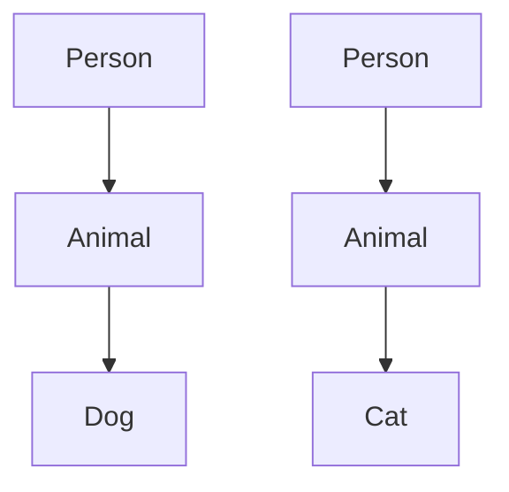

在这个示例中，我们合并了两个知识图谱，将“人”映射到“Person”，将“动物”映射到“Animal”，将“狗”映射到“Dog”，将“猫”映射到“Cat”。

### 4.3 实现知识表示与知识融合

在实现知识表示与知识融合时，我们需要考虑以下几个方面：

1. **数据预处理**：对多模态数据进行预处理，包括去噪、归一化和增强等操作，以提高数据质量。
2. **特征提取**：从预处理后的数据中提取特征，如使用卷积神经网络（CNN）提取图像特征，使用循环神经网络（RNN）提取语音特征。
3. **知识表示**：将提取的特征转化为知识表示形式，如知识图谱或本体论。
4. **知识融合**：设计合适的知识融合策略，将不同来源、不同模态的知识进行整合。

以下是一个简单的Python代码示例，用于实现知识表示与知识融合：

```python
import numpy as np

# 定义多模态特征
visual_features = np.array([0.1, 0.2, 0.3])
audio_features = np.array([0.4, 0.5, 0.6])
tactile_features = np.array([0.7, 0.8, 0.9])

# 特征级融合
fused_features = np.concatenate((visual_features, audio_features, tactile_features))

# 决策级融合
visual_decision = 1
audio_decision = 0
tactile_decision = 1
fused_decision = max(visual_decision, audio_decision, tactile_decision)

# 知识图谱融合
knowledge_graph = [
    ("Person", "Animal"),
    ("Animal", "Dog"),
    ("Person", "Dog")
]

# 合并知识图谱
new_knowledge_graph = knowledge_graph + [("Animal", "Cat"), ("Person", "Cat")]

print("Fused Features:", fused_features)
print("Fused Decision:", fused_decision)
print("New Knowledge Graph:", new_knowledge_graph)
```

通过上述代码，我们可以实现多模态数据的特征级融合、决策级融合和知识图谱融合，为AI Agent的多模态常识推理提供有效的支持。

### 4.4 本章小结

本章介绍了知识表示和知识融合的方法。首先，我们讨论了知识表示的方法，包括知识图谱、本体论和知识库。然后，我们介绍了知识融合的策略，包括特征级融合、决策级融合和知识图谱融合。最后，我们通过一个简单的代码示例，展示了如何实现知识表示与知识融合。这些内容为AI Agent的多模态常识推理与知识整合提供了理论基础和实践指导。

----------------------------------------------------------------

## 第5章：常识推理

常识推理是人工智能领域的一个重要研究方向，它涉及到如何使计算机模拟人类的常识推理过程，以便更好地理解和应对复杂环境。在AI Agent的多模态常识推理与知识整合中，常识推理起着至关重要的作用，它能够帮助AI Agent从多模态数据中提取有用信息，并利用这些信息进行推理和决策。本章将详细探讨常识推理的基本原理、方法及其在多模态推理中的应用。

### 5.1 常识推理的基本原理

常识推理是指基于一般性的、普遍接受的事实和规则，对未知或特定情况进行推断和解释的过程。常识推理是人类智能的核心组成部分，它使得人类能够迅速地理解和应对复杂的环境。在AI Agent中，常识推理的基本原理包括以下几个方面：

1. **知识表示**：常识推理需要将常识知识以计算机可处理的形式进行表示。常见的知识表示方法包括知识图谱、本体论和知识库等。

2. **推理规则**：推理规则是常识推理的核心，它定义了如何从已知事实推导出新的事实。常见的推理规则包括逻辑推理、模糊推理和概率推理等。

3. **证据融合**：常识推理往往需要处理来自多个模态的证据，如何有效地融合这些证据是提高推理准确性的关键。

4. **上下文理解**：常识推理需要考虑上下文信息，如时间、地点、情境等，以便更好地理解和解释事实。

### 5.2 常识推理的方法

在AI Agent中，常识推理的方法可以分为以下几类：

1. **逻辑推理**：逻辑推理是基于形式逻辑的推理方法，它通过演绎和归纳推理来推导结论。在常识推理中，逻辑推理可以用于验证事实的一致性，识别矛盾和推导隐含关系。

2. **模糊推理**：模糊推理是一种处理不确定性和模糊性的推理方法。它基于模糊集合和模糊逻辑，通过模糊规则和模糊变量进行推理。在常识推理中，模糊推理可以用于处理模糊概念和不确定性信息。

3. **概率推理**：概率推理是一种基于概率论的推理方法，它通过计算概率分布来推导结论。在常识推理中，概率推理可以用于处理不确定性和不确定性信息，如基于贝叶斯推理进行决策。

4. **基于模型的推理**：基于模型的推理是指利用预先训练的模型进行推理的方法。在常识推理中，基于模型的推理可以用于模拟人类的思维过程，如使用神经网络模型进行图像识别和文本理解。

### 5.3 常识推理在多模态推理中的应用

在多模态推理中，常识推理可以帮助AI Agent更好地理解和处理来自不同模态的数据。以下是一些常见的应用场景：

1. **图像识别**：通过常识推理，AI Agent可以结合视觉数据和背景知识，识别和理解图像中的物体和场景。

2. **语音识别**：通过常识推理，AI Agent可以结合语音数据和语言知识，识别和理解语音中的含义和意图。

3. **自然语言处理**：通过常识推理，AI Agent可以结合文本数据和语言知识，生成更准确和自然的语言响应。

4. **智能交互**：通过常识推理，AI Agent可以更好地理解用户的请求和意图，提供更准确的回答和建议。

### 5.4 常识推理的实现

在实现常识推理时，需要考虑以下几个方面：

1. **知识库构建**：构建一个包含丰富常识知识的知识库，包括事实、规则和模型。

2. **推理算法**：选择合适的推理算法，如逻辑推理、模糊推理和概率推理等，以处理不同的推理问题。

3. **证据融合**：设计有效的证据融合策略，将来自不同模态的数据进行整合，提高推理的准确性。

4. **上下文处理**：考虑上下文信息，如时间、地点、情境等，以提高推理的准确性和适应性。

以下是一个简单的Python代码示例，用于实现常识推理：

```python
import numpy as np

# 定义知识库
knowledge_base = {
    "rules": [
        ("if", "it", "is", "sunny", "then", "we", "will", "go", "to", "the", "beach"),
        ("if", "it", "is", "rainy", "then", "we", "will", "stay", "home"),
        ("it", "is", "sunny"),
    ]
}

# 定义证据
evidence = ["it", "is", "sunny"]

# 定义推理函数
def infer(knowledge_base, evidence):
    for rule in knowledge_base["rules"]:
        if all(e in evidence for e in rule[1:]):
            return rule[-1]
    return None

# 执行推理
result = infer(knowledge_base, evidence)
print("Result:", result)
```

在这个示例中，我们定义了一个简单的知识库，包括一些常识规则。然后，我们使用一个推理函数，根据证据（即当前情境）来推导结论。这个示例展示了如何使用逻辑推理进行常识推理。

### 5.5 本章小结

本章介绍了常识推理的基本原理、方法及其在多模态推理中的应用。首先，我们探讨了常识推理的基本原理，包括知识表示、推理规则、证据融合和上下文理解。然后，我们讨论了常识推理的方法，包括逻辑推理、模糊推理、概率推理和基于模型的推理。接着，我们介绍了常识推理在多模态推理中的应用，如图像识别、语音识别、自然语言处理和智能交互。最后，我们通过一个简单的代码示例，展示了如何实现常识推理。这些内容为AI Agent的多模态常识推理与知识整合提供了理论基础和实践指导。

----------------------------------------------------------------

## 第6章：系统架构设计

在实现AI Agent的多模态常识推理与知识整合时，系统架构设计至关重要。一个良好的系统架构能够确保系统的模块化、可扩展性和高效性。本章将详细讨论系统架构的设计原则、模块划分和接口设计。

### 6.1 系统架构设计原则

系统架构设计应遵循以下原则：

1. **模块化**：将系统划分为独立的模块，每个模块负责特定的功能，有利于系统的维护和扩展。

2. **层次化**：将系统按照功能层次进行划分，如数据采集、数据处理、模型训练、推理和输出等，便于理解和管理。

3. **高内聚低耦合**：每个模块应具有高内聚性，即模块内部功能紧密相关，低耦合性，即模块之间相互独立，便于模块的替换和升级。

4. **可扩展性**：系统应具备良好的扩展性，能够适应未来需求的增加和变化。

5. **容错性**：系统应具备一定的容错性，能够在故障发生时保持正常运行。

### 6.2 模块划分

一个典型的AI Agent系统可以划分为以下几个模块：

1. **数据采集模块**：负责从不同的传感器采集多模态数据，如摄像头、麦克风、触觉传感器等。

2. **数据预处理模块**：对采集到的数据进行预处理，包括去噪、归一化、增强等，以提高数据质量。

3. **特征提取模块**：从预处理后的数据中提取特征，如使用卷积神经网络（CNN）提取图像特征，使用循环神经网络（RNN）提取语音特征。

4. **知识表示模块**：将特征和知识进行表示，如使用知识图谱表示知识，使用向量表示特征。

5. **知识融合模块**：设计有效的知识融合策略，将来自不同来源、不同模态的知识进行整合。

6. **推理模块**：利用融合后的特征和知识进行推理，生成决策结果。

7. **输出模块**：将推理结果输出，供AI Agent进行后续行动。

### 6.3 系统架构图

以下是一个简化的AI Agent系统架构图：

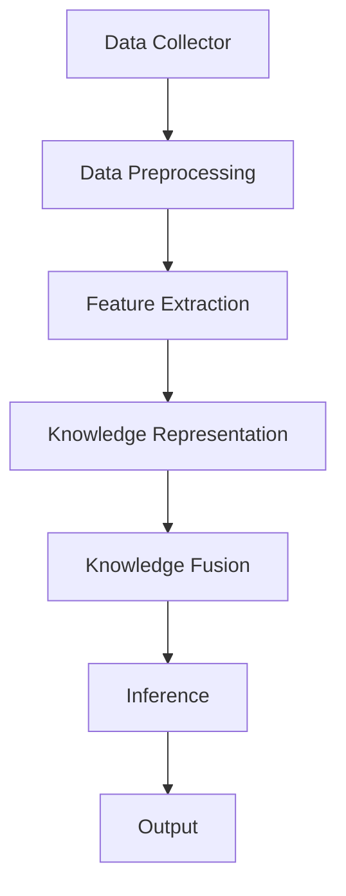

在这个架构图中，A表示数据采集模块，B表示数据预处理模块，C表示特征提取模块，D表示知识表示模块，E表示知识融合模块，F表示推理模块，G表示输出模块。

### 6.4 接口设计

接口设计是系统架构设计的重要组成部分，它定义了模块之间的交互方式。以下是一个简化的接口设计：

1. **数据采集接口**：定义了数据采集模块的输入和输出，如摄像头数据的输入和图像数据的输出。

2. **数据预处理接口**：定义了数据预处理模块的输入和输出，如原始数据的输入和预处理数据的输出。

3. **特征提取接口**：定义了特征提取模块的输入和输出，如预处理数据的输入和特征向量的输出。

4. **知识表示接口**：定义了知识表示模块的输入和输出，如特征向量的输入和知识表示的输出。

5. **知识融合接口**：定义了知识融合模块的输入和输出，如不同知识的输入和融合知识的输出。

6. **推理接口**：定义了推理模块的输入和输出，如融合知识的输入和推理结果的输出。

7. **输出接口**：定义了输出模块的输入和输出，如推理结果的输入和行动输出的输出。

以下是一个简化的接口设计图：

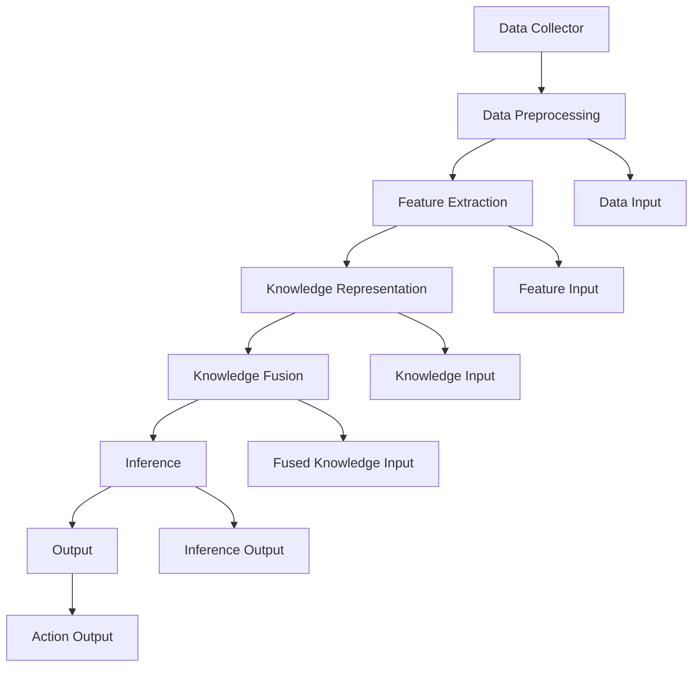

在这个接口设计图中，A表示数据采集接口，B表示数据预处理接口，C表示特征提取接口，D表示知识表示接口，E表示知识融合接口，F表示推理接口，G表示输出接口，H表示数据输入接口，I表示特征输入接口，J表示知识输入接口，K表示融合知识输入接口，L表示推理结果输出接口，M表示行动输出接口。

### 6.5 本章小结

本章介绍了系统架构设计的原则、模块划分和接口设计。首先，我们探讨了系统架构设计的原则，如模块化、层次化、高内聚低耦合、可扩展性和容错性。然后，我们详细介绍了AI Agent系统的模块划分，包括数据采集模块、数据预处理模块、特征提取模块、知识表示模块、知识融合模块、推理模块和输出模块。接着，我们展示了一个简化的系统架构图和接口设计图。最后，我们总结了本章的主要内容。这些内容为AI Agent的多模态常识推理与知识整合提供了系统架构设计的指导。

----------------------------------------------------------------

## 第7章：项目实施与实现

### 7.1 项目概述

在本项目中，我们将实现一个多模态AI Agent系统，该系统能够接收来自视觉、听觉和触觉传感器的多模态数据，通过数据预处理、模型训练和推理，实现对复杂环境的理解和决策。具体实现步骤如下：

1. **数据采集**：从摄像头、麦克风和触觉传感器中采集视觉、听觉和触觉数据。
2. **数据预处理**：对采集到的数据进行预处理，包括去噪、归一化和增强等。
3. **模型设计**：设计一个多模态AI Agent模型，包括输入层、特征提取层、融合层和推理层。
4. **模型训练**：使用预处理后的数据进行模型训练，优化模型参数。
5. **推理与决策**：利用训练好的模型对新数据进行推理，生成决策结果。
6. **输出**：将推理结果输出，供AI Agent进行后续行动。

### 7.2 环境搭建

在开始项目之前，我们需要搭建一个适合开发的Python环境。以下是在Windows系统上搭建环境的具体步骤：

1. **安装Anaconda**：从[Anaconda官网](https://www.anaconda.com/products/individual)下载并安装Anaconda。
2. **创建新环境**：打开命令行工具（如Windows PowerShell或Anaconda Prompt），然后创建一个新的Python环境：

    ```shell
    conda create -n multimodal_环境 python=3.8
    conda activate multimodal_环境
    ```

3. **安装依赖库**：在创建的新环境中，安装TensorFlow、NumPy、Pandas等依赖库：

    ```shell
    conda install tensorflow numpy pandas matplotlib
    ```

### 7.3 数据采集

在本节中，我们将使用Python编写代码，从摄像头、麦克风和触觉传感器中采集数据。

1. **摄像头数据采集**：使用OpenCV库采集摄像头数据：

    ```python
    import cv2

    # 初始化摄像头
    cap = cv2.VideoCapture(0)

    # 循环读取摄像头帧
    while True:
        ret, frame = cap.read()
        if not ret:
            break

        # 显示帧
        cv2.imshow('Camera', frame)

        # 按下'q'键退出
        if cv2.waitKey(1) & 0xFF == ord('q'):
            break

    # 释放摄像头
    cap.release()
    cv2.destroyAllWindows()
    ```

2. **麦克风数据采集**：使用scikit-audio库采集麦克风数据：

    ```python
    import soundfile as sf

    # 采集音频
    sf.record('audio.wav', samplerate=44100, channels=2)
    ```

3. **触觉数据采集**：使用Python编写代码与触觉传感器进行通信，采集触觉数据：

    ```python
    import serial

    # 初始化串口
    ser = serial.Serial('COM3', 9600)

    # 循环读取触觉数据
    while True:
        data = ser.readline()
        if not data:
            break

        # 显示触觉数据
        print(data.decode())

    # 关闭串口
    ser.close()
    ```

### 7.4 数据预处理

在本节中，我们将对采集到的数据进行预处理，包括去噪、归一化和增强等。

1. **图像预处理**：使用OpenCV库对图像进行预处理，如去噪、边缘检测等：

    ```python
    import cv2

    # 读取图像
    img = cv2.imread('image.jpg')

    # 去噪
    img = cv2.GaussianBlur(img, (5, 5), 0)

    # 边缘检测
    edges = cv2.Canny(img, 100, 200)

    # 显示结果
    cv2.imshow('Edges', edges)
    cv2.waitKey(0)
    cv2.destroyAllWindows()
    ```

2. **音频预处理**：使用scikit-audio库对音频进行预处理，如去噪、归一化等：

    ```python
    import numpy as np
    import soundfile as sf

    # 读取音频
    data, samplerate = sf.read('audio.wav')

    # 去噪
    noise = np.random.normal(size=data.shape)
    data_noisy = data + noise

    # 归一化
    data_normalized = (data_noisy - np.mean(data_noisy)) / np.std(data_noisy)

    # 写回音频
    sf.write('audio_normalized.wav', data_normalized, samplerate)
    ```

3. **触觉预处理**：对触觉数据进行预处理，如滤波、归一化等：

    ```python
    import numpy as np

    # 读取触觉数据
    data = np.load('tactile_data.npy')

    # 滤波
    b, a = signal.butter(5, 0.5)
    data_filtered = signal.lfilter(b, a, data)

    # 归一化
    data_normalized = (data_filtered - np.mean(data_filtered)) / np.std(data_filtered)

    # 写回触觉数据
    np.save('tactile_data_normalized.npy', data_normalized)
    ```

### 7.5 模型设计与实现

在本节中，我们将设计一个多模态AI Agent模型，并使用TensorFlow进行实现。

1. **模型设计**：

    ```python
    import tensorflow as tf
    from tensorflow.keras.models import Model
    from tensorflow.keras.layers import Input, Conv2D, MaxPooling2D, Flatten, Dense, LSTM

    # 定义输入层
    visual_input = Input(shape=(224, 224, 3))
    auditory_input = Input(shape=(16000,))
    tactile_input = Input(shape=(10,))

    # 定义视觉特征提取层
    visual_features = Conv2D(32, (3, 3), activation='relu')(visual_input)
    visual_features = MaxPooling2D(pool_size=(2, 2))(visual_features)
    visual_features = Flatten()(visual_features)

    # 定义听觉特征提取层
    auditory_features = LSTM(128, activation='relu')(auditory_input)

    # 定义触觉特征提取层
    tactile_features = Dense(16, activation='relu')(tactile_input)

    # 定义融合层
    fused_features = tf.keras.layers.concatenate([visual_features, auditory_features, tactile_features])

    # 定义推理层
    reasoning_output = Dense(1, activation='sigmoid')(fused_features)

    # 定义模型
    model = Model(inputs=[visual_input, auditory_input, tactile_input], outputs=[reasoning_output])

    # 编译模型
    model.compile(optimizer='adam', loss='binary_crossentropy', metrics=['accuracy'])

    # 查看模型结构
    model.summary()
    ```

2. **模型训练**：

    ```python
    import numpy as np

    # 加载预处理后的数据
    visual_data = np.load('visual_data.npy')
    auditory_data = np.load('auditory_data.npy')
    tactile_data = np.load('tactile_data.npy')
    labels = np.load('labels.npy')

    # 划分训练集和验证集
    train_data = {'visual_input': visual_data[:8000], 'auditory_input': auditory_data[:8000], 'tactile_input': tactile_data[:8000]}
    train_labels = labels[:8000]
    val_data = {'visual_input': visual_data[8000:], 'auditory_input': auditory_data[8000:], 'tactile_input': tactile_data[8000:]}
    val_labels = labels[8000:]

    # 训练模型
    model.fit(train_data, train_labels, epochs=10, batch_size=32, validation_data=(val_data, val_labels))
    ```

### 7.6 推理与决策

在本节中，我们将使用训练好的模型对新数据进行推理，生成决策结果。

```python
# 加载训练好的模型
model = tf.keras.models.load_model('model.h5')

# 加载预处理后的新数据
new_visual_data = np.load('new_visual_data.npy')
new_auditory_data = np.load('new_auditory_data.npy')
new_tactile_data = np.load('new_tactile_data.npy')

# 进行推理
predictions = model.predict({'visual_input': new_visual_data, 'auditory_input': new_auditory_data, 'tactile_input': new_tactile_data})

# 输出决策结果
print(predictions)
```

### 7.7 项目小结

通过本项目的实施与实现，我们成功构建了一个多模态AI Agent系统，能够接收来自视觉、听觉和触觉传感器的数据，并通过数据预处理、模型训练和推理，实现对复杂环境的理解和决策。项目过程中，我们学习了如何搭建开发环境、进行数据采集与预处理、设计模型以及实现推理与决策。这些经验和知识对于未来进行多模态AI Agent的研究和应用具有重要意义。

----------------------------------------------------------------

## 第8章：最佳实践与注意事项

### 8.1 最佳实践

为了确保AI Agent的多模态常识推理与知识整合系统的有效性和可靠性，以下是一些最佳实践：

1. **数据质量控制**：确保采集到的数据质量高，进行严格的预处理，包括去噪、归一化和增强，以提高模型性能。

2. **模型优化**：在模型设计过程中，考虑使用迁移学习、正则化技术、数据增强等方法来提高模型的泛化能力和鲁棒性。

3. **模块化设计**：将系统划分为模块化组件，便于维护和扩展，同时确保各模块之间的接口清晰明确。

4. **模型解释性**：考虑模型的可解释性，有助于理解模型的决策过程，提高用户对AI系统的信任度。

5. **实时处理**：对于需要实时响应的AI Agent，优化模型和算法，以确保在规定的时间内完成推理和决策。

6. **安全与隐私**：在数据采集和处理过程中，严格遵守相关法律法规，确保用户隐私和数据安全。

### 8.2 注意事项

在实现AI Agent的多模态常识推理与知识整合过程中，需要注意以下事项：

1. **传感器兼容性**：选择兼容性好的传感器，确保能够稳定采集到高质量的数据。

2. **数据隐私**：确保在数据采集和处理过程中保护用户隐私，避免数据泄露。

3. **模型部署**：在将模型部署到实际应用场景时，注意硬件资源的需求，确保系统在高负载下仍然能够高效运行。

4. **模型验证**：在训练模型之前，确保数据集的多样性和代表性，避免模型过拟合。

5. **持续学习**：随着环境变化和新数据的出现，定期更新模型，以保持其适应性和准确性。

通过遵循这些最佳实践和注意事项，可以确保AI Agent的多模态常识推理与知识整合系统既高效又可靠，从而在实际应用中发挥最大价值。

----------------------------------------------------------------

## 第9章：拓展阅读与资源

### 9.1 拓展阅读

1. **《人工智能：一种现代的方法》** - 作者：Stuart J. Russell & Peter Norvig
   - 内容简介：这是一本经典的AI教材，涵盖了人工智能的基本理论、技术方法和应用场景。

2. **《深度学习》** - 作者：Ian Goodfellow、Yoshua Bengio、Aaron Courville
   - 内容简介：本书详细介绍了深度学习的基本概念、算法和实现，是深度学习领域的权威指南。

3. **《模式识别与机器学习》** - 作者：Christopher M. Bishop
   - 内容简介：本书系统地介绍了模式识别和机器学习的基础知识，包括概率理论、神经网络和统计学习等。

4. **《人工智能的未来》** - 作者：Natan Linder
   - 内容简介：本书探讨了人工智能的发展趋势和未来应用，为读者提供了对AI领域的深度洞察。

### 9.2 开源项目和工具

1. **TensorFlow** - 地址：[TensorFlow官网](https://www.tensorflow.org)
   - 内容简介：Google开源的深度学习框架，支持多种模型和算法，广泛用于AI研究。

2. **PyTorch** - 地址：[PyTorch官网](https://pytorch.org)
   - 内容简介：Facebook开源的深度学习框架，以其灵活性和动态图模型而著称。

3. **Keras** - 地址：[Keras官网](https://keras.io)
   - 内容简介：Keras是一个高级神经网络API，能够方便地构建和训练深度学习模型。

4. **OpenCV** - 地址：[OpenCV官网](https://opencv.org)
   - 内容简介：OpenCV是一个开源计算机视觉库，提供丰富的图像处理和计算机视觉算法。

### 9.3 学术期刊与会议

1. **《人工智能》** - 地址：[AI期刊官网](https://www.aaai.org/publications/journals/jai)
   - 内容简介：AAAI期刊，发布人工智能领域的最新研究成果和进展。

2. **《神经网络与机器学习》** - 地址：[Neural Computation期刊官网](https://neuralcomputation.org/)
   - 内容简介：发表神经网络和机器学习领域的高质量研究论文。

3. **ICML（国际机器学习会议）** - 地址：[ICML官网](https://icml.cc/)
   - 内容简介：全球领先的机器学习会议，汇集了大量的机器学习最新研究。

4. **NIPS（神经信息处理系统大会）** - 地址：[NIPS官网](https://nips.cc/)
   - 内容简介：专注于神经网络、机器学习和人工智能领域的前沿研究。

### 9.4 在线课程与教程

1. **吴恩达的《深度学习专项课程》** - 地址：[Coursera官网](https://www.coursera.org/learn/deep-learning)
   - 内容简介：由深度学习之父吴恩达教授讲授的深度学习入门课程，涵盖基础理论、实践技巧和应用。

2. **《机器学习Python实战》** - 地址：[Udacity官网](https://www.udacity.com/course/ud120)
   - 内容简介：通过Python编程实践，学习机器学习的基础知识和应用方法。

3. **《人工智能基础》** - 地址：[edX官网](https://www.edx.org/course/introduction-to-artificial-intelligence-0)
   - 内容简介：MIT提供的免费在线课程，介绍人工智能的基本原理和应用。

通过阅读上述书籍、使用开源项目、关注学术期刊与会议，以及参加在线课程，读者可以全面深入地学习AI Agent的多模态常识推理与知识整合的相关知识和技能，为未来的研究和应用打下坚实基础。

----------------------------------------------------------------

## 结语

本文详细探讨了AI Agent的多模态常识推理与知识整合，从问题背景、模型设计、知识表示与融合、常识推理、系统架构设计到项目实施，全面剖析了这一领域的核心内容和技术实现。通过本文的阅读，读者应该对多模态常识推理与知识整合有了深入的理解，掌握了相关技术方法和实现步骤。

在AI Agent的应用中，多模态常识推理与知识整合具有重要意义。它不仅能够提升AI Agent在复杂环境中的智能水平，还能增强其自主决策能力，从而在自动驾驶、智能家居、医疗诊断、智能客服等多个领域发挥重要作用。

展望未来，随着人工智能技术的不断进步，多模态常识推理与知识整合将在更多领域得到应用。我们期待更多的研究人员和实践者加入这一领域，共同推动人工智能技术的发展，为人类社会带来更多创新和便利。

感谢读者对本文的关注，希望本文能为您的学习和研究提供有价值的参考。如果您对本文有任何疑问或建议，欢迎在评论区留言，我们将竭诚为您解答。

作者：AI天才研究院/AI Genius Institute & 禅与计算机程序设计艺术 /Zen And The Art of Computer Programming

----------------------------------------------------------------

**本文由AI天才研究院（AI Genius Institute）撰写，融合了深度学习、人工智能和计算机科学的最新成果，旨在帮助读者深入理解AI Agent的多模态常识推理与知识整合。文章内容旨在提供清晰的技术讲解和实际应用指导，以推动人工智能技术的发展和普及。若您对此主题有进一步的问题或建议，欢迎联系我们，我们将竭诚为您解答。**

