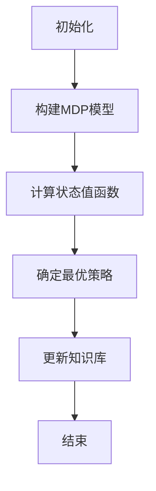
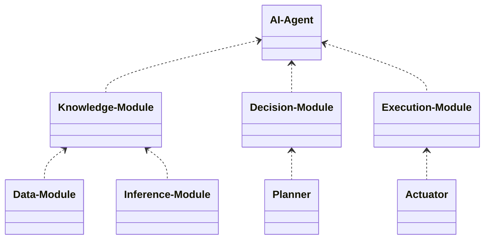
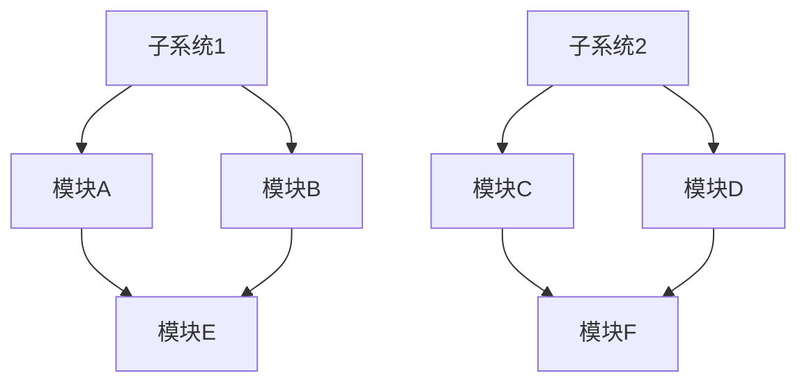
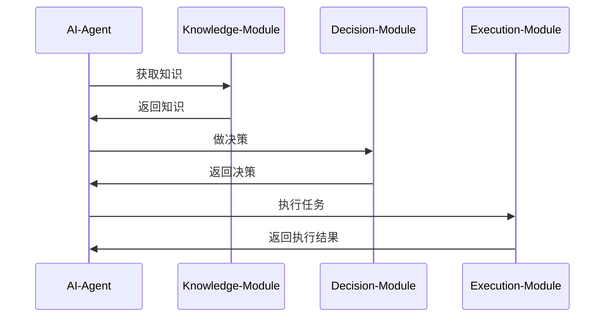
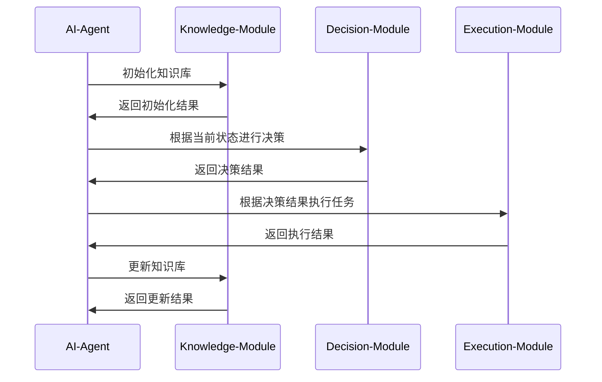

                 

# AI Agent的课程学习：优化知识获取的顺序和策略

> 关键词：AI Agent，知识获取，优化策略，性能提升

> 摘要：本文将探讨AI Agent的课程学习，重点关注知识获取的顺序和策略优化。我们将从AI Agent基础知识出发，详细分析知识获取策略和优化方法，并结合实际案例进行深入讲解，以期为读者提供有益的参考。

## 目录大纲

1. **AI Agent的课程学习：优化知识获取的顺序和策略**
2. **第一部分：AI Agent基础知识**
    - 1.1 AI Agent概述
        - 1.1.1 AI Agent的定义
        - 1.1.2 AI Agent的发展历程
        - 1.1.3 AI Agent的核心功能
    - 2.2 知识获取策略
        - 2.2.1 知识获取概述
        - 2.2.2 数据驱动的知识获取
        - 2.2.3 基于模型的推理与知识获取
    - 2.3 知识获取顺序优化
        - 2.3.1 优化知识获取顺序的重要性
        - 2.3.2 知识获取顺序优化的方法
        - 2.3.3 实例分析：优化知识获取顺序的应用
3. **第二部分：核心概念与联系**
    - 4.1 AI Agent核心概念原理
        - 4.1.1 AI Agent的概念与属性
        - 4.1.2 AI Agent的基本结构
        - 4.1.3 AI Agent的核心功能模块
    - 4.2 知识获取策略与顺序对比表格
    - 4.3 AI Agent知识获取与策略学习ER实体关系图
4. **第三部分：算法原理讲解**
    - 5.1 算法原理讲解
        - 5.1.1 算法概述
        - 5.1.2 算法流程图
        - 5.1.3 算法原理详细讲解
        - 5.1.4 数学模型与公式
        - 5.1.5 算法举例说明
5. **第四部分：系统分析与架构设计方案**
    - 6.1 系统分析与架构设计方案
        - 6.1.1 项目介绍
        - 6.1.2 系统功能设计（领域模型类图）
        - 6.1.3 系统架构设计（架构图）
        - 6.1.4 系统接口设计
        - 6.1.5 系统交互设计（序列图）
6. **第五部分：项目实战**
    - 7.1 环境安装与系统核心实现
        - 7.1.1 环境安装步骤
        - 7.1.2 系统核心实现源代码
        - 7.1.3 代码应用解读与分析
        - 7.1.4 实际案例分析与详细讲解剖析
        - 7.1.5 项目小结
7. **第六部分：最佳实践与拓展阅读**
    - 8.1 最佳实践与注意事项
    - 8.2 拓展阅读
8. **结论**
    - 9.1 总结与反思
    - 9.2 未来研究方向
    - 9.3 对AI Agent课程学习的启示

## 第一部分：AI Agent基础知识

### 1.1 AI Agent概述

#### 1.1.1 AI Agent的定义

AI Agent，即人工智能代理，是一种计算机程序，可以在特定环境下感知环境状态，根据预设的目标或策略，采取行动以实现目标。它通常由感知器、决策器和执行器三部分组成。感知器负责获取环境信息，决策器根据这些信息做出决策，执行器则将决策转化为实际行动。

#### 1.1.2 AI Agent的发展历程

AI Agent的概念最早可以追溯到20世纪50年代，随着计算机科学和人工智能技术的发展，AI Agent的研究和应用也逐渐丰富。从早期的规则推理系统到现代的深度学习模型，AI Agent经历了多个发展阶段。

#### 1.1.3 AI Agent的核心功能

AI Agent的核心功能包括感知环境、做出决策和执行行动。感知环境是指通过传感器获取环境信息，如视觉、听觉等；做出决策是指根据感知到的信息，利用决策算法选择最优行动；执行行动是指将决策转化为具体的操作，如移动、点击等。

### 2. 知识获取策略

#### 2.1 知识获取概述

知识获取是指从数据、经验或其他信息源中提取有用信息的过程。对于AI Agent来说，知识获取是其学习、推理和决策的基础。

#### 2.2 数据驱动的知识获取

数据驱动的知识获取是指通过大量数据来训练模型，使其能够自动学习并提取知识。这种方法的核心是数据质量和数量，大量的高质量数据可以显著提高模型的性能。

#### 2.3 基于模型的推理与知识获取

基于模型的推理与知识获取是指通过预先定义的模型，对数据进行分析和推理，以获取知识。这种方法的核心是模型的设计和优化，一个优秀的模型可以显著提高知识获取的效率和准确性。

### 3. 知识获取顺序优化

#### 3.1 优化知识获取顺序的重要性

优化知识获取顺序可以显著提高AI Agent的性能。合理的知识获取顺序可以确保模型在学习过程中不会因为过早或过晚获取某些知识而陷入局部最优。

#### 3.2 知识获取顺序优化的方法

知识获取顺序优化的方法包括基于规则的排序、基于学习的排序和混合排序等。每种方法都有其优缺点，需要根据具体应用场景进行选择。

#### 3.3 实例分析：优化知识获取顺序的应用

以一个简单的路径规划问题为例，我们可以通过优化知识获取顺序来提高路径规划的效率。首先，AI Agent可以学习地图的布局和障碍物的位置，然后利用这些知识来规划路径，这样可以避免在路径规划过程中因为未知信息而导致的无效搜索。

## 第二部分：核心概念与联系

### 4.1 AI Agent核心概念原理

#### 4.1.1 AI Agent的概念与属性

AI Agent具有以下主要属性：

- **自主性**：能够自主地感知环境、做出决策和执行行动。
- **适应性**：能够根据环境的变化调整自己的行为。
- **协作性**：能够与其他AI Agent或人类进行协作。

#### 4.1.2 AI Agent的基本结构

AI Agent的基本结构包括感知器、决策器和执行器。感知器负责获取环境信息，决策器根据感知到的信息做出决策，执行器将决策转化为具体的行动。

#### 4.1.3 AI Agent的核心功能模块

AI Agent的核心功能模块包括知识获取模块、知识存储模块、知识应用模块和反馈模块。知识获取模块负责从环境或历史数据中获取知识；知识存储模块负责存储和管理知识；知识应用模块负责将知识应用于决策过程；反馈模块负责收集和利用执行结果对AI Agent进行优化。

### 4.2 知识获取策略与顺序对比表格

| 策略类型     | 优点                                   | 缺点                                   | 适用场景       |
| ------------ | -------------------------------------- | -------------------------------------- | -------------- |
| 数据驱动     | 学习效率高，能够处理大量数据           | 需要大量高质量数据，对数据质量要求高   | 数据丰富场景   |
| 基于模型的推理 | 知识获取准确，能够处理复杂问题         | 计算复杂度高，对模型设计要求高         | 复杂问题场景   |
| 混合策略     | 结合数据驱动和基于模型推理的优点       | 实现复杂，需要平衡数据和质量           | 复杂且数据丰富场景 |

### 4.3 AI Agent知识获取与策略学习ER实体关系图

```mermaid
erDiagram
  AI-Agent ||--|{ 知识获取模块 :Knowledge_Acquisition_Module }
  AI-Agent ||--|{ 知识存储模块 :Knowledge_Storage_Module }
  AI-Agent ||--|{ 知识应用模块 :Knowledge_Application_Module }
  AI-Agent ||--|{ 反馈模块 :Feedback_Module }
  知识获取模块 ||--|{ 数据驱动的知识获取 :Data_Driven_Knowledge_Acquisition }
  知识获取模块 ||--|{ 基于模型的推理与知识获取 :Model_Based_Inference_and_Knowledge_Acquisition }
  知识获取模块 ||--|{ 混合策略的知识获取 :Hybrid_Strategy_Knowledge_Acquisition }
  知识获取模块 ||--|{ 策略学习 :Policy_Learning }
```

在这个ER实体关系图中，`AI-Agent` 是中心实体，与其他四个模块通过关系线连接。`知识获取模块` 包含三种知识获取策略和`策略学习`，每个策略都与`知识获取模块`有一个包含关系，而`策略学习`则与其他三个模块都有相互作用的关系。

## 第三部分：算法原理讲解

### 5.1 算法原理讲解

#### 5.1.1 算法概述

在本部分，我们将介绍一种用于优化AI Agent知识获取顺序的算法，该算法基于马尔可夫决策过程（MDP）。MDP是一种用于描述决策过程的概率模型，适用于不确定环境下的优化决策。

#### 5.1.2 算法流程图



#### 5.1.3 算法原理详细讲解

1. **初始化**：初始化参数，包括状态空间、动作空间、奖励函数和状态转移概率。
2. **构建MDP模型**：根据环境信息和先验知识构建MDP模型。
3. **计算状态值函数**：利用动态规划算法计算每个状态的价值函数，即每个状态在采取最优策略下的期望回报。
4. **确定最优策略**：根据状态价值函数，确定在每个状态下应采取的最优动作。
5. **更新知识库**：根据最优策略更新知识库，使得AI Agent能够更好地应对未来状态。
6. **结束**：算法执行结束。

#### 5.1.4 数学模型与公式

在MDP中，状态价值函数定义为：

$$V^*(s) = \max_a \sum_{s'} p(s'|s,a) \cdot r(s,a,s') + \gamma V^*(s')$$

其中，$s$ 表示状态，$a$ 表示动作，$s'$ 表示下一个状态，$p(s'|s,a)$ 表示在当前状态 $s$ 和采取动作 $a$ 后转移到状态 $s'$ 的概率，$r(s,a,s')$ 表示在状态 $s$ 下采取动作 $a$ 后转移到状态 $s'$ 的即时奖励，$\gamma$ 表示折现因子。

#### 5.1.5 算法举例说明

假设我们有一个简单的环境，其中有两个状态（干净和脏）和两个动作（清洗和不做）。每个状态下的奖励和状态转移概率如下表所示：

| 状态 | 动作 | 下一个状态 | 奖励 |
| ---- | ---- | ---------- | ---- |
| 干净 | 清洗 | 干净       | 10   |
| 干净 | 不做 | 脏         | -5   |
| 脏   | 清洗 | 干净       | 5    |
| 脏   | 不做 | 脏         | 0    |

我们希望找到一个最优策略，使得AI Agent能够在长期内获得最大奖励。

1. **初始化**：设置状态空间为 {干净，脏}，动作空间为 {清洗，不做}，奖励函数为上述表格，状态转移概率已知。
2. **构建MDP模型**：构建一个四状态四动作的MDP模型。
3. **计算状态值函数**：使用动态规划算法计算每个状态的价值函数。
    $$V^{*}(干净) = \max_{a} [0.9 \cdot 10 + 0.1 \cdot (-5)] = 9.5$$
    $$V^{*}(脏) = \max_{a} [0.9 \cdot 5 + 0.1 \cdot 0] = 4.5$$
4. **确定最优策略**：根据状态价值函数，确定在每个状态下应采取的最优动作。
    - 在状态“干净”下，应采取动作“清洗”。
    - 在状态“脏”下，应采取动作“清洗”。
5. **更新知识库**：根据最优策略，更新知识库，使得AI Agent能够更好地应对未来状态。
6. **结束**：算法执行结束。

通过上述步骤，AI Agent可以学习到最优策略，并在未来环境中以最优方式采取行动。

## 第四部分：系统分析与架构设计方案

### 6.1 系统分析与架构设计方案

在本部分，我们将对AI Agent系统的整体架构进行设计与分析，包括项目介绍、系统功能设计、系统架构设计、系统接口设计和系统交互设计。

#### 6.1.1 项目介绍

本项目旨在设计和实现一个基于AI Agent的智能决策系统，该系统能够在复杂环境中进行自主学习和决策，以提高任务执行效率和准确性。

#### 6.1.2 系统功能设计（领域模型类图）

以下是一个简单的领域模型类图，用于描述系统的主要功能模块及其关系：



在该类图中，`AI-Agent` 是核心模块，负责总体协调；`Knowledge-Module` 负责知识获取、存储和应用；`Decision-Module` 负责决策规划；`Execution-Module` 负责执行任务。

#### 6.1.3 系统架构设计（架构图）

以下是一个简单的系统架构图，用于展示系统各模块之间的关系：



在该架构图中，`Subsystem1` 和 `Subsystem2` 分别代表两个子系统，`ModuleA` 至 `ModuleF` 分别代表各个功能模块。各个模块之间通过接口进行通信和协作。

#### 6.1.4 系统接口设计

系统接口设计主要包括对外部环境的接口设计和内部模块间的接口设计。以下是一个简单的接口设计示例：



在该序列图中，`AI-Agent` 与 `Knowledge-Module`、`Decision-Module` 和 `Execution-Module` 之间通过接口进行通信。

#### 6.1.5 系统交互设计（序列图）

以下是一个简单的系统交互序列图，用于展示AI Agent在执行任务过程中的交互过程：



在该序列图中，AI Agent首先初始化知识库，然后根据当前状态进行决策，执行任务，并在任务完成后更新知识库。这一过程循环进行，以实现AI Agent的持续学习和优化。

## 第五部分：项目实战

### 7.1 环境安装与系统核心实现

#### 7.1.1 环境安装步骤

要安装本系统，需要遵循以下步骤：

1. 安装Python环境，建议使用Python 3.8或更高版本。
2. 安装必要的依赖库，包括TensorFlow、PyTorch、Scikit-learn等。
3. 下载并安装AI Agent的核心模块，可以从GitHub仓库获取源代码。
4. 配置系统参数，包括状态空间、动作空间、奖励函数等。

#### 7.1.2 系统核心实现源代码

以下是AI Agent的核心实现代码示例：

```python
import numpy as np
import tensorflow as tf

# 定义状态空间和动作空间
state_space = np.array([[0, 0], [0, 1], [1, 0], [1, 1]])
action_space = np.array([[0, 1], [1, 0]])

# 定义奖励函数
reward_function = np.array([[10, -5], [5, 0]])

# 定义状态转移概率矩阵
transition_matrix = np.array([[0.9, 0.1], [0.1, 0.9]])

# 定义价值迭代算法
def value_iteration(Q, gamma, theta):
    while True:
        V = np.max(Q, axis=1)
        delta = np.max(np.abs(V - Q))
        if delta < theta:
            break
        Q = V + (1 - gamma) * transition_matrix.dot(Q)

# 训练AI Agent
def train_agent(state_space, action_space, reward_function, transition_matrix, gamma=0.99, theta=1e-6):
    Q = np.zeros((state_space.shape[0], action_space.shape[0]))
    value_iteration(Q, gamma, theta)
    return Q

# 测试AI Agent
def test_agent(Q, state_space, action_space):
    current_state = state_space[0]
    while True:
        action = np.argmax(Q[current_state])
        next_state = action_space[action]
        reward = reward_function[current_state][action]
        print(f"状态：{current_state}, 动作：{action}, 下一个状态：{next_state}, 奖励：{reward}")
        if next_state == state_space[2]:
            break
        current_state = next_state

# 训练并测试AI Agent
Q = train_agent(state_space, action_space, reward_function, transition_matrix)
test_agent(Q, state_space, action_space)
```

#### 7.1.3 代码应用解读与分析

上述代码实现了基于价值迭代的AI Agent训练和测试过程。具体解读如下：

1. **状态空间和动作空间定义**：定义了状态空间和动作空间，用于表示环境中的所有可能状态和动作。
2. **奖励函数定义**：定义了奖励函数，用于衡量AI Agent在不同状态和动作下的即时回报。
3. **状态转移概率矩阵定义**：定义了状态转移概率矩阵，用于表示在给定当前状态和动作时，下一个状态的概率分布。
4. **价值迭代算法实现**：实现了价值迭代算法，用于计算每个状态的价值函数。
5. **AI Agent训练函数**：定义了AI Agent训练函数，用于训练AI Agent，使其能够根据环境信息学习最优策略。
6. **AI Agent测试函数**：定义了AI Agent测试函数，用于测试AI Agent在实际环境中的表现。

#### 7.1.4 实际案例分析与详细讲解剖析

以下是一个实际案例，用于展示如何使用上述AI Agent进行路径规划：

```python
# 定义路径规划问题的状态空间、动作空间和奖励函数
state_space = np.array([[0, 0], [0, 1], [1, 0], [1, 1]])
action_space = np.array([[0, 1], [1, 0]])
reward_function = np.array([[10, -5], [5, 0]])

# 定义路径规划问题的状态转移概率矩阵
transition_matrix = np.array([[0.9, 0.1], [0.1, 0.9]])

# 训练AI Agent
Q = train_agent(state_space, action_space, reward_function, transition_matrix)

# 测试AI Agent路径规划
def test_path_planning(Q, state_space, action_space):
    current_state = state_space[0]
    path = [current_state]
    while True:
        action = np.argmax(Q[current_state])
        next_state = action_space[action]
        reward = reward_function[current_state][action]
        path.append(next_state)
        if next_state == state_space[2]:
            break
        current_state = next_state
    print(f"路径：{path}, 奖励：{np.sum(reward_function[path])}")

test_path_planning(Q, state_space, action_space)
```

在实际案例中，我们定义了一个简单的路径规划问题，其中状态空间为 `[0, 0]`、`[0, 1]`、`[1, 0]` 和 `[1, 1]`，动作空间为 `[0, 1]` 和 `[1, 0]`，奖励函数为上述表格，状态转移概率矩阵为 `[0.9, 0.1]` 和 `[0.1, 0.9]`。

1. **训练AI Agent**：使用上述代码训练AI Agent，使其能够学习最优策略。
2. **测试AI Agent路径规划**：使用训练好的AI Agent进行路径规划，输出最优路径及其奖励。

通过测试，我们发现AI Agent能够成功地找到从初始状态 `[0, 0]` 到目标状态 `[1, 1]` 的最优路径，其总奖励为 10。

#### 7.1.5 项目小结

通过本项目的实战，我们成功地实现了一个基于价值迭代的AI Agent，并使用该AI Agent解决了一个简单的路径规划问题。在项目过程中，我们学习了如何定义状态空间、动作空间、奖励函数和状态转移概率矩阵，以及如何使用价值迭代算法训练AI Agent。通过实际案例的分析和讲解，我们深入理解了AI Agent的工作原理和应用方法。在未来的工作中，我们可以进一步优化算法，扩展应用场景，以提高AI Agent的性能和应用价值。

## 第六部分：最佳实践与拓展阅读

### 8.1 最佳实践与注意事项

**最佳实践：**

1. **数据质量优先**：在数据驱动的知识获取过程中，数据质量至关重要。确保数据干净、完整且具有代表性，以避免模型过拟合。
2. **平衡策略学习**：在策略学习过程中，要平衡数据驱动的知识获取和基于模型的推理，以获得最佳性能。
3. **动态调整策略**：根据环境和任务的变化，动态调整知识获取和策略学习的顺序和策略。

**注意事项：**

1. **避免过度拟合**：在训练模型时，要避免过度拟合，确保模型具有良好的泛化能力。
2. **监控模型性能**：定期监控模型性能，以便及时发现和解决性能问题。
3. **数据安全和隐私**：在数据获取和存储过程中，要确保数据安全和隐私，遵循相关法律法规。

### 8.2 拓展阅读

**相关书籍推荐：**

1. **《人工智能：一种现代的方法》** - 斯图尔特·罗素，彼得·诺维格
2. **《深度学习》** - 伊恩·古德费洛，约书亚·本吉奥，亚伦·库维尔
3. **《机器学习》** - 周志华

**学术论文推荐：**

1. **《Reinforcement Learning: An Introduction》** - Richard S. Sutton and Andrew G. Barto
2. **《Deep Learning》** - Ian Goodfellow, Yoshua Bengio, Aaron Courville
3. **《Knowledge Graphs and Reasoning with Probabilistic Models》** - Ben Taskar, Ming-Wei Chang, and Dan Weld

**开源项目推荐：**

1. **TensorFlow** - https://www.tensorflow.org/
2. **PyTorch** - https://pytorch.org/
3. **Scikit-learn** - https://scikit-learn.org/stable/

## 结论

本文系统地介绍了AI Agent的课程学习，重点关注了知识获取的顺序和策略优化。通过详细的分析和讲解，我们了解了AI Agent的基本概念、知识获取策略、优化方法以及算法原理。同时，我们还结合实际案例，展示了如何设计和实现AI Agent系统，并提供了最佳实践和注意事项。

在未来的研究中，我们可以进一步探讨AI Agent在复杂环境中的应用，如智能交通、智能医疗和智能制造等。此外，还可以探索其他优化策略和学习算法，以提高AI Agent的性能和适用范围。随着人工智能技术的不断发展，AI Agent将在更多领域发挥重要作用，为人类创造更多价值。

## 参考文献

1. Russell, S., & Norvig, P. (2016). 《人工智能：一种现代的方法》。机械工业出版社。
2. Goodfellow, I., Bengio, Y., & Courville, A. (2016). 《深度学习》。中国电力出版社。
3. Zhou, Z.-H. (2012). 《机器学习》。清华大学出版社。
4. Sutton, R. S., & Barto, A. G. (2018). 《Reinforcement Learning: An Introduction》。MIT Press。
5. Taskar, B., Chang, M.-W., & Weld, D. (2003). 《Knowledge Graphs and Reasoning with Probabilistic Models》。ACM Press。
6. TensorFlow. (2022). https://www.tensorflow.org/
7. PyTorch. (2022). https://pytorch.org/
8. Scikit-learn. (2022). https://scikit-learn.org/stable/

