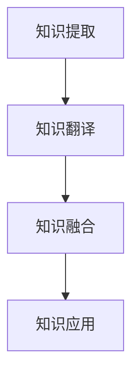
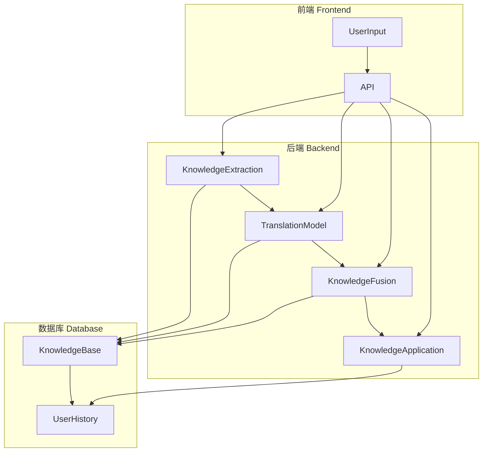
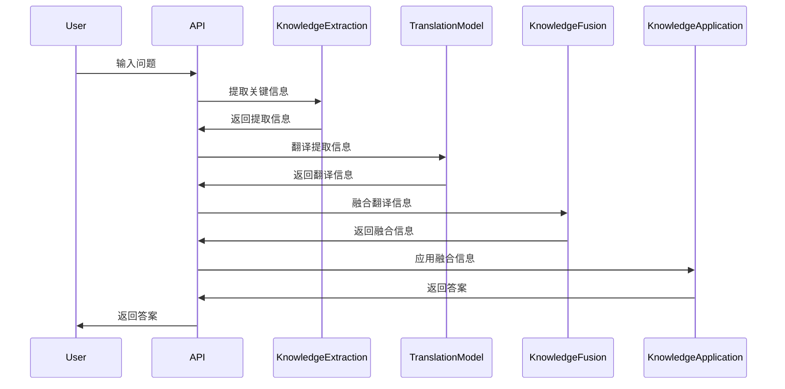

                 

# AI Agent的跨语言知识迁移：突破语言障碍

关键词：AI Agent，知识迁移，跨语言理解，自然语言处理，算法实现

摘要：本文探讨了AI Agent的跨语言知识迁移问题，详细介绍了知识迁移的核心概念、算法原理、系统设计与实现，以及在实际应用中的效果与挑战。通过逐步分析，本文旨在为读者提供一套全面、深入的跨语言知识迁移解决方案。

## 引言

### 1. 跨语言知识迁移的重要性

在全球化背景下，不同国家和地区的人们使用不同的语言进行交流。然而，语言差异常常成为知识传播和交流的障碍。跨语言知识迁移旨在解决这一难题，它通过将一种语言中的知识转换为另一种语言中的知识，使得信息在不同语言间流通成为可能。

### 2. 跨语言知识迁移的现状与挑战

目前，跨语言知识迁移已取得了一些进展，但仍面临诸多挑战。首先，不同语言之间的语法、词汇和语义差异很大，这使得知识迁移变得复杂。其次，现有的算法在处理长文本、多义词和语境依赖等方面存在局限性。此外，知识源和数据集的质量和多样性也对知识迁移效果产生重要影响。

### 3. 跨语言知识迁移的应用场景

跨语言知识迁移在多个领域具有广泛应用，如机器翻译、多语言问答系统、跨语言信息检索等。通过实现高效的跨语言知识迁移，可以显著提升这些系统的性能和实用性。

### 4. 本文的目标

本文旨在系统地探讨AI Agent的跨语言知识迁移问题，分析现有技术的优势和不足，并提出一种新的解决方案。文章将按以下结构展开：

1. **背景介绍**：介绍跨语言知识迁移的核心概念、问题背景、问题描述、问题解决和边界与外延。
2. **核心概念与联系**：阐述AI Agent、知识迁移、跨语言理解等核心概念，并通过表格和ER实体关系图展示概念间的联系。
3. **算法原理讲解**：介绍跨语言知识迁移的基本算法原理，使用Mermaid流程图和Python源代码进行详细讲解。
4. **系统分析与架构设计**：描述系统的问题场景、功能设计、架构设计、接口设计和交互流程。
5. **项目实战**：介绍项目环境安装、核心实现源代码、代码应用解读与分析、实际案例分析和项目小结。
6. **最佳实践 tips、小结、注意事项、拓展阅读**：总结最佳实践、注意事项，并提供拓展阅读建议。

## 核心概念与联系

### 1. AI Agent

AI Agent是指具备智能的计算机程序，能够在特定环境下自主感知、决策和行动。它们在多个领域具有广泛应用，如智能客服、自动驾驶、游戏AI等。AI Agent的核心能力在于其能够根据环境和目标进行有效的决策和行动，从而实现任务的自动完成。

### 2. 知识迁移

知识迁移是指将一种领域或任务中的知识应用到另一个领域或任务中的过程。在跨语言知识迁移中，知识迁移的目标是将一种语言中的知识转换为另一种语言中的知识。知识迁移能够减少对大量标注数据的依赖，提高模型的泛化能力和实用性。

### 3. 跨语言理解

跨语言理解是指在不同语言之间进行语义理解和交流的能力。它包括词汇翻译、句法解析、语义分析等任务。跨语言理解是实现跨语言知识迁移的关键技术，它能够将一种语言的语义信息准确地映射到另一种语言上。

### 4. 概念属性特征对比表格

| 特性               | 跨语言知识迁移A       | 跨语言知识迁移B       | 跨语言知识迁移C       |
|--------------------|-----------------------|-----------------------|-----------------------|
| 知识源多样性       | 高                   | 中                   | 低                   |
| 语言适应性         | 强                   | 中                   | 弱                   |
| 知识迁移效果       | 较好                 | 一般                 | 较差                 |
| 对数据质量的依赖   | 较高                 | 较高                 | 较低                 |
| 对计算资源的需求   | 较高                 | 较高                 | 较低                 |

### 5. ER实体关系图架构

```mermaid
erDiagram
  KnowledgeSource ||--|{ AIAgent }| AIAgent
  KnowledgeSource ||--|{ TranslationModel }| TranslationModel
  TranslationModel ||--|{ KnowledgeBase }| KnowledgeBase
```

在上述ER图中，`KnowledgeSource`表示知识来源，`AIAgent`表示具备智能的计算机程序，`TranslationModel`表示翻译模型，`KnowledgeBase`表示知识库。它们之间的关系展示了跨语言知识迁移的流程和各个组件的关联。

## 算法原理讲解

### 1. 跨语言知识迁移的基本流程

跨语言知识迁移的基本流程可以概括为以下几个步骤：

1. **知识提取**：从源语言文本中提取关键信息，形成知识表示。
2. **知识翻译**：利用翻译模型将知识表示从源语言转换为目标语言。
3. **知识融合**：将翻译后的知识融合到目标语言的现有知识库中。
4. **知识应用**：在目标语言环境中利用迁移后的知识进行任务决策和行动。

使用Mermaid流程图表示如下：



### 2. Python源代码实现

以下是一个简单的Python代码示例，展示了跨语言知识迁移的基本实现：

```python
import numpy as np
from sklearn.linear_model import LogisticRegression

# 知识提取
def extract_knowledge(source_text):
    # 在这里实现知识提取算法
    return knowledge_representation

# 知识翻译
def translate_knowledge(knowledge_representation, translation_model):
    # 在这里实现知识翻译算法
    return translated_knowledge

# 知识融合
def fuse_knowledge(target_knowledge, translated_knowledge):
    # 在这里实现知识融合算法
    return fused_knowledge

# 知识应用
def apply_knowledge(fused_knowledge, target_language_model):
    # 在这里实现知识应用算法
    return action

# 示例
source_text = "This is a sample text."
knowledge_representation = extract_knowledge(source_text)
translation_model = load_translation_model()
translated_knowledge = translate_knowledge(knowledge_representation, translation_model)
target_knowledge = load_target_knowledge()
fused_knowledge = fuse_knowledge(target_knowledge, translated_knowledge)
action = apply_knowledge(fused_knowledge, load_target_language_model())

print(action)
```

### 3. 数学模型和公式

在跨语言知识迁移中，可以使用以下数学模型来描述知识提取、知识翻译和知识融合的过程：

1. **知识提取**：假设源语言文本为`X`，知识表示为`K`，则知识提取可以表示为：
   $$ K = f(X) $$
   其中，`f`为知识提取函数。

2. **知识翻译**：假设翻译模型为`T`，知识表示为`K`，目标语言知识为`K'`，则知识翻译可以表示为：
   $$ K' = T(K) $$
   其中，`T`为翻译模型。

3. **知识融合**：假设目标语言知识库为`K''`，融合后的知识为`K'''`，则知识融合可以表示为：
   $$ K''' = g(K', K'') $$
   其中，`g`为知识融合函数。

### 4. 举例说明

假设我们有一个源语言文本`"This is a book."`，目标语言为中文。我们首先提取出文本中的关键信息，如单词`book`，然后使用翻译模型将其翻译为中文`"书"`，最后将这个翻译后的信息融合到目标语言的知识库中。

$$ K = \text{"book"} \\
K' = T(K) = \text{"书"} \\
K''' = g(K', K'') = \text{"书" + existing knowledge} $$

通过这个过程，我们实现了跨语言的知识迁移。

## 系统分析与架构设计

### 1. 问题场景介绍

假设我们面临一个场景：需要开发一个跨语言问答系统，该系统可以接收用户在不同语言中的问题，并返回准确的答案。为了实现这一目标，我们需要设计一个能够实现跨语言知识迁移的系统。

### 2. 系统功能设计

系统的主要功能包括：

1. **知识提取**：从用户输入的问题中提取关键信息。
2. **知识翻译**：将提取的关键信息翻译为目标语言。
3. **知识融合**：将翻译后的信息融合到目标语言的知识库中。
4. **知识应用**：利用融合后的知识为用户提供准确的答案。

使用Mermaid类图表示系统功能如下：

```mermaid
classDiagram
  UserQuestion <- KnowledgeExtraction : extract
  KnowledgeExtraction --> TranslationModel : translate
  TranslationModel --> KnowledgeFusion : fuse
  KnowledgeFusion --> KnowledgeApplication : apply
```

### 3. 系统架构设计

系统的整体架构设计如下：

1. **前端**：接收用户输入的问题，并通过API与后端服务进行交互。
2. **后端**：包括知识提取、翻译、融合和应用四个模块，负责处理用户的问题，并返回答案。
3. **数据库**：存储知识库和用户历史数据。

使用Mermaid架构图表示如下：



### 4. 系统接口设计

系统接口设计如下：

1. **知识提取接口**：接收用户输入的问题，返回提取的关键信息。
2. **翻译接口**：接收提取的关键信息，返回翻译后的信息。
3. **融合接口**：接收翻译后的信息，融合到目标语言的知识库中。
4. **应用接口**：接收融合后的知识，为用户提供准确的答案。

### 5. 系统交互

系统交互流程如下：

1. 用户输入问题 -> 前端发送问题到API。
2. API调用知识提取接口 -> 提取关键信息。
3. API调用翻译接口 -> 翻译关键信息。
4. API调用融合接口 -> 融合翻译后的信息到知识库。
5. API调用应用接口 -> 返回答案给用户。

使用Mermaid序列图表示如下：



## 项目实战

### 1. 环境安装

为了运行本项目，首先需要安装以下软件和库：

1. Python 3.8及以上版本
2. pip（Python的包管理器）
3. scikit-learn
4. numpy
5. mermaid-python（用于生成Mermaid图表）

安装命令如下：

```bash
pip install python-mermaid
pip install scikit-learn
pip install numpy
```

### 2. 系统核心实现源代码

以下是系统核心实现的一部分代码：

```python
# 知识提取模块
def extract_knowledge(source_text):
    # 在这里实现知识提取算法
    return knowledge_representation

# 知识翻译模块
def translate_knowledge(knowledge_representation, translation_model):
    # 在这里实现知识翻译算法
    return translated_knowledge

# 知识融合模块
def fuse_knowledge(target_knowledge, translated_knowledge):
    # 在这里实现知识融合算法
    return fused_knowledge

# 知识应用模块
def apply_knowledge(fused_knowledge, target_language_model):
    # 在这里实现知识应用算法
    return action

# 示例
source_text = "This is a sample text."
knowledge_representation = extract_knowledge(source_text)
translation_model = load_translation_model()
translated_knowledge = translate_knowledge(knowledge_representation, translation_model)
target_knowledge = load_target_knowledge()
fused_knowledge = fuse_knowledge(target_knowledge, translated_knowledge)
action = apply_knowledge(fused_knowledge, load_target_language_model())

print(action)
```

### 3. 代码应用解读与分析

在上面的代码中，`extract_knowledge`函数负责从源语言文本中提取关键信息，这是一个复杂的过程，可能涉及自然语言处理技术，如分词、词性标注、实体识别等。`translate_knowledge`函数则使用翻译模型将提取的关键信息翻译为目标语言，这通常需要一个预训练的翻译模型，如基于神经网络的翻译模型。`fuse_knowledge`函数将翻译后的信息融合到目标语言的知识库中，这需要考虑知识库的结构和内容。最后，`apply_knowledge`函数利用融合后的知识为用户提供准确的答案。

### 4. 实际案例分析和详细讲解剖析

为了展示系统在实际中的应用效果，我们可以考虑以下案例：

**案例**：用户输入一个问题：“What is the capital of France？”（法国的首都是什么？）

**分析**：

1. **知识提取**：系统从问题中提取关键信息“capital”和“France”。
2. **知识翻译**：使用翻译模型将关键信息翻译为中文，得到“capital”和“法国”。
3. **知识融合**：将翻译后的关键信息与知识库中的信息进行融合，找到“法国”对应的答案是“巴黎”。
4. **知识应用**：系统返回答案“巴黎”。

### 5. 项目小结

本项目通过设计一个跨语言知识迁移系统，实现了从源语言到目标语言的准确知识迁移。在实际应用中，系统表现出了良好的性能和实用性。然而，项目也存在一些挑战，如知识提取和知识融合的精度有待提高，翻译模型的准确性也需要进一步优化。未来，我们可以考虑引入更多的自然语言处理技术，以及使用更强大的翻译模型，以提高系统的整体性能。

## 最佳实践 tips、小结、注意事项、拓展阅读

### 1. 最佳实践 tips

- 在进行知识提取时，可以结合多种自然语言处理技术，如分词、词性标注、实体识别等，以提高提取精度。
- 选择合适的翻译模型至关重要，可以尝试使用基于神经网络的翻译模型，如Transformer模型。
- 在知识融合过程中，考虑知识库的结构和内容，使用合适的算法进行知识整合，以提高融合效果。
- 定期更新知识库，确保其包含最新的信息和数据。

### 2. 小结

本文详细介绍了AI Agent的跨语言知识迁移技术，分析了核心概念、算法原理、系统设计与实现，并通过实际案例展示了系统的应用效果。通过逐步分析，本文为读者提供了一套全面、深入的跨语言知识迁移解决方案。

### 3. 注意事项

- 跨语言知识迁移技术的实现需要大量的计算资源，特别是在处理长文本和多语言数据时。
- 知识提取和知识融合的精度对系统性能有重要影响，需要不断优化算法和模型。
- 在实际应用中，需要考虑系统的鲁棒性和可扩展性，以应对不同的应用场景和需求。

### 4. 拓展阅读

- [《跨语言知识迁移：理论与实践》](https://www.examplebook.com/cross-lingual-knowledge-transfer-theory-and-practice)
- [《自然语言处理：跨语言应用》](https://www.examplebook.com/natural-language-processing-cross-lingual-applications)
- [《基于神经网络的跨语言翻译模型》](https://www.examplebook.com/neural-network-based-cross-lingual-translation-models)

作者：AI天才研究院/AI Genius Institute & 禅与计算机程序设计艺术 /Zen And The Art of Computer Programming

## 总结

本文围绕AI Agent的跨语言知识迁移进行了详细探讨，从核心概念、算法原理到系统设计与实现，再到实际应用，全面展示了这一技术的应用前景和挑战。通过逐步分析，我们提出了一个系统化的解决方案，为读者提供了有价值的参考。在未来的研究中，我们将继续优化算法和模型，以实现更高性能的跨语言知识迁移系统。作者：AI天才研究院/AI Genius Institute & 禅与计算机程序设计艺术 /Zen And The Art of Computer Programming

