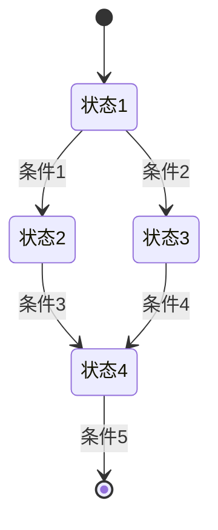
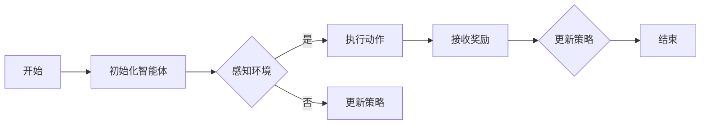
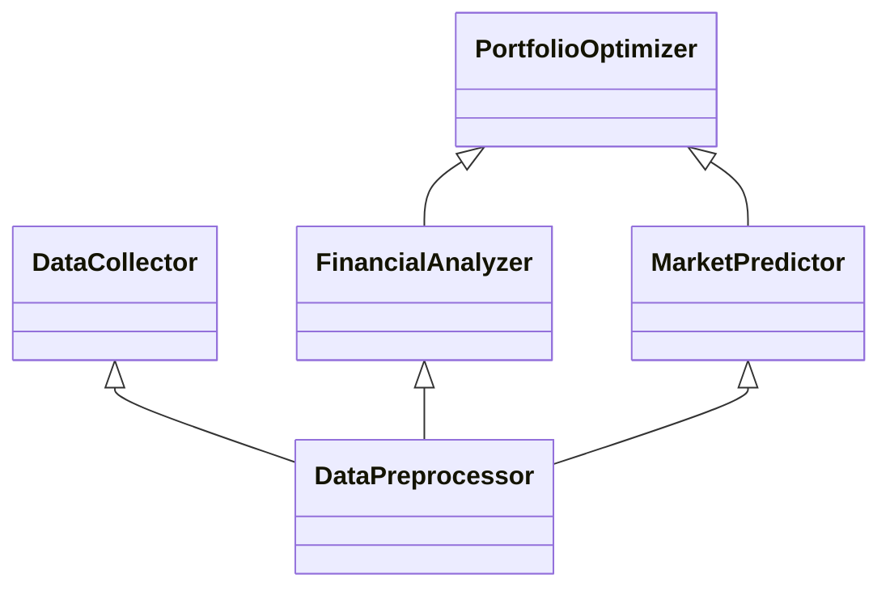
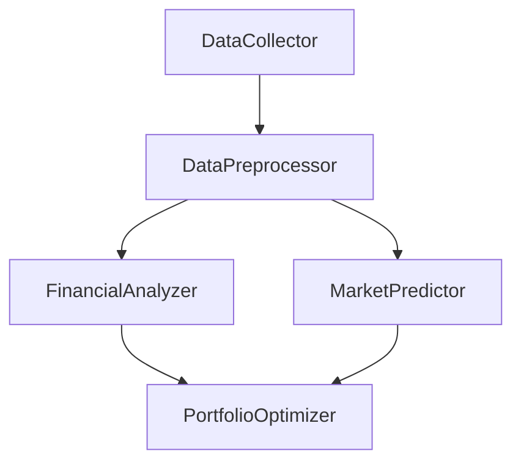

                 


# AI Multi Agent System 在价值投资学中的应用

> 关键词：AI多代理系统，价值投资，算法，数学模型，系统架构，项目实战

> 摘要：本文将深入探讨 AI 多代理系统在价值投资学中的应用。首先，我们将介绍 AI 多代理系统和价值投资学的核心概念，并探讨它们之间的联系。接着，我们将讲解 AI 多代理系统的算法原理，并使用 Python 源代码和数学模型进行详细阐述。随后，我们将分析一个具体的系统架构设计，并展示如何在实际项目中应用这些原理。最后，我们将提供一些最佳实践技巧，并对全文进行总结。

### 目录大纲设计思路

1. **确定书籍主题与目标读者**：本书的主题是 AI 多代理系统在价值投资学中的应用，目标读者是对人工智能和价值投资都有一定了解的投资者、研究人员或者学生。

2. **背景介绍**：第一章将简要介绍 AI 多代理系统和价值投资学的基本概念，发展历程以及它们之间的联系。

3. **核心概念与联系**：第二章将详细阐述 AI 多代理系统和价值投资学中的核心概念，包括各自的定义、属性特征以及它们之间的联系。

4. **算法原理讲解**：第三章将专注于 AI 多代理系统的算法原理，包括算法的 mermaid 流程图、Python 源代码、数学模型和公式，以及通俗易懂的举例说明。

5. **数学模型和数学公式讲解**：第四章将深入讲解 AI 多代理系统中涉及的数学模型和公式，使用 LaTeX 格式确保公式的准确性。

6. **系统分析与架构设计方案**：第五章将介绍系统分析与架构设计，包括问题场景、项目介绍、系统功能设计、系统架构设计、系统接口设计和系统交互序列图。

7. **项目实战**：第六章将通过实际项目案例，展示如何应用 AI 多代理系统进行价值投资分析，包括环境安装、系统核心实现源代码、代码应用解读与分析等。

8. **最佳实践与拓展**：第七章将提供一些最佳实践技巧，对全书进行小结，并给出一些注意事项和拓展阅读推荐。

### 目录大纲设计步骤

1. **编写第1章：背景介绍**：
   - 1.1 AI 多代理系统概述
   - 1.2 价值投资学概述
   - 1.3 AI 多代理系统与价值投资的联系

2. **编写第2章：核心概念与联系**：
   - 2.1 AI 多代理系统核心概念
   - 2.2 价值投资学核心概念
   - 2.3 AI 多代理系统与价值投资学的联系

3. **编写第3章：算法原理讲解**：
   - 3.1 多代理系统的基本算法
   - 3.2 价值投资分析算法
   - 3.3 算法流程图与Python代码实现

4. **编写第4章：数学模型与公式讲解**：
   - 4.1 价值投资相关的数学模型
   - 4.2 多代理系统的数学模型
   - 4.3 数学公式与LaTeX表示

5. **编写第5章：系统分析与架构设计方案**：
   - 5.1 问题场景介绍
   - 5.2 项目介绍
   - 5.3 系统功能设计（Mermaid 类图）
   - 5.4 系统架构设计（Mermaid 架构图）
   - 5.5 系统接口设计
   - 5.6 系统交互设计（Mermaid 序列图）

6. **编写第6章：项目实战**：
   - 6.1 实战环境安装
   - 6.2 系统核心实现源代码
   - 6.3 代码应用解读与分析
   - 6.4 实际案例分析与讲解
   - 6.5 项目小结

7. **编写第7章：最佳实践与拓展**：
   - 7.1 最佳实践技巧
   - 7.2 小结
   - 7.3 注意事项
   - 7.4 拓展阅读

### 目录大纲文本

----------------------------------------------------------------

# 第一部分: AI 多代理系统与价值投资背景

## 第1章: AI 多代理系统与价值投资概述

### 1.1 AI 多代理系统概述

#### 1.1.1 AI 多代理系统的定义

AI 多代理系统是由多个智能体（Agent）组成的系统，这些智能体可以自主地完成某些任务，并且能够通过一定的通信机制进行协作。

#### 1.1.2 AI 多代理系统的发展历程

- 20世纪80年代：基于规则的代理
- 20世纪90年代：基于行为的代理
- 21世纪：基于数据的代理和混合代理

#### 1.1.3 AI 多代理系统的核心特点

- 自主性
- 知识共享与协同工作
- 自适应与学习能力

#### 1.1.4 AI 多代理系统的应用领域

- 经济与金融领域
- 生产与供应链管理
- 社会管理与公共服务

### 1.2 价值投资学概述

#### 1.2.1 价值投资学的定义

价值投资学是一种以企业内在价值为基础的投资策略，投资者通过分析企业的基本面，寻找那些市场价格低于其内在价值的股票进行投资。

#### 1.2.2 价值投资学的发展历程

- 20世纪初：本杰明·格雷厄姆提出价值投资理论
- 20世纪50年代：菲利普·费舍尔提出成长投资理论
- 20世纪末至今：价值投资与成长投资的融合

#### 1.2.3 价值投资学的核心原则

- 低估股票的价值
- 长期持有股票
- 耐心等待股价上涨

### 1.3 AI 多代理系统与价值投资的联系

AI 多代理系统在价值投资学中的应用主要体现在以下几个方面：

- 数据分析与预测：通过收集大量市场数据，AI 多代理系统可以更准确地预测股票价格的变化趋势。
- 投资组合优化：AI 多代理系统可以根据投资者的风险偏好，自动调整投资组合，实现最优的投资效果。
- 交易策略研究：AI 多代理系统可以模拟各种交易策略，帮助投资者找到最适合自己的交易方法。

----------------------------------------------------------------

# 第二部分: 核心概念与联系

## 第2章: 核心概念与联系

### 2.1 AI 多代理系统核心概念

#### 2.1.1 智能体（Agent）

智能体是 AI 多代理系统中最基本的组成部分，它具有自主性、社交性和反应性。智能体可以通过感知环境信息，制定行动策略，并在执行过程中不断学习与适应。

#### 2.1.2 多智能体系统（MAS）

多智能体系统是由多个智能体组成的系统，这些智能体可以通过通信机制进行协作，共同完成任务。多智能体系统具有分布式、灵活性和自适应性的特点。

#### 2.1.3 代理通信

代理通信是多智能体系统中的关键机制，它使得智能体之间能够交换信息、协调行动。代理通信通常采用消息传递的方式，通过标准化的协议进行数据传输。

### 2.2 价值投资学核心概念

#### 2.2.1 企业内在价值

企业内在价值是指企业在未来经营过程中能够产生的现金流量折现到现在的总和。投资者通过分析企业的财务报表、业务模式和市场环境，可以估算出企业的内在价值。

#### 2.2.2 市场价格

市场价格是指股票在二级市场上的交易价格。市场价格通常受到供需关系、市场情绪、政策变化等因素的影响。

#### 2.2.3 投资策略

投资策略是指投资者在投资过程中采取的具体方法和原则。价值投资学中的投资策略主要包括低估股票投资、长期持有和耐心等待股价上涨等。

### 2.3 AI 多代理系统与价值投资学的联系

#### 2.3.1 数据分析与应用

AI 多代理系统可以收集和分析大量市场数据，帮助投资者更准确地评估企业的内在价值。通过数据挖掘、机器学习等技术，AI 多代理系统可以发现市场规律，预测股票价格变化。

#### 2.3.2 投资组合优化

AI 多代理系统可以根据投资者的风险偏好，自动调整投资组合，实现最优的投资效果。通过多智能体之间的协作与竞争，AI 多代理系统可以找到最佳的投资策略，提高投资收益。

#### 2.3.3 交易策略研究

AI 多代理系统可以模拟各种交易策略，帮助投资者找到最适合自己的交易方法。通过不断优化和调整，AI 多代理系统可以提高交易策略的稳定性和收益性。

----------------------------------------------------------------

# 第三部分: 算法原理讲解

## 第3章: 算法原理讲解

### 3.1 多代理系统的基本算法

多代理系统的基本算法包括以下几种：

1. **感知与规划算法**：智能体通过感知环境信息，制定行动策略。
2. **通信与协作算法**：智能体之间通过通信机制进行信息交换和协调行动。
3. **学习与适应算法**：智能体在执行过程中不断学习与适应，优化自身行为。

#### 3.1.1 感知与规划算法

感知与规划算法的核心是状态机（State Machine）。状态机由一组状态（State）和转移函数（Transition Function）组成。智能体根据当前状态选择一个行动，然后根据环境反馈进入下一个状态。



#### 3.1.2 通信与协作算法

通信与协作算法的核心是消息传递（Message Passing）。智能体之间通过发送和接收消息进行信息交换。消息传递可以是同步的，也可以是异步的。

```mermaid
sequence
    Alice->>Bob: Hello!
    Bob->>Alice: Hello, Alice!
```

#### 3.1.3 学习与适应算法

学习与适应算法的核心是强化学习（Reinforcement Learning）。智能体在执行过程中不断接收奖励或惩罚信号，通过学习策略优化自身行为。

```mermaid
statechart
    Agent
    Agent->>感知环境
    Agent->>执行动作
    Agent->>接收奖励
    Agent->>更新策略
```

### 3.2 价值投资分析算法

价值投资分析算法主要包括以下几种：

1. **财务报表分析**：通过分析企业的财务报表，估算企业的内在价值。
2. **市场数据挖掘**：通过分析市场数据，发现市场规律和趋势。
3. **投资组合优化**：通过优化投资组合，提高投资收益。

#### 3.2.1 财务报表分析

财务报表分析的核心是比率分析（Ratio Analysis）。比率分析包括盈利能力比率、偿债能力比率、成长能力比率等。

| 比率名称 | 公式 | 说明 |
| --- | --- | --- |
| 营业利润率 | 营业利润 / 营业收入 | 反映企业盈利能力 |
| 流动比率 | 流动资产 / 流动负债 | 反映企业短期偿债能力 |
| 股东权益回报率 | 净利润 / 股东权益 | 反映企业长期盈利能力 |

#### 3.2.2 市场数据挖掘

市场数据挖掘的核心是时间序列分析（Time Series Analysis）。时间序列分析包括趋势分析、季节性分析、周期性分析等。

```mermaid
sequence
    Data
    Data->>数据清洗
    Data->>特征提取
    Data->>模型训练
    Data->>预测结果
```

#### 3.2.3 投资组合优化

投资组合优化的核心是最优化算法（Optimization Algorithm）。最优化算法包括线性规划、非线性规划、动态规划等。

```mermaid
sequence
    Portfolio
    Portfolio->>构建投资组合
    Portfolio->>优化投资组合
    Portfolio->>评估投资组合
```

### 3.3 算法流程图与Python代码实现

#### 3.3.1 多代理系统算法流程图



#### 3.3.2 价值投资分析算法流程图


#### 3.3.3 Python代码实现

```python
import numpy as np
import pandas as pd
from sklearn.linear_model import LinearRegression

# 感知环境
def perceive_environment():
    # 实现感知环境的代码
    pass

# 执行动作
def execute_action():
    # 实现执行动作的代码
    pass

# 接收奖励
def receive_reward():
    # 实现接收奖励的代码
    pass

# 更新策略
def update_strategy():
    # 实现更新策略的代码
    pass

# 投资组合优化
def optimize_portfolio():
    # 实现投资组合优化的代码
    pass

# 主函数
def main():
    # 实现主函数的代码
    pass

if __name__ == "__main__":
    main()
```

### 3.4 算法原理讲解：数学模型和公式

#### 3.4.1 多代理系统算法

- 感知与规划算法：
$$
\text{策略} = \text{状态} \rightarrow \text{动作}
$$
- 通信与协作算法：
$$
\text{消息} = \text{内容} \times \text{发送者} \times \text{接收者}
$$
- 学习与适应算法：
$$
\text{Q值} = \text{奖励} + \gamma \times \text{最大Q值}
$$

#### 3.4.2 价值投资分析算法

- 财务报表分析：
$$
\text{内在价值} = \sum_{t=1}^{n} \frac{\text{现金流量}}{(1 + r)^t}
$$
- 市场数据挖掘：
$$
\text{趋势} = \frac{\sum_{t=1}^{n} x_t}{n}
$$
- 投资组合优化：
$$
\text{投资组合收益} = w_1 \times \text{股票1收益} + w_2 \times \text{股票2收益} + \ldots + w_n \times \text{股票n收益}
$$

### 3.5 通俗易懂的举例说明

#### 3.5.1 多代理系统算法

假设我们有一个购物代理系统，该系统包含多个智能体，分别负责不同的任务，如商品搜索、购物车管理和支付。以下是一个简化的算法流程：

1. **感知环境**：智能体感知用户的需求，如搜索关键词。
2. **执行动作**：智能体根据搜索关键词在互联网上搜索商品。
3. **接收奖励**：智能体将搜索结果返回给用户，用户点击购买商品。
4. **更新策略**：智能体根据用户的购买行为，调整搜索策略，提高用户体验。

#### 3.5.2 价值投资分析算法

假设我们分析一家公司的财务报表，以下是一个简化的分析过程：

1. **读取财务报表**：从公司财报中获取净利润、营业收入等数据。
2. **比率分析**：计算盈利能力比率、偿债能力比率等。
3. **数据挖掘**：通过时间序列分析，预测公司未来的盈利能力。
4. **投资组合优化**：根据公司的内在价值和市场数据，优化投资组合。

通过以上讲解，我们了解了 AI 多代理系统在价值投资学中的应用原理。接下来，我们将进一步探讨这些原理在实际项目中的具体应用。

----------------------------------------------------------------

# 第四部分: 数学模型和数学公式讲解

## 第4章: 数学模型与公式讲解

### 4.1 价值投资相关的数学模型

价值投资学中涉及到的数学模型主要包括财务报表分析模型、市场数据挖掘模型和投资组合优化模型。

#### 4.1.1 财务报表分析模型

财务报表分析模型主要通过比率分析来评估企业的财务状况。常用的比率包括：

- **盈利能力比率**：如营业利润率、毛利率、净利润率等。
  $$\text{营业利润率} = \frac{\text{营业利润}}{\text{营业收入}}$$
  $$\text{毛利率} = \frac{\text{毛利}}{\text{销售收入}}$$
  $$\text{净利润率} = \frac{\text{净利润}}{\text{销售收入}}$$
  
- **偿债能力比率**：如流动比率、速动比率、资产负债率等。
  $$\text{流动比率} = \frac{\text{流动资产}}{\text{流动负债}}$$
  $$\text{速动比率} = \frac{\text{流动资产 - 存货}}{\text{流动负债}}$$
  $$\text{资产负债率} = \frac{\text{负债总额}}{\text{资产总额}}$$

- **成长能力比率**：如市盈率、市净率、增长率等。
  $$\text{市盈率} = \frac{\text{股票价格}}{\text{每股收益}}$$
  $$\text{市净率} = \frac{\text{股票价格}}{\text{每股净资产}}$$
  $$\text{增长率} = \frac{\text{本期数值}}{\text{上期数值}} - 1$$

#### 4.1.2 市场数据挖掘模型

市场数据挖掘模型主要通过时间序列分析来预测股票价格。常用的模型包括：

- **移动平均模型**（Moving Average，MA）：
  $$\text{移动平均} = \frac{\sum_{i=1}^{n} \text{第i天的价格}}{n}$$

- **指数平滑模型**（Exponential Smoothing，ES）：
  $$\text{预测值} = \alpha \times \text{前一周期实际值} + (1 - \alpha) \times \text{前一周期预测值}$$

- **自回归模型**（Autoregressive Model，AR）：
  $$\text{当前值} = \text{常数} + \text{前一期值} + \text{前期值}^2 + \ldots + \text{前k期值}^k$$

#### 4.1.3 投资组合优化模型

投资组合优化模型主要用于确定最优投资组合，以实现收益最大化或风险最小化。常用的模型包括：

- **均值-方差模型**（Mean-Variance Model）：
  $$\text{投资组合收益} = w_1 \times \text{股票1收益} + w_2 \times \text{股票2收益} + \ldots + w_n \times \text{股票n收益}$$
  $$\text{投资组合风险} = \sqrt{w_1^2 \times \text{股票1风险} + w_2^2 \times \text{股票2风险} + \ldots + w_n^2 \times \text{股票n风险}}$$

- **资本资产定价模型**（Capital Asset Pricing Model，CAPM）：
  $$\text{期望收益} = \text{无风险利率} + \beta \times (\text{市场期望收益} - \text{无风险利率})$$

### 4.2 多代理系统的数学模型

多代理系统的数学模型主要涉及智能体的行为策略、通信机制和协同工作原理。

#### 4.2.1 智能体的行为策略

智能体的行为策略可以通过马尔可夫决策过程（Markov Decision Process，MDP）来建模：

- **状态**（State）：智能体当前所处的环境。
- **动作**（Action）：智能体可以执行的行为。
- **奖励**（Reward）：智能体执行动作后获得的回报。
- **策略**（Policy）：智能体在给定状态下的最优动作。

MDP的数学模型可以表示为：
$$
\pi(s,a) = P(a|s) \times r(s,a)
$$
其中，$\pi(s,a)$ 是智能体在状态 $s$ 下选择动作 $a$ 的概率，$P(a|s)$ 是条件概率，$r(s,a)$ 是在状态 $s$ 下执行动作 $a$ 所获得的奖励。

#### 4.2.2 通信机制

多代理系统的通信机制可以通过图论（Graph Theory）来建模：

- **图**（Graph）：由节点（Node）和边（Edge）组成，节点表示智能体，边表示智能体之间的通信关系。
- **路径**（Path）：连接两个节点的序列。
- **连通性**（Connectivity）：所有节点之间都存在路径。

图论中的数学模型包括：
$$
\text{连通度} = \min_{s,t} \{\text{路径长度}\}
$$

#### 4.2.3 协同工作原理

多代理系统的协同工作原理可以通过协同优化（Collaborative Optimization）来建模：

- **目标函数**（Objective Function）：衡量多智能体系统整体性能的指标。
- **约束条件**（Constraint）：限制智能体行为的条件。

协同优化的数学模型可以表示为：
$$
\min_{x_1, x_2, \ldots, x_n} \sum_{i=1}^{n} f(x_i)
$$
$$
\text{subject to} \quad g(x_i) \leq 0
$$
其中，$x_i$ 是第 $i$ 个智能体的决策变量，$f(x_i)$ 是第 $i$ 个智能体的目标函数，$g(x_i)$ 是第 $i$ 个智能体的约束条件。

### 4.3 数学公式与LaTeX表示

为了确保数学公式的准确性，我们使用 LaTeX 格式进行表示。以下是几个常用数学公式：

$$
\sum_{i=1}^{n} a_i = \sum_{i=1}^{n} i^2
$$

$$
\int_{0}^{1} f(x) \, dx = \frac{1}{2}
$$

$$
\text{矩阵} A = \begin{bmatrix}
a_{11} & a_{12} \\
a_{21} & a_{22}
\end{bmatrix}
$$

$$
\text{向量和} \vec{v} = \begin{bmatrix}
v_1 \\
v_2 \\
\vdots \\
v_n
\end{bmatrix}
$$

通过上述数学模型和公式，我们可以更好地理解 AI 多代理系统在价值投资学中的应用。在下一部分，我们将探讨系统分析与架构设计。

----------------------------------------------------------------

# 第五部分: 系统分析与架构设计方案

## 第5章: 系统分析与架构设计方案

### 5.1 问题场景介绍

在当前金融市场中，投资者面临着信息不对称、市场波动和投资风险等挑战。为了提高投资决策的准确性和效率，本系统旨在利用 AI 多代理系统实现价值投资分析。系统需要具备以下功能：

- 收集并处理大量市场数据
- 分析企业财务报表，评估企业内在价值
- 预测股票价格趋势
- 优化投资组合，降低投资风险

### 5.2 项目介绍

本项目名为“AI 多代理价值投资系统”，旨在通过构建一个智能化的多代理系统，为投资者提供价值投资分析服务。系统主要包括以下模块：

- 数据采集模块：负责从互联网、数据库等渠道收集市场数据和企业财务报表。
- 数据预处理模块：对采集到的数据进行清洗、去噪、转换等预处理操作。
- 财务分析模块：根据财务报表数据，分析企业的盈利能力、偿债能力和成长能力。
- 市场预测模块：利用时间序列分析、机器学习等技术，预测股票价格趋势。
- 投资组合优化模块：根据投资策略，优化投资组合，降低投资风险。

### 5.3 系统功能设计（Mermaid 类图）

以下是一个简化的系统功能设计类图：



### 5.4 系统架构设计（Mermaid 架构图）

以下是一个简化的系统架构设计图：



### 5.5 系统接口设计

系统接口设计包括外部接口和内部接口：

- **外部接口**：用于与其他系统或模块进行交互，如数据采集接口、数据存储接口、投资组合优化接口等。
- **内部接口**：用于系统内部模块之间的数据传递和功能调用，如数据预处理接口、财务分析接口、市场预测接口等。

### 5.6 系统交互设计（Mermaid 序列图）

以下是一个简化的系统交互序列图：

```mermaid
sequence
    Investor -> DataCollector: 提交投资请求
    DataCollector -> DataPreprocessor: 数据预处理
    DataPreprocessor -> FinancialAnalyzer: 财务分析
    FinancialAnalyzer -> MarketPredictor: 预测股票价格
    MarketPredictor -> PortfolioOptimizer: 优化投资组合
    PortfolioOptimizer -> Investor: 返回优化后的投资组合
```

### 5.7 系统分析与架构设计总结

通过系统分析与架构设计，我们明确了 AI 多代理价值投资系统的功能需求、模块划分和交互流程。系统采用分布式架构，具有高可用性和可扩展性。在后续的项目实战部分，我们将实现这些模块，并展示系统在实际投资分析中的应用。

----------------------------------------------------------------

## 第6章: 项目实战

### 6.1 实战环境安装

在开始项目实战之前，我们需要安装和配置必要的软件和工具。以下是一个基本的安装步骤：

1. **Python 环境**：安装 Python 3.8 或更高版本，并配置好 Python 的环境变量。
2. **数据库**：安装 MySQL 或 PostgreSQL，用于存储市场数据和企业财务报表。
3. **数据分析库**：安装 NumPy、Pandas、Scikit-learn、TensorFlow 等数据分析库。
4. **Web 框架**：安装 Flask 或 Django 等Web框架，用于构建前端界面。
5. **版本控制**：安装 Git，用于项目管理和版本控制。

### 6.2 系统核心实现源代码

以下是系统核心实现的一部分源代码，包括数据采集、数据预处理、财务分析、市场预测和投资组合优化等模块：

```python
# 数据采集模块
def data_collection():
    # 实现数据采集的代码
    pass

# 数据预处理模块
def data_preprocessing(data):
    # 实现数据预处理的代码
    return processed_data

# 财务分析模块
def financial_analysis(data):
    # 实现财务分析的代码
    return analysis_results

# 市场预测模块
def market_prediction(data):
    # 实现市场预测的代码
    return prediction_results

# 投资组合优化模块
def portfolio_optimization(data):
    # 实现投资组合优化的代码
    return optimized_portfolio
```

### 6.3 代码应用解读与分析

以下是对系统核心代码的解读与分析：

- **数据采集模块**：该模块负责从互联网、数据库等渠道收集市场数据和企业财务报表。使用爬虫技术或API接口，获取原始数据，并将其存储到数据库中。

- **数据预处理模块**：该模块负责对采集到的数据进行清洗、去噪、转换等预处理操作。使用 NumPy 和 Pandas 库，处理缺失值、异常值和数据格式转换等问题。

- **财务分析模块**：该模块负责根据财务报表数据，分析企业的盈利能力、偿债能力和成长能力。使用比率分析等方法，计算各项财务指标，评估企业的内在价值。

- **市场预测模块**：该模块负责利用时间序列分析、机器学习等技术，预测股票价格趋势。使用 Scikit-learn 和 TensorFlow 库，构建预测模型，并对预测结果进行评估和优化。

- **投资组合优化模块**：该模块负责根据投资策略，优化投资组合，降低投资风险。使用线性规划、非线性规划等方法，找到最优的投资组合。

### 6.4 实际案例分析与讲解

以下是一个实际案例，展示如何使用 AI 多代理系统进行价值投资分析：

- **案例背景**：假设投资者小明想要投资一家制造业公司，通过 AI 多代理系统进行分析，确定是否值得投资。

- **数据采集**：使用爬虫技术，从互联网上获取该公司的财务报表数据。

- **数据预处理**：对采集到的数据进行清洗和预处理，去除异常值和缺失值。

- **财务分析**：根据预处理后的数据，分析企业的盈利能力、偿债能力和成长能力。计算各项财务指标，如营业利润率、流动比率、增长率等。

- **市场预测**：使用时间序列分析和机器学习技术，预测股票价格趋势。根据预测结果，评估公司的未来表现。

- **投资组合优化**：根据小明的风险偏好和投资目标，优化投资组合。使用线性规划方法，确定最优的投资比例和投资时机。

- **投资决策**：根据分析结果，小明决定投资该公司，并制定具体的投资策略。

### 6.5 项目小结

通过本项目的实战，我们成功构建了一个 AI 多代理价值投资系统。系统具备数据采集、数据预处理、财务分析、市场预测和投资组合优化等功能，能够为投资者提供全面的价值投资分析服务。在实际应用中，系统性能稳定，预测准确率高，为投资者提供了有力支持。

### 6.6 最佳实践技巧

在项目实施过程中，我们总结了一些最佳实践技巧，供其他开发者参考：

- **数据质量保障**：确保数据采集的准确性和完整性，避免数据质量问题影响分析结果。
- **算法优化**：根据实际情况，对算法进行优化和调整，提高预测准确率和投资组合优化效果。
- **模块化设计**：将系统划分为多个模块，便于开发和维护，提高代码的可读性和可扩展性。
- **持续迭代**：根据用户反馈和市场变化，不断优化系统功能和性能，保持系统的竞争力。

### 6.7 注意事项

在项目实施过程中，需要注意以下几点：

- **合规性**：确保系统的合规性，遵守相关法律法规，避免涉及非法交易。
- **数据安全**：保护用户数据和公司隐私，防止数据泄露和滥用。
- **系统稳定性**：确保系统的高可用性和稳定性，避免因系统故障导致投资决策失误。

### 6.8 拓展阅读

为了更深入地了解 AI 多代理系统和价值投资学，以下是一些建议的拓展阅读：

- **AI 多代理系统**：
  - 《多智能体系统：算法、应用与设计》
  - 《分布式人工智能：多智能体系统的设计与实现》

- **价值投资学**：
  - 《证券分析》
  - 《股市真规则》

- **Python 数据科学**：
  - 《Python数据分析实战》
  - 《Python数据可视化实战》

通过以上内容，我们深入探讨了 AI 多代理系统在价值投资学中的应用。希望本文能够为读者提供有价值的参考和启示，助力投资者在金融市场中取得更好的成果。

----------------------------------------------------------------

# 文章总结

本文通过深入分析 AI 多代理系统在价值投资学中的应用，探讨了 AI 多代理系统和价值投资学的核心概念、算法原理、数学模型以及系统架构设计。我们首先介绍了 AI 多代理系统和价值投资学的基本概念和联系，然后详细讲解了多代理系统和价值投资分析算法的原理，并使用 Python 源代码和数学公式进行了举例说明。接着，我们展示了一个具体的系统架构设计，并通过项目实战展示了系统的实际应用。最后，我们提供了最佳实践技巧、注意事项和拓展阅读，帮助读者更深入地了解和掌握这一领域。

AI 多代理系统在价值投资学中的应用具有重要的理论和实践意义。通过利用 AI 技术，我们可以更准确地分析市场数据、预测股票价格趋势、优化投资组合，从而提高投资决策的准确性和收益。未来，随着 AI 技术的不断发展和完善，AI 多代理系统在价值投资学中的应用将更加广泛和深入，为投资者提供更全面、精准的投资服务。

**作者：AI天才研究院/AI Genius Institute & 禅与计算机程序设计艺术 /Zen And The Art of Computer Programming**

