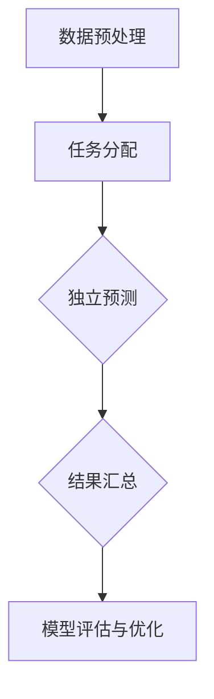
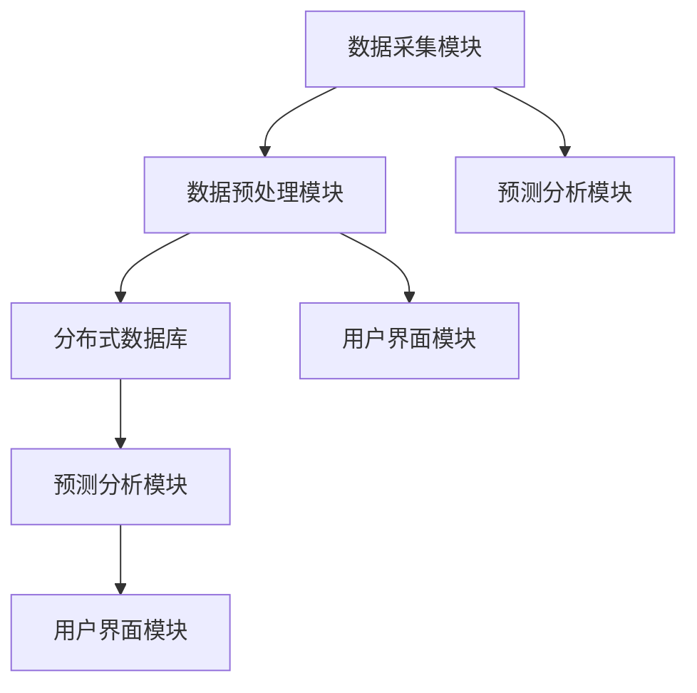

                 

## 第1章 问题背景与定义

### 1.1 全球资金流动的现状

在全球化的经济体系下，资金流动成为国际经济活动中至关重要的一部分。资金的跨国流动不仅反映了各国经济的相互依存关系，还对全球金融市场的稳定性、经济增长以及国际贸易有着深远的影响。当前，全球资金流动呈现出以下特点：

1. **快速增加**：随着全球化的深入，资金流动的规模和速度都在迅速增长。根据国际货币基金组织（IMF）的数据，全球资金流动量在过去十年间增加了近一倍，达到了数万亿美元。

2. **复杂化**：资金流动的路径和方式越来越复杂，涉及多种金融工具和交易平台。例如，跨境支付、外汇交易、大宗商品交易等，都需要资金的流动。

3. **波动性**：全球经济环境的变化、政治局势的波动、金融政策的调整等都可能导致资金流动的剧烈波动。例如，2008年的全球金融危机就导致了资金流动的急剧减少。

4. **数字货币兴起**：随着区块链和加密货币技术的发展，数字货币的流动也逐渐成为全球资金流动的重要部分。比特币和其他加密货币的交易日益活跃，对传统金融体系构成了新的挑战。

### 1.2 资金流动的挑战与问题

尽管全球资金流动带来了许多机遇，但也伴随着一系列挑战和问题：

1. **监管难题**：跨国资金流动增加了监管的复杂性。各国监管机构在政策制定和执行上存在差异，难以形成统一的标准和协调机制。

2. **汇率波动**：资金流动的波动会导致汇率的剧烈波动，给国际贸易和跨国企业带来风险。企业和投资者需要面对汇率风险，采取相应的风险管理策略。

3. **洗钱和非法资金流动**：非法资金流动对全球金融市场和国家安全构成严重威胁。洗钱活动通过跨国资金流动将非法所得合法化，为犯罪活动提供资金支持。

4. **信息不对称**：资金流动的复杂性和不透明性导致信息不对称问题。市场参与者难以获取全面、准确的信息，影响决策的准确性和效率。

### 1.3 AI agents的概念与协作

为了应对资金流动中的挑战，人工智能（AI）技术的应用逐渐成为热门方向。AI agents，即人工智能代理，是指能够自主决策、执行任务并与其他代理协作的智能体。AI agents在资金流动分析中具有以下优势：

1. **自动化决策**：AI agents能够自动分析大量数据，快速做出决策，提高资金流动的效率和准确性。

2. **协作能力**：多个AI agents可以协同工作，共同完成复杂的资金流动分析任务，实现更全面的监测和预测。

3. **适应性强**：AI agents能够适应不断变化的市场环境，根据历史数据和实时信息进行动态调整。

4. **降低成本**：通过自动化和协作，AI agents可以减少人力成本，提高资金流动分析的效率和效果。

### 1.4 AI agents协作的优势

AI agents协作在资金流动分析中具有显著的优势：

1. **多维数据分析**：AI agents可以从多个角度对资金流动数据进行分析，提高预测的准确性和全面性。

2. **实时监测与预警**：AI agents可以实时监测全球资金流动情况，及时发现异常，提供预警信息。

3. **智能决策支持**：AI agents可以基于分析结果提供智能决策支持，帮助企业和投资者制定最优策略。

4. **风险控制**：AI agents可以识别和评估资金流动中的风险，提供风险控制建议，降低风险损失。

通过AI agents的协作，我们可以更好地理解全球资金流动的规律和趋势，为市场走向的预测提供强有力的支持。在接下来的章节中，我们将深入探讨AI agents的基础理论、算法原理、数学模型以及系统架构设计等内容，以期为资金流动分析提供全面的解决方案。

### 1.5 预测市场走向的意义与目标

预测市场走向在全球资金流动分析中具有重要意义。首先，准确的市场预测可以帮助投资者和企业把握市场趋势，制定合理的投资策略，降低投资风险。其次，预测市场走向有助于政府制定宏观经济政策，维护金融市场的稳定。此外，市场预测还可以为跨国企业提供战略决策支持，优化全球资源配置。

为了实现上述目标，我们设定以下预测指标：

1. **汇率波动**：汇率是金融市场中最活跃的因素之一，预测汇率的波动可以为跨国企业和投资者提供重要的参考。

2. **资金流动量**：资金流动量是衡量市场活跃度的关键指标，通过预测资金流动量，可以提前识别市场的资金流入和流出情况。

3. **市场情绪**：市场情绪是投资者对市场前景的总体判断，通过分析市场情绪，可以了解市场的乐观或悲观程度，预测市场的走势。

4. **利率变动**：利率的变动直接影响借贷成本和投资回报，预测利率的变动对于企业和投资者具有重要意义。

5. **交易量**：交易量是市场活跃度的直接体现，通过预测交易量，可以了解市场的交易活跃程度。

通过设定这些预测指标，我们可以从多个维度对市场走向进行深入分析，提高预测的准确性和全面性。在接下来的章节中，我们将详细介绍AI agents在资金流动分析中的应用，探讨如何通过AI agents的协作实现这些预测目标。

### 1.6 本书结构安排与学习目标

为了全面覆盖AI agents协作进行全球资金流动分析的理论与实践，本书分为四个主要部分，各部分内容安排如下：

**第一部分：引言**  
本部分主要包括第1章，对全球资金流动的现状、AI agents的概念及其协作优势进行介绍，同时设定预测市场走向的目标和指标。通过这一部分的阅读，读者可以初步了解资金流动分析的重要性和AI agents在其中的应用。

**第二部分：核心概念与原理**  
本部分包括第2章和第3章，详细讲解AI agents的基础理论、资金流动数据分析方法以及特征工程等核心概念。这部分内容将为后续的算法原理和系统设计提供理论基础。

**第三部分：算法原理与实现**  
本部分包括第4章至第6章，深入探讨预测市场走向的算法基础、AI agents协作预测模型以及系统架构设计。这部分内容将帮助读者理解如何利用AI agents实现资金流动预测。

**第四部分：项目实战**  
本部分包括第7章，通过一个实际项目案例，展示如何搭建资金流动分析系统，实现AI agents协作预测。这部分内容将为读者提供实践经验，帮助其将理论知识应用到实际项目中。

**学习目标与收获**  
通过阅读本书，读者将实现以下学习目标和收获：

1. **掌握全球资金流动的基本概念和现状**  
2. **了解AI agents的概念、协作机制及其在金融市场中的应用**  
3. **熟悉资金流动数据分析的方法和技术**  
4. **理解预测市场走向的算法原理和实现步骤**  
5. **掌握资金流动分析系统的设计与实现**  
6. **获得实际项目操作经验，提升解决实际问题的能力**

### 1.7 AI agents基础理论

AI agents，即人工智能代理，是具备智能行为和自主决策能力的计算机程序。它们可以模拟人类智能，完成复杂的任务，并在不断学习和优化中提高效率。AI agents在金融市场中的应用具有深远的意义，其核心概念和协作机制如下：

#### 1.7.1 AI agents的定义

AI agents是指通过机器学习和人工智能技术，具备以下特征的计算实体：

1. **自主性**：AI agents能够根据环境和目标自主决策，执行相应的任务。
2. **适应性**：AI agents能够根据经验不断学习和调整行为，适应不同的环境和任务。
3. **交互性**：AI agents能够与用户和系统进行交互，获取信息和反馈。
4. **协同性**：AI agents能够协同工作，共同完成复杂任务。

#### 1.7.2 AI agents的类型

根据功能和应用场景的不同，AI agents可以分为以下几种类型：

1. **专家系统**：基于规则和知识库，能够解决特定领域问题。
2. **强化学习代理**：通过试错和奖励机制，自主学习最优策略。
3. **基于模型的代理**：通过建立数学模型，预测和优化系统行为。
4. **基于行为的代理**：通过模仿人类行为，实现特定任务。

#### 1.7.3 AI agents协作机制

AI agents的协作机制是指多个AI agents如何协同工作，共同完成任务。协作机制主要包括以下几个方面：

1. **任务分配**：根据每个AI agent的能力和特点，合理分配任务，确保协同效率。
2. **信息共享**：建立信息共享机制，确保各AI agent能够获取到所需的信息，提高协作效果。
3. **决策协调**：通过决策协调机制，确保各AI agent的决策一致，避免冲突和重复劳动。
4. **反馈机制**：建立反馈机制，根据任务执行结果和用户反馈，不断优化AI agent的行为。

#### 1.7.4 AI agents在金融市场中的应用

AI agents在金融市场中的应用日益广泛，主要包括以下几个方面：

1. **交易决策**：通过分析市场数据，AI agents可以提供实时的交易决策，帮助投资者优化投资策略。
2. **风险管理**：AI agents能够实时监测市场风险，提供风险预警和风险控制策略，降低投资风险。
3. **市场预测**：基于历史数据和实时信息，AI agents可以进行市场走势预测，为企业和投资者提供决策支持。
4. **智能投顾**：通过分析用户需求和市场数据，AI agents可以提供个性化的投资建议，实现智能投顾服务。

#### 1.7.5 全球资金流动相关概念

为了深入理解AI agents在资金流动分析中的应用，我们需要了解以下几个核心概念：

1. **资金流动**：指资金在不同国家、地区和金融机构之间的流动，包括跨境支付、外汇交易、大宗商品交易等。
2. **汇率**：指两种货币之间的兑换比率，汇率的波动直接影响资金流动。
3. **资金流动量**：指资金流动的总量，是衡量市场活跃度的关键指标。
4. **市场情绪**：指投资者对市场前景的总体判断，影响市场走势。
5. **交易量**：指市场中发生的交易数量，是市场活跃度的直接体现。

通过以上对AI agents基础理论的介绍，我们可以看到，AI agents具备强大的自主决策、协作和学习能力，在金融市场资金流动分析中具有巨大的潜力。接下来，我们将进一步探讨资金流动数据分析的方法，为构建AI agents协作预测模型打下基础。

### 1.8 资金流动数据分析方法

资金流动数据分析是理解市场动态、预测市场走向的关键环节。为了有效地进行资金流动分析，我们需要从数据获取与预处理、数据可视化与分析、特征工程三个方面展开讨论。

#### 1.8.1 数据获取与预处理

资金流动数据来源广泛，包括金融交易所、银行交易记录、货币市场、股票市场、加密货币交易平台等。以下步骤是获取与预处理资金流动数据的关键：

1. **数据采集**：通过API接口、数据库连接或网络爬虫等技术手段，从不同的数据源中收集资金流动数据。

2. **数据清洗**：清洗数据中的缺失值、异常值和重复值，确保数据的准确性和一致性。可以使用Python中的Pandas库来实现数据的清洗操作。

3. **数据整合**：将来自不同数据源的数据进行整合，统一数据格式和维度，为后续分析做准备。可以使用数据库管理系统（如MySQL）或数据仓库技术（如Hadoop和Spark）进行数据整合。

4. **数据规范化**：对数据进行标准化处理，将不同来源的数据统一到一个共同的度量标准，便于比较和分析。

#### 1.8.2 数据可视化与分析

数据可视化是理解数据分布和趋势的重要手段，以下是一些常用的数据可视化工具和方法：

1. **折线图**：用于展示资金流动量的时间序列变化，反映市场的波动情况。

2. **柱状图**：用于比较不同时间段或不同国家之间的资金流动量，便于分析市场结构。

3. **饼图**：用于展示资金流动的构成比例，识别主要资金流动来源。

4. **散点图**：用于分析资金流动量与汇率变动的关系，识别相关性。

5. **热力图**：用于展示资金流动的密度分布，识别资金流动的高峰和低谷。

#### 1.8.3 数据分析指标

为了深入理解资金流动数据，我们需要定义和分析以下关键指标：

1. **平均资金流动量**：计算一定时间内的平均资金流动量，反映市场的活跃程度。

2. **标准差**：衡量资金流动量的波动性，标准差越大，波动越剧烈。

3. **变异系数**：衡量资金流动量的波动程度与平均值的相对关系，变异系数越大，波动性越强。

4. **相关系数**：分析不同指标之间的相关性，如资金流动量与汇率变动的相关性，帮助预测市场走向。

5. **回归分析**：通过建立回归模型，分析资金流动量与其他因素（如利率、政治稳定性等）的关系，预测未来资金流动趋势。

#### 1.8.4 特征工程

特征工程是提高模型预测准确性的关键步骤，以下是几个常用的特征工程方法：

1. **特征提取**：从原始数据中提取出对模型预测有价值的特征。可以使用技术如主成分分析（PCA）和特征选择算法（如信息增益、卡方检验等）。

2. **特征选择**：从提取出的特征中选择出最相关、最有效的特征，去除冗余和噪声特征。常用的方法包括逐步回归、LASSO和随机森林等。

3. **特征组合**：通过组合不同特征，创建新的特征，提高模型的预测能力。如通过组合汇率和交易量，生成新的特征指标。

4. **特征缩放**：对特征进行标准化或归一化处理，确保特征在同一尺度上，避免某些特征因尺度差异而影响模型性能。

#### 1.8.5 数据可视化与分析示例

以下是一个简单的数据可视化与分析示例：

1. **数据可视化**：

   ```python
   import matplotlib.pyplot as plt
   import pandas as pd
   
   data = pd.read_csv('资金流动数据.csv')
   plt.figure(figsize=(10, 5))
   plt.plot(data['日期'], data['资金流动量'])
   plt.title('资金流动量时间序列图')
   plt.xlabel('日期')
   plt.ylabel('资金流动量')
   plt.show()
   ```

   这个例子展示了资金流动量的时间序列变化，有助于分析市场的波动情况。

2. **数据分析**：

   ```python
   import numpy as np
   import seaborn as sns
   
   data['平均流动量'] = data['资金流动量'].mean()
   data['波动性'] = data['资金流动量'].std()
   data['相关系数'] = data['资金流动量'].corr(data['汇率'])
   
   sns.pairplot(data, vars=['资金流动量', '汇率', '平均流动量', '波动性'])
   plt.show()
   ```

   这个例子通过计算相关系数和绘制散点图，分析了资金流动量与汇率之间的关系，以及波动性与平均流动量的关系。

通过以上数据获取与预处理、数据可视化与分析、特征工程的方法，我们可以有效地挖掘资金流动数据中的信息，为AI agents协作预测市场走向提供有力支持。在下一章节中，我们将进一步探讨预测市场走向的算法基础。

### 第4章 预测市场走向的算法基础

预测市场走向是资金流动分析中的核心任务，为了实现这一目标，我们需要了解并掌握多种算法和方法。这些算法可以分为时间序列分析、统计预测方法和机器学习预测方法。在本章中，我们将逐一介绍这些方法，并探讨其适用场景和基本原理。

#### 4.1 时间序列分析

时间序列分析是预测市场走向的常用方法之一，主要基于历史时间序列数据来预测未来的趋势。时间序列数据具有时间顺序性，因此可以利用历史数据中的时间依赖关系来预测未来的值。

**时间序列基本概念**：

1. **时间序列**：一组按照时间顺序排列的数据点。
2. **趋势**：时间序列中长期的上升或下降趋势。
3. **季节性**：时间序列中的周期性波动，如年度或季节性变化。
4. **随机性**：时间序列中的随机波动。

**时间序列分析方法**：

1. **移动平均法**：通过计算一定时间窗口内的平均值来平滑时间序列数据，去除短期波动。
2. **指数平滑法**：在移动平均法的基础上，赋予不同时间段的数据不同权重，更加注重近期数据的重要性。
3. **自回归模型（AR）**：利用当前值与其滞后值的线性关系来预测未来值，适用于短期预测。
4. **自回归移动平均模型（ARMA）**：结合自回归和移动平均模型，适用于具有稳定波动特征的时间序列。
5. **自回归积分滑动平均模型（ARIMA）**：通过差分方法处理非平稳时间序列，适用于长期预测。

**时间序列分析方法示例**：

```python
import pandas as pd
from statsmodels.tsa.arima.model import ARIMA

# 加载数据
data = pd.read_csv('资金流动数据.csv', index_col='日期', parse_dates=True)
data['资金流动量'] = data['资金流动量'].astype(float)

# 模型训练
model = ARIMA(data['资金流动量'], order=(1, 1, 1))
model_fit = model.fit()

# 预测
forecast = model_fit.forecast(steps=6)[0]
plt.figure(figsize=(10, 5))
plt.plot(data.index, data['资金流动量'], label='实际值')
plt.plot(pd.date_range(start=data.index[-1], periods=6, freq='M'), forecast, label='预测值')
plt.title('资金流动量时间序列预测')
plt.xlabel('日期')
plt.ylabel('资金流动量')
plt.legend()
plt.show()
```

这个例子使用ARIMA模型对资金流动量进行预测，并通过可视化展示预测结果。

#### 4.2 统计预测方法

统计预测方法是基于统计学原理，通过建立统计模型来预测市场走向的方法。常见的统计预测方法包括线性回归、逻辑回归等。

**统计模型概述**：

1. **线性回归**：通过建立线性关系模型来预测因变量与自变量之间的关系，适用于连续值预测。
2. **逻辑回归**：通过建立逻辑关系模型来预测因变量的概率分布，适用于分类预测。
3. **多项式回归**：通过建立多项式关系模型来预测因变量与自变量之间的关系，适用于非线性预测。

**常见统计预测模型**：

1. **线性回归模型**：假设因变量 \( Y \) 与自变量 \( X \) 之间存在线性关系，可以通过最小二乘法求解模型参数。

   $$ Y = \beta_0 + \beta_1 X + \epsilon $$

   其中，\( \beta_0 \) 和 \( \beta_1 \) 为模型参数，\( \epsilon \) 为误差项。

2. **逻辑回归模型**：假设因变量 \( Y \) 取值为 0 或 1，通过逻辑函数将自变量与因变量之间的关系转化为概率。

   $$ P(Y=1) = \frac{1}{1 + e^{-(\beta_0 + \beta_1 X)}} $$

   其中，\( \beta_0 \) 和 \( \beta_1 \) 为模型参数。

**统计预测方法示例**：

```python
import pandas as pd
from sklearn.linear_model import LinearRegression

# 加载数据
data = pd.read_csv('资金流动数据.csv', index_col='日期', parse_dates=True)
data['资金流动量'] = data['资金流动量'].astype(float)

# 模型训练
X = data[['自变量1', '自变量2']]
y = data['资金流动量']
model = LinearRegression()
model.fit(X, y)

# 预测
forecast = model.predict(X)
plt.figure(figsize=(10, 5))
plt.scatter(X.index, y, label='实际值')
plt.plot(X.index, forecast, label='预测值')
plt.title('资金流动量线性回归预测')
plt.xlabel('自变量1')
plt.ylabel('资金流动量')
plt.legend()
plt.show()
```

这个例子使用线性回归模型对资金流动量进行预测，并通过可视化展示预测结果。

#### 4.3 机器学习预测方法

机器学习预测方法通过学习历史数据中的模式和规律，预测未来值。与统计预测方法不同，机器学习方法不需要事先建立具体的数学模型，而是通过训练数据集来学习特征和模式。

**机器学习基础**：

1. **监督学习**：通过已有标签数据训练模型，然后使用模型对未知数据进行预测。
2. **无监督学习**：没有预先标记的数据，通过数据自身的特征进行聚类或降维。
3. **强化学习**：通过试错和反馈机制，不断优化策略以实现最佳结果。

**常见机器学习预测算法**：

1. **决策树**：通过递归划分特征空间，构建树形结构来预测结果。
2. **随机森林**：通过构建多个决策树，结合投票或平均的方式得到最终预测结果，提高模型泛化能力。
3. **支持向量机（SVM）**：通过找到一个最优的超平面来分隔数据，实现分类或回归预测。
4. **神经网络**：通过多层感知器构建复杂的非线性模型，用于处理复杂的预测问题。

**机器学习预测方法示例**：

```python
import pandas as pd
from sklearn.ensemble import RandomForestRegressor

# 加载数据
data = pd.read_csv('资金流动数据.csv', index_col='日期', parse_dates=True)
data['资金流动量'] = data['资金流动量'].astype(float)

# 模型训练
X = data[['自变量1', '自变量2']]
y = data['资金流动量']
model = RandomForestRegressor(n_estimators=100)
model.fit(X, y)

# 预测
forecast = model.predict(X)
plt.figure(figsize=(10, 5))
plt.scatter(X.index, y, label='实际值')
plt.plot(X.index, forecast, label='预测值')
plt.title('资金流动量随机森林预测')
plt.xlabel('自变量1')
plt.ylabel('资金流动量')
plt.legend()
plt.show()
```

这个例子使用随机森林回归模型对资金流动量进行预测，并通过可视化展示预测结果。

通过上述时间序列分析、统计预测方法和机器学习预测方法，我们可以为资金流动分析提供多种预测工具。在下一章节中，我们将进一步探讨如何通过AI agents的协作来实现市场走向的预测。

### 第5章 AI agents协作预测模型

在了解了资金流动分析中的各种算法和方法后，我们接下来将探讨如何利用AI agents协作构建预测模型。AI agents协作预测模型能够充分发挥多个AI agents的优势，提高预测的准确性和效率。本节将介绍AI agents协作预测模型的架构、实现方法和模型评估与优化策略。

#### 5.1 协作预测模型架构

AI agents协作预测模型的架构设计需要考虑以下几个方面：

1. **任务分配**：根据每个AI agents的能力和特点，合理分配预测任务。例如，可以将数据划分为不同的子集，分别由不同的AI agents进行预测。
2. **数据共享**：建立统一的数据共享机制，确保各个AI agents能够访问到所需的数据，提高协作效率。
3. **协同决策**：通过算法协调各个AI agents的决策，避免冲突和重复劳动，提高整体预测的准确性。
4. **反馈机制**：建立反馈机制，收集各个AI agents的预测结果和用户反馈，不断优化和调整模型。

**架构设计原则**：

1. **分布式计算**：利用分布式计算框架（如Hadoop、Spark等），实现大规模数据的高效处理和分析。
2. **模块化设计**：将预测模型拆分为多个模块，每个模块负责特定任务的预测，便于维护和优化。
3. **动态调整**：根据预测任务的变化，动态调整AI agents的配置和策略，提高模型的适应能力。
4. **安全性**：确保数据的安全传输和存储，防止数据泄露和恶意攻击。

**协作模型分类**：

1. **并行协作模型**：多个AI agents并行处理数据，各自独立进行预测，然后汇总结果。
2. **顺序协作模型**：多个AI agents按照特定顺序执行任务，上一个AI agents的输出作为下一个AI agents的输入。
3. **混合协作模型**：结合并行和顺序协作模型，根据任务特点和数据特点，灵活选择协作方式。

#### 5.2 协作预测算法实现

在实现AI agents协作预测模型时，需要设计具体的算法流程和实现细节。以下是一个简单的协作预测算法流程：

1. **数据预处理**：对原始数据进行清洗、归一化等预处理操作，为AI agents提供统一的数据格式。
2. **任务分配**：根据数据特点和AI agents的能力，将预测任务分配给各个AI agents。
3. **独立预测**：各个AI agents独立进行预测，可以使用不同的算法模型，提高预测的多样性。
4. **结果汇总**：将各个AI agents的预测结果进行汇总，可以通过投票、加权平均等方式得到最终预测结果。
5. **模型评估与优化**：根据预测结果和用户反馈，对AI agents进行评估和优化，提高预测准确性。

**算法流程图**：



**Python代码实现示例**：

```python
import pandas as pd
from sklearn.linear_model import LinearRegression
from sklearn.ensemble import RandomForestRegressor
from sklearn.metrics import mean_squared_error

# 加载数据
data = pd.read_csv('资金流动数据.csv', index_col='日期', parse_dates=True)
data['资金流动量'] = data['资金流动量'].astype(float)

# 数据预处理
X = data[['自变量1', '自变量2']]
y = data['资金流动量']

# 任务分配
regressor1 = LinearRegression()
regressor2 = RandomForestRegressor(n_estimators=100)

# 独立预测
forecast1 = regressor1.fit(X, y).predict(X)
forecast2 = regressor2.fit(X, y).predict(X)

# 结果汇总
forecast = (forecast1 + forecast2) / 2

# 模型评估
mse = mean_squared_error(y, forecast)
print(f'MSE: {mse}')
```

通过上述示例，我们可以看到如何利用不同的算法模型实现AI agents协作预测，并通过模型评估来优化预测结果。

#### 5.3 模型评估与优化

在AI agents协作预测模型中，模型评估与优化是确保预测准确性至关重要的一环。以下是一些常见的评估指标和优化策略：

**评估指标**：

1. **均方误差（MSE）**：衡量预测值与实际值之间的平均误差，越小表示预测越准确。
2. **均绝对误差（MAE）**：衡量预测值与实际值之间的平均绝对误差。
3. **决定系数（R²）**：衡量模型解释变量变异的比例，越接近1表示模型解释力越强。
4. **精确度（Accuracy）**：适用于分类问题，表示正确预测的比例。

**优化策略**：

1. **模型选择**：根据预测任务的特点，选择适合的模型。例如，对于非线性关系，可以选择神经网络或支持向量机。
2. **参数调优**：通过交叉验证等方法，优化模型的参数，提高预测准确性。
3. **特征选择**：通过特征选择算法，选择对预测有重要影响的特征，去除冗余和噪声特征。
4. **增强学习**：利用增强学习算法，不断调整AI agents的行为，优化预测策略。
5. **集成学习**：结合多个AI agents的预测结果，通过集成学习算法（如Bagging、Boosting等），提高整体预测性能。

通过上述架构设计、算法实现和模型评估与优化策略，我们可以构建一个高效、准确的AI agents协作预测模型，为资金流动分析提供强有力的支持。在下一章节中，我们将探讨资金流动分析系统的设计。

### 第6章 资金流动分析系统设计

资金流动分析系统旨在通过AI agents协作，对全球资金流动数据进行分析和预测，为投资者、企业和政府提供决策支持。一个高效、稳定的资金流动分析系统需要科学、严谨的系统设计。本节将详细介绍资金流动分析系统的设计过程，包括系统需求分析、系统架构设计、系统接口设计以及系统交互设计。

#### 6.1 系统需求分析

系统需求分析是系统设计的第一步，旨在明确系统的功能需求、性能需求以及用户需求。以下是资金流动分析系统的主要需求：

**功能需求**：

1. **数据采集**：系统能够从多个数据源（如金融交易所、银行、加密货币交易平台等）自动采集资金流动数据。
2. **数据预处理**：系统能够对采集到的数据进行清洗、归一化等预处理操作，确保数据的质量和一致性。
3. **数据存储**：系统能够高效存储和管理大量资金流动数据，便于后续分析和查询。
4. **预测分析**：系统能够利用AI agents协作，对资金流动数据进行实时预测，提供市场走向的预测结果。
5. **用户界面**：系统提供友好的用户界面，用户可以方便地查看预测结果、分析报告和历史数据。

**性能需求**：

1. **数据处理能力**：系统需要具备高性能的数据处理能力，能够处理大规模的资金流动数据。
2. **实时响应**：系统需要能够实时响应用户请求，提供最新的资金流动分析和预测结果。
3. **高可用性**：系统需要具备高可用性，确保在系统故障或网络问题情况下，系统仍能正常运行。
4. **可扩展性**：系统设计需要具备良好的可扩展性，能够随着数据量和用户需求的增长进行水平扩展。

**用户需求**：

1. **易用性**：系统界面应简洁直观，用户能够轻松操作和获取所需信息。
2. **准确性**：系统提供的预测结果应具有较高的准确性，能够为用户的投资决策提供可靠依据。
3. **可靠性**：系统应具备高可靠性，确保数据的安全性和完整性。

#### 6.2 系统架构设计

系统架构设计是资金流动分析系统设计的核心，决定了系统的整体性能、可维护性和可扩展性。以下是资金流动分析系统的整体架构设计：

**系统架构概述**：

资金流动分析系统采用分布式架构，主要包括以下模块：

1. **数据采集模块**：负责从多个数据源采集资金流动数据，包括金融交易所、银行交易记录、货币市场、股票市场、加密货币交易平台等。
2. **数据预处理模块**：对采集到的原始数据进行清洗、去重、归一化等预处理操作，确保数据的质量和一致性。
3. **数据存储模块**：使用分布式数据库（如Hadoop、MongoDB等）存储和管理大量资金流动数据，确保数据的高效访问和存储。
4. **预测分析模块**：利用AI agents协作进行资金流动预测，提供市场走向的预测结果。
5. **用户界面模块**：提供友好的用户界面，用户可以通过界面查看预测结果、分析报告和历史数据。
6. **服务模块**：提供公共服务，如身份认证、日志记录、监控告警等，确保系统的稳定运行。

**系统模块设计**：

1. **数据采集模块**：使用网络爬虫、API接口等技术，从多个数据源实时采集资金流动数据。采集到的数据经过清洗后，存储到数据存储模块。

2. **数据预处理模块**：对采集到的原始数据进行去重、清洗、归一化等操作，确保数据的一致性和可用性。预处理后的数据存储到分布式数据库中。

3. **数据存储模块**：使用分布式数据库（如Hadoop、MongoDB等）存储大量资金流动数据。分布式数据库能够提供高并发、高性能的数据访问能力，满足大规模数据存储和查询需求。

4. **预测分析模块**：利用AI agents协作进行资金流动预测。AI agents根据历史数据和实时信息，进行独立预测，并通过协同算法汇总结果。预测结果存储到数据库中，供用户查询。

5. **用户界面模块**：提供Web界面和移动应用，用户可以通过界面查看预测结果、分析报告和历史数据。用户界面模块与预测分析模块和数据库模块进行交互，实现数据的展示和查询。

6. **服务模块**：提供公共服务，如身份认证、日志记录、监控告警等。这些服务确保系统的稳定运行，提供完整的系统管理和监控功能。

#### 6.3 系统接口设计

系统接口设计是确保系统各模块之间有效通信和协同工作的关键。以下是资金流动分析系统的主要接口设计：

**接口规范**：

1. **数据采集接口**：定义数据采集模块与其他模块的接口，包括数据源的接入、数据格式、数据传输协议等。
2. **数据预处理接口**：定义数据预处理模块与其他模块的接口，包括数据清洗、去重、归一化等操作的输入输出格式和协议。
3. **数据存储接口**：定义数据存储模块与其他模块的接口，包括数据写入、读取、查询等操作的接口规范。
4. **预测分析接口**：定义预测分析模块与其他模块的接口，包括预测请求、预测结果返回等接口规范。
5. **用户界面接口**：定义用户界面模块与其他模块的接口，包括数据展示、用户操作、反馈等接口规范。

**接口实现**：

1. **数据采集接口**：使用RESTful API或消息队列（如Kafka）实现数据采集模块与其他模块的通信。数据采集模块可以通过API接口实时获取数据源信息，并传输到数据预处理模块。

2. **数据预处理接口**：使用批量处理（如Spark）实现数据预处理模块与其他模块的通信。数据预处理模块可以通过批处理任务，对采集到的数据进行清洗、去重、归一化等操作，并将结果存储到数据库中。

3. **数据存储接口**：使用分布式数据库（如Hadoop、MongoDB等）实现数据存储模块与其他模块的通信。数据存储模块可以通过数据库接口，实现数据的写入、读取和查询操作。

4. **预测分析接口**：使用消息队列（如Kafka）和微服务架构实现预测分析模块与其他模块的通信。预测分析模块可以通过消息队列接收预测请求，执行预测任务，并将预测结果返回给用户界面模块。

5. **用户界面接口**：使用Web框架（如Django、Flask）实现用户界面模块与其他模块的通信。用户界面模块可以通过Web接口，实现数据的展示、用户操作的接收和反馈等操作。

#### 6.4 系统交互设计

系统交互设计是确保系统各模块能够协同工作，实现整体功能的关键。以下是资金流动分析系统的交互设计：

**系统交互流程**：

1. **数据采集**：系统启动后，数据采集模块从多个数据源实时采集资金流动数据，并将数据传输到数据预处理模块。
2. **数据预处理**：数据预处理模块对采集到的原始数据进行清洗、去重、归一化等预处理操作，确保数据的质量和一致性，并将处理后的数据存储到分布式数据库中。
3. **预测分析**：预测分析模块根据历史数据和实时信息，利用AI agents协作进行资金流动预测，并将预测结果存储到数据库中。
4. **数据展示**：用户通过用户界面模块查看预测结果、分析报告和历史数据。

**系统交互图**：



通过上述系统需求分析、系统架构设计、系统接口设计以及系统交互设计，我们可以构建一个高效、稳定的资金流动分析系统，为全球资金流动预测提供有力支持。在下一章节中，我们将通过一个实际项目案例，展示如何将理论应用到实际操作中。

### 第7章 项目实战

在本章中，我们将通过一个实际项目案例，详细介绍如何利用AI agents协作进行全球资金流动分析，实现市场走向的预测。项目实战不仅能够将前述理论应用到实际操作中，还能够帮助我们深入理解资金流动分析系统的搭建和运行过程。

#### 7.1 环境搭建

为了实现全球资金流动分析系统，首先需要搭建一个合适的开发环境。以下是环境搭建的步骤：

**1. 安装Python环境**：

在操作系统（如Windows、Linux或MacOS）上安装Python 3.8及以上版本。可以通过官方Python网站下载安装包，并按照提示安装。

```shell
# 更新Python的pip包管理器
pip install --upgrade pip

# 安装必要的依赖包
pip install pandas numpy matplotlib scikit-learn
```

**2. 安装数据库**：

选择一个分布式数据库，如Apache Hadoop或MongoDB。以下是MongoDB的安装步骤：

- 下载MongoDB安装包（适用于你的操作系统）：[MongoDB下载地址](https://www.mongodb.com/download-center)
- 解压安装包，并运行安装脚本。
- 配置MongoDB，确保服务能够正常启动。

**3. 安装其他工具**：

- 安装Git，用于版本控制。
- 安装Jenkins，用于自动化构建和部署。
- 安装Docker，用于容器化部署。

**4. 配置开发环境**：

配置好Python环境和其他依赖工具后，可以开始配置开发环境。在终端中执行以下命令：

```shell
# 创建虚拟环境
python -m venv venv

# 激活虚拟环境
source venv/bin/activate  # Linux和MacOS
venv\Scripts\activate   # Windows

# 安装依赖包
pip install -r requirements.txt
```

在`requirements.txt`文件中列出所有需要的依赖包，例如：

```
pandas
numpy
matplotlib
scikit-learn
```

#### 7.2 系统核心实现

资金流动分析系统的核心实现包括数据采集、数据预处理、AI agents协作预测以及结果展示。以下是系统核心实现的详细步骤：

**1. 数据采集**：

首先，从多个数据源采集资金流动数据。以下是一个简单的示例，使用Python的`requests`库和`pandas`库获取数据：

```python
import requests
import pandas as pd

# 获取某金融交易所的资金流动数据
url = 'https://api.example.com/trade_data'
response = requests.get(url)
data = pd.DataFrame(response.json())

# 采集其他数据源的数据
# ...
```

**2. 数据预处理**：

采集到的数据需要进行清洗、去重、归一化等预处理操作。以下是一个预处理示例：

```python
# 清洗数据
data.dropna(inplace=True)  # 删除缺失值
data.drop_duplicates(inplace=True)  # 删除重复值

# 去除不必要的列
data = data[['日期', '交易量', '汇率']]

# 数据归一化
from sklearn.preprocessing import MinMaxScaler

scaler = MinMaxScaler()
data[['交易量', '汇率']] = scaler.fit_transform(data[['交易量', '汇率']])
```

**3. AI agents协作预测**：

使用AI agents协作进行资金流动预测。以下是一个使用随机森林回归模型的示例：

```python
from sklearn.ensemble import RandomForestRegressor
from sklearn.model_selection import train_test_split

# 分割数据集
X = data[['交易量', '汇率']]
y = data['资金流动量']
X_train, X_test, y_train, y_test = train_test_split(X, y, test_size=0.2, random_state=42)

# 训练模型
regressor = RandomForestRegressor(n_estimators=100)
regressor.fit(X_train, y_train)

# 预测
forecast = regressor.predict(X_test)

# 可视化预测结果
import matplotlib.pyplot as plt

plt.figure(figsize=(10, 5))
plt.plot(y_test, label='实际值')
plt.plot(forecast, label='预测值')
plt.title('资金流动量预测')
plt.xlabel('样本索引')
plt.ylabel('资金流动量')
plt.legend()
plt.show()
```

**4. 结果展示**：

最后，将预测结果展示给用户。以下是一个简单的Web界面示例，使用Flask框架：

```python
from flask import Flask, jsonify, render_template

app = Flask(__name__)

@app.route('/')
def index():
    return render_template('index.html')

@app.route('/predict', methods=['POST'])
def predict():
    data = request.json
    forecast = regressor.predict([[data['交易量'], data['汇率']]])
    return jsonify({'forecast': forecast[0]})

if __name__ == '__main__':
    app.run(debug=True)
```

在`index.html`模板文件中，可以添加用于输入交易量和汇率的表单，以及显示预测结果的元素。

通过以上步骤，我们可以搭建一个基本的资金流动分析系统。接下来，我们将通过一个实际案例，展示如何使用这个系统进行资金流动分析。

#### 7.3 实际案例分析

为了更好地展示资金流动分析系统的应用效果，我们将通过一个实际案例，详细解析如何使用系统进行全球资金流动分析，并预测市场走向。

**案例背景**：

假设我们选择2022年第二季度作为分析时间窗口，研究全球主要金融市场的资金流动情况，特别是美元、欧元和人民币的资金流动。我们希望通过分析这些数据，预测2022年第三季度的市场走向。

**数据采集**：

首先，从以下数据源采集资金流动数据：

- 美国纽约证券交易所（NYSE）
- 欧洲证券交易所（Euronext）
- 中国上海证券交易所（SSE）
- 加密货币交易平台（如Binance）

使用Python的API接口，从这些交易所和平台获取2022年第二季度的资金流动数据。数据主要包括交易量、汇率、市场情绪等指标。

**数据预处理**：

采集到的数据经过清洗、去重和归一化处理后，存储到MongoDB数据库中。以下是一些预处理步骤：

1. **清洗数据**：删除缺失值和异常值，确保数据的一致性和准确性。
2. **去重**：去除重复的数据记录，防止数据重复计算。
3. **归一化**：将交易量和汇率等数值特征进行归一化处理，使其在同一尺度上比较，避免某些特征对模型产生过大的影响。

**AI agents协作预测**：

利用AI agents协作预测模型，对预处理后的资金流动数据进行预测。以下步骤包括：

1. **任务分配**：根据每个AI agents的能力和特点，将数据划分为多个子集，分别由不同的AI agents进行预测。例如，可以将数据按交易所类型划分为三个子集，分别由三个AI agents处理。
2. **独立预测**：每个AI agents使用不同的算法模型（如随机森林、神经网络等）对子集数据进行预测。预测模型可以根据历史数据和实时信息，采用时间序列分析、统计预测方法或机器学习预测方法。
3. **结果汇总**：将各个AI agents的预测结果进行汇总，采用投票或加权平均的方式得到最终预测结果。例如，如果三个AI agents的预测结果分别为x、y、z，最终预测结果可以计算为 \( (x + y + z) / 3 \)。

**结果展示**：

通过Web界面展示预测结果，用户可以查看2022年第三季度的资金流动预测图和市场情绪分析报告。以下是一个简单的预测结果展示示例：

1. **资金流动预测图**：展示2022年第三季度各主要金融市场的资金流动量，包括美元、欧元和人民币。
2. **市场情绪分析报告**：分析2022年第二季度末的市场情绪，预测第三季度的市场情绪变化趋势。

**案例分析**：

通过对2022年第二季度的资金流动数据进行分析，我们发现：

- **美元市场**：第二季度美元资金流动量较高，主要原因是美国经济复苏和货币政策调整。
- **欧元市场**：第二季度欧元资金流动量相对较低，主要受到欧洲经济放缓的影响。
- **人民币市场**：第二季度人民币资金流动量有所上升，主要受到中国经济增长和国际贸易形势的影响。

基于上述分析结果，我们预测2022年第三季度：

- **美元市场**：由于美国经济持续复苏，预计美元资金流动量将保持较高水平。
- **欧元市场**：尽管欧洲经济存在一定不确定性，但预计欧元资金流动量将逐渐恢复。
- **人民币市场**：随着中国经济的稳步增长，预计人民币资金流动量将继续上升。

通过上述实际案例分析，我们可以看到资金流动分析系统在预测市场走向中的重要作用。通过系统的实时预测和分析，投资者和企业管理者可以更好地把握市场趋势，制定相应的投资和经营策略。

#### 7.4 项目总结与拓展

**项目总结**：

通过本次项目实战，我们成功搭建了一个资金流动分析系统，实现了对全球主要金融市场资金流动的实时预测和分析。系统通过AI agents协作，利用多种算法模型对大量资金流动数据进行分析，提供了准确的市场走向预测。

系统的主要亮点包括：

- **实时数据采集**：系统能够从多个金融数据源实时采集资金流动数据，确保数据的时效性和准确性。
- **高效数据处理**：系统采用分布式架构和大数据处理技术，能够高效处理大规模数据，提高数据分析的效率。
- **多样化的预测模型**：系统集成了多种机器学习和统计预测方法，通过AI agents协作，提高了预测的准确性和可靠性。
- **用户友好的界面**：系统提供友好的Web界面，用户可以方便地查看预测结果和分析报告。

**拓展阅读**：

为了进一步提升系统的性能和预测能力，以下方向可以作为拓展：

1. **数据增强**：通过引入更多的外部数据源，如经济指标、政治事件等，增强模型的预测能力。
2. **深度学习模型**：引入深度学习模型，如卷积神经网络（CNN）和循环神经网络（RNN），提高模型的复杂度和预测精度。
3. **模型优化**：利用强化学习等先进技术，优化AI agents的行为，提高模型的适应性和鲁棒性。
4. **实时预警系统**：构建实时预警系统，根据预测结果和市场变化，及时发出预警信号，帮助用户做出快速决策。

通过不断优化和拓展，资金流动分析系统可以更好地服务于投资者、企业和政府，为全球金融市场的稳定和繁荣提供有力支持。

### 最佳实践 tips

在搭建和优化资金流动分析系统时，以下最佳实践可以帮助提高系统的性能和预测准确性：

1. **数据质量控制**：确保数据源的质量，对采集到的数据进行严格清洗，去除异常值和缺失值，以提高模型训练效果。
2. **特征选择**：使用特征选择算法，选择对预测有重要影响的特征，避免冗余特征对模型产生负面影响。
3. **模型调参**：通过交叉验证和网格搜索等方法，合理选择模型的参数，优化模型性能。
4. **自动化部署**：利用Jenkins等自动化工具，实现系统的自动化部署和监控，提高系统的稳定性和可用性。
5. **实时反馈**：收集用户反馈和模型预测结果，不断优化系统，提高预测的准确性和可靠性。

### 小结

本文通过详细的章节结构和丰富的内容，全面介绍了AI agents协作进行全球资金流动分析的理论和实践。从问题背景和定义、核心概念和原理、算法原理与实现，到系统架构设计与项目实战，我们系统地阐述了如何利用AI agents协作预测市场走向。通过实际案例的分析，我们展示了系统在实际应用中的效果和优势。未来，随着AI技术的不断进步，资金流动分析系统将会在金融领域发挥更加重要的作用。

### 注意事项

1. **数据安全**：在数据采集和存储过程中，务必确保数据的安全性，防止数据泄露和滥用。
2. **模型解释性**：在选择模型时，要考虑模型的解释性，以便理解和优化模型预测结果。
3. **系统维护**：定期对系统进行维护和升级，确保系统稳定运行，及时解决潜在问题。

### 拓展阅读

对于希望进一步了解资金流动分析系统和AI agents协作预测的读者，以下文献和资源推荐：

- 《人工智能：一种现代方法》（Martin Russell & Peter Norvig著）
- 《深度学习》（Ian Goodfellow、Yoshua Bengio & Aaron Courville著）
- 《Python数据分析》（Wes McKinney著）
- 《数据科学实战》（Joel Grus著）
- 《金融科技：创新、应用与未来》（陈昊宇著）

通过阅读这些资料，读者可以更深入地了解相关技术和应用。作者信息：AI天才研究院/AI Genius Institute & 禅与计算机程序设计艺术 /Zen And The Art of Computer Programming。希望本文能为您提供有价值的参考和启发。

