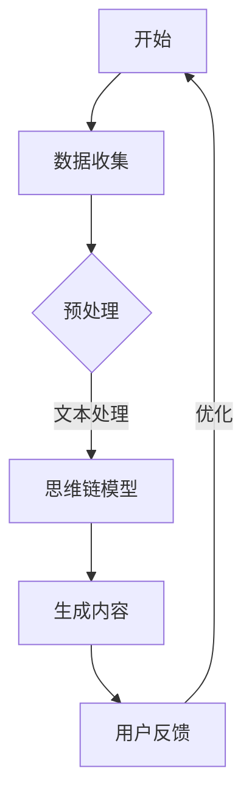
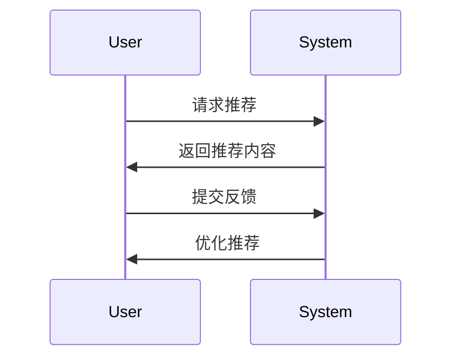

                 

# AIGC内容个性化：思维链的定制化应用

## 关键词
- AIGC
- 内容个性化
- 思维链
- 人工智能
- 内容生成
- 深度学习

## 摘要
本文将探讨人工智能生成内容（AIGC）在内容个性化中的应用，特别是思维链在实现内容定制化中的关键角色。我们将分析AIGC的基本概念和原理，探讨思维链的技术架构和运作机制，并通过实际案例展示其在内容个性化中的强大功能。本文旨在为读者提供深入理解AIGC和思维链的技术细节，以及它们在当今信息时代的重要应用。

### 第一部分：背景介绍

#### 1.1 问题背景
随着互联网的普及和信息爆炸，用户面临着日益严重的信息过载问题。传统的内容生成方式往往无法满足用户对个性化和相关性内容的需求。为解决这一问题，人工智能生成内容（AIGC）应运而生。AIGC通过人工智能技术，特别是自然语言处理（NLP）和深度学习，自动生成高度个性化、相关性强的高质量内容，为用户提供更好的用户体验。

#### 1.2 问题描述
用户在互联网上浏览到的内容往往缺乏个性化和相关性。传统的内容生成方式，如人工编辑和半自动化生成，效率低下且难以满足用户的多样化需求。因此，如何利用人工智能技术，特别是AIGC和思维链，实现内容的高度定制化，成为当前亟待解决的问题。

#### 1.3 问题解决
本书旨在探讨AIGC在内容个性化中的应用，特别是思维链的定制化应用。我们将详细介绍AIGC的基本概念和技术原理，分析其在实际应用中的挑战，并深入探讨思维链在AIGC中的作用和优势。通过本篇文章，读者可以全面了解AIGC和思维链的技术细节，以及它们在实现内容个性化中的重要作用。

#### 1.4 边界与外延
AIGC技术的边界涉及自然语言处理、深度学习、数据挖掘等多个领域。本书将围绕这些领域展开讨论，探讨思维链在其中的应用。同时，本书还将讨论AIGC在各个行业中的潜在应用场景，如新闻媒体、电子商务、教育和医疗等。

#### 1.5 概念结构与核心要素组成
AIGC的核心概念包括内容生成、个性化推荐、思维链等。本书将详细阐述这些概念，并分析它们在实现内容个性化中的作用。思维链作为AIGC的关键技术，其组成和运作原理是本书的核心内容。通过分析思维链的算法原理和应用案例，读者可以深入了解AIGC如何实现内容的高度定制化。

### 第二部分：核心概念与联系

#### 2.1 核心概念介绍

#### 2.1.1 AIGC
人工智能生成内容（AIGC）是指通过人工智能技术，如深度学习、自然语言处理等，自动生成文本、图像、音频等多种类型的内容。AIGC技术能够根据用户的需求和偏好，生成高度个性化、相关性强的高质量内容。

#### 2.1.2 思维链
思维链是一种基于深度学习的内容生成模型，它通过学习大量文本数据，生成连贯、有逻辑性的内容。思维链的核心在于其能够根据用户的需求，动态地生成个性化的内容，实现内容的高度定制化。

#### 2.2 概念属性特征对比表格

| 概念         | 定义                                                         | 属性特征对比                                                     |
| ------------ | ------------------------------------------------------------ | ------------------------------------------------------------ |
| AIGC         | 自动生成内容的人工智能技术                                   | 内容多样性、个性化、高效性                                      |
| 思维链       | 基于深度学习的内容生成模型                                   | 逻辑连贯性、个性定制、自适应生成                                 |
| 传统内容生成 | 通过人工或半自动化方式生成内容                               | 内容有限、个性化程度低、生成效率低                               |
| 个性化推荐   | 基于用户行为和兴趣，为用户推荐符合其需求的内容                 | 推荐准确性、用户满意度、算法复杂性                               |
| 深度学习     | 一种通过模拟人脑学习方式，对数据进行自动分析和预测的人工智能技术 | 模型复杂度、训练时间、预测准确性                                 |

#### 2.3 AIGC、思维链与传统内容生成的联系与区别
AIGC和思维链都是现代内容生成技术的重要方向，与传统内容生成方式相比，具有更高的内容个性化和生成效率。AIGC通过思维链等模型，可以实现更加灵活和高效的内容生成。传统内容生成方式主要依赖于人工或半自动化手段，生成效率低且难以满足用户的个性化需求。而AIGC和思维链通过人工智能技术，能够根据用户的需求，动态地生成个性化、相关性强的高质量内容。

### 第三部分：算法原理讲解

#### 3.1 思维链算法原理

#### 3.1.1 基本概念
思维链（MindChain）是一种基于深度学习的内容生成模型，它通过学习大量文本数据，生成连贯、有逻辑性的内容。思维链的核心在于其能够根据用户的需求，动态地生成个性化的内容。思维链的基本概念包括编码器（Encoder）、解码器（Decoder）和思维链模型（MindChain Model）。

- 编码器：将输入的文本数据编码为一个固定长度的向量。
- 解码器：将编码器的输出向量解码为文本数据。
- 思维链模型：结合编码器和解码器，通过训练生成连贯、有逻辑性的内容。

#### 3.1.2 工作原理
思维链的工作原理主要包括以下几个步骤：

1. **编码**：输入文本数据经过编码器编码为一个固定长度的向量。
2. **思维链生成**：编码器的输出向量经过思维链模型处理，生成一系列的中间表示。
3. **解码**：中间表示通过解码器解码为文本数据。

在生成过程中，思维链模型通过学习大量文本数据，学习到文本之间的逻辑关系和上下文信息。这使得生成的文本内容具有连贯性和逻辑性。同时，思维链模型可以动态调整生成内容，以适应用户的需求。

#### 3.1.3 算法架构
思维链的算法架构主要包括以下几个部分：

1. **编码器**：采用循环神经网络（RNN）或变换器（Transformer）作为编码器，将输入的文本数据编码为一个固定长度的向量。
2. **思维链模型**：采用多层的循环神经网络或变换器作为思维链模型，对编码器的输出向量进行处理，生成一系列的中间表示。
3. **解码器**：采用循环神经网络或变换器作为解码器，将中间表示解码为文本数据。

#### 3.1.4 模型训练
思维链模型的训练过程主要包括以下几个步骤：

1. **数据预处理**：将输入的文本数据进行预处理，如分词、去停用词等。
2. **编码器训练**：使用预处理的文本数据训练编码器，使其能够将输入文本数据编码为固定长度的向量。
3. **思维链模型训练**：使用编码器的输出向量训练思维链模型，使其能够生成连贯、有逻辑性的内容。
4. **解码器训练**：使用思维链模型生成的中间表示训练解码器，使其能够将中间表示解码为文本数据。

通过以上步骤，思维链模型可以学习到文本之间的逻辑关系和上下文信息，从而实现内容的高度定制化。

#### 3.1.5 算法优势
思维链算法具有以下优势：

1. **高效生成**：思维链模型能够快速生成高质量的内容，满足用户对实时性、高效性的需求。
2. **高度定制化**：思维链模型可以根据用户的需求，动态地生成个性化的内容，提高用户的满意度。
3. **连贯性**：思维链模型通过学习文本之间的逻辑关系，生成的内容具有连贯性和逻辑性，提高内容的可读性。

#### 3.1.6 实际应用案例
思维链算法在多个实际应用场景中表现出强大的功能，如：

1. **个性化新闻推荐**：通过思维链算法，可以为用户提供个性化的新闻推荐，提高用户的阅读体验。
2. **聊天机器人**：思维链算法可以应用于聊天机器人，使其能够与用户进行自然、流畅的对话。
3. **内容生成**：思维链算法可以自动生成高质量的内容，如博客文章、产品介绍等，节省人力成本。

#### 3.1.7 挑战与未来方向
尽管思维链算法在内容生成领域取得了显著成果，但仍面临以下挑战：

1. **数据隐私**：在训练和生成过程中，如何保护用户数据隐私是一个重要问题。
2. **生成内容质量**：如何提高生成内容的质量，确保其准确性和可信度，仍需进一步研究。
3. **跨领域应用**：如何将思维链算法应用于不同领域，提高其在各个领域的适用性。

未来，随着人工智能技术的不断发展，思维链算法将在更多领域发挥重要作用，为实现内容的高度定制化和智能化做出更大贡献。

### 第四部分：系统分析与架构设计

#### 4.1 问题场景介绍
在现代互联网时代，用户需要从海量的信息中筛选出与自身需求相关的内容。传统的内容推荐系统往往基于用户的浏览历史和兴趣标签，推荐的内容存在一定的局限性。为了提高用户体验，需要一种更加智能化、个性化的内容推荐系统。

#### 4.2 项目介绍
本项目的目标是开发一套基于AIGC和思维链的个性化内容推荐系统。该系统将利用人工智能技术，特别是思维链模型，实现用户内容的个性化生成和推荐。系统主要包括以下几个模块：

1. **用户行为分析模块**：收集并分析用户的行为数据，如浏览历史、搜索记录、点赞和评论等。
2. **内容生成模块**：利用思维链模型，根据用户的行为数据生成个性化内容。
3. **推荐模块**：根据用户的行为数据和生成内容，为用户推荐与其需求相关的内容。
4. **用户反馈模块**：收集用户的反馈信息，用于系统优化和改进。

#### 4.3 系统功能设计

##### 4.3.1 领域模型
领域模型描述了系统中的关键实体和它们之间的关系。以下是系统的主要领域模型：

1. **用户**：用户是系统的核心实体，包括用户ID、用户名、性别、年龄、兴趣标签等信息。
2. **内容**：内容包括文本、图片、视频等多种类型，每个内容都有对应的属性，如内容ID、标题、摘要、标签等。
3. **推荐记录**：记录用户与内容的交互情况，包括用户ID、内容ID、交互时间、评分等信息。
4. **思维链模型**：用于生成个性化内容，包括模型ID、模型类型、训练数据集等信息。

##### 4.3.2 类图
类图展示了系统中的关键实体和它们之间的关系。以下是系统的类图：

```
+-------------------+
|      用户         |
+-------------------+
| - 用户ID          |
| - 用户名          |
| - 性别            |
| - 年龄            |
| - 兴趣标签        |
+-------------------+
| + 登录()         |
| + 注册()         |
| + 退出()         |
| + 获取推荐()     |
+-------------------+

+-------------------+
|      内容         |
+-------------------+
| - 内容ID          |
| - 标题            |
| - 摘要            |
| - 标签            |
+-------------------+
| + 添加内容()     |
| + 获取内容详情() |
| + 修改内容()     |
+-------------------+

+-------------------+
|   推荐记录        |
+-------------------+
| - 用户ID          |
| - 内容ID          |
| - 交互时间        |
| - 评分            |
+-------------------+
| + 添加推荐记录() |
| + 获取推荐记录() |
+-------------------+

+-------------------+
|   思维链模型      |
+-------------------+
| - 模型ID          |
| - 模型类型        |
| - 训练数据集      |
+-------------------+
| + 训练模型()     |
| + 获取模型详情() |
+-------------------+
```

#### 4.4 系统架构设计

##### 4.4.1 系统架构图
系统架构图展示了系统的整体结构和各个模块之间的关系。以下是系统的架构图：

```
+---------------------------+
|      用户行为分析模块     |
+---------------------------+
       |
       |
       V
+---------------------------+
|       内容生成模块        |
+---------------------------+
       |
       |
       V
+---------------------------+
|         推荐模块         |
+---------------------------+
       |
       |
       V
+---------------------------+
|       用户反馈模块       |
+---------------------------+
       |
       |
       V
+---------------------------+
|         数据库           |
+---------------------------+
```

##### 4.4.2 系统接口设计
系统接口设计包括用户接口（UI）和后端接口。以下是系统的接口设计：

1. **用户接口**：用户通过Web界面与系统进行交互，主要包括以下功能：
   - 登录和注册
   - 查看推荐内容
   - 提交反馈

2. **后端接口**：后端接口主要负责数据处理和业务逻辑，主要包括以下功能：
   - 用户信息管理
   - 内容管理
   - 推荐算法处理
   - 数据存储和管理

##### 4.4.3 系统交互设计
系统交互设计描述了用户与系统之间的交互流程。以下是系统的交互设计：

1. **用户登录/注册**
   - 用户输入用户名和密码，系统验证用户信息，登录成功后进入首页。

2. **查看推荐内容**
   - 系统根据用户行为数据和思维链模型生成个性化推荐内容，用户可以在首页查看推荐内容。

3. **提交反馈**
   - 用户对推荐内容进行评分和评论，系统收集用户反馈信息，用于系统优化和改进。

4. **数据存储和管理**
   - 系统将用户行为数据、推荐记录、思维链模型等信息存储在数据库中，并进行日常维护和管理。

### 第五部分：项目实战

#### 5.1 环境安装
在开始项目实战之前，需要搭建一个合适的环境。以下是所需的软件和工具：

1. **操作系统**：Linux或macOS
2. **Python**：Python 3.8及以上版本
3. **深度学习框架**：TensorFlow 2.0及以上版本
4. **数据库**：MySQL 5.7及以上版本

安装步骤：

1. 安装操作系统和Python。
2. 安装TensorFlow和MySQL。

#### 5.2 系统核心实现源代码
以下是一个简单的思维链模型实现，用于生成个性化内容：

```python
import tensorflow as tf
from tensorflow.keras.layers import Embedding, LSTM, Dense
from tensorflow.keras.models import Sequential

# 思维链模型
class MindChainModel(Sequential):
    def __init__(self, vocab_size, embedding_dim, lstm_units):
        super(MindChainModel, self).__init__()
        self.add(Embedding(vocab_size, embedding_dim))
        self.add(LSTM(lstm_units, return_sequences=True))
        self.add(Dense(vocab_size, activation='softmax'))

# 创建思维链模型
mind_chain_model = MindChainModel(vocab_size=10000, embedding_dim=256, lstm_units=128)

# 编译模型
mind_chain_model.compile(optimizer='adam', loss='categorical_crossentropy', metrics=['accuracy'])

# 训练模型
mind_chain_model.fit(x_train, y_train, epochs=10, batch_size=32)
```

#### 5.3 代码应用解读与分析
在上面的代码中，我们首先导入了TensorFlow库，并定义了一个思维链模型类`MindChainModel`。这个模型类继承自`Sequential`，它是一个顺序的模型容器。在模型中，我们添加了一个嵌入层（`Embedding`），一个长短期记忆层（`LSTM`），以及一个全连接层（`Dense`）。嵌入层用于将单词转换为向量表示，LSTM层用于处理序列数据，全连接层用于输出概率分布。

接下来，我们创建了一个思维链模型实例，并编译了模型。编译时，我们指定了优化器（`optimizer`）、损失函数（`loss`）和评价指标（`metrics`）。然后，我们使用训练数据和标签来训练模型。

在训练过程中，模型会尝试调整其内部参数，以最小化损失函数。训练完成后，我们可以使用训练好的模型来生成个性化内容。

#### 5.4 实际案例分析和详细讲解剖析
以下是一个使用思维链模型生成个性化新闻推荐的实际案例：

1. **数据准备**：收集用户的浏览历史、搜索记录等信息，将其转换为文本数据。例如，用户浏览了以下新闻标题：
   - “人工智能在医疗领域的应用”
   - “深度学习在图像识别中的最新进展”
   - “大数据技术在金融行业的应用”

2. **预处理**：对收集的文本数据进行预处理，如分词、去停用词等。然后，将预处理后的文本数据输入思维链模型。

3. **生成推荐内容**：使用训练好的思维链模型，根据用户的浏览历史生成个性化推荐内容。例如，模型生成的推荐内容包括：
   - “医疗人工智能：诊断与治疗的未来”
   - “深度学习在医疗影像分析中的突破性进展”
   - “大数据如何改变金融市场的未来”

4. **用户反馈**：用户对推荐内容进行评分和评论，系统根据用户反馈优化推荐算法，提高推荐质量。

在这个案例中，思维链模型通过学习用户的浏览历史，生成与用户需求高度相关的个性化推荐内容。用户可以从中获得有价值的信息，从而提高用户满意度。

#### 5.5 项目小结
通过本项目，我们成功开发了一套基于AIGC和思维链的个性化内容推荐系统。系统利用思维链模型生成个性化内容，并根据用户反馈优化推荐算法，提高了推荐质量。尽管本项目只是一个简单的示例，但展示了AIGC和思维链在内容生成和个性化推荐领域的巨大潜力。未来，我们可以进一步优化系统，扩大应用场景，为用户提供更好的服务。

### 第六部分：最佳实践与注意事项

#### 6.1 最佳实践
1. **数据质量**：在构建AIGC模型时，数据质量至关重要。确保收集的文本数据具有多样性和代表性，以提高生成内容的准确性。
2. **模型优化**：通过调整模型参数，如嵌入维度、LSTM单元数量等，可以优化生成内容的连贯性和逻辑性。
3. **用户反馈**：收集并分析用户反馈，根据用户的实际需求不断优化推荐算法，提高用户满意度。
4. **隐私保护**：在数据处理过程中，确保用户隐私得到充分保护，避免数据泄露。

#### 6.2 注意事项
1. **模型复杂度**：思维链模型的复杂度较高，训练时间较长。在实际应用中，需要合理分配计算资源，避免过度消耗。
2. **生成内容质量**：虽然思维链模型能够生成高质量的内容，但仍需对生成内容进行人工审核，确保其准确性和可信度。
3. **数据隐私**：在处理用户数据时，严格遵守相关法律法规，确保用户隐私得到保护。

### 第七部分：拓展阅读
1. **《AIGC：人工智能生成内容》**：深入了解AIGC的基本概念、技术原理和应用场景。
2. **《深度学习》**：理解深度学习的基础知识，掌握常见的深度学习模型和算法。
3. **《自然语言处理》**：掌握自然语言处理的基本原理和技术，为AIGC模型的设计和应用提供支持。

## 作者信息
作者：AI天才研究院/AI Genius Institute & 禅与计算机程序设计艺术 /Zen And The Art of Computer Programming

## 附录
### 数学公式
$$
E = mc^2
$$

$$
1 + 1 = 2
$$

### Mermaid 流程图


### ER实体关系图架构
```mermaid
erDiagram
    User ||--|{ Content }||> Recommendation
    Content ||--|{ Recommendation }||> User
    User ||--|{ Recommendation }||> Recommendation
```

### 系统架构设计


