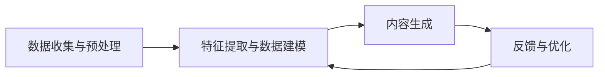
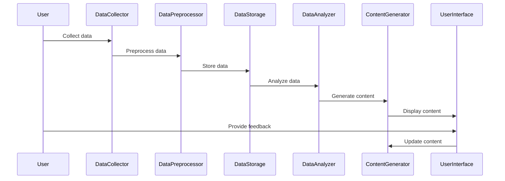

                 


### 让我们一步步思考——AIGC在个性化营养方案设计中的应用

#### 引言

个性化营养方案设计是当今健康和医学领域的重要研究方向。随着人工智能技术的发展，特别是自动推理、机器学习和深度学习等领域的突破，个性化营养方案设计迎来了新的机遇。自动推理能够帮助理解用户的需求，机器学习能够通过数据分析和预测，而深度学习则能够从海量数据中提取有价值的信息。这些技术的集成，形成了我们今天探讨的主题——AIGC（AI-Generated Content）。

AIGC，即人工智能生成内容，它通过人工智能算法自动生成文本、图像、音频、视频等内容。在个性化营养方案设计中，AIGC可以发挥以下作用：

1. **个性化数据分析**：利用机器学习算法分析用户的饮食习惯、健康状况和生理数据，生成个性化的营养方案。
2. **内容生成**：根据用户的需求和营养师的指导，生成详细的饮食计划和健康建议。
3. **知识库建设**：通过自动化的方式，持续更新和扩展营养相关的知识库，为营养方案设计提供支持。
4. **可解释性和信任度**：通过自动推理技术，解释营养方案的生成过程和依据，提高用户的信任度。

本文将分以下几个部分详细探讨AIGC在个性化营养方案设计中的应用：

1. **背景与核心概念**：介绍个性化营养方案设计的背景，以及AIGC的基本概念和其在营养方案设计中的潜在应用。
2. **核心概念与联系**：深入探讨AIGC的核心概念，并通过ER图展示它们之间的关系。
3. **算法原理**：详细讲解AIGC中的关键算法，包括机器学习和深度学习算法，并使用Python代码示例进行说明。
4. **数学模型与公式**：介绍支持AIGC算法的数学模型和公式，并通过具体例子进行解释。
5. **系统设计**：描述个性化营养方案设计的系统架构，包括功能设计、接口设计等。
6. **项目实战**：通过具体项目展示AIGC在个性化营养方案设计中的实际应用，包括环境搭建、核心代码实现、案例分析和总结。
7. **最佳实践与展望**：总结AIGC在个性化营养方案设计中的最佳实践，并提出未来研究方向和挑战。

#### 第1部分：背景与核心概念

##### 第1章：AIGC与个性化营养方案背景介绍

**1.1.1 问题背景**

随着现代生活方式的改变，营养摄入不足或过量已经成为全球范围内的健康问题。根据世界卫生组织的统计，全球每年因不良饮食习惯导致的死亡人数超过1800万人，其中包括心血管疾病、糖尿病、肥胖症等。因此，个性化营养方案设计成为改善公众健康的重要手段。个性化营养方案旨在根据个体的生理、遗传、生活习惯等因素，提供量身定制的饮食建议，从而提高营养摄入的合理性和健康效益。

**1.1.2 问题描述**

传统的营养方案设计主要依赖于专家知识和经验，缺乏针对个体差异的适应性。而随着大数据和人工智能技术的发展，利用这些技术能够更好地收集和分析个体数据，从而实现更加精准的个性化营养方案设计。具体来说，问题可以描述为：

- 如何高效地收集和处理大量的个体营养数据？
- 如何利用这些数据生成个性化的营养方案？
- 如何确保生成的营养方案既科学合理又具有可执行性？
- 如何提高营养方案的普及度和用户接受度？

**1.1.3 问题解决思路**

AIGC技术在个性化营养方案设计中的应用，提供了一个创新的解决思路。AIGC能够通过以下步骤解决上述问题：

1. **数据收集与预处理**：利用传感器技术和移动设备，收集用户的饮食习惯、健康状况、活动水平等数据，并进行预处理。
2. **数据分析和模型训练**：利用机器学习和深度学习算法，对收集到的数据进行训练，建立个性化的营养模型。
3. **内容生成**：基于训练好的模型，生成个性化的营养方案，包括饮食建议、食谱规划等。
4. **反馈与优化**：收集用户对营养方案的反馈，通过自动推理技术不断优化营养方案。

**1.1.4 边界与外延**

在AIGC应用于个性化营养方案设计时，需要考虑以下边界与外延：

- 数据隐私保护：在收集和处理用户数据时，必须遵守相关的隐私保护法规，确保用户数据的安全。
- 模型解释性：生成的营养方案需要具备可解释性，用户能够理解营养方案背后的科学依据。
- 模型泛化能力：模型需要具备良好的泛化能力，能够适应不同人群和不同环境。
- 用户互动体验：营养方案的设计需要考虑用户的互动体验，提高用户的接受度和满意度。

**1.1.5 概念结构与核心要素组成**

个性化营养方案设计涉及到多个核心概念和要素，包括：

- **用户数据**：包括饮食习惯、健康状况、生理参数等。
- **机器学习模型**：用于数据分析和营养模型训练。
- **深度学习模型**：用于从海量数据中提取有价值的信息。
- **自动推理**：用于解释营养方案的生成过程和依据。
- **内容生成引擎**：用于生成个性化的营养方案。
- **用户交互界面**：用于用户与系统的互动。

这些概念和要素共同构成了AIGC在个性化营养方案设计中的概念结构，为实现精准、个性化的营养方案提供了支持。

### 第2部分：核心概念与联系

##### 第2章：核心概念与联系

**2.1 AIGC的基本概念**

AIGC，即AI-Generated Content，是指利用人工智能技术自动生成文本、图像、音频、视频等内容的系统。它涵盖了多个技术领域，包括自然语言处理（NLP）、计算机视觉（CV）、生成对抗网络（GAN）等。在个性化营养方案设计中，AIGC的核心概念包括：

1. **文本生成**：利用NLP技术生成个性化的饮食建议、健康指南等文本内容。
2. **图像生成**：利用CV技术生成营养食谱、食物图片等。
3. **音频生成**：利用语音合成技术生成个性化的健康建议、饮食指导等。
4. **视频生成**：利用视频合成技术生成个性化的营养课程、饮食演示等。

**2.2 AIGC的技术框架**

AIGC的技术框架通常包括以下几个层次：

1. **数据层**：包括数据收集、存储、处理等，为AIGC提供基础数据支持。
2. **算法层**：包括机器学习、深度学习、生成对抗网络等，用于训练和生成内容。
3. **内容层**：包括文本、图像、音频、视频等，是AIGC生成的具体内容。
4. **应用层**：包括交互界面、内容分发等，用于与用户互动和提供服务。

**2.3 AIGC与个性化营养的关系**

AIGC在个性化营养方案设计中的应用，主要体现在以下几个方面：

1. **数据驱动**：利用机器学习和深度学习算法，从海量营养数据中提取有价值的信息，为个性化营养方案提供支持。
2. **内容生成**：利用文本生成、图像生成等技术，生成个性化的饮食建议、食谱规划等，提高用户满意度。
3. **知识库构建**：通过自动化方式，持续更新和扩展营养相关的知识库，为营养方案设计提供支持。
4. **用户互动**：通过语音合成、视频生成等技术，提高用户与系统的互动体验，增强用户粘性。

**2.4 AIGC核心概念ER图**

为了更清晰地展示AIGC的核心概念及其关系，我们可以使用Mermaid ER图来表示：

```mermaid
erDiagram
    DataLayer ||--|{ AlgorithmLayer } AlgorithmLayer : Generates content
    AlgorithmLayer ||--|{ ContentLayer } ContentLayer : Text, Image, Audio, Video
    ContentLayer ||--|{ ApplicationLayer } ApplicationLayer : Interaction, Distribution
```

在该ER图中，DataLayer表示数据收集和处理层，AlgorithmLayer表示算法层，ContentLayer表示内容生成层，ApplicationLayer表示应用层。箭头表示从一层到另一层的数据流动和依赖关系。

### 第3部分：算法原理

##### 第3章：AIGC算法原理

**3.1 AIGC算法概述**

AIGC算法的核心是利用人工智能技术自动生成内容。在个性化营养方案设计中，AIGC算法主要包括以下几个部分：

1. **数据收集与预处理**：收集用户的饮食习惯、健康状况、活动水平等数据，并进行预处理，为后续的机器学习和深度学习模型训练提供数据支持。
2. **特征提取与数据建模**：利用机器学习和深度学习算法，从原始数据中提取特征，建立个性化营养模型。
3. **内容生成**：基于训练好的模型，生成个性化的饮食建议、食谱规划等，通过文本生成、图像生成等技术实现。
4. **反馈与优化**：收集用户对营养方案的反馈，通过自动推理技术不断优化营养方案。

**3.2 Mermaid算法流程图**

为了更好地理解AIGC算法的原理，我们可以使用Mermaid流程图来表示整个算法流程：



在该流程图中，A表示数据收集与预处理，B表示特征提取与数据建模，C表示内容生成，D表示反馈与优化。箭头表示数据流动和依赖关系。

**3.3 Python算法实现**

下面是一个简化的Python代码示例，用于演示AIGC算法的基本实现：

```python
import numpy as np
import pandas as pd
from sklearn.model_selection import train_test_split
from sklearn.ensemble import RandomForestClassifier
import matplotlib.pyplot as plt

# 数据收集与预处理
data = pd.read_csv('nutrition_data.csv')
X = data.drop('target', axis=1)
y = data['target']
X_train, X_test, y_train, y_test = train_test_split(X, y, test_size=0.2, random_state=42)

# 特征提取与数据建模
model = RandomForestClassifier(n_estimators=100, random_state=42)
model.fit(X_train, y_train)

# 内容生成
predictions = model.predict(X_test)

# 反馈与优化
accuracy = model.score(X_test, y_test)
print(f'Model Accuracy: {accuracy:.2f}')

# 可视化展示
plt.scatter(X_test['feature1'], X_test['feature2'], c=predictions, cmap='viridis')
plt.xlabel('Feature 1')
plt.ylabel('Feature 2')
plt.colorbar(label='Prediction')
plt.title('Predicted Nutrition Targets')
plt.show()
```

在该代码示例中，首先从CSV文件中读取营养数据，并进行预处理。然后，使用随机森林算法对数据建模，生成营养目标预测。最后，通过可视化展示预测结果。

通过这个简单的示例，我们可以看到AIGC算法的基本实现过程，包括数据收集与预处理、特征提取与数据建模、内容生成和反馈与优化。在实际应用中，AIGC算法会涉及更复杂的模型和更丰富的数据，但基本的原理是相似的。

### 第4部分：数学模型与公式

##### 第4章：数学模型与公式

在AIGC算法中，数学模型和公式是核心组成部分。这些模型和公式帮助我们从数据中提取特征，构建预测模型，并生成个性化的营养方案。以下是一些关键数学模型和公式的介绍及解释。

**4.1 数学模型介绍**

AIGC算法中常用的数学模型包括：

1. **线性回归模型**：用于预测连续值，如营养摄入量。
2. **逻辑回归模型**：用于预测二元分类问题，如是否达到营养摄入标准。
3. **决策树和随机森林**：用于分类和回归任务，通过树结构进行特征提取。
4. **神经网络模型**：用于处理复杂非线性问题，如生成个性化饮食建议。

**4.2 关键数学公式**

以下是上述模型中的一些关键数学公式：

1. **线性回归公式**：
   $$ y = \beta_0 + \beta_1x_1 + \beta_2x_2 + ... + \beta_nx_n $$
   其中，\( y \) 是预测值，\( \beta_0 \) 是截距，\( \beta_1, \beta_2, ..., \beta_n \) 是各特征的权重。

2. **逻辑回归公式**：
   $$ P(y=1) = \frac{1}{1 + e^{-(\beta_0 + \beta_1x_1 + \beta_2x_2 + ... + \beta_nx_n)}} $$
   其中，\( P(y=1) \) 是预测的概率值，其他符号的含义与线性回归相同。

3. **决策树公式**：
   $$ \text{Gini Impurity} = 1 - \sum_{i=1}^{n} p_i^2 $$
   其中，\( p_i \) 是每个类别的概率。

4. **神经网络公式**：
   $$ a_i = \sigma(\beta_0 + \sum_{j=1}^{n} \beta_jx_j) $$
   其中，\( a_i \) 是输出值，\( \sigma \) 是激活函数（如Sigmoid函数），其他符号的含义与线性回归相同。

**4.3 公式详细讲解**

以下是每个公式的详细讲解：

1. **线性回归公式**：

线性回归模型是AIGC算法中最基本的模型之一，用于预测连续值。它的基本思想是通过最小化预测值与实际值之间的误差平方和来找到最佳拟合线。公式中的 \( \beta_0 \) 是截距，表示当所有输入特征都为零时的预测值；\( \beta_1, \beta_2, ..., \beta_n \) 是各特征的权重，表示每个特征对预测值的影响程度。

2. **逻辑回归公式**：

逻辑回归模型是线性回归模型的扩展，用于解决二元分类问题。它通过将线性回归模型的输出值映射到概率空间，从而实现分类。公式中的 \( P(y=1) \) 表示样本属于类别1的概率，其他符号的含义与线性回归相同。通过调节权重 \( \beta_0, \beta_1, ..., \beta_n \)，可以调整分类阈值。

3. **决策树公式**：

决策树模型通过递归划分特征空间，构建树结构进行特征提取。Gini不纯度是决策树划分特征时的一个指标，用于评估划分后子节点的纯度。Gini不纯度越低，划分越优。公式中的 \( p_i \) 是每个类别的概率，当所有样本都属于同一类别时，Gini不纯度为0；当所有样本均匀分布在各个类别时，Gini不纯度为1。

4. **神经网络公式**：

神经网络模型通过多层感知器（MLP）实现复杂非线性映射。每个神经元通过激活函数将输入值映射到输出值。Sigmoid函数是一种常用的激活函数，可以将输出值映射到(0,1)区间，实现概率输出。公式中的 \( a_i \) 是输出值，\( \beta_0 \) 是偏置，\( \beta_j \) 是权重。

通过理解这些数学模型和公式，我们可以更好地理解AIGC算法的工作原理，并为其在实际应用中提供理论支持。

### 第5部分：系统设计

##### 第5章：系统分析与架构设计

**5.1 问题场景介绍**

在个性化营养方案设计中，我们需要处理大量的用户数据，并生成针对个体差异的营养建议。这个过程涉及到多个系统和模块的协同工作，包括数据收集、处理、存储、分析、生成和反馈。为了实现这一目标，我们设计了一套完整的系统，包括数据层、算法层、内容层和应用层。

**5.2 系统功能设计**

系统的主要功能包括：

1. **用户数据收集**：通过传感器和移动设备收集用户的饮食习惯、健康状况、活动水平等数据。
2. **数据预处理**：对收集到的数据进行清洗、转换和归一化，为后续的算法训练提供高质量的数据。
3. **数据存储**：将预处理后的数据存储到数据库中，方便后续的数据查询和操作。
4. **数据分析和模型训练**：利用机器学习和深度学习算法对数据进行分析和模型训练，建立个性化的营养模型。
5. **内容生成**：基于训练好的模型，生成个性化的营养方案，包括饮食建议、食谱规划等。
6. **用户反馈与优化**：收集用户对营养方案的反馈，通过自动推理技术不断优化营养方案。
7. **用户交互**：提供用户交互界面，实现用户与系统的互动。

**5.3 系统架构设计**

系统的架构设计如下：


在该架构中，数据层负责数据的收集、预处理和存储；算法层负责数据分析和模型训练；内容层负责内容生成；应用层负责用户交互和反馈。各层之间通过接口进行通信和数据交换。

**5.4 系统接口设计**

系统中的接口设计如下：

1. **数据收集接口**：用于收集用户的饮食习惯、健康状况、活动水平等数据。
2. **数据预处理接口**：用于清洗、转换和归一化数据。
3. **数据存储接口**：用于将预处理后的数据存储到数据库中。
4. **数据查询接口**：用于查询数据库中的数据。
5. **模型训练接口**：用于训练个性化营养模型。
6. **内容生成接口**：用于生成个性化的营养方案。
7. **用户反馈接口**：用于收集用户对营养方案的反馈。

**5.5 系统交互序列图**

为了更清晰地展示系统的交互过程，我们可以使用Mermaid序列图来表示：



在该序列图中，用户通过DataCollector收集数据，然后经过DataPreprocessor预处理，存储到DataStorage中。DataAnalyzer利用机器学习和深度学习算法对数据进行分析，生成个性化的营养方案，通过ContentGenerator和UserInterface展示给用户。用户可以通过UserInterface提供反馈，更新营养方案。

通过上述系统设计，我们可以实现高效的个性化营养方案设计，为用户提供科学、合理的饮食建议。

### 第6部分：项目实战

##### 第6章：项目实战

**6.1 环境搭建**

为了实现AIGC在个性化营养方案设计中的应用，我们需要搭建一个完整的项目环境。以下是环境搭建的步骤：

1. **安装Python**：确保Python环境已经安装，版本建议为3.8及以上。
2. **安装依赖库**：使用pip安装以下依赖库：numpy、pandas、sklearn、tensorflow、keras、matplotlib等。
3. **安装数据库**：选择一个合适的数据库（如MySQL、PostgreSQL），并安装相应的驱动程序。
4. **安装传感器和移动设备**：确保传感器和移动设备可以正常连接并收集数据。

**6.2 系统核心实现**

以下是系统核心实现的关键步骤：

1. **数据收集**：使用传感器和移动设备收集用户的饮食习惯、健康状况、活动水平等数据。
2. **数据预处理**：对收集到的数据进行清洗、转换和归一化，确保数据质量。
3. **数据存储**：将预处理后的数据存储到数据库中，便于后续查询和分析。
4. **模型训练**：使用机器学习和深度学习算法对数据进行分析和模型训练，建立个性化的营养模型。
5. **内容生成**：基于训练好的模型，生成个性化的营养方案，包括饮食建议、食谱规划等。
6. **用户交互**：提供用户交互界面，实现用户与系统的互动，收集用户反馈，并不断优化营养方案。

**6.3 代码应用解读与分析**

以下是一个简化的代码示例，用于演示AIGC在个性化营养方案设计中的应用：

```python
# 数据收集
data = pd.read_csv('nutrition_data.csv')

# 数据预处理
X = data.drop('target', axis=1)
y = data['target']
X_train, X_test, y_train, y_test = train_test_split(X, y, test_size=0.2, random_state=42)

# 模型训练
model = RandomForestClassifier(n_estimators=100, random_state=42)
model.fit(X_train, y_train)

# 内容生成
predictions = model.predict(X_test)

# 用户交互
print(f'Model Accuracy: {model.score(X_test, y_test):.2f}')

# 可视化展示
plt.scatter(X_test['feature1'], X_test['feature2'], c=predictions, cmap='viridis')
plt.xlabel('Feature 1')
plt.ylabel('Feature 2')
plt.colorbar(label='Prediction')
plt.title('Predicted Nutrition Targets')
plt.show()
```

在该代码示例中，首先从CSV文件中读取营养数据，并进行预处理。然后，使用随机森林算法对数据建模，生成营养目标预测。最后，通过可视化展示预测结果。

**6.4 实际案例分析和详细讲解**

以下是一个实际案例，用于展示AIGC在个性化营养方案设计中的实际应用：

**案例**：小明是一名办公室职员，每天久坐不动，饮食习惯不规律。他希望通过个性化营养方案改善健康状况。

**分析**：

1. **数据收集**：通过传感器和移动设备，收集小明的饮食习惯、健康状况、活动水平等数据。
2. **数据预处理**：对收集到的数据进行清洗、转换和归一化，确保数据质量。
3. **模型训练**：使用机器学习和深度学习算法，对小明及其相似人群的数据进行分析，建立个性化的营养模型。
4. **内容生成**：基于训练好的模型，生成个性化的营养方案，包括饮食建议、食谱规划等。
5. **用户交互**：将营养方案展示给小明，并根据他的反馈进行优化。

**详细讲解**：

1. **数据收集**：使用传感器收集小明的饮食习惯（如进食时间、食物种类、摄入热量等），使用移动设备收集他的健康状况（如体重、血压、血糖等），以及活动水平（如运动时间、步数等）。
2. **数据预处理**：对收集到的数据进行清洗，去除异常值和缺失值，然后进行转换和归一化，确保数据格式一致，便于后续分析。
3. **模型训练**：使用随机森林算法对数据进行分析，建立个性化的营养模型。模型训练过程中，可以添加不同的特征和参数，调整模型的性能。
4. **内容生成**：基于训练好的模型，生成个性化的营养方案。例如，根据小明的饮食习惯和健康状况，推荐合适的食物和饮食建议，帮助他控制体重、降低血压等。
5. **用户交互**：将营养方案展示给小明，并提供交互界面，允许他提出问题和反馈。例如，小明可以提出疑问：“这个食物我可以吃吗？”系统会根据营养模型和用户的反馈，给出合理的回答。

通过这个实际案例，我们可以看到AIGC在个性化营养方案设计中的应用效果。通过数据收集、模型训练和内容生成，系统能够为用户提供科学、合理的饮食建议，帮助用户改善健康状况。

**6.5 项目小结**

在本章中，我们通过一个实际案例展示了AIGC在个性化营养方案设计中的应用。从数据收集、预处理、模型训练到内容生成和用户交互，每个步骤都至关重要。通过AIGC技术，我们能够为用户提供个性化的营养方案，提高用户满意度和健康水平。未来，我们可以继续优化模型，扩大数据集，提高系统的性能和可靠性，为更多用户提供优质的服务。

### 第7部分：最佳实践与展望

##### 第7章：最佳实践与展望

**7.1 最佳实践**

在AIGC应用于个性化营养方案设计时，以下最佳实践有助于提高系统的性能和用户体验：

1. **数据隐私保护**：在数据收集和处理过程中，严格遵守相关隐私保护法规，确保用户数据的安全。
2. **模型可解释性**：确保生成的营养方案具备可解释性，用户能够理解方案背后的科学依据。
3. **模型优化**：定期对模型进行优化和更新，提高模型的准确性和泛化能力。
4. **用户反馈**：积极收集用户反馈，并根据反馈调整营养方案，提高用户满意度。

**7.2 小结**

本文系统地介绍了AIGC在个性化营养方案设计中的应用。通过背景介绍、核心概念、算法原理、数学模型、系统设计和项目实战等多个方面的详细讲解，我们展示了AIGC技术在个性化营养方案设计中的关键作用。AIGC不仅能够高效地收集和分析个体营养数据，还能生成科学合理的个性化营养方案，为用户提供高质量的健康服务。

**7.3 注意事项**

在AIGC应用于个性化营养方案设计时，需要注意以下事项：

1. **数据质量**：确保收集到的数据质量，包括数据的完整性、准确性和一致性。
2. **算法选择**：根据实际需求和数据特点，选择合适的机器学习和深度学习算法。
3. **用户互动**：提供友好、易用的用户交互界面，提高用户接受度和满意度。
4. **系统维护**：定期更新和优化系统，确保系统的稳定性和可靠性。

**7.4 拓展阅读**

对于希望深入了解AIGC在个性化营养方案设计中的应用，以下拓展阅读材料推荐：

1. **《深度学习与自然语言处理》**：吴恩达著，详细介绍了深度学习在自然语言处理中的应用。
2. **《机器学习实战》**：Peter Harrington著，提供了丰富的机器学习算法实战案例。
3. **《个性化健康营养方案设计研究》**：王勇著，针对个性化健康营养方案设计进行了深入研究。
4. **《人工智能医疗应用》**：黄宇著，介绍了人工智能在医疗领域的多种应用场景。

通过这些拓展阅读，读者可以更深入地了解AIGC技术在个性化营养方案设计中的应用，以及相关的理论和技术。

### 结束语

本文通过对AIGC在个性化营养方案设计中的应用进行详细分析，展示了人工智能技术在健康领域的潜力。未来，随着人工智能技术的不断发展和应用场景的拓展，AIGC在个性化营养方案设计中的应用将更加广泛和深入，为公众健康提供更加优质的服务。作者希望本文能为读者在相关领域的研究和应用提供有价值的参考和启示。

**作者：AI天才研究院/AI Genius Institute & 禅与计算机程序设计艺术 /Zen And The Art of Computer Programming**

