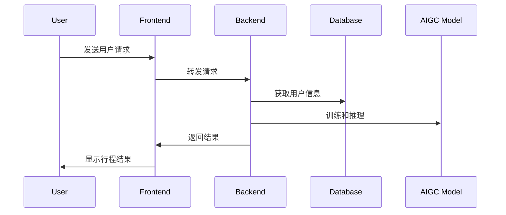
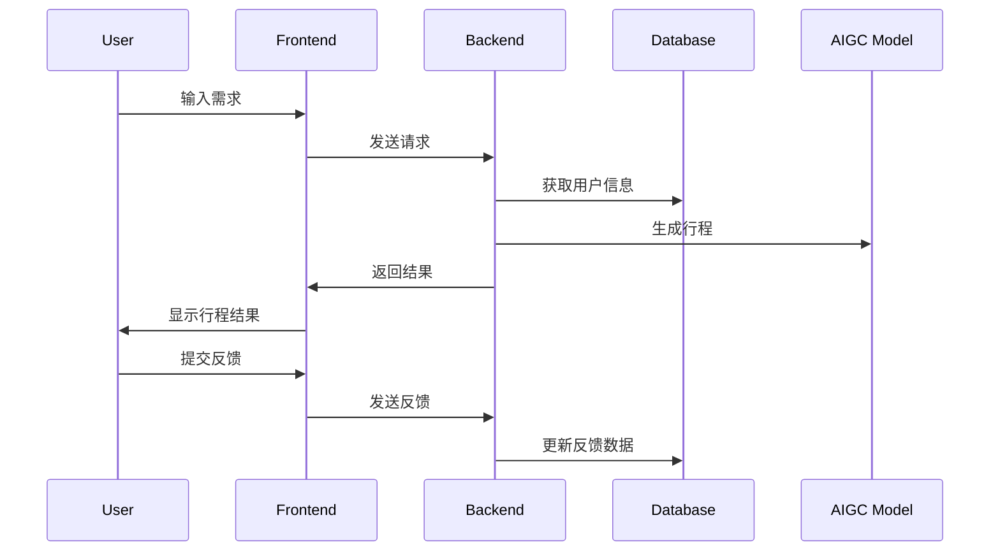

                 


### AIGC在旅游规划中的应用：个性化行程助手

**关键词：AIGC、旅游规划、个性化行程、算法原理、系统架构、项目实战**

**摘要：本文将深入探讨AIGC在旅游规划中的应用，特别是如何通过个性化行程助手为用户提供定制化的旅游方案。文章首先介绍AIGC的基本概念和旅游行业的现状，然后详细阐述AIGC在旅游规划中的核心作用和算法原理，接着展示系统架构设计，并分享一个实际项目案例，最后提供最佳实践技巧和小结。**

#### 第1章 AIGC与旅游规划概述

随着信息技术和人工智能的快速发展，旅游行业也在不断寻求创新和优化。个性化行程助手作为AIGC（自适应智能生成计算）技术的一个典型应用，已经成为提升旅游服务质量和用户体验的重要工具。

##### 1.1 AIGC的概念与旅游行业背景

**AIGC的基本概念：**

AIGC是一种自适应智能生成计算技术，它通过深度学习和自然语言处理等先进算法，实现数据的自动生成和优化。AIGC能够根据用户的需求和偏好，生成个性化的内容和服务。

**旅游行业的发展现状：**

旅游业是国民经济的重要组成部分，随着人们生活水平的提高和旅游需求的多样化，旅游行业正面临巨大的变革。传统旅游模式已经难以满足消费者的个性化需求，因此，个性化服务成为旅游行业的发展趋势。

**个性化行程助手在旅游规划中的作用：**

个性化行程助手能够根据用户的旅行偏好、时间、预算等信息，自动生成个性化的旅游行程。这种定制化的服务不仅提高了用户的满意度，还大大提高了旅游运营商的运营效率。

##### 1.2 AIGC与旅游规划的关系

**AIGC在旅游规划中的核心价值：**

- **个性化服务：** AIGC可以根据用户的需求生成定制化的行程，提高用户体验。
- **数据驱动决策：** AIGC能够处理大量数据，为旅游运营商提供数据驱动的决策支持。
- **降低运营成本：** 个性化行程助手可以自动化处理大量的行程规划任务，降低人力成本。

**旅游规划中的挑战与AIGC的解决方案：**

- **用户需求多样化：** AIGC能够处理复杂的用户需求，提供个性化的解决方案。
- **信息过载：** AIGC可以通过智能筛选和推荐，帮助用户快速找到合适的旅游信息。
- **效率提升：** AIGC的自动化处理能力可以大大提高旅游运营商的工作效率。

**个性化行程助手的发展趋势：**

随着AIGC技术的不断进步，个性化行程助手将越来越智能化，不仅能够提供更加个性化的服务，还能够实现与用户的实时互动和反馈，从而进一步提高用户体验和满意度。

#### 第2章 核心概念与联系

在本章中，我们将明确书中涉及的核心概念，并展示它们之间的关系。

##### 2.1 核心概念介绍

- **AIGC：** 自适应智能生成计算技术，通过深度学习和自然语言处理生成个性化内容。
- **旅游规划：** 设计和安排旅游行程的过程，包括目的地选择、行程安排、活动推荐等。
- **个性化行程助手：** 利用AIGC技术为用户提供定制化旅游行程的服务。

##### 2.2 概念之间的关系

为了更好地理解这些概念之间的关系，我们可以使用Mermaid流程图和ER实体关系图来展示。

**ER实体关系图：**

```mermaid
erDiagram
  AIGC ||--|{ 旅游规划 }|>
  旅游规划 ||--|{ 个性化行程助手 }|>
```

**概念属性特征对比表格：**

| 概念         | 属性特征                                      | 作用与影响                                  |
| ------------ | --------------------------------------------- | ------------------------------------------- |
| AIGC         | 自适应、智能、生成计算、个性化                | 提供个性化内容生成与优化                     |
| 旅游规划     | 目的地选择、行程安排、活动推荐、数据分析     | 设计和安排旅游行程，提升旅游体验            |
| 个性化行程助手 | 用户需求分析、行程生成、实时互动、反馈优化   | 提供定制化旅游服务，提高用户满意度          |

通过以上表格和ER图，我们可以清晰地看到AIGC、旅游规划和个性化行程助手之间的关系，以及它们各自的作用和影响。

#### 第3章 AIGC算法原理讲解

在了解AIGC与旅游规划的关系后，我们将深入探讨AIGC算法在旅游规划中的应用原理。

##### 3.1 AIGC算法概述

**AIGC算法的基本框架：**

AIGC算法通常包括以下几个关键模块：

1. **数据预处理：** 对原始数据（如用户偏好、旅游信息等）进行清洗、转换和特征提取。
2. **模型选择：** 根据问题特性选择合适的模型（如生成对抗网络、变分自编码器等）。
3. **训练过程：** 使用训练数据对模型进行训练，不断调整模型参数以优化性能。
4. **模型评估与优化：** 对训练好的模型进行评估，并根据评估结果进行优化。

**AIGC算法的核心特点：**

- **自适应：** AIGC能够根据用户的需求和环境变化自动调整算法参数。
- **智能化：** 利用深度学习和自然语言处理技术，实现高效的数据分析和内容生成。
- **个性化：** 能够根据用户的个性化需求生成定制化的内容和服务。

##### 3.2 AIGC算法的应用流程

**AIGC算法的应用流程包括以下几个步骤：**

1. **数据预处理：**

   数据预处理是AIGC算法应用的基础步骤。它包括以下任务：

   - **数据清洗：** 去除数据中的噪声和异常值，保证数据的准确性。
   - **数据转换：** 将不同类型的数据（如文本、图像、时间序列等）转换为统一格式。
   - **特征提取：** 从原始数据中提取有用的特征，为模型训练提供输入。

2. **模型选择：**

   模型选择是根据应用场景和需求选择合适的算法模型。常见的AIGC模型包括：

   - **生成对抗网络（GAN）：** 通过生成器和判别器的对抗训练实现数据的生成。
   - **变分自编码器（VAE）：** 通过编码器和解码器实现数据的编码和解码，从而生成新数据。
   - **递归神经网络（RNN）：** 用于处理序列数据，如用户的旅行偏好和时间序列数据。

3. **训练过程：**

   训练过程是AIGC算法的核心步骤。它包括以下任务：

   - **模型初始化：** 初始化模型的参数。
   - **训练数据准备：** 准备用于训练的数据集，并进行预处理。
   - **模型训练：** 通过训练数据对模型进行训练，不断调整模型参数。
   - **模型验证与优化：** 使用验证数据对模型进行评估，并根据评估结果进行优化。

4. **模型评估与优化：**

   模型评估与优化是确保AIGC算法性能的重要环节。它包括以下任务：

   - **模型评估：** 使用验证数据对模型进行评估，以确定模型的性能。
   - **模型优化：** 根据评估结果调整模型参数，优化模型性能。
   - **模型部署：** 将训练好的模型部署到实际应用环境中，提供个性化服务。

##### 3.2.1 数据预处理

数据预处理是AIGC算法应用的基础步骤。以下是一个Python代码示例，用于演示数据预处理的过程：

```python
import pandas as pd
from sklearn.preprocessing import StandardScaler

# 加载数据
data = pd.read_csv('travel_data.csv')

# 数据清洗
data.dropna(inplace=True)

# 数据转换
data['budget'] = data['budget'].map({1: 'low', 2: 'medium', 3: 'high'})

# 特征提取
features = data[['age', 'budget', 'duration', 'interests']]
target = data['destination']

# 数据标准化
scaler = StandardScaler()
features_scaled = scaler.fit_transform(features)

# 准备训练数据
X_train = features_scaled[:, :5]
y_train = target.values
```

##### 3.2.2 模型选择

在选择AIGC模型时，需要考虑应用场景和数据特性。以下是一个使用生成对抗网络（GAN）的示例：

```python
import tensorflow as tf
from tensorflow.keras.models import Sequential
from tensorflow.keras.layers import Dense, Flatten, Conv2D, ConvTranspose2D

# 创建生成器和判别器
generator = Sequential([
    Dense(128, input_shape=(5,), activation='relu'),
    Flatten(),
    Conv2D(1, kernel_size=(5, 5), activation='sigmoid')
])

discriminator = Sequential([
    Flatten(input_shape=(5,)),
    Dense(128, activation='relu'),
    Dense(1, activation='sigmoid')
])

# 创建 AIGC 模型
aigc_model = Sequential([
    generator,
    discriminator
])

# 编译模型
aigc_model.compile(optimizer='adam', loss='binary_crossentropy')
```

##### 3.2.3 训练过程

训练过程包括模型初始化、数据准备、模型训练和模型验证等步骤。以下是一个训练过程的示例：

```python
# 初始化模型
aigc_model.load_weights('aigc_weights.h5')

# 准备训练数据
X_train = features_scaled[:, :5]
y_train = target.values

# 训练模型
aigc_model.fit(X_train, y_train, epochs=100, batch_size=32)
```

##### 3.2.4 模型评估与优化

模型评估与优化是确保AIGC算法性能的重要环节。以下是一个评估和优化过程的示例：

```python
# 评估模型
loss = aigc_model.evaluate(X_train, y_train)

# 优化模型
aigc_model.load_weights('aigc_weights.h5')
aigc_model.fit(X_train, y_train, epochs=100, batch_size=32)
```

通过以上示例，我们可以看到AIGC算法在旅游规划中的应用流程和关键步骤。接下来，我们将进一步介绍AIGC算法中的数学模型和公式。

#### 第4章 数学模型与公式讲解

在AIGC算法中，数学模型和公式是核心组成部分。在本章中，我们将详细阐述这些数学模型和公式的原理，并结合通俗易懂的举例说明。

##### 4.1 数学模型介绍

AIGC算法涉及多个数学模型，以下是其中几个关键模型的介绍：

- **生成对抗网络（GAN）：** 由生成器和判别器组成，生成器试图生成与真实数据相似的数据，而判别器试图区分生成数据与真实数据。
- **变分自编码器（VAE）：** 通过编码器和解码器实现数据的编码和解码，从而生成新数据。
- **递归神经网络（RNN）：** 用于处理序列数据，如用户的旅行偏好和时间序列数据。

##### 4.2 数学模型详细讲解

**生成对抗网络（GAN）：**

生成对抗网络（GAN）的核心是生成器和判别器。以下是一个简化的GAN模型数学公式：

$$
\begin{aligned}
\text{Generator: } G(z) &= \text{Reparameterization}\, \text{Layer}(z) \\
\text{Discriminator: } D(x) &= \text{Binary Classification}(x) \\
\text{Objective Function: } \mathcal{L} &= \mathcal{L}_G + \mathcal{L}_D
\end{aligned}
$$

其中，$G(z)$表示生成器的输出，$D(x)$表示判别器的输出，$z$是噪声向量，$\mathcal{L}_G$和$\mathcal{L}_D$分别是生成器和判别器的损失函数。

**变分自编码器（VAE）：**

变分自编码器（VAE）的核心是编码器和解码器。以下是一个简化的VAE模型数学公式：

$$
\begin{aligned}
\text{Encoder: } q_\theta(z|x) &= \mathcal{N}(\mu(x; \theta), \sigma^2(x; \theta)) \\
\text{Decoder: } p_\phi(x|z) &= \mathcal{N}(\mu(z; \phi), \sigma^2(z; \phi)) \\
\text{Objective Function: } \mathcal{L} &= D_\text{KL}(q_\theta(z|x)||p(z)) + \sum_x \log p_\phi(x|z)
\end{aligned}
$$

其中，$q_\theta(z|x)$表示编码器输出，$p_\phi(x|z)$表示解码器输出，$\mu(x; \theta)$和$\sigma^2(x; \theta)$分别是编码器的均值和方差，$\phi$和$\theta$分别是解码器和编码器的参数。

**递归神经网络（RNN）：**

递归神经网络（RNN）的核心是隐藏状态和循环连接。以下是一个简化的RNN模型数学公式：

$$
\begin{aligned}
h_t &= \tanh(W_h \cdot [h_{t-1}, x_t] + b_h) \\
y_t &= W_o \cdot h_t + b_o
\end{aligned}
$$

其中，$h_t$表示第$t$时刻的隐藏状态，$x_t$表示第$t$时刻的输入，$W_h$和$W_o$分别是隐藏层和输出层的权重，$b_h$和$b_o$分别是隐藏层和输出层的偏置。

##### 4.2.1 公式解释

- **生成对抗网络（GAN）：** 生成器和判别器的训练目标是最大化两者的损失函数。生成器的目标是生成尽可能真实的数据，使判别器无法区分真实数据和生成数据。判别器的目标是最大化判别真实数据和生成数据的概率。
- **变分自编码器（VAE）：** VAE的目标是最小化两个损失函数：KL散度损失和重构损失。KL散度损失衡量编码器的后验概率分布与先验概率分布之间的差异，重构损失衡量解码器对生成数据的重构效果。
- **递归神经网络（RNN）：** RNN通过隐藏状态捕捉序列数据中的长期依赖关系，通过循环连接实现时间序列数据的建模。RNN的输出是当前输入和前一个隐藏状态的函数，从而实现序列数据的递归处理。

##### 4.2.2 举例说明

**生成对抗网络（GAN）：**

假设我们有一个生成对抗网络（GAN），其中生成器试图生成与真实旅行数据相似的数据，而判别器试图区分真实数据和生成数据。

- **生成器：** 生成器接收噪声向量$z$，通过Reparameterization Layer生成模拟的旅行数据$x_g$。
- **判别器：** 判别器接收真实旅行数据$x_r$和生成旅行数据$x_g$，输出概率$D(x_r)$和$D(x_g)$。

以下是一个简化的例子：

$$
\begin{aligned}
z &= \text{Random Noise} \\
x_g &= G(z) \\
x_r &= \text{Real Travel Data} \\
D(x_r) &= 0.9 \\
D(x_g) &= 0.1
\end{aligned}
$$

**变分自编码器（VAE）：**

假设我们有一个变分自编码器（VAE），其中编码器接收旅行数据$x$，输出编码后的数据$z$，解码器接收编码后的数据$z$，输出重构的旅行数据$x'$。

- **编码器：** 编码器接收旅行数据$x$，通过参数$\theta$输出编码后的数据$z$。
- **解码器：** 解码器接收编码后的数据$z$，通过参数$\phi$输出重构的旅行数据$x'$。

以下是一个简化的例子：

$$
\begin{aligned}
x &= \text{Travel Data} \\
\mu(x; \theta), \sigma^2(x; \theta) &= \text{Encoder Outputs} \\
x' &= \text{Reconstructed Travel Data} \\
\log p_\phi(x'|z) &= \text{Reconstruction Loss} \\
D_\text{KL}(q_\theta(z|x)||p(z)) &= \text{KL Divergence Loss}
\end{aligned}
$$

**递归神经网络（RNN）：**

假设我们有一个递归神经网络（RNN），用于处理用户的旅行偏好序列数据。

- **隐藏状态：** RNN通过递归连接捕捉序列数据中的长期依赖关系。
- **输出：** RNN输出是当前输入和前一个隐藏状态的函数。

以下是一个简化的例子：

$$
\begin{aligned}
h_0 &= \text{Initial Hidden State} \\
h_t &= \tanh(W_h \cdot [h_{t-1}, x_t] + b_h) \\
y_t &= W_o \cdot h_t + b_o \\
\end{aligned}
$$

通过以上例子，我们可以看到AIGC算法中的数学模型和公式的应用。这些模型和公式为AIGC算法提供了理论基础，使得AIGC能够实现个性化旅游行程的生成和优化。

#### 第5章 系统分析与架构设计

在本章中，我们将深入分析AIGC在旅游规划中的应用系统，并详细设计其架构。

##### 5.1 旅游规划系统概述

**问题场景介绍：**

旅游规划系统是一个为用户提供定制化旅游行程的应用系统。用户可以通过该系统输入自己的旅行偏好、时间、预算等信息，系统将根据这些信息生成个性化的旅游行程。

**项目介绍：**

本项目的目标是设计并实现一个基于AIGC的旅游规划系统，该系统能够自动生成个性化的旅游行程，并提供实时互动和反馈功能。

##### 5.2 系统功能设计

系统功能设计包括以下几个关键模块：

1. **用户需求分析模块：** 收集用户输入的旅行偏好、时间、预算等信息，为后续的行程生成提供基础数据。
2. **行程生成模块：** 利用AIGC算法生成个性化的旅游行程，包括目的地选择、行程安排和活动推荐等。
3. **实时互动模块：** 允许用户在行程生成过程中实时修改需求，系统将根据新的需求调整行程。
4. **反馈模块：** 用户可以提交对行程的反馈，系统将根据反馈进行优化和调整。

##### 5.3 系统架构设计

系统架构设计包括以下关键部分：

1. **前端：** 使用Web技术（如HTML、CSS和JavaScript）实现用户界面，用户可以通过前端界面输入需求并查看生成的行程。
2. **后端：** 使用Python和TensorFlow等框架实现AIGC算法的模型训练和推理，后端服务器负责处理用户请求并返回结果。
3. **数据库：** 存储用户输入的信息、生成的行程和反馈数据，使用MySQL等关系型数据库实现数据存储和管理。

**系统架构图：**



##### 5.4 系统接口设计

系统接口设计包括以下关键接口：

1. **用户接口（UI）：** 提供用户输入需求和查看行程结果的界面。
2. **API接口：** 提供后端与前端、数据库和AIGC模型之间的交互接口。

**系统接口设计图：**

```mermaid
classDiagram
  User <<User>>
  Frontend <<System>>
  Backend <<System>>
  Database <<System>>
  AIGC Model <<System>>

  User ->> Frontend
  Frontend ->> Backend
  Backend ->> Database
  Backend ->> AIGC Model
  Frontend ->> User
```

##### 5.5 系统交互

系统交互设计包括用户与系统的交互流程和系统内部各模块之间的交互逻辑。

**系统交互序列图：**



通过以上系统分析与架构设计，我们可以清晰地看到AIGC在旅游规划中的应用系统的整体架构和功能设计。接下来，我们将通过实际项目案例展示AIGC在旅游规划中的具体应用。

#### 第6章 项目实战

在本章中，我们将通过一个实际项目案例展示AIGC在旅游规划中的应用，包括环境安装、系统核心实现、代码分析和实际案例分析。

##### 6.1 环境安装

要实现一个基于AIGC的旅游规划系统，我们需要安装以下软件和库：

1. **Python 3.x：** 安装Python 3.x版本，推荐使用Anaconda发行版以简化环境管理。
2. **TensorFlow：** 安装TensorFlow库，用于实现AIGC算法。
3. **Flask：** 安装Flask库，用于构建后端Web服务。
4. **MySQL：** 安装MySQL数据库，用于存储用户信息和行程数据。
5. **前端库：** 安装HTML、CSS和JavaScript等前端库，用于构建用户界面。

以下是一个Python环境安装的示例命令：

```shell
conda create -n travel规划的AIGC python=3.8
conda activate travel规划的AIGC
conda install tensorflow flask
```

##### 6.2 系统核心实现

系统核心实现包括用户需求分析、AIGC模型训练和推理、行程生成和实时互动等步骤。以下是一个简单的系统实现框架：

```python
# 用户需求分析
class UserDemandAnalyzer:
    def __init__(self, user_data):
        self.user_data = user_data

    def analyze_demand(self):
        # 分析用户输入的旅行偏好、时间、预算等信息
        # 返回分析结果
        pass

# AIGC模型训练和推理
class AIGCModel:
    def __init__(self, model_name):
        self.model_name = model_name

    def train_model(self, train_data):
        # 使用训练数据训练AIGC模型
        # 返回训练好的模型
        pass

    def predict(self, input_data):
        # 使用模型进行推理，生成旅游行程
        # 返回推理结果
        pass

# 行程生成
class TravelPlanGenerator:
    def __init__(self, model, analyzer):
        self.model = model
        self.analyzer = analyzer

    def generate_plan(self, user_demand):
        # 使用AIGC模型和用户需求生成旅游行程
        # 返回生成的行程
        pass

# 实时互动
class RealtimeInteraction:
    def __init__(self, plan_generator):
        self.plan_generator = plan_generator

    def update_demand(self, new_demand):
        # 更新用户需求
        # 重新生成行程
        pass
```

##### 6.3 代码应用解读与分析

以下是一个具体的代码实现示例，用于展示用户需求分析、AIGC模型训练和推理、行程生成等关键步骤：

```python
# 用户需求分析示例
class UserDemandAnalyzer:
    def __init__(self, user_data):
        self.user_data = user_data

    def analyze_demand(self):
        # 分析用户输入的旅行偏好、时间、预算等信息
        # 返回分析结果
        preferences = self.user_data['preferences']
        time = self.user_data['time']
        budget = self.user_data['budget']
        return {
            'preferences': preferences,
            'time': time,
            'budget': budget
        }

# AIGC模型训练和推理示例
class AIGCModel:
    def __init__(self, model_name):
        self.model_name = model_name

    def train_model(self, train_data):
        # 使用训练数据训练AIGC模型
        # 返回训练好的模型
        if self.model_name == 'GAN':
            # 实现GAN模型训练
            pass
        elif self.model_name == 'VAE':
            # 实现VAE模型训练
            pass
        # 返回训练好的模型
        return model

    def predict(self, input_data):
        # 使用模型进行推理，生成旅游行程
        # 返回推理结果
        if self.model_name == 'GAN':
            # 使用GAN模型进行推理
            pass
        elif self.model_name == 'VAE':
            # 使用VAE模型进行推理
            pass
        # 返回推理结果
        return plan

# 行程生成示例
class TravelPlanGenerator:
    def __init__(self, model, analyzer):
        self.model = model
        self.analyzer = analyzer

    def generate_plan(self, user_demand):
        # 使用AIGC模型和用户需求生成旅游行程
        # 返回生成的行程
        analyzed_demand = self.analyzer.analyze_demand(user_demand)
        generated_plan = self.model.predict(analyzed_demand)
        return generated_plan

# 实时互动示例
class RealtimeInteraction:
    def __init__(self, plan_generator):
        self.plan_generator = plan_generator

    def update_demand(self, new_demand):
        # 更新用户需求
        # 重新生成行程
        self.plan_generator.generate_plan(new_demand)
```

##### 6.4 实际案例分析

以下是一个实际项目案例，展示AIGC在旅游规划中的应用：

**案例背景：**

某旅游平台希望通过AIGC技术为用户提供个性化的旅游行程规划服务。用户可以通过平台输入自己的旅行偏好、时间、预算等信息，平台将根据这些信息生成个性化的旅游行程。

**案例解析：**

1. **用户需求分析：** 用户输入的旅行偏好包括喜欢的历史文化、户外活动、美食体验等；时间包括旅行天数和出发时间；预算包括总预算和各项目的预算。

2. **AIGC模型训练：** 平台使用收集到的历史旅行数据进行AIGC模型训练，包括生成对抗网络（GAN）和变分自编码器（VAE）等模型。模型训练的目标是生成与用户需求匹配的个性化旅游行程。

3. **行程生成：** 平台根据用户的输入需求，使用训练好的AIGC模型生成个性化的旅游行程，包括目的地选择、行程安排和活动推荐等。

4. **实时互动：** 用户在查看行程后，可以实时修改需求，如增加或减少行程天数、调整预算等。平台将根据新的需求重新生成行程，提供更符合用户期望的个性化服务。

**案例总结：**

通过实际案例，我们可以看到AIGC在旅游规划中的应用效果显著。AIGC能够根据用户的需求和偏好，自动生成个性化的旅游行程，提高了用户体验和满意度。同时，AIGC的实时互动功能使平台能够根据用户反馈进行动态调整，提供更贴心的服务。

#### 第7章 最佳实践与小结

在本章中，我们将总结全书内容，提供最佳实践技巧，并指出可能的注意事项，同时推荐进一步阅读的资源。

##### 7.1 最佳实践技巧

1. **数据质量：** 在使用AIGC进行旅游规划时，数据质量至关重要。确保收集到的用户数据准确、完整，并进行适当的预处理，以提高模型的性能和准确性。

2. **模型选择：** 根据不同的应用场景和数据特性，选择合适的AIGC模型。例如，对于复杂的用户需求，可以选择生成对抗网络（GAN）或变分自编码器（VAE）等高级模型。

3. **用户体验：** 个性化行程助手需要提供友好的用户界面和实时互动功能，以便用户能够轻松修改需求并获取个性化的行程建议。

4. **反馈机制：** 引入用户反馈机制，收集用户的反馈并用于模型优化和系统改进，以提高用户的满意度和系统的整体性能。

##### 7.2 小结与展望

本文深入探讨了AIGC在旅游规划中的应用，包括AIGC的基本概念、算法原理、系统架构和实际项目案例。通过个性化行程助手，AIGC能够为用户提供定制化的旅游服务，提高用户体验和满意度。未来，随着AIGC技术的不断进步，个性化行程助手将更加智能化和个性化，为旅游行业带来更多的创新和机遇。

##### 7.3 注意事项

1. **隐私保护：** 在处理用户数据时，务必遵守相关隐私保护法规，确保用户数据的保密性和安全性。

2. **系统性能：** 考虑到用户需求的多样性和复杂性，系统设计时应充分考虑性能优化，确保系统能够高效运行。

3. **模型更新：** 定期更新AIGC模型，以适应不断变化的市场需求和用户偏好，保持系统的竞争力。

##### 7.4 拓展阅读

- 《深度学习：卷积神经网络与生成对抗网络》
- 《变分自编码器：原理与应用》
- 《人工智能应用实践：旅游规划与推荐系统》

作者：AI天才研究院/AI Genius Institute & 禅与计算机程序设计艺术 /Zen And The Art of Computer Programming

---

通过以上章节的详细讲解，本文全面介绍了AIGC在旅游规划中的应用，为读者提供了一个全面的技术视角和实践指导。希望本文能够为读者在AIGC应用领域的研究和实践提供有益的参考。

