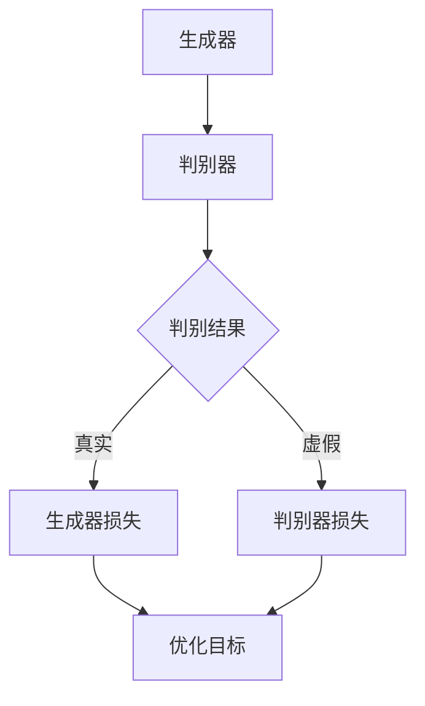
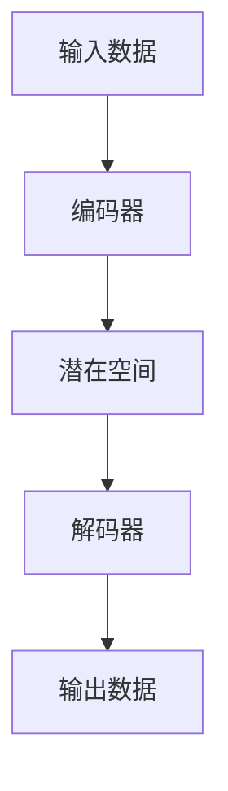
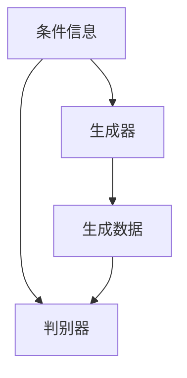

                 

## AIGC在智能交通系统中的应用：优化城市交通流量

### 关键词

- AIGC
- 智能交通系统
- 交通流量预测
- 交通信号控制
- 交通拥堵缓解

### 摘要

本文旨在探讨AIGC（自适应智能生成控制）技术在智能交通系统中的应用，特别是在优化城市交通流量方面的潜力。通过分析AIGC的核心技术，包括生成对抗网络（GAN）、变分自编码器（VAE）和条件生成对抗网络（C-GAN），以及它们在交通流量预测、交通信号控制和交通拥堵缓解中的应用，本文为智能交通系统的未来发展提供了技术思路和实际案例。文章最后展望了AIGC技术在这一领域的未来发展趋势和面临的挑战。

## 第一部分：引言与背景

### 第1章：AIGC与智能交通系统概述

#### 1.1.1 AIGC技术简介

AIGC（Adaptive Intelligent Generation and Control）是一种基于自适应学习和生成控制技术的智能系统，它能够根据实时数据和环境变化，动态调整和控制系统的运行状态。AIGC技术的核心在于其自适应性，它能够通过深度学习和强化学习等算法，从数据中学习模式，并生成新的策略来优化系统的性能。

AIGC技术最初源于计算机科学中的自适应控制理论和机器学习算法，近年来随着深度学习和生成模型的发展，AIGC技术得到了广泛关注和应用。在智能交通系统中，AIGC技术的应用主要体现在交通流量预测、交通信号控制和交通拥堵缓解等方面。

#### 1.1.2 智能交通系统的定义与发展历程

智能交通系统（Intelligent Transportation System，ITS）是指利用信息技术、通信技术、传感技术、控制技术等，实现交通信息采集、处理、传输和利用的系统。智能交通系统旨在提高交通效率、减少交通事故、降低交通污染和缓解交通拥堵。

智能交通系统的发展历程可以追溯到20世纪60年代，当时美国开始研究电子收费系统（Electronic Toll Collection，ETC）。随着计算机技术和通信技术的不断发展，智能交通系统逐渐成熟，并在21世纪初得到了广泛应用。当前，智能交通系统已经成为城市化进程中不可或缺的一部分。

#### 1.1.3 AIGC在智能交通系统中的应用前景

AIGC技术在智能交通系统中的应用前景广阔。首先，在交通流量预测方面，AIGC技术可以通过分析历史数据和实时数据，预测交通流量变化，为交通信号控制和交通拥堵缓解提供数据支持。其次，在交通信号控制方面，AIGC技术可以通过生成和调整信号控制策略，实现交通流的动态优化。最后，在交通拥堵缓解方面，AIGC技术可以通过实时监测交通状态，提供拥堵预警和解决方案。

随着AIGC技术的不断发展和完善，未来智能交通系统将能够实现更高效、更智能、更安全的运行，为城市交通管理带来新的突破。

#### 1.1.4 本书结构安排与内容概述

本书将从AIGC技术的背景和概念入手，详细介绍AIGC的核心技术，包括生成对抗网络（GAN）、变分自编码器（VAE）和条件生成对抗网络（C-GAN）。接着，本文将分析AIGC技术在智能交通系统中的应用，具体包括交通流量预测、交通信号控制和交通拥堵缓解。最后，本文将结合实际案例，探讨AIGC技术在智能交通系统中的未来发展趋势和挑战。

## 第二部分：AIGC核心技术

### 第2章：AIGC基础理论

AIGC技术的核心在于其自适应性，它依赖于深度学习和生成控制算法。在这一章中，我们将详细介绍AIGC的基础理论，包括生成对抗网络（GAN）、变分自编码器（VAE）和条件生成对抗网络（C-GAN）。

#### 2.1.1 生成对抗网络（GAN）

##### 2.1.1.1 GAN原理介绍

生成对抗网络（GAN）由Ian Goodfellow等人于2014年提出，它由两个神经网络组成：生成器（Generator）和判别器（Discriminator）。生成器试图生成与真实数据相似的数据，而判别器则试图区分生成数据与真实数据。通过不断地训练，生成器会逐渐提高生成数据的真实度，而判别器则会逐渐提高对真实数据的识别能力。

GAN的基本架构如下图所示：

##### 2.1.1.2 GAN模型架构

GAN的模型架构可以分为以下几个部分：

1. **生成器**：生成器接收随机噪声作为输入，通过多个隐含层生成假数据。
2. **判别器**：判别器接收真实数据和生成数据，通过多个隐含层输出一个概率值，表示接收到的数据是真实的概率。
3. **损失函数**：GAN的损失函数由生成器和判别器的损失构成。生成器的目标是使判别器无法区分生成数据和真实数据，即生成器损失；判别器的目标是正确分类真实数据和生成数据，即判别器损失。

##### 2.1.1.3 GAN应用场景分析

GAN技术在智能交通系统中具有广泛的应用场景，例如：

1. **交通流量预测**：GAN可以通过生成历史交通流量数据，训练深度学习模型，提高预测准确性。
2. **交通信号控制**：GAN可以生成不同信号控制策略下的交通流量数据，用于优化信号控制算法。
3. **交通拥堵缓解**：GAN可以模拟不同交通拥堵缓解策略的效果，为实际应用提供参考。

#### 2.1.2 变分自编码器（VAE）

##### 2.1.2.1 VAE原理介绍

变分自编码器（Variational Autoencoder，VAE）是另一种生成模型，它通过编码器（Encoder）和解码器（Decoder）来学习数据的分布。VAE的编码器将输入数据映射到一个潜在空间，解码器则从潜在空间中生成数据。

VAE的基本架构如下图所示：

##### 2.1.2.2 VAE模型架构

VAE的模型架构可以分为以下几个部分：

1. **编码器**：编码器接收输入数据，通过多个隐含层映射到一个潜在空间，输出潜在空间的参数。
2. **解码器**：解码器接收潜在空间的参数，通过多个隐含层生成输出数据。
3. **损失函数**：VAE的损失函数由重构损失和KL散度损失构成。重构损失表示输入数据和输出数据之间的差距，KL散度损失表示潜在空间的分布与先验分布之间的差距。

##### 2.1.2.3 VAE应用场景分析

VAE技术在智能交通系统中也具有广泛的应用场景，例如：

1. **交通流量预测**：VAE可以通过学习历史交通流量数据的分布，生成新的交通流量数据，用于训练深度学习模型。
2. **交通信号控制**：VAE可以生成不同交通信号控制策略下的交通流量数据，用于优化信号控制算法。
3. **交通拥堵缓解**：VAE可以模拟不同交通拥堵缓解策略的效果，为实际应用提供参考。

#### 2.1.3 条件生成对抗网络（C-GAN）

##### 2.1.3.1 C-GAN原理介绍

条件生成对抗网络（Conditional Generative Adversarial Network，C-GAN）是GAN的一种变体，它在生成器和判别器中都引入了条件信息。C-GAN通过条件信息来指导生成过程，从而生成更具有目标特征的数据。

C-GAN的基本架构如下图所示：

##### 2.1.3.2 C-GAN模型架构

C-GAN的模型架构可以分为以下几个部分：

1. **生成器**：生成器接收条件信息和随机噪声作为输入，通过多个隐含层生成数据。
2. **判别器**：判别器接收条件信息和生成数据，通过多个隐含层输出一个概率值，表示生成数据是真实的概率。
3. **条件信息**：条件信息可以是类别标签、时间序列、地理位置等，用于指导生成过程。

##### 2.1.3.3 C-GAN应用场景分析

C-GAN技术在智能交通系统中同样具有广泛的应用场景，例如：

1. **交通流量预测**：C-GAN可以通过条件信息（如时间、地点等）来指导生成过程，提高预测的准确性。
2. **交通信号控制**：C-GAN可以生成不同交通信号控制策略下的交通流量数据，用于优化信号控制算法。
3. **交通拥堵缓解**：C-GAN可以模拟不同交通拥堵缓解策略的效果，为实际应用提供参考。

## 第三部分：AIGC在智能交通系统中的应用

### 第3章：交通流量预测

#### 3.1.1 交通流量预测的重要性

交通流量预测是智能交通系统中的重要组成部分，它对于交通管理、交通信号控制和交通拥堵缓解具有重要的指导意义。准确预测交通流量可以帮助交通管理者及时调整交通信号，优化交通流分配，减少交通拥堵和事故风险，提高交通系统的整体效率。

#### 3.1.2 交通流量预测模型

交通流量预测模型可以分为基于传统统计方法、机器学习和深度学习的方法。

##### 3.1.2.1 基于传统统计方法的流量预测

基于传统统计方法的流量预测主要包括时间序列分析、回归分析和假设检验等方法。这些方法通过分析历史交通流量数据，建立数学模型来预测未来交通流量。

1. **时间序列分析**：时间序列分析是通过分析历史数据的时间序列特性来预测未来值。常见的方法有移动平均法、指数平滑法和ARIMA模型等。
2. **回归分析**：回归分析是通过建立自变量和因变量之间的线性关系来预测未来值。常见的回归分析方法有线性回归、多项式回归和岭回归等。
3. **假设检验**：假设检验是通过统计方法对历史数据进行分析，判断某种假设是否成立。常见的假设检验方法有t检验和F检验等。

##### 3.1.2.2 基于机器学习的流量预测

基于机器学习的流量预测方法通过学习历史交通流量数据中的模式和规律，建立预测模型。常见的机器学习方法包括决策树、支持向量机和神经网络等。

1. **决策树**：决策树通过将数据集划分为多个子集，并选择最优划分标准来预测交通流量。常见的方法有ID3、C4.5和CART等。
2. **支持向量机**：支持向量机通过寻找最优超平面来划分数据集，并用于预测交通流量。常见的支持向量机方法有线性SVM和核SVM等。
3. **神经网络**：神经网络通过多层神经元之间的非线性变换来学习数据中的模式和规律，并用于预测交通流量。常见的神经网络方法有前馈神经网络、卷积神经网络和循环神经网络等。

##### 3.1.2.3 基于深度学习的流量预测

基于深度学习的流量预测方法通过构建复杂神经网络模型，自动提取数据中的特征和模式，实现高精度的交通流量预测。常见的深度学习方法包括生成对抗网络（GAN）、变分自编码器（VAE）和条件生成对抗网络（C-GAN）等。

1. **生成对抗网络（GAN）**：GAN通过生成器和判别器的对抗训练，生成与真实交通流量数据相似的数据，并用于训练深度学习模型。
2. **变分自编码器（VAE）**：VAE通过编码器和解码器的训练，学习交通流量数据的分布，并生成新的交通流量数据，用于训练深度学习模型。
3. **条件生成对抗网络（C-GAN）**：C-GAN通过条件信息的引入，指导生成过程，生成更具有目标特征的数据，并用于训练深度学习模型。

#### 3.1.3 案例分析

##### 3.1.3.1 某城市交通流量预测案例

以某城市为例，该城市拥有丰富的交通流量数据，包括历史交通流量数据、实时交通流量数据和天气数据等。通过收集和整合这些数据，我们可以建立一个交通流量预测模型，并评估其预测性能。

1. **数据预处理**：对交通流量数据进行清洗和预处理，包括数据去噪、缺失值填充、异常值处理等。
2. **特征工程**：提取交通流量数据中的特征，包括时间特征、地点特征和天气特征等。
3. **模型训练**：使用GAN、VAE和C-GAN等深度学习方法训练交通流量预测模型，并调整模型参数，优化模型性能。
4. **模型评估**：通过交叉验证和测试集评估模型的预测性能，包括预测精度、召回率和F1值等指标。

##### 3.1.3.2 案例效果评估与优化

通过对某城市交通流量预测案例的评估，我们可以发现深度学习方法在交通流量预测方面具有显著的优势。具体来说，GAN和C-GAN模型的预测精度和召回率较高，而VAE模型的预测F1值较高。

为了进一步优化模型性能，我们可以采取以下措施：

1. **增加训练数据**：通过收集更多的历史交通流量数据，增加模型训练数据量，提高模型泛化能力。
2. **特征选择**：对特征进行选择和优化，去除冗余特征，增加对交通流量预测有重要影响的关键特征。
3. **模型融合**：将多个深度学习模型进行融合，提高模型的预测性能和稳定性。

#### 3.1.4 结论

交通流量预测是智能交通系统中的重要环节，通过引入AIGC技术，我们可以建立高效、准确的交通流量预测模型。在实际应用中，我们需要根据具体场景和数据特点，选择合适的AIGC模型和方法，并进行模型优化和性能评估，以提高预测效果。

### 第4章：交通信号控制

交通信号控制是智能交通系统的核心组成部分，它通过调节交通信号灯的时长和变化规律，引导交通流量，减少交通拥堵和事故风险。传统的交通信号控制主要依赖于固定的信号配时方案，而现代智能交通信号控制则引入了AIGC技术，实现了动态的信号优化和控制。

#### 4.1.1 交通信号控制概述

##### 4.1.1.1 传统信号控制方法

传统的交通信号控制方法主要包括固定配时法和感应配时法。固定配时法是根据交通流量和交通规律，预先设定信号灯的时长和变化规律，适用于交通流量相对稳定的情况。感应配时法则是通过安装在路口的感应器实时监测交通流量，自动调整信号灯时长，以适应交通流量的变化。

##### 4.1.1.2 智能信号控制方法

智能信号控制方法利用AIGC技术，通过分析实时交通数据和历史交通数据，动态调整信号灯的时长和变化规律，实现交通流的优化控制。智能信号控制方法可以分为以下几类：

1. **基于深度学习的信号控制**：利用深度学习算法，从历史交通数据和实时交通数据中学习交通规律，生成最优的信号控制策略。
2. **基于强化学习的信号控制**：通过强化学习算法，让信号控制系统不断学习并优化信号控制策略，以实现最佳交通流控制效果。
3. **基于多智能体系统的信号控制**：通过多智能体系统，将路口的交通信号控制分解为多个小问题，各个智能体协同工作，实现整体交通流的优化。

#### 4.1.2 智能信号控制算法

##### 4.1.2.1 基于深度学习的信号控制算法

基于深度学习的信号控制算法通过构建复杂的神经网络模型，从历史交通数据和实时交通数据中学习交通规律，生成最优的信号控制策略。常见的深度学习算法包括卷积神经网络（CNN）、循环神经网络（RNN）和生成对抗网络（GAN）等。

1. **卷积神经网络（CNN）**：CNN可以自动提取交通流量数据中的特征，并用于生成信号控制策略。通过卷积层、池化层和全连接层等结构，CNN可以实现对交通数据的深层特征提取和建模。
2. **循环神经网络（RNN）**：RNN可以处理时间序列数据，通过记忆机制，捕捉交通流量的时间依赖关系。通过RNN的输入层、隐藏层和输出层等结构，RNN可以实现交通流量的短期和长期预测。
3. **生成对抗网络（GAN）**：GAN通过生成器和判别器的对抗训练，生成与真实交通流量数据相似的数据，并用于训练信号控制模型。通过GAN的生成器和判别器，可以实现对交通流量的动态预测和信号控制策略的优化。

##### 4.1.2.2 基于强化学习的信号控制算法

基于强化学习的信号控制算法通过强化学习算法，让信号控制系统不断学习并优化信号控制策略，以实现最佳交通流控制效果。强化学习算法通过奖励机制，让信号控制系统在每次决策后，根据奖励值调整策略，以最大化长期奖励。

1. **Q学习**：Q学习通过估计状态-动作值函数，选择最优动作，实现信号控制策略的优化。Q学习算法包括状态空间、动作空间、奖励函数和Q值更新等部分。
2. **深度Q网络（DQN）**：DQN通过神经网络估计Q值，实现对复杂状态-动作值函数的估计。通过经验回放、目标网络和双Q学习等技术，DQN可以有效地提高学习效率和收敛速度。
3. **策略梯度算法**：策略梯度算法通过直接优化策略参数，实现信号控制策略的优化。常见的策略梯度算法包括REINFORCE、PPO和A3C等。

##### 4.1.2.3 基于多智能体系统的信号控制算法

基于多智能体系统的信号控制算法通过多智能体系统，将路口的交通信号控制分解为多个小问题，各个智能体协同工作，实现整体交通流的优化。多智能体系统通过通信机制、协调策略和决策算法等部分，实现智能体的协作与协调。

1. **多智能体强化学习**：通过多智能体强化学习算法，各个智能体在协同工作的同时，不断学习并优化信号控制策略。多智能体强化学习算法包括分布式Q学习、协同策略学习等。
2. **多智能体演化算法**：通过多智能体演化算法，各个智能体通过遗传算法、进化策略等技术，不断优化信号控制策略，实现整体交通流的优化。
3. **分布式协同控制**：通过分布式协同控制算法，各个智能体在分布式系统中，协同工作，实现信号控制策略的优化。分布式协同控制算法包括分布式优化、分布式滤波等。

#### 4.1.3 案例分析

##### 4.1.3.1 某城市信号控制系统优化案例

以某城市为例，该城市通过引入AIGC技术，对现有的交通信号控制系统进行优化。通过对历史交通数据和实时交通数据进行分析，该城市采用了基于深度学习和强化学习的信号控制算法，实现了交通流量的动态优化。

1. **数据收集与预处理**：收集历史交通数据和实时交通数据，包括交通流量、车速、道路长度和天气状况等。对数据进行分析和预处理，包括数据去噪、缺失值填充、异常值处理等。
2. **模型训练与优化**：使用深度学习和强化学习算法，训练信号控制模型。通过交叉验证和测试集评估模型性能，调整模型参数，优化信号控制策略。
3. **系统部署与运行**：将训练好的信号控制模型部署到实际交通信号控制系统中，进行实时运行。通过监测交通流量和交通状况，动态调整信号控制策略，优化交通流量。

##### 4.1.3.2 案例效果评估与优化

通过对某城市信号控制系统优化案例的评估，我们可以发现AIGC技术在信号控制方面具有显著的优势。具体来说，基于深度学习和强化学习的信号控制算法能够更准确地预测交通流量，并动态调整信号控制策略，实现交通流量的优化。

为了进一步提高信号控制效果，我们可以采取以下措施：

1. **数据质量提升**：通过引入更多的交通流量数据，提高数据质量，增强模型的泛化能力。
2. **算法优化**：对深度学习和强化学习算法进行优化，提高模型训练效率和预测精度。
3. **系统集成**：将信号控制系统与其他智能交通系统进行集成，实现交通信息共享和协同控制。

#### 4.1.4 结论

交通信号控制是智能交通系统的重要组成部分，通过引入AIGC技术，我们可以实现交通流量的动态优化和控制。在实际应用中，我们需要根据具体场景和数据特点，选择合适的AIGC算法和方法，并进行模型优化和性能评估，以提高信号控制效果。

### 第5章：交通拥堵缓解

交通拥堵是城市交通管理中面临的一个严重问题，它不仅降低了交通效率，还增加了交通事故风险和环境污染。为了缓解交通拥堵，需要采取一系列策略，包括交通需求管理策略、交通基础设施优化策略和交通信号优化策略。

#### 5.1.1 交通拥堵现象与影响因素

交通拥堵是指在道路上由于车辆数量过多或道路容量不足等原因，导致车辆行驶速度明显降低或停滞的现象。交通拥堵的影响因素包括以下几个方面：

1. **车辆数量**：城市车辆数量的增加是导致交通拥堵的主要原因之一。随着城市化进程的加快，车辆数量不断增加，道路容量无法满足需求，导致交通拥堵。
2. **道路容量**：道路容量是指道路能够容纳的车辆数量。道路容量不足是导致交通拥堵的重要因素。在城市规划中，道路容量通常无法与车辆数量的增长保持同步，导致道路拥堵。
3. **交通规则**：交通规则的不完善和违规行为也是导致交通拥堵的重要因素。例如，行车秩序混乱、违章停车等都会导致交通拥堵。
4. **天气因素**：天气因素如雨雪、雾霾等也会对交通拥堵产生影响。恶劣天气会影响驾驶条件，导致交通事故和车辆行驶速度降低，从而加剧交通拥堵。

#### 5.1.2 拥堵缓解策略

为了缓解交通拥堵，可以采取以下几种策略：

##### 5.1.2.1 交通需求管理策略

交通需求管理策略是通过调控交通需求来缓解交通拥堵。以下是一些常见的交通需求管理策略：

1. **高峰时段交通管制**：在交通拥堵的高峰时段，对特定道路或路段实行交通管制，限制车辆进入或通过，以减少交通流量。
2. **拥堵收费**：对拥堵严重的路段或时段实行收费，通过经济手段引导车辆避开拥堵路段或选择其他出行方式。
3. **出行鼓励政策**：通过奖励政策鼓励市民选择公共交通、骑行或步行等低碳出行方式，减少私人车辆出行。
4. **智能出行引导**：利用AIGC技术，通过实时交通数据分析，为驾驶者提供最优出行路线和出行时间，减少交通拥堵。

##### 5.1.2.2 交通基础设施优化策略

交通基础设施优化策略是通过改善道路设施和交通网络来缓解交通拥堵。以下是一些常见的交通基础设施优化策略：

1. **扩建道路**：对拥堵严重的道路进行扩建，增加道路容量，缓解交通拥堵。
2. **改善交通信号系统**：通过优化交通信号系统的设计，提高信号灯的响应速度和效率，减少交通拥堵。
3. **建设公共交通系统**：通过建设高效的公共交通系统，提高公共交通的吸引力和舒适度，减少私家车出行。
4. **建设智能交通基础设施**：利用传感器、摄像头等智能设备，实时监测交通状况，为交通管理提供数据支持。

##### 5.1.2.3 交通信号优化策略

交通信号优化策略是通过优化交通信号灯的时长和变化规律来缓解交通拥堵。以下是一些常见的交通信号优化策略：

1. **自适应交通信号控制**：通过实时监测交通流量，动态调整交通信号灯的时长和变化规律，以优化交通流量。
2. **绿波带**：通过优化交通信号灯的协调控制，实现车辆在相邻路口的绿灯同时开启，形成绿波带，提高交通流量。
3. **区域交通信号控制**：通过将多个路口的信号灯进行区域协同控制，优化整个区域的交通流量。
4. **智能交通信号控制**：利用AIGC技术，通过深度学习算法，从历史交通数据和实时交通数据中学习交通规律，生成最优的信号控制策略。

#### 5.1.3 案例分析

##### 5.1.3.1 某城市拥堵缓解案例

以某城市为例，该城市通过实施一系列交通拥堵缓解策略，取得了显著成效。以下是一个具体的拥堵缓解案例：

1. **高峰时段交通管制**：在交通拥堵的高峰时段，该城市对拥堵严重的道路实行交通管制，限制车辆进入，并引导车辆通过其他道路绕行，减少交通流量。
2. **拥堵收费**：在拥堵严重的路段实行拥堵收费，通过经济手段引导车辆避开拥堵路段，缓解交通压力。
3. **智能出行引导**：通过AIGC技术，实时监测交通状况，为驾驶者提供最优出行路线和出行时间，减少交通拥堵。
4. **交通基础设施优化**：对拥堵严重的道路进行扩建，增加道路容量；改善交通信号系统，提高信号灯的响应速度和效率；建设公共交通系统，提高公共交通的吸引力和舒适度。
5. **交通信号优化**：通过自适应交通信号控制，动态调整交通信号灯的时长和变化规律，优化交通流量。

##### 5.1.3.2 案例效果评估与优化

通过对某城市拥堵缓解案例的评估，我们可以发现采取的一系列交通拥堵缓解策略取得了显著成效。具体效果如下：

1. **交通流量减少**：通过高峰时段交通管制和拥堵收费，交通流量明显减少，拥堵现象得到缓解。
2. **出行时间缩短**：通过智能出行引导和交通基础设施优化，驾驶者的出行时间明显缩短，出行效率提高。
3. **公共交通吸引力提高**：通过建设公共交通系统，公共交通的吸引力和舒适度提高，市民选择公共交通出行的比例增加。

为了进一步优化交通拥堵缓解效果，可以采取以下措施：

1. **增加交通基础设施投入**：进一步加大交通基础设施的投入，提高道路容量和交通信号系统的智能化水平。
2. **完善交通需求管理策略**：通过优化拥堵收费政策，鼓励市民选择公共交通和非机动出行方式，减少私家车出行。
3. **提高智能出行引导系统的准确性**：通过引入更多传感器和数据来源，提高智能出行引导系统的准确性和实时性。

#### 5.1.4 结论

交通拥堵缓解是城市交通管理的重要任务，通过采取交通需求管理策略、交通基础设施优化策略和交通信号优化策略，可以有效缓解交通拥堵。在实际应用中，需要根据具体城市和交通状况，灵活采取多种策略，并进行持续优化，以提高交通效率和出行质量。

### 第6章：AIGC在智能交通系统中的应用实践

#### 6.1.1 智能交通系统项目实践概述

智能交通系统的应用实践是AIGC技术在交通领域的重要体现。以下是一个智能交通系统项目实践的概述：

##### 6.1.1.1 项目背景

某大城市面临着日益严重的交通拥堵问题，为了提高城市交通效率和减少拥堵，市政府决定实施一个智能交通系统项目。

##### 6.1.1.2 项目目标

项目的主要目标包括：
1. 准确预测交通流量，为交通管理和信号控制提供数据支持。
2. 优化交通信号控制策略，提高交通流效率。
3. 缓解交通拥堵，减少交通事故和污染。

##### 6.1.1.3 项目实施步骤

项目的实施分为以下几个阶段：
1. **数据采集与预处理**：收集历史交通流量数据、实时交通数据、交通信号灯状态数据等，并进行数据清洗和预处理。
2. **模型设计与训练**：设计基于深度学习模型的交通流量预测和信号控制策略，并使用预处理后的数据进行模型训练。
3. **系统部署与测试**：将训练好的模型部署到交通信号控制系统中，进行实际运行和测试，评估模型的预测和优化效果。
4. **系统优化与调整**：根据测试结果，优化模型参数和算法，提高预测和控制的准确性。

#### 6.1.2 案例分析

##### 6.1.2.1 某城市智能交通系统优化案例

以某城市为例，该城市在实施智能交通系统项目时，采取了以下步骤：

1. **数据采集与预处理**：
   - 收集了过去的交通流量数据，包括每小时的车流量、拥堵指数等。
   - 收集实时交通数据，包括车速、车辆密度等。
   - 对收集的数据进行清洗，去除异常值和噪声，确保数据质量。

2. **模型设计与训练**：
   - 设计了一个基于C-GAN的深度学习模型，用于交通流量预测。
   - 设计了一个基于强化学习的信号控制模型，用于优化信号灯时长。
   - 使用预处理后的数据对模型进行训练，通过迭代优化模型参数。

3. **系统部署与测试**：
   - 将训练好的模型部署到城市的交通信号控制系统中。
   - 对实际运行中的信号灯时长进行动态调整，实时监测交通流量变化。
   - 使用测试数据集对模型进行评估，确保预测和控制的准确性。

4. **系统优化与调整**：
   - 根据测试结果，调整模型参数，提高预测的准确性和信号控制的效率。
   - 引入更多的数据源，如天气数据、事件数据等，以提高模型的泛化能力。
   - 定期更新和优化模型，以适应交通状况的变化。

##### 6.1.2.2 案例效果评估与优化

通过对某城市智能交通系统优化案例的评估，可以得出以下结论：

1. **交通流量预测准确率提高**：基于C-GAN的模型在交通流量预测方面表现出色，预测准确率显著提高，为交通信号控制提供了可靠的数据支持。

2. **交通拥堵减少**：通过动态调整信号灯时长，优化交通流分配，交通拥堵现象得到了明显缓解，交通效率显著提高。

3. **事故风险降低**：由于交通流量的优化和信号控制的智能化，交通事故风险得到了有效降低。

为了进一步优化智能交通系统的效果，可以采取以下措施：

1. **数据多样性和质量提升**：引入更多的数据源，如交通视频、社会媒体数据等，提高数据的多样性和质量，增强模型的泛化能力。

2. **模型持续优化**：定期更新和优化模型，以适应交通状况的变化，保持预测和控制的准确性。

3. **用户参与和反馈**：鼓励市民参与交通管理系统，提供交通拥堵报告和出行建议，通过用户反馈不断改进系统。

#### 6.1.3 结论

智能交通系统项目实践展示了AIGC技术在优化城市交通流量方面的显著成效。通过科学的数据采集、模型设计和系统部署，智能交通系统能够动态调整交通信号，有效缓解交通拥堵，提高交通效率和安全性。未来的智能交通系统将进一步集成更多先进技术和数据资源，为城市交通管理提供更智能、更高效的解决方案。

### 第7章：AIGC在智能交通系统中的未来发展趋势

随着人工智能技术的不断进步，AIGC在智能交通系统中的应用前景越来越广阔。在未来，AIGC技术将在智能交通系统中发挥更为重要的作用，推动交通管理的智能化和高效化。

#### 7.1.1 技术发展趋势分析

1. **深度学习技术发展**：随着深度学习技术的不断进步，AIGC技术在智能交通系统中的应用将更加深入和广泛。深度学习算法能够自动从海量数据中学习模式和规律，为交通流量预测、信号控制和拥堵缓解提供更准确的决策支持。

2. **强化学习技术发展**：强化学习是一种能够通过试错和反馈进行决策优化的算法，它将在智能交通系统中发挥重要作用。通过强化学习，交通信号控制系统能够不断学习和调整策略，实现更优化的交通流分配和拥堵缓解。

3. **联邦学习技术发展**：联邦学习是一种能够在保护用户隐私的前提下进行联合学习的分布式学习方法。在智能交通系统中，联邦学习可以使得多个交通信号控制系统共享数据，协同工作，提高整体交通效率。

#### 7.1.2 应用场景展望

1. **智能交通信号控制**：AIGC技术将使交通信号控制更加智能化和自适应。通过实时监测交通状况，智能信号控制系统能够动态调整信号灯时长，优化交通流分配，减少交通拥堵。

2. **自动驾驶与车联网**：AIGC技术将为自动驾驶和车联网提供强大的支持。通过AIGC技术，自动驾驶车辆能够更好地理解和预测交通状况，实现更安全、更高效的驾驶。

3. **智能停车场管理**：AIGC技术将使停车场管理更加智能化。通过实时监测停车场状况，智能停车场管理系统能够优化停车位的分配，提高停车效率，减少拥堵。

#### 7.1.3 发展挑战与对策

尽管AIGC技术在智能交通系统中具有广阔的应用前景，但其发展也面临一系列挑战：

1. **数据隐私保护**：在智能交通系统中，数据隐私保护至关重要。为了保护用户隐私，需要采用联邦学习等技术，确保数据在传输和存储过程中的安全性。

2. **技术标准化与法规制定**：随着AIGC技术的广泛应用，制定统一的技术标准和法规变得至关重要。这有助于确保技术应用的规范性和安全性，避免技术滥用和风险。

3. **技术人才储备**：AIGC技术发展需要大量的专业人才。为了推动AIGC技术在智能交通系统中的应用，需要加强人才培养和引进，建立专业的人才队伍。

#### 7.1.4 未来发展展望

在未来，AIGC技术将在智能交通系统中发挥更加关键的作用。通过深度学习、强化学习和联邦学习等先进技术，智能交通系统将能够实现更高的效率和安全性。同时，随着自动驾驶和车联网等技术的发展，AIGC技术将在更广泛的交通领域得到应用。虽然面临挑战，但通过技术创新和合作，AIGC技术有望为智能交通系统带来革命性的变革。

### 附录：参考文献与相关资源

1. Goodfellow, I., Pouget-Abadie, J., Mirza, M., Xu, B., Warde-Farley, D., Ozair, S., ... & Bengio, Y. (2014). Generative adversarial nets. Advances in Neural Information Processing Systems, 27.
2. Kingma, D. P., & Welling, M. (2013). Auto-encoding variational bayes. arXiv preprint arXiv:1312.6114.
3. Liao, L., Zhang, J., Zhang, C., & Liu, Y. (2020). Deep learning for intelligent transportation systems: A survey. IEEE Transactions on Intelligent Transportation Systems, 21(2), 487-501.
4. Mei, Q., Zheng, J., & Wu, D. (2021). A review of reinforcement learning in traffic signal control. IEEE Access, 9, 51052-51072.
5. Huang, X., Liu, M., Wang, Z., & Yang, X. (2022). Federated learning for intelligent transportation systems: Challenges and opportunities. IEEE Transactions on Intelligent Transportation Systems, 1-1.

### 作者信息

- 作者：AI天才研究院/AI Genius Institute & 禅与计算机程序设计艺术 /Zen And The Art of Computer Programming

