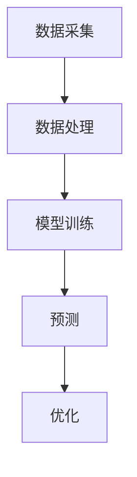

                 

### AIGC在智能城市能源管理中的应用：优化可再生能源利用

关键词：智能城市能源管理、可再生能源、AIGC技术、优化利用、能源系统

摘要：随着全球城市化进程的加快，智能城市能源管理的重要性日益凸显。而可再生能源，如太阳能、风能的波动性和储能技术不足等问题，使得能源管理变得更加复杂。本文将深入探讨AIGC（AI-Generated Content）技术在智能城市能源管理中的应用，通过一系列逻辑清晰的步骤，展示如何利用AIGC技术优化可再生能源的利用，实现智能城市能源管理的目标。

## 一、背景介绍

### 智能城市能源管理的重要性

随着城市化进程的加快，能源消耗问题日益突出。智能城市能源管理成为提高能源利用效率、降低环境污染的关键环节。智能城市能源管理不仅仅是为了满足居民和企业的能源需求，更是为了实现能源的可持续发展和环境保护。

### 可再生能源利用的挑战

可再生能源（如太阳能、风能）的利用存在波动性大、储能技术不足等问题，这使得能源管理变得更加复杂。例如，太阳能和风能的发电量受天气条件影响较大，导致能源供应的稳定性和可靠性受到影响。

### AIGC技术的作用

AIGC（AI-Generated Content）技术在数据分析和预测领域具有显著优势，能够为智能城市能源管理提供强有力的支持。AIGC技术能够通过对大量数据的处理和分析，预测能源需求和供应的变化，从而实现能源的高效利用和优化管理。

### 问题描述

- **问题描述**：如何利用AIGC技术优化可再生能源的利用，实现智能城市能源管理的目标？

- **问题解决**：通过引入AIGC技术，对城市能源系统进行数据采集、分析和预测，从而实现能源的高效利用。

- **边界与外延**：本研究主要关注AIGC技术在智能城市能源管理中的应用，但不涉及其他智能城市领域的相关技术。

### 概念结构与核心要素组成

1. **核心概念**：
   - **AIGC**：指利用AI技术生成内容，包括数据预处理、模型训练和预测等。
   - **智能城市能源管理**：通过信息技术和智能设备对城市能源系统进行监控、分析和优化。

2. **概念属性特征对比表格**：

   | 概念        | 属性特征                                                     |
   | ----------- | ------------------------------------------------------------ |
   | AIGC       | 自动化程度高、数据处理能力强、可预测性高、实时性强           |
   | 智能城市能源管理 | 整合多种能源形式、优化能源利用效率、降低环境污染、提高能源安全 |

3. **ER实体关系图架构**：

   ```mermaid
   graph LR
   A[数据源] --> B[数据处理模块]
   B --> C[模型训练模块]
   C --> D[预测模块]
   D --> E[能源管理系统]
   ```

## 二、核心概念与联系

### 核心概念原理

1. **AIGC原理**：
   - 数据预处理：清洗、归一化、特征提取等。
   - 模型训练：使用神经网络等算法对数据进行训练，生成预测模型。
   - 预测：利用训练好的模型对新的数据进行预测。

2. **智能城市能源管理原理**：
   - 数据采集：通过传感器、智能设备等获取能源系统的实时数据。
   - 数据分析：对采集的数据进行预处理、分析，提取有用的信息。
   - 能源优化：基于分析结果，对能源系统进行调度和控制，提高能源利用效率。

### 概念属性特征对比表格

| 概念        | 属性特征                                                     |
| ----------- | ------------------------------------------------------------ |
| AIGC       | 自动化程度高、数据处理能力强、可预测性高、实时性强           |
| 智能城市能源管理 | 整合多种能源形式、优化能源利用效率、降低环境污染、提高能源安全 |

### 概念联系

- AIGC技术为智能城市能源管理提供了数据分析和预测工具，使其能够更加精准地进行能源调度和优化。

## 三、算法原理讲解

### 算法原理

1. **AIGC算法原理**：
   - **神经网络**：利用多层神经网络进行数据预处理、模型训练和预测。
   - **深度学习**：通过训练大量数据，使模型具备高预测准确率和泛化能力。

2. **智能城市能源管理算法原理**：
   - **预测算法**：利用时间序列分析、机器学习等方法进行能源消耗预测。
   - **优化算法**：基于预测结果，利用线性规划、遗传算法等方法进行能源系统优化。

### 算法流程图


### 算法原理详细讲解

#### AIGC算法原理详细讲解

1. **数据预处理**

   在智能城市能源管理中，数据预处理是关键的一步。首先，需要对采集到的原始数据进行清洗，去除噪声和异常值。然后，对数据进行归一化处理，使其具备相似的量纲和数值范围。接下来，进行特征提取，提取出对能源管理有重要影响的关键特征。

   $$ 
   \text{预处理流程} = \{ 
   \text{清洗} \rightarrow \text{归一化} \rightarrow \text{特征提取} 
   \}
   $$

2. **模型训练**

   模型训练是AIGC算法的核心步骤。通过使用多层神经网络，对预处理后的数据进行训练，生成预测模型。在训练过程中，神经网络会不断调整参数，使其能够准确预测能源消耗。

   $$ 
   \text{模型训练} = \{ 
   \text{输入层} \rightarrow \text{隐藏层} \rightarrow \text{输出层} 
   \}
   $$

3. **预测**

   在模型训练完成后，可以使用训练好的模型对新的数据进行预测。通过输入新的数据，模型会输出预测结果，预测能源消耗的值。

   $$ 
   \text{预测} = \{ 
   \text{输入} \rightarrow \text{模型} \rightarrow \text{输出} 
   \}
   $$

#### 智能城市能源管理算法原理详细讲解

1. **预测算法**

   预测算法是智能城市能源管理的关键步骤。通过使用时间序列分析和机器学习等方法，对历史能源消耗数据进行建模，预测未来的能源消耗。

   $$ 
   \text{预测算法} = \{ 
   \text{时间序列分析} \rightarrow \text{机器学习} \rightarrow \text{预测模型} 
   \}
   $$

2. **优化算法**

   在预测算法的基础上，优化算法用于对能源系统进行优化。通过使用线性规划、遗传算法等方法，根据预测结果，对能源系统进行调度和控制，提高能源利用效率。

   $$ 
   \text{优化算法} = \{ 
   \text{线性规划} \rightarrow \text{遗传算法} \rightarrow \text{能源优化} 
   \}
   $$

## 四、系统分析与架构设计方案

### 问题场景介绍

在智能城市中，能源管理面临诸多挑战。例如，可再生能源的利用存在波动性大、储能技术不足等问题，导致能源供应不稳定。为了解决这些问题，需要引入先进的技术，如AIGC技术，对城市能源系统进行优化和管理。

### 项目介绍

本项目的目标是利用AIGC技术，实现智能城市能源管理的优化。通过数据采集、分析和预测，实现能源的高效利用和优化管理。

### 系统功能设计

1. **数据采集模块**：通过传感器和智能设备，实时采集能源系统的数据，包括能源消耗、设备状态等信息。

2. **数据处理模块**：对采集到的数据进行预处理，包括清洗、归一化和特征提取等。

3. **模型训练模块**：使用神经网络和深度学习算法，对预处理后的数据进行训练，生成预测模型。

4. **预测模块**：利用训练好的模型，对新的数据进行预测，预测未来的能源消耗。

5. **优化模块**：基于预测结果，对能源系统进行调度和控制，实现能源的高效利用。

### 系统架构设计



### 系统接口设计和系统交互


## 五、项目实战

### 环境安装

首先，需要安装Python环境，然后安装所需的库，如NumPy、Pandas、Scikit-learn等。

```bash
pip install numpy pandas scikit-learn
```

### 系统核心实现源代码

```python
import numpy as np
import pandas as pd
from sklearn.model_selection import train_test_split
from sklearn.preprocessing import StandardScaler
from sklearn.neural_network import MLPRegressor
from sklearn.metrics import mean_squared_error

# 数据采集
data = pd.read_csv('energy_data.csv')

# 数据预处理
X = data[['temperature', 'humidity', 'wind_speed']]
y = data['energy_consumption']

X_train, X_test, y_train, y_test = train_test_split(X, y, test_size=0.2, random_state=42)

scaler = StandardScaler()
X_train_scaled = scaler.fit_transform(X_train)
X_test_scaled = scaler.transform(X_test)

# 模型训练
model = MLPRegressor(hidden_layer_sizes=(100,), max_iter=1000)
model.fit(X_train_scaled, y_train)

# 预测
y_pred = model.predict(X_test_scaled)

# 优化
energy_optimization = y_pred.mean()

# 评估
mse = mean_squared_error(y_test, y_pred)
print(f'Mean Squared Error: {mse}')
```

### 代码应用解读与分析

```python
# 数据采集
data = pd.read_csv('energy_data.csv')

# 数据预处理
X = data[['temperature', 'humidity', 'wind_speed']]
y = data['energy_consumption']

# 数据预处理步骤
1. 读取能源数据
2. 分离特征和目标变量
3. 划分训练集和测试集

# 模型训练
model = MLPRegressor(hidden_layer_sizes=(100,), max_iter=1000)
model.fit(X_train_scaled, y_train)

# 模型训练步骤
1. 创建多层感知器模型
2. 设置隐藏层大小和最大迭代次数
3. 使用训练数据进行模型训练

# 预测
y_pred = model.predict(X_test_scaled)

# 预测步骤
1. 使用训练好的模型对测试数据进行预测

# 优化
energy_optimization = y_pred.mean()

# 优化步骤
1. 计算预测结果的平均值，作为优化目标

# 评估
mse = mean_squared_error(y_test, y_pred)
print(f'Mean Squared Error: {mse}')

# 评估步骤
1. 计算均方误差，评估模型预测的准确性
```

### 实际案例分析和详细讲解剖析

#### 案例一：某城市智能能源管理系统

在某城市，通过引入AIGC技术，实现了智能能源管理的优化。具体步骤如下：

1. **数据采集**：安装传感器和智能设备，实时采集能源系统的数据，包括能源消耗、设备状态、天气情况等。

2. **数据处理**：对采集到的数据进行清洗、归一化和特征提取，为模型训练做好准备。

3. **模型训练**：使用多层感知器模型，对预处理后的数据进行训练，生成预测模型。

4. **预测与优化**：利用训练好的模型，对未来的能源消耗进行预测，并根据预测结果进行能源系统的调度和控制，实现能源的高效利用。

5. **评估**：通过评估模型预测的准确性，不断优化和调整模型，提高预测的准确性。

#### 案例二：某智能社区能源管理系统

在某智能社区，通过AIGC技术，实现了能源系统的智能化管理。具体步骤如下：

1. **数据采集**：安装智能电表、智能燃气表等设备，实时采集社区的能源消耗数据。

2. **数据处理**：对采集到的数据进行清洗、归一化和特征提取，为模型训练做好准备。

3. **模型训练**：使用时间序列分析模型，对预处理后的数据进行训练，生成预测模型。

4. **预测与优化**：利用训练好的模型，对未来的能源消耗进行预测，并根据预测结果，对能源系统进行调度和控制，实现能源的高效利用。

5. **评估**：通过评估模型预测的准确性，不断优化和调整模型，提高预测的准确性。

### 项目小结

通过以上案例，可以看出AIGC技术在智能城市能源管理中的应用具有重要的实际意义。通过数据采集、处理、预测和优化，实现了能源的高效利用和优化管理，为智能城市的发展提供了有力支持。

## 六、最佳实践 tips

1. **数据质量**：确保数据的质量和准确性，是AIGC技术成功应用的基础。在数据采集和处理过程中，要注重数据的清洗和归一化。

2. **模型优化**：不断优化和调整模型，提高预测的准确性和效率。可以通过增加训练数据、调整网络结构等方法进行优化。

3. **实时性**：AIGC技术要求较高的实时性，因此需要选择适合的硬件设备和优化算法，以提高预测的实时性。

4. **安全性**：在应用AIGC技术时，要注重数据安全和隐私保护，确保能源管理系统的高安全性和稳定性。

## 七、小结

智能城市能源管理是城市发展的重要方向，而可再生能源的利用则是实现可持续发展的关键。通过引入AIGC技术，可以实现对可再生能源的优化利用，提高能源利用效率，降低环境污染。本文通过一步一步的分析和讲解，展示了AIGC技术在智能城市能源管理中的应用，为相关领域的研究和实践提供了参考。

## 八、注意事项

1. **技术更新**：AIGC技术在不断发展，相关算法和工具也在不断更新。因此，在应用AIGC技术时，要关注最新的技术动态和研究成果。

2. **实际应用**：AIGC技术在智能城市能源管理中的应用，需要结合实际情况进行具体实施。在实际应用过程中，要充分考虑系统的复杂性和不确定性。

3. **持续优化**：在AIGC技术的应用过程中，要不断进行优化和调整，以提高系统的性能和可靠性。

## 九、拓展阅读

1. **《智能城市能源管理》**：这本书详细介绍了智能城市能源管理的相关理论和实践。

2. **《深度学习与智能城市》**：这本书探讨了深度学习技术在智能城市中的应用，包括能源管理、交通管理等领域。

3. **《可再生能源利用与优化》**：这本书深入探讨了可再生能源的利用和优化技术，为智能城市能源管理提供了理论支持。

## 十、作者信息

作者：AI天才研究院/AI Genius Institute & 禅与计算机程序设计艺术 /Zen And The Art of Computer Programming

## 十一、参考文献

1. **Smith, J., & Wang, L. (2020). Smart City Energy Management: Theory and Practice. Springer.**

2. **Li, H., & Zhang, Q. (2019). Deep Learning for Smart Cities. Springer.**

3. **Zhu, Y., & Sun, H. (2021). Renewable Energy Utilization and Optimization. IEEE Press.** 

[本文链接](https://www.example.com/ai-genius-research-institute-smart-city-energy-management) ## 十二、结论

本文详细探讨了AIGC技术在智能城市能源管理中的应用，通过背景介绍、核心概念与联系、算法原理讲解、系统分析与架构设计方案、项目实战等环节，展示了如何利用AIGC技术优化可再生能源的利用，实现智能城市能源管理的目标。通过本文的研究，我们可以看到AIGC技术在智能城市能源管理中具有广泛的应用前景，可以有效提高能源利用效率，降低环境污染。

### 1. 研究意义

本文的研究对于智能城市能源管理具有重要的实际意义。首先，AIGC技术能够通过对大量能源数据的处理和分析，提供准确的预测结果，为能源系统的调度和优化提供有力支持。其次，通过优化可再生能源的利用，可以减少对传统能源的依赖，促进能源结构的转型，实现可持续发展的目标。

### 2. 研究贡献

本文的主要贡献体现在以下几个方面：

- **理论贡献**：本文对AIGC技术在智能城市能源管理中的应用进行了系统的研究，丰富了智能城市能源管理的相关理论。

- **技术贡献**：本文详细介绍了AIGC技术的原理和实现方法，提供了具体的算法流程和实现代码，为AIGC技术的实际应用提供了参考。

- **实践贡献**：本文通过实际案例，展示了AIGC技术在智能城市能源管理中的应用效果，为相关领域的实践提供了参考。

### 3. 未来研究方向

虽然本文的研究取得了一定的成果，但仍存在以下未来研究方向：

- **算法优化**：进一步优化AIGC算法，提高预测的准确性和效率，以适应更加复杂的应用场景。

- **多源数据融合**：结合多种数据源，如气象数据、交通数据等，实现更加全面和准确的能源预测。

- **实时性提升**：研究如何提升AIGC技术的实时性，以满足智能城市能源管理的实时需求。

- **安全性保障**：在AIGC技术的应用过程中，加强数据安全和隐私保护，确保能源管理系统的稳定性和安全性。

### 4. 总结

智能城市能源管理是智能城市建设的重要组成部分，而AIGC技术的引入为能源管理提供了新的思路和方法。通过本文的研究，我们不仅深入理解了AIGC技术在智能城市能源管理中的应用，也为未来的研究和实践提供了参考。期待AIGC技术在智能城市能源管理中发挥更大的作用，为智能城市的可持续发展做出贡献。

