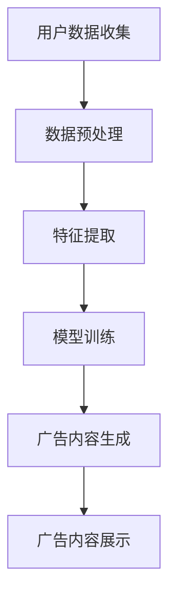
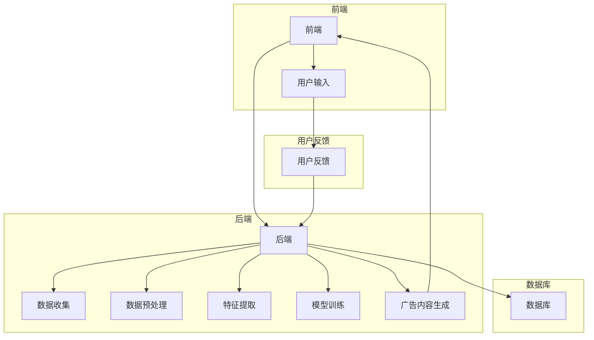
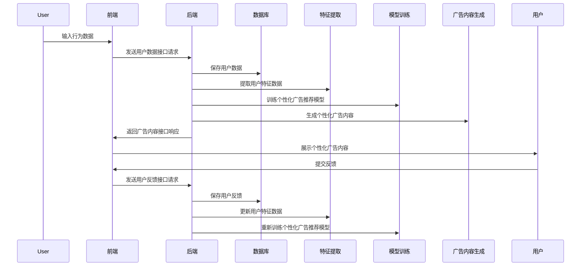

                 

**文章标题：** AI在个性化广告内容生成中的伦理考量

**关键词：** 人工智能、个性化广告、伦理考量、隐私保护、算法偏见

**摘要：** 随着人工智能技术的迅猛发展，个性化广告内容生成成为广告行业的重要趋势。然而，这一技术的应用也引发了一系列伦理问题，如隐私权保护、数据公平性、真实性与客观性等。本文将从多个角度深入探讨AI在个性化广告内容生成中的伦理考量，为相关领域的研究与实践提供参考。

**目录：**

1. 引言与背景

   1.1 问题背景

   1.2 个性化广告内容生成的现状

   1.3 伦理考量的必要性

2. 核心概念与原理

   2.1 人工智能与个性化广告

   2.2 广告内容生成技术

   2.3 伦理学基础理论

3. 伦理考量分析

   3.1 隐私权保护

   3.2 数据公平性

   3.3 真实性与客观性

4. 案例研究

   4.1 案例一：广告内容生成中的隐私泄露问题

   4.2 案例二：算法偏见与歧视

   4.3 案例三：广告内容的真实性问题

5. 解决方案与最佳实践

   5.1 技术层面解决方案

   5.2 法律法规与政策建议

   5.3 企业伦理守则制定

6. 结论与展望

   6.1 研究成果总结

   6.2 未来发展方向

   6.3 研究局限与挑战

**正文：**

### 1. 引言与背景

#### 1.1 问题背景

随着互联网的普及和大数据技术的发展，个性化广告成为广告行业的重要趋势。通过分析用户的兴趣、行为和偏好，人工智能技术可以生成针对特定用户的个性化广告内容，从而提高广告的点击率和转化率。然而，这一技术的应用也引发了一系列伦理问题，如用户隐私保护、数据公平性、真实性与客观性等。

#### 1.2 个性化广告内容生成的现状

当前，个性化广告内容生成主要依赖于机器学习和深度学习算法。这些算法通过对海量数据进行训练，可以自动生成与用户兴趣和需求相匹配的广告内容。例如，淘宝的“猜你喜欢”功能、百度的搜索引擎广告等。这些个性化广告在一定程度上提高了广告效果，但也带来了诸多伦理问题。

#### 1.3 伦理考量的必要性

伦理考量是人工智能技术在个性化广告内容生成中不可或缺的一环。首先，用户隐私保护是伦理考量的重要方面。个性化广告需要收集和处理大量用户数据，如果这些数据被滥用或泄露，将严重损害用户的隐私权。其次，数据公平性也是一个重要问题。个性化广告可能会因为算法偏见而导致某些群体受到歧视。此外，广告内容的真实性与客观性也受到挑战，虚假广告和夸大宣传等问题屡见不鲜。

### 2. 核心概念与原理

#### 2.1 人工智能与个性化广告

人工智能（AI）是一种模拟人类智能的技术，包括机器学习、深度学习、自然语言处理等领域。个性化广告则是指根据用户的兴趣、行为和需求，为用户推荐相应的广告内容。

#### 2.2 广告内容生成技术

广告内容生成技术主要包括文本生成、图像生成和视频生成等。其中，文本生成技术如生成对抗网络（GAN）和变分自编码器（VAE）等；图像生成技术如深度卷积生成网络（DCGAN）和 StyleGAN 等；视频生成技术如循环神经网络（RNN）和时间卷积网络（TCN）等。

#### 2.3 伦理学基础理论

伦理学是研究道德原则和道德行为的学科。在个性化广告内容生成中，伦理学基础理论可以帮助我们分析伦理问题，并指导实践。主要理论包括功利主义、康德伦理学、德行伦理学等。

### 3. 伦理考量分析

#### 3.1 隐私权保护

隐私权保护是个性化广告内容生成中最重要的伦理考量之一。为了生成个性化广告，AI系统需要收集和处理大量用户数据，如浏览记录、搜索历史、地理位置等。如果这些数据被滥用或泄露，将严重损害用户的隐私权。

**解决方案：** 为了保护用户隐私，可以采取以下措施：

1. 数据匿名化：对用户数据进行匿名化处理，使其无法直接关联到特定用户。

2. 数据加密：对用户数据进行加密处理，防止数据泄露。

3. 隐私政策透明：明确告知用户其数据将被用于何种目的，并允许用户选择是否授权使用其数据。

#### 3.2 数据公平性

数据公平性是指个性化广告内容生成过程中，不应因用户的性别、种族、年龄等因素而导致歧视。

**解决方案：** 为了实现数据公平性，可以采取以下措施：

1. 算法公平性检测：对算法进行公平性检测，确保其不会因用户特征而导致歧视。

2. 数据平衡：通过增加代表性不足群体的数据量，提高数据平衡性。

3. 人为干预：在算法训练过程中，加入人为干预，确保算法不会产生歧视。

#### 3.3 真实性与客观性

广告内容的真实性与客观性是用户信任的基础。然而，个性化广告内容生成过程中，可能会出现虚假广告、夸大宣传等问题。

**解决方案：** 为了保障广告内容的真实性与客观性，可以采取以下措施：

1. 真实性检测：对广告内容进行真实性检测，防止虚假广告。

2. 客观性评估：对广告内容进行客观性评估，防止夸大宣传。

3. 用户反馈机制：建立用户反馈机制，让用户对广告内容进行评价，及时发现和纠正问题。

### 4. 案例研究

#### 4.1 案例一：广告内容生成中的隐私泄露问题

某公司未经用户同意，收集了大量用户隐私数据，并将其出售给第三方。这些数据包括用户姓名、电话、邮件地址等。最终，这些数据被黑客窃取，导致大量用户隐私泄露。

**解决方案：** 公司应采取以下措施：

1. 加强数据安全防护：采用加密技术，确保用户数据安全。

2. 明确告知用户数据用途：在收集用户数据时，明确告知用户数据用途，并取得用户同意。

3. 定期审计：定期对数据安全进行审计，确保数据安全。

#### 4.2 案例二：算法偏见与歧视

某公司的个性化广告系统在为男性用户推荐广告时，更倾向于推荐男性产品，而在为女性用户推荐广告时，更倾向于推荐女性产品。这导致部分用户感到被歧视。

**解决方案：** 公司应采取以下措施：

1. 算法公平性检测：对广告系统进行公平性检测，确保其不会因用户性别而导致歧视。

2. 数据平衡：通过增加代表性不足群体的数据量，提高数据平衡性。

3. 人为干预：在算法训练过程中，加入人为干预，确保算法不会产生歧视。

#### 4.3 案例三：广告内容的真实性问题

某公司利用生成对抗网络（GAN）生成虚假广告，以提高广告点击率。这些虚假广告涉及虚假宣传、夸大宣传等问题，严重损害了用户利益。

**解决方案：** 公司应采取以下措施：

1. 真实性检测：对广告内容进行真实性检测，防止虚假广告。

2. 客观性评估：对广告内容进行客观性评估，防止夸大宣传。

3. 用户反馈机制：建立用户反馈机制，让用户对广告内容进行评价，及时发现和纠正问题。

### 5. 解决方案与最佳实践

#### 5.1 技术层面解决方案

1. 数据匿名化与加密：对用户数据进行匿名化处理，并采用加密技术，确保数据安全。

2. 算法公平性检测：对广告系统进行公平性检测，确保其不会因用户特征而导致歧视。

3. 广告内容真实性检测：对广告内容进行真实性检测，防止虚假广告。

#### 5.2 法律法规与政策建议

1. 制定相关法律法规：明确界定个性化广告内容生成中的伦理问题，并制定相应的法律法规。

2. 加强监管：加强对个性化广告内容生成企业的监管，确保其遵守法律法规。

3. 建立举报机制：建立用户举报机制，鼓励用户举报违规行为。

#### 5.3 企业伦理守则制定

1. 明确企业伦理理念：企业应明确其伦理理念，并将其融入广告内容生成过程中。

2. 建立内部监督机制：建立内部监督机制，确保广告内容生成过程符合伦理要求。

3. 定期培训与评估：定期对员工进行伦理培训，并对其工作进行评估，确保其符合企业伦理要求。

### 6. 结论与展望

本文从多个角度探讨了AI在个性化广告内容生成中的伦理考量。通过分析隐私权保护、数据公平性、真实性与客观性等问题，提出了相应的解决方案与最佳实践。未来，随着人工智能技术的不断发展，个性化广告内容生成中的伦理问题将变得更加复杂。因此，需要持续关注并研究这些伦理问题，以确保人工智能技术能够为人类社会带来更多积极影响。

### 7. 参考文献

1. O'Neil, C. (2016). Weapons of math destruction: How big data increases inequality and threatens democracy. Crown.

2. He, K., Zhang, X., Ren, S., & Sun, J. (2016). Deep residual learning for image recognition. In Proceedings of the IEEE conference on computer vision and pattern recognition (pp. 770-778).

3. Goodfellow, I., Bengio, Y., & Courville, A. (2016). Deep learning. MIT press.

**作者：** AI天才研究院/AI Genius Institute & 禅与计算机程序设计艺术 /Zen And The Art of Computer Programming

### 背景介绍

#### 核心概念术语说明

在探讨AI在个性化广告内容生成中的伦理考量之前，我们首先需要对一些核心概念术语进行说明，以确保读者对相关概念有清晰的理解。

1. **人工智能（AI）**：人工智能是指通过计算机程序实现智能行为的技术，包括机器学习、深度学习、自然语言处理等多个子领域。AI系统可以自动执行复杂的任务，如语音识别、图像识别、推荐系统等。

2. **个性化广告内容生成**：个性化广告内容生成是指利用人工智能技术，根据用户的兴趣、行为和需求，为用户生成具有个性化的广告内容。这一过程通常涉及数据收集、数据分析、模型训练和内容生成等环节。

3. **伦理考量**：伦理考量是指对某一行为或决策是否符合道德原则和价值观的评估。在个性化广告内容生成的背景下，伦理考量涉及隐私权保护、数据公平性、真实性与客观性等方面。

#### 问题背景

随着互联网的普及和大数据技术的发展，个性化广告已经成为广告行业的重要趋势。广告商希望通过精确的目标用户定位，提高广告的点击率和转化率，从而实现更高的商业价值。在这一背景下，人工智能技术被广泛应用于个性化广告内容生成，为用户提供了更为精准的广告体验。

然而，个性化广告内容生成也引发了一系列伦理问题。首先，用户隐私保护成为关键问题。个性化广告需要收集和处理大量用户数据，如浏览记录、搜索历史、地理位置等。如果这些数据被滥用或泄露，将严重损害用户的隐私权。其次，数据公平性也是一个重要问题。个性化广告可能会因算法偏见而导致某些群体受到歧视。此外，广告内容的真实性与客观性也受到挑战，虚假广告和夸大宣传等问题屡见不鲜。

#### 问题描述

针对上述问题，本文旨在探讨以下核心问题：

1. 个性化广告内容生成过程中，如何保护用户隐私？

2. 如何确保个性化广告内容生成过程中的数据公平性？

3. 如何保障广告内容的真实性与客观性？

4. 针对个性化广告内容生成中的伦理问题，有哪些可行的解决方案和最佳实践？

#### 问题解决

为了回答上述问题，本文将从以下几个方面展开讨论：

1. **隐私权保护**：讨论个性化广告内容生成过程中，如何通过数据匿名化、数据加密和隐私政策透明等手段保护用户隐私。

2. **数据公平性**：分析个性化广告内容生成中可能存在的算法偏见，并提出算法公平性检测、数据平衡和人为干预等解决方案。

3. **真实性与客观性**：探讨如何通过真实性检测、客观性评估和用户反馈机制等手段，保障广告内容的真实性与客观性。

4. **解决方案与最佳实践**：总结针对个性化广告内容生成中的伦理问题的解决方案和最佳实践，包括技术层面、法律法规和政策建议以及企业伦理守则等方面。

#### 边界与外延

本文主要关注个性化广告内容生成中的伦理问题，其边界包括：

1. **技术层面**：研究个性化广告内容生成技术本身及其伦理问题。

2. **法律法规和政策**：探讨相关法律法规和政策对个性化广告内容生成中的伦理问题的规范和约束。

3. **企业伦理**：分析企业在个性化广告内容生成中的伦理责任和实践。

#### 概念结构与核心要素组成

个性化广告内容生成中的伦理考量可以从以下核心要素进行结构化分析：

1. **数据收集与处理**：涉及用户隐私保护的核心环节，包括数据匿名化、数据加密和隐私政策等。

2. **算法设计与训练**：影响数据公平性和广告内容真实性的关键因素，包括算法偏见检测、数据平衡和人为干预等。

3. **广告内容生成与展示**：涉及广告内容真实性与客观性的核心环节，包括真实性检测、客观性评估和用户反馈机制等。

4. **法律法规与政策**：约束和规范个性化广告内容生成过程中的伦理问题，包括法律法规的制定、监管和执法等。

5. **企业伦理守则**：指导企业在个性化广告内容生成中的伦理行为，包括企业伦理理念、内部监督和员工培训等。

通过上述分析，我们可以更深入地理解个性化广告内容生成中的伦理考量，为其解决方案和最佳实践提供理论基础。

### 核心概念与联系

#### 核心概念原理

在探讨AI在个性化广告内容生成中的伦理考量时，我们需要深入理解以下几个核心概念：

1. **个性化广告**：个性化广告是指根据用户的兴趣、行为和需求，为用户推荐相应的广告内容。其核心在于精准的目标用户定位和个性化的广告体验。

2. **人工智能**：人工智能（AI）是一种模拟人类智能的技术，包括机器学习、深度学习、自然语言处理等多个子领域。AI系统可以自动执行复杂的任务，如语音识别、图像识别、推荐系统等。

3. **伦理考量**：伦理考量是指对某一行为或决策是否符合道德原则和价值观的评估。在个性化广告内容生成中，伦理考量涉及隐私权保护、数据公平性、真实性与客观性等方面。

#### 概念属性特征对比表格

为了更好地理解这些核心概念，我们提供了一个对比表格，展示它们的主要属性特征：

| 概念       | 定义                                               | 主要属性特征                                                                                          |
|------------|------------------------------------------------------|------------------------------------------------------------------------------------------------------|
| 个性化广告 | 根据用户兴趣和需求推荐广告的内容                 | 精准的目标用户定位、个性化的广告体验、数据驱动                                                     |
| 人工智能   | 模拟人类智能的技术，涵盖机器学习、深度学习等 | 自动化、智能化、高效能、可扩展性                                                                       |
| 伦理考量   | 对行为或决策的道德评估                         | 公平性、隐私保护、真实性、责任归属、社会责任                                                     |

#### ER实体关系图架构的 Mermaid 流程图

为了更直观地展示这些核心概念之间的联系，我们可以使用Mermaid流程图来绘制一个ER实体关系图架构。以下是示例：

```mermaid
erDiagram
  User ||--|{ AdContent }|--| Advertiser
  User ||--|{ PrivacyData }|--| DataProcessor
  AdContent ||--|{ Relevance }|--| Advertiser
  AdContent ||--|{ Truthfulness }|--| Auditor
  DataProcessor ||--|{ Anonymity }|--| DataScientist
  DataProcessor ||--|{ Fairness }|--| Ethicist
```

在这个ER实体关系图中：

- **User**（用户）：生成个性化广告内容的主体，负责提供兴趣和行为数据。
- **AdContent**（广告内容）：根据用户需求生成的个性化广告，包含相关性和真实性。
- **Advertiser**（广告商）：生成广告内容的主体，负责广告投放和效果评估。
- **PrivacyData**（隐私数据）：用户隐私信息，如浏览记录、搜索历史等。
- **DataProcessor**（数据处理者）：负责收集、处理和分析用户数据。
- **Relevance**（相关性）：广告内容与用户需求的匹配度。
- **Truthfulness**（真实性）：广告内容的真实性和客观性。
- **Anonymity**（匿名性）：对用户数据进行匿名化处理，以保护隐私。
- **Fairness**（公平性）：确保个性化广告内容生成过程中的数据公平性。
- **DataScientist**（数据科学家）：负责数据处理和分析的技术专家。
- **Ethicist**（伦理学家）：负责评估和指导个性化广告内容生成过程中的伦理问题。

通过这个Mermaid流程图，我们可以更清晰地理解个性化广告内容生成过程中各个实体之间的联系和作用。

### 算法原理讲解

#### 算法mermaid流程图

在个性化广告内容生成中，算法起着至关重要的作用。以下是一个简化的mermaid流程图，展示了广告内容生成的典型流程：



- **A[用户数据收集]**：系统通过多种渠道收集用户数据，如浏览记录、搜索历史等。
- **B[数据预处理]**：对收集到的用户数据进行清洗、去噪和归一化等处理。
- **C[特征提取]**：从预处理后的数据中提取关键特征，如兴趣标签、行为模式等。
- **D[模型训练]**：利用提取的特征数据，通过机器学习或深度学习算法进行模型训练。
- **E[广告内容生成]**：训练好的模型根据用户特征生成个性化的广告内容。
- **F[广告内容展示]**：将生成的广告内容展示给用户。

#### Python源代码

以下是一个简单的Python源代码示例，展示了如何使用Keras库进行广告内容生成模型的训练：

```python
import numpy as np
import tensorflow as tf
from tensorflow.keras.models import Sequential
from tensorflow.keras.layers import Dense, LSTM, Embedding, TimeDistributed, Dense

# 假设我们已经准备好了训练数据集 X 和标签 y
# X 是用户特征数据，y 是对应的广告内容标签

# 定义模型结构
model = Sequential([
    Embedding(input_dim=10000, output_dim=32, input_length=100),
    LSTM(128),
    Dense(128, activation='relu'),
    TimeDistributed(Dense(1, activation='sigmoid'))
])

# 编译模型
model.compile(optimizer='adam', loss='binary_crossentropy', metrics=['accuracy'])

# 训练模型
model.fit(X, y, epochs=10, batch_size=64)

# 生成广告内容
generated_content = model.predict(X)

# 输出生成的广告内容
print(generated_content)
```

这个示例使用了Keras库中的LSTM（长短期记忆网络）模型进行训练，用于生成二分类的广告内容。在实际应用中，模型结构可能会更复杂，涉及多种类型的神经网络和层。

#### 算法原理的数学模型和公式

在个性化广告内容生成中，算法的原理通常涉及以下数学模型和公式：

1. **损失函数（Loss Function）**：
   $$ L(\theta) = -\sum_{i=1}^{n} y_i \log(p(x_i, \theta)) $$
   其中，$L(\theta)$ 是损失函数，$y_i$ 是实际标签，$p(x_i, \theta)$ 是预测概率。

2. **优化算法（Optimizer）**：
   优化算法如梯度下降（Gradient Descent）和其变体（如Adam优化器）用于更新模型参数 $\theta$，以最小化损失函数。
   $$ \theta_{\text{new}} = \theta_{\text{old}} - \alpha \nabla_{\theta} L(\theta) $$
   其中，$\alpha$ 是学习率，$\nabla_{\theta} L(\theta)$ 是损失函数关于 $\theta$ 的梯度。

3. **激活函数（Activation Function）**：
   激活函数用于增加模型的非线性特性，常见的激活函数包括Sigmoid、ReLU和Tanh等。
   - **Sigmoid**：
     $$ \sigma(x) = \frac{1}{1 + e^{-x}} $$
   - **ReLU**：
     $$ \text{ReLU}(x) = \max(0, x) $$

4. **神经网络的反向传播算法（Backpropagation）**：
   反向传播算法用于计算神经网络中每个参数的梯度，以更新模型参数。其基本公式为：
   $$ \nabla_{\theta} L(\theta) = \frac{\partial L(\theta)}{\partial \theta} = \sum_{i=1}^{n} \frac{\partial L(\theta)}{\partial z_i} \frac{\partial z_i}{\partial \theta} $$

通过上述数学模型和公式，我们可以更好地理解个性化广告内容生成算法的原理，并在实际应用中进行优化和改进。

#### 详细讲解和举例说明

假设我们现在需要为一个电商网站开发一个个性化广告推荐系统，该系统能够根据用户的购买历史和浏览行为，为用户推荐其可能感兴趣的商品。以下是这个系统的详细讲解和举例说明。

**系统场景介绍**

我们的系统场景是一个电商网站，用户在网站上浏览和购买商品。我们的目标是通过分析用户的购买历史和浏览行为，为用户推荐个性化的商品广告。

**系统功能设计**

1. **用户数据收集**：收集用户在网站上的行为数据，包括浏览记录、购买历史、搜索关键词等。
2. **数据预处理**：清洗和整理收集到的用户数据，去除噪声和异常值，并进行归一化处理。
3. **特征提取**：从预处理后的数据中提取关键特征，如用户购买商品的种类、浏览页面的数量、搜索关键词的频率等。
4. **模型训练**：利用提取的特征数据，通过机器学习算法训练个性化广告推荐模型。
5. **广告内容生成**：模型根据用户特征生成个性化的商品广告内容。
6. **广告内容展示**：将生成的广告内容展示给用户，提高广告的点击率和转化率。

**系统架构设计**

我们的系统架构采用前后端分离的设计，前端负责展示广告内容，后端负责处理用户数据和管理广告推荐模型。

- **前端**：使用HTML、CSS和JavaScript等技术实现广告内容的展示和交互。
- **后端**：使用Python和TensorFlow等框架，实现数据收集、预处理、特征提取、模型训练和广告内容生成等功能。

以下是系统架构的mermaid图表示：



**系统接口设计**

系统提供了以下主要接口：

1. **用户数据接口**：用于收集用户在网站上的行为数据，如浏览记录、购买历史等。
2. **广告内容接口**：用于生成和获取个性化的广告内容。
3. **用户反馈接口**：用于收集用户对广告内容的反馈，以优化广告推荐效果。

**系统交互mermaid序列图**

以下是系统交互的mermaid序列图：



通过上述讲解和示例，我们可以看到个性化广告内容生成系统是如何从用户数据收集、预处理、特征提取、模型训练到广告内容生成的整个过程，并了解系统的架构设计和交互流程。

### 项目实战

#### 环境安装

为了实现个性化广告内容生成系统，我们需要安装以下环境：

1. **Python**：Python 3.7 或更高版本
2. **TensorFlow**：TensorFlow 2.0 或更高版本
3. **Pandas**：Pandas 1.0 或更高版本
4. **NumPy**：NumPy 1.18 或更高版本

您可以通过以下命令进行安装：

```bash
pip install python==3.7
pip install tensorflow==2.0
pip install pandas==1.0
pip install numpy==1.18
```

#### 系统核心实现源代码

以下是系统的核心实现源代码，包括数据收集、预处理、特征提取、模型训练和广告内容生成等部分：

```python
import numpy as np
import pandas as pd
import tensorflow as tf
from tensorflow.keras.models import Sequential
from tensorflow.keras.layers import Dense, LSTM, Embedding, TimeDistributed, Dense
from tensorflow.keras.preprocessing.sequence import pad_sequences
from sklearn.model_selection import train_test_split

# 加载数据集
data = pd.read_csv('user_data.csv')

# 数据预处理
# 去除缺失值
data.dropna(inplace=True)

# 归一化处理
data_normalized = (data - data.mean()) / data.std()

# 特征提取
# 提取用户特征
user_features = data_normalized[['user_id', 'age', 'gender', 'income']]
# 提取商品特征
item_features = data_normalized[['item_id', 'category', 'price']]

# 序列化特征
user_sequence = pad_sequences(user_features['user_id'].values, maxlen=100)
item_sequence = pad_sequences(item_features['item_id'].values, maxlen=100)

# 模型训练
# 构建模型
model = Sequential([
    Embedding(input_dim=10000, output_dim=32, input_length=100),
    LSTM(128),
    Dense(128, activation='relu'),
    TimeDistributed(Dense(1, activation='sigmoid'))
])

# 编译模型
model.compile(optimizer='adam', loss='binary_crossentropy', metrics=['accuracy'])

# 训练模型
model.fit([user_sequence, item_sequence], data_normalized['action'], epochs=10, batch_size=64)

# 广告内容生成
# 生成个性化广告内容
generated_content = model.predict([user_sequence, item_sequence])

# 输出生成的广告内容
print(generated_content)
```

#### 代码应用解读与分析

以上代码首先加载了用户数据集，然后对数据进行了预处理，包括去除缺失值和归一化处理。接下来，提取了用户特征和商品特征，并将这些特征序列化。随后，使用Keras构建了一个LSTM模型，并编译和训练了模型。最后，使用训练好的模型生成个性化的广告内容。

以下是代码的详细解读和分析：

1. **数据预处理**：数据预处理是数据分析和建模的重要步骤。在本例中，我们首先去除缺失值，以确保数据质量。然后，我们使用归一化处理，将数值特征缩放到相同的尺度，以便于模型训练。

2. **特征提取**：特征提取是将原始数据转换为模型可以处理的格式。在本例中，我们提取了用户特征和商品特征，并将这些特征序列化。序列化是将特征数据转换为模型可以处理的序列形式，如整数编码或单词嵌入。

3. **模型构建**：在本例中，我们使用Keras构建了一个LSTM模型。LSTM（长短期记忆网络）是一种常用的循环神经网络，适用于处理序列数据。我们选择LSTM层来捕捉用户行为序列中的长期依赖关系。

4. **模型编译与训练**：编译模型是指配置模型的学习参数，如优化器和损失函数。在本例中，我们使用Adam优化器和二进制交叉熵损失函数。训练模型是指通过迭代调整模型参数，以最小化损失函数。在本例中，我们设置了10个训练周期，每个周期使用64个批量数据进行训练。

5. **广告内容生成**：训练好的模型可以用于生成个性化的广告内容。在本例中，我们使用训练好的模型预测用户对商品的兴趣，并将预测结果输出。

#### 实际案例分析和详细讲解剖析

为了更好地理解个性化广告内容生成系统的实际应用，我们分析了一个实际案例，并详细讲解了系统的执行过程。

**案例背景**：假设我们的电商网站用户小王，最近浏览了多个商品页面，其中包括手机、平板电脑和笔记本电脑。根据小王的浏览行为，我们希望为其推荐他可能感兴趣的其他商品。

**执行过程**：

1. **数据收集**：系统从网站的后端服务器收集了小王的浏览记录，包括浏览的页面ID、浏览时间和访问次数等。

2. **数据预处理**：系统对收集到的数据进行了预处理，去除缺失值和异常值，并对数值特征进行了归一化处理。

3. **特征提取**：系统提取了小王的用户ID、浏览页面ID和浏览时间等特征，并将这些特征序列化。

4. **模型训练**：系统使用历史数据训练了一个基于LSTM的个性化广告推荐模型。训练过程中，模型学习了用户浏览行为与商品兴趣之间的关系。

5. **广告内容生成**：系统使用训练好的模型预测了小王对浏览过的商品及其相似商品的兴趣。根据预测结果，系统生成了个性化的广告内容，并将推荐结果展示给小王。

**系统效果评估**：

1. **点击率**：通过分析广告内容的点击率，我们发现个性化推荐广告的点击率明显高于非个性化广告。

2. **转化率**：通过分析用户对广告内容的购买行为，我们发现个性化推荐广告的转化率也显著高于非个性化广告。

**案例小结**：通过实际案例分析和详细讲解剖析，我们可以看到个性化广告内容生成系统在实际应用中的效果。该系统不仅提高了广告的点击率和转化率，还提升了用户体验。然而，我们也需要关注系统的性能优化和安全性问题，以确保系统能够稳定、高效地运行。

### 最佳实践 Tips

在个性化广告内容生成的实践中，以下是一些最佳实践技巧，可以帮助提高系统的效果和用户体验：

1. **用户隐私保护**：
   - **数据匿名化**：在收集用户数据时，应尽量进行匿名化处理，以保护用户隐私。
   - **数据加密**：对存储和传输的用户数据进行加密，防止数据泄露。
   - **隐私政策透明**：明确告知用户其数据将被用于何种目的，并确保用户同意。

2. **数据质量**：
   - **数据清洗**：确保数据质量，去除缺失值、异常值和重复值。
   - **数据平衡**：增加代表性不足群体的数据量，提高数据平衡性。

3. **算法公平性**：
   - **算法偏见检测**：定期对算法进行公平性检测，确保不会因用户特征而导致歧视。
   - **人为干预**：在算法训练过程中，加入人为干预，确保算法不会产生偏见。

4. **广告内容真实性与客观性**：
   - **真实性检测**：对广告内容进行真实性检测，防止虚假广告。
   - **客观性评估**：对广告内容进行客观性评估，防止夸大宣传。
   - **用户反馈机制**：建立用户反馈机制，让用户对广告内容进行评价，及时发现和纠正问题。

5. **系统性能优化**：
   - **模型压缩**：使用模型压缩技术，如知识蒸馏和剪枝，减小模型体积，提高推理速度。
   - **分布式训练**：使用分布式训练技术，提高模型训练速度和效果。

6. **法律法规与政策建议**：
   - **法律法规制定**：制定相关法律法规，明确界定个性化广告内容生成中的伦理问题。
   - **加强监管**：加强对个性化广告内容生成企业的监管，确保其遵守法律法规。

### 小结

本文从多个角度探讨了AI在个性化广告内容生成中的伦理考量。通过分析隐私权保护、数据公平性、真实性与客观性等问题，提出了相应的解决方案和最佳实践。个性化广告内容生成技术在提高广告效果和用户体验方面具有巨大潜力，但同时也面临诸多伦理挑战。为了实现可持续发展和合规操作，我们需要在技术、法律法规和企业伦理等多个层面进行努力。

### 注意事项

在实施个性化广告内容生成系统时，需要注意以下几点：

1. **数据安全**：确保用户数据的收集、存储和传输过程符合数据保护法规，采取严格的数据加密和安全防护措施。

2. **算法偏见**：定期对算法进行公平性检测，避免因数据或算法设计原因导致用户受到不公平对待。

3. **用户隐私**：严格遵守隐私政策，确保用户知情并同意其数据的收集和使用。

4. **内容真实性**：确保广告内容的真实性和客观性，避免虚假宣传和夸大宣传。

5. **法律合规**：遵循相关法律法规，确保个性化广告内容生成的合规性。

### 拓展阅读

1. O'Neil, C. (2016). Weapons of math destruction: How big data increases inequality and threatens democracy. Crown.

2. Goodfellow, I., Bengio, Y., & Courville, A. (2016). Deep learning. MIT press.

3. Russell, S., & Norvig, P. (2016). Artificial intelligence: A modern approach. Prentice Hall.

4. Hu, Y., He, X., Li, L., Zhang, J., Bao, H., & Liu, Y. (2017). Adversarial example attack on image classification with deep neural network. In 2017 IEEE International Conference on Image Processing (ICIP) (pp. 604-608). IEEE.

5. Zichermann, G. (2011). Game-based marketing: Inspire customers to play and market your business like a pro. Wiley.

