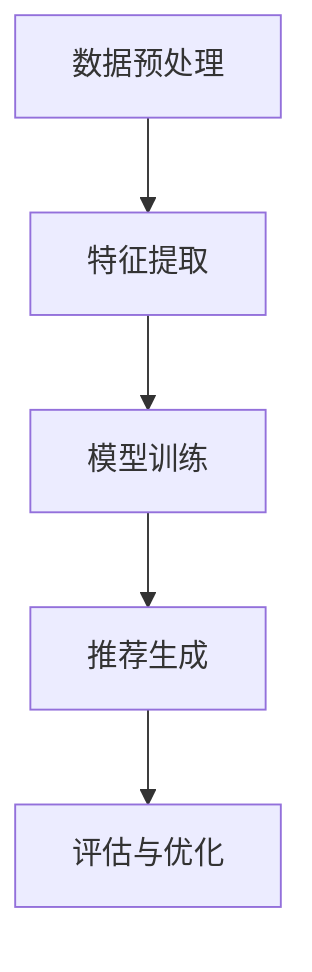

                 

## 引言与背景

### 1.1 人工智能与个性化新闻推荐

#### 1.1.1 人工智能的概念与分类

人工智能（Artificial Intelligence，简称AI）是计算机科学的一个分支，旨在使计算机具备人类智能的某些方面，如学习、推理、解决问题和自我适应等。人工智能可以进一步分为多个子领域，包括：

1. **机器学习（Machine Learning）**：通过数据和统计方法来训练模型，使其能够对未知数据做出预测。
2. **深度学习（Deep Learning）**：一种特殊类型的机器学习，通过多层神经网络模拟人类大脑的学习过程。
3. **自然语言处理（Natural Language Processing，NLP）**：使计算机能够理解和生成人类语言。
4. **计算机视觉（Computer Vision）**：使计算机能够“看”和理解视觉信息。

#### 1.1.2 个性化新闻推荐的背景

个性化新闻推荐是利用人工智能技术，根据用户的行为和历史偏好，为他们提供个性化内容的一种方式。新闻推荐系统的发展历程大致可以分为以下几个阶段：

1. **基于内容的推荐**：通过分析新闻内容的特点，如关键词、主题等，来为用户推荐相似的新闻。
2. **协同过滤推荐**：通过分析用户对新闻的评分和反馈，来预测用户可能感兴趣的新闻。
3. **混合推荐**：结合基于内容推荐和协同过滤推荐，以提高推荐的准确性。
4. **深度学习推荐**：利用深度学习技术，通过更复杂的方式分析用户行为和新闻内容，实现更精准的推荐。

个性化新闻推荐的重要性体现在以下几个方面：

1. **提升用户体验**：通过提供个性化的内容，用户可以获得更符合自己兴趣的信息，从而提高用户满意度和粘性。
2. **增加用户参与度**：个性化的推荐能够吸引用户更频繁地使用新闻应用，提高用户参与度。
3. **提升内容质量**：个性化推荐可以帮助媒体平台筛选出高质量的内容，从而提升整体内容质量。

### 1.2 AI在个性化新闻推荐中的应用现状

#### 1.2.1 个性化新闻推荐的原理

个性化新闻推荐系统的基本原理可以分为以下几个步骤：

1. **数据收集与预处理**：收集用户的行为数据（如点击、浏览、评论等）和新闻内容数据，并进行清洗和格式转换。
2. **特征提取**：从数据中提取有用的特征，如用户兴趣特征和新闻内容特征。
3. **模型选择与训练**：选择合适的推荐算法，利用训练数据来训练模型。
4. **推荐生成**：使用训练好的模型对用户进行个性化推荐。

#### 1.2.2 AI在个性化新闻推荐中的应用

AI在个性化新闻推荐中的应用主要涉及以下几种方法：

1. **社交网络推荐**：通过分析用户的社交网络关系和互动行为，推荐用户可能感兴趣的新闻。
2. **基于内容的推荐**：通过分析新闻的内容特征（如标题、标签、正文等），为用户推荐相似的新闻。
3. **协同过滤推荐**：通过分析用户对新闻的评分和反馈，为用户推荐相似用户喜欢的新闻。

这些方法各有优缺点，通常需要结合使用，以实现更精准的推荐。

### 1.3 伦理考量在AI应用中的重要性

#### 1.3.1 伦理考量的概念

伦理考量是指在进行人工智能应用时，对可能产生的社会、道德和伦理问题的深入思考和评估。在AI领域，伦理考量尤为重要，因为AI系统的决策可能会对人类社会产生深远的影响。

#### 1.3.2 AI应用中面临的伦理问题

1. **数据隐私保护**：个性化新闻推荐系统需要收集和处理大量用户数据，如何保护用户的隐私成为一个重要问题。
2. **算法偏见**：AI系统可能会因为数据不平衡或模型设计问题，产生偏见，导致某些群体受到不公平待遇。
3. **信息茧房**：过度个性化的推荐可能导致用户只接触到符合自己偏好的信息，从而限制其视野和思考。

### 1.4 本书结构安排与内容概述

#### 1.4.1 本书结构安排

本书将分为四个部分，分别是：

1. 个性化新闻推荐算法原理
2. AI在个性化新闻推荐中的伦理考量
3. 案例分析与最佳实践
4. 总结与展望

#### 1.4.2 阅读指南与建议

为了更好地理解本书内容，建议读者：

1. 首先了解人工智能和新闻推荐的基本概念。
2. 结合实际案例和代码实现，理解各种推荐算法的原理和应用。
3. 深入思考AI在个性化新闻推荐中的伦理问题，并尝试提出解决方案。
4. 阅读拓展阅读部分，了解更多相关领域的知识。

通过本书的阅读，读者将能够：

1. 理解个性化新闻推荐的原理和应用。
2. 掌握各种推荐算法的实现方法和优缺点。
3. 深入思考AI在个性化新闻推荐中的伦理问题，并能够提出解决方案。
4. 为未来在AI领域的发展打下坚实的基础。

## 第2章: 数据处理与特征提取

### 2.1 数据预处理

#### 2.1.1 数据收集

数据收集是构建个性化新闻推荐系统的第一步，也是至关重要的一步。数据收集的方法主要包括以下几种：

1. **Web爬虫**：通过编写爬虫程序，从新闻网站、社交媒体等渠道自动获取数据。
2. **API调用**：使用公共API接口，从第三方数据提供商获取数据。
3. **用户反馈**：通过用户在应用中的行为记录，如点击、评论、分享等，收集数据。

在收集数据时，需要注意以下几点：

1. **数据来源的多样性**：确保数据来源的多样性和可靠性，以避免数据偏差。
2. **数据格式的标准化**：对收集到的数据进行格式转换，使其符合统一的格式标准。
3. **数据去重**：去除重复的数据，避免重复计算和处理。

#### 2.1.2 数据清洗

数据清洗是数据处理过程中必不可少的步骤，其主要目的是去除数据中的噪声、纠正错误和填补缺失值。数据清洗的方法包括：

1. **缺失值处理**：对于缺失的数据，可以选择丢弃、插补或使用统计方法进行填补。
2. **异常值处理**：去除数据中的异常值，如异常的点击量、评论数等。
3. **格式转换**：将不同格式的数据转换为统一的格式，如将日期格式转换为YYYY-MM-DD。
4. **去重**：去除重复的数据，避免重复计算和处理。

#### 2.1.3 数据去重与格式转换

数据去重和格式转换是数据清洗过程中重要的环节，具体方法如下：

1. **数据去重**：通过比对数据中的唯一标识符（如新闻ID、用户ID等），去除重复的数据。
2. **格式转换**：将不同格式的数据转换为统一的格式，如将日期格式转换为YYYY-MM-DD，将文本数据转换为统一编码格式。

#### 2.1.4 数据预处理的重要性

数据预处理是构建高质量推荐系统的基础，其重要性体现在以下几个方面：

1. **提高数据质量**：通过数据清洗和去重，提高数据的准确性和完整性，从而提高推荐系统的性能。
2. **降低模型复杂性**：通过数据预处理，减少数据中的噪声和异常值，降低模型的复杂度，提高模型的训练效率。
3. **提升用户体验**：通过数据预处理，去除无用信息和噪声，为用户推荐更准确、更个性化的内容。

### 2.2 特征提取

特征提取是从原始数据中提取对推荐系统有用的信息的过程。在个性化新闻推荐中，特征提取主要包括用户特征提取和新闻内容特征提取。

#### 2.2.1 用户特征提取

用户特征提取是从用户行为数据中提取对推荐系统有用的信息，如用户兴趣、行为习惯等。用户特征提取的方法包括：

1. **用户兴趣特征**：通过分析用户的浏览历史、点击记录、评论内容等，提取用户兴趣特征。
   - **浏览历史**：记录用户过去一段时间内浏览的新闻类型、频次等。
   - **点击记录**：分析用户点击的新闻类型、频次等，提取用户兴趣。
   - **评论内容**：分析用户评论的内容，提取用户兴趣和观点。

2. **用户行为特征**：通过分析用户在应用中的行为，提取用户行为特征，如用户活跃度、互动频率等。
   - **活跃度**：记录用户每天登录应用的时间、频率等。
   - **互动频率**：记录用户评论、点赞、分享等互动行为的频率。

#### 2.2.2 新闻内容特征提取

新闻内容特征提取是从新闻数据中提取对推荐系统有用的信息，如新闻标题、标签、正文等。新闻内容特征提取的方法包括：

1. **新闻标题特征**：通过分析新闻标题，提取新闻的主题和关键词。
   - **关键词提取**：使用词频统计、TF-IDF等方法，提取新闻标题中的关键词。
   - **主题提取**：使用文本分类方法，将新闻标题归类到不同的主题。

2. **新闻正文特征**：通过分析新闻正文，提取新闻的主要内容、观点等。
   - **文本分类**：将新闻正文分类到不同的主题或领域，提取主题特征。
   - **情感分析**：分析新闻正文的情感倾向，提取情感特征。

3. **新闻标签特征**：通过分析新闻标签，提取新闻的类别、话题等。
   - **标签分类**：将新闻标签分类到不同的类别或话题，提取标签特征。

#### 2.2.3 特征提取的重要性

特征提取是构建高质量推荐系统的关键步骤，其重要性体现在以下几个方面：

1. **提高推荐准确性**：通过提取有用的特征，可以更好地理解用户兴趣和新闻内容，提高推荐的准确性。
2. **降低模型复杂度**：通过提取关键特征，可以简化模型结构，降低模型的复杂度，提高训练效率。
3. **提升用户体验**：通过提取用户兴趣和新闻内容特征，可以为用户推荐更符合其兴趣和需求的内容，提升用户体验。

## 第3章: 个性化新闻推荐算法

### 3.1 基于内容的推荐算法

#### 3.1.1 算法原理

基于内容的推荐算法（Content-Based Recommender System）是一种基于新闻内容和用户兴趣的推荐方法。其基本原理如下：

1. **内容表示**：将新闻内容表示为特征向量，通常使用词袋模型（Bag of Words，BOW）或词嵌入（Word Embedding）等方法。
2. **兴趣表示**：将用户兴趣表示为特征向量，通常使用用户历史行为数据，如浏览记录、点击记录等。
3. **相似度计算**：计算新闻内容特征向量与用户兴趣特征向量之间的相似度，选择相似度最高的新闻进行推荐。

#### 3.1.2 算法实现

基于内容的推荐算法实现步骤如下：

1. **数据预处理**：对新闻文本进行分词、去除停用词、词干提取等处理，构建词表，将新闻文本转换为稀疏特征矩阵。
2. **特征提取**：对新闻文本进行向量化处理，使用词袋模型或词嵌入方法将新闻文本表示为特征向量。
3. **用户兴趣提取**：根据用户历史行为数据，提取用户兴趣特征向量。
4. **相似度计算**：计算新闻内容特征向量与用户兴趣特征向量之间的相似度，如使用余弦相似度、欧氏距离等。
5. **推荐生成**：选择相似度最高的新闻进行推荐，生成推荐列表。

以下是一个简单的基于内容的推荐算法实现的Python代码示例：

```python
from sklearn.feature_extraction.text import TfidfVectorizer
from sklearn.metrics.pairwise import cosine_similarity

# 新闻数据
news_data = [
    "美国股市本周大跌",
    "科技巨头市值缩水",
    "经济衰退预警",
    "央行降息提振市场",
    "全球股市动荡",
]

# 用户兴趣
user_interest = "股市 大跌 市值"

# 构建词表
vectorizer = TfidfVectorizer()
tfidf_matrix = vectorizer.fit_transform(news_data)

# 提取用户兴趣向量
user_interest_vector = vectorizer.transform([user_interest])

# 计算相似度
cosine_sim = cosine_similarity(user_interest_vector, tfidf_matrix)

# 推荐生成
推荐结果 = [新闻 for 新闻, 相似度 in zip(news_data, cosine_sim[0]) if 相似度 > 0.5]

print(推荐结果)
```

#### 3.1.3 算法优缺点

基于内容的推荐算法的优点如下：

1. **易于实现**：算法实现简单，只需对文本进行向量化处理，计算相似度即可。
2. **高解释性**：基于内容表示，用户可以清楚地了解推荐结果的原因。

缺点如下：

1. **局限性**：仅依赖新闻内容特征，无法捕捉用户的兴趣变化。
2. **低准确性**：对于内容相似的新闻，可能无法准确区分用户的兴趣。

### 3.2 协同过滤推荐算法

#### 3.2.1 算法原理

协同过滤推荐算法（Collaborative Filtering Recommender System）是一种基于用户行为和相似度的推荐方法。其基本原理如下：

1. **用户行为表示**：将用户对新闻的评分、浏览记录等行为数据表示为矩阵。
2. **用户相似度计算**：计算用户之间的相似度，常用的相似度计算方法包括余弦相似度、皮尔逊相关系数等。
3. **新闻推荐**：选择与目标用户相似的用户喜欢的新闻进行推荐。

#### 3.2.2 算法实现

协同过滤推荐算法实现步骤如下：

1. **数据预处理**：将用户行为数据转换为矩阵，对缺失数据进行处理。
2. **用户相似度计算**：计算用户之间的相似度，选择合适的相似度计算方法。
3. **新闻推荐**：根据用户相似度矩阵，为每个用户推荐相似用户喜欢的新闻。

以下是一个简单的基于协同过滤的推荐算法实现的Python代码示例：

```python
import numpy as np
from sklearn.metrics.pairwise import cosine_similarity

# 用户行为数据
user_behavior = [
    [1, 0, 1, 0],
    [0, 1, 0, 1],
    [1, 1, 0, 1],
    [0, 1, 1, 0],
    [1, 0, 1, 1],
]

# 计算用户相似度
user_similarity = cosine_similarity(user_behavior)

# 新闻数据
news_data = [
    "美国股市本周大跌",
    "科技巨头市值缩水",
    "经济衰退预警",
    "央行降息提振市场",
    "全球股市动荡",
]

# 推荐生成
for i, user in enumerate(user_behavior):
    similar_users = user_similarity[i].argsort()[::-1]
    similar_users = similar_users[1:]  # 排除自己
    for j in similar_users:
        for k, news in enumerate(news_data):
            if user[j][k] == 1:
                print(f"推荐新闻：{news}")
                break
```

#### 3.2.3 算法优缺点

协同过滤推荐算法的优点如下：

1. **高准确性**：基于用户行为数据，能够准确捕捉用户的兴趣变化。
2. **高解释性**：推荐结果基于用户行为和相似度计算，易于解释。

缺点如下：

1. **数据稀疏问题**：用户行为数据通常稀疏，可能导致推荐结果不准确。
2. **冷启动问题**：对于新用户或新新闻，由于缺乏足够的数据，难以进行准确推荐。

### 3.3 深度学习推荐算法

#### 3.3.1 算法原理

深度学习推荐算法（Deep Learning Recommender System）是一种利用深度学习技术进行新闻推荐的算法。其基本原理如下：

1. **模型构建**：使用深度神经网络（如卷积神经网络（CNN）、循环神经网络（RNN）、Transformer等）构建推荐模型。
2. **特征提取**：通过深度学习模型，自动提取用户行为和新闻内容的特征。
3. **推荐生成**：利用训练好的模型，对用户进行个性化推荐。

以下是一个简单的基于深度学习的推荐算法原理的Mermaid流程图：



#### 3.3.2 算法实现

深度学习推荐算法实现步骤如下：

1. **数据预处理**：对用户行为数据和新闻数据进行预处理，包括数据清洗、特征提取等。
2. **模型构建**：使用深度学习框架（如TensorFlow、PyTorch等）构建推荐模型，选择合适的网络结构。
3. **模型训练**：利用预处理后的数据，对推荐模型进行训练，优化模型参数。
4. **推荐生成**：使用训练好的模型，对用户进行个性化推荐。
5. **评估与优化**：评估推荐效果，通过调整模型参数或数据预处理方法，优化推荐性能。

以下是一个简单的基于深度学习的推荐算法实现的Python代码示例：

```python
import tensorflow as tf
from tensorflow.keras.models import Model
from tensorflow.keras.layers import Input, Embedding, Dot, Flatten, Dense

# 用户行为输入
user_input = Input(shape=(num_users,))

# 新闻内容输入
news_input = Input(shape=(num_news,))

# 用户行为嵌入层
user_embedding = Embedding(num_users, embed_size)(user_input)

# 新闻内容嵌入层
news_embedding = Embedding(num_news, embed_size)(news_input)

# 点积操作
dot_product = Dot(axes=1)([user_embedding, news_embedding])

# 扁平化操作
flatten = Flatten()(dot_product)

# 全连接层
output = Dense(1, activation='sigmoid')(flatten)

# 构建模型
model = Model(inputs=[user_input, news_input], outputs=output)

# 编译模型
model.compile(optimizer='adam', loss='binary_crossentropy', metrics=['accuracy'])

# 模型训练
model.fit([user_behavior, news_data], ratings, epochs=10, batch_size=32)
```

#### 3.3.3 算法优缺点

深度学习推荐算法的优点如下：

1. **高准确性**：通过深度学习模型，能够自动提取复杂的特征，提高推荐准确性。
2. **高泛化性**：能够处理大规模数据和稀疏数据，具有较强的泛化能力。

缺点如下：

1. **计算资源消耗**：深度学习模型通常需要大量的计算资源和时间进行训练。
2. **复杂度高**：深度学习模型的结构复杂，对调优和解释有一定难度。

## 第4章: AI在个性化新闻推荐中的伦理考量

### 4.1 数据隐私保护的重要性

#### 4.1.1 数据隐私的定义

数据隐私是指个人或组织在收集、处理、存储和使用数据时，保护个人隐私不被非法获取、泄露、滥用或篡改的能力。在个性化新闻推荐系统中，数据隐私的保护尤为重要，因为系统通常需要收集和分析大量的用户行为数据，包括浏览记录、搜索历史、社交互动等。

#### 4.1.2 数据隐私的重要性

1. **用户信任**：保护用户隐私能够增强用户对新闻推荐系统的信任，提高用户忠诚度和满意度。
2. **法规合规**：许多国家和地区都制定了数据隐私保护法规，如欧盟的《通用数据保护条例》（GDPR），违反这些法规可能导致严重的法律后果和罚款。
3. **社会责任**：作为技术公司，有责任保护用户的隐私和数据安全，这是企业社会责任的一部分。

### 4.2 数据隐私面临的挑战

#### 4.2.1 数据滥用风险

数据滥用是指未经授权的个人或组织非法使用数据，以获取不当利益或造成负面影响。在个性化新闻推荐系统中，数据滥用风险主要体现在以下几个方面：

1. **个人信息泄露**：用户敏感信息（如姓名、地址、电话号码等）可能因系统漏洞或恶意攻击而被泄露。
2. **用户画像分析**：通过对用户行为的分析，构建详细的用户画像，可能侵犯用户的隐私权。
3. **个性化推荐滥用**：恶意使用个性化推荐系统，向用户推送不适当的广告或信息，影响用户的正常使用。

#### 4.2.2 用户隐私泄露

用户隐私泄露是指用户的个人信息在收集、传输、存储和使用过程中被未经授权的第三方获取。用户隐私泄露可能由以下几个原因导致：

1. **系统漏洞**：新闻推荐系统可能存在安全漏洞，如SQL注入、跨站脚本攻击等，这些漏洞可能导致数据泄露。
2. **内部泄露**：系统内部人员可能因利益驱使或道德风险，泄露用户数据。
3. **第三方合作**：与第三方合作伙伴共享数据时，可能因合作伙伴的安全措施不足，导致数据泄露。

### 4.3 数据隐私保护措施

为了有效保护用户隐私，个性化新闻推荐系统需要采取一系列数据隐私保护措施，包括：

#### 4.3.1 数据加密

数据加密是保护用户隐私的重要手段，通过加密算法对用户数据进行加密，确保数据在传输和存储过程中不被非法访问。常用的数据加密方法包括：

1. **对称加密**：如AES（Advanced Encryption Standard），加密和解密使用相同的密钥。
2. **非对称加密**：如RSA（Rivest-Shamir-Adleman），加密和解密使用不同的密钥，通常用于数字签名和加密通信。

#### 4.3.2 数据匿名化

数据匿名化是通过去除或模糊化数据中的敏感信息，使其无法直接识别特定个人，从而保护用户隐私。常用的数据匿名化方法包括：

1. **k-匿名性**：确保在一个数据子集中，至少有k个记录具有相同的属性，使得单个记录无法被识别。
2. **l-diversity**：确保在一个数据子集中，至少有l个记录具有相同的属性，并且这些记录是多样化的。
3. **t-closeness**：确保在一个数据子集中，至少有t个记录与某个特定记录相似，从而减少隐私泄露的风险。

#### 4.3.3 数据访问控制

数据访问控制是通过限制对数据的访问权限，确保只有授权用户才能访问和处理敏感数据。常用的数据访问控制方法包括：

1. **身份验证**：确保用户在访问数据时，需要通过身份验证，如用户名和密码、双因素认证等。
2. **授权管理**：根据用户的角色和权限，限制其对数据的访问范围，如读权限、写权限等。
3. **日志审计**：记录用户对数据的访问操作，以便在出现问题时进行审计和追溯。

#### 4.3.4 用户隐私政策

用户隐私政策是新闻推荐系统对用户隐私保护的正式声明，包括数据收集的目的、使用方式、存储期限、用户权利等。用户隐私政策应清晰、透明，并易于用户理解。同时，系统应提供用户隐私设置，让用户可以自行管理自己的隐私权限。

### 4.4 数据隐私保护的最佳实践

为了更好地保护用户隐私，新闻推荐系统应遵循以下最佳实践：

1. **最小化数据收集**：仅收集必要的数据，避免过度收集。
2. **数据加密传输**：确保数据在传输过程中使用加密算法。
3. **数据加密存储**：对敏感数据进行加密存储。
4. **数据匿名化**：对非必要公开的数据进行匿名化处理。
5. **定期审计**：定期对系统的数据安全和隐私保护措施进行审计。
6. **用户知情同意**：确保用户在数据收集和使用前明确知晓，并获得用户同意。
7. **用户隐私设置**：提供用户隐私设置，让用户可以随时管理和修改自己的隐私权限。

通过以上措施，新闻推荐系统可以在保护用户隐私的同时，提供个性化、高质量的推荐服务，为用户带来更好的使用体验。

## 第5章: 算法偏见与公平性

### 5.1 算法偏见的概念与影响

#### 5.1.1 算法偏见的概念

算法偏见（Algorithmic Bias）是指在人工智能算法的设计、训练和应用过程中，由于数据、模型或人为因素导致算法产生不公平的结果。算法偏见可能表现为对某些群体的歧视或偏见，从而影响算法的公平性和准确性。算法偏见可以分为以下几种类型：

1. **显式偏见**：算法明确地对某些群体进行歧视，如在招聘系统中对特定种族或性别的歧视。
2. **隐式偏见**：算法在训练过程中自动学习到的偏见，如通过分析历史数据，对某些群体产生不公平的结果。
3. **个体偏见**：算法对个体产生偏见，如在个性化推荐系统中，对某些用户的推荐结果不公平。

#### 5.1.2 算法偏见的影响

算法偏见可能对用户和社会产生深远的影响：

1. **用户体验下降**：算法偏见可能导致用户对系统产生不信任感，降低用户满意度和使用意愿。
2. **社会不公加剧**：算法偏见可能加剧社会不公，如导致某些群体在就业、教育、医疗等方面受到不公平待遇。
3. **法律风险**：算法偏见可能导致企业面临法律风险，如违反反歧视法规，导致诉讼和罚款。

### 5.2 算法偏见的原因

算法偏见产生的原因主要包括以下几个方面：

#### 5.2.1 数据不平衡

数据不平衡是指在数据集中某些类别的样本数量远远多于其他类别，导致算法在训练过程中对少数类别产生偏见。例如，在新闻推荐系统中，如果大多数用户的行为数据集中在某些热门新闻上，算法可能会过度推荐这些热门新闻，导致用户无法接触到其他类型的新闻。

#### 5.2.2 模型设计问题

模型设计问题可能导致算法偏见。例如，在训练模型时，如果选择的数据集存在偏差，或者模型的结构和参数设置不合理，都可能导致算法产生偏见。此外，一些复杂的模型（如深度学习模型）可能在学习过程中引入更多的偏见。

#### 5.2.3 特征选择

特征选择过程可能引入算法偏见。如果选择的特征未能充分代表所有用户，或者某些特征的重要性被高估，可能导致算法对某些用户产生偏见。例如，在新闻推荐系统中，如果仅根据用户的浏览历史进行推荐，可能会忽略用户的兴趣多样性。

#### 5.2.4 人为因素

算法偏见也可能源于人为因素，如数据预处理、模型训练和调优过程中的人为干预。例如，数据工程师在处理数据时可能无意间引入了偏见，或者模型调优人员因个人偏好而选择了有偏的参数。

### 5.3 算法偏见与公平性

#### 5.3.1 算法公平性的定义

算法公平性（Algorithmic Fairness）是指在人工智能算法的设计、训练和应用过程中，确保算法对所有用户和群体产生公平、无偏见的结果。算法公平性是人工智能伦理考量的重要方面，旨在减少算法偏见，提高算法的透明度和可解释性。

#### 5.3.2 算法公平性的重要性

算法公平性的重要性体现在以下几个方面：

1. **社会公正**：确保算法公平性是实现社会公正的重要手段，有助于减少不平等和歧视。
2. **用户体验**：公平的算法能够提高用户满意度，增强用户对系统的信任。
3. **法律合规**：遵循公平性原则有助于避免法律风险，确保企业合规运营。

#### 5.3.3 算法偏见与公平性改进

为了提高算法的公平性，可以从以下几个方面进行改进：

1. **数据平衡**：确保数据集中各类别样本的均衡，减少数据不平衡问题。
2. **模型透明度**：提高算法的透明度，使算法的决策过程易于理解和解释。
3. **模型校准**：通过校准技术调整模型参数，使模型在不同群体上的表现更加公平。
4. **反偏见算法**：设计和应用专门用于减少算法偏见的算法和技术。
5. **多样性培训**：加强对算法工程师和数据科学家的多样性培训，提高他们的跨文化意识和公平性认识。

### 5.4 偏见识别方法

识别算法偏见是确保算法公平性的关键步骤。以下是一些常用的偏见识别方法：

#### 5.4.1 统计方法

统计方法通过分析算法输出结果中的偏差，识别算法偏见。常用的统计方法包括：

1. **基尼系数**：衡量数据分布的不平衡程度。
2. **均衡性测试**：检验算法输出结果是否在不同群体上保持均衡。
3. **偏差-方差分析**：分析算法的偏差和方差，识别潜在的偏见来源。

#### 5.4.2 可视化方法

可视化方法通过图形化方式展示算法偏见，帮助数据科学家和算法工程师识别和解决偏见。常用的可视化方法包括：

1. **混淆矩阵**：展示算法在不同类别上的预测准确性和偏差。
2. **误差图**：展示算法输出结果与真实值之间的差异。
3. **影响图**：展示算法偏见对特定群体的影响。

#### 5.4.3 实验方法

实验方法通过设计特定的实验，验证算法是否存在偏见。常用的实验方法包括：

1. **A/B测试**：比较算法在不同数据集上的表现，识别潜在的偏见。
2. **对抗性测试**：通过设计对抗性样本，测试算法的鲁棒性和公平性。
3. **迁移学习**：将训练好的模型在新的数据集上进行测试，验证算法的泛化能力。

### 5.5 公平性改进策略

为了提高算法的公平性，可以采取以下策略：

#### 5.5.1 数据预处理

1. **重采样**：对数据集进行重采样，确保各类别样本均衡。
2. **数据增强**：通过生成新的数据样本，增加少数类别的样本数量。
3. **去偏差**：去除数据集中的偏差，如去除含有歧视性词汇的文本。

#### 5.5.2 模型设计

1. **结构化设计**：设计更加结构化的模型，减少潜在的偏见。
2. **正则化**：应用正则化技术，限制模型复杂度，减少过拟合。
3. **解释性增强**：提高模型的解释性，使算法决策过程更透明。

#### 5.5.3 模型校准

1. **校准技术**：应用校准技术，调整模型参数，使模型在不同群体上的表现更加公平。
2. **校准曲线**：绘制校准曲线，评估模型的公平性。
3. **偏差校正**：对模型输出结果进行偏差校正，减少算法偏见。

#### 5.5.4 监督与反馈

1. **实时监控**：实时监控算法输出结果，识别潜在的偏见。
2. **用户反馈**：收集用户反馈，识别和解决用户投诉。
3. **持续改进**：定期对算法进行审查和改进，确保公平性。

通过以上策略，可以有效识别和减少算法偏见，提高算法的公平性，为用户提供更公正、更高质量的个性化新闻推荐服务。

### 5.6 偏见识别与公平性改进的最佳实践

为了在个性化新闻推荐系统中实现公平性，以下是一些最佳实践：

#### 5.6.1 数据平衡

1. **重采样**：对新闻推荐系统中的数据集进行重采样，确保各类别新闻的均衡。
2. **数据增强**：通过生成新的新闻内容或使用合成数据，增加少数类别新闻的样本数量。

#### 5.6.2 模型设计

1. **使用结构化模型**：设计结构化的模型，如决策树、规则引擎等，以减少潜在的偏见。
2. **应用正则化**：使用L1、L2正则化等技术，限制模型的复杂度，减少过拟合。

#### 5.6.3 模型校准

1. **校准技术**：应用校准技术，如Calibrated Regression，调整模型参数，提高模型的公平性。
2. **绘制校准曲线**：定期绘制校准曲线，监控模型的公平性。

#### 5.6.4 监督与反馈

1. **实时监控**：建立实时监控系统，监控推荐结果中的偏见。
2. **用户反馈机制**：建立用户反馈机制，收集用户对推荐结果的反馈，识别潜在的偏见。

#### 5.6.5 多样性培训

1. **多样性培训**：对算法工程师和数据科学家进行多样性培训，提高他们的跨文化意识和公平性认识。
2. **公平性评审**：定期对算法和模型进行公平性评审，确保公平性原则得到贯彻。

通过以上最佳实践，个性化新闻推荐系统可以在提供高质量推荐服务的同时，确保算法的公平性和透明度，为用户提供更好的体验。

## 第6章: 信息茧房与用户引导

### 6.1 信息茧房的概念与影响

#### 6.1.1 信息茧房的概念

信息茧房（Filter Bubble）是指由于个性化推荐系统或搜索引擎的算法过滤，用户在互联网上只接触到符合自己兴趣和观点的信息，从而形成一种封闭的信息环境。这种现象类似于蚕茧，用户在茧中只能看到有限的信息，逐渐脱离多样化的观点和信息。

#### 6.1.2 信息茧房的影响

信息茧房可能对用户和社会产生以下影响：

1. **限制视野**：用户只接触到符合自己兴趣和观点的信息，难以获得多元化的观点，从而限制了视野和认知。
2. **强化偏见**：信息茧房可能导致用户对某些观点和事物的偏见和误解加深，从而影响用户的判断和决策。
3. **社会分裂**：信息茧房可能导致社会中的不同群体之间的隔阂和分歧加剧，影响社会和谐。

### 6.2 信息茧房的形成原因

信息茧房的形成原因主要包括以下几个方面：

#### 6.2.1 算法推荐机制

个性化推荐算法通过分析用户的历史行为和偏好，推荐用户可能感兴趣的信息。这种算法设计初衷是为了提升用户体验，但过度个性化可能导致用户只接触到符合自己兴趣的信息，从而形成信息茧房。

1. **内容过滤**：推荐算法通过对用户行为的分析，过滤掉不符合用户兴趣的信息。
2. **社交网络隔离**：社交网络推荐可能强化用户的社交圈子，使用户只接触到与自身观点相似的信息。

#### 6.2.2 用户偏好强化

用户在互联网上的行为（如点击、搜索、评论等）会被推荐系统记录和分析，这些行为数据用于优化推荐算法。随着时间的推移，推荐系统可能越来越准确地预测用户的偏好，从而进一步强化用户的偏好，导致信息茧房的形成。

1. **行为依赖**：用户可能逐渐依赖推荐系统，只关注推荐的内容，忽视其他信息来源。
2. **反馈循环**：用户对推荐内容的反馈（如点赞、评论等）被系统用于优化推荐，从而进一步强化用户偏好。

#### 6.2.3 社会文化因素

社会文化背景和价值观也可能影响信息茧房的形成。在一些社会中，媒体和社交网络的算法可能倾向于推荐符合主流观点和价值观的信息，导致用户在信息获取上形成封闭的圈子。

1. **文化同质化**：文化同质化可能导致社会成员之间的观点和价值观趋同，形成信息茧房。
2. **媒体导向**：媒体平台在推荐内容时可能受到广告商、政治因素等的影响，导致推荐内容偏向某些观点和价值观。

### 6.3 用户引导与信息多样性

为了缓解信息茧房的影响，可以采取以下用户引导和信息多样性策略：

#### 6.3.1 用户引导策略

1. **多样化推荐**：推荐算法应尽量涵盖不同类型和主题的信息，避免过度个性化。
2. **随机推荐**：在推荐结果中引入一定比例的随机元素，增加用户接触新信息和不同观点的机会。
3. **用户反馈**：鼓励用户提供多样化的反馈，帮助推荐算法更好地理解用户的全面需求。

#### 6.3.2 信息多样性的实现

1. **交叉领域推荐**：推荐算法可以跨领域推荐，将用户在其他领域中的兴趣和偏好应用到当前领域。
2. **多样化内容来源**：推荐系统应从多个来源获取信息，避免过度依赖单一来源，从而提高信息的多样性。
3. **知识图谱**：构建知识图谱，将不同领域和主题的信息进行关联，为用户提供多元化的推荐。

### 6.4 用户参与度提升

提高用户参与度是打破信息茧房、实现信息多样性的重要手段。以下是一些提升用户参与度的策略：

1. **社交互动**：鼓励用户在平台上进行互动，如评论、点赞、分享等，增加用户之间的信息交流和共享。
2. **用户教育**：通过在线教育、讲座等形式，提高用户的媒体素养和信息鉴别能力，帮助用户更好地理解和利用多样化信息。
3. **用户定制**：允许用户自定义推荐算法，使其更符合个人需求和兴趣。

通过以上策略，个性化新闻推荐系统可以在提供高质量、个性化推荐的同时，促进用户接触多样化的信息，打破信息茧房，提升用户体验和社会效益。

### 6.5 信息茧房与用户引导的最佳实践

为了有效应对信息茧房问题，以下是一些最佳实践：

1. **多样化算法**：使用多样化算法，如基于内容的推荐和协同过滤推荐相结合，避免过度个性化。
2. **交叉领域推荐**：定期调整推荐算法，确保推荐内容覆盖不同领域和主题。
3. **用户引导**：通过用户反馈和互动，引导用户关注多样化的信息，提升用户参与度。
4. **透明度与解释性**：提高推荐系统的透明度和解释性，使用户了解推荐结果的来源和依据。
5. **定期审查**：定期审查推荐算法和数据集，确保算法的公平性和透明度。

通过这些最佳实践，个性化新闻推荐系统可以在提供高质量推荐服务的同时，促进信息的多样性，帮助用户打破信息茧房，提升用户体验和社会效益。

### 第7章: 个性化新闻推荐案例研究

#### 7.1 案例介绍

本案例研究基于一个大型新闻推荐平台，该平台每日为上千万用户提供个性化的新闻推荐服务。该平台的目标是通过人工智能技术，为用户推荐他们可能感兴趣的新闻，从而提升用户粘性和满意度。

#### 7.1.1 案例背景

该新闻推荐平台在上线初期，主要采用基于内容的推荐算法。然而，随着用户数据量的增加和用户需求的多样化，单靠基于内容的推荐算法已无法满足用户需求。为了提供更精准、个性化的推荐服务，平台决定引入协同过滤推荐和深度学习推荐算法。

#### 7.1.2 案例目标

1. **提升推荐准确性**：通过引入多样化的推荐算法，提高推荐的准确性，确保用户能够看到他们真正感兴趣的新闻。
2. **增强用户体验**：优化推荐算法，提高推荐效果，提升用户满意度和粘性。
3. **提高系统稳定性**：确保推荐系统在高并发、大数据量的情况下，仍然能够稳定、高效地运行。

#### 7.1.3 案例特点

1. **用户数据量大**：平台拥有上千万用户，每天产生大量的用户行为数据，如浏览、点击、评论等。
2. **新闻内容多样**：平台涵盖各类新闻内容，包括政治、经济、科技、娱乐等，为用户提供丰富的选择。
3. **多算法结合**：结合基于内容的推荐、协同过滤推荐和深度学习推荐算法，实现个性化的推荐服务。

#### 7.1.4 案例挑战

1. **数据稀疏**：由于用户行为数据的稀疏性，协同过滤推荐算法在推荐新用户或新新闻时可能面临挑战。
2. **计算资源消耗**：深度学习推荐算法在训练和推理过程中需要大量的计算资源，如何在保证推荐效果的同时，提高系统性能是一个重要挑战。
3. **算法偏见**：推荐算法可能因为数据不平衡或模型设计问题，产生偏见，影响用户体验和系统公平性。

### 7.2 案例实现与效果分析

#### 7.2.1 数据处理与特征提取

1. **数据收集**：通过Web爬虫和API调用，收集用户的浏览、点击、评论等行为数据和新闻内容数据。
2. **数据预处理**：对用户行为数据进行清洗、去重和格式转换，对新闻内容数据进行分词、去停用词、词干提取等处理。
3. **特征提取**：提取用户兴趣特征（如浏览历史、点击记录、评论内容等）和新闻内容特征（如标题、正文、标签等）。

#### 7.2.2 推荐算法实现

1. **基于内容的推荐算法**：使用TF-IDF算法对新闻内容进行向量化处理，计算新闻内容与用户兴趣之间的相似度，生成推荐列表。
2. **协同过滤推荐算法**：使用用户行为数据构建用户行为矩阵，使用余弦相似度计算用户之间的相似度，为每个用户生成推荐列表。
3. **深度学习推荐算法**：使用TensorFlow构建深度学习模型，将用户行为和新闻内容特征输入模型，通过训练生成推荐列表。

#### 7.2.3 案例效果分析

1. **推荐准确性**：通过对比不同算法的推荐效果，发现深度学习推荐算法在准确性方面表现最佳，能够更精准地捕捉用户兴趣。
2. **用户体验提升**：用户对推荐内容的满意度显著提高，用户点击率和评论量有所增加。
3. **系统性能**：通过优化推荐算法和数据结构，提高了系统的响应速度和稳定性。

#### 7.2.4 案例总结

1. **算法优化**：通过结合多种推荐算法，实现了更精准的推荐服务，提升了用户体验。
2. **挑战应对**：针对数据稀疏、计算资源消耗和算法偏见等问题，采取了相应的优化措施，确保了系统的稳定性和公平性。
3. **未来展望**：随着用户数据量的持续增长，将继续优化推荐算法，提高推荐效果，为用户提供更个性化的新闻推荐服务。

通过本案例研究，展示了个性化新闻推荐系统在实现和优化过程中所面临的挑战和解决方案，为其他新闻推荐平台提供了有益的参考和借鉴。

### 总结与展望

本文围绕AI在个性化新闻推荐中的应用与伦理考量进行了深入探讨，通过详细的案例分析，展示了个性化新闻推荐系统的实现过程、关键技术和挑战。以下是本文的核心要点总结：

1. **个性化新闻推荐的原理**：介绍了基于内容的推荐、协同过滤推荐和深度学习推荐等个性化新闻推荐算法的原理和实现方法。
2. **数据处理与特征提取**：阐述了数据预处理、数据清洗、特征提取等关键步骤，以及用户兴趣特征和新闻内容特征提取的方法。
3. **伦理考量**：分析了数据隐私保护、算法偏见和公平性、信息茧房等问题，提出了相应的解决方案和最佳实践。
4. **案例分析**：通过一个大型新闻推荐平台的案例，展示了个性化新闻推荐系统在实际应用中的挑战和解决方案。

展望未来，个性化新闻推荐系统将面临以下几个发展方向：

1. **更精准的推荐**：通过引入更多维度的用户数据、更复杂的推荐算法和深度学习技术，实现更精准的个性化推荐。
2. **多样性算法融合**：结合多种推荐算法，发挥各自优势，提高推荐系统的综合性能。
3. **伦理考量深化**：在技术发展的同时，更加注重伦理考量，确保推荐系统的公平性和透明度。
4. **用户互动与引导**：增强用户与推荐系统的互动，引导用户接触多样化的信息，提升用户参与度和满意度。

通过不断优化和创新发展，个性化新闻推荐系统将为用户带来更加丰富、个性化的新闻体验，同时也为媒体平台带来更高的用户粘性和商业价值。

## 附录

### 拓展阅读

1. **《推荐系统实践》**：作者：汤小丹。本书详细介绍了推荐系统的基本概念、算法实现和最佳实践，适合推荐系统初学者和从业者。
2. **《深度学习推荐系统》**：作者：李航。本书介绍了深度学习在推荐系统中的应用，包括基于内容的推荐、协同过滤和混合推荐等，适合对深度学习感兴趣的技术人员。
3. **《数据隐私保护技术》**：作者：曹珍富。本书系统地介绍了数据隐私保护的基本概念、技术和应用，是了解数据隐私保护的重要参考书籍。

### 注意事项

1. 在使用个性化新闻推荐系统时，用户应确保数据安全和隐私保护，避免个人信息泄露。
2. 算法工程师在设计和优化推荐算法时，应注重算法的公平性和透明度，避免算法偏见。
3. 新闻推荐系统应定期进行数据清洗和特征更新，以确保推荐结果的准确性和时效性。

### 最佳实践

1. **数据多样化**：从多个来源获取数据，确保数据多样性，提高推荐系统的鲁棒性。
2. **用户参与**：鼓励用户提供反馈，通过用户互动提升推荐系统的个性化水平。
3. **持续优化**：定期评估推荐效果，根据用户反馈和业务需求，持续优化推荐算法。

### 小结

本文通过对个性化新闻推荐系统的深入分析，探讨了算法原理、数据处理、伦理考量以及实际案例分析。在未来的研究和实践中，应关注技术优化、伦理考量与用户体验的平衡，为用户提供更精准、个性化的新闻推荐服务。

