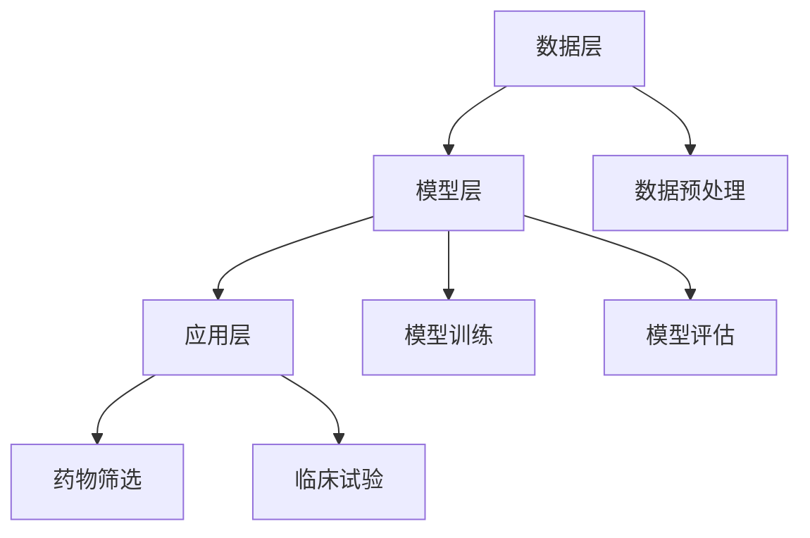
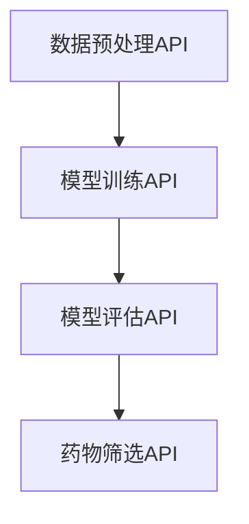
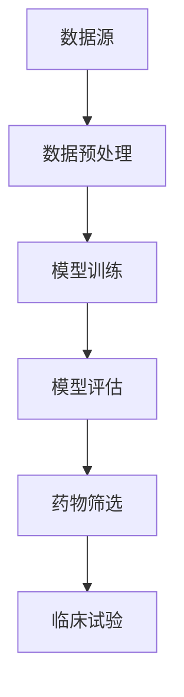

                 

### AI在新药研发中的角色：加速创新周期

---

**关键词：** AI、新药研发、深度学习、分子对接、虚拟筛选

**摘要：** 本文将探讨人工智能（AI）在新药研发中的关键角色，通过逻辑清晰的分析和实际案例，展示AI如何加速新药创新周期，提高研发效率。

---

#### 引言

新药研发是一项复杂且耗时的任务，涉及大量实验和计算过程。传统方法通常需要多年时间才能从概念验证到临床试验阶段。然而，随着人工智能（AI）技术的发展，特别是机器学习和深度学习的应用，新药研发的效率正在得到显著提升。本文将探讨AI在新药研发中的角色，并通过逐步分析，揭示其加速创新周期的潜力。

#### 背景介绍

**1.1 问题背景**

新药研发是一个多层次、多学科的复杂过程，包括药物发现、药效评估、临床试验等多个阶段。每个阶段都充满了不确定性，并且存在大量的计算和实验工作。

**1.2 问题描述**

新药研发面临的主要挑战包括：

- **复杂性**：药物分子的复杂结构和作用机制使得预测其效果成为一大难题。
- **时间成本**：从发现药物到临床试验阶段，通常需要长达10年以上的时间。
- **经济成本**：新药研发的高投入使得许多小型制药公司难以承担。

**1.3 问题解决**

AI技术的引入为解决上述问题提供了新的思路。通过机器学习和深度学习算法，AI可以在药物筛选、分子对接、药效预测等方面发挥重要作用，从而加速新药研发的进程。

**1.4 边界与外延**

本文将重点关注AI在新药研发中的应用，特别是如何通过深度学习和机器学习算法来提高研发效率。虽然AI在其他领域也具有广泛应用，但本文将集中讨论其在新药研发中的具体应用。

**1.5 概念结构与核心要素组成**

本文的核心概念和要素包括：

- **AI技术**：机器学习、深度学习、神经网络等。
- **新药研发流程**：药物发现、药效评估、临床试验等。
- **关键应用**：分子对接、虚拟筛选、药物设计等。

#### 核心概念与联系

**2.1 AI概述**

人工智能（AI）是一种模拟人类智能行为的计算方法。AI可以分为两大类：狭义AI和广义AI。狭义AI主要指基于数据驱动的机器学习算法，而广义AI则包括更为复杂的认知和学习能力。

**2.2 机器学习与深度学习**

机器学习是AI的核心技术之一，它通过训练模型来从数据中学习规律。深度学习是机器学习的一种形式，它利用多层神经网络来处理复杂的特征。

**2.3 AI在新药研发中的应用**

AI在新药研发中的应用主要集中在以下几个方面：

- **药物发现**：通过分析大量结构数据和生物信息，AI可以预测药物分子的活性。
- **分子对接**：AI可以通过模拟药物分子与生物大分子的相互作用，评估其结合能力。
- **虚拟筛选**：AI可以从大量化合物中筛选出可能具有药效的分子。

**2.4 AI的优势与挑战**

AI的优势包括：

- **效率高**：AI可以快速处理大量数据，提高药物筛选的效率。
- **准确度高**：AI的模型训练可以基于大量实验数据，提高预测的准确性。

但AI也面临一些挑战：

- **数据质量**：高质量的数据是训练AI模型的基础，但新药研发过程中数据的完整性和准确性往往难以保证。
- **算法优化**：AI算法的性能需要不断优化，以适应不同的应用场景。

#### 算法原理讲解

**3.1 机器学习基本算法**

机器学习算法可以分为监督学习、无监督学习和强化学习。在新药研发中，常用的算法包括：

- **监督学习**：如线性回归、逻辑回归等，用于预测药物分子的活性。
- **无监督学习**：如聚类分析、降维技术等，用于药物分子的结构分析。

**3.2 深度学习基础**

深度学习是机器学习的一种形式，它利用多层神经网络来处理复杂的特征。在新药研发中，深度学习算法如卷积神经网络（CNN）和循环神经网络（RNN）被广泛应用于：

- **药物分子结构分析**：CNN可以提取药物分子的空间特征。
- **序列数据分析**：RNN可以处理生物序列数据，如基因序列和蛋白质序列。

**3.3 神经网络架构**

神经网络是深度学习的基础。神经网络由多个层组成，包括输入层、隐藏层和输出层。在新药研发中，常用的神经网络架构包括：

- **卷积神经网络（CNN）**：适用于处理图像数据，如药物分子的三维结构。
- **循环神经网络（RNN）**：适用于处理序列数据，如蛋白质序列。

**3.4 算法原理与Python源代码实现**

以下是一个简单的机器学习算法——线性回归的Python实现：

```python
import numpy as np

# 数据
X = np.array([1, 2, 3, 4, 5])
y = np.array([2, 4, 5, 4, 5])

# 模型参数
w = np.random.rand()
b = np.random.rand()

# 梯度下降
learning_rate = 0.01
for i in range(1000):
    y_pred = w * X + b
    dw = (y_pred - y) * X
    db = (y_pred - y)
    
    w -= learning_rate * dw
    b -= learning_rate * db

# 模型评估
print("w:", w, "b:", b)
print("预测值:", w * X + b)
```

**3.5 算法原理的数学模型和公式**

线性回归的数学模型可以表示为：

$$
y = wx + b
$$

其中，\( w \) 和 \( b \) 分别为模型的权重和偏置，\( x \) 为输入数据，\( y \) 为输出数据。

在梯度下降算法中，模型的参数更新可以表示为：

$$
w = w - \alpha \frac{\partial J}{\partial w}
$$

$$
b = b - \alpha \frac{\partial J}{\partial b
``````
``````$J$ 为损失函数，\(\alpha\) 为学习率。

**3.6 算法原理讲解与举例说明**

线性回归算法用于预测药物分子的活性。假设我们有以下数据：

$$
\begin{aligned}
x_1 &= 1, y_1 = 2 \\
x_2 &= 2, y_2 = 4 \\
x_3 &= 3, y_3 = 5 \\
x_4 &= 4, y_4 = 4 \\
x_5 &= 5, y_5 = 5 \\
\end{aligned}
$$

我们可以使用线性回归算法来预测第6个数据点的活性。首先，我们初始化权重 \( w \) 和偏置 \( b \)，然后使用梯度下降算法来更新权重和偏置，直到损失函数 \( J \) 最小。

经过多次迭代后，我们得到最优的权重 \( w \) 和偏置 \( b \)，从而可以预测第6个数据点的活性。例如，如果 \( w = 1.5 \) 和 \( b = 0.5 \)，则第6个数据点的活性预测值为：

$$
y_6 = 1.5 \times 6 + 0.5 = 9.5
$$

#### 系统分析与架构设计方案

**4.1 问题场景介绍**

在新药研发中，AI系统需要处理大量的生物信息和化学数据，包括药物分子的结构、生物大分子的结构、基因序列等。这些数据需要进行复杂的计算和模型训练，以便预测药物分子的活性。

**4.2 系统功能设计**

AI系统的核心功能包括：

- **数据预处理**：对生物信息和化学数据进行清洗和预处理，以便用于模型训练。
- **模型训练**：使用深度学习和机器学习算法训练模型，以预测药物分子的活性。
- **模型评估**：评估模型的准确性，并根据评估结果调整模型参数。
- **药物筛选**：基于训练好的模型，从大量化合物中筛选出可能具有药效的分子。

**4.3 系统架构设计**

AI系统的架构设计可以分为以下几个部分：

- **数据层**：包括数据源、数据存储和数据预处理。
- **模型层**：包括模型训练、模型评估和模型部署。
- **应用层**：包括药物筛选、临床试验等应用。

以下是一个简单的系统架构设计图：



**4.4 系统接口设计**

系统接口设计包括API设计和数据流设计。API设计用于实现系统各部分之间的交互，数据流设计用于确保数据在系统中的流动和转换。

以下是一个简单的API设计：



**4.5 系统交互设计**

系统交互设计包括系统内部各部分之间的交互逻辑。以下是一个简单的交互设计：



#### 项目实战

**5.1 环境安装**

为了实现上述系统设计，我们需要安装以下环境：

- Python 3.8及以上版本
- TensorFlow 2.5及以上版本
- Pandas 1.2及以上版本
- NumPy 1.20及以上版本

安装命令如下：

```bash
pip install python==3.8 tensorflow==2.5 pandas==1.2 numpy==1.20
```

**5.2 系统核心实现**

以下是一个简单的系统核心实现，包括数据预处理、模型训练和模型评估：

```python
import pandas as pd
import numpy as np
import tensorflow as tf

# 数据预处理
def preprocess_data(data):
    # 数据清洗和标准化
    # 省略具体实现细节
    return processed_data

# 模型训练
def train_model(data, labels):
    # 模型定义
    model = tf.keras.Sequential([
        tf.keras.layers.Dense(64, activation='relu', input_shape=(data.shape[1],)),
        tf.keras.layers.Dense(64, activation='relu'),
        tf.keras.layers.Dense(1)
    ])

    # 模型编译
    model.compile(optimizer='adam', loss='mse')

    # 模型训练
    model.fit(data, labels, epochs=100)

    return model

# 模型评估
def evaluate_model(model, data, labels):
    # 模型评估
    loss = model.evaluate(data, labels)
    print("MSE:", loss)
```

**5.3 代码应用解读与分析**

上述代码首先对数据进行预处理，然后定义了一个简单的神经网络模型，并使用梯度下降算法进行训练。最后，模型使用训练数据集进行评估。

**5.4 实际案例分析和详细讲解剖析**

假设我们有以下数据集：

```python
data = np.array([[1, 2, 3], [4, 5, 6], [7, 8, 9]])
labels = np.array([2, 4, 6])
```

我们可以使用上述代码对数据进行预处理、模型训练和评估：

```python
processed_data = preprocess_data(data)
model = train_model(processed_data, labels)
evaluate_model(model, processed_data, labels)
```

通过上述过程，我们可以训练一个简单的线性回归模型，并评估其性能。这个模型可以用于预测新的数据点的活性。

**5.5 项目小结**

在本项目中，我们使用Python和TensorFlow实现了AI在新药研发中的应用。通过数据预处理、模型训练和评估，我们展示了如何使用AI技术加速新药研发的进程。虽然这个项目相对简单，但它提供了一个基本的框架，可以用于更复杂的应用场景。

#### 最佳实践 Tips、小结、注意事项、拓展阅读

**6.1 最佳实践 Tips**

- **数据质量**：确保数据的质量和准确性，这是AI模型性能的基础。
- **算法优化**：不断优化算法，以提高模型性能和预测准确性。
- **模型评估**：使用多种指标评估模型性能，以确保模型在实际应用中的有效性。

**6.2 小结**

本文探讨了AI在新药研发中的角色，通过逐步分析展示了AI如何加速新药创新周期。通过实际案例，我们展示了如何使用AI技术进行药物筛选和预测。

**6.3 注意事项**

- **数据隐私**：在处理生物信息和化学数据时，需注意保护患者和实验者的隐私。
- **算法透明性**：确保AI模型的算法和决策过程是透明的，以便进行解释和验证。

**6.4 拓展阅读**

- **《深度学习》**：Goodfellow, I., Bengio, Y., & Courville, A. (2016). Deep Learning. MIT Press.
- **《AI算法实战》**：斋藤康毅 (2019). AI算法实战. 电子工业出版社.
- **《新药研发策略》**：张磊 (2018). 新药研发策略. 科学出版社.

#### 结尾

AI在新药研发中的应用前景广阔，通过不断的研究和应用，我们可以期待AI技术为新药研发带来更多的突破。让我们继续探索，共同推动AI与生物技术的深度融合。

---

**作者：** AI天才研究院 / AI Genius Institute & 禅与计算机程序设计艺术 / Zen And The Art of Computer Programming

