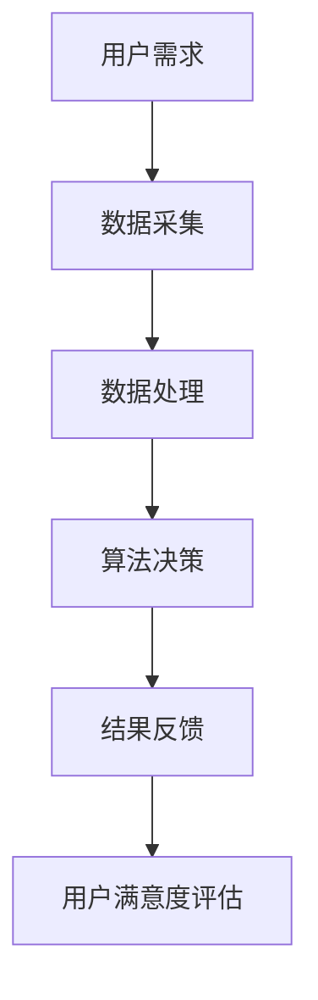
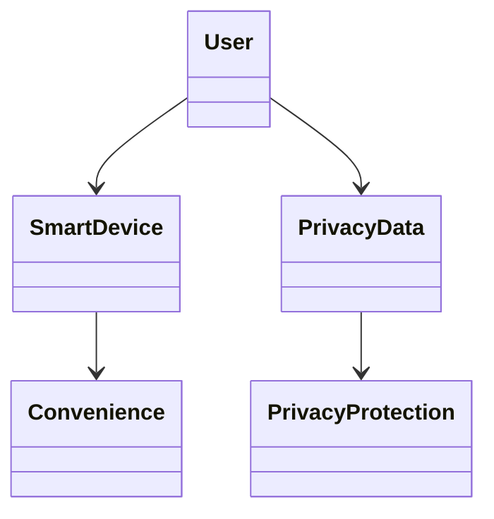
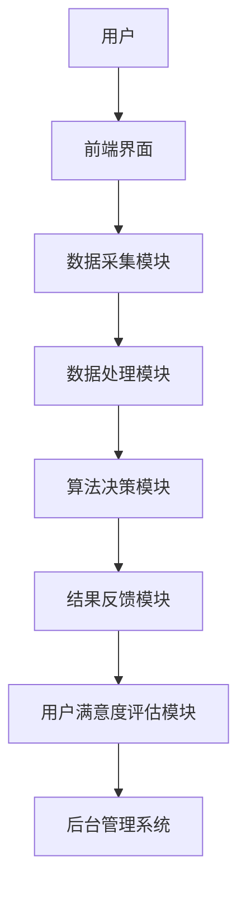
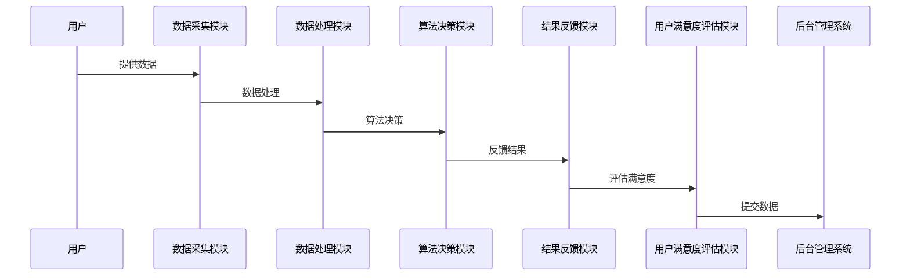

                 


# AI在智能家居中的应用：便利与隐私的平衡

## 关键词

- 智能家居
- 人工智能
- 隐私保护
- 便利性
- 算法原理

## 摘要

随着人工智能技术的迅猛发展，智能家居已经成为现代家庭生活的重要组成部分。然而，AI在智能家居中的应用不仅带来了极大的便利，同时也引发了用户隐私保护的担忧。本文将深入探讨AI在智能家居中的应用，分析便利与隐私之间的平衡问题，并提出解决方案，以期为智能家居的发展提供有益的参考。

### 第一部分：背景介绍

## 第1章：问题背景与核心概念

### 1.1 问题背景

### 1.1.1 智能家居发展的必然趋势

智能家居作为现代家庭生活的重要组成部分，已经成为行业发展的热点。随着人工智能技术的不断进步，AI在智能家居中的应用越来越广泛，极大地提高了生活的便利性。从智能门锁、智能灯光到智能音响，智能家居设备正在逐步改变我们的生活方式。

### 1.1.2 便利与隐私的平衡

然而，AI在智能家居中的应用也带来了隐私问题。智能家居设备在为用户提供便利的同时，也在不断地收集用户的个人信息，如生活习惯、行为模式等。这些数据的收集和使用，如果得不到妥善的管理和保护，就可能对用户的隐私造成侵犯。

### 1.2 核心概念

#### 1.2.1 AI与智能家居

AI，即人工智能，是指通过计算机程序模拟人类智能的一种技术。智能家居，是指利用AI技术构建的家庭环境，通过智能设备实现家庭自动化。

#### 1.2.2 智能家居的应用

智能家居的应用涵盖了家庭安全的监控、家电的自动控制、环境质量的检测等多个方面，极大地提升了家庭生活的品质。

## 第2章：核心概念与联系

### 2.1 核心概念原理

#### 2.1.1 便利性

便利性是指智能家居系统通过AI技术，使得家庭设备能够自动、高效地完成各种任务，提升用户的生活品质。

#### 2.1.2 隐私保护

隐私保护是指智能家居系统在运行过程中，对用户个人隐私数据进行严格的保护，确保用户隐私不被泄露。

### 2.2 概念属性特征对比表格

| 概念      | 属性特征                                                   | 对比                      |
| --------- | -------------------------------------------------------- | ------------------------ |
| 便利性    | 高效、自动、舒适                                         | 与隐私保护相互关联、互为补充 |
| 隐私保护  | 严格、安全、保密                                         | 与便利性存在平衡关系      |

### 2.3 ER实体关系图架构

```mermaid
erDiagram
    用户 ||--|{ 智能家居设备 }||>
    用户 ||--|{ 个人隐私数据 }||>
    智能家居设备 ||--|{ 便利性 }||>
    个人隐私数据 ||--|{ 隐私保护 }||>
```

### 第二部分：算法原理讲解

## 第3章：智能家居的算法原理

### 3.1 算法mermaid流程图



### 3.2 Python源代码

```python
# 导入所需库
import numpy as np

# 数据预处理
def preprocess_data(data):
    # 数据清洗和标准化处理
    return processed_data

# 算法核心
def algorithm_core(processed_data):
    # 基于AI算法处理数据
    return result

# 结果反馈
def result_feedback(result):
    # 根据结果反馈用户
    return user_satisfaction

# 用户满意度评估
def user_satisfaction评估(user_satisfaction):
    # 评估用户满意度
    return evaluation
```

### 3.3 算法原理详细讲解

#### 3.3.1 数据采集

数据采集是智能家居算法的第一步，通过传感器等设备，收集用户的日常生活数据，如行为、环境等。

#### 3.3.2 数据处理

数据处理包括数据清洗和标准化处理，目的是提高数据的准确性和可用性。

#### 3.3.3 算法决策

基于处理后的数据，AI算法会进行决策，以实现家庭设备的自动控制，提升用户的便利性。

### 第三部分：系统分析与架构设计方案

## 第4章：系统分析与架构设计方案

### 4.1 问题场景介绍

随着智能家居的普及，用户对于系统安全性和隐私保护的要求越来越高。本系统旨在通过AI技术，实现智能家居设备的高效管理和安全使用。

### 4.2 项目介绍

项目名称：智能家居隐私保护系统
项目目的：通过AI技术，实现智能家居设备的安全使用和隐私保护。

### 4.3 系统功能设计

#### 4.3.1 领域模型mermaid类图



### 4.4 系统架构设计

#### 4.4.1 mermaid架构图



### 4.5 系统接口设计和系统交互

#### 4.5.1 mermaid序列图



### 第四部分：项目实战

## 第5章：项目实战

### 5.1 环境安装

在本节中，我们将介绍如何在本地环境上安装和配置智能家居隐私保护系统。

### 5.2 系统核心实现源代码

在本节中，我们将提供系统核心实现的源代码，并对其进行详细解读。

```python
# 数据采集模块
def data_collection():
    # 采集用户数据
    pass

# 数据处理模块
def data_processing(data):
    # 处理用户数据
    pass

# 算法决策模块
def algorithm_decision(processed_data):
    # 基于处理后的数据进行决策
    pass

# 结果反馈模块
def result_feedback(result):
    # 反馈用户结果
    pass

# 用户满意度评估模块
def user_satisfaction_evaluation(user_satisfaction):
    # 评估用户满意度
    pass
```

### 5.3 代码应用解读与分析

在本节中，我们将对系统核心实现源代码进行解读和分析，以帮助读者更好地理解系统的运作原理。

### 5.4 实际案例分析和详细讲解剖析

在本节中，我们将通过实际案例，对智能家居隐私保护系统进行详细讲解和分析，以帮助读者更好地了解系统的应用场景和效果。

### 5.5 项目小结

在本节中，我们将对本章内容进行小结，并总结项目的主要成果和收获。

### 第五部分：最佳实践 tips、小结、注意事项、拓展阅读

## 第6章：最佳实践 tips、小结、注意事项、拓展阅读

### 6.1 最佳实践 tips

在本节中，我们将分享一些最佳实践技巧，以帮助用户更好地使用智能家居隐私保护系统。

### 6.2 小结

在本节中，我们将对本章内容进行小结，并回顾主要讨论的内容。

### 6.3 注意事项

在本节中，我们将提醒用户在使用智能家居隐私保护系统时需要注意的事项。

### 6.4 拓展阅读

在本节中，我们将推荐一些相关的拓展阅读资料，以帮助读者深入了解智能家居和隐私保护的相关知识。

## 作者信息

作者：AI天才研究院/AI Genius Institute & 禅与计算机程序设计艺术 /Zen And The Art of Computer Programming

