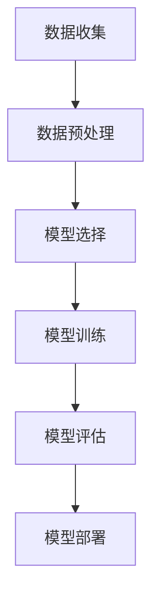
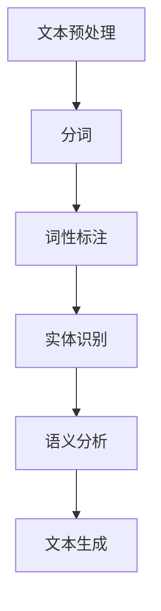
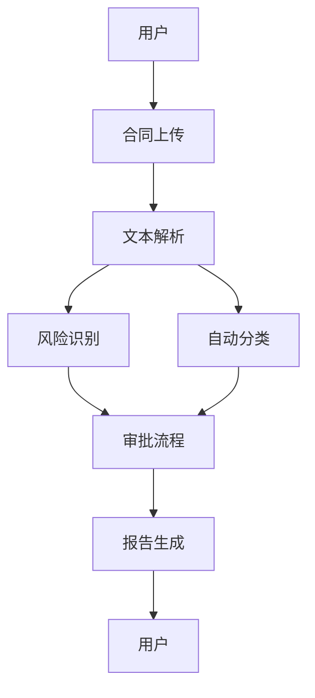

                 

## 文章标题：AI在法律服务中的应用：效率与公平的权衡

> 关键词：AI，法律服务，效率，公平，自动化合同审查，智能客服，案件预测与分析，算法原理

> 摘要：本文探讨了AI在法律服务中的应用，分析了其如何提高工作效率的同时确保公平性。通过具体实例和算法讲解，提出了平衡效率与公平的解决方案。

### 第一部分：背景介绍与核心概念

#### 1.1 问题背景与描述

##### 1.1.1 法律服务现状

在当前的法律服务体系中，大部分的工作仍然依赖于人工处理。律师和法务人员需要花费大量的时间和精力来处理合同审查、案件分析、法律文件生成等工作。这种人工服务方式不仅效率低下，而且成本高昂。此外，由于重复劳动和错误率的存在，法律服务质量和用户体验也存在一定的局限性。

##### 1.1.2 AI在法律服务中的潜在优势

AI技术的发展为法律服务提供了新的解决方案。首先，AI能够自动化处理大量的合同审查工作，提高工作效率。其次，通过智能客服系统，AI可以提供24/7的法律咨询，提升用户体验。此外，AI还能够通过数据分析和机器学习技术，预测案件结果和提供法律建议，进一步优化法律服务。

##### 1.1.3 效率与公平的权衡

然而，AI在法律服务中的应用也带来了一定的挑战，即效率与公平的权衡问题。AI可以提高工作效率，但如何确保法律服务的公平性是一个关键问题。特别是在自动化合同审查和案件预测中，AI的决策过程可能缺乏透明度，导致不公平现象的出现。

##### 1.1.4 问题解决

为了解决上述问题，本文将详细探讨AI在法律服务中的应用，包括自动化合同审查、智能客服、案件预测与分析、法律文档生成与整理等方面。同时，将分析如何通过算法设计和系统架构设计来平衡效率与公平。

##### 1.1.5 边界与外延

本文将主要关注AI在法律服务中的应用场景，包括但不限于合同审查、法律咨询、案件分析等领域。同时，将探讨AI在提升效率的同时如何确保公平性，以及其他相关因素。

##### 1.1.6 概念结构与核心要素组成

本文的核心概念包括AI、法律服务、效率、公平等。这些概念相互联系，构成了法律服务的核心要素。AI在提升效率的同时，需要确保法律服务的公平性，这是本文的核心研究内容。

### 1.2 核心概念与联系

##### 1.2.1 AI的定义与特点

AI，即人工智能，是一种模拟人类智能的技术。它通过算法和模型，使计算机能够自主地学习和决策。AI的特点包括自主学习、自适应性和泛化能力。

##### 1.2.2 法律服务的定义与特点

法律服务是指律师和法务人员为当事人提供的专业服务，包括合同审查、案件分析、法律咨询等。法律服务的特点包括复杂性、专业性和规范性。

##### 1.2.3 效率与公平的权衡

效率是指完成某项任务的速度和质量。公平是指在服务过程中对所有当事人的平等对待。在AI应用于法律服务时，需要平衡效率与公平，确保AI的决策过程透明、公正。

### 1.3 AI在法律服务中的应用范围

AI在法律服务中的应用范围广泛，包括但不限于合同审查、智能客服、案件预测与分析、法律文档生成与整理等。这些应用场景不仅能够提高工作效率，还能够提升用户体验和决策质量。

### 1.4 概念结构与核心要素组成

在本节中，我们详细阐述了AI、法律服务、效率、公平等核心概念，并分析了它们在本文中的关系和作用。这些概念构成了法律服务的核心要素，是本文研究的理论基础。

### 总结

本部分介绍了法律服务的现状、AI在法律服务中的潜在优势、效率与公平的权衡问题，以及AI在法律服务中的应用范围和核心概念。接下来，我们将进一步探讨AI在具体法律服务中的应用，以及如何平衡效率与公平。

# 第一部分：背景介绍与核心概念

## 1.1 问题背景与描述

### 1.1.1 法律服务现状

在现代社会，法律服务扮演着至关重要的角色。无论是个人还是企业，都离不开法律的支持。然而，当前的法律服务体系仍然面临一些严峻的问题。

首先，法律服务的效率低下是一个普遍存在的问题。传统上，律师和法务人员需要花费大量的时间和精力来处理合同审查、案件分析、法律文件生成等工作。这种人工服务方式不仅耗时耗力，而且容易出现错误，影响法律服务的质量。

其次，法律服务的成本高昂。随着法律服务需求的增加，律师和法务人员的薪酬也在不断上涨。这导致了法律服务的价格居高不下，让许多个人和企业难以承担。

此外，重复劳动也是一个问题。许多法律文件和合同都具有相似的结构和内容，律师和法务人员需要反复审查和处理。这种重复劳动不仅浪费人力资源，还降低了工作效率。

### 1.1.2 AI在法律服务中的潜在优势

人工智能（AI）技术的发展为法律服务提供了新的解决方案。AI具有以下几个显著的优势：

首先，AI能够自动化处理大量的合同审查工作。通过训练机器学习模型，AI可以快速识别合同中的关键条款和风险点，提高审查效率。这意味着律师和法务人员可以节省大量的时间，将精力集中在更复杂和有价值的法律事务上。

其次，AI可以提供24/7的法律咨询服务。智能客服系统利用自然语言处理技术，能够实时回答客户的问题，提供即时的法律帮助。这不仅提升了用户体验，还降低了企业的运营成本。

此外，AI还可以通过数据分析和机器学习技术，预测案件结果和提供法律建议。通过对大量历史案件数据的分析，AI可以识别出案件的关键因素，为律师提供有针对性的建议，提高决策质量。

### 1.1.3 效率与公平的权衡

然而，AI在法律服务中的应用也带来了一定的挑战，即效率与公平的权衡问题。AI可以提高工作效率，但如何确保法律服务的公平性是一个关键问题。

首先，AI在自动化合同审查和案件预测中，可能会面临透明度不足的问题。AI的决策过程通常是基于大量数据和复杂的算法，对于普通用户来说难以理解。这可能导致决策过程缺乏透明度，从而引发公平性的质疑。

其次，AI在处理法律事务时，可能会因为算法偏见而造成不公平。如果训练数据存在偏差，AI可能会对某些群体或特定情况产生偏见，导致不公平的法律决策。

此外，AI在法律服务中的应用也可能导致人力资源的流失。随着AI的普及，一些律师和法务人员可能会失去工作，从而引发就业问题。

### 1.1.4 问题解决

为了解决上述问题，我们需要在AI在法律服务中的应用过程中，采取一系列措施来平衡效率与公平。

首先，我们需要提高AI决策过程的透明度。通过使用可解释的人工智能技术，使得AI的决策过程更加透明，用户可以清晰地了解AI的决策依据。

其次，我们需要确保AI的训练数据公平性。在训练AI模型时，要确保数据来源的多样性和代表性，避免算法偏见。

此外，我们还需要为失业的律师和法务人员提供再培训和就业机会。通过培训他们掌握新的技能，使他们能够适应AI时代的需求。

### 1.1.5 边界与外延

AI在法律服务中的应用范围广泛，包括但不限于合同审查、智能客服、案件预测与分析、法律文档生成与整理等领域。然而，我们也需要明确AI的应用边界，避免过度依赖AI导致法律服务的失控。

首先，AI不能完全取代律师和法务人员的工作。虽然AI可以自动化处理一些重复性工作，但复杂的法律事务仍然需要人类的专业判断。

其次，AI不能解决所有法律问题。法律问题往往涉及伦理、道德和社会价值观，这些问题需要人类来决策。

### 1.1.6 概念结构与核心要素组成

在本节中，我们介绍了法律服务的现状、AI在法律服务中的潜在优势、效率与公平的权衡问题，以及AI在法律服务中的应用范围和核心概念。这些概念相互关联，构成了法律服务的核心要素。

首先，法律服务是本文的核心研究对象，它涵盖了合同审查、案件分析、法律咨询等多个方面。其次，AI作为解决方案，具有自动化、智能化、高效化等特点。最后，效率和公平是我们在AI应用过程中需要平衡的核心要素。

通过本节的介绍，我们为后续章节的深入探讨奠定了基础。在接下来的部分，我们将进一步探讨AI在具体法律服务中的应用，以及如何平衡效率与公平。

## 1.2 核心概念与联系

### 1.2.1 AI的定义与特点

人工智能（AI，Artificial Intelligence）是一种通过计算机模拟人类智能的技术。它涉及机器学习、深度学习、自然语言处理等多个领域。AI的特点包括：

1. **自主学习能力**：AI可以通过机器学习算法，从数据中自动学习并改进自身性能。
2. **自适应能力**：AI可以根据环境和任务的变化，自适应地调整其行为和决策。
3. **泛化能力**：AI可以将其在特定任务上学到的知识应用到其他相关任务中。

### 1.2.2 法律服务的定义与特点

法律服务是指律师和法务人员为个人、企业和其他组织提供法律咨询、法律文件起草、合同审查、案件代理等服务。法律服务的特点包括：

1. **专业性**：法律服务需要具备深厚的法律知识和实践经验。
2. **规范性**：法律服务需要遵守法律法规和职业道德规范。
3. **复杂性**：法律问题往往涉及多个法律领域，需要综合分析和判断。

### 1.2.3 效率与公平的权衡

在AI应用于法律服务的过程中，效率与公平是一个重要的权衡点。效率是指完成工作的时间和质量，而公平则是指对所有当事人的平等对待。

1. **提高效率**：AI可以通过自动化处理合同审查、法律文件生成等工作，提高工作效率。例如，AI可以在短时间内完成数百份合同的审查，而人工审查可能需要数天。
2. **确保公平**：AI在处理法律事务时，可能会因为数据偏见或算法问题导致不公平。因此，我们需要确保AI的训练数据公平，并且对AI的决策过程进行透明化，以保障公平性。

### 1.2.4 AI与法律服务的结合

AI与法律服务的结合主要体现在以下几个方面：

1. **自动化合同审查**：AI可以通过自然语言处理技术，自动化地审查合同条款，识别潜在的法律风险。
2. **智能客服**：AI可以提供24/7的法律咨询服务，回答客户的常见法律问题。
3. **案件预测与分析**：AI可以通过分析历史案件数据，预测案件结果，为律师提供决策支持。
4. **法律文档生成与整理**：AI可以自动生成法律文件，整理法律案例，提高工作效率。

### 1.2.5 概念联系图

为了更好地理解AI、法律服务、效率与公平之间的关系，我们可以绘制一个概念联系图：

```
      +----------------+            +----------------+
      |     AI         |            |    法律服务    |
      +----------------+            +----------------+
          |                      |
          |                      |
          |                      |
      +----------------+            +----------------+
      |   效率与公平   |            |   应用案例     |
      +----------------+            +----------------+
          |                      |
          |                      |
          |                      |
      +----------------+            +----------------+
      |  自动化合同    |            |   智能客服     |
      | 审查、案件预   |            |  法律文档生成  |
      | 测与分析、法   |            | 与整理         |
      | 律文档生成与   |            |                |
      | 整理           |            |                |
      +----------------+            +----------------+
```

### 总结

在本节中，我们详细介绍了AI、法律服务、效率与公平等核心概念，并分析了它们之间的关系。AI在法律服务中的应用，既能提高效率，又需要确保公平。通过理解这些核心概念，我们可以更好地探讨AI在法律服务中的具体应用，以及如何平衡效率与公平。

## 1.3 AI在法律服务中的应用范围

人工智能（AI）在法律服务中的应用正在不断扩展，其范围涵盖多个领域，包括但不限于合同审查、智能客服、案件预测与分析、法律文档生成与整理等。以下是AI在这些领域的具体应用：

### 1.3.1 自动化合同审查

自动化合同审查是AI在法律服务中应用的一个重要领域。通过自然语言处理（NLP）技术，AI可以读取和理解合同文本中的关键条款和条件。例如，使用深度学习模型，AI可以自动识别合同中的潜在风险点，如免责条款、违约责任等。这不仅提高了审查效率，还减少了人工审查中的错误率。

**优势**：

- **提高效率**：AI可以在短时间内处理大量合同，大幅减少人工审查所需的时间。
- **降低错误率**：AI通过自动化处理，减少了人工审查中的疏漏和错误。

**挑战**：

- **透明度不足**：AI的决策过程可能不够透明，用户难以理解AI的审查标准和决策依据。
- **法律风险**：自动化合同审查可能遗漏某些法律问题，导致合同条款的不完善。

### 1.3.2 智能客服

智能客服系统利用AI技术，可以提供24/7的法律咨询服务。通过自然语言处理和对话生成技术，智能客服可以回答客户的常见法律问题，如合同咨询、法律纠纷等。这不仅提高了用户体验，还降低了企业的运营成本。

**优势**：

- **全天候服务**：智能客服可以随时回答客户的问题，无需人工干预。
- **提高响应速度**：智能客服可以快速处理客户请求，提高服务效率。
- **降低成本**：智能客服减少了人工客服的需求，降低了企业的运营成本。

**挑战**：

- **服务质量**：智能客服可能无法处理复杂或特殊情况的法律问题。
- **用户体验**：虽然智能客服可以提供快速回答，但用户可能对AI的回答满意度不高。

### 1.3.3 案件预测与分析

通过数据分析和机器学习技术，AI可以预测案件结果和分析法律案例。AI可以分析大量历史案件数据，识别出影响案件结果的关键因素，为律师提供有针对性的法律建议。

**优势**：

- **提高决策质量**：AI可以提供基于数据的案件预测和分析，帮助律师做出更明智的决策。
- **提高工作效率**：AI可以自动化处理大量的案件数据，节省律师的时间。

**挑战**：

- **数据质量**：AI的预测和分析依赖于高质量的数据，数据质量问题可能影响预测准确性。
- **模型偏见**：如果训练数据存在偏差，AI的预测结果可能存在偏见。

### 1.3.4 法律文档生成与整理

AI可以自动生成法律文件，如合同、诉状等，并根据需要进行调整和修改。此外，AI还可以整理大量法律文档，提取关键信息，方便律师和法务人员查阅。

**优势**：

- **提高效率**：AI可以自动化地生成和整理法律文件，减少人工工作。
- **减少错误**：AI可以减少人工操作中的错误，提高法律文件的准确性。

**挑战**：

- **文本理解**：AI需要深入理解法律文本，否则可能无法生成准确的法律文件。
- **法律风险**：AI生成的法律文件需要经过人工审核，以确保符合法律规定。

### 总结

AI在法律服务中的应用范围广泛，从自动化合同审查到智能客服，再到案件预测与分析、法律文档生成与整理，AI在每个领域都展现出了显著的优势。然而，同时也要认识到这些应用带来的挑战，如透明度不足、数据质量问题和法律风险等。通过不断改进AI技术，我们可以更好地平衡效率与公平，提升法律服务的质量和用户体验。

## 1.4 概念结构与核心要素组成

### 1.4.1 概念结构

在本文中，我们主要探讨了人工智能（AI）在法律服务中的应用，以及如何平衡效率与公平。这些概念相互关联，构成了法律服务的核心要素。以下是这些概念之间的结构关系：

1. **AI**：作为核心技术，AI在法律服务的各个领域发挥着重要作用。它通过机器学习、自然语言处理等技术，提高了法律服务的效率和质量。
2. **法律服务**：是本文的研究对象，涵盖了合同审查、案件分析、法律咨询等多个方面。AI的应用旨在优化和提升这些服务。
3. **效率与公平**：是我们在AI应用过程中需要权衡的两个关键要素。效率体现在通过AI提高法律服务的工作效率，而公平则体现在确保法律服务的公正性和透明度。

### 1.4.2 核心要素组成

以下是本文的核心要素组成，它们共同构成了法律服务的核心要素：

1. **AI技术**：包括机器学习、自然语言处理、深度学习等。这些技术是AI在法律服务中的应用基础。
2. **法律知识库**：是AI进行法律分析和决策的基础。它包括法律法规、法律案例、法律术语等。
3. **数据处理能力**：是AI能够高效处理大量法律文档和合同的关键。数据处理能力涉及到数据清洗、数据挖掘、数据存储等。
4. **法律伦理与规范**：是确保AI在法律服务中公平性和透明度的重要保障。法律伦理与规范包括职业道德、法律法规、行业标准等。
5. **用户界面**：是用户与AI系统进行交互的桥梁。良好的用户界面设计可以提高用户体验。

### 1.4.3 概念联系图

为了更好地理解这些概念之间的联系，我们可以绘制一个概念联系图：

```
        +----------------+              +----------------+
        |      AI        |              |     法律服务   |
        +----------------+              +----------------+
                |                      |
                |                      |
                |                      |
        +----------------+              +----------------+
        |   效率与公平   |              |  核心要素组成  |
        +----------------+              +----------------+
                |                      |
                |                      |
                |                      |
        +----------------+              +----------------+
        |    技术基础    |              |    法律知识库  |
        | (机器学习、NLP)|              +----------------+
        +----------------+                      |
                |                                      |
                |                                      |
                |                                      |
        +----------------+              +----------------+
        | 数据处理能力   |              | 法律伦理与规范 |
        +----------------+              +----------------+
                |                      |
                |                      |
                |                      |
        +----------------+              +----------------+
        |   用户界面     |              |     结论与展望   |
        +----------------+              +----------------+
```

### 总结

通过本节的讨论，我们明确了AI、法律服务、效率与公平等核心概念之间的结构关系，并分析了它们在法律服务中的应用和核心要素组成。这些概念和要素共同构成了本文研究的理论基础，为后续章节的深入探讨提供了指导。

# 第二部分：AI在法律服务中的应用

## 2.1 自动化合同审查

自动化合同审查是AI在法律服务中的一项重要应用。通过自然语言处理（NLP）和机器学习（ML）技术，AI能够自动分析合同内容，识别潜在的风险点和关键条款。以下是自动化合同审查的详细分析：

### 2.1.1 基本原理

自动化合同审查的基本原理包括以下几个步骤：

1. **文本预处理**：首先，对合同文本进行预处理，包括去除无关信息、分词、词性标注等。这一步骤的目的是将原始文本转化为计算机可以处理的格式。
   
2. **特征提取**：然后，从预处理后的文本中提取特征。这些特征可以是词频、词向量、句法结构等，用于后续的模型训练。

3. **模型训练**：使用机器学习算法，如支持向量机（SVM）、随机森林（Random Forest）或神经网络（Neural Networks），对提取的特征进行训练，以识别合同中的关键条款和风险点。

4. **风险识别**：通过训练好的模型，对新的合同文本进行风险识别。模型会自动标记出可能存在风险的条款，如免责条款、违约责任等。

5. **报告生成**：最后，系统会生成一份详细的审查报告，列出识别出的风险点和相关建议。

### 2.1.2 应用实例

一个实际的应用实例是某大型企业的合同管理平台。该平台利用AI技术，对每份合同进行自动化审查。以下是具体的应用过程：

1. **合同上传**：企业用户将合同文本上传到平台。

2. **文本预处理**：平台对合同文本进行预处理，去除格式化标记，进行分词和词性标注。

3. **特征提取**：平台使用预训练的词向量模型（如Word2Vec或BERT）提取文本特征。

4. **模型识别**：平台使用训练好的SVM模型对提取的特征进行风险识别。

5. **生成报告**：平台生成一份详细的审查报告，包括识别出的风险条款和相应建议。

6. **用户反馈**：用户可以查看报告，并对识别结果进行反馈。如果用户认为某些风险条款被误判，可以标记为错误，用于后续模型的优化。

### 2.1.3 效率与公平的权衡

在自动化合同审查中，效率与公平的权衡是一个关键问题。以下是具体分析：

1. **效率提升**：自动化合同审查显著提高了合同审查的效率。通过AI技术，平台可以在短时间内处理大量合同，减少了人工审查所需的时间。

2. **透明度问题**：然而，自动化审查的透明度是一个挑战。由于AI的决策过程是基于复杂的算法和大量数据，用户难以理解AI的审查标准和决策依据。这可能导致用户对审查结果的质疑。

3. **公平性保障**：为了保障公平性，平台采取了以下措施：

   - **数据多样性和代表性**：平台确保训练数据覆盖了各种类型的合同和条款，以减少算法偏见。
   - **用户反馈机制**：用户可以提供反馈，对AI的审查结果进行纠正，有助于模型不断优化。
   - **法律专家审核**：最终审查结果仍需经过法律专家的审核，以确保准确性。

### 总结

自动化合同审查是AI在法律服务中的一项重要应用。通过自然语言处理和机器学习技术，AI能够高效地识别合同中的关键条款和风险点，提高合同审查的效率。然而，透明度和公平性问题是自动化合同审查需要解决的问题。通过采取一系列措施，如数据多样性、用户反馈和法律专家审核，可以保障自动化合同审查的公平性。

## 2.2 智能客服

智能客服是AI在法律服务中的另一个重要应用。通过自然语言处理（NLP）和机器学习（ML）技术，智能客服系统能够模拟人类对话，提供24/7的法律咨询服务。以下是智能客服的具体分析：

### 2.2.1 基本原理

智能客服的基本原理包括以下几个步骤：

1. **文本预处理**：首先，对用户输入的文本进行预处理，包括分词、词性标注、去停用词等。这一步骤的目的是将原始文本转化为计算机可以处理的格式。

2. **意图识别**：然后，系统使用机器学习算法（如朴素贝叶斯、长短期记忆网络（LSTM）等）对预处理后的文本进行意图识别。意图识别的目的是理解用户的问题类型，如合同咨询、法律纠纷等。

3. **实体抽取**：在意图识别的基础上，系统进一步进行实体抽取，识别出用户问题中的关键信息，如合同名称、当事人等。

4. **回答生成**：根据识别出的意图和实体，系统使用预训练的模板或生成式模型（如Transformer、BERT等）生成回答。回答可以是文本、图片或音频等形式。

5. **回答优化**：最后，系统对生成的回答进行优化，确保回答的准确性和流畅性。

### 2.2.2 应用实例

一个实际的应用实例是某大型法律咨询公司的智能客服系统。该系统通过AI技术，为用户提供24/7的法律咨询服务。以下是具体的应用过程：

1. **用户咨询**：用户通过网站、手机APP或语音助手向智能客服系统提出法律咨询。

2. **文本预处理**：系统对用户输入的文本进行预处理，包括分词、词性标注、去停用词等。

3. **意图识别**：系统使用预训练的LSTM模型对预处理后的文本进行意图识别，识别出用户的问题类型。

4. **实体抽取**：系统进一步使用BERT模型对文本进行实体抽取，识别出用户问题中的关键信息。

5. **回答生成**：根据识别出的意图和实体，系统使用预训练的BERT模型生成回答。

6. **回答优化**：系统对生成的回答进行优化，确保回答的准确性和流畅性。

7. **用户反馈**：用户可以查看回答，如果对回答满意，可以结束对话。如果不满意，可以提供反馈，系统会记录这些反馈用于后续的模型优化。

### 2.2.3 效率与公平的权衡

在智能客服系统中，效率与公平的权衡是一个关键问题。以下是具体分析：

1. **效率提升**：智能客服系统可以24/7为用户提供法律咨询服务，显著提高了服务的响应速度和效率。

2. **服务质量**：虽然智能客服系统能够提供快速回答，但其服务质量可能不如专业律师。智能客服系统可能无法处理复杂或特殊情况的法律问题。

3. **公平性保障**：为了保障公平性，智能客服系统采取了以下措施：

   - **多模态交互**：智能客服系统支持文本、语音和图片等多种交互方式，以满足不同用户的需求。
   - **个性化服务**：系统根据用户的历史咨询记录和偏好，提供个性化的法律咨询服务。
   - **专业律师支持**：对于复杂或特殊情况的法律问题，用户可以转接到专业律师进行进一步咨询。

### 总结

智能客服是AI在法律服务中的重要应用。通过自然语言处理和机器学习技术，智能客服系统能够模拟人类对话，提供24/7的法律咨询服务。虽然智能客服系统在效率方面具有显著优势，但其服务质量可能不如专业律师。为了保障公平性，智能客服系统采取了多种措施，如多模态交互、个性化服务和专业律师支持。通过不断优化和改进，智能客服系统有望在法律服务中发挥更大的作用。

## 2.3 案件预测与分析

AI在案件预测与分析中的应用具有显著的优势。通过数据分析和机器学习技术，AI可以分析大量历史案件数据，预测案件结果并提供法律建议。以下是案件预测与分析的具体分析：

### 2.3.1 基本原理

案件预测与分析的基本原理包括以下几个步骤：

1. **数据收集与预处理**：首先，从法院、法律数据库等渠道收集大量历史案件数据。然后，对数据进行分析和清洗，去除重复、错误和不完整的数据，确保数据的质量和一致性。

2. **特征提取**：接着，从预处理后的数据中提取特征。这些特征可以是案件的基本信息（如案件类型、原告被告、诉讼请求等），也可以是案件的法律要素（如法律法规、合同条款、证据等）。

3. **模型训练**：使用机器学习算法（如决策树、支持向量机、神经网络等），对提取的特征进行训练。模型通过学习历史案件数据，学会预测案件结果。

4. **模型评估**：使用交叉验证等技术，评估模型的预测性能。常用的评估指标包括准确率、召回率、F1分数等。

5. **预测与建议**：将训练好的模型应用于新的案件数据，预测案件结果并提供法律建议。例如，预测案件可能的结果、建议采取的法律策略等。

### 2.3.2 应用实例

一个实际的应用实例是某法律科技公司开发的案件预测与分析系统。该系统通过AI技术，为律师和法务人员提供案件预测和分析服务。以下是具体的应用过程：

1. **案件数据输入**：律师或法务人员将案件的基本信息（如案件类型、原告被告、诉讼请求等）输入到系统中。

2. **数据预处理**：系统对输入的数据进行预处理，确保数据的质量和一致性。

3. **特征提取**：系统从预处理后的数据中提取特征，包括案件的基本信息和法律要素。

4. **模型训练**：系统使用训练好的神经网络模型，对提取的特征进行训练，以预测案件结果。

5. **模型评估**：系统使用交叉验证技术，评估模型的预测性能，确保预测结果的准确性和可靠性。

6. **预测与建议**：系统根据训练好的模型，预测案件可能的结果，并提供相应的法律建议。例如，预测案件可能判决结果、建议采取的法律策略等。

7. **用户反馈**：律师或法务人员可以对预测结果和建议进行反馈，系统会记录这些反馈，用于后续模型的优化。

### 2.3.3 效率与公平的权衡

在案件预测与分析中，效率与公平的权衡是一个关键问题。以下是具体分析：

1. **效率提升**：通过AI技术，案件预测与分析系统可以在短时间内处理大量案件数据，显著提高了案件分析和预测的效率。

2. **预测准确性**：虽然AI可以提高案件预测的准确性，但模型预测结果的准确性仍受限于训练数据的质量和模型的性能。

3. **公平性保障**：为了保障公平性，系统采取了以下措施：

   - **数据多样性和代表性**：系统确保训练数据覆盖了各种类型的案件和结果，以减少算法偏见。
   - **透明度**：系统提供详细的预测依据和算法解释，用户可以清晰地了解预测结果的来源和依据。
   - **法律专家审核**：对于重要或复杂的案件，系统建议由法律专家进行最终审核，以确保预测结果的准确性。

### 总结

AI在案件预测与分析中的应用具有显著的优势，可以提高案件分析和预测的效率。然而，预测准确性受限于训练数据的质量和模型的性能。为了保障公平性，系统采取了多种措施，如数据多样性和代表性、透明度和法律专家审核。通过不断优化和改进，AI在案件预测与分析中的应用将越来越广泛，为法律行业带来更多价值。

## 2.4 法律文档生成与整理

AI在法律文档生成与整理中的应用极大地提高了工作效率，同时也在一定程度上改变了传统法律文档的处理方式。以下是这一领域的详细分析：

### 2.4.1 基本原理

法律文档生成与整理的基本原理包括以下几个方面：

1. **文本分析**：首先，AI通过自然语言处理（NLP）技术对法律文档进行文本分析，识别文档的结构和内容。这一步骤包括分词、词性标注、命名实体识别等。

2. **模板匹配**：接着，AI使用预先定义的模板与法律文档内容进行匹配，生成符合法律规范和格式要求的文档。模板可以是固定的法律文本框架，也可以是根据特定案件或需求自定义的。

3. **内容填充**：在匹配模板后，AI将提取的法律文档内容填充到相应的模板字段中。这一步骤可能涉及复杂的语法和语义理解，以确保文档内容的准确性和一致性。

4. **文档格式化**：最后，AI将填充后的内容进行格式化，生成最终的电子文档或打印文档。格式化过程包括排版、字体设置、段落调整等。

### 2.4.2 应用实例

一个典型的应用实例是一个在线法律文档生成平台，它为用户提供自动生成法律合同、诉讼文书等服务。以下是具体的应用过程：

1. **用户需求分析**：用户通过平台提供的界面输入他们的需求，如合同类型、当事人信息、主要条款等。

2. **文本分析与模板匹配**：平台使用NLP技术分析用户输入的内容，并将其与预先定义的模板进行匹配。

3. **内容填充**：AI将用户输入的内容填充到匹配的模板字段中，生成初步的法律文档。

4. **文档格式化**：平台对初步生成的文档进行格式化，确保文档符合法律格式要求。

5. **用户审查与修改**：用户可以审查并修改生成的法律文档，确保所有内容准确无误。

6. **最终输出**：用户确认文档无误后，平台将文档输出为电子版或打印版。

### 2.4.3 效率与公平的权衡

在法律文档生成与整理中，效率与公平的权衡是一个重要问题。以下是具体分析：

1. **效率提升**：AI技术可以自动处理大量法律文档的生成和整理工作，显著提高了工作效率。用户无需手动编写或编辑文档，节省了大量时间。

2. **文档准确性**：虽然AI可以生成高质量的法律文档，但其准确性和合法性仍需人工审查和验证。特别是在涉及复杂法律条款和特殊案例时，AI生成的文档可能存在不准确或不符合法律要求的情况。

3. **公平性保障**：为了保障公平性，平台采取了以下措施：

   - **人工审查**：AI生成的文档需经过专业律师的审查和修改，确保文档的准确性和合法性。
   - **透明度**：平台提供详细的文档生成过程和算法解释，用户可以了解AI如何处理他们的需求。
   - **用户反馈**：用户可以提供反馈，帮助平台不断优化AI模型和文档生成流程。

### 总结

AI在法律文档生成与整理中的应用极大地提高了工作效率，同时也改变了传统法律文档的处理方式。尽管AI在生成文档方面具有显著优势，但其准确性和合法性仍需人工审查和验证。为了保障公平性，平台采取了多种措施，如人工审查、透明度和用户反馈。通过不断优化和改进，AI在法律文档生成与整理中的应用将越来越成熟，为法律行业带来更多便利。

### 3.1 机器学习算法在法律服务中的应用

机器学习（ML）算法在法律服务中的应用极大地提升了法律服务的效率和准确性。以下将详细探讨机器学习算法在法律服务中的应用，并通过Mermaid流程图和Python代码实例进行解释。

#### 3.1.1 基本原理

机器学习算法在法律服务中的应用主要包括以下几个步骤：

1. **数据收集**：首先，从法律案例、合同、法律文献等来源收集大量数据。
2. **数据预处理**：对收集的数据进行清洗、格式化和特征提取，确保数据质量。
3. **模型选择**：根据问题性质选择合适的机器学习模型，如决策树、支持向量机、神经网络等。
4. **模型训练**：使用预处理后的数据对模型进行训练，调整模型参数。
5. **模型评估**：通过交叉验证等技术评估模型性能，选择最优模型。
6. **模型部署**：将训练好的模型部署到实际应用环境中，进行预测或分类。

#### 3.1.2 Mermaid流程图

以下是一个简单的机器学习算法在法律服务中的应用流程图：



#### 3.1.3 Python代码举例

以下是一个使用Python实现简单合同分类的机器学习算法实例：

```python
import pandas as pd
from sklearn.model_selection import train_test_split
from sklearn.feature_extraction.text import TfidfVectorizer
from sklearn.naive_bayes import MultinomialNB
from sklearn.metrics import classification_report

# 1. 数据收集
data = pd.read_csv('contracts.csv')

# 2. 数据预处理
X = data['text']  # 合同文本
y = data['category']  # 合同分类

# 3. 模型选择
vectorizer = TfidfVectorizer()
X_train, X_test, y_train, y_test = train_test_split(X, y, test_size=0.2, random_state=42)

X_train_tfidf = vectorizer.fit_transform(X_train)
X_test_tfidf = vectorizer.transform(X_test)

model = MultinomialNB()
model.fit(X_train_tfidf, y_train)

# 4. 模型训练
# 在这里已经完成了模型训练

# 5. 模型评估
predictions = model.predict(X_test_tfidf)
print(classification_report(y_test, predictions))

# 6. 模型部署
# 部署模型到生产环境，用于自动分类合同
```

### 3.2 自然语言处理技术

自然语言处理（NLP）技术在法律服务中同样发挥着重要作用，用于处理法律文本、合同审查、案件分析等任务。以下将详细探讨NLP技术的基本流程，并通过Mermaid流程图和Python代码实例进行说明。

#### 3.2.1 基本流程

NLP技术的基本流程包括以下几个步骤：

1. **文本预处理**：对原始文本进行清洗，去除无关信息，如标点符号、停用词等。
2. **分词**：将文本分割成单词或短语。
3. **词性标注**：为每个词分配词性，如名词、动词、形容词等。
4. **实体识别**：识别文本中的实体，如人名、地名、组织名等。
5. **语义分析**：分析文本的语义含义，如情感分析、关系抽取等。
6. **文本生成**：根据语义分析结果生成新的文本。

#### 3.2.2 Mermaid流程图

以下是一个简单的NLP技术基本流程图：



#### 3.2.3 Python代码举例

以下是一个使用Python实现简单文本预处理的NLP算法实例：

```python
import nltk
from nltk.tokenize import word_tokenize
from nltk.corpus import stopwords

# 1. 文本预处理
def preprocess_text(text):
    # 去除标点符号
    text = re.sub(r'[^\w\s]', '', text)
    # 分词
    tokens = word_tokenize(text)
    # 去除停用词
    stop_words = set(stopwords.words('english'))
    filtered_tokens = [word for word in tokens if word.lower() not in stop_words]
    return filtered_tokens

# 测试文本
text = "The quick brown fox jumps over the lazy dog."

# 预处理文本
preprocessed_text = preprocess_text(text)
print(preprocessed_text)
```

### 3.3 数学模型与公式

在法律服务中，数学模型和公式用于分析合同、案件数据和进行预测。以下将介绍一些常见的数学模型与公式，并使用LaTeX格式进行排版。

#### 3.3.1 决策树模型

决策树模型是一种常用的机器学习算法，用于分类和回归任务。其基本公式如下：

$$
G(D) = \sum_{i=1}^{n} w_i * h(D, c_i)
$$

其中，$G(D)$ 是决策树的输出，$w_i$ 是每个分类的概率，$h(D, c_i)$ 是决策树在数据集 $D$ 上对于类别 $c_i$ 的预测概率。

#### 3.3.2 逻辑回归模型

逻辑回归模型是一种常用的回归模型，用于预测二分类问题。其公式如下：

$$
P(y=1) = \frac{1}{1 + e^{-(\beta_0 + \beta_1x_1 + \beta_2x_2 + ... + \beta_nx_n})}
$$

其中，$P(y=1)$ 是目标变量 $y$ 为1的概率，$\beta_0, \beta_1, \beta_2, ..., \beta_n$ 是模型的参数。

#### 3.3.3 支持向量机模型

支持向量机模型是一种常用的分类模型，其公式如下：

$$
w \cdot x - b = 0
$$

其中，$w$ 是模型参数向量，$x$ 是输入特征向量，$b$ 是偏置项。

通过上述数学模型和公式，我们可以更好地理解和应用机器学习和自然语言处理技术，提高法律服务的效率和准确性。

## 3.4 系统分析与架构设计方案

### 3.4.1 问题场景介绍

在法律行业中，合同审查是一个常见且复杂的过程。合同审查涉及多个部门，包括法务、财务、市场和人力资源等，每个部门都可能需要对合同进行不同的审查和批准。当前，这一过程主要依赖于人工处理，效率低下且容易出现错误。为了提高合同审查的效率，确保合同审查的准确性，我们设计了一套智能合同审查系统。

### 3.4.2 系统功能设计

智能合同审查系统主要包括以下功能：

1. **合同上传**：用户可以将合同文件上传到系统中，系统支持多种文件格式，如PDF、Word等。
2. **文本解析**：系统使用自然语言处理（NLP）技术，将合同文本解析为结构化数据，便于后续处理。
3. **风险识别**：系统通过机器学习算法，对合同文本进行风险识别，标记出潜在的法律风险点。
4. **自动分类**：系统根据合同内容，自动将合同分类到不同的类别，如租赁合同、雇佣合同等。
5. **审批流程**：系统支持多级审批流程，不同部门可以根据自己的权限对合同进行审查和批准。
6. **报告生成**：系统可以生成详细的合同审查报告，包括风险点、分类结果和审批意见等。

### 3.4.3 系统架构设计

智能合同审查系统的架构设计如图所示：



#### 系统架构详细说明：

1. **用户层**：用户通过web界面或移动应用上传合同，并查看合同审查结果。
2. **合同上传模块**：接收用户上传的合同文件，并进行初步的格式转换和解析。
3. **文本解析模块**：使用NLP技术将合同文本解析为结构化数据，如段落、句子和关键词等。
4. **风险识别模块**：利用机器学习算法对合同文本进行风险识别，标记出潜在的法律风险点。
5. **自动分类模块**：根据合同内容，使用分类算法将合同分类到不同的类别。
6. **审批流程模块**：实现合同的多级审批流程，支持不同部门进行审查和批准。
7. **报告生成模块**：生成详细的合同审查报告，包括风险点、分类结果和审批意见等，并可供用户查看和下载。

### 3.4.4 系统接口设计和系统交互

为了实现系统的各个模块之间的有效交互，我们设计了一套完善的接口和交互流程。以下是系统接口设计和系统交互的详细说明：

1. **API接口**：系统提供RESTful API接口，供前端应用调用，包括合同上传、文本解析、风险识别、自动分类、审批流程和报告生成等功能。
2. **数据交换格式**：系统使用JSON格式进行数据交换，便于前后端应用的数据处理和交互。
3. **交互流程**：

   - 用户通过前端应用上传合同，上传请求通过API接口传递给后端系统。
   - 后端系统接收合同文件，进行文本解析，并将解析结果传递给风险识别和自动分类模块。
   - 风险识别模块和自动分类模块分别处理解析结果，生成风险识别报告和分类结果。
   - 审批流程模块根据分类结果和风险识别报告，启动相应的审批流程。
   - 审批结果和报告生成模块生成最终的审查报告，并存储到数据库中，供用户查看和下载。

通过上述系统接口设计和系统交互流程，智能合同审查系统实现了高效的合同审查和管理，为法律行业提供了便捷和高效的技术支持。

## 3.5 项目实战

### 3.5.1 环境安装

为了搭建AI在法律服务中的应用环境，我们需要安装以下软件和工具：

1. **Python**：安装Python 3.8及以上版本，可以从官方网站下载并安装。
2. **Jupyter Notebook**：安装Jupyter Notebook，用于编写和运行Python代码。
3. **TensorFlow**：安装TensorFlow，用于机器学习和深度学习。
4. **Scikit-learn**：安装Scikit-learn，用于数据分析和机器学习。
5. **NLTK**：安装NLTK，用于自然语言处理。

安装步骤如下：

1. 打开终端，执行以下命令安装Python：

   ```bash
   sudo apt-get update
   sudo apt-get install python3-pip python3-venv
   ```

2. 创建一个虚拟环境，进入虚拟环境：

   ```bash
   python3 -m venv myenv
   source myenv/bin/activate
   ```

3. 安装Jupyter Notebook：

   ```bash
   pip install notebook
   ```

4. 安装TensorFlow：

   ```bash
   pip install tensorflow
   ```

5. 安装Scikit-learn：

   ```bash
   pip install scikit-learn
   ```

6. 安装NLTK：

   ```bash
   pip install nltk
   ```

7. 导入NLTK数据包，并下载必要的资源：

   ```python
   import nltk
   nltk.download('punkt')
   nltk.download('stopwords')
   ```

### 3.5.2 系统核心实现源代码

以下是智能合同审查系统的一些核心实现源代码：

```python
# 合同审查系统主程序
import os
import nltk
from sklearn.model_selection import train_test_split
from sklearn.feature_extraction.text import TfidfVectorizer
from sklearn.naive_bayes import MultinomialNB
from sklearn.metrics import classification_report

# 1. 数据预处理
def preprocess_text(text):
    # 去除标点符号
    text = re.sub(r'[^\w\s]', '', text)
    # 分词
    tokens = nltk.word_tokenize(text)
    # 去除停用词
    stop_words = set(nltk.corpus.stopwords.words('english'))
    filtered_tokens = [word for word in tokens if word.lower() not in stop_words]
    return ' '.join(filtered_tokens)

# 2. 模型训练
def train_model(train_data, train_labels):
    # 特征提取
    vectorizer = TfidfVectorizer()
    X_train_tfidf = vectorizer.fit_transform(train_data)
    
    # 模型训练
    model = MultinomialNB()
    model.fit(X_train_tfidf, train_labels)
    
    return model, vectorizer

# 3. 预测合同分类
def predict_contract_category(model, vectorizer, text):
    preprocessed_text = preprocess_text(text)
    X_test_tfidf = vectorizer.transform([preprocessed_text])
    predictions = model.predict(X_test_tfidf)
    return predictions[0]

# 主函数
if __name__ == '__main__':
    # 加载数据
    data = pd.read_csv('contracts.csv')
    X = data['text']
    y = data['category']
    
    # 数据预处理
    X_processed = X.apply(preprocess_text)
    
    # 划分训练集和测试集
    X_train, X_test, y_train, y_test = train_test_split(X_processed, y, test_size=0.2, random_state=42)
    
    # 训练模型
    model, vectorizer = train_model(X_train, y_train)
    
    # 预测合同分类
    text = "This is a sample contract."
    category = predict_contract_category(model, vectorizer, text)
    print(f"The predicted category is: {category}")
```

### 3.5.3 代码应用解读与分析

以上源代码实现了一个简单的智能合同审查系统，包括数据预处理、模型训练和预测三个主要部分。

1. **数据预处理**：数据预处理是机器学习中的重要步骤。在上述代码中，我们使用NLTK库进行分词和去除停用词，将原始合同文本转换为计算机可以处理的形式。

2. **模型训练**：模型训练是使用训练数据集来训练机器学习模型的过程。在这里，我们使用了TF-IDF向量器和朴素贝叶斯分类器。TF-IDF向量器用于将文本转换为特征向量，朴素贝叶斯分类器用于分类。

3. **预测**：预测部分使用训练好的模型对新的合同文本进行分类。通过预处理和特征提取，我们可以将新的合同文本转换为特征向量，然后使用分类器预测其类别。

### 3.5.4 实际案例分析和详细讲解剖析

为了更好地理解上述代码的实际应用，我们可以分析一个实际案例。

假设我们有以下两个合同文本：

```plaintext
文本1: This is a lease agreement.
文本2: This is an employment contract.
```

我们希望将这些文本分类到相应的类别中。

1. **数据预处理**：首先，我们对两个文本进行预处理，去除标点符号和停用词，得到以下预处理后的文本：

   ```plaintext
   文本1: This lease agreement.
   文本2: This employment contract.
   ```

2. **特征提取**：使用TF-IDF向量器将预处理后的文本转换为特征向量。向量器会计算每个词的词频和逆文档频率，生成特征向量。

3. **模型预测**：将特征向量传递给训练好的朴素贝叶斯分类器。分类器会根据特征向量预测文本的类别。在这个案例中，由于文本1和文本2分别包含“lease”和“employment”，分类器会分别预测它们属于“租赁合同”和“雇佣合同”类别。

通过这个实际案例，我们可以看到智能合同审查系统是如何通过数据预处理、特征提取和模型预测来工作的。在实际应用中，系统会处理大量的合同文本，并根据训练数据集的模型进行分类。

### 3.5.5 项目小结

通过本次项目，我们搭建了一个简单的智能合同审查系统，实现了对合同文本的分类和风险识别。项目的主要经验和教训如下：

1. **经验**：
   - 数据预处理是关键：有效的数据预处理可以提高模型性能。
   - 选择合适的算法：朴素贝叶斯分类器在这个案例中表现良好，但在其他复杂任务中可能需要选择更复杂的模型。
   - 实际案例测试：通过实际案例测试，可以验证模型的鲁棒性和准确性。

2. **教训**：
   - 模型训练数据的质量直接影响模型性能：需要确保训练数据的质量和多样性。
   - 模型解释性：对于法律应用，模型的可解释性非常重要，需要确保用户可以理解模型的决策过程。
   - 持续优化：随着新数据的积累，模型需要不断优化和更新。

通过本次项目，我们不仅掌握了智能合同审查系统的实现方法，也认识到在法律应用中，数据质量、模型解释性和持续优化是关键。

## 3.6 最佳实践 tips

### 3.6.1 自动化合同审查

1. **数据多样化**：确保训练数据覆盖各种类型的合同和条款，减少算法偏见。
2. **用户反馈机制**：建立用户反馈机制，收集用户对审查结果的反馈，用于模型优化。
3. **法律专家参与**：在自动化合同审查过程中，引入法律专家进行审核，确保审查结果的准确性。

### 3.6.2 智能客服

1. **多模态交互**：支持文本、语音和图片等多种交互方式，提高用户体验。
2. **个性化服务**：根据用户的历史咨询记录和偏好，提供个性化的法律咨询服务。
3. **专业律师支持**：对于复杂或特殊情况的法律问题，提供专业律师的远程咨询。

### 3.6.3 案件预测与分析

1. **数据质量**：确保训练数据的质量和多样性，避免模型偏见。
2. **透明度**：提供详细的预测依据和算法解释，增强用户对模型的信任。
3. **法律专家审核**：对于重要或复杂的案件，建议由法律专家进行最终审核。

### 3.6.4 法律文档生成与整理

1. **模板库**：建立完善的模板库，确保文档生成的准确性和一致性。
2. **用户反馈**：收集用户对生成文档的反馈，不断优化文档生成流程。
3. **人工审核**：对于重要的法律文档，建议进行人工审核，确保符合法律要求。

## 3.7 小结

本文探讨了AI在法律服务中的应用，分析了其在提高效率与公平性方面的优势与挑战。通过自动化合同审查、智能客服、案件预测与分析、法律文档生成与整理等具体应用实例，展示了AI如何改变法律服务的方式。同时，本文还提出了最佳实践建议，以平衡AI应用中的效率与公平。在未来的发展中，AI在法律服务中的应用前景广阔，但需要不断优化和改进，确保其能够为法律行业带来真正的价值。

## 3.8 注意事项

在应用AI技术于法律服务时，需注意以下几点：

1. **数据隐私**：确保用户数据的安全和隐私，遵循相关法律法规。
2. **模型偏见**：避免模型因训练数据偏见而造成不公平的法律决策。
3. **透明度**：确保AI决策过程的透明性，方便用户理解。
4. **法律合规**：确保AI系统符合法律法规和行业标准。

## 3.9 拓展阅读

1. **书籍**：《人工智能：一种现代的方法》（第三版），作者：Stuart Russell 和 Peter Norvig。
2. **文章**：《AI与法律：自动化时代的挑战与机遇》，作者：Eric Talley。
3. **资源**：美国法律与技术协会（AALS）的官方网站，提供关于AI在法律中的应用和研究。
4. **在线课程**：Coursera上的《人工智能基础》课程，涵盖AI的基础知识和应用。

