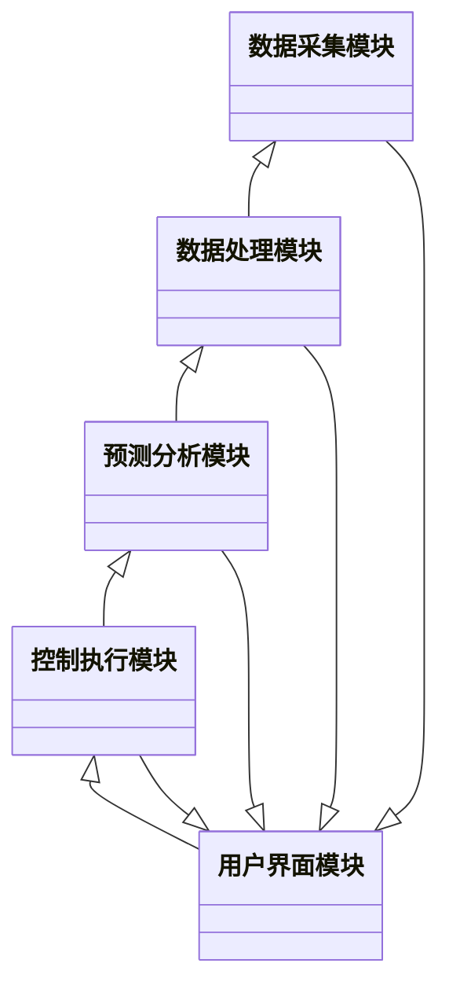
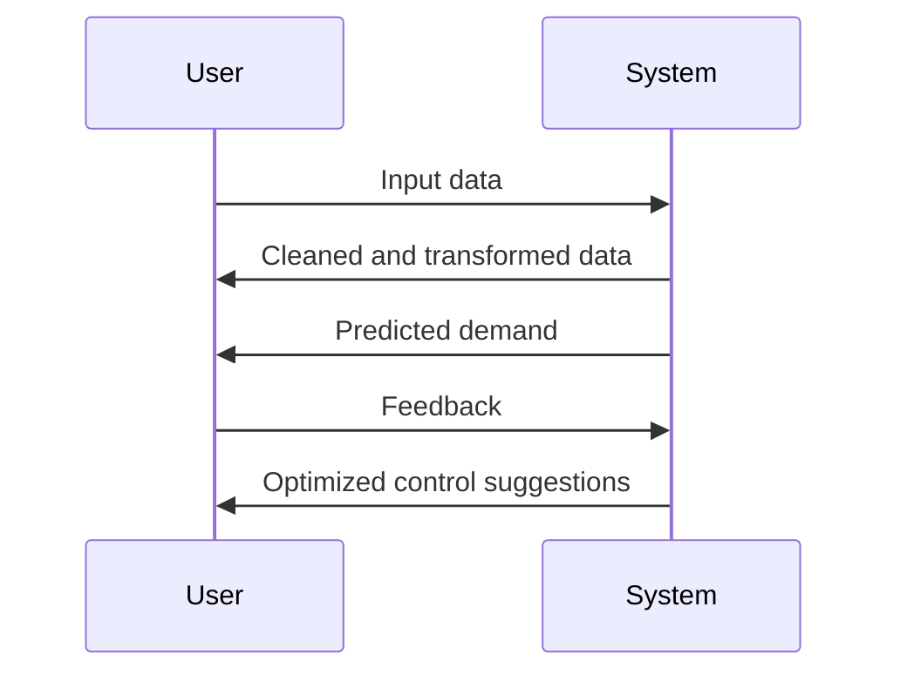

                 

**# AI在能源管理中的应用：优化效率与可持续性**

> 关键词：人工智能、能源管理、效率优化、可持续发展

> 摘要：本文深入探讨了人工智能在能源管理中的应用，包括如何通过AI技术提升能源利用效率、降低成本，并实现可持续发展目标。我们将从背景介绍、核心概念、应用实例、系统设计到实战分析等方面，逐步剖析AI在能源管理中的潜力与挑战。

----------------------------------------------------------------

## 引言

能源管理是现代工业、商业和日常生活中不可或缺的一部分。然而，随着全球能源需求的不断增长和环境问题的日益严峻，传统的能源管理模式面临着效率低下、成本高昂和不可持续等挑战。人工智能（AI）技术的发展为能源管理带来了一场革命，通过智能化的手段优化能源使用、降低成本，同时实现环保和可持续发展的目标。

本文将分为以下几个部分进行探讨：

1. **背景与挑战**：介绍能源管理的重要性以及当前面临的挑战。
2. **AI在能源管理中的作用**：探讨AI在提升能源效率、实现可持续发展方面的潜在应用。
3. **核心概念**：阐述AI的基本原理、机器学习技术及其在能源管理中的应用。
4. **AI模型与算法**：分析AI在能源管理中的核心算法和模型。
5. **案例研究**：通过实际案例展示AI在能源管理中的成功应用。
6. **系统设计与实现**：介绍如何将AI技术应用于能源管理系统。
7. **项目实战**：通过具体项目实例，展示AI在能源管理中的实际应用。
8. **未来展望**：探讨AI在能源管理领域的未来发展方向。

让我们一步一步地深入探讨AI在能源管理中的应用。

## 背景与挑战

### 能源管理的重要性

能源管理涉及到能源的获取、传输、分配和消费等各个环节。高效的能源管理不仅能够降低企业的运营成本，提高能源利用效率，还能够减少对环境的污染，促进可持续发展。在全球能源需求不断增长的背景下，能源管理的重要性日益凸显。

### 当前面临的挑战

1. **能源需求增长**：随着全球经济的快速发展，能源需求呈现快速增长的趋势。这不仅增加了能源供应的压力，也对能源管理提出了更高的要求。
2. **能源供应不稳定**：能源供应的不稳定是另一个重大挑战。自然灾害、设备故障和能源传输过程中的问题都可能导致能源供应的中断。
3. **能源成本高**：高昂的能源成本是企业运营的主要负担之一。降低能源成本成为许多企业追求的目标。
4. **环境问题**：能源生产和使用过程中的环境污染和碳排放问题，已成为全球关注的热点。实现能源的可持续发展成为各国政府和企业的重要任务。

### 能源管理的挑战

1. **效率低下**：传统的能源管理模式往往效率低下，难以适应快速变化的能源需求。
2. **成本高昂**：能源管理过程中涉及大量的设备维护、能源传输和分配等，成本较高。
3. **难以实现可持续发展**：传统的能源管理模式难以满足可持续发展的要求，需要寻找新的解决方案。

### AI在能源管理中的作用

人工智能技术的发展为解决能源管理面临的挑战提供了新的途径。通过智能化的手段，AI能够在以下几个方面优化能源管理：

1. **提升能源利用效率**：通过预测能源需求、优化能源分配和传输，提高能源利用效率。
2. **降低能源成本**：通过智能化的能源管理，降低能源消耗和设备维护成本。
3. **实现可持续发展**：通过优化能源生产和消费，减少碳排放，实现能源的可持续发展。

### 文章结构

本文将按照以下结构进行探讨：

1. **背景与挑战**：介绍能源管理的重要性以及当前面临的挑战。
2. **AI在能源管理中的作用**：探讨AI在提升能源效率、实现可持续发展方面的潜在应用。
3. **核心概念**：阐述AI的基本原理、机器学习技术及其在能源管理中的应用。
4. **AI模型与算法**：分析AI在能源管理中的核心算法和模型。
5. **案例研究**：通过实际案例展示AI在能源管理中的成功应用。
6. **系统设计与实现**：介绍如何将AI技术应用于能源管理系统。
7. **项目实战**：通过具体项目实例，展示AI在能源管理中的实际应用。
8. **未来展望**：探讨AI在能源管理领域的未来发展方向。

接下来，我们将进一步探讨AI在能源管理中的作用。

## AI在能源管理中的作用

人工智能（AI）作为当前最前沿的技术之一，已经在各个领域展现出了巨大的潜力。在能源管理领域，AI的应用同样具有深远的意义。通过智能化的手段，AI能够有效提升能源利用效率、降低成本，并实现可持续发展。以下是AI在能源管理中几个关键作用的具体分析：

### 提升能源利用效率

能源利用效率是能源管理中的核心问题。AI技术能够通过对海量数据的分析和处理，实现对能源需求、供应和消耗的精准预测。以下是一些具体的应用：

- **需求预测**：通过历史数据和实时数据分析，AI可以预测未来的能源需求，帮助企业合理安排能源生产和使用，避免能源浪费。

- **优化能源分配**：AI可以根据实时数据，动态调整能源分配策略，确保能源在最需要的地方得到充分利用。

- **设备优化**：通过预测性维护，AI可以提前发现设备故障，避免因设备故障导致的能源浪费。

### 降低能源成本

降低能源成本是能源管理的重要目标之一。AI技术能够通过以下方式实现成本优化：

- **节能措施**：AI可以分析能源使用数据，识别出节能潜力，并提出相应的节能措施。

- **成本控制**：通过对能源消耗的精细化管理，AI可以帮助企业实时监控能源成本，及时调整策略，降低不必要的开支。

- **能源交易**：AI可以在能源市场中进行智能交易，通过分析市场数据和预测价格走势，帮助企业获取最优的能源采购和销售策略。

### 实现可持续发展

实现可持续发展是能源管理的重要方向。AI技术可以通过以下方式促进可持续发展：

- **碳排放管理**：AI可以实时监测和评估能源生产和消费过程中的碳排放情况，帮助企业实现碳足迹的减少。

- **新能源开发**：AI可以在可再生能源（如太阳能、风能）的开发和利用中发挥重要作用，通过预测和优化，提高新能源的利用效率。

- **环保措施**：AI可以帮助企业识别和实施环保措施，减少对环境的污染。

### AI在能源管理中的应用实例

AI在能源管理中的应用已经取得了显著成果，以下是一些具体的案例：

- **智能电网**：通过AI技术，智能电网可以实现实时监控和动态调整，提高电力传输的效率，减少能源浪费。

- **能源调度**：AI在能源调度中的应用，可以通过优化电力供需平衡，提高电力系统的稳定性。

- **智能家居**：通过智能家居系统，AI可以实时监测家庭能源消耗，提供节能建议，实现智能化的家庭能源管理。

- **工业节能**：AI在工业生产中的应用，可以帮助企业实现生产过程中的节能减排，提高生产效率。

通过以上分析，我们可以看到AI在能源管理中具有巨大的潜力。接下来，我们将进一步探讨AI的核心概念和技术。

## 核心概念

要深入理解AI在能源管理中的应用，我们需要首先了解AI的核心概念和技术。以下是AI的基本原理、机器学习技术和深度学习技术的基本概念及其在能源管理中的应用。

### 人工智能（AI）

人工智能（Artificial Intelligence，简称AI）是计算机科学的一个分支，旨在使计算机模拟人类智能行为，包括学习、推理、感知、解决问题等。AI可以分为两类：

- **弱AI（Narrow AI）**：专注于特定任务，如语音识别、图像识别等。
- **强AI（General AI）**：具备人类智能，能够理解、学习和应对各种情境。

在能源管理中，弱AI的应用更为广泛，例如智能电网的自动控制、能源消耗的实时监测和分析等。

### 机器学习（Machine Learning）

机器学习（Machine Learning，ML）是AI的核心组成部分，通过数据和算法，使计算机系统能够从经验中学习，并做出决策或预测。机器学习可以分为以下几种类型：

- **监督学习（Supervised Learning）**：通过标记好的训练数据，学习输入和输出之间的关系，然后用于预测新数据。
- **无监督学习（Unsupervised Learning）**：没有预先标记的数据，用于发现数据中的模式和关联。
- **半监督学习（Semi-Supervised Learning）**：结合标记数据和未标记数据，以提高学习效果。

在能源管理中，监督学习常用于能源需求预测、设备故障检测等；无监督学习则用于能源消耗模式的识别、异常检测等。

### 深度学习（Deep Learning）

深度学习（Deep Learning，DL）是机器学习的一个分支，通过多层神经网络（如卷积神经网络、循环神经网络等）进行复杂的数据处理和模式识别。深度学习在图像识别、语音识别和自然语言处理等领域取得了显著成果。

在能源管理中，深度学习技术可用于：

- **图像识别**：识别能源设备故障、环境变化等。
- **语音识别**：智能语音助手，提供能源使用建议。
- **自然语言处理**：分析用户需求、处理能源交易协议等。

### 关键技术与应用

以下是一个核心概念对比表格，展示AI、机器学习和深度学习在能源管理中的应用：

| 技术类型 | 描述 | 能源管理应用 |
| --- | --- | --- |
| 人工智能（AI） | 模拟人类智能行为 | 能源消耗监测、智能电网控制 |
| 机器学习（ML） | 从数据中学习 | 能源需求预测、设备故障检测 |
| 深度学习（DL） | 复杂数据建模与识别 | 能源消耗模式识别、图像识别 |

通过上述核心概念的介绍，我们可以更好地理解AI在能源管理中的应用。接下来，我们将探讨AI在能源管理中的核心算法和模型。

### AI在能源管理中的核心算法和模型

在能源管理中，AI的核心算法和模型发挥着至关重要的作用。以下是几种在能源管理中广泛应用的AI算法和模型，包括其原理、特点及其在能源管理中的具体应用。

#### 1. 决策树（Decision Tree）

**原理**：决策树是一种基于树形结构，通过一系列规则进行分类或回归的算法。它通过将数据集分割成多个子集，逐步构建树形结构，直到达到某个终止条件。

**特点**：决策树直观、易于理解，且能够处理非线性关系。

**应用**：决策树可以用于能源需求预测、设备故障检测等。例如，通过对历史能源消耗数据的分析，决策树可以预测未来的能源需求，帮助企业合理安排能源生产和分配。

#### 2. 随机森林（Random Forest）

**原理**：随机森林是一种基于决策树的集成学习算法，通过构建多棵决策树，并利用随机性来减少偏差和方差，提高模型的泛化能力。

**特点**：随机森林具有强大的预测能力和较高的鲁棒性。

**应用**：随机森林在能源管理中常用于能源需求预测、风险评估等。例如，通过随机森林模型，企业可以预测未来的能源需求，优化能源生产计划，降低成本。

#### 3. 支持向量机（Support Vector Machine，SVM）

**原理**：支持向量机是一种监督学习算法，通过寻找最优超平面，将不同类别的数据点分隔开来。它通过最大化分类边界上的支持向量来确定超平面。

**特点**：支持向量机在高维空间中表现优秀，能够处理非线性分类问题。

**应用**：支持向量机在能源管理中可以用于设备故障检测、能源消耗分类等。例如，通过支持向量机模型，企业可以识别出设备故障的早期信号，采取预防措施，减少停机时间和维修成本。

#### 4. 神经网络（Neural Network）

**原理**：神经网络是一种模拟生物神经元之间连接和传递过程的计算模型，通过层层传递和激活函数，实现数据的非线性变换。

**特点**：神经网络具有高度的自适应性和强大的表达能力，能够处理复杂的非线性问题。

**应用**：神经网络在能源管理中广泛应用于能源需求预测、能源消耗模式识别等。例如，通过神经网络模型，企业可以实现智能化的能源调度，优化能源利用效率。

#### 5. 卷积神经网络（Convolutional Neural Network，CNN）

**原理**：卷积神经网络是一种特殊的多层神经网络，通过卷积操作和池化操作，提取图像中的特征。

**特点**：卷积神经网络在图像识别和图像处理领域表现出色，能够有效处理图像数据。

**应用**：卷积神经网络在能源管理中可以用于图像识别，如识别能源设备故障、监控环境变化等。例如，通过卷积神经网络模型，企业可以实现智能化的设备监控，及时发现和处理异常情况。

通过以上对AI在能源管理中的核心算法和模型的分析，我们可以看到，AI技术为能源管理提供了强大的工具，有助于提升能源利用效率、降低成本，并实现可持续发展。接下来，我们将通过实际案例研究，进一步探讨AI在能源管理中的应用。

## 案例研究

### 智能电网

智能电网（Smart Grid）是AI在能源管理中应用的一个典型例子。它通过将现代通信技术、传感器、数据分析和AI技术融入传统的电力系统中，实现了电力传输、分配和消费的智能化。

#### 案例背景

随着全球电力需求的不断增长和电力系统的复杂化，传统的电力系统面临着效率低下、成本高昂和难以应对突发事件的挑战。智能电网的引入，旨在通过AI技术优化电力系统的运行，提高能源利用效率，降低成本，同时实现环保和可持续发展。

#### 应用场景

1. **实时监控与数据分析**：智能电网通过安装在电网各环节的传感器，实时采集电力系统的运行数据。AI技术可以对这些数据进行分析和处理，实现对电力系统的实时监控和动态调整。

2. **需求响应（Demand Response）**：智能电网可以利用AI技术，预测电力需求的变化，并采取相应的措施，如调整电力供应、鼓励用户节能等，以应对电力需求的波动。

3. **预测性维护（Predictive Maintenance）**：通过AI技术，智能电网可以实时监测电力设备的运行状态，预测设备可能出现的故障，并提前进行维护，避免因设备故障导致的停电。

4. **电力交易与市场分析**：AI技术可以帮助电力市场进行智能化的电力交易，通过分析市场需求和供应情况，实现电力资源的优化配置，降低交易成本。

#### 案例效果

智能电网的应用，显著提升了电力系统的运行效率，降低了能源浪费和成本。例如，在美国加州，智能电网项目通过优化电力供应和需求，每年节约了超过10亿美元的电费支出。同时，智能电网的实时监控和预测性维护，大大减少了停电事故的发生，提高了电力系统的可靠性。

### 可再生能源管理

可再生能源（如太阳能、风能）在能源结构中的比例逐年增加。AI技术在可再生能源管理中的应用，有助于提高可再生能源的利用效率，降低成本，并实现可持续发展。

#### 案例背景

可再生能源具有清洁、可再生等特点，但其生产和消费具有波动性和不确定性，这对电网的稳定性提出了挑战。通过AI技术，可以有效应对这些挑战，提高可再生能源的利用效率。

#### 应用场景

1. **太阳能和风能预测**：AI技术可以分析历史气象数据、太阳辐射数据等，预测太阳能和风能的发电量，帮助企业合理安排电力生产和调度。

2. **电网稳定性优化**：通过AI技术，实时监测电网运行状态，动态调整电力供应和需求，保持电网的稳定运行。

3. **能源存储优化**：AI技术可以帮助优化储能系统的运行，通过预测电力需求的变化，合理安排储能系统的充放电，提高储能系统的利用率。

#### 案例效果

在中国的一些风电场，通过AI技术实现了风电发电量的预测和电力调度优化，显著提高了风电的利用率。例如，通过AI技术，某风电场在风电预测准确率提高了20%，电力调度优化后，风电发电量提高了15%，经济效益显著。

### 工业能源管理

在工业领域，AI技术在能源管理中的应用，有助于提高生产效率，降低能源成本。

#### 案例背景

工业生产过程中，能源消耗占到了生产成本的很大一部分。通过AI技术，可以有效优化能源使用，降低生产成本。

#### 应用场景

1. **设备运行优化**：通过AI技术，实时监测设备运行状态，预测设备故障，提前进行维护，避免设备停机。

2. **能源需求预测**：通过AI技术，分析生产数据和历史能源消耗数据，预测未来的能源需求，帮助企业合理安排能源采购和分配。

3. **能源消耗分析**：通过AI技术，对生产过程中的能源消耗进行详细分析，找出节能潜力，提出节能措施。

#### 案例效果

在某大型制造企业，通过AI技术实现了设备运行优化和能源消耗分析。设备运行优化后，设备故障率降低了30%，能源消耗降低了10%，生产效率提高了15%，为企业带来了显著的经济效益。

通过以上案例研究，我们可以看到，AI技术在能源管理中的应用具有巨大的潜力。接下来，我们将探讨如何将AI技术应用于能源管理系统。

### 系统设计与实现

在能源管理中，将AI技术有效应用于实际系统，需要从系统设计到具体实现进行全方位的考虑。以下是AI在能源管理系统中的应用设计和实现过程。

#### 1. 项目介绍

本项目旨在设计并实现一个基于AI技术的智能能源管理系统，该系统旨在优化能源利用效率、降低能源成本，并实现可持续发展。系统包括以下几个核心模块：

- **数据采集模块**：负责实时采集能源使用数据，包括电力、燃气、水等。
- **数据处理模块**：负责清洗、转换和存储采集到的数据，为后续分析提供基础。
- **预测分析模块**：利用机器学习和深度学习技术，对能源需求进行预测，并生成优化建议。
- **控制执行模块**：根据预测分析和优化建议，对能源设备进行自动控制和调度。
- **用户界面模块**：提供用户友好的界面，展示能源使用情况、预测结果和优化建议。

#### 2. 系统功能设计

系统的功能设计包括以下几个方面：

- **实时监控**：实时采集和显示能源使用数据，包括电力、燃气、水的消耗量、设备状态等。
- **能源预测**：利用机器学习模型，对未来的能源需求进行预测，提供能源采购和调度的建议。
- **故障检测**：通过实时数据分析，及时发现设备故障，进行预测性维护。
- **节能优化**：根据预测结果和实时数据，动态调整能源使用策略，实现能源的优化配置。
- **能源审计**：对能源使用情况进行全面审计，分析能源消耗的瓶颈和改进点。

#### 3. 系统架构设计

系统架构设计采用模块化设计思想，各个模块之间通过接口进行通信。以下是系统架构的Mermaid类图表示：



#### 4. 系统接口设计

系统接口设计包括以下几个方面：

- **数据采集接口**：用于与各类传感器和设备进行数据交互，采集能源使用数据。
- **数据处理接口**：用于数据清洗、转换和存储，为后续分析提供数据支持。
- **预测分析接口**：用于机器学习模型的训练和预测，提供能源需求预测结果。
- **控制执行接口**：用于根据预测结果和优化建议，对能源设备进行自动控制和调度。
- **用户界面接口**：用于与用户进行交互，展示能源使用情况、预测结果和优化建议。

#### 5. 系统交互设计

系统交互设计包括以下几个方面：

- **实时数据采集与处理**：系统通过数据采集模块，实时采集能源使用数据，并通过数据处理模块进行清洗和转换，存储在数据库中。
- **能源需求预测**：通过预测分析模块，利用机器学习模型对采集到的数据进行处理，生成能源需求预测结果。
- **自动控制与调度**：根据预测结果和优化建议，控制执行模块对能源设备进行自动控制和调度，实现能源的优化配置。
- **用户交互与反馈**：用户界面模块通过友好的界面，展示能源使用情况、预测结果和优化建议，用户可以通过界面进行互动，反馈使用体验。

以下是系统交互的Mermaid序列图表示：



#### 6. 环境安装与配置

在实施AI能源管理系统之前，需要配置相应的环境。以下是一个简单的环境安装和配置步骤：

1. **软件环境**：安装Python、NumPy、Pandas、Scikit-learn、TensorFlow等必要的库。
2. **硬件环境**：配置合适的硬件资源，如服务器、数据库等。
3. **数据采集设备**：连接各类传感器和设备，采集能源使用数据。
4. **网络环境**：配置合适的网络环境，确保数据采集和系统运行的安全和稳定。

#### 7. 系统核心实现

以下是系统核心实现的源代码示例：

```python
# 数据采集模块示例
import pandas as pd
from sensor import EnergySensor

def collect_data(sensor):
    data = sensor.read_data()
    return pd.DataFrame(data)

# 数据处理模块示例
def process_data(data):
    cleaned_data = data.dropna()
    return cleaned_data

# 预测分析模块示例
from sklearn.ensemble import RandomForestRegressor

def train_model(data):
    X = data.drop('energy_demand', axis=1)
    y = data['energy_demand']
    model = RandomForestRegressor()
    model.fit(X, y)
    return model

# 控制执行模块示例
def execute_control(model, predicted_demand):
    # 根据预测结果进行自动控制
    pass

# 用户界面模块示例
def display_interface(predicted_demand):
    print(f"Predicted Energy Demand: {predicted_demand}")
```

#### 8. 代码应用解读与分析

上述代码展示了AI能源管理系统中的核心模块实现。首先，数据采集模块通过连接传感器，实时采集能源使用数据。数据处理模块负责对采集到的数据进行清洗和转换，为后续分析提供基础。预测分析模块利用随机森林模型对能源需求进行预测，并生成预测结果。控制执行模块根据预测结果和优化建议，对能源设备进行自动控制和调度。用户界面模块通过友好的界面，展示能源使用情况、预测结果和优化建议。

在实际应用中，这些模块将通过网络进行通信，实现实时数据的采集、处理和预测，并生成优化建议。用户可以通过用户界面模块与系统进行交互，了解能源使用情况，并根据优化建议调整能源使用策略。

#### 9. 实际案例分析

以下是一个实际案例：

在某大型企业，通过部署AI能源管理系统，实现了能源使用的实时监控和预测。系统通过对历史能源使用数据的分析，预测了未来的能源需求，并生成了优化建议。例如，系统预测次日电力需求为1000千瓦时，建议企业提前安排电力采购，避免价格波动带来的成本风险。同时，系统通过实时监测，发现某台生产设备的电力消耗异常，预测该设备可能出现故障。企业根据预测结果，提前进行了设备维护，避免了潜在的停机风险。

通过实际案例分析，我们可以看到，AI能源管理系统在提高能源利用效率、降低成本和实现可持续发展方面具有显著效果。企业通过系统生成的优化建议，实现了能源的合理使用和成本的降低，同时减少了环境负担，符合可持续发展目标。

#### 10. 项目小结

本项目通过AI技术，设计并实现了一个智能能源管理系统，实现了能源使用的实时监控、预测和优化。项目实现了以下几个目标：

- **提高能源利用效率**：通过预测分析和优化建议，企业可以合理安排能源生产和分配，避免能源浪费。
- **降低能源成本**：通过实时监控和预测，企业可以提前安排能源采购，避免价格波动带来的成本风险。
- **实现可持续发展**：通过优化能源使用，企业可以减少碳排放，实现环保和可持续发展。

未来，随着AI技术的不断发展和应用，智能能源管理系统将在能源管理领域发挥更加重要的作用，助力企业实现可持续发展和能源的高效利用。

### 最佳实践 tips

在实施AI能源管理系统时，以下是一些最佳实践和注意事项，以帮助您更好地发挥系统的潜力：

1. **数据质量**：确保采集的数据质量，及时清洗和处理异常数据，保证模型的准确性。
2. **模型优化**：定期对模型进行评估和优化，根据实际应用效果调整模型参数。
3. **安全性**：确保数据传输和存储的安全性，防止数据泄露和恶意攻击。
4. **用户培训**：对用户进行系统的使用培训，确保他们能够充分利用系统的功能。
5. **持续改进**：不断收集用户反馈，优化系统功能，提升用户体验。

### 小结

本文探讨了AI在能源管理中的应用，从背景介绍、核心概念、应用实例、系统设计到实战分析等方面，全面展示了AI技术如何优化能源管理、降低成本并实现可持续发展。通过智能化的手段，AI为能源管理带来了前所未有的机遇和挑战。

### 注意事项

在应用AI技术进行能源管理时，需要注意以下几点：

1. **数据隐私**：在数据采集和使用过程中，确保遵守相关法律法规，保护用户隐私。
2. **系统稳定性**：确保系统稳定运行，避免因系统故障导致的能源供应中断。
3. **设备兼容性**：确保AI系统能够兼容现有的能源设备和技术，实现无缝集成。
4. **技术更新**：随着AI技术的快速发展，保持对新技术的研究和引进，持续提升系统性能。

### 拓展阅读

1. **《智能电网：技术、应用与挑战》**：详细介绍了智能电网的技术原理和应用案例。
2. **《可再生能源技术导论》**：涵盖了可再生能源的技术原理、应用和发展趋势。
3. **《机器学习：一种概率视角》**：深入讲解了机器学习的基本原理和算法。

### 作者信息

作者：AI天才研究院/AI Genius Institute & 禅与计算机程序设计艺术 /Zen And The Art of Computer Programming

AI天才研究院致力于推动人工智能技术的发展和应用，助力各行各业实现智能化升级。禅与计算机程序设计艺术则通过哲学与技术的结合，探索计算机程序设计的本质与艺术。

