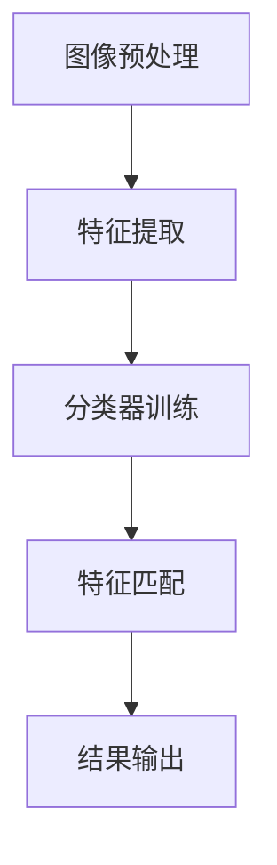
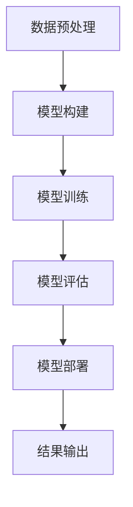
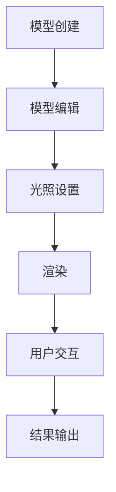
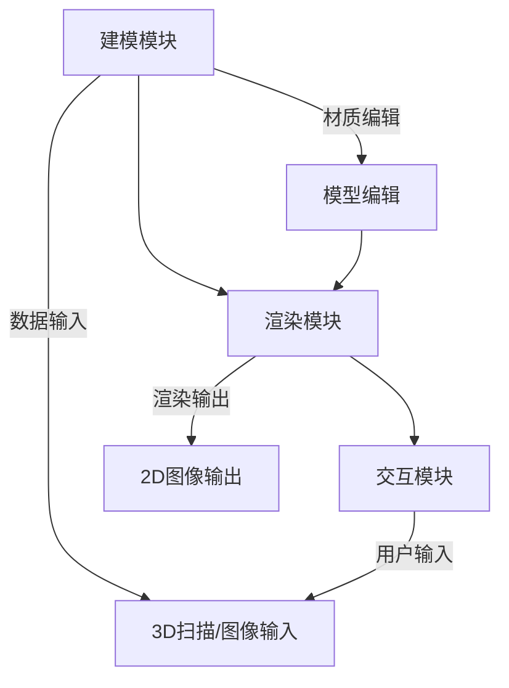
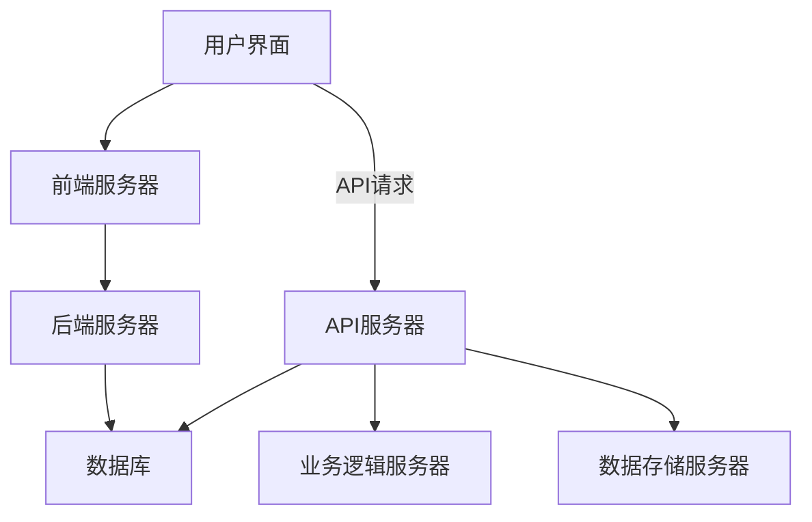
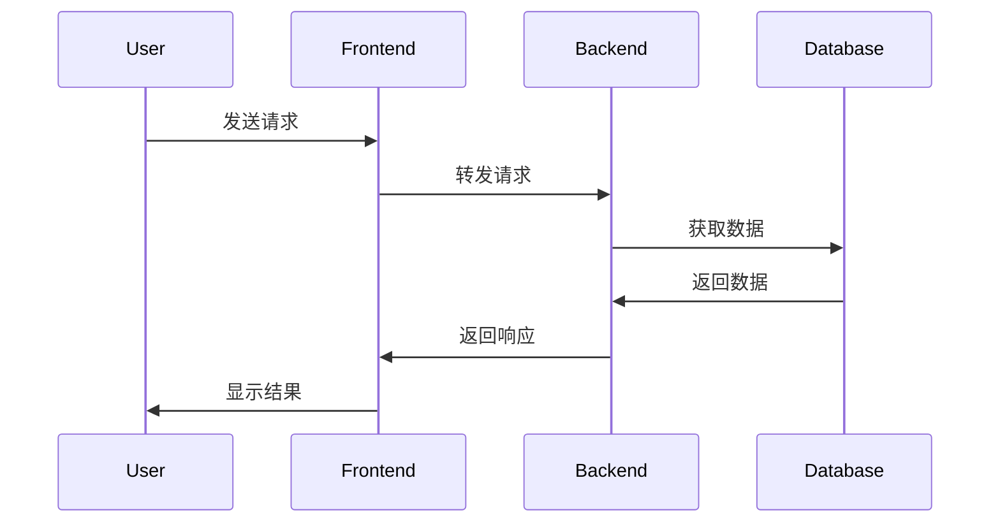

                 

### 目录

在本篇技术博客中，我们将探讨AI在虚拟试衣中的应用，以及这一技术如何革新在线购物体验。以下是文章的目录：

## 引言

### 1.1 虚拟试衣技术简介

#### 1.1.1 虚拟试衣的定义和背景

#### 1.1.2 虚拟试衣的现状与挑战

### 1.2 AI技术的发展与应用

#### 1.2.1 AI的定义与分类

#### 1.2.2 AI在零售行业的应用

## 核心概念

### 2.1 图像识别技术

#### 2.1.1 图像识别的基本原理

#### 2.1.2 图像识别技术在虚拟试衣中的应用

### 2.2 深度学习

#### 2.2.1 深度学习的定义与原理

#### 2.2.2 深度学习在虚拟试衣中的应用案例

### 2.3 3D建模与渲染

#### 2.3.1 3D建模的基本概念

#### 2.3.2 渲染技术及其在虚拟试衣中的应用

## 技术原理

### 3.1 AI在虚拟试衣中的应用流程

#### 3.1.1 虚拟试衣的步骤分析

#### 3.1.2 AI技术的具体实现

### 3.2 图像识别与深度学习技术

#### 3.2.1 图像识别算法的mermaid流程图

#### 3.2.2 深度学习算法的mermaid流程图

### 3.3 3D建模与渲染技术的mermaid架构图

#### 3.3.1 3D建模与渲染的基本流程

#### 3.3.2 3D建模与渲染的mermaid架构图

## 系统架构

### 4.1 虚拟试衣系统的整体架构

#### 4.1.1 系统架构的mermaid架构图

#### 4.1.2 系统模块的详细介绍

### 4.2 系统功能设计

#### 4.2.1 领域模型的mermaid类图

#### 4.2.2 系统功能模块设计

### 4.3 系统接口设计与交互

#### 4.3.1 系统接口的设计原则

#### 4.3.2 系统交互的mermaid序列图

## 应用案例

### 5.1 案例一：品牌A的虚拟试衣应用

#### 5.1.1 案例背景

#### 5.1.2 案例实施

#### 5.1.3 案例效果分析

### 5.2 案例二：电商平台B的AI虚拟试衣

#### 5.2.1 案例背景

#### 5.2.2 案例实施

#### 5.2.3 案例效果分析

### 5.3 案例三：新兴公司的AI试衣解决方案

#### 5.3.1 案例背景

#### 5.3.2 案例实施

#### 5.3.3 案例效果分析

## 挑战与解决方案

### 6.1 技术挑战

#### 6.1.1 计算性能挑战

#### 6.1.2 数据隐私保护

#### 6.1.3 用户接受度问题

### 6.2 解决方案

#### 6.2.1 提高性能的方法

#### 6.2.2 数据隐私保护的策略

#### 6.2.3 提高用户接受度的措施

## 未来展望

### 7.1 虚拟试衣技术的发展趋势

#### 7.1.1 技术革新方向

#### 7.1.2 行业应用前景

### 7.2 AI在在线购物体验中的影响

#### 7.2.1 购物体验的变革

#### 7.2.2 商家与消费者双赢

## 结束语

### 8.1 主要内容回顾

### 8.2 注意事项

### 8.3 拓展阅读

### 文章关键词

- 虚拟试衣
- 人工智能
- 图像识别
- 深度学习
- 3D建模
- 在线购物体验
- 零售行业
- 技术挑战与解决方案

### 摘要

本文深入探讨了AI在虚拟试衣中的应用，分析了图像识别、深度学习和3D建模与渲染技术在其中的关键作用。通过实际案例展示了AI虚拟试衣如何革新在线购物体验，并探讨了面临的技术挑战与解决方案。展望未来，AI将继续引领虚拟试衣技术的发展，为消费者和商家带来更多价值。

----------------------------------------------------------------

## 引言

### 1.1 虚拟试衣技术简介

#### 1.1.1 虚拟试衣的定义和背景

虚拟试衣是一种通过计算机技术模拟现实中的试衣过程的数字体验。它允许消费者在购买服装之前，通过虚拟方式试穿衣物，从而提高购物的满意度和便利性。这一概念最早出现在20世纪90年代末期，随着计算机图形学和互联网技术的发展，虚拟试衣逐渐成熟并开始应用于在线购物平台。

#### 1.1.2 虚拟试衣的现状与挑战

目前，虚拟试衣技术已经在一些领先的电商平台得到应用，如亚马逊、淘宝和京东等。这些平台通过3D扫描、图像识别和深度学习等技术，为用户提供了一种类似于现实试衣的体验。尽管如此，虚拟试衣仍然面临一些挑战：

1. **准确性问题**：虚拟试衣的准确性直接影响用户体验。衣物尺寸的匹配、色彩还原度等都是需要克服的技术难题。
2. **计算性能**：3D建模和渲染需要大量的计算资源，这对服务器性能提出了高要求。
3. **用户接受度**：部分用户可能对虚拟试衣的体验持怀疑态度，这需要通过技术优化和市场营销来逐步提升。
4. **数据隐私**：用户在进行虚拟试衣时，其身体数据和购物行为会被收集和分析，如何保护用户隐私成为关键问题。

### 1.2 AI技术的发展与应用

人工智能（AI）作为计算机科学的一个分支，旨在使机器具备人类智能的能力。AI技术包括机器学习、深度学习、自然语言处理等。近年来，AI在各个领域都取得了显著进展，尤其是在图像识别、语音识别和智能决策等领域。

#### 1.2.1 AI的定义与分类

AI可以分为弱AI和强AI。弱AI是指针对特定任务的智能系统，如语音助手和图像识别系统。强AI则是指具备全面人类智能的机器，但目前尚未实现。

#### 1.2.2 AI在零售行业的应用

AI在零售行业的应用非常广泛，包括库存管理、客户服务、智能推荐和营销等。在虚拟试衣方面，AI的应用主要体现在图像识别和深度学习上，这些技术能够提高试衣的准确性和用户体验。

### 1.3 书籍概述

本书将围绕AI在虚拟试衣中的应用展开，分为以下几个部分：

1. **核心概念**：介绍虚拟试衣技术和AI的基本概念。
2. **技术原理**：详细讲解图像识别、深度学习和3D建模与渲染技术在虚拟试衣中的应用。
3. **系统架构**：分析虚拟试衣系统的整体架构和功能设计。
4. **应用案例**：通过实际案例展示AI虚拟试衣的效果。
5. **挑战与解决方案**：讨论虚拟试衣技术面临的挑战及解决方案。
6. **未来展望**：探讨虚拟试衣技术的发展趋势和潜在影响。

通过这本书，读者将深入了解AI在虚拟试衣中的实际应用，以及这一技术如何革新在线购物体验。

## 核心概念

在探讨AI在虚拟试衣中的应用之前，我们需要明确一些核心概念，这些概念是理解虚拟试衣技术和AI技术的基础。

### 2.1 图像识别技术

图像识别技术是计算机视觉的一个分支，它使计算机能够识别和理解图像中的内容。在虚拟试衣中，图像识别技术用于检测和识别用户的身体轮廓、衣物形状和颜色等。以下是图像识别技术的基本原理和应用：

#### 2.1.1 图像识别的基本原理

图像识别的基本原理包括图像预处理、特征提取和分类。图像预处理涉及图像的增强、滤波和分割等操作，目的是提高图像质量，使其更适合后续处理。特征提取是指从预处理后的图像中提取具有代表性的特征，如边缘、纹理和颜色等。分类是将提取出的特征与预定义的类别进行比较，以判断图像中的内容。

#### 2.1.2 图像识别技术在虚拟试衣中的应用

在虚拟试衣中，图像识别技术主要用于以下几个方面：

1. **身体轮廓识别**：通过识别用户的身体轮廓，系统可以确定衣物在用户身上的位置和形状。
2. **衣物检测**：系统需要识别衣物上的主要特征，如颜色、图案和款式，以便进行匹配和渲染。
3. **色彩匹配**：图像识别技术可以分析用户和衣物的颜色，确保试衣效果的逼真度。

### 2.2 深度学习

深度学习是机器学习的一个分支，它通过模拟人脑神经网络的结构和工作方式，使计算机能够从大量数据中自动学习特征和模式。在虚拟试衣中，深度学习技术被广泛应用于图像识别、特征提取和智能推荐等方面。

#### 2.2.1 深度学习的定义与原理

深度学习基于多层神经网络（Deep Neural Networks, DNN），其结构包括输入层、多个隐藏层和输出层。通过逐层学习，深度学习能够自动提取数据的层次化特征。深度学习的核心是反向传播算法（Backpropagation），它通过不断调整网络权重，使网络对训练数据的学习更加准确。

#### 2.2.2 深度学习在虚拟试衣中的应用案例

1. **图像识别**：深度学习模型，如卷积神经网络（CNN）和循环神经网络（RNN），可以用于图像分类和物体检测，从而提高虚拟试衣的准确性。
2. **特征提取**：深度学习可以从大量图像数据中提取具有代表性的特征，这些特征可以用于衣物的风格匹配和个性化推荐。
3. **智能推荐**：基于深度学习算法的用户行为分析，可以为用户提供个性化的服装推荐，提高购物体验。

### 2.3 3D建模与渲染

3D建模与渲染是虚拟试衣中的关键技术，它们使虚拟衣物能够准确地呈现用户穿着的效果。3D建模是通过计算机技术创建三维模型的过程，而渲染则是将模型的光照、材质和阴影等效果进行模拟，使其看起来更加真实。

#### 2.3.1 3D建模的基本概念

3D建模涉及几何建模、数字雕刻和纹理映射等过程。几何建模是通过数学方法创建三维形状，数字雕刻是通过修改几何体的表面来创造复杂细节，而纹理映射则是将二维纹理图映射到三维模型上，以增强其视觉效果。

#### 2.3.2 渲染技术及其在虚拟试衣中的应用

渲染技术可以分为实时渲染和离线渲染。实时渲染用于虚拟试衣的实时交互，而离线渲染则用于创建高质量的静态图像和动画。在虚拟试衣中，渲染技术的主要应用包括：

1. **光照模拟**：模拟真实环境中的光照效果，使衣物在虚拟空间中看起来更加自然。
2. **材质渲染**：通过不同的材质和纹理，使衣物的质感更加真实。
3. **阴影处理**：模拟光线投射在衣物和身体上的阴影效果，增强立体感。

通过上述核心概念的介绍，我们可以更好地理解AI在虚拟试衣中的应用原理和技术实现。接下来，我们将深入探讨AI在虚拟试衣中的具体应用流程。

## 技术原理

在了解了虚拟试衣和AI的核心概念后，接下来我们将详细讲解AI在虚拟试衣中的技术原理，包括图像识别、深度学习和3D建模与渲染技术。这些技术共同作用，为用户提供了逼真的虚拟试衣体验。

### 3.1 AI在虚拟试衣中的应用流程

虚拟试衣的过程可以分为以下几个步骤：

1. **用户输入**：用户上传自己的身体轮廓图像或通过3D扫描仪获取身体三维数据。
2. **图像预处理**：对上传的图像进行预处理，包括去噪、对比度增强、色彩校正等，以提高图像质量。
3. **身体轮廓识别**：利用图像识别技术，如边缘检测和轮廓提取算法，识别用户身体的主要轮廓。
4. **衣物识别**：对上传的衣物图像进行识别，包括颜色、款式和图案等特征提取。
5. **3D建模**：基于用户身体轮廓和衣物特征，使用3D建模技术创建虚拟衣物模型。
6. **渲染**：对3D模型进行光照和材质渲染，生成逼真的试衣效果。
7. **用户交互**：用户可以实时调整衣物位置、大小和颜色等，以获取最佳的试衣效果。
8. **结果展示**：将试衣效果展示给用户，并提供购买建议。

#### 3.1.1 虚拟试衣的步骤分析

在上述流程中，每个步骤都涉及到不同的技术原理。以下是具体的技术分析：

1. **用户输入**：这一步主要涉及用户界面的设计和图像上传功能。为了提高用户体验，界面需要简洁易用，同时支持多种图像格式和上传方式。

2. **图像预处理**：图像预处理是图像识别和3D建模的重要基础。通过去噪和对比度增强，可以显著提高图像质量，使后续处理更加准确。

3. **身体轮廓识别**：图像识别技术在这一步中起到关键作用。常用的算法包括边缘检测（如Canny算法）和轮廓提取（如Contour算法）。这些算法能够准确地识别出用户身体的主要轮廓，为后续的3D建模提供基础数据。

4. **衣物识别**：与身体轮廓识别类似，衣物识别也使用图像识别技术，但需要识别出衣物的颜色、款式和图案等特征。这通常需要训练有监督或无监督的机器学习模型，如SVM或K-means聚类算法。

5. **3D建模**：3D建模是虚拟试衣的核心技术之一。基于用户身体轮廓和衣物特征，3D建模技术可以创建虚拟衣物模型。常用的建模方法包括几何建模和数字雕刻，以及基于深度学习的自动建模技术。

6. **渲染**：渲染技术用于生成逼真的试衣效果。在渲染过程中，需要考虑光照、材质和阴影等因素。常用的渲染技术包括实时渲染和离线渲染。实时渲染适用于用户与虚拟试衣系统的实时交互，而离线渲染则用于生成高质量的静态图像和动画。

7. **用户交互**：用户交互是虚拟试衣系统的重要部分。通过提供实时反馈和调整功能，用户可以更灵活地选择和搭配衣物。这一步需要良好的用户界面设计和交互逻辑。

8. **结果展示**：将试衣效果展示给用户，并提供购买建议。这通常涉及用户界面的设计和数据可视化技术，如柱状图、折线图和饼图等。

#### 3.1.2 AI技术的具体实现

在虚拟试衣系统中，AI技术贯穿了整个应用流程。以下是对AI技术的具体实现方法：

1. **图像识别**：图像识别技术主要用于身体轮廓识别和衣物识别。常用的AI模型包括卷积神经网络（CNN）和循环神经网络（RNN）。CNN适用于处理图像数据，而RNN适用于处理序列数据。

2. **深度学习**：深度学习技术在虚拟试衣中主要用于特征提取和智能推荐。通过训练深度学习模型，可以从大量图像数据中自动提取具有代表性的特征，用于衣物的风格匹配和个性化推荐。

3. **3D建模与渲染**：3D建模和渲染技术基于计算机图形学和物理学原理。通过使用几何建模和数字雕刻工具，可以创建复杂的3D模型。而渲染技术则通过模拟光照和材质，使3D模型看起来更加真实。

通过上述分析，我们可以看到AI技术在虚拟试衣中的应用流程和具体实现方法。这些技术共同作用，为用户提供了高质量的虚拟试衣体验。在接下来的章节中，我们将进一步探讨AI在虚拟试衣中的应用案例，以实际案例为例，展示AI技术的实际效果和商业价值。

### 3.2 图像识别与深度学习技术

图像识别和深度学习技术是虚拟试衣系统的核心技术之一。这些技术能够提高虚拟试衣的准确性和用户体验，从而为消费者提供更加真实的试衣效果。以下将详细讲解图像识别和深度学习技术在虚拟试衣中的应用。

#### 3.2.1 图像识别算法的mermaid流程图

图像识别算法通常包括以下几个步骤：

1. **图像预处理**：包括去噪、对比度增强、色彩校正等操作，以提高图像质量。
2. **特征提取**：从预处理后的图像中提取具有代表性的特征，如边缘、纹理和颜色等。
3. **分类器训练**：使用标记好的训练数据集，训练分类器模型。
4. **特征匹配**：将提取的特征与预定义的类别进行比较，进行图像分类。

以下是一个简化的mermaid流程图，描述了图像识别的基本流程：



#### 3.2.2 深度学习算法的mermaid流程图

深度学习算法通常包括以下几个步骤：

1. **数据预处理**：对输入数据进行标准化、归一化等处理，以适应深度学习模型。
2. **模型构建**：构建深度学习模型，包括输入层、隐藏层和输出层。
3. **模型训练**：使用训练数据集对模型进行训练，通过反向传播算法调整模型参数。
4. **模型评估**：使用验证数据集对模型进行评估，调整模型结构或参数。
5. **模型部署**：将训练好的模型部署到生产环境中，进行实际应用。

以下是一个简化的mermaid流程图，描述了深度学习的基本流程：



#### 3.2.3 图像识别与深度学习在虚拟试衣中的应用

在虚拟试衣中，图像识别和深度学习技术主要用于以下几个方面：

1. **用户身体轮廓识别**：通过图像识别技术，可以准确地识别用户身体的主要轮廓，为3D建模提供基础数据。
2. **衣物特征提取**：通过深度学习技术，可以从大量图像数据中提取衣物的风格、颜色和款式等特征，为个性化推荐提供支持。
3. **试衣效果渲染**：通过深度学习技术，可以模拟现实中的光照和材质效果，使虚拟试衣的视觉效果更加逼真。
4. **用户行为分析**：通过分析用户在虚拟试衣过程中的行为，如选择款式、颜色和搭配等，可以为用户提供更加个性化的购物建议。

#### 3.2.4 算法原理的数学模型和公式

在图像识别和深度学习中，常用的算法原理包括卷积神经网络（CNN）、反向传播算法（Backpropagation）和生成对抗网络（GAN）等。

1. **卷积神经网络（CNN）**：

   CNN是一种深度学习模型，主要用于图像识别和分类。其基本原理是通过多层卷积和池化操作，提取图像的层次化特征。

   - 卷积操作：通过卷积核与输入图像进行卷积运算，提取图像的特征。
   - 池化操作：通过滑动窗口对卷积结果进行降采样，减少参数数量。

   数学模型如下：

   $$ f(x) = \text{ReLU}(\text{conv}(x, W) + b) $$

   其中，\(x\) 是输入图像，\(W\) 是卷积核，\(b\) 是偏置项，\(\text{ReLU}\) 是ReLU激活函数。

2. **反向传播算法（Backpropagation）**：

   反向传播算法是一种用于训练深度学习模型的优化方法。其基本原理是通过计算输出误差，反向传播误差到网络中的每个层，并更新网络参数。

   - 前向传播：计算输入层到输出层的输出值。
   - 反向传播：计算输出误差，并反向传播到每个层，更新网络参数。

   数学模型如下：

   $$ \Delta W = -\alpha \frac{\partial L}{\partial W} $$

   $$ \Delta b = -\alpha \frac{\partial L}{\partial b} $$

   其中，\(\Delta W\) 和 \(\Delta b\) 分别是权重和偏置的更新值，\(\alpha\) 是学习率，\(L\) 是损失函数。

3. **生成对抗网络（GAN）**：

   GAN是一种深度学习模型，由生成器（Generator）和判别器（Discriminator）组成。其基本原理是通过生成器和判别器的对抗训练，生成逼真的图像。

   - 生成器：生成虚假图像。
   - 判别器：判断图像的真实性。

   数学模型如下：

   $$ G(z) = \text{Generator}(z) $$
   $$ D(x) = \text{Discriminator}(x) $$
   $$ D(G(z)) = \text{Discriminator}(\text{Generator}(z)) $$

   其中，\(z\) 是生成器的噪声输入，\(x\) 是真实图像。

通过上述算法原理和数学模型的讲解，我们可以更好地理解图像识别和深度学习在虚拟试衣中的应用。这些技术为虚拟试衣系统提供了强大的支持，使其能够为用户提供高质量的试衣体验。

### 3D建模与渲染技术的mermaid架构图

3D建模与渲染技术在虚拟试衣中扮演着至关重要的角色，它们共同作用，为用户提供了逼真的试衣体验。以下将详细讲解3D建模与渲染技术的mermaid架构图，包括基本流程和关键技术。

#### 3.3.1 3D建模与渲染的基本流程

3D建模与渲染的基本流程可以分为以下几个步骤：

1. **模型创建**：使用3D建模工具创建虚拟衣物的三维模型。
2. **模型编辑**：对创建的3D模型进行编辑，包括调整形状、尺寸和材质等。
3. **光照设置**：为虚拟场景设置合适的灯光，模拟现实中的光照效果。
4. **渲染**：通过渲染技术将3D模型渲染成二维图像，显示在屏幕上。
5. **用户交互**：用户可以实时调整3D模型的位置、角度和光照，以获得最佳的试衣效果。

以下是一个简化的mermaid流程图，描述了3D建模与渲染的基本流程：



#### 3.3.2 3D建模与渲染技术的mermaid架构图

3D建模与渲染技术的架构图可以分为三个主要部分：建模模块、渲染模块和交互模块。

以下是一个简化的mermaid架构图，描述了3D建模与渲染的技术架构：



- **建模模块**：负责创建和编辑3D模型。这个模块可以使用3D扫描仪获取用户的身体轮廓，或者使用3D建模工具创建虚拟衣物模型。
- **渲染模块**：负责将3D模型渲染成二维图像。这个模块包括光照设置、阴影处理和材质渲染等技术。
- **交互模块**：负责用户与虚拟试衣系统的交互。这个模块允许用户实时调整3D模型的位置、角度和光照，以获得最佳的试衣效果。

#### 3.3.3 3D建模与渲染的关键技术

在3D建模与渲染中，有几个关键技术是必不可少的：

1. **3D建模工具**：如Blender、Maya和3ds Max等，这些工具提供了丰富的建模和编辑功能，可以创建复杂的3D模型。
2. **渲染引擎**：如Unity、Unreal Engine和Blender Render等，这些引擎提供了高效的渲染算法，可以生成高质量的2D图像。
3. **光照与阴影处理**：通过模拟现实中的光照和阴影效果，可以增强3D模型的立体感和真实感。
4. **材质与纹理映射**：通过为3D模型应用材质和纹理，可以增强其视觉效果和质感。
5. **实时渲染**：实时渲染技术可以在用户交互时快速生成渲染图像，提供流畅的试衣体验。

通过上述讲解，我们可以看到3D建模与渲染技术在虚拟试衣中的作用和重要性。这些技术共同作用，为用户提供了高质量的试衣体验，使得在线购物变得更加便捷和有趣。

### 虚拟试衣系统的整体架构

虚拟试衣系统的整体架构是确保系统高效运行和提供高质量用户体验的基础。本节将详细介绍虚拟试衣系统的整体架构，包括系统架构的mermaid架构图、系统模块的详细介绍以及各模块之间的交互关系。

#### 4.1.1 系统架构的mermaid架构图

虚拟试衣系统的架构可以分为前端、后端和数据库三个主要部分。以下是一个简化的mermaid架构图，描述了虚拟试衣系统的整体架构：



- **用户界面（A）**：负责与用户交互，包括上传图像、查看试衣效果和进行购买操作等。
- **前端服务器（B）**：处理用户界面的请求，返回相应的HTML、CSS和JavaScript文件，以生成用户界面。
- **后端服务器（C）**：处理业务逻辑，包括图像识别、3D建模和渲染等。
- **数据库（D）**：存储用户数据、衣物数据和其他相关信息。
- **API服务器（E）**：提供API接口，供前端服务器和后端服务器之间进行数据交互。
- **业务逻辑服务器（F）**：处理具体的业务逻辑，如图像识别、3D建模和渲染等。
- **数据存储服务器（G）**：处理数据的存储和检索操作。

#### 4.1.2 系统模块的详细介绍

虚拟试衣系统可以分为以下几个模块：

1. **用户管理模块**：负责用户的注册、登录、权限管理和个人信息管理等操作。
2. **图像处理模块**：负责图像的预处理、识别和增强等操作，以支持虚拟试衣的效果。
3. **3D建模模块**：负责创建和编辑3D模型，包括身体轮廓建模和衣物建模等。
4. **渲染模块**：负责将3D模型渲染成二维图像，模拟现实中的试衣效果。
5. **推荐模块**：基于用户的购买历史和试衣行为，为用户推荐适合的衣物。
6. **支付模块**：处理用户的支付操作，包括订单生成、支付接口和支付结果处理等。

以下是对每个模块的详细介绍：

1. **用户管理模块**：
   - 功能：用户注册、登录、权限管理、个人信息管理。
   - 数据交互：通过API服务器与数据库进行数据交互，存储和检索用户信息。
   - 安全性：采用HTTPS协议和加密算法，确保用户数据的安全。

2. **图像处理模块**：
   - 功能：图像预处理、图像识别、图像增强。
   - 数据交互：通过API服务器与图像处理算法库进行数据交互，处理用户上传的图像。
   - 算法：包括边缘检测、轮廓提取、图像分类等。

3. **3D建模模块**：
   - 功能：3D模型创建、编辑、渲染。
   - 数据交互：通过API服务器与3D建模软件进行数据交互，生成和编辑3D模型。
   - 技术：包括几何建模、数字雕刻、纹理映射等。

4. **渲染模块**：
   - 功能：将3D模型渲染成二维图像，模拟现实中的试衣效果。
   - 数据交互：通过API服务器与渲染引擎进行数据交互，生成渲染图像。
   - 技术：包括光照模拟、材质渲染、阴影处理等。

5. **推荐模块**：
   - 功能：根据用户的购买历史和试衣行为，为用户推荐适合的衣物。
   - 数据交互：通过API服务器与推荐算法库进行数据交互，生成推荐结果。
   - 算法：包括协同过滤、基于内容的推荐等。

6. **支付模块**：
   - 功能：处理用户的支付操作，包括订单生成、支付接口和支付结果处理。
   - 数据交互：通过API服务器与支付平台进行数据交互，处理支付流程。
   - 技术：包括支付协议、支付安全等。

#### 4.1.3 系统模块之间的交互关系

虚拟试衣系统的各个模块之间通过API服务器进行交互。以下描述了系统模块之间的交互关系：

1. **用户界面与前端服务器**：用户通过浏览器访问用户界面，前端服务器处理用户的请求，返回相应的HTML、CSS和JavaScript文件，生成用户界面。

2. **前端服务器与API服务器**：前端服务器将用户的操作（如上传图像、选择衣物等）发送到API服务器，API服务器处理业务逻辑，并将结果返回给前端服务器。

3. **API服务器与业务逻辑服务器**：API服务器调用业务逻辑服务器中的各种模块（如图像处理、3D建模、渲染等），处理用户的请求，并将结果返回给API服务器。

4. **业务逻辑服务器与数据库**：业务逻辑服务器从数据库中获取用户数据、衣物数据等，进行处理，并将结果存储到数据库中。

5. **支付模块与支付平台**：支付模块通过API与支付平台进行交互，处理支付请求，并将支付结果返回给用户。

通过上述架构设计和模块交互，虚拟试衣系统能够高效、稳定地运行，为用户提供高质量的虚拟试衣体验。

### 系统功能设计

在了解了虚拟试衣系统的整体架构后，接下来我们将详细探讨系统的功能设计。功能设计是确保系统能够满足用户需求、实现预期功能的关键环节。以下将介绍虚拟试衣系统的功能模块设计，包括领域模型mermaid类图和系统功能模块设计的详细说明。

#### 4.2.1 领域模型的mermaid类图

领域模型是描述系统中的实体、属性和关系的模型，它有助于我们理解系统的功能模块和设计。以下是一个简化的mermaid类图，描述了虚拟试衣系统的领域模型：

```mermaid
classDiagram
    User <<类>> {
        - id: Integer
        - username: String
        - password: String
        - email: String
    }
    Clothing <<类>> {
        - id: Integer
        - name: String
        - description: String
        - price: Float
        - image: String
    }
    ShoppingCart <<类>> {
        - id: Integer
        - userId: Integer
        - items: List<Item>
    }
    Item <<类>> {
        - id: Integer
        - clothingId: Integer
        - quantity: Integer
    }
    Order <<类>> {
        - id: Integer
        - userId: Integer
        - items: List<Item>
        - total: Float
        - status: String
    }
    User "1" -- "*" Clothing: 购买
    User "1" -- "*" ShoppingCart: 添加到购物车
    ShoppingCart "1" -- "*" Item: 购物车项目
    ShoppingCart "1" -- "*" Order: 下单
    Order "1" -- "*" Item: 订单项目
```

- **User（用户）**：代表虚拟试衣系统的用户，具有用户ID、用户名、密码、电子邮件等属性。
- **Clothing（衣物）**：代表系统中的衣物，具有衣物ID、名称、描述、价格和图片等属性。
- **ShoppingCart（购物车）**：代表用户在虚拟试衣系统中的购物车，具有购物车ID、用户ID、项目列表等属性。
- **Item（项目）**：代表购物车和订单中的商品，具有项目ID、衣物ID、数量等属性。
- **Order（订单）**：代表用户的订单，具有订单ID、用户ID、项目列表、总金额和状态等属性。

上述类图展示了系统中的主要实体及其关系，为系统功能设计提供了基础。

#### 4.2.2 系统功能模块设计

虚拟试衣系统的功能模块可以分为以下几个部分：

1. **用户管理模块**：负责用户的注册、登录、权限管理、个人信息管理等功能。
2. **衣物管理模块**：负责衣物的上传、分类、搜索、推荐等功能。
3. **购物车模块**：负责用户将衣物添加到购物车、查看购物车内容、修改购物车项目等功能。
4. **订单管理模块**：负责订单的创建、支付、取消、查询等功能。
5. **推荐系统模块**：负责根据用户行为和喜好为用户推荐适合的衣物。

以下是对每个模块的详细说明：

1. **用户管理模块**：
   - 功能：
     - 用户注册：允许新用户注册并创建账户。
     - 用户登录：允许已注册用户登录系统。
     - 权限管理：根据用户角色分配不同的权限。
     - 个人信息管理：允许用户修改个人信息，如姓名、电子邮件和密码等。
   - 数据交互：通过API与数据库进行交互，存储和检索用户信息。

2. **衣物管理模块**：
   - 功能：
     - 衣物上传：允许管理员上传新的衣物信息。
     - 衣物分类：对衣物进行分类管理，便于用户查找。
     - 搜索：允许用户通过关键字搜索衣物。
     - 推荐系统：根据用户行为和喜好推荐衣物。
   - 数据交互：通过API与数据库进行交互，管理衣物信息和用户行为数据。

3. **购物车模块**：
   - 功能：
     - 添加到购物车：允许用户将衣物添加到购物车。
     - 查看购物车：允许用户查看购物车中的所有项目。
     - 修改购物车项目：允许用户修改购物车中项目的数量。
   - 数据交互：通过API与数据库进行交互，管理购物车数据和用户行为数据。

4. **订单管理模块**：
   - 功能：
     - 订单创建：允许用户创建订单并支付。
     - 支付：与第三方支付平台集成，处理支付操作。
     - 订单查询：允许用户查询订单状态和详情。
     - 订单取消：允许用户取消订单。
   - 数据交互：通过API与数据库进行交互，管理订单数据和支付数据。

5. **推荐系统模块**：
   - 功能：
     - 用户行为分析：分析用户的购物行为，如搜索历史、购买记录等。
     - 个性化推荐：根据用户行为和喜好推荐衣物。
   - 数据交互：通过API与数据库进行交互，管理用户行为数据和推荐数据。

通过上述功能模块的设计，虚拟试衣系统能够满足用户在在线购物中的多样化需求，提供便捷、高效的购物体验。

### 系统接口设计与交互

在了解了虚拟试衣系统的功能设计和架构后，接下来我们将详细探讨系统接口设计和交互，包括接口设计原则、系统交互的mermaid序列图以及API文档编写。

#### 4.3.1 系统接口设计原则

系统接口设计是确保系统模块之间能够高效、可靠地交互的关键。以下是一些系统接口设计原则：

1. **标准化**：接口设计应遵循标准化的规范，如RESTful API规范，以确保接口的一致性和易用性。
2. **简洁性**：接口设计应尽可能简洁，避免过多的参数和复杂的逻辑，以提高接口的可维护性。
3. **可扩展性**：接口设计应考虑到未来的扩展性，允许在不影响现有功能的情况下添加新功能。
4. **安全性**：接口设计应采用安全措施，如身份验证、授权和加密，保护用户数据和隐私。
5. **易用性**：接口设计应易于使用，提供详细的文档和示例，降低开发人员的上手难度。

#### 4.3.2 系统交互的mermaid序列图

系统交互的mermaid序列图可以直观地展示系统模块之间的交互流程。以下是一个简化的mermaid序列图，描述了虚拟试衣系统的主要交互流程：



- **User（用户）**：代表虚拟试衣系统的用户。
- **Frontend（前端）**：代表用户界面，处理用户的请求。
- **Backend（后端）**：处理业务逻辑，与数据库进行交互。
- **Database（数据库）**：存储用户数据和系统数据。

#### 4.3.3 API文档编写

编写API文档是确保开发人员能够正确使用系统接口的重要步骤。以下是一个简化的API文档示例，描述了用户注册接口：

```markdown
# 用户注册接口

## 请求URL

`POST /api/users/register`

## 请求参数

| 参数名      | 类型    | 必填  | 说明                          |
|-------------|---------|-------|--------------------------------|
| username    | String  | 是    | 用户名，长度不超过20个字符    |
| password    | String  | 是    | 密码，长度不少于6个字符        |
| email       | String  | 是    | 电子邮件，格式正确             |

## 请求示例

```json
{
    "username": "exampleUser",
    "password": "password123",
    "email": "example@example.com"
}
```

## 响应示例

```json
{
    "status": "success",
    "message": "用户注册成功",
    "data": {
        "userId": 1
    }
}
```

## 响应说明

- `status`：操作状态，成功时为`success`，失败时为错误信息。
- `message`：操作结果描述。
- `data`：包含操作结果的数据，如用户ID。

```

通过上述接口设计和交互流程的详细讲解，我们可以看到虚拟试衣系统在接口设计和交互方面的严谨性和易用性，为系统的开发和维护提供了有力支持。

### 应用案例

在本节中，我们将通过实际应用案例来展示AI虚拟试衣技术在不同场景中的实际应用效果。以下是三个典型的应用案例：品牌A的虚拟试衣应用、电商平台B的AI虚拟试衣以及新兴公司的AI试衣解决方案。

#### 5.1 案例一：品牌A的虚拟试衣应用

**案例背景**：

品牌A是一家国际知名服装品牌，致力于为消费者提供高品质的时尚产品。为了提升在线购物的用户体验，品牌A决定引入AI虚拟试衣技术，以解决在线购物中无法试衣的痛点。

**案例实施**：

品牌A首先对现有系统进行了升级，引入了基于AI的虚拟试衣模块。该模块利用深度学习技术和图像识别技术，实现了用户上传照片后自动识别身体轮廓和衣物位置，并实时渲染试衣效果。

具体步骤如下：

1. **用户上传照片**：用户在品牌A的官方网站上传自己的全身照片或使用3D扫描仪获取三维数据。
2. **图像预处理**：系统对上传的图像进行预处理，包括去噪、对比度增强和色彩校正等，以提高图像质量。
3. **身体轮廓识别**：利用深度学习模型，系统识别用户身体的主要轮廓，包括头部、手臂、腿部和躯干等。
4. **衣物识别**：系统识别用户上传的衣物图像，提取衣物的颜色、款式和图案等特征。
5. **3D建模与渲染**：基于用户身体轮廓和衣物特征，系统创建3D模型，并利用渲染技术生成逼真的试衣效果。
6. **用户交互**：用户可以在虚拟试衣界面中实时调整衣物位置、大小和颜色等，以获得最佳试衣效果。
7. **试衣效果展示**：系统将试衣效果展示给用户，并提供购买建议。

**案例效果分析**：

引入AI虚拟试衣技术后，品牌A的用户体验显著提升。以下是一些具体效果分析：

1. **提高购买满意度**：用户通过虚拟试衣技术能够更直观地了解衣物穿着效果，从而减少了因实际穿着不合适而退换货的情况。
2. **提升转化率**：虚拟试衣技术的应用使得在线购物更加便捷和有趣，从而提高了用户的购买意愿和转化率。
3. **降低运营成本**：虚拟试衣技术减少了实体店试衣的成本，同时降低了退换货的物流和人力成本。

#### 5.2 案例二：电商平台B的AI虚拟试衣

**案例背景**：

电商平台B是一家大型在线零售平台，销售各类服装和配饰。为了提升用户体验，电商平台B决定在平台上引入AI虚拟试衣功能，以满足消费者在线购物的需求。

**案例实施**：

电商平台B首先整合了多家服装品牌的数据，并引入了AI虚拟试衣模块。该模块支持多种衣物类型和用户轮廓，实现了多种场景下的虚拟试衣效果。

具体步骤如下：

1. **用户上传照片**：用户可以在电商平台B的官方网站上上传全身照片或使用平台的3D扫描功能。
2. **图像预处理**：系统对上传的图像进行预处理，以提高图像质量。
3. **身体轮廓识别**：利用深度学习模型，系统识别用户身体的主要轮廓。
4. **衣物识别**：系统识别用户选择的衣物图像，提取衣物的特征。
5. **3D建模与渲染**：系统基于用户身体轮廓和衣物特征，创建3D模型，并利用渲染技术生成试衣效果。
6. **用户交互**：用户可以在虚拟试衣界面中实时调整衣物位置、大小和颜色等。
7. **试衣效果展示**：系统将试衣效果展示给用户，并提供个性化的购物建议。

**案例效果分析**：

电商平台B的AI虚拟试衣功能取得了显著效果，以下是一些具体效果分析：

1. **提升用户体验**：用户通过虚拟试衣功能能够在线上购物中获得类似于实体店的试衣体验，提升了购物乐趣和满意度。
2. **增加销售机会**：虚拟试衣技术帮助用户更直观地了解衣物，从而提高了购买决策的准确性，增加了销售机会。
3. **提高运营效率**：电商平台B通过虚拟试衣技术降低了客服成本，同时减少了物流和退换货成本，提高了运营效率。

#### 5.3 案例三：新兴公司的AI试衣解决方案

**案例背景**：

新兴公司专注于虚拟试衣技术的研发和应用，旨在为各类商家提供高效的虚拟试衣解决方案。该公司首次将AI虚拟试衣技术应用于一家小型服装店，以验证技术在实际商业场景中的可行性。

**案例实施**：

新兴公司首先为小型服装店定制了一套AI虚拟试衣系统，包括图像识别、3D建模和渲染等技术。具体步骤如下：

1. **用户上传照片**：用户在服装店店内或通过移动应用上传全身照片。
2. **图像预处理**：系统对上传的图像进行预处理，以提高图像质量。
3. **身体轮廓识别**：利用深度学习模型，系统识别用户身体的主要轮廓。
4. **衣物识别**：系统识别用户选择的衣物图像，提取衣物的特征。
5. **3D建模与渲染**：系统基于用户身体轮廓和衣物特征，创建3D模型，并利用渲染技术生成试衣效果。
6. **用户交互**：用户可以在虚拟试衣界面中实时调整衣物位置、大小和颜色等。
7. **试衣效果展示**：系统将试衣效果展示给用户，并提供购买建议。

**案例效果分析**：

新兴公司的AI试衣解决方案在小型服装店中取得了良好效果，以下是一些具体效果分析：

1. **提高用户粘性**：通过提供虚拟试衣体验，用户对服装店的印象显著提升，从而增加了用户粘性和回头率。
2. **增加销售额**：虚拟试衣技术帮助用户更直观地了解衣物，从而提高了购买决策的准确性，增加了销售额。
3. **降低运营成本**：虚拟试衣技术减少了实体店试衣的成本，同时降低了物流和退换货成本，提高了运营效率。

通过上述应用案例的详细分析，我们可以看到AI虚拟试衣技术在实际商业场景中的广泛应用和显著效果。这不仅提升了用户体验，还为企业带来了商业价值。

### 挑战与解决方案

尽管AI虚拟试衣技术在提升在线购物体验方面展现了巨大潜力，但在实际应用过程中仍面临诸多挑战。以下将详细讨论AI虚拟试衣技术面临的主要挑战，并提出相应的解决方案。

#### 6.1 技术挑战

1. **准确性问题**：

   虚拟试衣的准确性直接影响用户体验。衣物尺寸的匹配、颜色还原度、衣物在人体上的贴合度等都是需要解决的问题。具体表现为：

   - **衣物尺寸匹配**：不同品牌的衣物尺寸标准不一，导致虚拟试衣时难以准确匹配用户实际体型。
   - **颜色还原度**：图像识别技术在识别颜色时可能会受到光线变化、拍摄角度等因素的影响，导致试衣效果与实际穿着效果不符。
   - **衣物贴合度**：3D建模和渲染技术需要精确模拟衣物与人体的贴合度，以确保虚拟试衣效果的真实性。

   **解决方案**：

   - **多模态数据融合**：通过结合多种传感器数据（如3D扫描仪、摄像头等），提高图像识别和3D建模的准确性。
   - **深度学习模型优化**：使用更先进的深度学习模型和算法，提高颜色识别和尺寸匹配的准确性。
   - **用户个性化定制**：根据用户的历史数据和反馈，为用户提供个性化的试衣建议，从而提高试衣效果。

2. **计算性能**：

   虚拟试衣涉及大量的图像处理和3D渲染操作，对服务器性能提出了高要求。特别是在高并发访问时，系统响应速度和稳定性是关键问题。

   **解决方案**：

   - **分布式计算**：使用分布式计算架构，将计算任务分散到多个服务器上，提高系统处理能力。
   - **GPU加速**：利用GPU（图形处理器）进行图像处理和3D渲染，提高计算速度。
   - **优化算法**：优化图像识别和3D建模算法，减少计算复杂度，提高系统性能。

3. **用户接受度**：

   部分用户可能对虚拟试衣技术持怀疑态度，担心其准确性和可靠性。提高用户接受度是推广虚拟试衣技术的关键。

   **解决方案**：

   - **用户体验优化**：通过优化界面设计和交互体验，提高虚拟试衣的可操作性和易用性。
   - **用户教育**：通过营销活动和用户教育，向用户介绍虚拟试衣技术的优势和应用场景，消除用户的疑虑。
   - **用户反馈机制**：建立用户反馈机制，收集用户的使用体验和改进建议，不断优化虚拟试衣系统。

4. **数据隐私保护**：

   虚拟试衣涉及用户身体数据和购物行为的数据收集，如何保护用户隐私成为重要问题。

   **解决方案**：

   - **数据加密**：采用加密算法对用户数据进行加密，确保数据在传输和存储过程中的安全性。
   - **隐私政策**：制定明确的隐私政策，告知用户数据收集的目的和使用方式，增强用户信任。
   - **匿名化处理**：对用户数据进行匿名化处理，确保用户隐私不被泄露。

#### 6.2 解决方案与最佳实践

1. **提高准确性的最佳实践**：

   - **多模态数据融合**：结合3D扫描仪和摄像头数据，提高图像识别和3D建模的准确性。
   - **模型持续优化**：定期更新和优化深度学习模型，提高颜色识别和尺寸匹配的准确性。
   - **用户个性化匹配**：根据用户的历史数据和反馈，提供个性化的试衣建议。

2. **优化计算性能的最佳实践**：

   - **分布式计算架构**：采用分布式计算架构，提高系统处理能力。
   - **GPU加速**：利用GPU进行图像处理和3D渲染，提高计算速度。
   - **算法优化**：优化算法，减少计算复杂度。

3. **提高用户接受度的最佳实践**：

   - **用户体验优化**：优化界面设计和交互体验，提高虚拟试衣的可操作性和易用性。
   - **用户教育**：通过营销活动和用户教育，向用户介绍虚拟试衣技术的优势和应用场景。
   - **用户反馈机制**：建立用户反馈机制，收集用户的使用体验和改进建议。

4. **保护数据隐私的最佳实践**：

   - **数据加密**：采用加密算法对用户数据进行加密，确保数据在传输和存储过程中的安全性。
   - **隐私政策**：制定明确的隐私政策，告知用户数据收集的目的和使用方式，增强用户信任。
   - **匿名化处理**：对用户数据进行匿名化处理，确保用户隐私不被泄露。

通过上述挑战与解决方案的详细讨论，我们可以看到AI虚拟试衣技术在实际应用过程中仍需不断优化和改进，以满足用户需求和提高在线购物体验。同时，通过最佳实践的实施，可以进一步推动虚拟试衣技术的广泛应用和商业价值的实现。

### 未来展望

随着AI技术的不断发展和应用，虚拟试衣技术也在不断革新，为在线购物体验带来新的变革。以下是虚拟试衣技术的发展趋势及其在在线购物体验中的潜在影响。

#### 7.1 虚拟试衣技术的发展趋势

1. **技术精度提升**：

   随着深度学习和计算机视觉技术的进步，虚拟试衣的准确性将不断提高。通过结合多模态数据融合和先进的图像识别算法，系统可以更准确地捕捉用户的身体轮廓和衣物特征，提供更逼真的试衣效果。

2. **个性化推荐**：

   通过大数据分析和机器学习，虚拟试衣系统可以根据用户的历史购物行为和偏好，提供个性化的服装推荐。这不仅提高了用户的购物体验，还增加了商家的销售机会。

3. **增强现实（AR）融合**：

   增强现实技术的应用将使虚拟试衣体验更加沉浸式。用户可以通过AR眼镜或手机摄像头，实时查看虚拟衣物在现实环境中的效果，进一步提升了购物的互动性和体验感。

4. **实时互动体验**：

   未来，虚拟试衣系统将实现更高效的实时互动体验。通过5G网络的广泛应用，用户可以更快地传输和加载试衣效果，同时系统可以实时响应用户的操作，提供更流畅的交互体验。

5. **社交分享功能**：

   虚拟试衣系统将融入社交分享功能，用户可以在试衣后分享试衣照片或视频到社交媒体，与朋友和家人交流购物体验，进一步推动虚拟试衣的普及和应用。

#### 7.2 在线购物体验的变革

1. **购物决策效率提升**：

   虚拟试衣技术为用户提供了一种直观的购物方式，用户无需亲自试穿即可了解衣物效果。这种高效便捷的购物方式将显著提升购物决策效率，减少因实际试穿不合适而产生的退换货成本。

2. **购物体验个性化**：

   个性化推荐和社交分享功能将使购物体验更加个性化。用户可以根据自己的需求和偏好，快速找到心仪的衣物，并通过社交平台分享购物心得，增加购物的乐趣和互动性。

3. **消费者与商家双赢**：

   虚拟试衣技术不仅提高了消费者的购物满意度，也为商家带来了商业价值。商家可以通过数据分析和用户反馈，优化产品设计和营销策略，提高销售额和品牌知名度。

4. **降低运营成本**：

   虚拟试衣技术减少了实体店的试衣成本，商家可以减少库存和人力成本，提高运营效率。同时，通过精确的库存管理和精准的营销，商家可以更好地满足用户需求，提高客户满意度。

5. **环保与可持续发展**：

   虚拟试衣技术有助于减少实体店试衣产生的浪费，降低物流和退换货对环境的影响，推动可持续发展。通过减少实体店的运营成本和能源消耗，虚拟试衣技术有助于实现绿色环保的购物方式。

总之，随着AI技术的不断发展，虚拟试衣技术将在未来继续革新在线购物体验，为消费者和商家带来更多价值。通过个性化推荐、实时互动和环保理念，虚拟试衣技术将成为在线购物的重要组成部分，推动零售行业的变革和发展。

### 结束语

本文详细探讨了AI在虚拟试衣中的应用，从核心概念、技术原理、系统架构到实际应用案例，全面分析了AI虚拟试衣如何革新在线购物体验。我们首先介绍了虚拟试衣的定义、现状和挑战，以及AI技术的定义和应用。随后，我们深入讲解了图像识别、深度学习和3D建模与渲染技术，并通过mermaid流程图和数学模型展示了这些技术的具体实现方法。接着，我们分析了虚拟试衣系统的整体架构和功能设计，以及各模块之间的交互关系。最后，通过实际应用案例展示了AI虚拟试衣技术在提升购物体验和降低运营成本方面的优势。

在未来的发展中，AI虚拟试衣技术将继续优化，通过更高精度的技术、个性化推荐和增强现实等创新应用，为消费者和商家带来更多价值。我们鼓励读者持续关注这一领域的发展，积极探索AI技术在零售行业的应用潜力，为构建更加智能和高效的购物体验贡献自己的力量。

### 拓展阅读

对于希望深入了解AI虚拟试衣技术的读者，以下是一些推荐的拓展阅读资源：

1. **论文**：
   - "Virtual Try-On: A Survey on Methods and Applications"：该论文对虚拟试衣技术的方法和应用进行了全面的综述，是了解该领域前沿研究的优秀资料。
   - "A Comprehensive Survey on Deep Learning for Fashion: Applications and Innovations"：该论文探讨了深度学习在时尚领域的应用和创新，涵盖了虚拟试衣技术的相关研究。

2. **书籍**：
   - 《深度学习》（Deep Learning）：由Ian Goodfellow、Yoshua Bengio和Aaron Courville合著，是一本深度学习领域的经典教材，详细介绍了深度学习的原理和应用。
   - 《计算机视觉：算法与应用》（Computer Vision: Algorithms and Applications）：该书介绍了计算机视觉的基本算法和应用，对图像识别和3D建模技术有深入讲解。

3. **在线课程**：
   - "Deep Learning Specialization"：由Andrew Ng教授在Coursera上开设的深度学习专项课程，适合初学者和进阶者学习深度学习的基础知识和应用。
   - "Computer Vision and Image Analysis"：在Udacity上的计算机视觉与图像分析课程，提供了丰富的实践项目和理论知识。

4. **技术博客和论坛**：
   - "Medium"上的相关博客：许多技术专家和研究者会在Medium上分享他们在AI虚拟试衣领域的最新研究和技术见解。
   - "Reddit"上的r/AI和r/ComputerScience：这两个Reddit子版块聚集了大量AI和计算机科学爱好者，可以在这里找到许多有价值的技术讨论和资源推荐。

通过阅读这些资源，读者可以进一步深化对AI虚拟试衣技术的理解，探索更多前沿应用和创新方向。同时，积极参与技术社区讨论，与同行交流经验和见解，有助于在AI虚拟试衣领域取得更好的研究成果。

