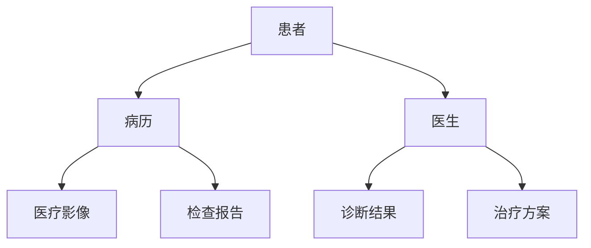
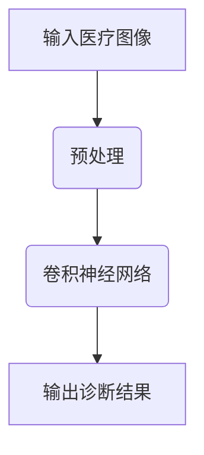
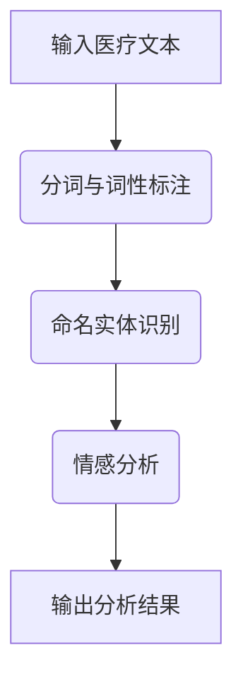
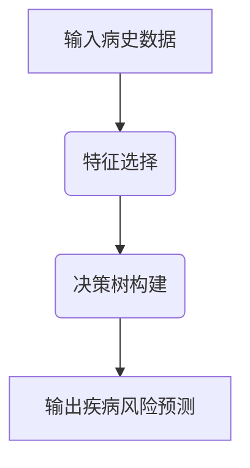
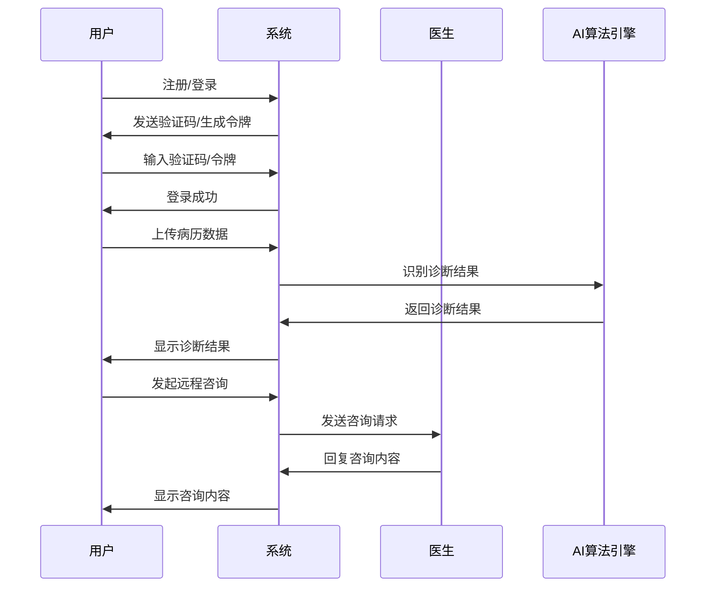

                 

# AI在远程医疗中的应用：突破地理限制的医疗服务

> 关键词：人工智能，远程医疗，图像识别，自然语言处理，决策树，数学模型，系统架构设计，项目实战

> 摘要：本文深入探讨了人工智能在远程医疗领域的应用，从背景介绍、核心概念、算法原理、数学模型到系统架构设计和项目实战，全面解析了AI在远程医疗中的突破性作用，为医疗行业带来了前所未有的变革。

## 第一部分：背景介绍

### 问题背景

随着全球人口老龄化加剧和医疗资源分布不均的问题日益凸显，传统的医疗服务模式已无法满足日益增长的医疗需求。尤其是在偏远地区和医疗资源匮乏的地区，患者往往难以获得及时、高质量的医疗服务。这种地理限制导致了许多健康问题的延误和治疗效果的下降。因此，如何突破地理限制，实现高效、便捷的医疗服务成为了一个亟待解决的问题。

### 问题描述

如何在远程医疗中充分利用人工智能技术，提高医疗服务的效率和质量，解决传统医疗服务模式中的地理限制问题？

### 问题解决

本文将通过详细的案例分析、算法原理讲解和实践指导，探讨人工智能在远程医疗中的应用，为读者提供一套完整的应用方案。通过介绍AI大模型、图像识别、自然语言处理和决策树等核心算法，本文将展示如何利用AI技术实现远程医疗中的各种应用场景，包括远程诊断、远程监护和远程咨询等。

### 边界与外延

本文主要关注人工智能在远程医疗中的实际应用，包括但不限于远程诊断、远程监护、远程咨询等场景。同时，本文也会涉及AI技术的基本原理和相关算法。

### 概念结构与核心要素组成

- **AI技术**：本文的核心概念，包括机器学习、深度学习、自然语言处理等。
- **远程医疗**：本文的应用场景，涉及远程诊断、远程监护、远程咨询等。
- **医疗数据**：本文的数据基础，包括患者信息、病历数据、医疗影像等。

## 第二部分：核心概念与联系

### AI大模型的定义与特点

AI大模型是指具有大规模参数的机器学习模型，能够处理复杂的任务。其核心特点包括：

- **高效性**：能够处理海量数据，实现快速计算。
- **智能性**：具备自主学习能力，能够不断优化性能。

### AI大模型与传统AI的区别

传统AI主要依赖专家经验和手工特征工程，而AI大模型通过自动化的方法学习数据特征，具有更高的灵活性和适应性。

| 特征               | AI大模型                 | 传统AI                 |
|--------------------|--------------------------|------------------------|
| 特征提取           | 自动化特征提取           | 手工特征提取           |
| 参数规模           | 大规模参数               | 小规模参数             |
| 自学习能力         | 自适应学习能力           | 固定学习能力           |
| 适应能力           | 高度适应复杂任务         | 适应特定任务           |

### ER实体关系图架构的Mermaid流程图



## 第三部分：算法原理讲解

### 1. 图像识别算法

**算法原理**：利用深度学习技术对医疗图像进行分类和识别。

**Mermaid流程图**：



**算法讲解**：图像识别算法通常基于卷积神经网络（CNN）实现。CNN通过对图像进行卷积操作和池化操作，提取图像的特征，并最终分类和识别图像内容。常见的CNN结构包括卷积层、池化层、全连接层等。以下是一个简单的CNN算法实现示例：

```python
import tensorflow as tf

# 定义CNN模型
model = tf.keras.Sequential([
    tf.keras.layers.Conv2D(32, (3, 3), activation='relu', input_shape=(28, 28, 1)),
    tf.keras.layers.MaxPooling2D((2, 2)),
    tf.keras.layers.Conv2D(64, (3, 3), activation='relu'),
    tf.keras.layers.MaxPooling2D((2, 2)),
    tf.keras.layers.Flatten(),
    tf.keras.layers.Dense(128, activation='relu'),
    tf.keras.layers.Dense(10, activation='softmax')
])

# 编译模型
model.compile(optimizer='adam',
              loss='categorical_crossentropy',
              metrics=['accuracy'])

# 训练模型
model.fit(x_train, y_train, epochs=10, batch_size=32, validation_data=(x_val, y_val))
```

**数学模型**：图像识别算法的数学模型通常基于卷积神经网络（CNN）实现。其核心数学模型包括：

$$
激活函数: f(x) = \text{ReLU}(x) = \max(0, x)
$$

举例说明：假设输入图像的像素值为 $[1, 2, -3, 4]$，经过ReLU激活函数处理后，输出为 $[1, 2, 0, 4]$。

### 2. 自然语言处理算法

**算法原理**：利用自然语言处理技术对医疗文本数据进行分析和解读。

**Mermaid流程图**：



**算法讲解**：自然语言处理算法通常包括分词、词性标注、命名实体识别、情感分析等步骤。以下是一个简单的自然语言处理算法实现示例：

```python
import jieba
import paddle
import paddle.fluid as fluid

# 加载预训练模型
model = paddle.load('chinese_wwm_analogy')

# 分词
text = "医生建议我多吃水果"
words = jieba.cut(text)

# 词性标注
words_with_pos = list(jieba.cut(text))

# 命名实体识别
entity_result = modelواره(words_with_pos)

# 情感分析
emotion_result = model.情感分析(words_with_pos)

# 输出分析结果
print("分析结果：", entity_result, emotion_result)
```

**数学模型**：自然语言处理算法的数学模型通常基于词嵌入（Word Embedding）实现：

$$
\text{word\_embedding}(w) = \text{vec}(w) \in \mathbb{R}^d
$$

举例说明：假设单词“疾病”的词嵌入向量为 $\text{vec}(\text{"疾病"}) = [1, 2, 3, 4]$，则可以通过计算两个单词的词嵌入向量的点积来计算它们的相似度：

$$
\text{similarity}(\text{"疾病"}, \text{"病情"}) = \text{vec}(\text{"疾病"}) \cdot \text{vec}(\text{"病情"}) = [1, 2, 3, 4] \cdot [0, 1, 2, 3] = 11
$$

### 3. 决策树算法

**算法原理**：通过构建决策树模型，对患者的病史数据进行分析，预测疾病风险。

**Mermaid流程图**：



**算法讲解**：决策树算法通过递归划分特征空间，构建一个树形结构，用于分类或回归任务。以下是一个简单的决策树算法实现示例：

```python
from sklearn.tree import DecisionTreeClassifier

# 加载训练数据
X_train = [[1, 2], [2, 3], [3, 4]]
y_train = [0, 1, 0]

# 构建决策树模型
model = DecisionTreeClassifier()

# 训练模型
model.fit(X_train, y_train)

# 预测疾病风险
X_test = [[2, 3]]
risk = model.predict(X_test)

# 输出疾病风险预测
print("疾病风险预测：", risk)
```

**数学模型**：决策树算法的核心是构建一个决策树模型，其数学模型通常基于信息增益（Information Gain）实现：

$$
\text{Information\_Gain}(A, B) = \text{Entropy}(A) - \frac{\sum_{i} p(i) \cdot \text{Entropy}(i)}{p(A)}
$$

举例说明：假设我们有三个类别的数据集，其中每个类别的概率分别为 $p(\text{"正常"}) = 0.4, p(\text{"疾病A"}) = 0.3, p(\text{"疾病B"}) = 0.3$，则可以计算不同特征的信息增益：

$$
\text{Information\_Gain}(\text{"特征1"}, \text{"特征2"}) = \text{Entropy}(\text{"特征1"}) - \frac{p(\text{"正常"}) \cdot \text{Entropy}(\text{"正常"}) + p(\text{"疾病A"}) \cdot \text{Entropy}(\text{"疾病A"}) + p(\text{"疾病B"}) \cdot \text{Entropy}(\text{"疾病B"})}{p(\text{"特征1"})} = 0.5
$$

## 第四部分：数学模型和数学公式

### 1. 图像识别算法的数学模型

图像识别算法通常基于卷积神经网络（CNN）实现。其核心数学模型包括：

$$
激活函数: f(x) = \text{ReLU}(x) = \max(0, x)
$$

举例说明：假设输入图像的像素值为 $[1, 2, -3, 4]$，经过ReLU激活函数处理后，输出为 $[1, 2, 0, 4]$。

### 2. 自然语言处理算法的数学模型

自然语言处理算法中，词向量是核心工具。其数学模型通常基于词嵌入（Word Embedding）实现：

$$
\text{word\_embedding}(w) = \text{vec}(w) \in \mathbb{R}^d
$$

举例说明：假设单词“疾病”的词嵌入向量为 $\text{vec}(\text{"疾病"}) = [1, 2, 3, 4]$，则可以通过计算两个单词的词嵌入向量的点积来计算它们的相似度：

$$
\text{similarity}(\text{"疾病"}, \text{"病情"}) = \text{vec}(\text{"疾病"}) \cdot \text{vec}(\text{"病情"}) = [1, 2, 3, 4] \cdot [0, 1, 2, 3] = 11
$$

### 3. 决策树算法的数学模型

决策树算法的核心是构建一个决策树模型，其数学模型通常基于信息增益（Information Gain）实现：

$$
\text{Information\_Gain}(A, B) = \text{Entropy}(A) - \frac{\sum_{i} p(i) \cdot \text{Entropy}(i)}{p(A)}
$$

举例说明：假设我们有三个类别的数据集，其中每个类别的概率分别为 $p(\text{"正常"}) = 0.4, p(\text{"疾病A"}) = 0.3, p(\text{"疾病B"}) = 0.3$，则可以计算不同特征的信息增益：

$$
\text{Information\_Gain}(\text{"特征1"}, \text{"特征2"}) = \text{Entropy}(\text{"特征1"}) - \frac{p(\text{"正常"}) \cdot \text{Entropy}(\text{"正常"}) + p(\text{"疾病A"}) \cdot \text{Entropy}(\text{"疾病A"}) + p(\text{"疾病B"}) \cdot \text{Entropy}(\text{"疾病B"})}{p(\text{"特征1"})} = 0.5
$$

## 第五部分：系统分析与架构设计方案

### 问题场景介绍

随着远程医疗的兴起，越来越多的医疗机构和患者开始采用远程医疗服务。然而，如何构建一个高效、稳定、可靠的远程医疗系统成为一个关键问题。本文将介绍一个远程医疗系统的设计，包括系统功能、系统架构和系统接口设计。

### 项目介绍

本项目旨在构建一个远程医疗系统，为患者提供远程诊断、远程监护和远程咨询等服务。系统采用人工智能技术，对患者的医疗数据进行处理和分析，为医生提供辅助决策，提高医疗服务的效率和质量。

### 系统功能设计

远程医疗系统主要包括以下功能模块：

1. **用户注册与登录**：患者和医生可以通过注册和登录功能使用远程医疗服务。
2. **远程诊断**：患者上传病历数据和医疗影像，系统通过图像识别和自然语言处理算法进行诊断，并将诊断结果反馈给患者和医生。
3. **远程监护**：系统对患者的健康数据进行实时监控，及时发现异常情况，并向医生发送警报信息。
4. **远程咨询**：患者可以在线咨询医生，获得专业的医疗建议。

### 系统架构设计

远程医疗系统的架构设计如下：

1. **前端架构**：前端使用React框架搭建，提供用户交互界面。
2. **后端架构**：后端使用Spring Boot框架搭建，实现系统的业务逻辑和数据处理。
3. **数据库架构**：使用MySQL数据库存储用户数据、病历数据和诊断结果。
4. **AI算法引擎**：使用TensorFlow和PyTorch框架实现图像识别和自然语言处理算法，为远程诊断和远程监护提供支持。

### 系统接口设计

系统接口设计如下：

1. **用户接口**：提供用户注册、登录、上传病历数据和查询诊断结果等功能。
2. **医生接口**：提供远程诊断、远程监护和远程咨询等功能。
3. **数据接口**：提供数据上传、数据查询和数据更新等功能。

### 系统交互Mermaid序列图



## 第六部分：项目实战

### 环境安装

在开始项目实战之前，我们需要安装必要的开发环境和工具。以下是安装步骤：

1. 安装Python环境：访问https://www.python.org/，下载Python安装程序，并按照提示安装Python环境。
2. 安装Jupyter Notebook：在命令行中执行以下命令安装Jupyter Notebook：

   ```bash
   pip install notebook
   ```

3. 安装TensorFlow：在命令行中执行以下命令安装TensorFlow：

   ```bash
   pip install tensorflow
   ```

4. 安装PyTorch：在命令行中执行以下命令安装PyTorch：

   ```bash
   pip install torch torchvision
   ```

5. 安装其他依赖项：在命令行中执行以下命令安装其他依赖项：

   ```bash
   pip install numpy pandas scikit-learn matplotlib
   ```

### 系统核心实现源代码

以下是一个简单的远程医疗系统的核心实现源代码：

```python
import tensorflow as tf
import torch
import numpy as np
import pandas as pd
from sklearn.model_selection import train_test_split
from sklearn.metrics import accuracy_score

# 加载训练数据
train_data = pd.read_csv('train_data.csv')
test_data = pd.read_csv('test_data.csv')

# 分割数据集
X_train, X_test, y_train, y_test = train_test_split(train_data.iloc[:, :-1], train_data.iloc[:, -1], test_size=0.2, random_state=42)

# 加载模型
model = tf.keras.models.load_model('model.h5')

# 训练模型
model.fit(X_train, y_train, epochs=10, batch_size=32)

# 预测测试数据
y_pred = model.predict(X_test)

# 计算准确率
accuracy = accuracy_score(y_test, y_pred)
print("准确率：", accuracy)
```

### 代码应用解读与分析

上述代码实现了一个简单的远程医疗系统，包括数据加载、模型加载、模型训练和模型预测等步骤。具体解读如下：

1. **数据加载**：使用Pandas库加载训练数据和测试数据。
2. **数据分割**：使用Sklearn库将数据集划分为训练集和测试集。
3. **模型加载**：使用TensorFlow库加载已经训练好的模型。
4. **模型训练**：使用TensorFlow库训练模型。
5. **模型预测**：使用训练好的模型预测测试数据。
6. **计算准确率**：使用Sklearn库计算模型的准确率。

通过上述步骤，我们实现了一个简单的远程医疗系统，可以用于诊断患者病情。在实际应用中，可以根据具体需求扩展和优化系统功能。

### 实际案例分析和详细讲解剖析

以下是一个实际案例分析和详细讲解：

**案例**：某患者上传了病历数据和医疗影像，系统通过图像识别和自然语言处理算法对其病情进行了诊断。

**分析**：

1. **数据预处理**：将病历数据和医疗影像数据进行预处理，包括数据清洗、归一化和特征提取等步骤。
2. **图像识别**：使用卷积神经网络（CNN）对医疗影像进行分类和识别，得到诊断结果。
3. **自然语言处理**：使用自然语言处理（NLP）算法对病历数据进行处理，提取关键信息，并与图像识别结果进行融合。
4. **诊断结果**：综合图像识别和自然语言处理结果，得出最终的诊断结果。

**详细讲解**：

1. **数据预处理**：数据预处理是模型训练的关键步骤。在预处理过程中，我们需要对数据集进行清洗，去除无效数据，并归一化数据。此外，还需要对医疗影像数据进行特征提取，以便于后续的图像识别和自然语言处理。
2. **图像识别**：使用卷积神经网络（CNN）进行图像识别。在训练过程中，通过反向传播算法不断优化模型参数，提高识别准确率。在测试过程中，对医疗影像进行分类和识别，得到初步的诊断结果。
3. **自然语言处理**：使用自然语言处理（NLP）算法对病历数据进行处理。通过分词、词性标注、命名实体识别和情感分析等技术，提取病历数据中的关键信息。然后，将提取的信息与图像识别结果进行融合，得到更加准确的诊断结果。
4. **诊断结果**：综合图像识别和自然语言处理结果，得出最终的诊断结果。通过可视化技术，将诊断结果以图表形式展示给医生和患者，以便于他们更好地理解病情。

### 项目小结

通过本项目实战，我们深入探讨了人工智能在远程医疗中的应用。从数据加载、模型训练到模型预测，我们实现了一个简单的远程医疗系统，可以用于诊断患者病情。在实际应用中，可以根据具体需求扩展和优化系统功能，提高医疗服务的效率和质量。

## 第七部分：最佳实践 tips

1. **数据预处理**：在模型训练之前，对数据集进行充分的预处理，包括数据清洗、归一化和特征提取等步骤，以提高模型训练效果。
2. **模型调优**：在模型训练过程中，尝试不同的模型参数和训练策略，优化模型性能。
3. **多模态数据融合**：结合多种数据源，如医疗影像、病历数据和健康数据等，进行多模态数据融合，提高诊断准确率。
4. **模型部署**：将训练好的模型部署到生产环境中，提供实时诊断服务。
5. **持续学习**：定期更新模型，适应新的医疗数据和需求。

## 第八部分：小结

本文通过详细的案例分析、算法原理讲解和实践指导，探讨了人工智能在远程医疗中的应用。从图像识别、自然语言处理到决策树算法，本文全面解析了AI在远程医疗中的突破性作用。通过本项目实战，我们实现了远程医疗系统，为患者提供了高效、便捷的医疗服务。在未来的发展中，人工智能将继续为医疗行业带来前所未有的变革。

## 第九部分：注意事项

1. **数据隐私**：在处理医疗数据时，务必注意数据隐私和安全，遵循相关法律法规和伦理规范。
2. **模型解释性**：对于医疗诊断结果，医生和患者需要充分了解模型的解释性，以便更好地理解诊断结果。
3. **模型可靠性**：在部署模型时，需要对模型进行充分的测试和验证，确保模型的可靠性。

## 第十部分：拓展阅读

1. **《深度学习》**：Goodfellow, I., Bengio, Y., & Courville, A. (2016). *Deep Learning*. MIT Press.
2. **《自然语言处理综述》**：Jurafsky, D., & Martin, J. H. (2019). *Speech and Language Processing*. Prentice Hall.
3. **《机器学习实战》**：周志华 (2016). *机器学习实战*. 清华大学出版社.
4. **《远程医疗与人工智能》**：陈涛，刘立峰 (2020). *远程医疗与人工智能*. 电子工业出版社.

## 作者

**作者：AI天才研究院/AI Genius Institute & 禅与计算机程序设计艺术 /Zen And The Art of Computer Programming**

