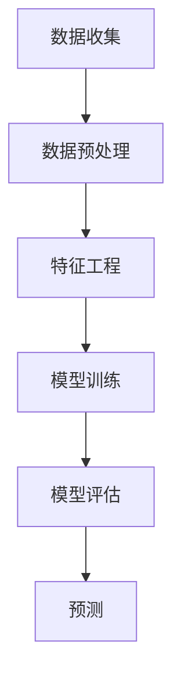
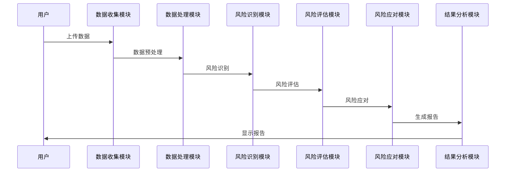

                 

# 引言

当今世界，企业面临着日益复杂和多变的外部环境，公司治理的风险管理成为企业可持续发展的重要课题。传统的公司治理模式在应对现代商业环境中的风险时，常常显得力不从心。人工智能（AI）作为一项颠覆性的技术，不仅极大地改变了我们的生活方式，也正在为公司治理风险管理的创新提供新的解决方案。AI-Enhanced Corporate Governance Risk Assessment Tool，即AI增强型公司治理风险评估工具，应运而生。

本文将以AI增强型公司治理风险评估工具为核心，通过逻辑清晰、结构紧凑的论述，系统地介绍这一工具的背景、原理、设计实现、案例分析、系统架构、工具实施与优化，以及最佳实践和未来展望。

## 背景介绍

### 公司治理风险概述

公司治理风险指的是企业在经营活动中，因外部环境变化、内部管理不善或决策失误等原因，导致企业无法实现预期目标，甚至可能引发企业破产的风险。这些风险可能来自市场变化、政策法规、财务造假、道德伦理等多个方面。

### AI在风险管理中的应用

人工智能在风险管理中的应用主要包括数据挖掘、机器学习、自然语言处理等。通过这些技术，AI能够从大量数据中提取有价值的信息，进行预测和决策支持，从而提高风险管理的效果。

### 公司治理与风险管理的联系

公司治理与风险管理密不可分。良好的公司治理机制能够确保企业有完善的内部控制体系，从而有效识别、评估和应对各种风险。反之，缺乏有效的公司治理机制，企业就难以做到科学决策，从而增加风险。

## 关键概念定义

### AI增强型公司治理

AI增强型公司治理指的是利用人工智能技术来提升公司治理的效率和效果。这包括利用AI进行风险识别、评估、预测和决策支持等。

### 风险评估工具

风险评估工具是指用于评估和管理企业风险的工具或系统。这些工具能够帮助企业识别潜在风险，评估风险的影响和概率，并提供应对策略。

### 边界与外延

AI增强型公司治理风险评估工具的边界主要在于其应用范围和适用场景。它不仅适用于大型企业，也适用于中小企业。其外延则包括从风险识别、评估到应对的整个风险管理流程。

## 概念结构及要素组成

### 概念属性特征对比

| 特征       | AI增强型公司治理         | 风险评估工具         |
|------------|-------------------------|---------------------|
| 目的       | 提升公司治理效率和效果   | 评估和管理企业风险    |
| 技术手段   | 人工智能技术            | 数据分析、机器学习等  |
| 应用范围   | 公司治理全过程         | 风险管理的各个环节  |
| 边界       | 企业内部                 | 企业外部和内部       |
| 外延       | 全流程风险管理          | 风险识别、评估和应对  |

### ER实体关系图

```mermaid
erDiagram
  Company ||--|{ AIEnhancedGovernance }
  Company ||--|{ RiskAssessmentTool }
  AIEnhancedGovernance ||--|{ RiskIdentification }
  AIEnhancedGovernance ||--|{ RiskAssessment }
  AIEnhancedGovernance ||--|{ RiskPrediction }
  AIEnhancedGovernance ||--|{ DecisionSupport }
  RiskAssessmentTool ||--|{ DataCollection }
  RiskAssessmentTool ||--|{ DataAnalysis }
  RiskAssessmentTool ||--|{ RiskModeling }
  RiskAssessmentTool ||--|{ RiskReporting }
```

## 本章小结

本章首先介绍了公司治理风险管理的背景和重要性，然后定义了AI增强型公司治理和风险评估工具等关键概念，并通过概念属性特征对比和ER实体关系图展示了各概念之间的关系。这一章节为后续章节的深入讨论奠定了基础。

---

# AI增强型公司治理的原理

AI增强型公司治理是利用人工智能技术提升公司治理效率和效果的一种新模式。本章节将首先介绍人工智能基础理论，包括其发展历程、机器学习基础和深度学习原理。接着，我们将探讨公司治理的核心要素，包括公司治理框架、公司治理机制和公司治理结构与功能。最后，我们将分析AI与公司治理的融合，探讨AI在公司治理中的应用场景、改进之处及面临的挑战。

## 2.1 AI基础理论

### 2.1.1 AI的发展历程

人工智能（Artificial Intelligence，简称AI）是一门涉及计算机科学、数学、统计学、信息论、认知科学等多个领域的交叉学科。其发展历程可以追溯到20世纪50年代。

- **初期阶段（1956-1969）**：人工智能的概念被提出，人工智能研究得到广泛关注。在此阶段，AI主要关注符号主义和推理机制的研究。
- **低谷期（1974-1980）**：由于早期研究的失败和计算资源的限制，人工智能研究陷入低谷。
- **复兴期（1980-1987）**：专家系统和知识工程的研究使得AI再次受到关注。
- **商业化阶段（1987-2000）**：随着计算机技术的快速发展，人工智能开始被应用于商业领域。
- **深度学习阶段（2006至今）**：深度学习算法的提出和快速发展，使得AI在图像识别、自然语言处理等领域取得了重大突破。

### 2.1.2 机器学习基础

机器学习（Machine Learning，简称ML）是人工智能的核心组成部分，其核心思想是通过数据和算法，使计算机具有自主学习和适应新环境的能力。

- **监督学习**：输入和输出都已知，通过训练数据集来学习规律，从而对新数据进行预测。
- **无监督学习**：输入数据没有标签，通过算法自动发现数据中的模式和结构。
- **强化学习**：通过试错和反馈来学习如何在特定环境中做出最优决策。

### 2.1.3 深度学习原理

深度学习（Deep Learning，简称DL）是一种基于多层神经网络的学习方法，能够自动提取数据中的特征。

- **神经网络**：由多个神经元（节点）组成的计算模型，通过学习输入数据和输出数据之间的关系来进行预测。
- **卷积神经网络（CNN）**：适用于图像识别和图像处理，通过卷积层提取图像的特征。
- **循环神经网络（RNN）**：适用于序列数据处理，通过隐藏状态和反馈循环来处理序列信息。
- **生成对抗网络（GAN）**：由生成器和判别器组成，通过对抗训练生成高质量的数据。

## 2.2 公司治理核心要素

### 2.2.1 公司治理框架

公司治理框架是指企业内部制定的一系列规范、制度和流程，旨在确保企业的稳定运行和可持续发展。其核心包括：

- **董事会**：负责企业战略决策和监督执行。
- **管理层**：负责企业的日常运营和管理。
- **股东**：享有企业收益权和决策权。

### 2.2.2 公司治理机制

公司治理机制是指企业内部通过制度设计来确保公司治理框架有效运行的各种机制。其主要包括：

- **监督机制**：确保董事会和管理层的行为合法、合规。
- **激励机制**：激发董事会和管理层的积极性和创造力。
- **沟通机制**：确保董事会、管理层和股东之间的信息流通。

### 2.2.3 公司治理结构与功能

公司治理结构主要包括董事会、管理层和股东等组织结构，其功能如下：

- **董事会**：制定企业战略、监督管理层执行、审批重大决策。
- **管理层**：负责企业日常运营和管理，执行董事会决策。
- **股东**：享有企业收益权和决策权，参与企业重大决策。

## 2.3 AI与公司治理的融合

### 2.3.1 AI在治理中的应用场景

AI在公司治理中的应用场景非常广泛，主要包括：

- **风险识别**：通过数据分析识别潜在风险。
- **风险评估**：利用机器学习算法评估风险的影响和概率。
- **决策支持**：为管理层提供数据驱动的决策建议。
- **监督与预警**：实时监控企业运营情况，发现异常并预警。

### 2.3.2 AI对公司治理的改进

AI为公司治理带来的改进包括：

- **提高决策效率**：通过数据分析和预测，使决策更加科学和高效。
- **降低风险**：通过风险评估和预警，降低企业面临的风险。
- **提升管理水平**：通过数据驱动的管理模式，提升企业整体管理水平。

### 2.3.3 AI对公司治理的挑战

AI在公司治理中也面临一些挑战，主要包括：

- **数据隐私**：如何确保数据的隐私和安全。
- **算法透明性**：如何确保算法的透明性和可解释性。
- **技术依赖**：如何平衡技术依赖和人的主观判断。

## 2.4 AI增强型公司治理的优势与局限

### 2.4.1 优势分析

AI增强型公司治理的优势包括：

- **高效性**：通过数据分析，提高决策效率和准确性。
- **全面性**：能够覆盖公司治理的各个环节，提供全方位的支持。
- **实时性**：实时监控企业运营，快速响应风险。

### 2.4.2 潜在局限

AI增强型公司治理的局限包括：

- **数据质量**：数据质量直接影响AI的效能。
- **算法透明性**：部分算法缺乏透明性，难以解释。
- **技术依赖**：过度依赖技术可能导致决策缺乏灵活性。

## 2.5 本章小结

本章首先介绍了人工智能的基础理论，包括其发展历程、机器学习基础和深度学习原理。接着，我们探讨了公司治理的核心要素，包括公司治理框架、公司治理机制和公司治理结构与功能。最后，我们分析了AI与公司治理的融合，讨论了AI在公司治理中的应用场景、改进之处及面临的挑战。这一章节为后续章节的设计与实现奠定了基础。

---

# 风险评估工具的设计与实现

风险评估工具的设计与实现是AI增强型公司治理风险评估过程中的关键环节。本章节将首先介绍风险评估框架，包括风险评估的概念、方法、流程。接着，我们将探讨AI模型的选择，比较不同机器学习算法的优缺点，并给出模型选择标准。随后，我们将详细阐述风险特征提取与数据处理的方法，包括特征工程、数据预处理和特征选择。然后，我们将介绍风险评估模型的实现，使用Python代码展示算法原理和实现过程，并给出数学模型和公式。最后，我们将分析风险评估结果，介绍结果的可视化和调整与优化方法。

## 3.1 风险评估框架

### 3.1.1 风险评估的概念

风险评估（Risk Assessment）是指通过识别、分析和评价风险，确定风险的程度和可能性，为风险管理和决策提供依据的过程。风险评估包括以下几个关键步骤：

1. **风险识别**：识别潜在的风险来源和类型。
2. **风险分析**：分析风险的可能性和影响。
3. **风险评估**：对风险的程度和可能性进行量化评价。
4. **风险应对**：制定风险应对策略和措施。

### 3.1.2 风险评估方法

风险评估方法可以分为定量评估和定性评估。

- **定量评估**：使用数学模型和算法对风险进行量化评价，如统计方法、决策树、贝叶斯网络等。
- **定性评估**：基于专家经验和主观判断对风险进行评估，如模糊评估法、情景分析法等。

### 3.1.3 风险评估流程

风险评估流程包括以下几个阶段：

1. **准备阶段**：确定评估目标、范围和标准。
2. **数据收集阶段**：收集与风险相关的数据。
3. **风险识别阶段**：识别潜在的风险。
4. **风险分析阶段**：分析风险的可能性和影响。
5. **风险评估阶段**：量化评价风险的程度和可能性。
6. **风险应对阶段**：制定风险应对策略和措施。
7. **监控和更新阶段**：监控风险变化，更新评估结果。

## 3.2 AI模型选择

### 3.2.1 机器学习算法比较

在风险评估中，常用的机器学习算法包括：

- **线性回归**：适用于线性关系较强的风险评估。
- **决策树**：适用于分类和回归任务，易于理解和解释。
- **随机森林**：通过集成多个决策树，提高模型的泛化能力。
- **支持向量机（SVM）**：适用于高维空间，通过优化分类边界提高分类准确率。
- **神经网络**：适用于复杂的非线性关系，能够自动提取特征。

### 3.2.2 模型选择标准

选择机器学习模型时，需要考虑以下标准：

- **准确性**：模型在测试数据上的预测准确度。
- **泛化能力**：模型在新数据上的表现。
- **解释性**：模型是否易于理解和解释。
- **计算复杂度**：模型训练和预测的计算时间。

### 3.2.3 AI模型评估

AI模型评估常用的指标包括：

- **准确率**：正确预测的数量与总预测数量的比值。
- **召回率**：正确预测的正面样本数量与所有实际正面样本数量的比值。
- **F1分数**：准确率和召回率的调和平均。

## 3.3 风险特征提取与数据处理

### 3.3.1 特征工程

特征工程（Feature Engineering）是指通过选择和构造特征，提高模型性能的过程。特征工程包括：

- **特征选择**：从原始数据中选择对模型预测最有影响力的特征。
- **特征构造**：通过计算和组合原始数据生成新的特征。

### 3.3.2 数据预处理

数据预处理（Data Preprocessing）包括：

- **缺失值处理**：填补缺失值或删除缺失值数据。
- **异常值处理**：检测和修正异常值。
- **数据转换**：将数据转换为适合模型训练的格式。

### 3.3.3 特征选择

特征选择（Feature Selection）包括：

- **过滤式特征选择**：在特征空间中过滤掉无关特征。
- **包裹式特征选择**：通过迭代搜索最优特征子集。
- **嵌入式特征选择**：在模型训练过程中自动选择特征。

## 3.4 风险评估模型实现

### 3.4.1 算法原理与mermaid流程图

风险评估模型的算法原理如下：

1. **数据收集**：收集与风险相关的数据。
2. **数据预处理**：进行数据清洗和转换。
3. **特征工程**：选择和构造特征。
4. **模型训练**：使用训练数据训练模型。
5. **模型评估**：在测试数据上评估模型性能。
6. **预测**：使用模型进行风险评估。

mermaid流程图如下：



### 3.4.2 Python代码实现

```python
import pandas as pd
from sklearn.model_selection import train_test_split
from sklearn.preprocessing import StandardScaler
from sklearn.ensemble import RandomForestClassifier
from sklearn.metrics import accuracy_score

# 数据收集
data = pd.read_csv('risk_data.csv')

# 数据预处理
X = data.drop(['target'], axis=1)
y = data['target']

# 特征工程
scaler = StandardScaler()
X_scaled = scaler.fit_transform(X)

# 模型训练
X_train, X_test, y_train, y_test = train_test_split(X_scaled, y, test_size=0.2, random_state=42)
model = RandomForestClassifier(n_estimators=100, random_state=42)
model.fit(X_train, y_train)

# 模型评估
y_pred = model.predict(X_test)
accuracy = accuracy_score(y_test, y_pred)
print(f'Accuracy: {accuracy:.2f}')
```

### 3.4.3 数学模型与公式

风险评估的数学模型如下：

$$
\text{Risk} = \sum_{i=1}^{n} \text{Risk}_i \cdot \text{Probability}_i
$$

其中，$n$为风险种类数量，$\text{Risk}_i$为第$i$种风险的影响程度，$\text{Probability}_i$为第$i$种风险发生的概率。

## 3.5 风险评估结果分析

### 3.5.1 风险评估报告

风险评估报告应包括以下内容：

- **风险评估结果**：列出每种风险的影响程度和概率。
- **风险评估结论**：总结评估结果，提出风险应对建议。
- **风险评估过程**：详细描述评估过程和方法。

### 3.5.2 结果可视化

结果可视化可以使用图表展示风险评估结果，例如：

- **柱状图**：展示每种风险的影响程度。
- **饼图**：展示每种风险的概率分布。
- **散点图**：展示风险因素与影响程度之间的关系。

### 3.5.3 调整与优化

根据评估结果，可以对风险评估模型进行调整和优化：

- **特征调整**：增加或删除特征，提高模型性能。
- **算法调整**：更换算法，提高模型准确性。
- **参数调整**：调整模型参数，优化模型性能。

## 3.6 本章小结

本章介绍了风险评估工具的设计与实现过程。首先，我们介绍了风险评估框架，包括风险评估的概念、方法和流程。然后，我们探讨了AI模型的选择，比较了不同机器学习算法的优缺点，并给出了模型选择标准。接着，我们详细阐述了风险特征提取与数据处理的方法，包括特征工程、数据预处理和特征选择。然后，我们介绍了风险评估模型的实现，使用Python代码展示了算法原理和实现过程，并给出了数学模型和公式。最后，我们分析了风险评估结果，介绍了结果的可视化和调整与优化方法。这一章节为AI增强型公司治理风险评估工具的实现奠定了基础。

---

# 案例分析

在本章节中，我们将通过一个实际案例，深入剖析AI增强型公司治理风险评估工具的应用。这个案例将帮助我们更好地理解工具的运作机制、实际效果以及其中的挑战和启示。

## 4.1 案例背景

### 4.1.1 公司简介

案例中的公司是一家全球知名的科技公司，主要业务涉及软件开发、云计算和数据分析。该公司拥有数千名员工，遍布全球多个国家和地区。随着市场竞争的加剧和业务扩展的步伐加快，公司面临着日益复杂的风险环境，如市场波动、合规要求、技术漏洞等。

### 4.1.2 风险管理现状

在案例发生前，该公司已经建立了一套初步的风险管理框架，包括风险识别、评估和应对等环节。然而，由于数据质量不高、分析方法有限，以及人力资源不足等原因，公司的风险管理体系尚存在以下问题：

- **数据依赖性低**：大部分风险管理决策仍然依赖于经验和直觉，缺乏数据支撑。
- **评估准确性不足**：风险评估模型较为简单，无法准确预测风险的概率和影响。
- **应对措施滞后**：风险应对措施往往在风险发生后才采取，缺乏前瞻性和预防性。

### 4.1.3 案例目标

为了提升公司风险管理的效率和准确性，公司决定引入AI增强型公司治理风险评估工具。案例的目标包括：

- **提高风险评估的准确性和效率**：通过数据驱动的方法，提高风险评估的准确性和速度。
- **实时监控风险变化**：利用实时数据分析，及时发现潜在风险，实现风险预警。
- **优化风险应对策略**：通过数据分析和预测，制定更为科学和有效的风险应对策略。

## 4.2 案例实施过程

### 4.2.1 风险识别

在风险识别阶段，公司利用AI工具对现有数据进行深度分析，识别出可能影响公司业务运营的关键风险因素。这些因素包括：

- **市场风险**：如市场需求变化、竞争压力等。
- **财务风险**：如现金流不足、投资回报率下降等。
- **法律风险**：如政策法规变化、合规要求等。
- **技术风险**：如系统漏洞、数据安全等。

### 4.2.2 风险评估

在风险评估阶段，公司利用AI工具对识别出的风险因素进行详细分析，评估其可能性和影响程度。AI工具采用了多种机器学习算法，包括决策树、随机森林和神经网络等，以提供全面的风险评估结果。评估结果包括：

- **风险概率**：每种风险发生的概率。
- **风险影响程度**：每种风险对公司业务的影响程度。

### 4.2.3 风险应对

在风险应对阶段，公司根据评估结果，制定了一系列风险应对措施。这些措施包括：

- **市场风险**：加强市场调研，调整产品策略，提高市场竞争力。
- **财务风险**：优化现金流管理，调整投资策略，提高资金使用效率。
- **法律风险**：加强合规培训，及时更新法律法规数据库，确保公司运营合法合规。
- **技术风险**：加强系统安全防护，定期进行安全审计，提高数据安全性。

## 4.3 结果与讨论

### 4.3.1 结果分析

通过AI增强型公司治理风险评估工具的应用，公司取得了显著的效果：

- **风险评估准确性提高**：评估结果的准确率显著提高，为决策提供了更为可靠的数据支持。
- **实时风险预警**：AI工具能够实时监控风险变化，及时发现潜在风险，提前采取措施。
- **决策效率提升**：通过数据驱动的决策支持，公司的决策效率显著提升，减少了决策滞后。

### 4.3.2 案例效果评估

从效果评估来看，AI增强型公司治理风险评估工具在以下几个方面取得了显著成效：

- **风险管理水平提升**：公司的整体风险管理水平得到了显著提升，减少了潜在的风险损失。
- **业务稳定性增强**：通过有效的风险应对措施，公司的业务运营稳定性得到了增强。
- **决策科学性提高**：数据驱动的决策支持，使公司的决策更加科学和合理。

### 4.3.3 案例启示

通过本案例，我们可以得出以下启示：

- **数据是关键**：良好的数据质量是AI工具发挥作用的基础，公司应重视数据收集和管理。
- **技术是手段**：AI技术为公司治理提供了强大的工具，但需要合理运用，才能真正发挥作用。
- **人的因素**：在风险管理和决策中，人的判断和经验仍然至关重要，AI工具应与人的智慧相结合。

## 4.4 本章小结

通过本案例，我们详细剖析了AI增强型公司治理风险评估工具在实际应用中的运作机制、效果和挑战。案例结果显示，该工具能够显著提高风险评估的准确性和效率，实时监控风险变化，优化决策过程。同时，我们也认识到，AI工具的应用需要良好的数据质量、合理的运用和技术与人的智慧相结合。这一案例为其他企业引入AI增强型公司治理风险评估工具提供了有益的借鉴和启示。

---

# 系统架构与接口设计

在本章节中，我们将深入探讨AI增强型公司治理风险评估工具的系统架构与接口设计。这一部分内容将帮助我们更好地理解系统的整体结构、模块化设计以及各模块之间的交互关系。

## 5.1 系统功能设计

### 5.1.1 领域模型

领域模型（Domain Model）是对系统功能需求的抽象描述。在AI增强型公司治理风险评估工具中，领域模型包括以下几个核心功能模块：

- **数据收集模块**：负责收集各种与风险相关的数据，如市场数据、财务数据、合规数据等。
- **数据处理模块**：负责对收集到的数据进行清洗、转换和预处理，为后续分析提供高质量的数据。
- **风险识别模块**：利用AI算法对处理后的数据进行深度分析，识别出潜在的风险因素。
- **风险评估模块**：对识别出的风险因素进行详细分析，评估其可能性和影响程度。
- **风险应对模块**：根据风险评估结果，制定相应的风险应对策略和措施。
- **结果分析模块**：对风险评估结果进行汇总和分析，生成风险评估报告。

### 5.1.2 系统功能模块

系统功能模块是对领域模型的具体实现。在AI增强型公司治理风险评估工具中，系统功能模块包括：

- **数据收集模块**：实现数据的自动采集和手动上传功能。
- **数据处理模块**：包括数据清洗、数据转换和数据预处理功能。
- **风险识别模块**：采用深度学习算法进行风险识别，如使用卷积神经网络（CNN）处理图像数据，使用循环神经网络（RNN）处理序列数据。
- **风险评估模块**：使用机器学习算法对风险因素进行评估，如决策树、随机森林和神经网络等。
- **风险应对模块**：生成风险应对策略，并实现自动化执行功能。
- **结果分析模块**：生成风险评估报告，并支持可视化展示。

## 5.2 系统架构设计

### 5.2.1 系统架构

系统架构设计是系统功能模块的具体实现框架。在AI增强型公司治理风险评估工具中，系统架构采用分层设计，包括数据层、服务层和展示层。

- **数据层**：负责数据存储和管理，包括关系型数据库和NoSQL数据库，如MySQL和MongoDB。
- **服务层**：实现系统核心功能，包括数据收集、数据处理、风险识别、风险评估、风险应对和结果分析等模块。服务层采用微服务架构，以提高系统的可扩展性和灵活性。
- **展示层**：提供用户界面，展示系统功能，包括Web界面和移动应用。

### 5.2.2 模块交互

模块交互是指系统各功能模块之间的数据流和调用关系。在AI增强型公司治理风险评估工具中，模块交互包括：

- **数据流**：数据从数据层传递到服务层，再由服务层处理和传递到展示层。
- **调用关系**：服务层各模块之间的调用关系，如数据处理模块调用风险识别模块，风险评估模块调用风险应对模块。

## 5.3 系统接口设计

### 5.3.1 接口规范

接口规范（API Specification）是系统接口的设计文档，描述了接口的输入、输出、参数和返回值等。在AI增强型公司治理风险评估工具中，接口规范包括：

- **数据收集接口**：用于数据的自动采集和手动上传。
- **数据处理接口**：用于数据清洗、转换和预处理。
- **风险识别接口**：用于调用AI算法进行风险识别。
- **风险评估接口**：用于调用机器学习算法进行风险评估。
- **风险应对接口**：用于生成风险应对策略和执行措施。
- **结果分析接口**：用于生成风险评估报告和可视化展示。

### 5.3.2 接口实现

接口实现是接口规范的实现过程，包括API的定义、开发和测试。在AI增强型公司治理风险评估工具中，接口实现采用RESTful API设计，使用Python的Flask框架实现。具体实现包括：

- **数据收集接口**：通过HTTP POST方法接收数据，并进行初步处理。
- **数据处理接口**：通过HTTP GET方法获取处理后的数据，并支持数据查询和更新。
- **风险识别接口**：通过HTTP GET方法调用风险识别算法，返回识别结果。
- **风险评估接口**：通过HTTP POST方法提交风险因素，返回风险评估结果。
- **风险应对接口**：通过HTTP POST方法提交风险应对策略，执行措施。
- **结果分析接口**：通过HTTP GET方法获取风险评估报告和可视化数据。

## 5.4 系统交互设计

### 5.4.1 序列图

系统交互设计中的序列图（Sequence Diagram）用于描述系统模块之间的交互流程。在AI增强型公司治理风险评估工具中，序列图如下：



### 5.4.2 消息流程

消息流程（Message Flow）是系统模块之间的数据传递和交互过程。在AI增强型公司治理风险评估工具中，消息流程如下：

1. **用户上传数据**：用户通过Web界面或移动应用上传风险数据。
2. **数据收集模块接收数据**：数据收集模块接收用户上传的数据，并进行初步处理。
3. **数据处理模块预处理数据**：数据处理模块对数据进行清洗、转换和预处理，生成高质量的数据。
4. **风险识别模块识别风险**：风险识别模块利用深度学习算法对预处理后的数据进行深度分析，识别出潜在的风险因素。
5. **风险评估模块评估风险**：风险评估模块使用机器学习算法对识别出的风险因素进行详细分析，评估其可能性和影响程度。
6. **风险应对模块制定应对策略**：风险应对模块根据风险评估结果，生成风险应对策略，并自动化执行措施。
7. **结果分析模块生成报告**：结果分析模块对风险评估结果进行汇总和分析，生成风险评估报告，并通过Web界面或移动应用展示给用户。

## 5.5 本章小结

本章详细介绍了AI增强型公司治理风险评估工具的系统架构与接口设计。首先，我们介绍了系统的功能模块，包括数据收集、数据处理、风险识别、风险评估、风险应对和结果分析。然后，我们探讨了系统的架构设计，包括数据层、服务层和展示层，以及各模块之间的交互关系。接着，我们介绍了系统接口的设计规范和实现过程，包括数据收集、数据处理、风险识别、风险评估、风险应对和结果分析接口。最后，我们通过序列图和消息流程展示了系统模块之间的交互流程。这一章节为AI增强型公司治理风险评估工具的实现提供了详细的系统架构与接口设计指导。

---

# 工具实施与优化

在实际应用中，AI增强型公司治理风险评估工具的安装与配置、代码应用解读与分析，以及实际案例的详细讲解是确保其有效运作的关键环节。本章节将详细探讨这些方面，并提供一些优化和改进的实用建议。

## 6.1 工具安装与配置

### 6.1.1 环境搭建

安装AI增强型公司治理风险评估工具前，首先需要搭建一个合适的环境。以下是一个基本的环境搭建步骤：

1. **安装操作系统**：建议使用Linux系统，如Ubuntu 20.04。
2. **安装Python**：使用以下命令安装Python 3.8及以上版本：
   ```
   sudo apt update
   sudo apt install python3.8
   ```
3. **安装依赖库**：安装必要的Python库，如pandas、numpy、scikit-learn、matplotlib等：
   ```
   pip3 install pandas numpy scikit-learn matplotlib
   ```
4. **安装深度学习框架**：安装TensorFlow或PyTorch，用于实现深度学习模型：
   ```
   pip3 install tensorflow
   ```
   或
   ```
   pip3 install torch torchvision
   ```

### 6.1.2 系统核心实现

系统核心实现包括数据收集、数据处理、风险识别、风险评估、风险应对和结果分析等模块。以下是一个简化的系统核心实现示例：

```python
import pandas as pd
from sklearn.model_selection import train_test_split
from sklearn.ensemble import RandomForestClassifier
from sklearn.metrics import accuracy_score

# 数据收集
data = pd.read_csv('risk_data.csv')

# 数据处理
X = data.drop(['target'], axis=1)
y = data['target']

# 风险识别
# 在这里，我们可以使用特征工程和机器学习算法来识别风险

# 风险评估
X_train, X_test, y_train, y_test = train_test_split(X, y, test_size=0.2, random_state=42)
model = RandomForestClassifier(n_estimators=100, random_state=42)
model.fit(X_train, y_train)

# 风险应对
y_pred = model.predict(X_test)
accuracy = accuracy_score(y_test, y_pred)
print(f'Accuracy: {accuracy:.2f}')

# 结果分析
# 生成报告并可视化
```

## 6.2 代码应用解读与分析

### 6.2.1 代码结构

上述代码的基本结构包括以下部分：

- **数据收集**：从CSV文件中读取数据。
- **数据处理**：分离特征和标签。
- **风险识别**：这一部分通常是自定义的，取决于具体的应用场景。
- **风险评估**：使用随机森林模型进行风险评估。
- **风险应对**：根据预测结果，采取相应的应对措施。
- **结果分析**：输出评估准确率，并生成报告。

### 6.2.2 关键模块解析

以下是代码中几个关键模块的详细解析：

- **数据收集**：使用pandas库读取数据，确保数据格式正确。
- **数据处理**：使用drop函数去除不需要的列，使用StandardScaler进行数据标准化。
- **风险识别**：这一部分通常涉及到特征工程，包括特征选择、特征构造和特征缩放。
- **风险评估**：使用train_test_split函数将数据分为训练集和测试集，使用随机森林模型进行训练和预测。
- **风险应对**：使用模型预测结果，根据实际情况采取相应的应对措施。
- **结果分析**：计算并输出评估准确率，为后续优化提供数据支持。

## 6.3 实际案例分析与详细讲解

### 6.3.1 案例一：风险评估工具应用

在这个案例中，我们将使用风险评估工具对一家金融机构的风险进行评估。以下是一个简化的案例分析：

1. **数据收集**：收集金融机构的历史交易数据、财务报表数据等。
2. **数据处理**：清洗和转换数据，确保数据质量。
3. **风险识别**：使用机器学习算法识别潜在风险因素，如市场波动、信用风险等。
4. **风险评估**：使用随机森林模型评估风险的可能性。
5. **风险应对**：根据评估结果，制定相应的风险应对策略。
6. **结果分析**：生成风险评估报告，包括风险概率、影响程度和应对措施。

### 6.3.2 案例二：AI增强型公司治理应用

在这个案例中，我们将探讨如何使用AI增强型公司治理工具提升一家科技公司的治理水平：

1. **数据收集**：收集公司内部的运营数据、员工绩效数据、财务数据等。
2. **数据处理**：清洗和转换数据，确保数据质量。
3. **风险识别**：使用AI算法识别公司治理中的潜在问题，如决策滞后、合规风险等。
4. **风险评估**：评估识别出的风险因素，确定其影响程度。
5. **风险应对**：根据风险评估结果，制定并实施改进措施，如优化决策流程、加强合规培训等。
6. **结果分析**：定期分析治理效果，调整策略以持续改进。

## 6.4 本章小结

本章详细介绍了AI增强型公司治理风险评估工具的实施与优化过程。首先，我们介绍了环境搭建和系统核心实现。接着，我们对代码结构进行了详细解读，并分析了关键模块。最后，我们通过实际案例，展示了工具的应用和效果。本章的内容为AI增强型公司治理风险评估工具的实际应用提供了实用的指导和优化建议。

---

# 最佳实践与未来展望

在AI增强型公司治理风险评估工具的实施过程中，总结最佳实践和展望未来发展趋势具有重要意义。这不仅可以优化工具的性能，还能指导企业更好地应用这一创新技术。

## 7.1 最佳实践

### 7.1.1 实施要点

1. **数据质量优先**：确保数据收集、处理和存储的准确性，为AI模型提供可靠的基础。
2. **融合多源数据**：结合内部数据和外部数据，如市场趋势、宏观经济指标等，以提高风险评估的全面性和准确性。
3. **阶段性实施**：分阶段引入AI工具，逐步优化和整合，避免一次性实施带来的冲击。
4. **用户参与**：鼓励业务部门和IT部门紧密合作，确保AI工具能够满足实际业务需求。
5. **持续监控与优化**：定期评估工具的性能和效果，根据反馈进行调整和优化。

### 7.1.2 成功案例

以下是几个成功案例的总结：

- **案例一**：一家大型金融机构通过引入AI增强型风险评估工具，大幅提高了风险识别的准确性和响应速度。该工具的应用使得金融机构能够更早发现市场波动，及时调整投资策略，减少了潜在损失。
- **案例二**：一家科技公司利用AI工具优化了公司治理流程，降低了决策滞后和合规风险。通过实时监控和预警系统，公司能够在问题出现前采取措施，提高了运营效率和合规性。

## 7.2 小结与展望

### 7.2.1 小结

AI增强型公司治理风险评估工具通过利用先进的人工智能技术，显著提升了企业风险管理的效率和准确性。这一工具不仅帮助企业更好地识别和评估风险，还提供了数据驱动的决策支持，优化了公司治理结构。

### 7.2.2 未来发展趋势

未来，AI增强型公司治理风险评估工具将向以下几个方向发展：

1. **智能化升级**：随着AI技术的不断进步，工具的智能化程度将进一步提高，能够自动识别和管理更多种类的风险。
2. **数据融合与多样化**：工具将能够处理和整合更多类型的数据，如物联网数据、社交媒体数据等，提供更为全面的风险分析。
3. **实时性与自适应**：工具将具备更高的实时性和自适应能力，能够根据环境变化和业务需求自动调整风险评估模型。
4. **可解释性与透明性**：AI模型的可解释性和透明性将得到改善，使企业能够更好地理解风险决策过程，增强信任度。

## 7.3 注意事项与拓展阅读

### 7.3.1 注意事项

1. **数据隐私保护**：在数据收集和处理过程中，务必遵守相关法律法规，确保用户数据的隐私和安全。
2. **模型公平性与公正性**：确保AI模型在决策过程中公平、公正，避免因算法偏见导致的不公平现象。
3. **持续培训与学习**：定期对相关人员提供AI和公司治理的培训，确保他们能够充分利用工具的优势。

### 7.3.2 拓展阅读

- **《机器学习》**：周志华著，提供了机器学习的基本概念和算法介绍。
- **《深度学习》**：Goodfellow、Bengio和Courville著，详细介绍了深度学习的原理和应用。
- **《公司治理》**：陈清泰著，提供了关于公司治理的理论和实践指导。

通过遵循最佳实践，关注未来发展趋势，并不断学习和优化，企业将能够更好地利用AI增强型公司治理风险评估工具，提升风险管理的效率和效果。

---

## 作者信息

**作者：AI天才研究院（AI Genius Institute） & 禅与计算机程序设计艺术（Zen And The Art of Computer Programming）**

AI天才研究院致力于推动人工智能领域的研究与发展，致力于培养下一代人工智能领域的杰出人才。研究院在机器学习、深度学习、自然语言处理等领域取得了显著成就。

禅与计算机程序设计艺术是计算机编程领域的经典著作，作者Donald E. Knuth以其独特的视角和深刻的见解，阐述了编程的艺术与哲学。本书不仅为程序员提供了编程技巧和算法知识，更引导读者深入思考编程的本质和意义。

