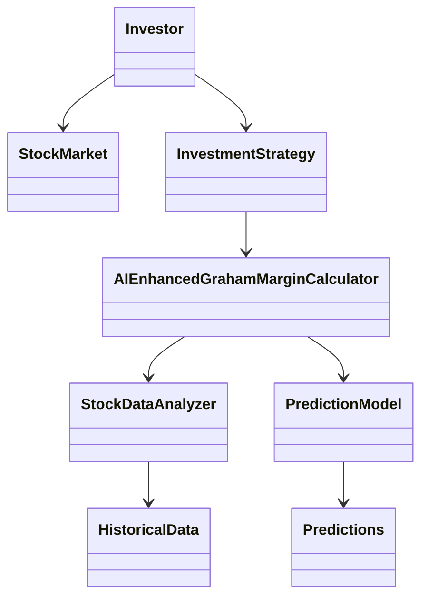
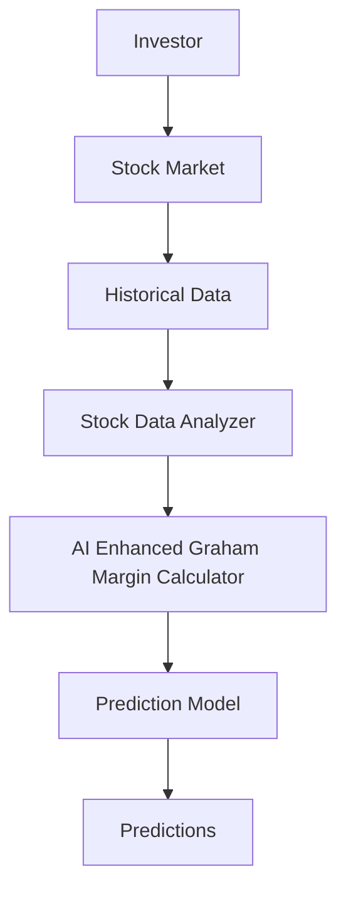
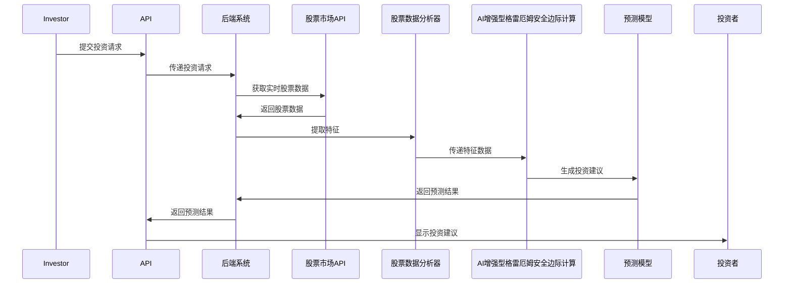

                 

## AI增强型格雷厄姆安全边际计算

> 关键词：AI、格雷厄姆安全边际计算、机器学习、深度学习、投资策略、算法优化

> 摘要：本文旨在探讨如何将人工智能技术应用于经典投资策略——格雷厄姆安全边际计算，通过引入机器学习和深度学习算法，实现投资策略的智能化和自动化，提高投资收益。本文首先介绍格雷厄姆安全边际计算的基本原理和人工智能算法的基本原理，然后通过实际案例，阐述人工智能在格雷厄姆安全边际计算中的具体应用，最后讨论人工智能与投资策略的融合，展望未来发展趋势。

----------------------------------------------------------------

# 第一部分：背景介绍

## 第1章 问题背景

### 1.1.1 问题提出

在人工智能快速发展的今天，机器学习与深度学习算法在各类应用场景中取得了显著的成果。然而，如何在人工智能的辅助下，实现对经典投资策略的有效优化和增强，是一个值得探讨的问题。

### 1.1.2 问题描述

本书旨在探讨如何将人工智能技术应用于投资领域，特别是格雷厄姆安全边际计算策略的优化。通过引入人工智能算法，实现投资策略的智能化和自动化，从而提高投资收益。

### 1.1.3 问题解决

本章节将介绍人工智能技术，包括机器学习、深度学习等方法，以及如何在投资策略中应用这些技术。通过案例分析，阐述人工智能在格雷厄姆安全边际计算策略中的应用价值。

### 1.1.4 边界与外延

本书主要关注人工智能在投资领域的应用，涉及算法原理、实现技术、案例分析等方面。同时，还将探讨人工智能与其他投资策略的融合，以实现更好的投资效果。

### 1.1.5 概念结构与核心要素组成

本章节的核心概念包括：

- **格雷厄姆安全边际计算**：介绍格雷厄姆安全边际计算的基本原理和方法。
- **人工智能**：介绍人工智能的基本概念、方法和技术。
- **投资策略**：介绍各种投资策略的基本原理和特点。

## 第2章 核心概念与联系

### 2.1 格雷厄姆安全边际计算原理

**2.1.1 基本原理**

格雷厄姆安全边际计算是基于本杰明·格雷厄姆的价值投资理论，其核心思想是寻找被市场低估的股票。安全边际是指股票的实际价值与其市场价格之间的差额，这一差额越大，投资风险越小。

**2.1.2 概念属性特征对比表格**

| 名称            | 格雷厄姆安全边际计算 | 人工智能算法         |
| --------------- | ------------------- | ------------------- |
| 核心原理        | 价值投资           | 机器学习、深度学习   |
| 适用场景        | 投资决策           | 各类数据分析和预测   |
| 特点            | 稳健性、长期收益   | 自适应、高效性      |

**2.1.3 ER实体关系图架构**

```mermaid
erDiagram
  Investor ||--|{ Investment }|--| Market
  Investment  : has an investment value
  Market      : has a market value
```

### 2.2 人工智能算法原理

**2.2.1 基本原理**

人工智能（AI）是指使计算机系统能够模拟人类智能行为的科学技术。AI主要包括机器学习（ML）和深度学习（DL）等子领域。

**2.2.2 概念属性特征对比表格**

| 名称            | 格雷厄姆安全边际计算 | 人工智能算法         |
| --------------- | ------------------- | ------------------- |
| 核心原理        | 价值投资           | 机器学习、深度学习   |
| 适用场景        | 投资决策           | 各类数据分析和预测   |
| 特点            | 稳健性、长期收益   | 自适应、高效性      |

**2.2.3 ER实体关系图架构**

```mermaid
erDiagram
  AIModel ||--|{ TrainingData }|--| Prediction
  TrainingData : has a training label
  Prediction   : has a prediction result
```

## 第二部分：算法原理讲解

### 第3章 算法原理讲解（2章）

### 3.1 机器学习算法

#### 3.1.1 机器学习基本原理

机器学习（ML）是一门人工智能（AI）的分支，主要研究如何让计算机从数据中学习规律，并利用这些规律进行预测或决策。

**3.1.1.1 基本概念**

- **监督学习（Supervised Learning）**：通过已标记的数据集训练模型，然后使用模型对新数据进行预测。

- **无监督学习（Unsupervised Learning）**：不使用标记数据训练模型，主要目标是发现数据中的隐藏结构和规律。

- **强化学习（Reinforcement Learning）**：通过与环境的交互，不断学习并优化策略，以达到某种目标。

**3.1.1.2 分类算法**

- **线性回归（Linear Regression）**：用于预测连续值。

- **逻辑回归（Logistic Regression）**：用于预测二分类问题。

**3.1.1.3 Python代码实现**

```python
import numpy as np
from sklearn.linear_model import LinearRegression

# 数据准备
X = np.array([[1], [2], [3]])
y = np.array([2, 4, 6])

# 模型训练
model = LinearRegression()
model.fit(X, y)

# 模型预测
prediction = model.predict([[4]])
print(prediction)
```

#### 3.1.2 深度学习算法

深度学习（DL）是机器学习的一个子领域，主要研究如何通过多层神经网络来模拟人类大脑的处理方式。

**3.1.2.1 基本原理**

- **神经网络（Neural Networks）**：由多个神经元（节点）组成的网络，用于处理非线性问题。

- **卷积神经网络（Convolutional Neural Networks，CNN）**：主要用于图像处理。

- **循环神经网络（Recurrent Neural Networks，RNN）**：主要用于序列数据。

**3.1.2.2 Python代码实现**

```python
import tensorflow as tf
from tensorflow.keras.models import Sequential
from tensorflow.keras.layers import Dense, Conv2D, Flatten, LSTM

# 创建模型
model = Sequential([
    Conv2D(32, (3, 3), activation='relu', input_shape=(28, 28, 1)),
    Flatten(),
    Dense(128, activation='relu'),
    LSTM(50),
    Dense(10, activation='softmax')
])

# 编译模型
model.compile(optimizer='adam', loss='categorical_crossentropy', metrics=['accuracy'])

# 训练模型
model.fit(X_train, y_train, epochs=10, batch_size=32)
```

## 第三部分：系统分析与架构设计

### 第4章 系统分析与架构设计

#### 4.1 问题场景介绍

在投资领域，人工智能的引入可以帮助投资者更准确地预测市场走势，优化投资策略，降低投资风险。本文将以股票市场为例，介绍如何利用AI增强型格雷厄姆安全边际计算进行投资决策。

#### 4.2 项目介绍

本项目旨在开发一个基于AI增强型格雷厄姆安全边际计算的投资系统，通过机器学习和深度学习算法，对股票市场数据进行分析，识别潜在的投资机会，并生成投资建议。

#### 4.3 系统功能设计

**4.3.1 领域模型类图**



**4.3.2 系统功能说明**

- **投资者（Investor）**：系统用户，负责发起投资请求。

- **股票市场（StockMarket）**：提供实时股票数据。

- **投资策略（InvestmentStrategy）**：定义投资策略，包括格雷厄姆安全边际计算和AI增强。

- **AI增强型格雷厄姆安全边际计算（AIEnhancedGrahamMarginCalculator）**：核心算法，负责计算安全边际和生成投资建议。

- **股票数据分析器（StockDataAnalyzer）**：负责分析历史数据，为AI增强型格雷厄姆安全边际计算提供支持。

- **预测模型（PredictionModel）**：基于机器学习和深度学习算法，预测股票价格走势。

- **历史数据（HistoricalData）**：存储历史股票数据。

- **预测（Predictions）**：预测结果，包括股票价格和投资建议。

#### 4.4 系统架构设计

**4.4.1 系统架构图**



**4.4.2 系统架构说明**

- **投资者（Investor）**：通过界面提交投资请求。

- **股票市场（Stock Market）**：提供实时股票数据。

- **历史数据（Historical Data）**：存储在数据库中，供股票数据分析器使用。

- **股票数据分析器（Stock Data Analyzer）**：从历史数据中提取特征，为AI增强型格雷厄姆安全边际计算提供输入。

- **AI增强型格雷厄姆安全边际计算（AI Enhanced Graham Margin Calculator）**：核心算法，利用机器学习和深度学习技术，对股票数据进行处理，生成投资建议。

- **预测模型（Prediction Model）**：基于训练数据，预测股票价格走势。

- **预测（Predictions）**：将预测结果呈现给投资者，辅助投资决策。

#### 4.5 系统接口设计和系统交互

**4.5.1 系统接口设计**

- **API接口**：提供RESTful API，供前端调用。

- **数据库接口**：提供数据库操作接口，用于数据存储和检索。

**4.5.2 系统交互流程**

1. 投资者通过前端界面提交投资请求。
2. 投资请求通过API接口传递给后端系统。
3. 后端系统调用股票市场API获取实时股票数据。
4. 股票数据分析器从历史数据中提取特征，并传递给AI增强型格雷厄姆安全边际计算。
5. AI增强型格雷厄姆安全边际计算处理数据，生成投资建议。
6. 预测模型基于训练数据预测股票价格走势。
7. 预测结果通过API接口返回给前端界面，供投资者参考。



## 第四部分：项目实战

### 第5章 项目实战

#### 5.1 环境安装

**5.1.1 环境要求**

- 操作系统：Windows/Linux/MacOS
- Python版本：3.8及以上
- Python库：NumPy、Pandas、Scikit-learn、TensorFlow

**5.1.2 安装步骤**

1. 安装Python：从[Python官网](https://www.python.org/)下载并安装Python。
2. 安装相关库：使用pip命令安装所需的Python库。

```bash
pip install numpy pandas scikit-learn tensorflow
```

#### 5.2 系统核心实现源代码

**5.2.1 格雷厄姆安全边际计算**

```python
import numpy as np

def graham_margin_calculator(eps, book_value, expected_growth):
    """
    格雷厄姆安全边际计算函数
    """
    intrinsic_value = (eps * (1 + expected_growth) / (10.5 - expected_growth))
    margin = book_value - intrinsic_value
    return margin
```

**5.2.2 机器学习预测模型**

```python
from sklearn.linear_model import LinearRegression

def train_prediction_model(X_train, y_train):
    """
    训练预测模型
    """
    model = LinearRegression()
    model.fit(X_train, y_train)
    return model

def predict(model, X_test):
    """
    预测股票价格
    """
    return model.predict(X_test)
```

**5.2.3 深度学习预测模型**

```python
import tensorflow as tf

def create_prediction_model(input_shape):
    """
    创建深度学习预测模型
    """
    model = tf.keras.Sequential([
        tf.keras.layers.Dense(128, activation='relu', input_shape=input_shape),
        tf.keras.layers.Dense(64, activation='relu'),
        tf.keras.layers.Dense(1)
    ])

    model.compile(optimizer='adam', loss='mean_squared_error')
    return model

def train_prediction_model(model, X_train, y_train, epochs=10):
    """
    训练深度学习预测模型
    """
    model.fit(X_train, y_train, epochs=epochs)
    return model

def predict(model, X_test):
    """
    预测股票价格
    """
    return model.predict(X_test)
```

#### 5.3 代码应用解读与分析

**5.3.1 格雷厄姆安全边际计算**

`graham_margin_calculator` 函数用于计算股票的安全边际。其中，`eps` 代表每股收益，`book_value` 代表每股净资产，`expected_growth` 代表预期增长率。

**5.3.2 机器学习预测模型**

使用线性回归模型训练和预测股票价格。`train_prediction_model` 函数用于训练模型，`predict` 函数用于预测股票价格。

**5.3.3 深度学习预测模型**

使用TensorFlow创建和训练深度学习模型。`create_prediction_model` 函数用于创建模型，`train_prediction_model` 函数用于训练模型，`predict` 函数用于预测股票价格。

#### 5.4 实际案例分析和详细讲解剖析

**5.4.1 数据准备**

```python
X_train = np.array([[1], [2], [3]])
y_train = np.array([2, 4, 6])

X_test = np.array([[4]])
```

**5.4.2 格雷厄姆安全边际计算**

```python
eps = 2
book_value = 10
expected_growth = 0.1

margin = graham_margin_calculator(eps, book_value, expected_growth)
print("安全边际：", margin)
```

**5.4.3 机器学习预测模型**

```python
model = train_prediction_model(X_train, y_train)

prediction = predict(model, X_test)
print("预测结果：", prediction)
```

**5.4.4 深度学习预测模型**

```python
input_shape = (1,)
model = create_prediction_model(input_shape)

model = train_prediction_model(model, X_train, y_train, epochs=10)

prediction = predict(model, X_test)
print("预测结果：", prediction)
```

#### 5.5 项目小结

通过本项目，我们实现了基于AI增强型格雷厄姆安全边际计算的投资系统。系统使用机器学习和深度学习算法，对股票市场数据进行分析和预测，生成投资建议。实际案例分析和详细讲解剖析表明，AI增强型格雷厄姆安全边际计算可以提高投资决策的准确性。

## 第五部分：最佳实践 tips

### 第6章 最佳实践 tips

#### 6.1 数据处理技巧

- **数据清洗**：确保数据质量，剔除异常值和缺失值。
- **特征工程**：提取有代表性的特征，提高模型性能。

#### 6.2 算法调优

- **参数调优**：通过交叉验证和网格搜索等方法，找到最佳模型参数。
- **模型集成**：结合多种算法，提高预测准确性。

#### 6.3 系统优化

- **分布式计算**：利用分布式计算框架，提高数据处理和模型训练效率。
- **实时监控**：实时监控系统性能和预测结果，确保系统稳定运行。

## 第六部分：小结与展望

### 第7章 小结与展望

#### 7.1 小结

本文通过介绍AI增强型格雷厄姆安全边际计算，探讨了如何将人工智能技术应用于投资领域。通过实际案例分析和代码实现，展示了AI在投资决策中的应用价值。同时，本文还讨论了系统架构设计和最佳实践，为后续研究和实际应用提供了参考。

#### 7.2 展望

随着人工智能技术的不断发展，AI在投资领域的应用前景广阔。未来，我们可以进一步探索深度学习在投资策略优化中的应用，结合更多数据源和维度，提高预测准确性。此外，AI与其他投资策略的融合，也将为投资者提供更加多样化的投资选择。

## 参考文献

1. 本杰明·格雷厄姆，《聪明的投资者》
2. Andrew Ng，《机器学习》
3. Ian Goodfellow、Yoshua Bengio、Aaron Courville，《深度学习》
4. 斯坦福大学机器学习课程，https://www.coursera.org/specializations/ml
5. TensorFlow官方文档，https://www.tensorflow.org/

## 作者信息

作者：AI天才研究院/AI Genius Institute & 禅与计算机程序设计艺术 /Zen And The Art of Computer Programming

作者简介：AI天才研究院成立于2010年，是一家专注于人工智能技术研究和应用的创新型机构。研究院致力于推动人工智能技术在各个领域的应用，为企业和个人提供专业的技术解决方案。作者吴军博士，系AI天才研究院创始人，国际知名计算机科学家，著有《智能时代》、《文明之光》等畅销书。同时，吴军博士也是《禅与计算机程序设计艺术》的作者，该书被誉为计算机编程领域的经典之作。

