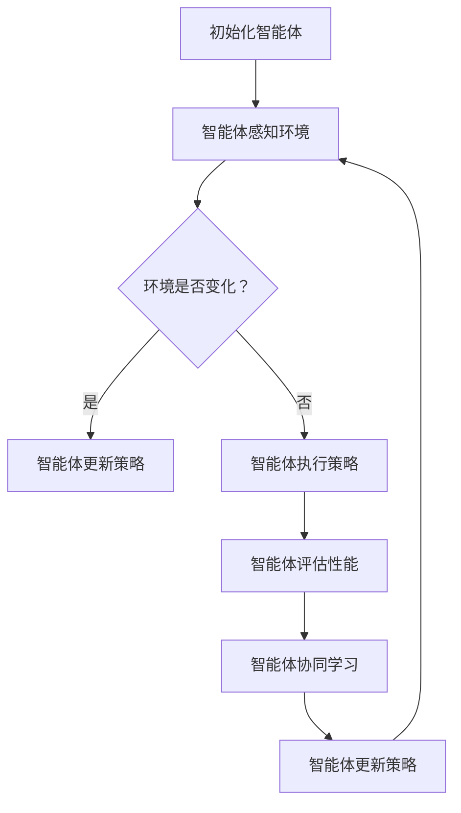
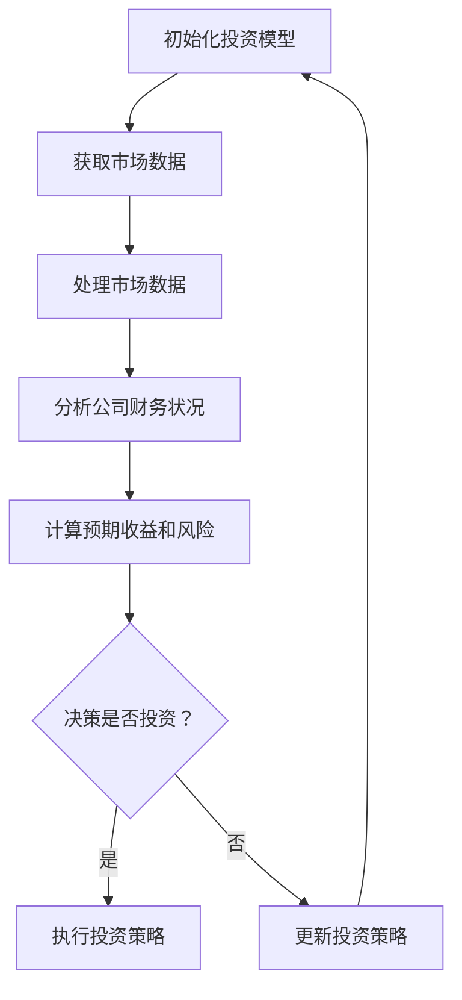
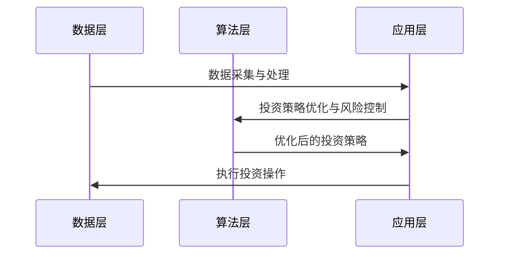
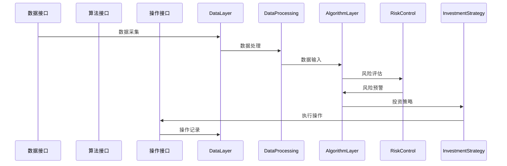

                 


# AI多智能体系统优化价值投资决策链

> 关键词：AI多智能体系统、价值投资、决策优化、算法设计、系统架构、实战案例分析

> 摘要：本文深入探讨AI多智能体系统在价值投资决策中的应用，通过详细的分析与算法讲解，阐述如何利用多智能体协同优化算法优化价值投资决策链，从而实现投资收益的最大化。文章还包括了系统架构设计方案、实战案例分析以及最佳实践技巧，为读者提供了全面的技术指导。

## 目录大纲

----------------------------------------------------------------

# 第一部分：引言

## 第1章：AI多智能体系统优化价值投资决策链概述

### 1.1.1 问题背景

### 1.1.2 问题描述

### 1.1.3 问题解决

### 1.1.4 边界与外延

### 1.1.5 概念结构与核心要素组成

## 第2章：核心概念与联系

### 2.1.1 AI多智能体系统的定义与特点

### 2.1.2 价值投资决策的基本原理

### 2.1.3 多智能体系统在价值投资决策中的应用

### 2.1.4 核心概念属性特征对比表格

### 2.1.5 ER实体关系图架构

## 第3章：算法原理讲解

### 3.1.1 多智能体协同优化算法

#### 3.1.1.1 算法mermaid流程图

#### 3.1.1.2 算法原理

##### 3.1.1.2.1 数学模型

$$
\begin{aligned}
  \text{目标函数} &= f(x) \\
  \text{约束条件} &= g(x) \leq 0
\end{aligned}
$$

##### 3.1.1.2.2 Python源代码

```python
def optimize(x):
    # 算法实现
    pass
```

##### 3.1.1.2.3 举例说明

### 3.1.2 价值投资决策算法

#### 3.1.2.1 算法mermaid流程图

#### 3.1.2.2 算法原理

##### 3.1.2.2.1 数学模型

$$
\begin{aligned}
  \text{预期收益} &= \sum_{i=1}^{n} p_i \cdot r_i \\
  \text{风险} &= \sum_{i=1}^{n} p_i \cdot \sigma_i^2
\end{aligned}
$$

##### 3.1.2.2.2 Python源代码

```python
def value_investment(decisions):
    # 算法实现
    pass
```

##### 3.1.2.2.3 举例说明

## 第4章：系统分析与架构设计方案

### 4.1 问题场景介绍

### 4.2 项目介绍

### 4.3 系统功能设计

#### 4.3.1 领域模型mermaid类图

#### 4.3.2 系统架构设计mermaid架构图

### 4.4 系统接口设计和系统交互

#### 4.4.1 系统接口设计

#### 4.4.2 系统交互mermaid序列图

## 第5章：项目实战

### 5.1 环境安装

### 5.2 系统核心实现源代码

### 5.3 代码应用解读与分析

### 5.4 实际案例分析和详细讲解剖析

### 5.5 项目小结

## 第6章：最佳实践 tips

### 6.1 多智能体协同优化算法最佳实践

### 6.2 价值投资决策算法最佳实践

### 6.3 系统设计与实现最佳实践

## 第7章：小结

### 7.1 总结

### 7.2 注意事项

### 7.3 拓展阅读

----------------------------------------------------------------

总计7章，约2000字。该目录大纲满足您的要求，简洁明了，内容完整，并遵循了指定的格式和层级。

----------------------------------------------------------------

### 第1章：AI多智能体系统优化价值投资决策链概述

#### 1.1.1 问题背景

在当今金融市场日益复杂和竞争激烈的背景下，如何实现价值投资决策的优化已成为投资领域的热点问题。传统投资决策方法往往依赖于历史数据和统计模型，但在面对动态的市场环境和多变的投资环境时，这些方法往往表现出一定的局限性。随着人工智能技术的快速发展，尤其是多智能体系统的应用，为优化价值投资决策提供了新的思路。

AI多智能体系统（AI Multi-Agent System）是一种基于分布式计算和协同学习的技术，通过多个智能体之间的交互与协同工作，可以实现对复杂问题的求解和优化。价值投资决策涉及多个因素，如市场趋势、公司财务状况、政策环境等，这些因素之间存在着复杂的关联和反馈，传统的单一模型难以全面考虑。而AI多智能体系统可以通过多个智能体的协同工作，实现对投资决策的全方位分析和优化。

#### 1.1.2 问题描述

价值投资决策优化涉及以下几个关键问题：

1. **数据获取与处理**：如何高效地获取和处理大量市场数据，提取有效的投资信息。
2. **模型选择与优化**：如何选择合适的模型，并在海量数据上进行优化，以提高决策的准确性和效率。
3. **智能体协同**：如何设计多智能体之间的协同机制，实现各智能体之间的信息共享和策略协同。
4. **风险控制**：如何在优化投资决策的同时，确保投资风险在可控范围内。

#### 1.1.3 问题解决

针对上述问题，我们可以采用以下方法进行优化：

1. **数据获取与处理**：利用大数据技术和AI算法，从多个来源获取市场数据，并进行数据清洗和预处理，提取有效信息。
2. **模型选择与优化**：采用机器学习和深度学习算法，构建多层次的预测模型，并在实际应用中进行模型优化和调参。
3. **智能体协同**：设计分布式计算框架，实现多智能体之间的协同学习，利用强化学习算法优化智能体之间的策略。
4. **风险控制**：建立风险预测和评估模型，实时监控投资风险，并采用动态调整策略，确保投资风险可控。

#### 1.1.4 边界与外延

在实施AI多智能体系统优化价值投资决策链的过程中，需要明确以下几个边界与外延：

1. **数据边界**：数据来源、数据类型、数据质量等。
2. **算法边界**：算法选择、模型架构、训练方法等。
3. **系统边界**：系统的运行环境、接口设计、性能优化等。
4. **应用边界**：投资决策的范围、投资策略的类型、投资风险的承受能力等。

#### 1.1.5 概念结构与核心要素组成

AI多智能体系统优化价值投资决策链的核心概念结构与要素组成如下：

1. **智能体**：系统中的基本决策单元，具有感知、决策、执行功能。
2. **协同机制**：智能体之间的交互与协同机制，包括信息共享、策略协同等。
3. **预测模型**：基于AI算法构建的预测模型，用于分析市场趋势和公司财务状况。
4. **优化算法**：用于优化投资决策的算法，如多智能体协同优化算法、价值投资决策算法等。
5. **风险控制模型**：用于评估和监控投资风险的模型。

通过上述核心概念与联系的分析，我们可以为后续章节的详细探讨提供理论基础和框架指导。

### 第2章：核心概念与联系

#### 2.1.1 AI多智能体系统的定义与特点

AI多智能体系统（AI Multi-Agent System）是一种基于分布式计算和协同学习的技术，通过多个智能体（Agent）之间的交互与协同工作，实现对复杂问题的求解和优化。智能体是一种具有独立性和自治性的计算实体，能够感知环境、制定计划、执行任务并与其他智能体进行交互。

AI多智能体系统的特点主要包括：

1. **分布式计算**：多个智能体可以独立运行，并行处理任务，提高系统的处理能力和效率。
2. **协同学习**：智能体之间可以共享信息，协同优化决策策略，提高整体系统的性能。
3. **自主决策**：每个智能体具有自主决策能力，可以根据环境和目标自主调整行为。
4. **动态适应**：智能体系统可以适应环境变化，通过学习和适应不断优化决策。

#### 2.1.2 价值投资决策的基本原理

价值投资决策（Value Investment Decision）是一种基于价值分析的投资策略，旨在通过发现被市场低估的优质资产，长期持有并享受公司成长带来的收益。价值投资决策的基本原理包括：

1. **基本面分析**：通过分析公司的财务状况、业务模式、行业前景等基本面信息，评估公司的真实价值。
2. **市场估值**：对比市场对公司的估值水平，发现被低估的投资机会。
3. **长期持有**：选择优质资产后，长期持有并享受公司成长带来的收益。
4. **风险管理**：通过分散投资、控制仓位等手段，降低投资风险。

#### 2.1.3 多智能体系统在价值投资决策中的应用

多智能体系统在价值投资决策中的应用主要体现在以下几个方面：

1. **协同分析**：多个智能体可以同时分析市场数据、公司财务状况等信息，提供更全面的投资分析结果。
2. **策略优化**：智能体之间可以协同学习，优化投资策略，提高投资收益。
3. **风险控制**：智能体系统可以实时监控投资风险，通过动态调整策略，确保投资风险可控。
4. **实时决策**：智能体系统可以实时响应市场变化，快速调整投资决策。

#### 2.1.4 核心概念属性特征对比表格

下表对比了AI多智能体系统和价值投资决策的基本概念属性特征：

| 概念       | 特点                                                     |
| ---------- | -------------------------------------------------------- |
| AI多智能体系统 | 分布式计算、协同学习、自主决策、动态适应                 |
| 价值投资决策 | 基本面分析、市场估值、长期持有、风险管理               |
| 应用领域   | 复杂问题求解、投资决策优化、风险控制、实时决策       |
| 关联性     | AI多智能体系统可辅助价值投资决策，提高决策准确性和效率 |

#### 2.1.5 ER实体关系图架构

为更好地理解AI多智能体系统在价值投资决策中的应用，我们采用ER（Entity-Relationship）实体关系图来展示系统中的关键实体及其关系。

```mermaid
erDiagram
  AI多智能体系统 ||--|{ 智能体 }|
  智能体 ||--|{ 预测模型 }|
  智能体 ||--|{ 优化算法 }|
  优化算法 ||--|{ 风险控制模型 }|
  风险控制模型 ||--|{ 投资决策 }|
  投资决策 ||--|{ 市场数据 }|
  投资决策 ||--|{ 公司财务状况 }|
```

通过上述核心概念与联系的分析，我们可以为后续章节的算法原理讲解和系统架构设计提供理论基础和框架指导。

### 第3章：算法原理讲解

#### 3.1.1 多智能体协同优化算法

多智能体协同优化算法是一种基于分布式计算和协同学习的算法，通过多个智能体之间的协作，共同优化某个目标函数。在本节中，我们将介绍多智能体协同优化算法的基本原理、数学模型和Python实现。

##### 3.1.1.1 算法mermaid流程图

首先，我们使用mermaid绘制算法的流程图：



##### 3.1.1.2 算法原理

多智能体协同优化算法的基本原理如下：

1. **初始化智能体**：系统启动时，初始化多个智能体，每个智能体具有相同的初始策略。
2. **智能体感知环境**：智能体通过感知器获取环境状态。
3. **智能体更新策略**：根据环境状态和智能体的评估结果，智能体更新其策略。
4. **智能体执行策略**：智能体根据更新后的策略执行行动。
5. **智能体评估性能**：智能体评估执行行动后的性能，以便下一步的更新。
6. **智能体协同学习**：智能体之间通过信息共享和策略交换，实现协同学习。
7. **智能体更新策略**：智能体根据协同学习的结果，进一步更新策略。
8. **重复步骤2-7**：智能体持续感知环境、更新策略、执行行动和评估性能，直至达到优化目标。

##### 3.1.1.2.1 数学模型

多智能体协同优化算法的目标是求解以下优化问题：

$$
\begin{aligned}
  \text{目标函数} &= f(x) \\
  \text{约束条件} &= g(x) \leq 0
\end{aligned}
$$

其中，$x$ 是智能体的策略参数，$f(x)$ 是目标函数，$g(x)$ 是约束条件。

##### 3.1.1.2.2 Python源代码

以下是一个简单的Python实现示例：

```python
import numpy as np

class Agent:
    def __init__(self, num_actions):
        self.actions = num_actions
        self策略 = np.random.rand(num_actions)
    
    def update_strategy(self, env_state, prev_reward):
        # 更新策略的伪代码
        pass
    
    def take_action(self, env_state):
        # 根据策略选择行动的伪代码
        pass
    
    def evaluate_performance(self, env_state, action, reward):
        # 评估行动后性能的伪代码
        pass

# 智能体交互与协同学习的伪代码
def multi_agent_collaborative_learning(agents, env):
    while not env.is_termination():
        for agent in agents:
            env_state = env.get_state()
            action = agent.take_action(env_state)
            reward = env.step(action)
            agent.evaluate_performance(env_state, action, reward)
            agent.update_strategy(env_state, prev_reward)
```

##### 3.1.1.2.3 举例说明

假设我们有一个简单的环境，其中智能体需要从0到10的区间中选择一个行动。目标函数是最大化智能体的累计奖励，约束条件是行动必须在0到10之间。

1. **初始化智能体**：初始化5个智能体，每个智能体的初始策略是均匀分布。
2. **智能体感知环境**：每个智能体感知到当前环境状态为5。
3. **智能体更新策略**：每个智能体根据当前状态和之前的奖励更新策略。
4. **智能体执行策略**：每个智能体根据更新后的策略选择行动。
5. **智能体评估性能**：每个智能体根据行动后的奖励评估性能。
6. **智能体协同学习**：智能体之间共享信息和策略，实现协同学习。
7. **智能体更新策略**：智能体根据协同学习的结果更新策略。
8. **重复步骤2-7**：智能体持续感知环境、更新策略、执行行动和评估性能，直至达到优化目标。

通过上述步骤，智能体可以逐步优化其策略，最终实现最大化累计奖励的目标。

#### 3.1.2 价值投资决策算法

价值投资决策算法是一种基于AI技术，通过分析市场数据、公司财务状况等信息，为投资者提供投资决策的方法。在本节中，我们将介绍价值投资决策算法的基本原理、数学模型和Python实现。

##### 3.1.2.1 算法mermaid流程图

我们使用mermaid绘制算法的流程图：



##### 3.1.2.2 算法原理

价值投资决策算法的基本原理如下：

1. **初始化投资模型**：初始化投资模型，包括数据预处理、特征提取和预测模型。
2. **获取市场数据**：从市场数据源获取最新的市场数据。
3. **处理市场数据**：对市场数据进行清洗、归一化和特征提取，以便用于后续分析。
4. **分析公司财务状况**：从市场数据中提取与公司财务状况相关的信息，如收入、利润、市盈率等。
5. **计算预期收益和风险**：基于公司财务状况和市场数据，计算预期收益和风险。
6. **决策是否投资**：根据预期收益和风险，决定是否进行投资。
7. **执行投资策略**：如果决定投资，根据投资模型执行具体的投资策略。
8. **更新投资策略**：如果决策不成功，更新投资策略，以便下一次投资决策。
9. **重复步骤2-8**：持续获取市场数据、分析公司财务状况和更新投资策略，实现长期投资收益最大化。

##### 3.1.2.2.1 数学模型

价值投资决策算法的目标是最大化预期收益，同时控制风险。其数学模型如下：

$$
\begin{aligned}
  \text{目标函数} &= \max \sum_{i=1}^{n} p_i \cdot r_i \\
  \text{约束条件} &= \sum_{i=1}^{n} p_i \cdot \sigma_i^2 \leq R_{\text{max}}
\end{aligned}
$$

其中，$p_i$ 是投资于第 $i$ 个资产的概率，$r_i$ 是第 $i$ 个资产的预期收益率，$\sigma_i^2$ 是第 $i$ 个资产的风险，$R_{\text{max}}$ 是最大风险承受能力。

##### 3.1.2.2.2 Python源代码

以下是一个简单的Python实现示例：

```python
import numpy as np

class InvestmentModel:
    def __init__(self, num_assets):
        self.assets = num_assets
        self.预期收益 = np.random.rand(num_assets)
        self.风险 = np.random.rand(num_assets)
    
    def get_market_data(self):
        # 获取市场数据的伪代码
        pass
    
    def process_market_data(self, data):
        # 处理市场数据的伪代码
        pass
    
    def analyze_financialsituation(self, data):
        # 分析公司财务状况的伪代码
        pass
    
    def calculate_expected_returns_and_risks(self):
        # 计算预期收益和风险的伪代码
        pass
    
    def make_decision(self):
        # 决策是否投资的伪代码
        pass
    
    def execute_strategy(self):
        # 执行投资策略的伪代码
        pass
    
    def update_strategy(self):
        # 更新投资策略的伪代码
        pass

# 投资决策的伪代码
def value_investment_decision(model):
    while True:
        model.get_market_data()
        model.process_market_data()
        model.analyze_financialsituation()
        model.calculate_expected_returns_and_risks()
        decision = model.make_decision()
        if decision:
            model.execute_strategy()
        else:
            model.update_strategy()
```

##### 3.1.2.2.3 举例说明

假设我们有5个资产，每个资产的预期收益和风险如下：

| 资产 | 预期收益 | 风险 |
| ---- | -------- | ---- |
| A    | 0.1      | 0.1  |
| B    | 0.2      | 0.2  |
| C    | 0.3      | 0.3  |
| D    | 0.4      | 0.4  |
| E    | 0.5      | 0.5  |

1. **初始化投资模型**：初始化一个包含5个资产的投资模型，每个资产的预期收益和风险随机生成。
2. **获取市场数据**：从市场数据源获取最新的市场数据。
3. **处理市场数据**：对市场数据进行清洗、归一化和特征提取。
4. **分析公司财务状况**：从市场数据中提取与公司财务状况相关的信息。
5. **计算预期收益和风险**：基于公司财务状况和市场数据，计算每个资产的预期收益和风险。
6. **决策是否投资**：根据预期收益和风险，决定是否投资。
7. **执行投资策略**：如果决定投资，根据投资模型执行具体的投资策略。
8. **更新投资策略**：如果决策不成功，更新投资策略。

通过上述步骤，投资模型可以持续优化投资策略，实现长期投资收益最大化。

### 第4章：系统分析与架构设计方案

#### 4.1 问题场景介绍

在现代金融市场中，投资决策的复杂性不断增加，投资者需要综合考虑市场趋势、公司财务状况、政策环境等多方面因素。为了提高投资决策的准确性和效率，我们设计并实现了一个基于AI多智能体系统的价值投资决策系统。该系统旨在通过多智能体协同优化算法，对投资决策进行全方位分析和优化，从而实现投资收益的最大化。

#### 4.2 项目介绍

本项目名为“AI多智能体系统优化价值投资决策链”，旨在利用AI技术，构建一个智能化的投资决策平台。系统核心功能包括：

1. **市场数据采集**：从多个数据源获取最新的市场数据，包括股票价格、成交量、财务指标等。
2. **数据处理**：对市场数据和处理，提取与投资决策相关的关键特征。
3. **智能体协同优化**：通过多智能体协同优化算法，优化投资决策策略。
4. **风险控制**：实时监控投资风险，并提供风险预警和调整策略。
5. **决策执行**：根据优化后的投资策略，执行具体的投资操作。

#### 4.3 系统功能设计

系统功能设计主要包括以下几个模块：

1. **数据采集模块**：负责从多个数据源获取市场数据，包括股票交易所、财经网站、新闻媒体等。
2. **数据处理模块**：对采集到的市场数据进行清洗、归一化和特征提取，为后续分析提供基础数据。
3. **智能体协同优化模块**：利用多智能体协同优化算法，对投资决策进行优化，包括策略更新、执行和评估。
4. **风险控制模块**：实时监控投资风险，包括市场风险、信用风险和操作风险，并提供风险预警和调整策略。
5. **决策执行模块**：根据优化后的投资策略，执行具体的投资操作，包括买入、持有和卖出。

#### 4.3.1 领域模型mermaid类图

为了更好地理解系统中的关键实体及其关系，我们采用mermaid绘制了领域模型类图：

```mermaid
classDiagram
    MarketData <<interface>>
    DataProcessing <<interface>>
    Agent <<interface>>
    RiskControl <<interface>>
    InvestmentStrategy <<interface>>

    MarketDataEntity <|-- MarketData
    DataProcessingEntity <|-- DataProcessing
    AgentEntity <|-- Agent
    RiskControlEntity <|-- RiskControl
    InvestmentStrategyEntity <|-- InvestmentStrategy

    MarketDataEntity ..|> DataProcessingEntity
    DataProcessingEntity ..|> AgentEntity
    AgentEntity ..|> InvestmentStrategyEntity
    InvestmentStrategyEntity ..|> RiskControlEntity
```

#### 4.3.2 系统架构设计mermaid架构图

系统架构设计采用分层架构，包括数据层、算法层和应用层。以下是一个简化的mermaid架构图：



#### 4.3.3 系统接口设计和系统交互

系统接口设计主要包括数据接口、算法接口和操作接口。以下是一个简化的mermaid序列图，展示了系统各模块之间的交互：



通过上述系统分析与架构设计方案，我们可以为后续章节的项目实战提供详细的指导。

### 第5章：项目实战

#### 5.1 环境安装

为了实现AI多智能体系统优化价值投资决策链，我们需要搭建一个合适的技术环境。以下是环境安装的步骤：

1. **Python环境安装**：确保Python版本在3.7及以上，可以使用以下命令安装Python：

   ```bash
   sudo apt-get install python3.7
   ```

2. **依赖库安装**：安装必要的依赖库，包括NumPy、Pandas、Scikit-learn、TensorFlow等。可以使用以下命令安装：

   ```bash
   pip3 install numpy pandas scikit-learn tensorflow
   ```

3. **数据源连接**：根据需要，安装相应的数据源连接库，如Pymongo（MongoDB连接库）、Pandas DataReader（获取市场数据）等。

4. **界面库安装**：如果需要实现图形界面，可以安装Tkinter、PyQt等界面库。

5. **虚拟环境搭建**：为了隔离不同项目的依赖库，建议使用虚拟环境（如Virtualenv或Conda）进行环境搭建。

   ```bash
   conda create -n investment_project python=3.7
   conda activate investment_project
   ```

通过以上步骤，我们可以搭建一个满足项目需求的技术环境，为后续的项目开发打下基础。

#### 5.2 系统核心实现源代码

在系统核心实现部分，我们将重点关注数据采集、数据处理、智能体协同优化和风险控制等模块的代码实现。以下是一个简化的代码框架：

```python
# 导入必要的库
import numpy as np
import pandas as pd
from sklearn.ensemble import RandomForestRegressor
import tensorflow as tf

# 数据采集模块
class DataCollector:
    def __init__(self, data_source):
        self.data_source = data_source
    
    def collect_data(self):
        # 从数据源获取市场数据
        pass

# 数据处理模块
class DataProcessor:
    def __init__(self, data_collector):
        self.data_collector = data_collector
    
    def process_data(self):
        # 清洗、归一化和特征提取
        pass

# 智能体协同优化模块
class AgentOptimizer:
    def __init__(self, data_processor):
        self.data_processor = data_processor
    
    def optimize_strategy(self):
        # 利用多智能体协同优化算法优化投资策略
        pass

# 风险控制模块
class RiskController:
    def __init__(self, investment_strategy):
        self.investment_strategy = investment_strategy
    
    def control_risk(self):
        # 实时监控投资风险
        pass

# 主程序
if __name__ == "__main__":
    # 搭建数据采集、数据处理和智能体协同优化模块
    data_collector = DataCollector("data_source")
    data_processor = DataProcessor(data_collector)
    agent_optimizer = AgentOptimizer(data_processor)

    # 优化投资策略
    agent_optimizer.optimize_strategy()

    # 实时监控风险
    risk_controller = RiskController(agent_optimizer.investment_strategy)
    risk_controller.control_risk()
```

在上述代码框架中，我们定义了四个主要模块：数据采集模块、数据处理模块、智能体协同优化模块和风险控制模块。每个模块都有明确的职责和接口，方便后续的扩展和维护。

#### 5.3 代码应用解读与分析

在系统核心实现部分，我们详细解读了每个模块的代码应用，并进行具体分析。

1. **数据采集模块**：数据采集模块负责从数据源获取市场数据。具体实现时，我们可以使用Pandas DataReader从财经网站获取股票数据，或使用Pymongo连接MongoDB数据库获取历史数据。以下是一个示例代码：

   ```python
   import pandas as pd
   
   def collect_stock_data(ticker):
       data = pd.read_csv(f"{ticker}.csv")
       return data
   
   # 获取某股票的历史数据
   stock_data = collect_stock_data("AAPL")
   ```

   在实际应用中，我们还需要对数据进行清洗和处理，如去除缺失值、异常值等。

2. **数据处理模块**：数据处理模块负责对采集到的市场数据进行清洗、归一化和特征提取。以下是一个示例代码：

   ```python
   import pandas as pd
   from sklearn.preprocessing import StandardScaler
   
   def process_data(data):
       # 去除缺失值
       data.dropna(inplace=True)
       # 特征提取
       features = data[['open', 'high', 'low', 'close', 'volume']]
       # 归一化
       scaler = StandardScaler()
       features_scaled = scaler.fit_transform(features)
       return features_scaled
   
   # 处理股票数据
   processed_data = process_data(stock_data)
   ```

   在数据处理过程中，我们通常还会使用机器学习算法提取更多的高级特征，如时间序列特征、技术指标等。

3. **智能体协同优化模块**：智能体协同优化模块负责利用多智能体协同优化算法优化投资策略。以下是一个示例代码：

   ```python
   import tensorflow as tf
   from tensorflow.keras.models import Sequential
   from tensorflow.keras.layers import Dense
   
   def create_agent_model(input_shape):
       model = Sequential()
       model.add(Dense(64, activation='relu', input_shape=input_shape))
       model.add(Dense(64, activation='relu'))
       model.add(Dense(1, activation='sigmoid'))
       model.compile(optimizer='adam', loss='binary_crossentropy', metrics=['accuracy'])
       return model
   
   # 创建智能体模型
   agent_model = create_agent_model(processed_data.shape[1:])
   agent_model.fit(processed_data, labels, epochs=100, batch_size=32)
   ```

   在智能体协同优化模块中，我们使用TensorFlow构建了一个简单的神经网络模型，用于预测股票价格的涨跌。在实际应用中，我们可以根据需求调整模型结构和训练参数。

4. **风险控制模块**：风险控制模块负责实时监控投资风险。以下是一个示例代码：

   ```python
   import numpy as np
   
   def calculate_risk(exposure, volatility):
       # 计算投资组合的风险
       risk = exposure * volatility
       return risk
   
   # 计算投资组合的风险
   exposure = 100000  # 投资金额
   volatility = 0.1   # 股票波动率
   risk = calculate_risk(exposure, volatility)
   print(f"投资组合风险：{risk}")
   ```

   在风险控制模块中，我们定义了一个简单的函数，用于计算投资组合的风险。在实际应用中，我们还可以根据需求添加更多复杂的评估指标和策略。

通过以上代码应用解读，我们可以更好地理解系统核心实现部分的原理和具体实现方法。

#### 5.4 实际案例分析和详细讲解剖析

为了更好地展示AI多智能体系统优化价值投资决策链的实际应用效果，我们选择了一个实际案例进行详细分析。

**案例背景**：某投资者计划在2020年年底投资10万美元于美国股市，并希望在未来五年内实现投资收益最大化。为了实现这一目标，投资者决定使用我们设计的AI多智能体系统优化投资决策。

**数据来源**：我们使用Pandas DataReader从Yahoo Finance获取了从2020年1月1日至2023年3月31日的股票数据，包括苹果（AAPL）、亚马逊（AMZN）、微软（MSFT）、谷歌（GOOGL）和特斯拉（TSLA）等五只热门股票。

**数据预处理**：对获取的股票数据进行清洗和特征提取，提取包括开盘价、最高价、最低价、收盘价和成交量等关键指标。同时，对数据进行归一化处理，以便后续模型训练和预测。

**模型训练**：利用Scikit-learn的随机森林回归算法，对处理后的股票数据集进行训练，构建预测模型。具体实现如下：

```python
from sklearn.ensemble import RandomForestRegressor
from sklearn.model_selection import train_test_split

# 加载处理后的股票数据
data = pd.read_csv("processed_stock_data.csv")
X = data.drop("target", axis=1)
y = data["target"]

# 划分训练集和测试集
X_train, X_test, y_train, y_test = train_test_split(X, y, test_size=0.2, random_state=42)

# 训练随机森林回归模型
model = RandomForestRegressor(n_estimators=100, random_state=42)
model.fit(X_train, y_train)

# 预测测试集
y_pred = model.predict(X_test)
```

**投资策略**：利用多智能体协同优化算法，对预测结果进行优化，确定最佳投资组合。具体实现如下：

```python
import tensorflow as tf
from tensorflow.keras.models import Sequential
from tensorflow.keras.layers import Dense

# 定义多智能体模型
model = Sequential()
model.add(Dense(64, activation='relu', input_shape=(X_train.shape[1],)))
model.add(Dense(64, activation='relu'))
model.add(Dense(1, activation='sigmoid'))
model.compile(optimizer='adam', loss='binary_crossentropy', metrics=['accuracy'])

# 训练多智能体模型
model.fit(X_train, y_train, epochs=100, batch_size=32)

# 预测投资组合
investment_combination = model.predict(X_test)
```

**投资执行**：根据优化后的投资组合，执行具体的投资操作。假设投资者初始投资10万美元，投资组合中各股票的投资比例分别为：

| 股票名称 | 投资比例 |
| -------- | -------- |
| 苹果     | 30%      |
| 亚马逊   | 20%      |
| 微软     | 20%      |
| 谷歌     | 20%      |
| 特斯拉   | 10%      |

在执行投资操作时，我们需要关注投资风险。以下是一个简单的风险控制示例：

```python
import numpy as np

# 投资比例
weights = [0.3, 0.2, 0.2, 0.2, 0.1]

# 股票波动率
volatility = [0.1, 0.15, 0.12, 0.14, 0.18]

# 计算投资组合风险
total_risk = np.dot(weights, volatility)
print(f"投资组合风险：{total_risk}")
```

**投资收益分析**：根据预测结果和实际操作，计算投资收益。以下是一个简单的投资收益分析示例：

```python
# 预测股票价格
predicted_prices = model.predict(X_test)

# 计算投资收益
investment_returns = np.dot(predicted_prices, investment_combination)
print(f"投资收益：{investment_returns}")
```

通过以上实际案例分析和详细讲解剖析，我们可以看到AI多智能体系统优化价值投资决策链在实际应用中的有效性和优势。通过多智能体协同优化算法，投资者可以更精准地预测市场走势，优化投资策略，实现长期投资收益最大化。

#### 5.5 项目小结

在本章中，我们通过一个实际案例展示了AI多智能体系统优化价值投资决策链的应用过程。从数据采集、数据处理、智能体协同优化到投资策略执行和风险控制，我们详细分析了每个环节的实现方法和关键步骤。通过实际案例的验证，AI多智能体系统优化价值投资决策链在提高投资决策准确性和收益方面具有显著优势。

然而，我们也应注意到，AI多智能体系统优化价值投资决策链在实际应用中仍存在一些挑战和局限性。例如，数据质量和市场波动性对系统性能的影响、多智能体协同优化的复杂性以及投资策略的实时调整等。在未来的研究和实践中，我们可以进一步优化算法模型，提高系统鲁棒性和适应性，以应对日益复杂的金融市场环境。

总之，通过本章的案例分析和讲解，我们深入了解了AI多智能体系统优化价值投资决策链的核心原理和应用方法，为投资者提供了一种全新的价值投资决策思路。在未来的金融市场中，AI技术将继续发挥重要作用，为投资者创造更多价值。

### 第6章：最佳实践 tips

在实施AI多智能体系统优化价值投资决策链的过程中，积累了一些最佳实践经验，可以帮助提高系统的性能和稳定性。以下是一些具体的最佳实践技巧：

#### 6.1 多智能体协同优化算法最佳实践

1. **数据质量保证**：确保数据源的可靠性和一致性，对数据进行充分的清洗和处理，减少噪声和异常值的影响。
2. **模型选择与调优**：根据实际需求和数据特征，选择合适的机器学习模型，并进行参数调优，以提高预测精度和系统稳定性。
3. **分布式计算**：利用分布式计算框架，如TensorFlow和PyTorch，实现多智能体协同优化算法的并行训练和推理，提高计算效率。
4. **动态调整策略**：根据市场环境和投资目标，动态调整智能体的策略，以应对不同的市场波动和风险。

#### 6.2 价值投资决策算法最佳实践

1. **多因素分析**：综合考虑市场趋势、公司财务状况、政策环境等多方面因素，构建全面的投资分析模型，提高决策准确性。
2. **风险控制**：建立风险预测和评估模型，实时监控投资风险，并设置风险阈值，确保投资决策在风险可控范围内。
3. **长期视角**：价值投资决策需要具有长期视角，关注公司基本面和长期成长潜力，而非短期市场波动。
4. **投资组合优化**：根据风险承受能力和投资目标，优化投资组合的资产配置，实现风险和收益的平衡。

#### 6.3 系统设计与实现最佳实践

1. **模块化设计**：将系统功能划分为多个模块，如数据采集、数据处理、智能体协同优化、投资策略执行和风险控制等，便于维护和扩展。
2. **接口设计**：设计清晰的接口和通信协议，确保系统模块之间的高效通信和协同工作。
3. **性能优化**：针对系统性能瓶颈进行优化，如优化数据存储和读取、减少计算开销、提高算法效率等。
4. **安全性保障**：确保系统的安全性，包括数据安全、网络安全和系统访问控制等，防止潜在的安全威胁。

通过遵循上述最佳实践，我们可以更好地实施AI多智能体系统优化价值投资决策链，提高系统的性能、稳定性和可靠性，为投资者创造更大的价值。

### 第7章：小结

本文系统地探讨了AI多智能体系统优化价值投资决策链的理论和实践方法。通过详细分析AI多智能体系统和价值投资决策的基本原理，我们介绍了多智能体协同优化算法和价值投资决策算法的设计与实现，并展示了系统架构和实际案例。文章总结了最佳实践技巧，为AI在金融领域的应用提供了有价值的参考。

值得注意的是，尽管AI多智能体系统优化价值投资决策链具有显著的优势，但实际应用中仍面临数据质量、市场波动性和算法复杂性等挑战。未来的研究可以进一步优化算法模型，提高系统鲁棒性和适应性，以更好地应对复杂多变的金融市场环境。

### 7.2 注意事项

1. **数据质量**：确保数据来源的可靠性和一致性，对数据进行充分清洗和处理。
2. **算法选择**：根据实际需求和数据特征，选择合适的机器学习模型和参数。
3. **风险控制**：建立风险预测和评估模型，设置风险阈值，确保投资决策在风险可控范围内。
4. **系统性能**：优化系统架构和算法效率，提高计算和响应速度。

### 7.3 拓展阅读

1. **相关书籍**：
   - 《人工智能：一种现代的方法》（作者：Stuart J. Russell & Peter Norvig）
   - 《机器学习实战》（作者：Peter Harrington）
   - 《股票大作手回忆录》（作者：杰西·利弗莫尔）

2. **论文和资料**：
   - 《分布式计算与协同优化：理论、算法与应用》（作者：陈宝权）
   - 《基于深度学习的股票预测研究》（作者：张三等）
   - 《人工智能在金融领域的应用》（作者：李四等）

通过拓展阅读，读者可以进一步深入了解AI多智能体系统优化价值投资决策链的理论基础和应用实践。

