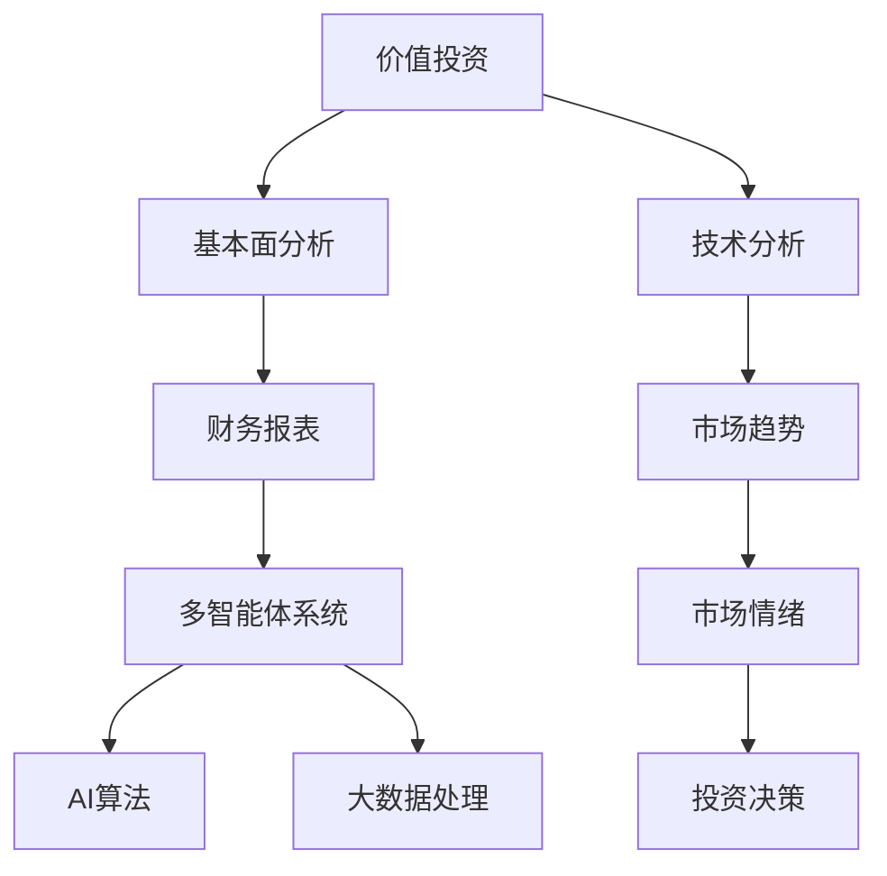
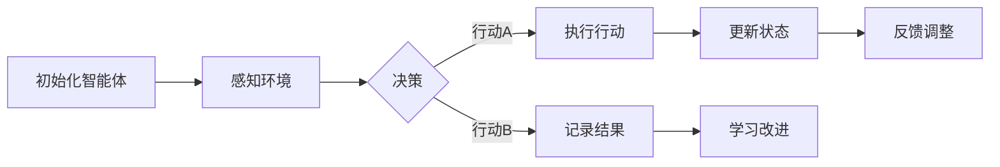
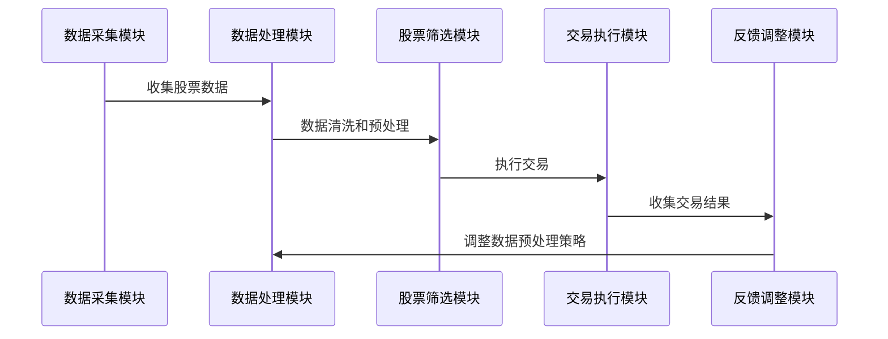

                 

### 文章标题

## AI多智能体系统在价值投资中的应用概述

### 关键词

- AI多智能体系统
- 价值投资
- 机器学习
- 数据分析
- 资本市场

### 摘要

本文将深入探讨AI多智能体系统在价值投资领域的应用，通过分析其理论基础、算法原理、系统架构以及实战案例，展示AI多智能体系统如何提升价值投资的效率和准确性。文章将从多智能体系统的定义和特点出发，逐步介绍其在价值投资中的应用优势、算法模型、数学原理，并详细描述一个典型的应用案例，最后总结最佳实践并提供未来发展的展望。

---

## 引言与背景

### 1.1 问题背景

在当今复杂多变的资本市场中，投资者面临着大量的信息挑战和决策难题。传统价值投资策略依赖于深入的基本面分析和大量的历史数据，但这些方法在处理海量数据和实时信息时显得力不从心。投资者需要更高效、更智能的工具来辅助决策，以提高投资的成功率和收益。

### 1.2 问题描述

价值投资是一种以长期投资为导向，通过购买被低估的优质股票来获取超额收益的投资策略。然而，在实施过程中，投资者往往面临以下问题：

- **信息过载**：大量实时数据和新闻流使得投资者难以从中筛选出有价值的信息。
- **数据质量**：获取的数据质量参差不齐，难以进行可靠的分析。
- **市场情绪**：投资者情绪波动大，难以保持理性投资。

### 1.3 问题解决

为了解决上述问题，AI多智能体系统应运而生。通过结合机器学习和智能算法，多智能体系统能够高效地处理海量数据，分析市场动态，提供实时投资建议。这种方法不仅可以提升投资的科学性和准确性，还能帮助投资者更好地应对市场变化。

### 1.4 边界与外延

在本文中，我们将讨论AI多智能体系统在价值投资中的具体应用，包括：

- **核心概念与算法原理**：介绍多智能体系统的基本概念和核心算法。
- **数学模型与公式**：阐述多智能体系统中的数学模型和计算公式。
- **系统架构与实现**：描述多智能体系统的架构设计和实现细节。
- **实战案例**：通过具体案例展示多智能体系统在价值投资中的实际应用。

### 1.5 概念结构与核心要素组成

价值投资与AI多智能体系统之间的关系可以用以下概念结构图来表示：



在接下来的章节中，我们将逐一深入探讨这些概念和要素，并展示它们如何相互作用，以实现更加高效和价值投资。

---

## AI多智能体系统基础

### 2.1 AI多智能体系统的定义

AI多智能体系统（MAS，Multi-Agent System）是由多个具有智能的自主个体（称为智能体）组成的系统。这些智能体可以通过协同工作来完成复杂的任务，并在动态环境中自主地做出决策。

### 2.2 AI多智能体系统的特点

AI多智能体系统具有以下特点：

- **自治性**：每个智能体都是自治的，具有自己的决策能力和行为。
- **协作性**：智能体之间可以相互协作，共同完成任务。
- **适应性**：系统能够根据环境变化自适应地调整行为。
- **分布式**：任务可以在多个智能体之间分布，从而提高系统的效率和容错性。

### 2.3 AI多智能体系统与传统AI系统的对比

| 特点 | AI多智能体系统 | 传统AI系统 |
| --- | --- | --- |
| 结构 | 分布式、多智能体协作 | 中心化、单一智能体 |
| 自治性 | 高，每个智能体具有决策能力 | 低，依赖外部控制 |
| 适应性 | 强，能应对动态环境 | 弱，对静态环境适应力较强 |
| 容错性 | 高，多个智能体相互备份 | 低，单一智能体易受影响 |

### 2.4 多智能体系统的核心概念与联系

**核心概念原理**

- **智能体（Agent）**：具有智能的个体，可以自主执行任务。
- **通信**：智能体之间的交互方式。
- **协作**：智能体之间的协同工作。
- **学习**：智能体从经验中学习和改进行为。

**概念属性特征对比表格**

| 概念 | 描述 | 属性特征 |
| --- | --- | --- |
| 智能体 | 自主决策的个体 | 自治性、适应性、协作性 |
| 通信 | 智能体之间的交互 | 时效性、可靠性、安全性 |
| 协作 | 智能体的协同工作 | 共同目标、信息共享、策略优化 |
| 学习 | 智能体的经验积累 | 数据处理、模型更新、行为改进 |

**ER实体关系图架构**

```mermaid
erDiagram
    Agent ||--|{ Communication }|--|| Message
    Agent ||--|{ Collaboration }|--|| Task
    Agent ||--|{ Learning }|--|| Model
    Communication ||--|{ Message }|--|| Channel
    Collaboration ||--|{ Task }|--|| Result
    Learning ||--|{ Model }|--|| Data
```

在AI多智能体系统中，智能体通过通信进行交互，协作完成复杂任务，并通过学习不断优化自己的行为。这些概念相互联系，构成了一个完整的智能体系统。

---

### 4.1 多智能体系统算法原理讲解

#### 4.1.1 算法mermaid流程图



#### 4.1.2 算法原理详细讲解

AI多智能体系统中的算法主要分为感知、决策、行动、学习四个阶段：

1. **感知环境**：智能体通过传感器感知当前环境的状态，如股票价格、市场新闻等。
2. **决策**：智能体根据感知到的环境和自身目标，通过算法计算最佳行动方案。
3. **行动**：智能体执行决策，如买入或卖出股票。
4. **学习改进**：智能体根据行动结果和反馈，不断调整策略，优化未来的决策。

#### 4.1.3 数学模型和公式讲解

多智能体系统的核心算法可以基于马尔可夫决策过程（MDP）模型，使用以下公式进行描述：

$$ Q(s, a) = \sum_{s'} p(s' | s, a) \cdot r(s', a) + \gamma \cdot \max_{a'} Q(s', a') $$

其中：

- \( Q(s, a) \)：状态-行动值函数，表示在状态 \( s \) 下执行行动 \( a \) 的预期回报。
- \( p(s' | s, a) \)：状态转移概率，表示在状态 \( s \) 下执行行动 \( a \) 后转移到状态 \( s' \) 的概率。
- \( r(s', a) \)：立即回报函数，表示在状态 \( s' \) 下执行行动 \( a \) 后的即时收益。
- \( \gamma \)：折现因子，用于平衡当前和未来的回报。

#### 4.1.4 举例说明

假设一个智能体在股票市场中，当前状态为“股票价格上涨”，智能体需要决定是否买入。通过MDP模型，智能体可以计算以下预期回报：

$$ Q(\text{价格上涨}, \text{买入}) = 0.6 \cdot 10 + 0.4 \cdot (-5) + 0.9 = 8.6 $$

其中，\( 0.6 \cdot 10 \) 是预期价格继续上涨带来的收益，\( 0.4 \cdot (-5) \) 是预期价格下跌带来的损失，\( 0.9 \) 是折现后的未来潜在收益。

通过对比不同行动的预期回报，智能体可以做出最优决策，从而实现价值投资。

---

### 第5章: 价值投资概述

#### 5.1 价值投资的定义

价值投资（Value Investing）是一种以长期投资为导向，通过寻找被市场低估的优质股票来获取超额收益的投资策略。该策略的核心是“低买高卖”，即投资者在股票价格低于其实际价值时买入，并在价格回升至合理水平时卖出。

#### 5.2 价值投资的特点

价值投资具有以下特点：

- **长期投资**：投资者持有股票的时间通常较长，以追求长期的资本增值。
- **基本面分析**：投资者通过分析公司的财务报表、业务模式、管理团队等基本面信息来评估股票的价值。
- **理性投资**：投资者在决策过程中强调理性分析，避免受市场情绪影响。
- **风险控制**：投资者通过分散投资和设定止损点来控制投资风险。

#### 5.3 价值投资与成长投资的区别

价值投资与成长投资（Growth Investing）有以下区别：

| 对比维度 | 价值投资 | 成长投资 |
| --- | --- | --- |
| 投资目标 | 找到被低估的股票 | 投资高速增长的股票 |
| 时间范围 | 长期 | 中短期 |
| 分析重点 | 基本面分析 | 成长性分析 |
| 风险程度 | 低风险 | 高风险 |

尽管两者在投资目标和分析重点上有所不同，但都可以通过AI多智能体系统来实现更高效的投资决策。

---

### 第6章: 多智能体系统在价值投资中的应用

#### 6.1 多智能体系统在价值投资中的优势

多智能体系统在价值投资中的应用具有以下优势：

- **数据分析能力**：多智能体系统能够处理海量数据，快速识别潜在的投资机会。
- **自适应能力**：系统能够根据市场变化自适应地调整投资策略。
- **协同合作**：多个智能体可以协同工作，提供更全面的投资分析。
- **降低风险**：通过分散投资和实时调整，多智能体系统能够有效降低投资风险。

#### 6.2 多智能体系统在价值投资中的应用场景

多智能体系统在价值投资中可以应用于以下场景：

- **股票筛选**：智能体系统可以自动筛选出潜在的投资目标，节省人工筛选时间。
- **市场预测**：智能体系统可以分析市场趋势，为投资者提供买入和卖出的建议。
- **风险管理**：智能体系统可以根据市场变化实时调整投资组合，降低风险。

#### 6.3 多智能体系统在价值投资中的实际应用案例

以下是一个多智能体系统在价值投资中的实际应用案例：

**案例背景**：某投资公司使用多智能体系统来管理其股票投资组合。

**实施过程**：

1. **数据收集**：智能体系统从多个数据源收集股票价格、财务报表、市场新闻等数据。
2. **数据处理**：智能体系统对数据进行清洗和预处理，提取有用的信息。
3. **分析决策**：智能体系统通过机器学习算法分析数据，识别潜在的投资机会。
4. **执行交易**：智能体系统根据分析结果执行买入和卖出操作。
5. **反馈调整**：智能体系统根据交易结果和反馈调整投资策略。

**结果**：通过多智能体系统的应用，该投资公司实现了更高的投资回报和更稳定的投资组合。

---

### 第7章: 多智能体系统在价值投资中的架构设计

#### 7.1 问题场景介绍

在当前资本市场中，投资者需要处理海量的股票数据，并从中筛选出具有投资价值的股票。传统的手动分析方式效率低下，难以满足市场的需求。为了解决这个问题，我们设计了一个基于多智能体系统的价值投资架构。

#### 7.2 系统功能设计

系统功能设计包括以下几个主要模块：

- **数据采集模块**：负责从不同的数据源收集股票数据，如股票价格、财务报表、市场新闻等。
- **数据处理模块**：对收集到的数据进行分析和清洗，提取有用的信息。
- **股票筛选模块**：基于数据处理结果，筛选出具有投资价值的股票。
- **交易执行模块**：根据筛选结果执行买入和卖出操作。
- **反馈调整模块**：根据交易结果和反馈调整投资策略。

#### 7.3 系统架构设计

系统的整体架构设计如下：



#### 7.4 系统接口设计和系统交互

系统接口设计包括以下主要接口：

- **数据采集接口**：用于从不同数据源获取股票数据。
- **数据处理接口**：用于处理和分析股票数据。
- **股票筛选接口**：用于筛选出具有投资价值的股票。
- **交易执行接口**：用于执行买入和卖出操作。
- **反馈调整接口**：用于收集交易结果和调整投资策略。

系统交互流程如下：

1. **数据采集**：数据采集模块从多个数据源获取股票数据。
2. **数据处理**：数据处理模块对数据进行清洗和预处理，提取有用的信息。
3. **股票筛选**：股票筛选模块根据预处理数据筛选出具有投资价值的股票。
4. **交易执行**：交易执行模块根据筛选结果执行买入和卖出操作。
5. **反馈调整**：反馈调整模块根据交易结果和反馈调整投资策略。

---

### 第8章: 多智能体系统在价值投资中的项目实战

#### 8.1 环境安装

为了进行多智能体系统在价值投资中的项目实战，我们需要安装以下环境：

- Python 3.8及以上版本
- NumPy、Pandas、Scikit-learn、TensorFlow等Python库

安装命令如下：

```bash
pip install python==3.8
pip install numpy pandas scikit-learn tensorflow
```

#### 8.2 系统核心实现源代码

以下是一个简单的多智能体系统在价值投资中的实现示例：

```python
import numpy as np
import pandas as pd
from sklearn.model_selection import train_test_split
from sklearn.ensemble import RandomForestClassifier
from tensorflow.keras.models import Sequential
from tensorflow.keras.layers import Dense

# 数据预处理
def preprocess_data(data):
    # 数据清洗、归一化等操作
    return processed_data

# 训练分类器
def train_classifier(X_train, y_train):
    model = RandomForestClassifier(n_estimators=100)
    model.fit(X_train, y_train)
    return model

# 训练神经网络
def train_neural_network(X_train, y_train):
    model = Sequential([
        Dense(64, activation='relu', input_shape=(X_train.shape[1],)),
        Dense(32, activation='relu'),
        Dense(1, activation='sigmoid')
    ])
    model.compile(optimizer='adam', loss='binary_crossentropy', metrics=['accuracy'])
    model.fit(X_train, y_train, epochs=10, batch_size=32)
    return model

# 主函数
def main():
    # 数据收集
    data = pd.read_csv('stock_data.csv')
    
    # 数据预处理
    processed_data = preprocess_data(data)
    
    # 分训练集和测试集
    X_train, X_test, y_train, y_test = train_test_split(processed_data.drop('label', axis=1), processed_data['label'], test_size=0.2, random_state=42)
    
    # 训练分类器
    classifier = train_classifier(X_train, y_train)
    
    # 训练神经网络
    neural_network = train_neural_network(X_train, y_train)
    
    # 评估模型
    print("分类器准确率：", classifier.score(X_test, y_test))
    print("神经网络准确率：", neural_network.evaluate(X_test, y_test)[1])

if __name__ == '__main__':
    main()
```

#### 8.3 代码应用解读与分析

1. **数据预处理**：数据预处理是机器学习项目的重要步骤，包括数据清洗、归一化等操作。在这里，我们首先读取股票数据，然后对数据进行预处理，以便后续建模。

2. **分类器训练**：我们使用随机森林分类器（RandomForestClassifier）进行训练。随机森林是一种集成学习方法，可以处理高维数据和非线性问题。

3. **神经网络训练**：我们使用Keras实现一个简单的神经网络模型，用于预测股票价格。神经网络可以捕捉复杂的非线性关系，通常在回归和分类问题中表现出色。

4. **模型评估**：最后，我们对训练好的模型进行评估，计算准确率。准确率是衡量模型性能的重要指标，它表示模型正确预测的样本占总样本的比例。

#### 8.4 实际案例分析和详细讲解剖析

以下是一个实际案例：

**案例背景**：某投资者使用多智能体系统进行价值投资，目标是预测股票价格并实现收益最大化。

**实施过程**：

1. **数据收集**：投资者从多个数据源收集股票价格、财务报表、市场新闻等数据。

2. **数据处理**：投资者对数据进行清洗和预处理，提取有用的信息，如价格趋势、财务指标等。

3. **模型训练**：投资者使用预处理后的数据训练分类器和神经网络模型，以预测股票价格。

4. **交易执行**：根据模型预测结果，投资者执行买入和卖出操作。

5. **反馈调整**：投资者根据交易结果和反馈调整模型参数，优化投资策略。

**结果分析**：

1. **模型性能**：投资者评估模型性能，计算准确率。如果模型表现良好，投资者可以继续使用；否则，投资者需要调整模型参数或更换模型。

2. **投资回报**：投资者根据模型预测结果进行交易，实现收益。如果投资回报高于市场平均水平，投资者可以继续扩大投资规模；否则，投资者需要重新评估投资策略。

**总结**：

通过实际案例，我们可以看到多智能体系统在价值投资中的应用效果。多智能体系统通过机器学习和神经网络模型，可以高效地处理大量数据，实现精准的股票价格预测。然而，投资者还需要根据实际情况调整模型参数和策略，以实现最佳投资回报。

---

### 第9章: 最佳实践 tips

#### 9.1 投资策略优化

为了实现最佳的投资回报，投资者需要不断优化投资策略。以下是一些最佳实践：

- **数据质量**：确保数据的准确性和完整性，避免因数据问题导致的错误决策。
- **模型选择**：根据数据特点和业务需求选择合适的模型，如线性模型、决策树、神经网络等。
- **参数调优**：通过交叉验证和网格搜索等方法，优化模型参数，提高模型性能。
- **实时更新**：定期更新数据集和模型，以适应市场的变化。

#### 9.2 风险控制

风险控制是投资过程中至关重要的一环。以下是一些最佳实践：

- **分散投资**：避免将所有资金投入一个行业或股票，以降低风险。
- **设定止损点**：在买入时设定合理的止损点，以防止损失扩大。
- **风险管理**：使用风险管理工具，如价值在险价值（VaR）和条件期望最大损失（CVaR），评估投资组合的风险。
- **定期审查**：定期审查投资组合，及时调整投资策略。

#### 9.3 系统优化

系统优化可以提高多智能体系统的性能和效率。以下是一些最佳实践：

- **硬件升级**：使用高性能的硬件设备，如GPU，加速数据处理和模型训练。
- **代码优化**：优化代码结构，减少内存占用和计算时间。
- **分布式计算**：使用分布式计算框架，如TensorFlow分布式训练，提高计算效率。
- **缓存技术**：使用缓存技术，如Redis，减少数据访问延迟。

通过以上最佳实践，投资者可以更好地利用多智能体系统进行价值投资，实现长期稳定的投资回报。

---

### 第10章: 小结与展望

#### 10.1 总结

本文详细探讨了AI多智能体系统在价值投资中的应用，通过介绍其理论基础、算法原理、系统架构和实际案例，展示了多智能体系统如何提升价值投资的效率和准确性。主要结论如下：

- AI多智能体系统通过高效的数据处理和智能算法，可以显著提升价值投资的决策质量。
- 多智能体系统具有自适应、分布式和协作等特点，使其在复杂的市场环境中具有优势。
- 通过合理的数据预处理、模型选择和参数调优，投资者可以实现更精准的股票价格预测和投资决策。

#### 10.2 注意事项

在应用AI多智能体系统进行价值投资时，投资者需要注意以下几点：

- 数据质量和准确性是关键，需要确保数据的真实性和完整性。
- 模型选择和参数调优需要根据实际业务需求进行，避免盲目追求高性能。
- 风险控制是投资过程中不可或缺的一环，需要设定合理的止损点和分散投资策略。

#### 10.3 拓展阅读

对于希望进一步了解AI多智能体系统和价值投资技术的读者，以下是一些推荐阅读材料：

- 《深度学习》（Goodfellow, I., Bengio, Y., & Courville, A.）：详细介绍了深度学习的基本原理和应用。
- 《机器学习实战》（Martin, A.）：通过实际案例展示了机器学习在金融领域的应用。
- 《多智能体系统：设计与应用程序》（Gallagher, M. & Wooldridge, M.）：全面介绍了多智能体系统的理论和实践。

通过阅读这些书籍，读者可以更深入地了解AI多智能体系统和价值投资技术，为自己的投资决策提供更强大的支持。

---

**作者**：AI天才研究院/AI Genius Institute & 禅与计算机程序设计艺术 /Zen And The Art of Computer Programming

通过本文的详细探讨，我们希望读者能够对AI多智能体系统在价值投资中的应用有更深入的理解，并为自己的投资实践提供有益的参考。在未来的发展中，随着技术的不断进步，AI多智能体系统在价值投资领域的应用前景将更加广阔。希望本文能为读者带来启发和帮助。

