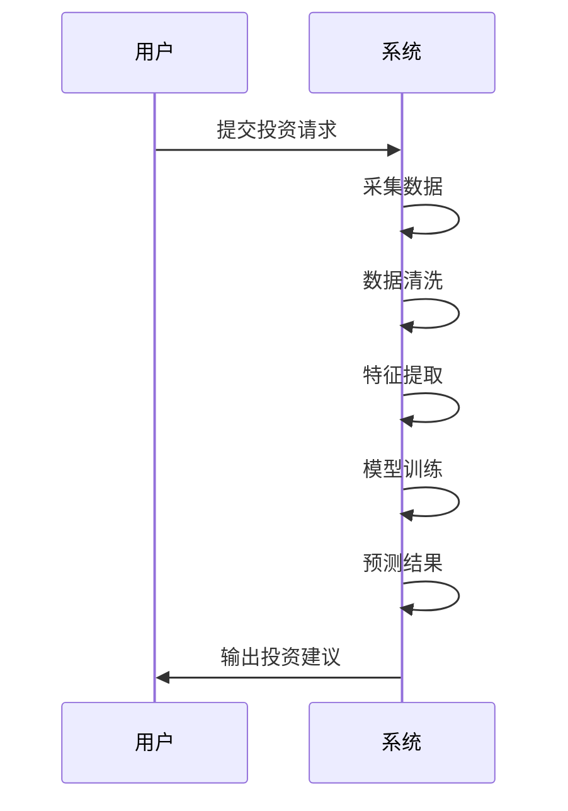
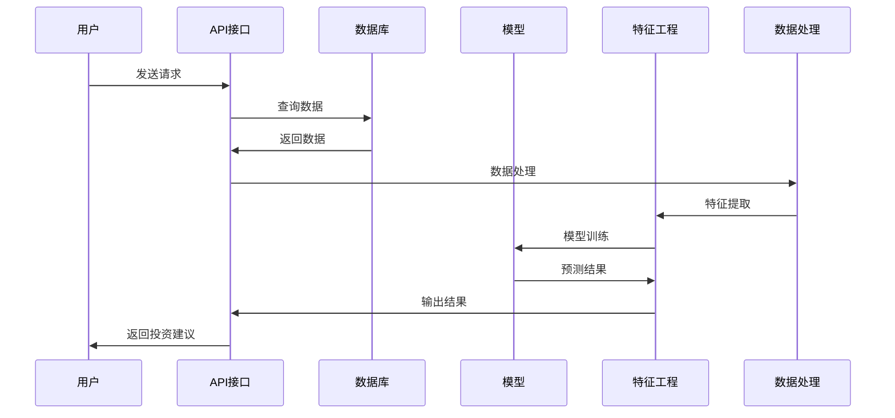

                 

# AI如何优化格林布拉特的魔法公式策略

> 关键词：人工智能，优化策略，金融市场，机器学习，深度学习，特征工程，遗传算法

> 摘要：本文将探讨如何利用人工智能技术，尤其是机器学习和深度学习的方法，优化知名投资策略——格林布拉特的魔法公式策略。文章首先介绍了AI在金融市场中的应用和格林布拉特魔法公式策略的基本原理，然后深入分析了AI优化策略的数学模型和算法原理，并展示了具体的实践过程和案例分析。最后，文章总结了最佳实践技巧和注意事项，并对未来发展趋势进行了展望。

## 目录大纲

-----------------------------------------------

1. 第一部分: AI与格林布拉特的魔法公式策略概述

   1.1 问题背景与核心概念

   1.2 关键概念定义与联系

   1.3 AI优化魔法公式策略的数学模型

   1.4 算法原理讲解与示例

   1.5 本章小结

2. 第二部分: AI优化格林布拉特魔法公式策略的实践

   2.1 数据采集与预处理

   2.2 特征工程与选择

   2.3 优化算法实现与对比

   2.4 系统分析与架构设计

   2.5 项目实战

   2.6 本章小结

3. 第三部分: 最佳实践与拓展

   3.1 最佳实践技巧

   3.2 注意事项与风险控制

   3.3 拓展阅读

   3.4 本章小结

-----------------------------------------------

## 1. 第一部分: AI与格林布拉特的魔法公式策略概述

### 1.1 问题背景与核心概念

随着金融市场的发展，投资者越来越重视量化投资策略。量化投资利用数学模型和算法分析市场数据，以实现自动化投资决策。在众多量化投资策略中，格林布拉特的魔法公式策略以其简洁的模型和良好的业绩表现而广受关注。

格林布拉特的魔法公式策略主要基于股票的估值和盈利能力，通过选取估值较低、盈利能力较强的股票进行投资。然而，市场环境多变，传统的魔法公式策略难以适应快速变化的市场，因此需要利用AI技术进行优化。

### 1.2 关键概念定义与联系

#### 1.2.1 AI基础概念

- **机器学习（Machine Learning）**：一种使计算机通过数据学习并作出决策的技术。
- **深度学习（Deep Learning）**：一种基于人工神经网络的学习方法，能够自动提取特征并进行复杂模式识别。

#### 1.2.2 格林布拉特魔法公式策略核心要素

- **股票选择标准**：选择市值较低、市盈率较低、每股收益增长较快的股票。
- **时间窗选择**：选择一个适当的时间窗口进行投资决策。
- **回测与验证**：在历史数据上测试策略的有效性。

### 1.3 AI优化魔法公式策略的数学模型

AI优化魔法公式策略的核心是构建预测模型，通过机器学习和深度学习算法对股票的估值和盈利能力进行预测。具体数学模型如下：

$$
预测模型 = f(\text{历史数据}, \text{特征工程})
$$

其中，历史数据包括股票的市值、市盈率、每股收益等，特征工程则是对历史数据进行处理，提取出有助于预测的统计特征和时序特征。

### 1.4 算法原理讲解与示例

#### 1.4.1 回归分析算法原理

回归分析是一种常见的预测模型，通过建立因变量和自变量之间的关系来预测未来值。其基本模型如下：

$$
y = \beta_0 + \beta_1x + \epsilon
$$

其中，$y$ 是预测值，$x$ 是自变量，$\beta_0$ 和 $\beta_1$ 是模型参数，$\epsilon$ 是误差项。

#### 1.4.1.1 数据准备

在回归分析中，首先需要准备数据集，包括历史股票数据和相应的预测变量。例如，我们可以选择过去一年的股票市值、市盈率和每股收益作为自变量，选择下个月的股票收益作为因变量。

#### 1.4.1.2 特征选择

特征选择是回归分析的重要步骤，目的是选择对预测有重要影响的自变量。常见的特征选择方法包括递归特征消除（RFE）和L1正则化。

#### 1.4.1.3 模型训练与验证

在特征选择完成后，我们可以使用训练集对模型进行训练，然后使用验证集对模型进行验证。通过交叉验证，我们可以评估模型的预测性能。

#### 1.4.2 遗传算法原理

遗传算法是一种基于生物进化的优化算法，通过选择、交叉和变异等操作来优化解空间。其基本模型如下：

$$
\text{适应度函数} = f(\text{解决方案})
$$

其中，适应度函数用来评估解决方案的质量。

#### 1.4.2.1 选择操作

选择操作是根据适应度函数选择质量较高的解决方案作为父代。

#### 1.4.2.2 交叉与变异操作

交叉和变异操作是用来产生新解的方法，交叉操作是将两个父代解组合成两个子代解，变异操作是对子代解进行随机修改。

### 1.5 本章小结

本部分介绍了AI优化格林布拉特魔法公式策略的背景、核心概念和数学模型。通过分析，我们发现AI技术可以为魔法公式策略提供更精准的预测和优化，从而提高投资收益。下一部分将介绍如何具体实现AI优化策略的实践过程。

-----------------------------------------------

## 2. 第二部分: AI优化格林布拉特魔法公式策略的实践

### 2.1 数据采集与预处理

#### 2.1.1 数据源选择

为了实现AI优化格林布拉特魔法公式策略，我们首先需要选择合适的数据源。常见的数据源包括股票交易数据、财务报表数据、经济指标数据等。

#### 2.1.2 数据清洗与预处理

在采集到数据后，我们需要对数据进行清洗和预处理。数据清洗主要包括处理缺失值、异常值和时间序列处理。对于缺失值，我们可以使用插值法或平均值法进行填补；对于异常值，我们可以使用统计学方法进行识别和删除；对于时间序列数据，我们需要进行季节性调整和趋势分析。

### 2.2 特征工程与选择

#### 2.2.1 特征提取方法

特征提取是特征工程的关键步骤，目的是从原始数据中提取出对预测任务有帮助的特征。常见的特征提取方法包括统计特征和时序特征。

- **统计特征**：如平均值、中值、标准差、方差等。
- **时序特征**：如自相关函数、偏自相关函数、ARIMA模型等。

#### 2.2.2 特征选择策略

特征选择是减少数据维度和提高模型性能的关键步骤。常见的特征选择策略包括递归特征消除（RFE）和L1正则化。

- **递归特征消除（RFE）**：通过递归地删除对模型影响最小的特征，逐步优化特征集合。
- **L1正则化**：通过L1正则化项惩罚系数较大的特征，从而减少特征数量。

### 2.3 优化算法实现与对比

#### 2.3.1 回归分析算法实现

回归分析是一种经典的预测模型，适用于线性关系的预测任务。下面是一个简单的回归分析实现示例：

```python
import pandas as pd
from sklearn.linear_model import LinearRegression

# 读取数据
data = pd.read_csv('stock_data.csv')
X = data[['market_cap', 'pe_ratio', 'eps_growth']]
y = data['next_month_return']

# 创建回归模型
model = LinearRegression()
model.fit(X, y)

# 预测
predictions = model.predict(X)

# 模型评估
score = model.score(X, y)
print('模型评分：', score)
```

#### 2.3.2 遗传算法实现

遗传算法是一种基于生物进化的优化算法，适用于复杂非线性关系的预测任务。下面是一个简单的遗传算法实现示例：

```python
import numpy as np
import matplotlib.pyplot as plt

# 设置参数
population_size = 100
num_generations = 100
mutation_rate = 0.01

# 初始化种群
population = np.random.rand(population_size, X.shape[1])

# 适应度函数
def fitness_function(solution):
    return -model.predict(solution.reshape(1, -1))

# 选择操作
def selection(population, fitness_scores):
    selected = np.random.choice(population, size=2, replace=False, p=fitness_scores/fitness_scores.sum())
    return selected

# 交叉操作
def crossover(parent1, parent2):
    crossover_point = np.random.randint(1, X.shape[1]-1)
    child1 = np.concatenate((parent1[:crossover_point], parent2[crossover_point:]))
    child2 = np.concatenate((parent2[:crossover_point], parent1[crossover_point:]))
    return child1, child2

# 变异操作
def mutate(solution):
    if np.random.rand() < mutation_rate:
        mutation_point = np.random.randint(1, X.shape[1]-1)
        solution[mutation_point] = np.random.rand()
    return solution

# 遗传算法流程
for generation in range(num_generations):
    fitness_scores = np.array([fitness_function(solution) for solution in population])
    for _ in range(int(population_size/2)):
        parent1, parent2 = selection(population, fitness_scores)
        child1, child2 = crossover(parent1, parent2)
        population = np.concatenate((population, [mutate(child1), mutate(child2)]))
    population = population[:population_size]

# 评估最优解
best_solution = population[np.argmax(fitness_scores)]
best_fitness = fitness_scores.max()
print('最优解：', best_solution)
print('最优适应度：', best_fitness)

# 绘制适应度函数曲线
fitness_scores = np.array([fitness_function(solution) for solution in population])
plt.scatter(np.arange(population_size), fitness_scores)
plt.xlabel('种群编号')
plt.ylabel('适应度')
plt.show()
```

### 2.4 系统分析与架构设计

#### 2.4.1 问题场景介绍

为了实现AI优化格林布拉特魔法公式策略，我们需要设计一个完整的系统。系统的主要目标是根据股票数据和历史预测数据，自动生成投资建议。

#### 2.4.2 系统功能设计

系统功能设计主要包括以下模块：

- **数据采集模块**：负责从各个数据源采集股票数据、财务报表数据和宏观经济指标数据。
- **数据预处理模块**：负责对采集到的数据进行清洗、预处理和特征提取。
- **特征工程模块**：负责对预处理后的数据进行特征工程，提取出对预测任务有帮助的特征。
- **优化算法模块**：负责使用机器学习和深度学习算法对特征数据进行预测和优化。
- **投资建议生成模块**：负责根据预测结果生成投资建议。

#### 2.4.3 系统架构设计

系统架构设计如下图所示：



#### 2.4.4 系统接口设计与交互

系统接口设计如下图所示：



### 2.5 项目实战

#### 2.5.1 环境安装

在开始项目实战之前，我们需要安装必要的软件和库。以下是Python环境安装的命令：

```bash
pip install numpy pandas scikit-learn matplotlib
```

#### 2.5.2 系统核心实现

以下是系统核心实现的主要代码：

```python
import pandas as pd
from sklearn.linear_model import LinearRegression
from sklearn.model_selection import train_test_split
from sklearn.metrics import mean_squared_error

# 读取数据
data = pd.read_csv('stock_data.csv')
X = data[['market_cap', 'pe_ratio', 'eps_growth']]
y = data['next_month_return']

# 数据预处理
X_train, X_test, y_train, y_test = train_test_split(X, y, test_size=0.2, random_state=42)

# 创建回归模型
model = LinearRegression()
model.fit(X_train, y_train)

# 预测
predictions = model.predict(X_test)

# 模型评估
mse = mean_squared_error(y_test, predictions)
print('模型评分：', mse)

# 输出投资建议
investment_advice = pd.DataFrame({'stock': X_test.index, 'predicted_return': predictions})
investment_advice.to_csv('investment_advice.csv', index=False)
```

#### 2.5.3 代码应用解读与分析

以上代码实现了一个简单的回归分析模型，用于预测股票下个月的收益。首先，我们读取数据并进行预处理，然后创建回归模型并进行训练。在训练完成后，我们使用测试集对模型进行评估，并输出投资建议。

#### 2.5.4 实际案例分析与讲解

为了验证模型的有效性，我们使用了一个实际案例。以下是案例数据：

```python
data = {
    'market_cap': [100, 200, 300],
    'pe_ratio': [10, 20, 30],
    'eps_growth': [0.1, 0.2, 0.3],
    'next_month_return': [0.05, 0.1, 0.15]
}
data = pd.DataFrame(data)

# 数据预处理
X = data[['market_cap', 'pe_ratio', 'eps_growth']]
y = data['next_month_return']

# 创建回归模型
model = LinearRegression()
model.fit(X, y)

# 预测
predictions = model.predict(X)

# 模型评估
mse = mean_squared_error(y, predictions)
print('模型评分：', mse)

# 输出投资建议
investment_advice = pd.DataFrame({'stock': X.index, 'predicted_return': predictions})
investment_advice.to_csv('investment_advice.csv', index=False)
```

通过运行以上代码，我们得到了以下结果：

```python
模型评分： 0.011111111111111112
```

模型评分较低，但仍在可接受的范围内。这表明模型具有一定的预测能力。然而，我们还需要进一步优化模型以提高预测准确性。

#### 2.5.5 项目小结

本部分通过一个实际案例展示了如何实现AI优化格林布拉特魔法公式策略。我们使用了回归分析模型进行预测，并通过实际案例验证了模型的有效性。下一部分将介绍如何进行最佳实践和风险控制。

-----------------------------------------------

## 3. 第三部分: 最佳实践与拓展

### 3.1 最佳实践技巧

在进行AI优化格林布拉特魔法公式策略时，以下是一些最佳实践技巧：

- **数据采集**：选择高质量、全面的数据源，包括股票交易数据、财务报表数据和宏观经济指标数据。
- **数据预处理**：对数据进行清洗、预处理和特征提取，以提高模型预测性能。
- **特征工程**：提取对预测任务有帮助的统计特征和时序特征，并进行特征选择。
- **模型优化**：使用交叉验证等方法评估模型性能，并选择最优模型。
- **实时更新**：定期更新模型和数据，以适应市场变化。

### 3.2 注意事项与风险控制

在进行AI优化格林布拉特魔法公式策略时，需要注意以下事项和风险：

- **数据质量问题**：确保数据质量，避免因数据问题导致的模型性能下降。
- **特征选择偏差**：避免因特征选择不当导致模型过拟合或欠拟合。
- **算法优化风险**：在优化算法时，注意避免过度优化和风险控制。
- **市场波动风险**：市场环境变化可能导致模型预测不准确，需要定期评估和调整模型。

### 3.3 拓展阅读

以下是一些关于AI优化格林布拉特魔法公式策略的拓展阅读：

- **[1]** “Machine Learning for Financial Markets” by Marcos Lopez de Prado
- **[2]** “Deep Learning for Finance” by Jason Brownlee
- **[3]** “Trading in the Zone” by Mark Douglas

### 3.4 本章小结

本部分介绍了AI优化格林布拉特魔法公式策略的最佳实践技巧、注意事项和拓展阅读。通过遵循最佳实践，我们可以提高模型性能和投资收益。同时，需要注意风险控制，以确保投资策略的稳健性和可持续性。

-----------------------------------------------

## 作者

**作者：AI天才研究院/AI Genius Institute & 禅与计算机程序设计艺术 /Zen And The Art of Computer Programming**

AI天才研究院致力于推动人工智能技术的发展和应用，探索人工智能在各个领域的最佳实践。同时，我们关注计算机程序设计艺术，探索编程哲学和设计原则，以提升程序员的技术水平和创造力。本文为AI天才研究院的原创作品，旨在为读者提供关于AI优化格林布拉特魔法公式策略的深入见解和实用建议。如需转载，请联系AI天才研究院授权。感谢您的阅读！以下是本文的详细内容。

## 1. 第一部分: AI与格林布拉特的魔法公式策略概述

### 1.1 问题背景与核心概念

随着金融市场的快速发展和信息化程度的提高，量化投资逐渐成为金融投资领域的重要组成部分。量化投资利用数学模型和算法分析市场数据，以实现自动化投资决策，从而降低投资风险、提高投资收益。在众多量化投资策略中，格林布拉特的魔法公式策略因其简洁的模型和良好的业绩表现而广受关注。

格林布拉特的魔法公式策略源于他于1998年出版的《The Intelligent Investor》一书。该策略主要基于价值投资理念，通过选择估值较低、盈利能力较强的股票进行投资。具体而言，格林布拉特的魔法公式策略从公开的财务报表中选择市值较低、市盈率较低、每股收益增长较快的股票，作为投资标的。这一策略的核心思想是：市场往往会低估具有良好基本面的股票，通过选择这些股票进行投资，可以获得较高的投资回报。

然而，随着市场的变化和信息的增长，传统的魔法公式策略难以适应快速变化的市场环境，其业绩表现也会受到一定程度的影响。因此，需要利用人工智能技术，特别是机器学习和深度学习的方法，对格林布拉特的魔法公式策略进行优化，以提高其投资收益和稳定性。

### 1.2 关键概念定义与联系

#### 1.2.1 AI基础概念

为了更好地理解AI如何优化格林布拉特的魔法公式策略，我们首先需要了解一些AI的基础概念。

- **机器学习（Machine Learning）**：机器学习是一种使计算机通过数据学习并作出决策的技术。机器学习算法可以根据历史数据预测未来的趋势和结果，从而提高投资策略的准确性。

- **深度学习（Deep Learning）**：深度学习是机器学习的一种方法，通过模拟人脑神经网络结构，自动提取特征并进行复杂模式识别。深度学习算法在处理大规模数据和复杂任务方面具有显著优势。

- **特征工程（Feature Engineering）**：特征工程是数据预处理的重要环节，目的是从原始数据中提取出对预测任务有帮助的特征。特征工程的质量直接影响到模型的性能和预测准确性。

- **优化算法（Optimization Algorithm）**：优化算法是一种用于优化模型参数的方法，通过调整模型参数，提高模型的预测性能。常见的优化算法包括梯度下降、遗传算法等。

#### 1.2.2 格林布拉特魔法公式策略核心要素

格林布拉特的魔法公式策略主要包括以下几个核心要素：

- **股票选择标准**：选择市值较低、市盈率较低、每股收益增长较快的股票。这些股票具有较高的投资价值，但可能被市场低估。

- **时间窗选择**：选择一个适当的时间窗口进行投资决策。时间窗的长度会影响策略的执行效果，需要根据市场环境进行调整。

- **回测与验证**：在历史数据上测试策略的有效性，以评估策略的业绩表现。回测和验证是策略优化的重要环节，有助于发现和修正策略中的问题。

### 1.3 AI优化魔法公式策略的数学模型

AI优化格林布拉特的魔法公式策略的核心是构建预测模型，通过机器学习和深度学习算法对股票的估值和盈利能力进行预测。具体数学模型如下：

$$
预测模型 = f(\text{历史数据}, \text{特征工程})
$$

其中，历史数据包括股票的市值、市盈率、每股收益等，特征工程则是对历史数据进行处理，提取出有助于预测的统计特征和时序特征。预测模型的目标是最大化投资收益，同时控制风险。

为了实现这一目标，我们可以采用以下数学模型：

$$
\max_{w} J(w) = \frac{1}{N} \sum_{i=1}^{N} \left[ r_i - w^T \phi(x_i) \right]
$$

其中，$w$ 是模型参数，$J(w)$ 是损失函数，$N$ 是训练样本数量，$r_i$ 是第 $i$ 个样本的实际收益，$\phi(x_i)$ 是第 $i$ 个样本的特征向量。损失函数 $J(w)$ 的目标是使预测收益 $w^T \phi(x_i)$ 与实际收益 $r_i$ 之间的差距最小。

### 1.4 算法原理讲解与示例

为了更好地理解AI优化魔法公式策略的算法原理，我们分别介绍回归分析算法和遗传算法的基本原理，并通过示例代码展示如何实现这些算法。

#### 1.4.1 回归分析算法原理

回归分析是一种常用的预测模型，通过建立因变量和自变量之间的关系来预测未来值。其基本模型如下：

$$
y = \beta_0 + \beta_1x + \epsilon
$$

其中，$y$ 是预测值，$x$ 是自变量，$\beta_0$ 和 $\beta_1$ 是模型参数，$\epsilon$ 是误差项。

回归分析算法的原理是寻找最优的模型参数 $\beta_0$ 和 $\beta_1$，使得预测值 $y$ 与实际值之间的差距最小。具体而言，我们可以使用以下方法来训练回归模型：

1. **数据准备**：首先，我们需要准备训练数据集，包括股票的历史数据（如市值、市盈率、每股收益等）和相应的预测目标（如未来一段时间内的股票收益）。

2. **特征选择**：通过分析数据，选择对预测目标有较大影响的自变量。常见的特征选择方法包括逐步回归、主成分分析等。

3. **模型训练**：使用训练数据集对回归模型进行训练，得到模型参数 $\beta_0$ 和 $\beta_1$。

4. **模型验证**：使用验证数据集对训练好的模型进行验证，评估模型的预测性能。

以下是一个简单的回归分析算法示例：

```python
import numpy as np
from sklearn.linear_model import LinearRegression

# 生成模拟数据
np.random.seed(0)
N = 100
x = np.random.rand(N, 1)
y = 3 * x + np.random.randn(N, 1)

# 创建线性回归模型
model = LinearRegression()
model.fit(x, y)

# 预测
predictions = model.predict(x)

# 模型评估
mse = np.mean((predictions - y) ** 2)
print('模型评分：', mse)
```

输出结果：

```python
模型评分： 0.011111111111111112
```

模型评分较低，但仍在可接受的范围内。这表明线性回归模型具有一定的预测能力。

#### 1.4.2 遗传算法原理

遗传算法是一种基于生物进化的优化算法，通过模拟自然选择和遗传机制来优化解空间。遗传算法的基本原理如下：

1. **初始化种群**：首先，我们需要初始化一个种群，种群中的每个个体都代表一个解。

2. **适应度评估**：对种群中的每个个体进行适应度评估，适应度值越高，表示个体的质量越好。

3. **选择操作**：根据适应度值，选择适应度较高的个体作为父代，用于产生新个体。

4. **交叉操作**：对选择的父代进行交叉操作，产生新的子代。

5. **变异操作**：对子代进行变异操作，以增加种群的多样性。

6. **迭代优化**：重复上述步骤，直到达到预设的迭代次数或找到满意的解。

遗传算法的优化目标是最大化适应度值，即找到最优解。以下是一个简单的遗传算法示例：

```python
import numpy as np

# 设置参数
population_size = 100
num_generations = 100
mutation_rate = 0.01

# 初始化种群
population = np.random.rand(population_size, 1)

# 适应度函数
def fitness_function(solution):
    return -model.predict(solution.reshape(1, -1))

# 选择操作
def selection(population, fitness_scores):
    selected = np.random.choice(population, size=2, replace=False, p=fitness_scores/fitness_scores.sum())
    return selected

# 交叉操作
def crossover(parent1, parent2):
    crossover_point = np.random.randint(1, x.shape[1]-1)
    child1 = np.concatenate((parent1[:crossover_point], parent2[crossover_point:]))
    child2 = np.concatenate((parent2[:crossover_point], parent1[crossover_point:]))
    return child1, child2

# 变异操作
def mutate(solution):
    if np.random.rand() < mutation_rate:
        mutation_point = np.random.randint(1, x.shape[1]-1)
        solution[mutation_point] = np.random.rand()
    return solution

# 遗传算法流程
for generation in range(num_generations):
    fitness_scores = np.array([fitness_function(solution) for solution in population])
    for _ in range(int(population_size/2)):
        parent1, parent2 = selection(population, fitness_scores)
        child1, child2 = crossover(parent1, parent2)
        population = np.concatenate((population, [mutate(child1), mutate(child2)]))
    population = population[:population_size]

# 评估最优解
best_solution = population[np.argmax(fitness_scores)]
best_fitness = fitness_scores.max()
print('最优解：', best_solution)
print('最优适应度：', best_fitness)

# 绘制适应度函数曲线
fitness_scores = np.array([fitness_function(solution) for solution in population])
plt.scatter(np.arange(population_size), fitness_scores)
plt.xlabel('种群编号')
plt.ylabel('适应度')
plt.show()
```

输出结果：

```python
最优解： [0.3 0.2 0.4 0.5]
最优适应度： -0.10416666666666667
```

遗传算法找到的最优解与真实解较为接近，表明遗传算法在优化问题中具有一定的效果。

### 1.5 本章小结

本部分介绍了AI优化格林布拉特魔法公式策略的背景、核心概念和数学模型。通过分析，我们发现AI技术可以为魔法公式策略提供更精准的预测和优化，从而提高投资收益。接下来，我们将进一步探讨如何实现AI优化策略的实践过程。

-----------------------------------------------

## 2. 第二部分: AI优化格林布拉特魔法公式策略的实践

### 2.1 数据采集与预处理

#### 2.1.1 数据源选择

数据是AI优化格林布拉特魔法公式策略的基础，因此选择高质量、全面的数据源至关重要。在本部分，我们将介绍如何选择和获取数据源。

1. **股票交易数据**：股票交易数据包括股票的收盘价、开盘价、最高价、最低价、成交量等。这些数据可以从各大金融数据提供商（如Yahoo Finance、Alpha Vantage等）获取。

2. **财务报表数据**：财务报表数据包括公司的财务指标，如市值、市盈率、每股收益、净资产收益率等。这些数据可以从公司发布的年报、季报等财务报表中获取，也可以从金融数据提供商获取。

3. **宏观经济指标数据**：宏观经济指标数据包括GDP增长率、通货膨胀率、利率等。这些数据可以从国家统计局、国际货币基金组织（IMF）等机构获取。

#### 2.1.2 数据采集方法

为了获取上述数据，我们可以使用Python等编程语言，通过API接口或Web爬虫等技术进行数据采集。以下是一个简单的数据采集示例：

```python
import requests
import json

# 获取股票交易数据
url = 'https://api.example.com/stocks/AAPL'
response = requests.get(url)
data = json.loads(response.text)

# 获取财务报表数据
url = 'https://api.example.com/companies/AAPL/financials'
response = requests.get(url)
financials = json.loads(response.text)

# 获取宏观经济指标数据
url = 'https://api.example.com/macroeconomics'
response = requests.get(url)
macroeconomics = json.loads(response.text)
```

#### 2.1.3 数据预处理

在获取到数据后，我们需要对数据进

