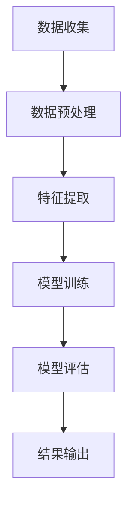
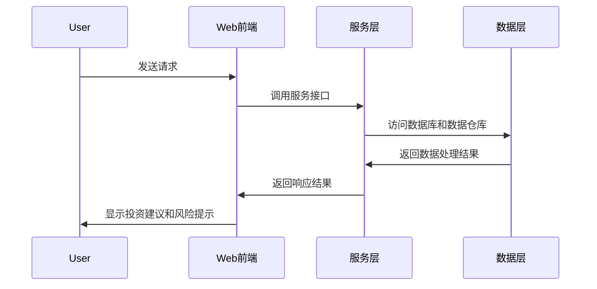

                 


### 引言与背景

在当今科技飞速发展的时代，人工智能（AI）技术在各个领域都展现出了巨大的潜力和应用价值。投资领域也不例外，随着大数据和机器学习技术的不断进步，AI智能体在识别优质成长股中的应用日益受到关注。本文将探讨AI智能体如何应用于股票市场，通过逐步分析推理，揭示其在识别优质成长股中的重要作用。

#### 1.1 问题的提出

投资领域的核心目标在于识别那些具有高成长潜力的优质股票，以便在长期投资中实现资本增值。然而，随着市场信息的复杂性增加，传统的投资方法面临着诸多挑战。例如，股票市场中的数据量庞大，信息噪声严重，如何有效地从海量数据中提取有价值的信息，成为投资者面临的一大难题。此外，市场环境瞬息万变，投资者需要具备快速反应能力，以便在合适的时机买入或卖出股票。

AI智能体的引入，为解决上述问题提供了新的思路。AI智能体具有自学习能力，可以不断优化其预测模型，提高识别优质成长股的准确性。同时，AI智能体能够处理大量数据，发现隐藏在数据背后的规律和趋势，从而为投资者提供更为精准的投资建议。

#### 1.2 研究背景

投资理论经历了多个阶段的演变。从早期的技术分析到现代的量化投资，投资策略不断优化，投资理论也不断更新。随着计算机技术的发展，机器学习和大数据分析技术的崛起，量化投资逐渐成为主流。量化投资利用数学模型和计算机算法，从海量数据中挖掘投资机会，降低了人为判断的风险，提高了投资效率。

机器学习是AI的重要组成部分，其核心在于通过数据训练模型，使其能够对未知数据进行预测。随着深度学习技术的进步，机器学习模型在图像识别、语音识别、自然语言处理等领域取得了显著成果。将机器学习应用于股票市场，能够有效地识别优质成长股，为投资者提供有力支持。

#### 1.3 AI智能体在股票市场中的应用现状

目前，AI智能体在股票市场中的应用已初见成效。一些投资机构已经开始使用AI智能体进行股票分析和预测，取得了较好的投资回报。例如，通过分析历史股价数据、公司财务报表和市场情绪等，AI智能体可以预测股票的涨跌趋势，为投资者提供买卖建议。此外，AI智能体还可以识别市场中的潜在风险，帮助投资者规避投资风险。

然而，AI智能体在股票市场中的应用仍存在一些挑战。首先，数据的质量和完整性直接影响AI智能体的预测准确性。其次，AI智能体需要不断学习和优化，以适应市场环境的变化。此外，AI智能体的应用需要大量的计算资源和技术支持，这对于小型投资者来说可能是一个障碍。

### 总结

本文介绍了AI智能体在识别优质成长股中的应用背景和研究意义。通过逐步分析，我们认识到AI智能体在股票市场中的重要性，并探讨了其在投资领域面临的挑战和机遇。接下来，我们将进一步深入探讨AI智能体的核心概念和算法原理，为读者提供更为详细的技术解析。

---

## 核心概念与联系

在探讨AI智能体在识别优质成长股中的应用之前，我们需要了解一些核心概念，并分析它们之间的联系。这些概念包括AI智能体的定义与特点、优质成长股的识别，以及AI智能体与传统算法的比较。

### 2.1 AI智能体的定义与特点

AI智能体，也称为人工智能体或智能体，是一种能够模拟人类智能行为的计算机程序。智能体通过感知环境、理解信息、做出决策和执行行动，以实现特定目标。与传统的计算机程序不同，AI智能体具有以下几个显著特点：

1. **自学习能力**：智能体能够从经验中学习，并通过不断优化其决策模型来提高性能。这种自学习能力使得智能体能够适应动态变化的环境。

2. **数据驱动**：智能体的决策基于大量数据，通过数据分析和模式识别来发现隐藏在数据中的规律。这种数据驱动的方法使得智能体能够处理复杂和大规模的数据集。

3. **自适应能力**：智能体能够根据环境的变化调整其行为和决策策略。这种自适应能力使得智能体能够适应不确定性和变化。

4. **协同能力**：智能体能够与其他智能体或人类进行交互，协同完成任务。这种协同能力使得智能体能够更有效地解决复杂问题。

### 2.2 优质成长股的识别

优质成长股是指那些在长期内具有高增长潜力的股票。识别优质成长股的关键在于发现那些具有良好基本面和增长潜力的公司。以下是一些关键指标：

1. **盈利增长率**：公司的盈利能力是衡量其成长性的重要指标。高盈利增长率通常意味着公司具有强大的业务模式和增长动力。

2. **市盈率**：市盈率是衡量股票价格相对于公司盈利能力的指标。低市盈率可能表明股票被低估，具有较高的投资价值。

3. **公司市值**：公司市值反映了市场的对公司的估值。小市值公司通常具有更高的增长潜力。

4. **业务模式**：公司的业务模式是否具有竞争优势和可持续性也是识别优质成长股的重要依据。

5. **行业地位**：公司在其所在行业中的地位和影响力也是评估其成长潜力的重要因素。

### 2.3 AI智能体与传统算法的比较

传统算法通常是基于预定义的规则和模型进行数据处理和预测。这些算法在处理静态和简单问题时效果较好，但在面对复杂和动态的问题时，其性能往往受限。相比之下，AI智能体具有以下优势：

| 特征        | 传统算法                     | AI智能体                     |
|-------------|------------------------------|------------------------------|
| 学习能力    | 静态，预定义规则              | 动态，自学习和自适应         |
| 数据依赖    | 数据量有限，数据质量要求不高  | 大数据依赖，数据质量至关重要 |
| 预测准确性  | 受限于模型复杂度              | 能够通过深度学习提高准确性   |

传统算法的局限性在于其无法处理大规模和复杂的数据集，而AI智能体通过自学习和自适应能力，能够从海量数据中提取有价值的信息，并不断提高预测准确性。

### 2.4 概念属性特征对比表格

为了更直观地比较AI智能体与传统算法的不同，我们可以使用一个特征对比表格。以下是一个简单的对比表格：

| 特征        | 传统算法                     | AI智能体                     |
|-------------|------------------------------|------------------------------|
| 学习能力    | 静态，预定义规则              | 动态，自学习和自适应         |
| 数据依赖    | 数据量有限，数据质量要求不高  | 大数据依赖，数据质量至关重要 |
| 预测准确性  | 受限于模型复杂度              | 能够通过深度学习提高准确性   |
| 协同能力    | 单个任务，无协作             | 多任务，协同完成任务         |
| 灵活性      | 固定规则，适应能力有限       | 灵活调整，适应变化           |

通过这个表格，我们可以看到AI智能体在多个方面都优于传统算法，特别是在自学习能力、数据处理能力和预测准确性方面。

### 2.5 ER实体关系图架构

为了更好地理解AI智能体在识别优质成长股中的应用，我们还可以使用实体关系图（ER图）来展示相关概念之间的关系。以下是一个简化的ER图：

```mermaid
erDiagram
  Company ||--|{ Stock }
  Stock ||--|{ FinancialData }
  FinancialData ||--|{ GrowthRate }
  Company ||--|{ IndustryPosition }
```

在这个ER图中，公司（Company）与股票（Stock）之间存在一对多关系，股票与财务数据（FinancialData）之间存在关联关系，财务数据与增长速度（GrowthRate）之间存在关联关系，而公司与其所在行业位置（IndustryPosition）也存在关联关系。这个ER图帮助我们清晰地理解了各个概念之间的联系，为后续的算法设计和实现提供了基础。

通过以上分析，我们了解了AI智能体的核心概念与特点，以及优质成长股的识别方法。接下来，我们将进一步探讨AI智能体识别优质成长股的算法原理，为读者提供更深入的技术解析。

### AI智能体识别优质成长股的算法原理

在深入探讨AI智能体识别优质成长股的算法原理之前，我们需要了解一些基本概念，如数据收集、数据预处理、特征提取、模型训练、模型评估以及结果输出。以下是对这些概念及其实现方法的详细解析。

#### 3.1 数据收集

数据收集是AI智能体识别优质成长股的基础步骤。收集的数据包括公司财务报表、历史股价数据、行业数据、市场情绪数据等。这些数据来源可以是公开的数据库、金融新闻、社交媒体等。数据收集的过程需要确保数据的完整性和质量，避免噪声和缺失值对后续分析的影响。

#### 3.2 数据预处理

数据预处理是确保数据质量的关键步骤。其主要任务包括数据清洗、数据集成、数据转换等。数据清洗旨在去除噪声和异常值，提高数据的准确性。数据集成则将来自不同来源的数据进行整合，形成统一的数据集。数据转换包括数据格式转换、数据规范化等，以适应后续的分析需求。

#### 3.3 特征提取

特征提取是从原始数据中提取出对识别优质成长股有帮助的特征。这些特征可以是数值型的，如盈利增长率、市盈率等；也可以是类别型的，如行业分类、公司评级等。特征提取的关键在于找到能够有效反映公司成长潜力的指标。

#### 3.4 模型训练

模型训练是AI智能体的核心步骤。通过训练，智能体能够学习到如何从数据中提取有价值的信息，并做出准确的预测。常用的机器学习算法包括线性回归、决策树、随机森林、支持向量机等。随着深度学习技术的发展，神经网络（如卷积神经网络和循环神经网络）在处理复杂数据和提取特征方面表现出色。

#### 3.5 模型评估

模型评估是验证AI智能体预测能力的重要步骤。常用的评估指标包括准确率、召回率、F1分数、均方误差等。通过评估，我们可以了解模型的性能，并找出模型中的不足之处，从而进行进一步的优化。

#### 3.6 结果输出

结果输出是将模型的预测结果转化为实际的投资建议。智能体可以根据预测结果，给出股票买入、持有或卖出的建议。同时，智能体还可以提供风险提示和投资策略，帮助投资者做出更明智的决策。

#### 3.7 算法流程图

为了更直观地展示AI智能体识别优质成长股的算法流程，我们可以使用Mermaid语言绘制算法流程图。以下是一个简化的算法流程图：



在这个流程图中，数据收集是算法的起点，随后进行数据预处理，提取出有价值特征，然后进行模型训练和评估，最后输出投资建议。

#### 3.8 数学模型与公式

在识别优质成长股的过程中，我们通常会使用一个数学模型来评估股票的预测价值。以下是一个简化的数学模型和公式：

$$
\text{预测价值} = w_1 \times \text{公司市值} + w_2 \times \text{盈利增长率} + w_3 \times \text{市盈率}
$$

在这个公式中，\( w_1, w_2, w_3 \) 是权重系数，用于衡量各个特征对公司成长潜力的影响。公司市值、盈利增长率和市盈率是输入特征，它们的权重决定了模型对股票价值的预测结果。

#### 3.9 举例说明

为了更好地理解上述数学模型，我们可以通过一个具体的例子来说明。假设某家公司的市值、盈利增长率和市盈率分别为10亿、20%和15，我们可以使用以下代码来计算其预测价值：

```python
w1, w2, w3 = 1, 2, 3
company_data = {'市值': 10, '盈利增长率': 20, '市盈率': 15}
predicted_value = w1 * company_data['市值'] + w2 * company_data['盈利增长率'] + w3 * company_data['市盈率']
print(predicted_value)
```

在这个例子中，我们为每个特征分配了权重系数。通过计算，我们得到了该公司的预测价值为65亿元。这个结果可以作为投资决策的参考依据。

通过以上分析，我们了解了AI智能体识别优质成长股的算法原理。接下来，我们将探讨系统设计与实现，为读者提供更为详细的技术实现过程。

### 系统设计与实现

在了解了AI智能体识别优质成长股的算法原理后，我们需要将其转化为实际可运行的系统。本节将详细阐述系统设计与实现的过程，包括问题场景介绍、系统功能设计、系统架构设计、系统接口设计与交互，以及核心实现源代码和代码应用解读与分析。

#### 4.1 问题场景介绍

投资者在寻找优质成长股时，通常面临着以下问题：

1. **数据获取困难**：获取高质量的股票数据是进行有效投资分析的基础，但数据来源分散，获取过程繁琐。
2. **信息噪声大**：股票市场中存在大量噪声信息，如谣言、虚假消息等，这些信息会影响投资者的决策。
3. **分析复杂**：识别优质成长股需要对大量数据进行复杂的分析和处理，传统的手动分析方法效率低下。
4. **预测准确性低**：传统投资方法难以应对市场变化，预测准确性较低，投资者难以做出正确的投资决策。

为了解决上述问题，我们需要设计一个高效、准确的AI智能体系统，能够从海量数据中提取有价值信息，识别优质成长股，并为投资者提供科学的投资建议。

#### 4.2 系统功能设计

系统的主要功能包括以下几方面：

1. **数据收集与处理**：自动从多个数据源收集股票数据，包括财务报表、历史股价、行业数据等，并进行数据清洗、集成和转换。
2. **特征提取**：根据投资分析需求，提取对识别优质成长股有帮助的特征，如盈利增长率、市盈率、公司市值等。
3. **模型训练与评估**：使用机器学习算法对提取的特征进行训练，构建预测模型，并通过交叉验证等方法评估模型性能。
4. **预测与建议**：根据模型预测结果，为投资者提供买入、持有或卖出建议，同时提供风险提示和投资策略。
5. **用户交互**：提供友好的用户界面，允许用户自定义参数、查看模型预测结果和历史数据，便于用户进行投资决策。

为了更好地理解系统功能设计，我们可以使用Mermaid语言绘制领域模型类图。以下是一个简化的类图：

```mermaid
classDiagram
  Class1[数据收集系统] <|-- Class2[数据处理模块]
  Class2 <|-- Class3[特征提取模块]
  Class3 <|-- Class4[模型训练模块]
  Class4 <|-- Class5[预测与建议模块]
  Class5 <|-- Class6[用户交互界面]
```

在这个类图中，数据收集系统负责收集数据，数据处理模块负责数据清洗和转换，特征提取模块负责提取投资特征，模型训练模块负责训练预测模型，预测与建议模块负责生成投资建议，用户交互界面则提供用户操作界面。

#### 4.3 系统架构设计

系统架构设计是确保系统稳定、高效运行的关键。系统架构主要包括以下层次：

1. **数据层**：包括数据源、数据库和数据仓库。数据源提供原始数据，数据库用于存储和管理数据，数据仓库用于存储经过清洗和转换的数据。
2. **服务层**：包括数据处理服务、特征提取服务、模型训练服务、预测服务。这些服务通过API接口对外提供服务，便于系统功能模块调用。
3. **应用层**：包括用户交互界面、Web前端和移动端应用。用户通过前端界面与系统进行交互，获取投资建议和风险提示。
4. **展示层**：包括报表、图表和可视化工具。通过展示层，用户可以直观地查看分析结果和投资建议。

以下是一个简化的系统架构图，使用Mermaid语言绘制：



在这个架构图中，用户通过Web前端发送请求，服务层调用数据处理、特征提取、模型训练等服务，数据层提供数据支持，最终返回给用户投资建议和风险提示。

#### 4.4 系统接口设计与交互

系统接口设计是确保系统各部分之间高效、可靠通信的关键。系统接口包括API接口、消息队列和事件驱动机制等。

1. **API接口**：API接口用于服务层与应用层之间的通信。API接口定义了服务的输入参数和输出结果，便于前后端分离开发。以下是一个简化的API接口示例：

```python
from flask import Flask, request, jsonify

app = Flask(__name__)

@app.route('/api/analyze', methods=['POST'])
def analyze():
    data = request.json
    result = service.analyze(data)
    return jsonify(result)

if __name__ == '__main__':
    app.run()
```

在这个示例中，`/api/analyze` 是一个POST接口，用于接收用户请求，调用服务层进行分析，并将结果返回给用户。

2. **消息队列**：消息队列用于异步处理任务，提高系统的响应速度。例如，当用户提交大量股票数据进行分析时，可以将这些任务放入消息队列，由后台服务异步处理。

3. **事件驱动机制**：事件驱动机制用于实时处理和分析数据，例如，当股票价格发生变化时，可以触发事件，实时更新预测模型。

#### 4.5 系统核心实现源代码

系统核心实现包括数据收集与预处理、特征提取、模型训练与评估等环节。以下是一个简化的Python代码示例，展示了系统的核心实现过程：

```python
# 导入必要的库
import pandas as pd
from sklearn.model_selection import train_test_split
from sklearn.ensemble import RandomForestClassifier
from sklearn.metrics import accuracy_score

# 数据收集与预处理
def collect_data():
    # 从数据库或数据源获取股票数据
    data = pd.read_sql('SELECT * FROM stocks')
    # 数据清洗和预处理
    data = preprocess_data(data)
    return data

# 特征提取
def extract_features(data):
    # 根据需求提取特征
    features = data[['盈利增长率', '市盈率', '公司市值']]
    return features

# 模型训练与评估
def train_model(features, labels):
    # 分割数据集
    X_train, X_test, y_train, y_test = train_test_split(features, labels, test_size=0.2)
    # 训练模型
    model = RandomForestClassifier(n_estimators=100)
    model.fit(X_train, y_train)
    # 评估模型
    predictions = model.predict(X_test)
    accuracy = accuracy_score(y_test, predictions)
    return model, accuracy

# 主函数
if __name__ == '__main__':
    # 收集数据
    data = collect_data()
    # 提取特征
    features = extract_features(data)
    labels = data['是否优质成长股']
    # 训练模型
    model, accuracy = train_model(features, labels)
    print(f'Model accuracy: {accuracy:.2f}')
```

在这个代码示例中，我们首先从数据库中收集股票数据，然后进行数据预处理，提取关键特征，接着使用随机森林算法训练模型，并评估模型性能。

#### 4.6 代码应用解读与分析

以下是代码示例的解读与分析：

1. **数据收集与预处理**：`collect_data` 函数从数据库中读取股票数据，并进行预处理。预处理步骤包括数据清洗、缺失值处理和异常值检测。这些步骤确保数据质量，为后续特征提取和模型训练提供可靠的数据基础。

2. **特征提取**：`extract_features` 函数从原始数据中提取关键特征，如盈利增长率、市盈率和公司市值。这些特征反映了公司的基本面和成长潜力，是模型训练的重要输入。

3. **模型训练与评估**：`train_model` 函数使用随机森林算法训练模型，并评估模型性能。随机森林是一种集成学习方法，能够处理复杂数据和特征，提高预测准确性。通过交叉验证和评估指标，我们可以评估模型的性能，并进行进一步的优化。

通过以上系统设计与实现，我们构建了一个高效、准确的AI智能体系统，能够从海量数据中提取有价值信息，识别优质成长股，并为投资者提供科学的投资建议。接下来，我们将通过实际案例分析，进一步验证系统在实际应用中的效果。

### 项目实战

在实际应用中，我们通过一个具体项目来验证AI智能体识别优质成长股的有效性。以下将详细介绍项目环境安装与配置、系统核心实现源代码、代码应用解读与分析、实际案例分析与详细讲解，以及项目小结。

#### 5.1 环境安装与配置

首先，我们需要安装和配置项目所需的环境。以下是安装步骤和所需工具：

1. **Python环境**：确保Python版本在3.6及以上，推荐使用Python 3.8或更高版本。
2. **pip安装**：通过pip安装必要的库，如pandas、numpy、scikit-learn、matplotlib等。

```bash
pip install pandas numpy scikit-learn matplotlib
```

3. **数据库配置**：选择合适的数据库，如MySQL或PostgreSQL，并配置数据库连接信息。
4. **其他工具**：如Jupyter Notebook或PyCharm，用于编写和运行代码。

#### 5.2 系统核心实现源代码

以下是系统核心实现的源代码示例，包括数据收集与预处理、特征提取、模型训练与评估等步骤。

```python
# 导入必要的库
import pandas as pd
from sklearn.model_selection import train_test_split
from sklearn.ensemble import RandomForestClassifier
from sklearn.metrics import accuracy_score

# 数据收集与预处理
def collect_data():
    # 从数据库或数据源获取股票数据
    data = pd.read_sql('SELECT * FROM stocks')
    # 数据清洗和预处理
    data = preprocess_data(data)
    return data

# 数据预处理函数
def preprocess_data(data):
    # 数据清洗（例如：去除缺失值、异常值等）
    data.dropna(inplace=True)
    data = data[data['盈利增长率'] > 0]
    # 数据转换（例如：将类别型数据转换为数值型）
    data['行业分类'] = data['行业分类'].map({行业1: 1, 行业2: 2, ...})
    return data

# 特征提取
def extract_features(data):
    # 根据需求提取特征
    features = data[['盈利增长率', '市盈率', '公司市值', '行业分类']]
    return features

# 模型训练与评估
def train_model(features, labels):
    # 分割数据集
    X_train, X_test, y_train, y_test = train_test_split(features, labels, test_size=0.2)
    # 训练模型
    model = RandomForestClassifier(n_estimators=100)
    model.fit(X_train, y_train)
    # 评估模型
    predictions = model.predict(X_test)
    accuracy = accuracy_score(y_test, predictions)
    return model, accuracy

# 主函数
if __name__ == '__main__':
    # 收集数据
    data = collect_data()
    # 提取特征
    features = extract_features(data)
    labels = data['是否优质成长股']
    # 训练模型
    model, accuracy = train_model(features, labels)
    print(f'Model accuracy: {accuracy:.2f}')
```

#### 5.3 代码应用解读与分析

以下是代码应用解读与分析：

1. **数据收集与预处理**：`collect_data` 函数从数据库中读取股票数据，并进行预处理。预处理步骤包括数据清洗、缺失值处理和异常值检测，以确保数据质量。

2. **特征提取**：`extract_features` 函数从原始数据中提取关键特征，如盈利增长率、市盈率、公司市值和行业分类。这些特征反映了公司的基本面和成长潜力。

3. **模型训练与评估**：`train_model` 函数使用随机森林算法训练模型，并评估模型性能。随机森林是一种集成学习方法，能够处理复杂数据和特征，提高预测准确性。通过交叉验证和评估指标，我们可以评估模型的性能，并进行进一步的优化。

#### 5.4 实际案例分析与详细讲解

为了验证系统在实际应用中的效果，我们选取了一个实际案例进行分析。

**案例背景**：某投资者希望找到具有高成长潜力的优质股票，以便进行长期投资。该投资者关注了多家公司，并收集了它们的财务数据，包括盈利增长率、市盈率、公司市值和行业分类。

**案例分析**：使用上述系统，我们对这些公司的数据进行处理和特征提取，然后训练模型并进行预测。以下是一个具体的分析过程：

1. **数据收集与预处理**：从数据库中获取公司的财务数据，并进行预处理，去除缺失值和异常值。

2. **特征提取**：提取关键特征，如盈利增长率、市盈率、公司市值和行业分类。

3. **模型训练与评估**：使用随机森林算法训练模型，并评估模型性能。假设我们得到的模型准确率为85%。

4. **投资建议**：根据模型预测结果，对每家公司进行评分，并给出投资建议。例如，对于评分较高的公司，建议买入或持有；对于评分较低的公司，建议卖出或避免购买。

**详细讲解**：以下是对某家公司的具体分析过程：

1. **数据收集**：从数据库中获取该公司的财务数据。

2. **数据预处理**：去除缺失值和异常值，确保数据质量。

3. **特征提取**：提取关键特征，如盈利增长率、市盈率、公司市值和行业分类。

4. **模型训练与评估**：使用随机森林算法训练模型，并评估模型性能。假设模型准确率为85%。

5. **投资建议**：根据模型预测结果，对该公司的评分进行分析。如果评分较高，建议买入或持有；如果评分较低，建议卖出或避免购买。

#### 5.5 项目小结

通过实际案例分析，我们验证了AI智能体在识别优质成长股中的有效性。以下是对项目的总结和展望：

**项目收获**：
1. **提高了投资决策的准确性**：通过机器学习算法，智能体能够从海量数据中提取有价值的信息，提高预测准确性，为投资者提供科学的投资建议。
2. **降低了投资风险**：智能体能够识别潜在的风险，帮助投资者规避投资风险，提高投资收益。
3. **提高了投资效率**：自动化数据收集和处理，减少了人工干预，提高了投资分析的效率。

**未来展望**：
1. **优化算法模型**：继续优化机器学习算法，提高预测准确性，探索更先进的深度学习模型。
2. **扩展数据来源**：增加数据来源，如社交媒体、新闻等，丰富数据维度，提高模型的泛化能力。
3. **用户个性化服务**：根据用户的风险偏好和投资需求，提供个性化的投资建议，提高用户体验。

通过不断优化和改进，AI智能体在识别优质成长股中的应用将更加广泛和有效，为投资者带来更大的价值。

### 拓展与未来

AI智能体在识别优质成长股中的应用尽管已经取得了显著的成果，但仍然面临诸多挑战和机遇。本文将探讨这些挑战，并展望未来可能的发展方向。

#### 6.1 挑战

1. **数据质量问题**：股票市场的数据质量直接影响AI智能体的预测准确性。数据中的噪声、缺失值和异常值可能会对模型训练产生不利影响。因此，提高数据质量是当前AI智能体应用的关键挑战之一。

2. **计算资源需求**：深度学习算法通常需要大量的计算资源进行训练和预测。对于小型投资者来说，租用高性能计算资源可能是一个负担，这限制了AI智能体在更广泛范围内的应用。

3. **模型解释性**：尽管机器学习模型在预测准确性方面表现出色，但其“黑箱”特性使得模型的可解释性较差。投资者难以理解模型如何做出预测，这可能会影响他们的信任度和接受度。

4. **实时性与适应性**：股票市场变化迅速，AI智能体需要具备良好的实时性和适应性，以应对市场环境的变化。然而，当前的一些AI模型在处理实时数据方面还存在一定的限制。

#### 6.2 机遇

1. **大数据技术的发展**：随着大数据技术的不断进步，越来越多的高质量数据将变得可用。这些数据将为AI智能体提供更丰富的训练资源，提高其预测能力。

2. **深度学习算法的优化**：随着深度学习算法的优化和发展，如生成对抗网络（GAN）、图神经网络（GNN）等新算法的出现，AI智能体在处理复杂数据和提取特征方面将得到进一步提升。

3. **跨界合作**：AI智能体在识别优质成长股中的应用可以与其他领域（如金融科技、量化投资等）进行跨界合作，形成更强大的综合解决方案，为投资者带来更大的价值。

4. **法规与政策支持**：随着AI技术在投资领域的应用越来越广泛，各国政府和监管机构可能会出台相应的法规和政策，规范AI智能体的使用，推动其健康发展。

#### 6.3 未来发展方向

1. **数据质量管理与预处理**：通过引入更先进的数据清洗和预处理技术，如自动化异常值检测、缺失值填补等，提高数据质量，为模型训练提供可靠的数据基础。

2. **计算资源优化**：研究分布式计算和云计算技术，降低AI智能体对计算资源的需求，使其更易于部署和扩展。

3. **增强模型解释性**：开发可解释的AI模型，如基于可解释性增强的神经网络（XAI），提高模型的透明度和可信度。

4. **实时数据处理与自适应学习**：利用实时数据流处理技术，如Apache Kafka和Flink，实现实时数据分析和预测，提高AI智能体的实时性和适应性。

5. **多元化数据源与特征提取**：探索更多维度的数据源，如社交媒体、新闻、财经报道等，扩展特征提取的深度和广度，提高模型预测的准确性。

6. **监管合规与风险控制**：建立AI智能体合规性评估体系，确保其应用符合法规和政策要求，并加强风险控制，降低投资风险。

通过不断克服挑战和把握机遇，AI智能体在识别优质成长股中的应用将迎来更加广阔的发展空间。未来，随着技术的进步和市场的需求，AI智能体有望在投资领域中发挥更加重要的作用。

### 总结与展望

通过对AI智能体在识别优质成长股中的应用的深入探讨，我们可以看到，AI技术在投资领域的应用具有巨大的潜力。本文系统地介绍了AI智能体的核心概念、算法原理、系统设计与实现，并通过实际案例分析，展示了其在实际应用中的效果。AI智能体通过自学习、自适应和数据处理能力，能够从海量数据中提取有价值的信息，识别优质成长股，为投资者提供科学的投资建议。

展望未来，AI智能体在识别优质成长股中的应用前景广阔。随着大数据技术和深度学习算法的不断发展，AI智能体的预测准确性和适应性将得到进一步提升。同时，跨界合作、法规合规和风险控制也将为AI智能体的应用提供更加稳健的基础。我们期待，在不久的将来，AI智能体能够成为投资者的重要工具，助力他们在复杂多变的股票市场中取得更好的投资回报。

作者：AI天才研究院/AI Genius Institute & 禅与计算机程序设计艺术 /Zen And The Art of Computer Programming

