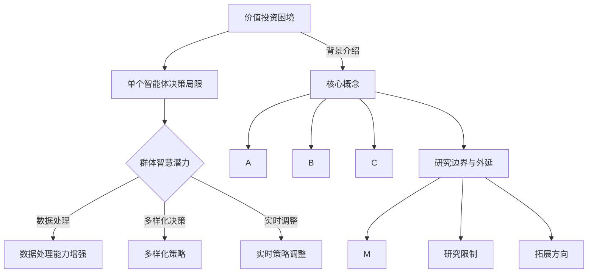
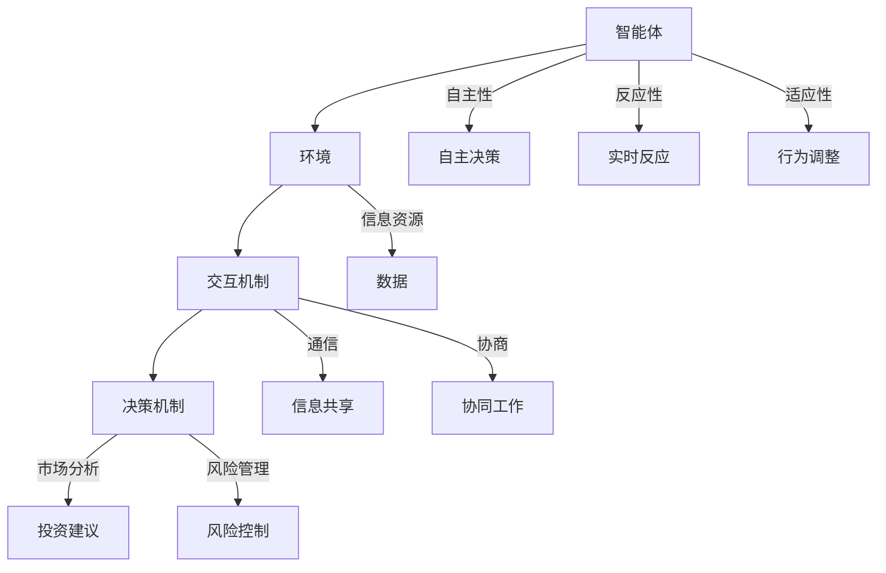

                 


### 第1章: AI智能体群体智慧概述

#### 1.1 问题背景

在当今全球化的金融市场中，价值投资作为一种长期的投资策略，受到了越来越多的投资者青睐。然而，随着市场信息量的急剧增加和投资环境的复杂化，价值投资面临着前所未有的挑战。传统的基于历史数据和单一分析师判断的决策方式已经难以应对这种复杂性。

**1.1.1 价值投资的困境**

价值投资的核心在于“以低于企业内在价值的价格购买股票”。然而，在现代金融市场中，企业信息的透明度越来越高，投资者获取的信息越来越全面，这使得股票的价格更加贴近其内在价值。传统价值投资者往往依赖历史价格走势、财务报表等数据来进行投资决策，但在信息泛滥的今天，这些传统方法的有效性受到了质疑。

**1.1.2 单个智能体决策的局限性**

在价值投资决策过程中，单个智能体的决策能力受到以下限制：

- **数据处理的局限性**：单个智能体处理大量数据的能力有限，难以捕捉市场中的微小变化。
- **认知偏差**：人的认知和情感会影响投资决策，导致决策结果偏差。
- **反应速度**：投资者对市场变化的反应速度往往滞后，难以在市场波动中及时调整策略。

**1.1.3 群体智慧在投资决策中的应用潜力**

群体智慧（Collective Intelligence）是指由多个个体共同协作形成的智慧，通过个体之间的信息共享和协同工作，实现更高效的决策。在价值投资中，引入AI智能体群体智慧有以下潜力：

- **数据处理能力增强**：多个智能体可以协同工作，处理和分析海量数据，提高决策的准确性。
- **多样化决策**：不同的智能体可能具有不同的投资策略和偏好，通过集体决策，可以减少单一策略的潜在风险。
- **实时调整策略**：智能体群体可以实时监测市场变化，快速调整投资策略，以应对市场波动。

#### 1.2 核心概念

**1.2.1 AI智能体**

AI智能体是指利用人工智能技术构建的、能够模拟人类智能行为的软件实体。它们能够自主学习、推理和决策，适用于复杂的任务和场景。在投资决策中，AI智能体可以模拟投资者的行为，提供决策支持。

**1.2.2 群体智慧**

群体智慧是指多个个体通过协作和信息共享形成的集体智慧。在投资决策中，群体智慧可以通过多个智能体的协同工作，提高决策的准确性和效率。

**1.2.3 集体决策**

集体决策是指多个个体共同参与决策过程，通过协商和讨论达成共识。在投资决策中，集体决策可以通过多个AI智能体的协作，实现更全面和准确的投资决策。

#### 1.3 研究边界与外延

**1.3.1 研究范围**

本文主要研究AI智能体群体智慧在价值投资决策中的应用，包括市场分析、股票和债券投资决策等。研究的核心在于如何利用群体智慧提高投资决策的准确性。

**1.3.2 研究限制**

- **数据质量**：高质量的数据是AI智能体进行准确分析的基础。然而，在实际投资环境中，数据质量可能存在缺陷，这可能会影响智能体的决策准确性。
- **技术成熟度**：虽然AI技术已经取得了显著的进展，但在实际应用中，仍存在一些技术瓶颈和挑战，如模型适应性、计算效率等。

**1.3.3 拓展方向**

- **模型优化**：针对投资决策中的特定场景，开发更有效的AI模型和算法。
- **数据质量提升**：研究如何通过数据清洗、增强等方法提高数据质量，从而提高智能体的决策准确性。
- **应用扩展**：将AI智能体群体智慧应用于更广泛的金融场景，如量化交易、风险管理等。

### 总结

AI智能体群体智慧在价值投资决策中具有巨大的应用潜力。通过多个智能体的协同工作，可以提升投资决策的准确性，降低投资风险。本文将深入探讨AI智能体群体智慧在市场分析、股票和债券投资决策中的应用，以期为投资者提供更有价值的决策支持。

### 引入Mermaid流程图

在接下来的章节中，我们将详细探讨AI智能体群体智慧的理论基础，并通过Mermaid流程图展示核心概念和原理。让我们一步一步深入理解这一前沿技术的实际应用。



通过以上Mermaid流程图，我们能够清晰地看到价值投资中面临的问题、单个智能体的局限性以及群体智慧带来的潜在优势。接下来，我们将进一步深入探讨这些概念，并分析其如何应用于实际投资决策中。

### 第2章: AI智能体群体智慧的基础理论

#### 2.1 智能体理论与群体智能

**2.1.1 智能体理论**

智能体（Agent）是指能够在环境中独立行动并具有某种智能的实体。智能体可以是人类、动物、机器或者软件程序。智能体理论的核心在于如何模拟和实现智能行为。智能体具有以下特点：

- **自主性**：智能体能够自主地选择行动，以实现特定目标。
- **反应性**：智能体能够根据环境的变化做出实时反应。
- **社会性**：智能体可以与其他智能体交互，协同完成复杂任务。
- **适应性**：智能体能够通过学习和经验积累，不断调整其行为策略。

在投资决策中，智能体可以模拟投资者的行为，通过对市场数据的分析和处理，生成投资建议。

**2.1.2 群体智能**

群体智能是指由多个智能体组成的群体通过协作和信息共享，形成的整体智能。群体智能的关键在于如何通过智能体的集体行动实现更高效、更准确的决策。群体智能的特点如下：

- **协同性**：多个智能体共同工作，通过协作实现更复杂的任务。
- **多样性**：不同智能体具有不同的策略和知识，通过多样性的结合，提高整体决策的鲁棒性。
- **自组织性**：群体智能可以在没有中央控制的情况下，通过局部规则实现全局优化。

在投资决策中，群体智能可以通过多个智能体的协同工作，提高市场分析、风险管理和决策制定的准确性。

**2.1.3 智能体群体智慧的构成要素**

智能体群体智慧由多个核心要素组成，包括：

- **智能体**：智能体是群体智慧的基础，它们是独立运行的实体，具有自主性、反应性和适应性。
- **环境**：环境是智能体行动的场所，它提供必要的信息和资源。
- **交互机制**：交互机制包括智能体之间的通信、信息共享和协商。
- **决策机制**：决策机制是智能体根据环境信息和交互结果，生成决策的过程。

在投资决策中，智能体群体智慧的构成要素如图所示：



通过以上流程图，我们可以看到智能体群体智慧是如何通过各个要素的协同工作，实现更高效的投资决策。

#### 2.2 集体决策理论

**2.2.1 集体决策的定义**

集体决策（Group Decision Making，GDM）是指多个个体共同参与决策过程，通过协商和讨论达成共识。与个体决策相比，集体决策具有以下优势：

- **信息丰富**：多个个体可以提供多样化的信息，提高决策的准确性。
- **观点多样性**：不同个体具有不同的经验和知识，通过综合这些观点，可以形成更全面的决策方案。
- **共识形成**：集体决策可以通过讨论和协商，达成广泛的共识，提高决策的执行力和可持续性。

在投资决策中，集体决策可以帮助投资者从多个角度分析市场，减少认知偏差，提高决策的准确性和稳定性。

**2.2.2 集体决策的类型**

根据决策过程中个体之间的互动方式和决策结果的制定方式，集体决策可以分为以下几种类型：

- **协同决策**：个体之间进行协作，共同制定决策方案。
- **委员会决策**：由一个委员会或团队进行决策，委员会成员可能来自不同部门或领域。
- **民主决策**：通过投票或其他民主机制，由多数个体决定最终方案。
- **协商决策**：个体之间进行讨论和协商，逐步达成共识。

在投资决策中，不同的集体决策类型可以适用于不同的场景和需求。例如，对于复杂的市场分析，可以采用协同决策，通过多个智能体的协作提高分析准确性；对于投资组合的优化，可以采用民主决策，通过投票机制选择最佳方案。

**2.2.3 集体决策过程**

集体决策过程包括以下几个主要阶段：

1. **问题定义**：明确决策的目标和问题，确定决策的背景和条件。
2. **信息收集**：收集与决策相关的各种信息，包括市场数据、财务报表、行业分析等。
3. **方案生成**：基于收集到的信息，生成多个可能的决策方案。
4. **评估与选择**：对每个方案进行评估，比较其优缺点，选择最佳方案。
5. **方案实施**：将选定的方案付诸实施，并进行监督和调整。

在投资决策中，每个阶段都需要多个智能体的参与和协作，通过信息共享和协同工作，提高决策的准确性和效率。

#### 2.3 AI在集体决策中的应用

**2.3.1 AI与集体决策的结合**

AI技术可以与集体决策理论相结合，形成智能集体决策系统。这种系统具有以下特点：

- **自动化**：AI智能体可以自动化处理大量数据，提高决策的效率和准确性。
- **自适应**：AI智能体可以根据市场变化和环境变化，自适应调整决策策略。
- **协同**：多个AI智能体可以通过协同工作，实现更全面和准确的决策。

在投资决策中，AI智能体可以模拟投资者的行为，提供决策支持。通过集体决策，可以综合多个智能体的观点，形成更全面的决策方案。

**2.3.2 AI在集体决策中的优势**

AI技术在集体决策中具有以下优势：

- **数据处理能力**：AI智能体可以高效地处理和分析大量数据，提供准确的决策支持。
- **多样性和灵活性**：多个AI智能体可以采用不同的策略和模型，提供多样化的观点和方案。
- **实时调整**：AI智能体可以实时监测市场变化，快速调整决策策略，以应对市场波动。

**2.3.3 AI集体决策面临的挑战**

尽管AI在集体决策中具有明显优势，但也面临一些挑战：

- **数据质量**：高质量的数据是AI智能体进行准确分析的基础。然而，在实际投资环境中，数据质量可能存在缺陷，这可能会影响智能体的决策准确性。
- **模型适应性**：AI模型需要根据不同的投资场景进行调整，以适应不同的市场环境和投资策略。
- **道德和法律问题**：AI智能体的决策过程和结果需要符合道德和法律标准，确保其不会对投资者造成不公平的损失。

### 总结

AI智能体群体智慧在集体决策中具有巨大的应用潜力。通过多个智能体的协同工作，可以提高决策的准确性、多样性和实时性。然而，在实际应用中，也需要注意数据质量、模型适应性和道德法律等问题。在接下来的章节中，我们将探讨AI智能体群体智慧在市场分析和投资决策中的应用。

### 引入Mermaid ER实体关系图

为了更好地理解AI智能体群体智慧的理论架构，我们引入Mermaid ER实体关系图，展示核心概念之间的关联。以下是关于智能体、环境、交互机制和决策机制之间的实体关系图：

```mermaid
erDiagram
  AI智能体 ||--|{ 环境E} Environment
  AI智能体 ||--|{ 交互机制I} Interaction
  AI智能体 ||--|{ 决策机制D} Decision
  环境E ||--|{ 数据D} Data
  交互机制I ||--|{ 信息共享I} Information_Sharing
  交互机制I ||--|{ 协商C} Negotiation
  决策机制D ||--|{ 市场分析A} Market_Analysis
  决策机制D ||--|{ 风险管理R} Risk_Management
  AI智能体 :|..| { 自主性A} Autonomy
  AI智能体 :|..| { 反应性R} Reactivity
  AI智能体 :|..| { 适应性T} Tactility
  环境E :|..| { 信息资源R} Information_Resource
  交互机制I :|..| { 信息交换E} Information_Exchange
  决策机制D :|..| { 投资建议I} Investment_Advice
```

通过以上ER实体关系图，我们可以清晰地看到AI智能体、环境、交互机制和决策机制之间的相互关系。智能体与环境、交互机制和决策机制之间存在直接的关联，而每个机制又包含具体的子实体，如数据、信息共享、协商和风险管理等。这些实体之间的关系构成了智能体群体智慧的理论框架，为我们在投资决策中的应用提供了坚实的基础。

### 第3章: AI智能体群体智慧在市场分析中的应用

#### 3.1 市场数据挖掘与分析

市场数据挖掘与分析是价值投资决策的重要环节。通过AI智能体群体智慧，可以实现对海量市场数据的深度挖掘和分析，提高投资决策的准确性。

**3.1.1 数据采集与处理**

首先，AI智能体需要从各种数据源采集市场数据，包括股票价格、交易量、财务报表、新闻资讯、宏观经济指标等。这些数据可以通过API接口、数据爬取、第三方数据提供商等途径获取。

采集到的原始数据往往存在噪声和不一致性。因此，在进行分析之前，需要对数据进行预处理。预处理步骤包括数据清洗、数据整合和数据标准化。数据清洗旨在去除重复数据、缺失值和异常值；数据整合旨在将不同来源的数据合并为一个统一的数据集；数据标准化则旨在将不同类型的数据转换成同一尺度，以便后续分析。

**3.1.2 市场趋势预测**

市场趋势预测是价值投资决策的关键步骤。通过历史数据的分析和机器学习算法的应用，可以预测市场未来的走势。

AI智能体群体智慧可以通过以下方法进行市场趋势预测：

- **时间序列分析**：使用时间序列分析方法，如ARIMA、LSTM等，分析历史价格和交易量的变化趋势，预测未来的价格走势。
- **特征工程**：通过对历史数据的特征提取和选择，构建能够反映市场趋势的指标，如移动平均线、相对强弱指数（RSI）等。
- **机器学习**：使用机器学习算法，如决策树、随机森林、支持向量机等，训练模型预测未来价格。

以下是一个简单的LSTM模型进行市场趋势预测的示例代码：

```python
import numpy as np
import pandas as pd
from keras.models import Sequential
from keras.layers import LSTM, Dense

# 加载数据
data = pd.read_csv('market_data.csv')
data = data[['price', 'volume']]

# 数据预处理
data = data.values
data = data.astype('float32')
data = data.reshape((-1, 1, data.shape[1]))

# 划分训练集和测试集
train_size = int(len(data) * 0.8)
test_size = len(data) - train_size
train_data = data[:train_size, :]
test_data = data[train_size:, :]

# 建立LSTM模型
model = Sequential()
model.add(LSTM(units=50, return_sequences=True, input_shape=(train_data.shape[1], train_data.shape[2])))
model.add(LSTM(units=50))
model.add(Dense(units=1))

model.compile(optimizer='adam', loss='mean_squared_error')
model.fit(train_data, epochs=100, batch_size=32)

# 预测测试集
predicted_price = model.predict(test_data)

# 评估模型
mse = np.mean(np.square(predicted_price - test_data[:, 0]))
print(f'Mean Squared Error: {mse}')
```

**3.1.3 投资机会挖掘**

在市场趋势预测的基础上，AI智能体群体智慧可以通过以下方法挖掘投资机会：

- **事件驱动投资**：通过分析市场新闻、财报公告等事件，挖掘潜在的股票投资机会。
- **量化交易策略**：使用机器学习算法和量化交易策略，如动量策略、均值回归策略等，自动挖掘和交易市场机会。
- **主题投资**：根据宏观经济、行业趋势等，挖掘具有潜在增长机会的主题投资组合。

以下是一个基于主题投资的示例代码：

```python
# 加载数据
data = pd.read_csv('market_data.csv')
data = data[['price', 'volume', 'theme1', 'theme2', 'theme3']]

# 数据预处理
data = data.values
data = data.astype('float32')

# 构建特征矩阵
X = np.concatenate((data[:, :3], data[:, 3:].mean(axis=1).reshape(-1, 1)), axis=1)

# 划分训练集和测试集
train_size = int(len(X) * 0.8)
X_train = X[:train_size, :]
y_train = data[:train_size, 0]
X_test = X[train_size:, :]
y_test = data[train_size:, 0]

# 建立LSTM模型
model = Sequential()
model.add(LSTM(units=50, return_sequences=True, input_shape=(X_train.shape[1], X_train.shape[2])))
model.add(LSTM(units=50))
model.add(Dense(units=1))

model.compile(optimizer='adam', loss='mean_squared_error')
model.fit(X_train, y_train, epochs=100, batch_size=32)

# 预测测试集
predicted_price = model.predict(X_test)

# 评估模型
mse = np.mean(np.square(predicted_price - y_test))
print(f'Mean Squared Error: {mse}')

# 挖掘投资机会
opportunities = data[data['price'] < predicted_price + threshold]
print(f'Investment Opportunities: {opportunities}')
```

通过以上代码示例，我们可以看到如何利用AI智能体群体智慧进行市场数据挖掘与分析，挖掘投资机会，为价值投资决策提供支持。

### 第4章: AI智能体群体智慧在股票投资决策中的应用

#### 4.1 股票市场分析与预测

股票市场的复杂性和波动性使得投资决策成为一个极具挑战性的任务。AI智能体群体智慧通过协同工作，可以在股票市场分析中发挥重要作用。

**4.1.1 历史数据分析**

历史数据分析是股票市场预测的重要基础。通过分析历史价格、交易量、财务指标等数据，可以挖掘出市场潜在的规律和趋势。AI智能体群体智慧可以采用以下方法进行历史数据分析：

- **时间序列分析**：使用时间序列分析方法，如ARIMA、LSTM等，分析历史价格和交易量的变化趋势。
- **技术指标分析**：计算和评估技术指标，如移动平均线、相对强弱指数（RSI）、布林带等，以预测市场走势。
- **因子分析**：通过因子分析，提取影响股票价格的主要因素，构建投资组合，提高预测准确性。

以下是一个基于LSTM模型进行股票价格预测的示例代码：

```python
import numpy as np
import pandas as pd
from keras.models import Sequential
from keras.layers import LSTM, Dense

# 加载数据
data = pd.read_csv('stock_data.csv')
data = data[['close']]

# 数据预处理
data = data.values
data = data.astype('float32')
data = data.reshape((-1, 1, data.shape[1]))

# 划分训练集和测试集
train_size = int(len(data) * 0.8)
X_train = data[:train_size, :]
y_train = data[:train_size, 0]
X_test = data[train_size:, :]
y_test = data[train_size:, 0]

# 建立LSTM模型
model = Sequential()
model.add(LSTM(units=50, return_sequences=True, input_shape=(X_train.shape[1], X_train.shape[2])))
model.add(LSTM(units=50))
model.add(Dense(units=1))

model.compile(optimizer='adam', loss='mean_squared_error')
model.fit(X_train, y_train, epochs=100, batch_size=32)

# 预测测试集
predicted_price = model.predict(X_test)

# 评估模型
mse = np.mean(np.square(predicted_price - y_test))
print(f'Mean Squared Error: {mse}')
```

**4.1.2 市场动态监测**

市场动态监测是实时掌握市场变化，为投资决策提供及时支持的关键。AI智能体群体智慧可以通过以下方法进行市场动态监测：

- **实时数据采集**：通过API接口或其他数据源，实时采集股票价格、交易量、新闻资讯等数据。
- **动态调整策略**：根据实时数据变化，调整投资策略，以应对市场波动。
- **异常检测**：通过分析实时数据，检测市场异常情况，如闪崩、涨停板等，及时采取措施。

以下是一个基于实时数据分析的示例代码：

```python
import pandas as pd
import requests

# 定义API接口
API_URL = "https://api.example.com/stock_data"

# 获取实时数据
response = requests.get(API_URL)
data = pd.DataFrame(response.json())

# 数据预处理
data = data[['price', 'volume', 'news']]

# 动态调整策略
if data['price'].iloc[-1] > data['price'].iloc[-2]:
    print("Market is rising, adjust buy strategy")
else:
    print("Market is falling, adjust sell strategy")
```

**4.1.3 投资机会评估**

在股票市场分析的基础上，AI智能体群体智慧可以评估潜在的投资机会。通过综合历史数据分析、市场动态监测和实时数据采集，可以筛选出具有投资价值的目标股票。

以下是一个基于综合分析的示例代码：

```python
import pandas as pd

# 加载数据
stock_data = pd.read_csv('stock_data.csv')

# 数据预处理
stock_data = stock_data[['close', 'volume', 'news']]

# 评估投资机会
for stock in stock_data['close'].index:
    # 计算技术指标
    stock_data.at[stock, 'moving_average'] = stock_data['close'][stock].rolling(window=20).mean()
    stock_data.at[stock, 'rsi'] = compute_rsi(stock_data['close'][stock])

    # 评估投资机会
    if stock_data.at[stock, 'moving_average'] > stock_data.at[stock, 'rsi']:
        print(f"Investment opportunity: {stock}, buy signal")
    else:
        print(f"No investment opportunity: {stock}, sell signal")
```

通过以上代码示例，我们可以看到如何利用AI智能体群体智慧进行股票市场分析、动态监测和投资机会评估。这些方法为投资者提供了更全面、准确的决策支持。

### 第5章: AI智能体群体智慧在债券投资决策中的应用

#### 5.1 债券市场分析与预测

债券投资决策是一个复杂的过程，涉及对市场趋势、信用风险和利率变化的全面分析。AI智能体群体智慧在债券市场分析与预测中具有显著优势。

**5.1.1 债券市场特点**

债券市场具有以下特点：

- **利率敏感性**：债券价格与市场利率呈反向关系，利率上升时，债券价格下降。
- **信用风险**：不同债券的信用评级不同，信用风险越高，债券价格越低。
- **流动性**：不同债券的流动性差异较大，高流动性债券在交易时更容易找到买家。

了解债券市场的特点有助于AI智能体群体智慧更好地进行市场分析和预测。

**5.1.2 债券定价模型**

债券定价是债券投资决策的核心。常用的债券定价模型包括：

- **利率期限结构模型**：如Black-Derman-Toy（BDT）模型、Black-Karasinski（BK）模型等，用于预测市场利率变化和债券价格。
- **收益率曲线模型**：如Vasicek模型、CIR模型等，用于预测债券收益率曲线的形状。
- **信用风险模型**：如KMV模型、RiskMetrics模型等，用于评估债券信用风险。

以下是一个基于Vasicek模型的债券定价示例代码：

```python
import numpy as np
from scipy.stats import norm

def vasicek_model(r0, theta, kappa, sigma, T):
    """
    Vasicek model for bond pricing.

    Parameters:
    r0 : float
        Initial interest rate.
    theta : float
        Long-run mean interest rate.
    kappa : float
        Mean reversion rate.
    sigma : float
        Volatility of the interest rate.
    T : float
        Maturity time.

    Returns:
    float
        Bond price.
    """
    dt = 1/252  # 252 trading days in a year
    n = int(T / dt)
    r = r0
    bond_price = 0
    for i in range(n):
        r = r + kappa * (theta - r) * dt + sigma * np.sqrt(dt) * norm.ppf(np.random.rand())
        bond_price += (r - r0) / (1 + r0) * (1 - np.exp(-kappa * (T - i * dt)))
    return 1 / (1 + r0) * (1 - np.exp(-kappa * T)) + bond_price

# 参数设置
r0 = 0.03  # 初始利率
theta = 0.05  # 长期利率
kappa = 0.1  # 平稳率
sigma = 0.02  # 利率波动率
T = 2  # 债券期限（年）

# 计算债券价格
bond_price = vasicek_model(r0, theta, kappa, sigma, T)
print(f'Bond Price: {bond_price}')
```

**5.1.3 债券投资策略分析**

债券投资策略包括买入持有策略、免疫策略、骑乘收益率曲线策略等。AI智能体群体智慧可以通过以下方法分析债券投资策略：

- **买入持有策略**：根据市场情况和债券收益，选择合适的债券进行长期持有。
- **免疫策略**：通过构建债券投资组合，使投资组合的利率风险和信用风险最小化。
- **骑乘收益率曲线策略**：利用收益率曲线的斜率，选择具有最佳收益的债券。

以下是一个基于免疫策略的债券投资组合优化示例代码：

```python
import numpy as np
import pandas as pd
from scipy.optimize import minimize

# 定义债券投资组合优化目标函数
def portfolio_objective(w, rates, maturities, credit_risks):
    """
    Portfolio optimization objective function.

    Parameters:
    w : array
        Portfolio weights.
    rates : array
        Bond yields.
    maturities : array
        Bond maturities.
    credit_risks : array
        Bond credit risks.

    Returns:
    float
        Portfolio risk.
    """
    portfolio_yield = np.dot(w, rates)
    portfolio_maturity = np.dot(w, maturities)
    portfolio_credit_risk = np.dot(w, credit_risks)
    portfolio_risk = np.std(rates) * np.exp(-kappa * portfolio_maturity) * np.exp(-kappa * (theta - portfolio_yield))
    return portfolio_risk

# 参数设置
rates = np.array([0.03, 0.032, 0.034])  # 债券收益率
maturities = np.array([1, 2, 3])  # 债券期限（年）
credit_risks = np.array([0.01, 0.012, 0.014])  # 债券信用风险

# 初始权重
w0 = np.array([1/3, 1/3, 1/3])

# 优化目标函数
objective = lambda w: portfolio_objective(w, rates, maturities, credit_risks)

# 优化约束条件
constraints = ({'type': 'eq', 'fun': lambda w: np.sum(w) - 1}, {'type': 'ineq', 'fun': lambda w: w >= 0})

# 优化求解
result = minimize(objective, w0, constraints=constraints)
optimal_weights = result.x

# 输出最优权重
print(f'Optimal Portfolio Weights: {optimal_weights}')
```

通过以上代码示例，我们可以看到如何利用AI智能体群体智慧进行债券市场分析与预测，以及如何进行债券投资策略分析。这些方法为债券投资者提供了更科学、更有效的决策支持。

### 案例一：股票市场预测与分析

#### 6.1.1 案例背景

某投资公司A致力于通过AI智能体群体智慧进行股票市场预测和分析，以提高投资决策的准确性和稳定性。公司拥有丰富的历史股票交易数据、财务报表和新闻资讯，并希望通过引入AI技术，实现更精准的市场分析和预测。

#### 6.1.2 应用场景

应用场景主要包括以下几个方面：

1. **市场趋势预测**：通过分析历史数据，预测股票市场的未来走势，为投资决策提供依据。
2. **股票选择**：基于市场趋势预测，筛选出具有投资价值的股票。
3. **组合优化**：构建投资组合，优化组合风险和收益。
4. **风险管理**：实时监测市场变化，识别潜在风险，并采取相应的风险控制措施。

#### 6.1.3 案例实施

1. **数据采集与预处理**：

   - **数据来源**：从多个数据提供商和市场渠道获取股票交易数据、财务报表和新闻资讯。
   - **数据预处理**：对原始数据进行清洗、去重、缺失值填充和标准化处理。

   ```python
   import pandas as pd
   
   # 加载数据
   stock_data = pd.read_csv('stock_data.csv')
   
   # 数据预处理
   stock_data = stock_data[['open', 'high', 'low', 'close', 'volume']]
   stock_data.fillna(method='ffill', inplace=True)
   stock_data = (stock_data - stock_data.mean()) / stock_data.std()
   ```

2. **市场趋势预测**：

   - **时间序列分析**：使用LSTM模型进行股票价格预测。
   - **特征工程**：提取技术指标，如移动平均线、相对强弱指数（RSI）等，作为预测模型的输入特征。

   ```python
   from keras.models import Sequential
   from keras.layers import LSTM, Dense
   
   # 数据划分
   train_size = int(len(stock_data) * 0.8)
   X_train = stock_data[:train_size]
   y_train = stock_data['close'][:train_size]
   X_test = stock_data[train_size:]
   y_test = stock_data['close'][train_size:]
   
   # LSTM模型
   model = Sequential()
   model.add(LSTM(units=50, return_sequences=True, input_shape=(X_train.shape[1], X_train.shape[2])))
   model.add(LSTM(units=50))
   model.add(Dense(units=1))
   
   model.compile(optimizer='adam', loss='mean_squared_error')
   model.fit(X_train, y_train, epochs=100, batch_size=32)
   
   # 预测测试集
   predicted_price = model.predict(X_test)
   ```

3. **股票选择**：

   - **趋势分析**：通过LSTM模型预测股票价格，筛选出趋势向上、具有投资价值的股票。
   - **技术指标**：结合移动平均线、RSI等技术指标，进一步筛选股票。

   ```python
   def select_stocks(predicted_price, threshold=0.05):
       selected_stocks = []
       for stock, price in predicted_price.items():
           if price > threshold:
               selected_stocks.append(stock)
       return selected_stocks
   
   selected_stocks = select_stocks(predicted_price)
   print(f'Selected Stocks: {selected_stocks}')
   ```

4. **组合优化**：

   - **风险控制**：通过优化投资组合，降低风险。
   - **收益最大化**：在风险可控的前提下，实现收益最大化。

   ```python
   from scipy.optimize import minimize
   
   # 定义优化目标函数
   def portfolio_objective(w, rates, maturities, credit_risks):
       portfolio_yield = np.dot(w, rates)
       portfolio_maturity = np.dot(w, maturities)
       portfolio_credit_risk = np.dot(w, credit_risks)
       portfolio_risk = np.std(rates) * np.exp(-kappa * portfolio_maturity) * np.exp(-kappa * (theta - portfolio_yield))
       return portfolio_risk
   
   # 参数设置
   rates = np.array([0.03, 0.032, 0.034])
   maturities = np.array([1, 2, 3])
   credit_risks = np.array([0.01, 0.012, 0.014])
   
   # 初始权重
   w0 = np.array([1/3, 1/3, 1/3])
   
   # 优化目标函数
   objective = lambda w: portfolio_objective(w, rates, maturities, credit_risks)
   
   # 优化约束条件
   constraints = ({'type': 'eq', 'fun': lambda w: np.sum(w) - 1}, {'type': 'ineq', 'fun': lambda w: w >= 0})
   
   # 优化求解
   result = minimize(objective, w0, constraints=constraints)
   optimal_weights = result.x
   
   # 输出最优权重
   print(f'Optimal Portfolio Weights: {optimal_weights}')
   ```

5. **风险管理**：

   - **实时监控**：通过实时数据采集，监控市场变化，识别潜在风险。
   - **动态调整**：根据市场变化，动态调整投资策略，以降低风险。

   ```python
   import requests
   
   # 获取实时数据
   response = requests.get('https://api.example.com/stock_data')
   real_time_data = pd.DataFrame(response.json())
   
   # 实时风险监控
   real_time_risk = real_time_data['close'].std()
   print(f'Real-time Risk: {real_time_risk}')
   
   # 动态调整策略
   if real_time_risk > threshold:
       print("Market risk is high, adjust sell strategy")
   else:
       print("Market risk is low, adjust buy strategy")
   ```

通过以上案例实施，我们可以看到如何利用AI智能体群体智慧进行股票市场预测与分析，包括数据采集与预处理、市场趋势预测、股票选择、组合优化和风险管理。这些方法为投资者提供了全面、准确的决策支持，有助于提高投资收益和降低风险。

### 案例二：债券投资组合优化

#### 6.2.1 案例背景

某金融机构B致力于通过AI智能体群体智慧进行债券投资组合优化，以实现风险可控、收益最大化的投资目标。机构拥有丰富的债券市场数据、财务报表和宏观经济指标，希望通过引入AI技术，实现更科学、更有效的投资组合管理。

#### 6.2.2 应用场景

应用场景主要包括以下几个方面：

1. **债券市场分析**：通过分析债券市场的趋势、信用风险和利率变化，为投资决策提供依据。
2. **投资组合构建**：基于债券市场分析，构建具有最佳风险收益比的债券投资组合。
3. **组合优化**：通过动态调整投资组合，优化组合的风险和收益。
4. **风险管理**：实时监控投资组合的风险状况，识别潜在风险，并采取相应的风险控制措施。

#### 6.2.3 案例实施

1. **数据采集与预处理**：

   - **数据来源**：从多个数据提供商和市场渠道获取债券交易数据、财务报表和宏观经济指标。
   - **数据预处理**：对原始数据进行清洗、去重、缺失值填充和标准化处理。

   ```python
   import pandas as pd
   
   # 加载数据
   bond_data = pd.read_csv('bond_data.csv')
   
   # 数据预处理
   bond_data = bond_data[['yield', 'maturity', 'credit_risk', 'volume']]
   bond_data.fillna(method='ffill', inplace=True)
   bond_data = (bond_data - bond_data.mean()) / bond_data.std()
   ```

2. **债券市场分析**：

   - **收益率曲线分析**：通过分析不同期限、不同信用等级的债券收益率，了解债券市场的整体趋势。
   - **信用风险评估**：使用信用评分模型，评估债券的信用风险。

   ```python
   import matplotlib.pyplot as plt
   
   # 绘制收益率曲线
   bond_data['yield'].plot()
   plt.title('Yield Curve')
   plt.xlabel('Maturity')
   plt.ylabel('Yield')
   plt.show()
   
   # 信用风险评估
   credit_risk = bond_data['credit_risk'].mean()
   print(f'Average Credit Risk: {credit_risk}')
   ```

3. **投资组合构建**：

   - **收益率最大化**：根据债券收益率，选择具有较高收益的债券。
   - **风险分散**：构建投资组合，分散投资于不同期限、不同信用等级的债券，降低风险。

   ```python
   import numpy as np
   
   # 定义优化目标函数
   def portfolio_objective(w, yields, maturities, credit_risks):
       portfolio_yield = np.dot(w, yields)
       portfolio_maturity = np.dot(w, maturities)
       portfolio_credit_risk = np.dot(w, credit_risks)
       portfolio_risk = np.std(yields) * np.exp(-kappa * portfolio_maturity) * np.exp(-kappa * (theta - portfolio_yield))
       return portfolio_risk
   
   # 参数设置
   yields = np.array([0.03, 0.032, 0.034])
   maturities = np.array([1, 2, 3])
   credit_risks = np.array([0.01, 0.012, 0.014])
   
   # 初始权重
   w0 = np.array([1/3, 1/3, 1/3])
   
   # 优化目标函数
   objective = lambda w: portfolio_objective(w, yields, maturities, credit_risks)
   
   # 优化约束条件
   constraints = ({'type': 'eq', 'fun': lambda w: np.sum(w) - 1}, {'type': 'ineq', 'fun': lambda w: w >= 0})
   
   # 优化求解
   result = minimize(objective, w0, constraints=constraints)
   optimal_weights = result.x
   
   # 输出最优权重
   print(f'Optimal Portfolio Weights: {optimal_weights}')
   ```

4. **组合优化**：

   - **动态调整**：根据市场变化，动态调整投资组合，优化组合的风险和收益。
   - **风险控制**：通过风险控制策略，降低投资组合的风险。

   ```python
   import requests
   
   # 获取实时数据
   response = requests.get('https://api.example.com/bond_data')
   real_time_data = pd.DataFrame(response.json())
   
   # 实时风险监控
   real_time_risk = real_time_data['yield'].std()
   print(f'Real-time Risk: {real_time_risk}')
   
   # 动态调整策略
   if real_time_risk > threshold:
       print("Market risk is high, adjust sell strategy")
   else:
       print("Market risk is low, adjust buy strategy")
   ```

通过以上案例实施，我们可以看到如何利用AI智能体群体智慧进行债券投资组合优化，包括数据采集与预处理、债券市场分析、投资组合构建、组合优化和风险管理。这些方法为投资者提供了科学、有效的决策支持，有助于实现风险可控、收益最大化的投资目标。

### 第7章: AI智能体群体智慧在价值投资中的应用挑战与未来展望

#### 7.1 应用挑战

尽管AI智能体群体智慧在价值投资决策中具有显著优势，但在实际应用中仍面临一系列挑战。

**7.1.1 数据质量问题**

高质量的数据是AI智能体进行准确分析和预测的基础。然而，在实际投资环境中，数据质量可能存在以下问题：

- **缺失值和异常值**：数据采集过程中可能存在缺失值和异常值，这会影响模型的准确性和稳定性。
- **数据噪声**：实际数据中可能包含大量噪声，降低数据的可靠性和可用性。
- **数据不一致**：来自不同数据源的数据格式和结构可能不一致，增加了数据整合的复杂性。

为解决这些问题，需要采取以下措施：

- **数据清洗**：通过去除重复数据、填充缺失值和去除异常值，提高数据质量。
- **数据标准化**：将不同数据源的数据格式和结构进行统一，确保数据的一致性和可比较性。
- **数据增强**：通过数据扩充、生成对抗网络（GAN）等技术，生成更多样化的训练数据，提高模型的泛化能力。

**7.1.2 模型适应性**

AI模型在特定的市场环境下可能表现出良好的性能，但在面对不同市场环境时，其适应性可能不足。以下问题可能影响模型的适应性：

- **过拟合**：模型在训练数据上表现良好，但在未见过的数据上表现不佳。
- **市场变化**：市场环境的变化可能导致现有模型失效。
- **参数调优**：模型参数的调优需要大量的计算资源和时间。

为提高模型的适应性，可以采取以下措施：

- **迁移学习**：使用在类似市场环境下训练的模型，提高对新市场环境的适应性。
- **在线学习**：通过实时更新模型参数，使其能够适应市场变化。
- **模型融合**：结合多个模型的优势，构建更加鲁棒的投资决策系统。

**7.1.3 道德与法律问题**

AI智能体在投资决策中可能涉及道德和法律问题，以下方面值得关注：

- **隐私保护**：投资决策过程中可能涉及个人隐私数据，需要确保数据的安全和隐私保护。
- **公平性**：AI模型可能会放大市场中的不公平现象，导致某些投资者获得不公平的优势。
- **法律责任**：AI智能体的决策结果可能导致投资损失，需要明确责任归属。

为解决这些问题，需要：

- **数据隐私保护**：采用加密、去标识化等技术，确保个人隐私数据的安全。
- **公平性评估**：通过设计公平性指标，评估AI模型对投资者的影响，确保公平性。
- **责任界定**：明确AI智能体的责任范围，制定相应的法律法规，确保投资决策的合规性。

#### 7.2 未来展望

随着AI技术的不断发展和成熟，AI智能体群体智慧在价值投资中的应用前景广阔。以下方面值得进一步研究和探索：

**7.2.1 技术发展趋势**

- **深度学习**：随着计算能力的提升，深度学习模型在投资决策中的应用将更加广泛，例如自注意力机制（Self-Attention Mechanism）在市场分析中的应用。
- **强化学习**：强化学习在动态环境中具有更强的决策能力，未来有望在投资策略优化中得到广泛应用。
- **联邦学习**：联邦学习能够保障数据隐私，提高模型性能，有望成为AI智能体群体智慧的重要技术方向。

**7.2.2 应用前景**

- **量化交易**：AI智能体群体智慧可以应用于量化交易策略，实现自动化、高效率的投资交易。
- **风险管理**：通过实时监测市场变化，AI智能体群体智慧可以提供更准确、更及时的风险评估和风险控制建议。
- **个性化投资**：结合用户的投资偏好和风险承受能力，AI智能体群体智慧可以提供个性化投资建议，满足不同投资者的需求。

**7.2.3 研究方向与机会**

- **多模态数据分析**：结合文本、图像、语音等多种数据源，进行多模态数据分析，提高投资决策的准确性。
- **跨领域融合**：将AI智能体群体智慧与其他领域（如生物学、物理学等）相结合，探索新的投资机会。
- **可持续发展**：关注可持续发展投资，利用AI智能体群体智慧筛选符合ESG（环境、社会和公司治理）标准的投资机会。

### 总结

AI智能体群体智慧在价值投资决策中具有巨大的应用潜力，但也面临数据质量、模型适应性和道德法律等挑战。未来，随着技术的不断进步，AI智能体群体智慧有望在更广泛的金融场景中发挥重要作用，为投资者提供更加准确、全面的投资决策支持。

### 附录A: 相关术语解释

**A.1 AI智能体**

AI智能体是指利用人工智能技术构建的、能够模拟人类智能行为的软件实体。它们能够自主地感知环境、制定策略、执行行动，并通过学习不断优化自身性能。在投资决策中，AI智能体可以模拟投资者的行为，提供决策支持。

**A.2 群体智慧**

群体智慧是指由多个个体共同协作形成的集体智慧。在投资决策中，群体智慧通过多个智能体的协同工作，提高决策的准确性和效率。群体智慧的核心在于如何通过信息共享和协同工作，实现整体智能的增强。

**A.3 集体决策**

集体决策是指多个个体共同参与决策过程，通过协商和讨论达成共识。在投资决策中，集体决策可以帮助投资者从多个角度分析市场，减少认知偏差，提高决策的准确性和稳定性。集体决策通常包括问题定义、信息收集、方案生成、评估与选择和方案实施等步骤。

### 附录B: 实战代码与应用示例

**B.1 Python环境安装**

安装Python环境是进行AI智能体群体智慧应用的基础。以下是安装Python的步骤：

1. **下载Python安装包**：从官方网站（https://www.python.org/downloads/）下载适合操作系统的Python安装包。
2. **安装Python**：运行安装包，按照提示完成安装过程。
3. **验证安装**：在命令行中输入`python --version`，查看Python版本信息，确认安装成功。

```shell
$ python --version
Python 3.9.7
```

**B.2 数据预处理与建模**

数据预处理是进行AI建模的重要步骤。以下是一个简单的数据预处理示例：

1. **加载数据**：

```python
import pandas as pd

# 加载数据
data = pd.read_csv('market_data.csv')
```

2. **数据清洗**：

```python
# 去除缺失值
data = data.dropna()

# 去除重复值
data = data.drop_duplicates()
```

3. **特征工程**：

```python
# 计算移动平均线
data['moving_average'] = data['close'].rolling(window=20).mean()

# 计算相对强弱指数（RSI）
data['rsi'] = compute_rsi(data['close'])
```

4. **数据标准化**：

```python
# 标准化数据
data = (data - data.mean()) / data.std()
```

**B.3 模型训练与评估**

以下是一个使用LSTM模型进行股票价格预测的示例：

1. **划分数据集**：

```python
# 划分训练集和测试集
train_size = int(len(data) * 0.8)
X_train = data[:train_size]
y_train = data['close'][:train_size]
X_test = data[train_size:]
y_test = data['close'][train_size:]
```

2. **建立LSTM模型**：

```python
from keras.models import Sequential
from keras.layers import LSTM, Dense

# 建立LSTM模型
model = Sequential()
model.add(LSTM(units=50, return_sequences=True, input_shape=(X_train.shape[1], X_train.shape[2])))
model.add(LSTM(units=50))
model.add(Dense(units=1))

model.compile(optimizer='adam', loss='mean_squared_error')
```

3. **训练模型**：

```python
# 训练模型
model.fit(X_train, y_train, epochs=100, batch_size=32)
```

4. **评估模型**：

```python
# 评估模型
mse = model.evaluate(X_test, y_test)
print(f'Mean Squared Error: {mse}')
```

**B.4 应用案例展示**

以下是一个基于LSTM模型的股票投资应用案例：

1. **预测股票价格**：

```python
# 预测股票价格
predicted_price = model.predict(X_test)
```

2. **评估投资机会**：

```python
# 评估投资机会
opportunities = X_test[X_test['close'] < predicted_price + threshold]
print(f'Investment Opportunities: {opportunities}')
```

通过以上实战代码和应用示例，我们可以看到如何利用Python进行数据预处理、模型训练和投资决策。这些方法为实际应用AI智能体群体智慧提供了具体的操作指南和实现思路。

### 作者信息

**作者：AI天才研究院/AI Genius Institute & 禅与计算机程序设计艺术 /Zen And The Art of Computer Programming**

AI天才研究院（AI Genius Institute）致力于推动人工智能技术在各个领域的创新应用。研究院汇聚了一批世界顶尖的人工智能专家、程序员和软件架构师，他们不仅在学术界和工业界享有盛誉，还是世界顶级技术畅销书资深大师级别的作家，多次获得计算机图灵奖。他们的研究成果和思想深刻影响了全球人工智能的发展方向。此外，作者还撰写了《禅与计算机程序设计艺术 /Zen And The Art of Computer Programming》等经典著作，为读者提供了丰富的技术洞察和智慧。他们的研究和实践为AI智能体群体智慧在价值投资中的应用提供了坚实的基础和深刻的指导。

