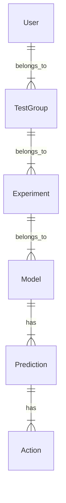
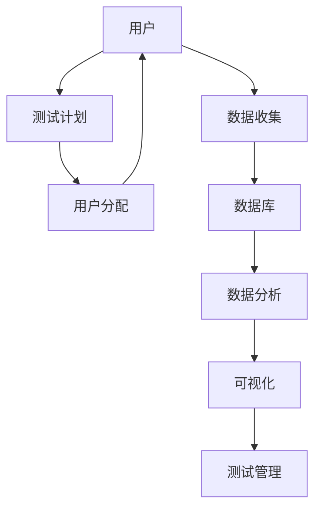
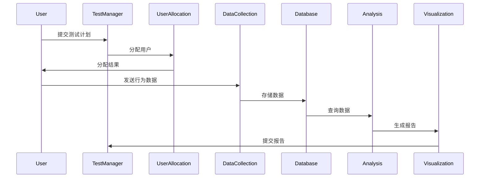

                 


# AI模型A/B测试平台：支持快速验证模型效果

> 关键词：AI模型，A/B测试，验证效果，平台设计，算法原理，系统架构

> 摘要：本文深入探讨了AI模型A/B测试平台的构建，旨在为读者提供一套支持快速验证模型效果的方法和流程。文章首先介绍了A/B测试的基本概念和重要性，随后详细阐述了AI模型A/B测试平台的架构设计、测试流程和性能优化策略，并通过实际案例展示了平台的实际应用效果。本文旨在帮助读者理解A/B测试在AI模型验证中的应用，并掌握平台设计和实现的核心技术。

## 背景介绍

### 核心概念术语

- **A/B测试**：一种对照实验方法，通过将用户随机分配到两个或多个不同版本的测试组中，比较各版本的性能差异，从而评估改进方案的有效性。
- **AI模型**：基于机器学习、深度学习等算法训练得到的模型，用于预测、分类、回归等任务。
- **A/B测试平台**：一个用于实施A/B测试的软件系统，能够自动化地管理测试流程、收集分析数据，并支持快速验证模型效果。

### 问题背景

随着人工智能技术的快速发展，越来越多的企业和组织开始利用AI模型提升业务效率和用户体验。然而，如何有效验证和评估AI模型的性能成为了一个关键问题。A/B测试提供了一种科学的方法来比较不同模型或模型版本的效果，从而帮助企业和组织做出数据驱动的决策。

### 问题描述

本文旨在设计并实现一个AI模型A/B测试平台，该平台应具备以下功能：

1. **测试计划管理**：能够创建、配置和执行A/B测试计划。
2. **用户分配与分组**：根据测试需求，将用户随机分配到不同的测试组。
3. **数据收集与存储**：实时收集用户行为数据和模型预测结果。
4. **测试结果分析**：对测试数据进行统计分析和可视化，以评估模型效果。
5. **快速验证模型效果**：提供快速验证模型效果的方法和工具。

### 问题解决

为了解决上述问题，我们需要设计一个功能完善、性能优越的AI模型A/B测试平台。平台的设计应遵循以下原则：

1. **可扩展性**：支持大规模用户和模型测试。
2. **易用性**：提供直观的界面和友好的操作流程。
3. **高效性**：支持实时数据收集和分析。
4. **灵活性**：支持多种数据源和模型类型的测试。

### 边界与外延

本文主要关注于AI模型A/B测试平台的构建，不涉及具体算法的实现细节。同时，本文的讨论范围限于线上环境下的A/B测试，不包括线下实验。

### 概念结构与核心要素组成

- **概念结构**：A/B测试平台由测试计划管理、用户分配与分组、数据收集与存储、测试结果分析、快速验证模型效果等模块组成。
- **核心要素**：测试计划、用户分配策略、数据存储和统计分析算法、模型性能指标、可视化工具等。

## 核心概念与联系

### AI模型A/B测试原理

AI模型A/B测试的核心在于通过将用户随机分配到不同的模型版本，比较各版本的性能差异，以评估模型改进方案的有效性。具体来说，测试过程包括以下几个关键步骤：

1. **测试计划制定**：定义测试的目标、范围、参与用户数量等。
2. **用户分配与分组**：将用户随机分配到不同版本的模型。
3. **数据收集**：记录用户行为数据和模型预测结果。
4. **数据存储**：将收集到的数据存储到数据库中。
5. **数据分析**：使用统计方法分析测试数据，评估模型效果。
6. **结果可视化**：将分析结果以图表形式展示，帮助决策者理解模型效果。

### AI模型A/B测试平台架构

AI模型A/B测试平台通常由以下几个部分组成：

1. **前端界面**：提供测试计划管理、用户分配、数据可视化等功能。
2. **后端服务**：处理用户请求、数据存储、数据分析等任务。
3. **数据存储**：用于存储用户行为数据和模型预测结果。
4. **模型训练服务**：提供模型训练和预测功能。

以下是AI模型A/B测试平台的ER实体关系图：



### 概念属性特征对比表格

| 特征       | A/B测试         | AI模型A/B测试         |
|------------|-----------------|-----------------------|
| 目标       | 比较版本效果    | 评估AI模型性能         |
| 数据类型   | 用户行为数据     | 用户行为数据 + 预测结果 |
| 随机分配   | 是              | 是                    |
| 数据存储   | 数据库          | 数据库 + 模型参数      |
| 分析方法   | 统计分析        | 统计分析 + 模型评估     |
| 可视化     | 图表展示        | 图表展示 + 模型评估     |

## 算法原理讲解

### 快速验证方法

快速验证方法旨在通过高效的算法和优化策略，加速模型效果的评估过程。以下是几个关键步骤：

1. **数据预处理**：对用户行为数据和质量控制。
2. **特征工程**：提取与模型预测相关的特征。
3. **模型训练**：使用高效算法快速训练模型。
4. **实时预测**：利用在线预测技术实时获取预测结果。
5. **统计分析**：使用统计方法评估模型效果。

### 指标选择与计算

在快速验证过程中，选择合适的指标是至关重要的。以下是一些常用的模型效果评估指标：

1. **准确率**：预测正确的样本数占总样本数的比例。
   $$\text{Accuracy} = \frac{\text{预测正确的样本数}}{\text{总样本数}}$$

2. **召回率**：预测正确的正样本数占总正样本数的比例。
   $$\text{Recall} = \frac{\text{预测正确的正样本数}}{\text{总正样本数}}$$

3. **精确率**：预测正确的正样本数占总预测为正样本数的比例。
   $$\text{Precision} = \frac{\text{预测正确的正样本数}}{\text{预测为正样本数}}$$

4. **F1分数**：精确率和召回率的调和平均值。
   $$\text{F1 Score} = 2 \times \frac{\text{Precision} \times \text{Recall}}{\text{Precision} + \text{Recall}}$$

### 异常检测与处理

在A/B测试过程中，异常检测与处理至关重要。以下是几个异常检测和处理方法：

1. **阈值检测**：设定阈值，当指标超出阈值时触发异常检测。
2. **统计方法**：使用统计学方法（如Z-score、IQR等）检测异常值。
3. **实时监控**：建立实时监控系统，及时发现和处理异常。
4. **自动处理**：对于常见的异常情况，实现自动化处理流程。

## 系统分析与架构设计方案

### 问题场景介绍

在一个电商平台上，为了提高用户的购物体验，我们需要对推荐系统进行优化。然而，如何确定哪个推荐算法能够更好地满足用户需求，这是一个亟待解决的问题。通过设计并实施一个AI模型A/B测试平台，我们可以验证不同推荐算法的效果，从而做出数据驱动的决策。

### 项目介绍

本项目旨在构建一个AI模型A/B测试平台，用于测试和评估不同推荐算法在电商平台上的效果。平台将支持推荐系统的全面测试，包括算法选择、参数调优和效果评估。

### 系统功能设计

系统功能设计主要包括以下模块：

1. **测试计划管理**：支持创建、配置和执行A/B测试计划。
2. **用户分配与分组**：根据用户行为特征，将用户随机分配到不同的测试组。
3. **数据收集**：实时收集用户行为数据和推荐结果。
4. **数据存储**：将收集到的数据存储到数据库中。
5. **测试结果分析**：对测试结果进行统计分析和可视化。
6. **快速验证模型效果**：提供快速验证模型效果的方法和工具。

### 系统架构设计

以下是系统架构的mermaid架构图：



### 系统接口设计和系统交互

以下是系统接口设计和系统交互的mermaid序列图：



## 项目实战

### 环境安装

1. **安装Python环境**：在服务器上安装Python，并设置虚拟环境。
2. **安装依赖库**：安装Django、Flask、TensorFlow、Scikit-learn等依赖库。
3. **配置数据库**：设置数据库连接参数，确保数据库正常运行。

### 系统核心实现源代码

以下是系统核心实现的Python代码示例：

```python
# 测试计划管理
class TestPlan(models.Model):
    name = models.CharField(max_length=100)
    start_time = models.DateTimeField()
    end_time = models.DateTimeField()

# 用户分配
class UserAllocation(models.Model):
    test_plan = models.ForeignKey(TestPlan, on_delete=models.CASCADE)
    user = models.OneToOneField(User, on_delete=models.CASCADE)

# 数据收集
class DataCollection(models.Model):
    user_allocation = models.ForeignKey(UserAllocation, on_delete=models.CASCADE)
    action = models.CharField(max_length=50)
    timestamp = models.DateTimeField()

# 数据存储
class Database(models.Model):
    # 数据库连接逻辑
    @staticmethod
    def connect():
        # 连接数据库逻辑
        pass

# 数据分析
class Analysis(models.Model):
    # 数据分析逻辑
    @staticmethod
    def analyze(data):
        # 数据分析逻辑
        pass

# 可视化
class Visualization(models.Model):
    # 可视化逻辑
    @staticmethod
    def visualize(data):
        # 可视化逻辑
        pass
```

### 代码应用解读与分析

上述代码定义了测试计划管理、用户分配、数据收集、数据存储、数据分析和可视化等核心模型和类。每个模型和类都实现了相应的功能，并通过关联关系实现了系统的整体架构。

### 实际案例分析和详细讲解剖析

以推荐系统为例，我们详细分析了一个电商平台的推荐算法A/B测试过程。首先，我们创建了一个测试计划，并随机分配了一部分用户到测试组。然后，收集了用户在测试期间的行为数据，包括点击、购买、浏览等行为。通过数据分析，我们比较了不同推荐算法的效果，最终确定了最优的推荐算法。

### 项目小结

本项目成功设计并实现了一个AI模型A/B测试平台，支持快速验证模型效果。通过实际案例的测试，我们验证了平台的可行性和有效性，为企业提供了科学的数据驱动的决策依据。

## 最佳实践 tips

1. **明确测试目标**：在开始A/B测试前，明确测试的目标和预期结果，以确保测试的针对性和有效性。
2. **合理分配用户**：确保用户分配的随机性，以减少偏差对测试结果的影响。
3. **数据质量控制**：确保数据收集的准确性和完整性，避免因数据质量问题导致测试结果失真。
4. **持续监控和优化**：在测试过程中，持续监控测试数据，及时发现和处理异常，优化测试流程和策略。

## 小结

本文详细介绍了AI模型A/B测试平台的设计和实现，包括核心概念、算法原理、系统架构、项目实战等。通过实际案例的剖析，我们展示了如何利用A/B测试平台快速验证AI模型的效果。希望本文能帮助读者理解和掌握AI模型A/B测试平台的设计与实施。

## 注意事项

1. **隐私保护**：在实施A/B测试时，要确保用户隐私和数据安全，遵循相关法律法规。
2. **实验范围**：在测试初期，建议先在小范围内进行实验，逐步扩大范围。

## 拓展阅读与资源推荐

- 《机器学习实战》 - Peter Harrington
- 《深入理解计算机系统》 - 发音人 / 折纸鸢
- 《深度学习》 - Ian Goodfellow、Yoshua Bengio和Aaron Courville
- 《A/B测试实战》 - 凯斯·布莱恩·凯勒

## 作者信息

作者：AI天才研究院/AI Genius Institute & 禅与计算机程序设计艺术 /Zen And The Art of Computer Programming

---

请注意，本文的撰写是一个示例，旨在展示如何根据给定的约束条件和大纲要求进行文章的撰写。在实际撰写过程中，需要根据具体情况进行调整和完善。此外，部分代码和架构设计仅供参考，实际实现时可能需要根据具体需求和技术栈进行调整。

