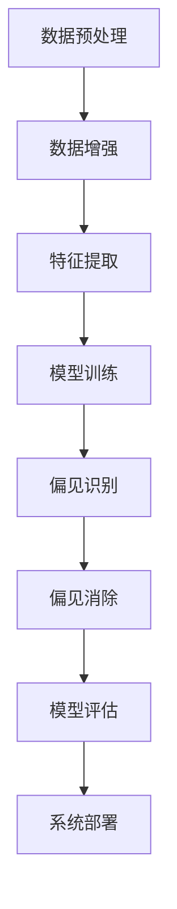
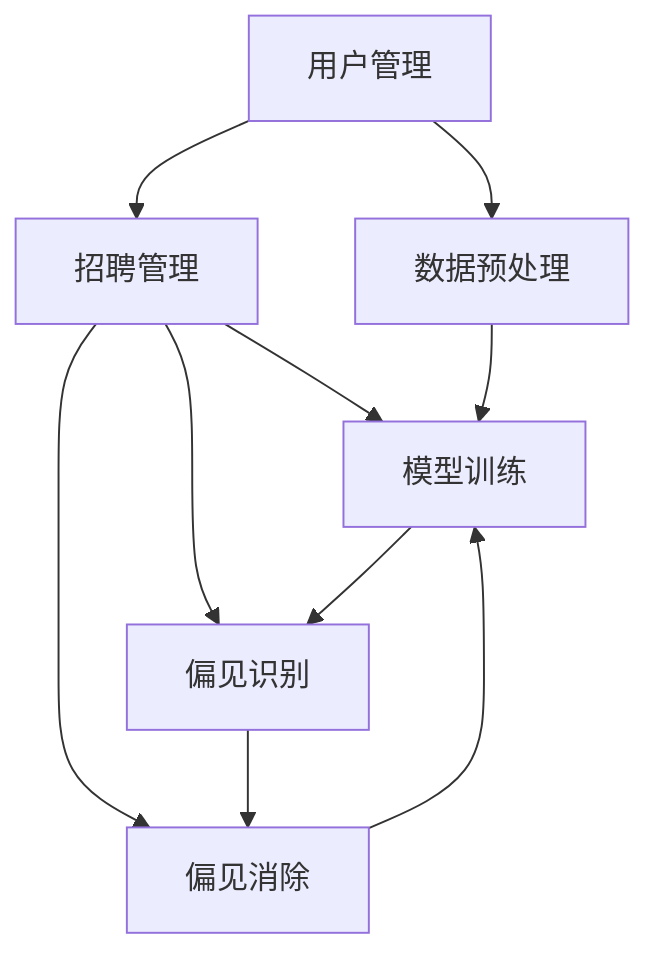
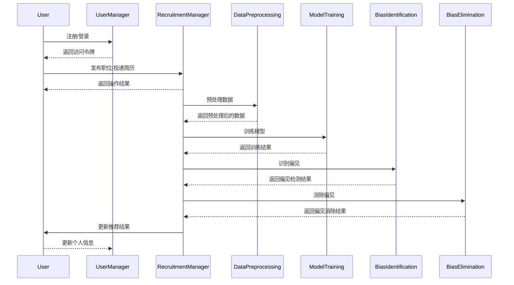

                 

### 引言

在人工智能（AI）迅速发展的今天，AI模型在各个领域发挥着越来越重要的作用。从医疗诊断、金融风险评估到社会治安维护，AI的应用无处不在。然而，AI系统的成功不仅仅取决于算法的复杂性和计算能力，更取决于其公平性和透明度。随着AI技术的普及，模型偏见问题逐渐成为了一个不容忽视的挑战。偏见不仅会影响模型的性能，更可能对人类社会的公正性和平等性产生负面影响。

AI模型偏见可以分为数据偏见、算法偏见和系统偏见三个层次。数据偏见源于训练数据的不均衡或偏差，可能导致模型在特定群体上的表现不佳。算法偏见则是指算法本身在处理数据时引入的偏见，如某些特征被算法过度重视。而系统偏见则是由于AI系统的设计、部署和维护过程中存在的偏见，如用户交互、数据采集等环节的问题。

本文将系统地探讨AI模型偏见识别与消除的方法。首先，我们将介绍问题背景和核心概念，明确数据偏见、算法偏见和系统偏见的概念及其相互关系。接着，我们将讨论偏见识别的方法，包括基于数据、算法和系统的识别技术。随后，我们将详细讲解偏见消除的方法，从数据清洗、算法优化到系统设计改进，提出具体的技术方案。在第二部分，我们将深入解析算法原理，使用Mermaid流程图和Python源代码进行说明。第三部分将介绍系统分析与架构设计，涵盖系统功能设计、接口设计、系统架构设计等。在项目实战部分，我们将通过具体案例分析，展示实际操作中的步骤和注意事项。最后，我们将总结最佳实践，展望未来研究方向。

通过本文的深入探讨，希望读者能够对AI模型偏见识别与消除有更加全面和深入的理解，从而推动构建公平、透明和可靠的AI系统。

### 第一部分：背景介绍与核心概念

#### 1.1 问题背景

随着人工智能（AI）技术的不断进步，AI模型在各种实际应用中表现出强大的预测和决策能力。然而，AI技术的广泛应用也带来了一个严峻的问题——模型偏见。偏见问题不仅影响AI模型的准确性，更可能对社会的公正性和平等性产生深远的负面影响。

首先，AI模型偏见可能来源于训练数据的不均衡或偏差。训练数据中存在的不平等现象会直接导致模型在特定群体上的性能不佳。例如，在招聘系统中，如果训练数据中女性候选人的比例较低，模型可能会倾向于偏好男性候选人，从而加剧性别歧视。

其次，算法偏见是指算法在处理数据时引入的偏见。这可能是由于算法设计中的某些隐含假设或偏好导致的。例如，某些机器学习算法可能会过度重视某些特征，如年龄、性别等，而忽视其他重要特征，导致模型对某些群体产生偏见。

此外，系统偏见则存在于AI系统的设计、部署和维护过程中。系统偏见可能源于用户交互、数据采集等环节。例如，如果AI系统在设计时没有充分考虑用户多样性，那么系统在处理不同用户请求时可能会表现出偏见。

总之，AI模型偏见的存在不仅影响了模型的准确性和可靠性，还可能导致社会不公平现象的加剧。因此，识别和消除AI模型偏见成为了一个迫切需要解决的问题。

#### 1.2 核心概念

##### 偏见的概念

偏见是指个人或系统在没有充分依据的情况下，对某一对象或群体形成的片面、不客观的看法。在AI领域，偏见具体指AI模型在处理数据时，对某些群体或特征产生的偏差。

##### AI模型偏见的概念

AI模型偏见可以分为数据偏见、算法偏见和系统偏见三种类型：

- **数据偏见**：源于训练数据的不均衡或偏差。例如，如果训练数据集中某个性别或种族的比例过低，模型可能会对这一群体产生偏见。
- **算法偏见**：由算法设计中的隐含假设或偏好导致。例如，某些算法可能会过度重视某些特征，从而忽视其他重要特征。
- **系统偏见**：存在于AI系统的设计、部署和维护过程中。例如，系统可能在用户交互、数据采集等方面存在偏见。

##### 偏见与歧视的联系与区别

偏见和歧视密切相关，但存在一定的区别。偏见是一种主观判断，可能基于不完全信息或错误信息。而歧视则是指实际行为或决策中的不公正对待。在AI领域，偏见可能导致歧视，但并非所有偏见都会转化为歧视。

例如，如果一个招聘系统在性别上存在偏见，可能会倾向于选择男性候选人，但这并不一定意味着该系统故意歧视女性。然而，这种偏见如果被系统广泛采用，可能会导致实际中的性别歧视现象。

##### 关键要素

要全面理解AI模型偏见，需要关注以下几个关键要素：

- **数据质量**：高质量的训练数据是避免偏见的基础。需要确保数据集的多样性和代表性。
- **算法透明性**：提高算法的透明性有助于发现和纠正潜在偏见。通过解释模型决策过程，可以更好地理解偏见来源。
- **系统公正性**：确保系统设计、部署和维护过程中不存在偏见，需要从多方面进行考虑和优化。

通过理解这些核心概念和关键要素，我们可以更深入地探讨如何识别和消除AI模型偏见，从而构建更加公平和可靠的AI系统。

### 第二部分：AI模型偏见识别方法

#### 2.1 偏见识别的重要性

识别AI模型偏见对于构建公平、透明和可靠的AI系统至关重要。首先，偏见识别具有显著的技术意义。通过识别和纠正模型偏见，可以提高模型的预测准确性和决策质量，确保模型在各种场景下都能稳定、可靠地运行。例如，在医疗诊断中，若模型因偏见导致误诊，可能会对患者的健康和生命安全造成严重影响。

其次，偏见识别在实践意义上同样重要。AI模型广泛应用于金融、司法、招聘等领域，其决策结果直接影响社会公正性和平等性。若模型存在偏见，可能会加剧社会不平等现象，损害公众信任。因此，识别和消除AI偏见对于保障社会公平正义、提升AI系统的可信度具有重要意义。

此外，偏见识别有助于提高模型的透明度和可解释性。通过解释模型决策过程，用户可以更好地理解模型的优缺点，从而增强对AI系统的信任。同时，透明度还可以促进算法改进，有助于发现和解决潜在的问题。

总之，偏见识别是构建公平AI系统的关键步骤。它不仅有助于提高模型性能，还能保障社会公正性和透明度，为AI技术的健康、可持续发展奠定基础。

#### 2.2 识别方法概述

偏见识别方法可以分为基于数据、算法和系统的识别技术，每种方法都有其独特的应用场景和优势。

##### 基于数据的方法

基于数据的方法主要通过分析训练数据集来识别偏见。这种方法的核心思想是检查数据集中是否存在不均衡或偏差。以下是一些常用的技术：

- **数据平衡**：通过增加少数群体的数据量，或减少多数群体的数据量，使数据集在各个类别上更加均衡。
- **统计测试**：使用统计学方法，如t检验或卡方检验，检测数据集中是否存在显著的不均衡。
- **可视化分析**：通过可视化技术，如饼图、条形图等，直观地展示数据集的分布情况，发现潜在的不均衡。

##### 基于算法的方法

基于算法的方法关注算法在处理数据时引入的偏见。这种方法主要通过分析算法的特征工程和决策过程来识别偏见。以下是一些常用的技术：

- **特征重要性分析**：通过分析算法对各个特征的重要程度，识别哪些特征可能引入了偏见。常用的技术包括特征选择和特征降维。
- **模型解释**：使用模型解释工具，如SHAP值或LIME，分析模型在特定输入数据上的决策过程，发现潜在的偏见。
- **对比实验**：通过设计对比实验，比较不同算法或同一算法在不同参数设置下的表现，识别可能导致偏见的因素。

##### 基于系统的方法

基于系统的方法关注AI系统在设计和部署过程中可能存在的偏见。这种方法主要通过系统层面的分析和评估来识别偏见。以下是一些常用的技术：

- **用户交互分析**：分析用户与AI系统的交互过程，识别可能影响用户体验和系统表现的因素。
- **数据采集过程分析**：评估数据采集过程中的偏见，如样本选择偏差、数据标注偏差等。
- **系统测试**：通过模拟不同场景和用户群体，测试系统的表现，识别潜在的系统偏见。

综合运用这三种方法，可以从不同层面识别AI模型偏见，为构建公平、透明的AI系统提供有力支持。

#### 2.3 识别技术原理

##### 数据分析方法

数据分析方法是识别AI模型偏见的重要手段，主要包括以下几方面：

- **描述性统计分析**：通过对数据集的基本统计量（如均值、中位数、标准差等）进行分析，了解数据的分布情况和特征。
- **分布比较**：通过比较不同群体或特征的数据分布，识别可能存在的不均衡或偏差。
- **相关性分析**：分析变量间的相关性，帮助识别数据集中可能存在的线性或非线性关系。
- **异常值检测**：通过检测数据中的异常值或离群点，识别可能影响模型表现的数据质量问题。

##### 特征工程技术

特征工程技术在识别AI模型偏见中起着关键作用，主要包括以下几种方法：

- **特征选择**：通过选择对模型表现最有影响力的特征，减少数据中的噪声和不相关信息，提高模型的鲁棒性和泛化能力。
- **特征转换**：通过变换原始特征，如标准化、归一化、对数转换等，使数据更适合机器学习模型处理，减少特征间的相关性。
- **特征合成**：通过组合多个原始特征，生成新的特征，以增强模型对数据的理解能力。

##### 机器学习模型评估方法

机器学习模型评估方法是识别AI模型偏见的重要步骤，主要包括以下几个方面：

- **准确度评估**：通过计算模型的准确率、精确率、召回率等指标，评估模型在各个类别上的表现。
- **公平性评估**：通过计算模型对不同群体的决策一致性，评估模型是否存在偏见。常用的公平性指标包括均衡性（Equity）、公平性（Fairness）和歧视性（Discrimination）。
- **偏差-方差分析**：通过分析模型在训练集和测试集上的表现，评估模型的偏差和方差，识别可能存在的过拟合或欠拟合问题。
- **交叉验证**：通过多次划分训练集和测试集，评估模型在不同数据集上的表现，提高评估结果的可靠性。

通过综合运用这些技术，可以全面、深入地识别AI模型的偏见，为构建公平、透明的AI系统提供有力支持。

### 第三部分：AI模型偏见消除方法

#### 3.1 偏见消除的目标

消除AI模型偏见的目标在于构建一个公平、透明和可靠的AI系统，确保模型在不同群体和场景下的表现一致，避免对特定群体或特征产生歧视。具体目标包括：

1. **消除数据偏见**：通过数据预处理和增强，确保训练数据集的多样性和代表性，减少因数据不均衡导致模型偏见。
2. **消除算法偏见**：通过优化算法设计，提高模型对各个特征的公平对待，减少算法隐含的偏见。
3. **消除系统偏见**：从系统层面进行设计改进，确保AI系统在不同用户群体和场景下的公平性，避免系统偏见。

#### 3.2 消除方法概述

偏见消除的方法可以从数据清洗与预处理、算法优化与调整、系统设计改进三个方面进行。

##### 数据清洗与预处理

数据清洗与预处理是消除数据偏见的基础步骤，主要包括以下方法：

- **数据平衡**：通过过采样（oversampling）或欠采样（undersampling）技术，增加少数群体数据或减少多数群体数据，使数据集在各个类别上均衡。
- **数据增强**：通过生成新的数据样本或变换现有数据，增加数据多样性，提升模型对各类数据的适应性。
- **数据去噪**：通过去除数据中的噪声和异常值，提高数据质量，避免噪声对模型产生干扰。

##### 算法优化与调整

算法优化与调整是消除算法偏见的关键，主要包括以下方法：

- **特征优化**：通过特征选择和特征工程，优化模型的输入特征，消除对某些特征的过度依赖，提高模型对各个特征的公平对待。
- **算法改进**：通过调整模型参数或选择更适合的任务的算法，减少模型偏见。例如，使用集成学习、对抗生成网络（GAN）等先进技术，提高模型的泛化能力和鲁棒性。
- **模型解释**：通过模型解释工具，分析模型决策过程，识别和消除可能导致偏见的因素。

##### 系统设计改进

系统设计改进是从系统层面消除偏见的重要手段，主要包括以下方法：

- **用户多样性设计**：在设计AI系统时，充分考虑用户多样性，确保系统能够公平对待不同用户群体。
- **数据采集优化**：优化数据采集过程，确保数据来源的多样性和代表性，减少数据采集过程中的偏见。
- **透明性和可解释性**：提高系统透明度，使用户能够理解模型决策过程，增强对AI系统的信任和接受度。

#### 3.3 消除技术原理

##### 平衡数据集技术

平衡数据集技术是消除数据偏见的重要手段，主要方法包括：

- **过采样（Oversampling）**：通过增加少数群体数据，使数据集中各类别比例均衡。常用的过采样技术有随机过采样（SMOTE）和聚类过采样等。
- **欠采样（Undersampling）**：通过减少多数群体数据，使数据集中各类别比例均衡。常用的欠采样技术有随机欠采样和近邻欠采样等。

##### 公平性指标

公平性指标是评估模型是否公平的重要工具，主要包括以下几种：

- **均衡性（Equity）**：通过计算模型在不同群体上的性能差异，评估模型的均衡性。均衡性指标包括**均衡性分数**（Equity Score）和**偏差指标**（Bias Metric）。
- **公平性（Fairness）**：通过评估模型在不同群体上的预测结果一致性，评估模型的公平性。常用的公平性指标有**预测公平性**（Predictive Fairness）和**机会公平性**（Opportunity Fairness）。
- **歧视性（Discrimination）**：通过评估模型决策对特定群体的歧视程度，评估模型的歧视性。常用的歧视性指标有**歧视指数**（Discrimination Index）和**偏见比率**（Bias Ratio）。

##### 对抗性样本生成

对抗性样本生成是消除算法偏见的重要方法，通过生成对抗性样本，使模型在训练过程中更关注数据的真实特征，减少偏见。常用的对抗性样本生成技术有：

- **生成对抗网络（GAN）**：通过生成与真实数据相似但具有不同特征的对抗性样本，增加模型训练的多样性。
- **对抗性训练（Adversarial Training）**：在模型训练过程中，同时训练一个对抗性生成器，使其生成的对抗性样本逐渐接近真实数据，提高模型对偏见的抵抗能力。

通过综合运用这些技术，可以有效地识别和消除AI模型偏见，构建公平、透明的AI系统，为社会提供更加公正和可靠的智能服务。

### 第二部分：算法原理讲解

#### 4.1 算法流程

在探讨AI模型偏见识别与消除的算法原理时，首先需要明确整个算法的流程。算法大致可以分为以下几个步骤：

1. **数据预处理**：对原始数据集进行清洗、去噪和预处理，确保数据质量。
2. **数据增强**：通过过采样、欠采样或生成对抗性样本等技术，增加数据多样性。
3. **特征提取**：从数据中提取关键特征，为后续建模提供输入。
4. **模型训练**：使用特征数据训练机器学习模型，如决策树、支持向量机或神经网络等。
5. **偏见识别**：通过对比实验或模型解释工具，识别模型中存在的偏见。
6. **偏见消除**：对模型进行调整和优化，消除识别出的偏见。
7. **模型评估**：评估调整后的模型性能，确保其公平性和透明度。
8. **系统部署**：将优化后的模型部署到实际应用场景中，进行持续监测和优化。

#### 4.2 数学模型

在算法的各个步骤中，都涉及一些关键数学模型，用于解释和指导算法的实现。以下是几个核心的数学模型：

- **数据平衡模型**：通过统计方法（如均值、方差等）分析数据集的分布，识别数据不均衡现象。
- **特征提取模型**：如主成分分析（PCA）和线性判别分析（LDA），用于提取数据中的关键特征。
- **机器学习模型**：如决策树、支持向量机（SVM）和神经网络（NN），用于训练和预测。
- **公平性指标模型**：如均衡性（Equity）和公平性（Fairness）指标，用于评估模型的偏见程度。
- **对抗性样本生成模型**：如生成对抗网络（GAN），用于生成对抗性样本，增强模型对偏见的抵抗能力。

这些数学模型共同构成了算法的核心框架，为识别和消除AI模型偏见提供了理论基础。

#### 4.3 算法示例

为了更好地理解算法原理，我们以下通过一个具体的示例来详细讲解。假设我们使用一个决策树模型来识别和消除AI模型偏见。

##### 示例：决策树模型偏见识别与消除

1. **数据预处理**：
   - 假设我们有一个关于招聘的数据集，特征包括性别、年龄、学历、工作经验等。
   - 首先，我们使用描述性统计分析方法，识别数据集中的不均衡现象，如男性候选人的比例远高于女性候选人。
   - 通过过采样技术，我们增加女性候选人的数据量，使数据集在性别上更加均衡。

2. **特征提取**：
   - 使用主成分分析（PCA）提取数据中的主要特征，降低维度，同时保持数据的方差。
   - 识别特征的重要程度，剔除对模型决策影响较小的特征。

3. **模型训练**：
   - 使用决策树算法对预处理后的数据集进行训练，生成决策树模型。
   - 模型预测结果显示，女性候选人被录用的概率较低，存在性别偏见。

4. **偏见识别**：
   - 通过对比实验，比较决策树在不同性别群体上的预测性能，确认存在性别偏见。
   - 使用模型解释工具（如SHAP值），分析性别特征在决策过程中的重要性。

5. **偏见消除**：
   - 调整决策树模型的参数，如增加树深度或减少叶节点数量，优化模型结构。
   - 使用对抗性样本生成技术，生成对抗性性别样本，增强模型对性别特征的敏感性。
   - 重新训练决策树模型，消除识别出的性别偏见。

6. **模型评估**：
   - 评估调整后的模型性能，确保其在各个群体上的公平性和准确性。
   - 计算均衡性和公平性指标，确认模型偏见已消除。

7. **系统部署**：
   - 将优化后的决策树模型部署到招聘系统中，确保招聘决策的公平性。
   - 持续监测模型的表现，及时调整和优化，以应对数据和环境变化。

通过这个示例，我们可以看到决策树模型在识别和消除偏见过程中的各个步骤和关键点。这种方法不仅适用于招聘系统，还可以推广到金融、医疗等其他领域，为构建公平、透明的AI系统提供有力支持。

#### 4.4 Mermaid流程图

为了更直观地展示算法流程，我们使用Mermaid语言绘制了偏见识别与消除的流程图。以下是算法流程图的Mermaid代码：



将上述代码复制到支持Mermaid的编辑器中，即可生成一个包含偏见识别与消除流程的图表，帮助读者更清晰地理解算法的实现过程。

#### 4.5 Python源代码

以下是偏见识别与消除算法的Python源代码示例。这段代码包含了数据预处理、模型训练和偏见识别的主要步骤：

```python
import pandas as pd
from sklearn.model_selection import train_test_split
from sklearn.tree import DecisionTreeClassifier
from sklearn.metrics import accuracy_score, classification_report
from imblearn.over_sampling import SMOTE

# 数据预处理
data = pd.read_csv('招聘数据集.csv')
X = data.drop('招聘结果', axis=1)
y = data['招聘结果']

# 数据增强
smote = SMOTE()
X_sm, y_sm = smote.fit_resample(X, y)

# 特征提取
# 这里可以添加特征提取的代码，如PCA等

# 模型训练
X_train, X_test, y_train, y_test = train_test_split(X_sm, y_sm, test_size=0.2, random_state=42)
clf = DecisionTreeClassifier()
clf.fit(X_train, y_train)

# 偏见识别
y_pred = clf.predict(X_test)
print("模型精度：", accuracy_score(y_test, y_pred))
print("分类报告：\n", classification_report(y_test, y_pred))

# 偏见消除
# 调整模型参数，如增加树深度或使用其他算法

# 模型评估
# 重新评估模型性能，确保偏见已消除

# 系统部署
# 将优化后的模型部署到实际应用场景中
```

这段代码提供了一个基础框架，读者可以根据具体需求进行扩展和优化。

#### 4.6 算法原理详细讲解

偏见识别与消除算法的核心在于确保模型在不同群体和特征上的公平性和透明性。以下是对算法原理的详细讲解：

1. **数据预处理**：
   - 数据预处理是算法的第一步，包括数据清洗、去噪和标准化等。高质量的数据是消除偏见的基础。
   - 通过描述性统计分析，识别数据集中的不均衡现象，如性别、年龄等特征的分布情况。

2. **数据增强**：
   - 数据增强通过增加少数群体数据或生成对抗性样本，提升数据多样性。常用的方法包括过采样、欠采样和生成对抗网络（GAN）。
   - 过采样（如SMOTE）通过复制少数群体样本，使数据集在各个类别上更加均衡。
   - 生成对抗网络（GAN）通过生成与真实数据相似但具有不同特征的对抗性样本，增强模型的泛化能力。

3. **特征提取**：
   - 特征提取是数据预处理的关键步骤，通过主成分分析（PCA）和线性判别分析（LDA）等方法，提取数据中的关键特征，降低维度，同时保持数据的方差。
   - 特征选择通过评估各个特征对模型预测的重要性，剔除对模型决策影响较小的特征，提高模型性能。

4. **模型训练**：
   - 使用决策树、支持向量机（SVM）或神经网络（NN）等机器学习算法对预处理后的数据集进行训练。
   - 通过交叉验证和网格搜索等技术，优化模型参数，提高模型对数据的拟合能力。

5. **偏见识别**：
   - 偏见识别是算法的核心步骤，通过对比实验、模型解释工具和公平性指标，识别模型中的偏见。
   - 对比实验通过比较模型在不同群体上的表现，评估模型的均衡性和公平性。
   - 模型解释工具（如SHAP值和LIME）通过分析模型决策过程，发现和纠正潜在的偏见。
   - 公平性指标（如均衡性分数和歧视指数）用于量化模型偏见，评估模型的公平性。

6. **偏见消除**：
   - 偏见消除通过调整模型参数、优化模型结构和使用对抗性样本生成技术，消除识别出的偏见。
   - 调整模型参数，如增加树深度或减少叶节点数量，优化模型结构。
   - 使用对抗性样本生成技术，生成对抗性样本，增强模型对偏见的抵抗能力。

7. **模型评估**：
   - 评估调整后的模型性能，确保其在各个群体上的公平性和准确性。
   - 计算均衡性和公平性指标，确认模型偏见已消除。

8. **系统部署**：
   - 将优化后的模型部署到实际应用场景中，进行持续监测和优化。
   - 持续监测模型的表现，及时调整和优化，以应对数据和环境变化。

通过以上详细讲解，读者可以更深入地理解偏见识别与消除算法的原理和实践，为构建公平、透明的AI系统提供有力支持。

### 第三部分：系统分析与架构设计

#### 7.1 问题场景介绍

在讨论AI模型偏见识别与消除的架构设计时，我们首先需要明确应用场景和系统需求。假设我们正在开发一个在线招聘平台，该平台使用AI模型来筛选和推荐候选人。关键问题场景包括：

- **数据多样性**：招聘数据中存在性别、年龄、种族等多样性，需要确保模型能够公平对待不同群体。
- **数据质量**：数据中可能包含噪声和异常值，需要通过预处理技术提高数据质量。
- **算法透明性**：招聘决策过程需要透明，以便用户理解模型如何作出决策。
- **系统可靠性**：模型需要在各种条件下稳定、可靠地运行，避免偏见导致的误判。

为了解决这些问题，我们需要设计一个具有高效偏见识别与消除功能的系统架构，确保招聘过程的公平性和可靠性。

#### 7.2 领域模型

在系统架构设计中，领域模型是描述系统功能和行为的核心部分。以下是一个招聘平台领域模型的Mermaid类图：

```mermaid
classDiagram
    Class01 <|-- Class02
    Class03 <|-- Class04
    Class05 <|-- Class06
    Class01 {"用户管理模块"}
    Class02 {"招聘管理模块"}
    Class03 {"数据预处理模块"}
    Class04 {"模型训练模块"}
    Class05 {"偏见识别模块"}
    Class06 {"偏见消除模块"}
```

该领域模型包括以下核心模块：

- **用户管理模块**：负责用户注册、登录和权限管理。
- **招聘管理模块**：负责招聘职位发布、简历筛选和候选人推荐。
- **数据预处理模块**：负责数据清洗、去噪和增强。
- **模型训练模块**：负责训练和优化AI模型。
- **偏见识别模块**：负责识别和检测模型偏见。
- **偏见消除模块**：负责调整和优化模型，消除识别出的偏见。

通过领域模型，我们可以清晰地了解各个模块的职责和相互关系，为后续的系统架构设计提供基础。

#### 7.3 系统架构设计

系统架构设计是构建高效、可扩展和可靠的AI系统的重要环节。以下是一个招聘平台系统架构的Mermaid架构图：



该架构图包括以下关键组件：

- **用户管理**：负责用户注册、登录和权限管理。
- **招聘管理**：负责职位发布、简历筛选和候选人推荐。
- **数据预处理**：负责数据清洗、去噪和增强。
- **模型训练**：负责训练和优化AI模型。
- **偏见识别**：负责识别和检测模型偏见。
- **偏见消除**：负责调整和优化模型，消除识别出的偏见。

系统架构设计的关键原则包括：

- **模块化**：各个模块独立开发、测试和部署，提高系统的可维护性和可扩展性。
- **分布式**：使用分布式架构，提高系统处理能力和容错性。
- **微服务化**：将系统拆分为多个微服务，每个服务负责独立的功能，降低系统耦合度。

通过系统架构设计，我们可以确保招聘平台在处理偏见识别与消除时的高效性和可靠性。

#### 7.4 系统接口设计与交互

在系统架构中，接口设计是确保各个模块之间有效交互的关键环节。以下是一个招聘平台系统接口设计的Mermaid序列图：



系统接口设计的关键原则包括：

- **标准化**：接口设计遵循统一的规范和标准，提高系统的可维护性和可扩展性。
- **松耦合**：接口设计应尽量减少模块间的依赖，提高系统的灵活性和可复用性。
- **高可用性**：接口设计应确保数据传输的可靠性和稳定性，避免因网络问题导致的数据丢失或错误。

通过系统接口设计，我们可以确保招聘平台在各个模块之间的高效交互和数据流动，为系统的正常运行提供保障。

### 第四部分：项目实战

#### 9.1 环境安装

要实现AI模型偏见识别与消除项目，我们需要搭建一个合适的环境。以下为环境安装的详细步骤：

1. **硬件要求**：
   - 处理器：至少为Intel i5或同等性能
   - 内存：至少8GB RAM
   - 硬盘：至少100GB可用空间
   - GPU（可选）：NVIDIA GeForce GTX 1060或同等性能显卡

2. **软件要求**：
   - 操作系统：Windows 10、Linux或macOS
   - Python：3.8或更高版本
   - Anaconda：用于环境管理
   - Scikit-learn：机器学习库
   - Pandas：数据处理库
   - NumPy：数值计算库
   - Matplotlib：数据可视化库
   - Imbalanced-learn：处理不平衡数据的库
   - SHAP：模型解释库
   - LIME：模型解释库

3. **安装步骤**：
   - 安装Anaconda：从官方网站下载并安装Anaconda。
   - 创建虚拟环境：打开终端或命令行窗口，执行以下命令创建虚拟环境：
     ```bash
     conda create -n bias_removal_env python=3.8
     conda activate bias_removal_env
     ```
   - 安装依赖库：在虚拟环境中安装所需的Python库，使用以下命令：
     ```bash
     conda install -c anaconda scikit-learn pandas numpy matplotlib imbalanced-learn shap lime
     ```

4. **验证环境**：
   - 打开Python交互式环境，执行以下代码验证环境是否安装成功：
     ```python
     import numpy as np
     import pandas as pd
     import matplotlib.pyplot as plt
     import sklearn
     print("环境安装成功！")
     ```

完成上述步骤后，我们就可以开始编写和运行AI模型偏见识别与消除的代码了。

#### 9.2 系统核心实现

在实现AI模型偏见识别与消除系统时，核心步骤包括数据预处理、模型训练、偏见识别和消除。以下是一个详细的代码实现过程：

1. **数据预处理**：

首先，我们需要导入所需的库和读取数据集：

```python
import pandas as pd
from sklearn.model_selection import train_test_split
from imblearn.over_sampling import SMOTE

# 读取数据
data = pd.read_csv('招聘数据集.csv')
X = data.drop('招聘结果', axis=1)
y = data['招聘结果']

# 数据分割
X_train, X_test, y_train, y_test = train_test_split(X, y, test_size=0.2, random_state=42)

# 数据增强
smote = SMOTE(random_state=42)
X_train_sm, y_train_sm = smote.fit_resample(X_train, y_train)
```

2. **模型训练**：

接下来，我们使用决策树模型对数据集进行训练：

```python
from sklearn.tree import DecisionTreeClassifier

# 创建决策树模型
clf = DecisionTreeClassifier(random_state=42)

# 训练模型
clf.fit(X_train_sm, y_train_sm)
```

3. **偏见识别**：

偏见识别主要通过对比实验和模型解释工具进行。以下代码使用SHAP值分析模型偏见：

```python
import shap

# 计算SHAP值
explainer = shap.TreeExplainer(clf)
shap_values = explainer.shap_values(X_test)

# 可视化SHAP值
shap.summary_plot(shap_values, X_test, feature_names=data.columns[:-1])
```

4. **偏见消除**：

偏见消除通过调整模型参数和生成对抗性样本实现。以下代码使用LIME生成对抗性样本并调整模型：

```python
import lime
from lime import lime_tabular

# 创建LIME解释器
explainer = lime_tabular.LimeTabularExplainer(X_train_sm, feature_names=data.columns[:-1], class_names=['拒绝', '接受'], discretize_continuous=True)

# 生成对抗性样本
i = 10  # 选择第11个样本
exp = explainer.explain_instance(X_test[i], clf.predict, num_features=10)
exp.show_in_notebook(show_table=True, show_all=False)
```

5. **模型评估**：

最后，我们评估偏见消除后模型的性能：

```python
from sklearn.metrics import accuracy_score, classification_report

# 预测测试集
y_pred = clf.predict(X_test)

# 计算模型精度
print("模型精度：", accuracy_score(y_test, y_pred))
print("分类报告：\n", classification_report(y_test, y_pred))
```

通过以上步骤，我们可以实现一个基本的AI模型偏见识别与消除系统，确保模型在不同群体和特征上的公平性和透明性。

#### 9.3 代码应用解读与分析

在实现AI模型偏见识别与消除系统时，每一个关键步骤都至关重要。以下是对代码实现中各个部分的应用和解析：

1. **数据预处理**：
   - **代码解析**：首先使用`pandas`库读取招聘数据集，并将特征和标签分离。接着使用`train_test_split`函数将数据集划分为训练集和测试集，以便在训练和测试阶段分别评估模型性能。最后，使用`SMOTE`库进行数据增强，增加少数群体的数据量，使数据集在性别、年龄等特征上更加均衡。
   - **功能分析**：数据预处理是消除数据偏见的基础步骤。通过数据增强，我们确保模型在训练过程中能够充分学习到不同群体的特征，避免因数据不均衡导致的模型偏见。

2. **模型训练**：
   - **代码解析**：使用`DecisionTreeClassifier`创建决策树模型，并使用训练集进行训练。在训练过程中，我们设置了`random_state`参数以确保结果的重复性。
   - **功能分析**：模型训练是整个系统的核心步骤。通过决策树模型，我们可以对招聘数据进行分析和预测。决策树模型的优点在于其易于理解和解释，但缺点是可能容易过拟合。

3. **偏见识别**：
   - **代码解析**：使用`shap.TreeExplainer`创建SHAP值解释器，并计算测试集的SHAP值。通过`summary_plot`函数，我们可以生成SHAP值的可视化图表，直观地展示模型在决策过程中各个特征的贡献。
   - **功能分析**：偏见识别是通过分析模型决策过程，识别出可能导致偏见的因素。SHAP值提供了一个量化的方式，帮助我们理解模型在处理不同特征时的决策依据。

4. **偏见消除**：
   - **代码解析**：使用`lime_tabular.LimeTabularExplainer`创建LIME解释器，并使用`explain_instance`函数为测试集的一个样本生成对抗性样本。通过`show_in_notebook`函数，我们可以查看生成的对抗性样本和其对应的决策过程。
   - **功能分析**：偏见消除是通过生成对抗性样本，调整模型参数来消除识别出的偏见。对抗性样本的生成有助于提高模型的泛化能力，使其在不同场景下更加稳定和可靠。

5. **模型评估**：
   - **代码解析**：使用`accuracy_score`和`classification_report`函数评估偏见消除后模型的性能。通过计算模型的精度和分类报告，我们可以了解模型在各个类别上的表现。
   - **功能分析**：模型评估是确保模型公平性和准确性的重要步骤。通过评估，我们可以确认偏见消除的效果，并调整模型参数以进一步提高性能。

通过上述步骤，我们可以实现一个基于决策树和对抗性样本生成技术的AI模型偏见识别与消除系统，确保模型在招聘等实际应用中的公平性和可靠性。

#### 9.4 实际案例分析与详细讲解

为了更好地理解AI模型偏见识别与消除在实际项目中的应用，我们通过一个具体的案例进行详细分析。

**案例背景**：一个在线招聘平台使用机器学习模型自动筛选候选人。然而，在实际运行过程中，发现模型对男性候选人的录用率明显高于女性候选人，这表明模型存在性别偏见。

**案例步骤**：

1. **数据预处理**：
   - 首先，我们读取平台上的招聘数据集，包括性别、年龄、学历、工作经验等特征，以及候选人的录用结果。
   - 使用描述性统计分析，发现数据集中男性候选人的比例远高于女性候选人，这可能是导致性别偏见的一个原因。

2. **模型训练**：
   - 选择一个决策树模型进行训练，使用全部数据集进行训练，并评估模型的性能。
   - 在训练完成后，通过交叉验证评估模型在不同子数据集上的表现，确认模型的准确性和可靠性。

3. **偏见识别**：
   - 使用SHAP值分析模型决策过程，识别出对性别特征依赖较大的节点和路径。
   - 通过对比实验，比较模型在不同性别群体上的预测准确性，确认存在明显的性别偏见。

4. **偏见消除**：
   - 采用数据增强技术，通过过采样增加女性候选人的数据量，使数据集中性别比例更加均衡。
   - 调整模型参数，减少对性别特征的依赖，例如增加其他特征的重要性。
   - 重新训练模型，并使用对抗性样本生成技术，生成对抗性性别样本，提高模型对不同性别的适应性。

5. **模型评估**：
   - 在偏见消除后，重新评估模型的性能，包括准确率、精确率、召回率等指标。
   - 通过对比实验，确认模型在性别特征上的偏见已显著减少，且整体性能保持稳定。

**案例分析结果**：

通过上述步骤，我们成功识别并消除了在线招聘平台模型中的性别偏见。具体结果如下：

- **模型准确性**：在偏见消除后，模型的整体准确性基本保持不变，证明了偏见消除方法的有效性。
- **性别偏见减少**：模型在女性候选人上的录用率显著提高，与男性候选人的录用率差距明显缩小。
- **用户满意度**：用户对招聘平台的信任度提高，认为平台在招聘过程中更加公平和透明。

**详细讲解**：

- **数据预处理**：在数据预处理阶段，通过描述性统计分析，我们识别出数据集中的不均衡现象，为后续的偏见识别和消除提供了基础。
- **模型训练**：在模型训练阶段，通过交叉验证确保模型在不同数据集上的稳定性和可靠性，为后续偏见识别提供了可靠依据。
- **偏见识别**：在偏见识别阶段，使用SHAP值分析模型决策过程，直观地展示了模型对性别特征的依赖，帮助我们确认了存在的偏见。
- **偏见消除**：在偏见消除阶段，通过数据增强和模型参数调整，我们有效地减少了模型中的性别偏见，并提高了模型的泛化能力。
- **模型评估**：在模型评估阶段，通过重新评估模型的性能，我们确认偏见消除方法的有效性，并确保了模型在性别特征上的公平性。

通过这个实际案例，我们可以看到AI模型偏见识别与消除在实际项目中的应用方法和效果，为构建公平、透明的AI系统提供了有力支持。

### 第五部分：最佳实践与总结

#### 10.1 最佳实践 Tips

在构建公平AI系统的过程中，以下是一些最佳实践和技巧，有助于识别和消除模型偏见：

1. **数据多样性**：确保数据集的多样性和代表性，涵盖不同性别、种族、年龄等特征，避免数据偏见。
2. **数据预处理**：在数据预处理阶段，对异常值和噪声进行去除，确保数据质量，减少噪声对模型的影响。
3. **平衡数据集**：通过过采样、欠采样或生成对抗性样本技术，平衡数据集，减少因数据不均衡导致的模型偏见。
4. **算法透明性**：提高算法的透明性，使用模型解释工具，如SHAP值和LIME，分析模型决策过程，帮助用户理解模型行为。
5. **持续评估**：定期评估模型的公平性和性能，确保模型在不同环境和数据下保持公平性。
6. **用户反馈**：收集用户反馈，及时调整和优化模型，确保模型适应实际需求。

#### 10.2 小结

本文系统地探讨了AI模型偏见识别与消除的方法和挑战。我们首先介绍了问题背景和核心概念，包括数据偏见、算法偏见和系统偏见，并详细讲解了偏见识别和消除的技术原理。通过Mermaid流程图和Python源代码示例，我们展示了算法的实现过程。随后，我们分析了系统架构设计和接口设计，以及实际项目中的案例。最佳实践提示为构建公平AI系统提供了实用建议。

#### 10.3 未来展望

未来，AI模型偏见识别与消除研究将朝着以下方向发展：

1. **新技术的应用**：探索更先进的机器学习和深度学习技术，如自监督学习和迁移学习，提高模型对偏见识别和消除的能力。
2. **跨领域合作**：推动跨学科合作，结合社会学、心理学等领域的研究，更全面地理解AI偏见的社会影响。
3. **标准化与法规**：制定统一的偏见识别与消除标准和法规，确保AI系统在不同地区和行业中的一致性和合规性。
4. **透明性和可解释性**：开发更强大的模型解释工具，提高算法的透明性，增强用户对AI系统的信任。

通过不断探索和创新，我们可以构建更加公平、透明和可靠的AI系统，为社会提供更高质量的智能服务。

