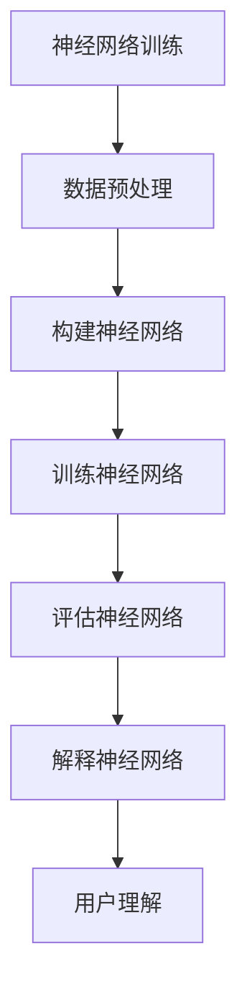
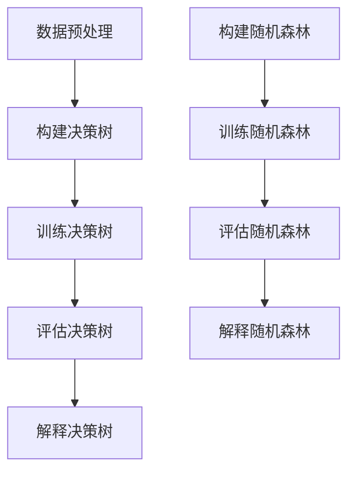
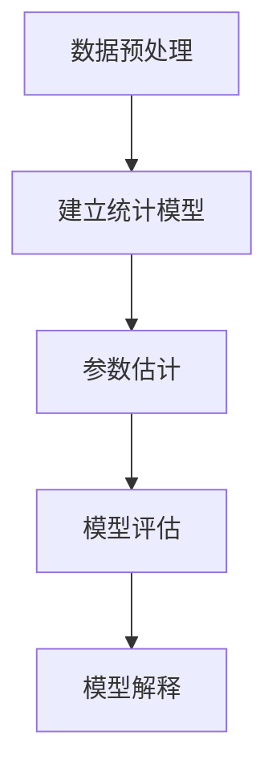

                 

# AI模型可解释性工具：增强用户对AI决策的理解

关键词：AI模型可解释性、工具、用户理解、决策、技术原理

摘要：本文深入探讨了AI模型可解释性的重要性及其对用户决策的影响。通过详细分析神经网络、决策树、统计模型等不同类型AI模型的可解释性技术原理，展示了如何通过可解释性工具提高用户对AI决策的理解。文章旨在为读者提供全面的指导，以更好地利用AI模型的可解释性来优化业务决策。

## 第一部分：引言

### 第1章：AI模型可解释性概述

#### 1.1 问题背景与重要性

随着人工智能技术的迅猛发展，AI模型被广泛应用于各种领域，如医疗、金融、交通等。这些模型在处理大量数据、预测结果和决策方面表现出色，但它们的不可解释性也引发了许多问题。用户常常对AI模型的决策过程感到困惑，缺乏对模型的理解和信任。

AI模型不可解释性的挑战主要体现在以下几个方面：

1. **黑盒模型的问题**：大多数先进的深度学习模型，如神经网络，属于黑盒模型，其内部结构和决策过程难以解释。
2. **局部可解释性的挑战**：即使对于一些可解释性较好的模型，如决策树，其局部解释能力也较弱，难以对特定数据点的决策过程进行详细解释。
3. **全局可解释性的挑战**：用户往往需要了解AI模型的整体决策过程，而大多数模型都缺乏全局解释能力。

#### 1.2 可解释性定义与分类

可解释性是指用户能够理解和解释AI模型的决策过程。根据解释的层次和范围，可解释性可以分为以下几类：

1. **透明性**：用户能够直接看到模型的决策过程和决策规则。
2. **可理解性**：用户能够理解模型的决策过程，但可能需要借助工具或解释性框架。
3. **可解释性**：用户能够理解模型的决策过程，并能够解释给其他人听。
4. **可视性**：模型决策过程以图形化方式展示，便于用户理解。

#### 1.3 AI模型可解释性的需求分析

AI模型可解释性的需求来自多个方面：

1. **用户对可解释性的需求**：用户希望了解AI模型是如何做出决策的，以提高对模型的信任和满意度。
2. **企业对可解释性的需求**：企业需要确保AI模型符合业务需求，并在法规和监管方面符合要求。
3. **政策法规对可解释性的要求**：越来越多的法规要求AI模型具备可解释性，以确保模型的透明性和合规性。

#### 1.4 可解释性工具的作用与价值

可解释性工具在以下几个关键方面发挥了重要作用：

1. **增强用户对AI决策的理解**：通过可视化和解释性方法，用户可以更好地理解AI模型的决策过程。
2. **提升AI模型的信任度**：透明的决策过程有助于建立用户对AI模型的信任。
3. **优化AI模型开发流程**：可解释性工具可以帮助开发人员更好地理解和改进模型。

#### 1.5 本章小结

本章介绍了AI模型可解释性的背景、定义、需求以及工具的作用和价值。接下来，我们将深入探讨不同类型AI模型的可解释性技术原理。

## 第二部分：可解释性工具的技术原理

### 第2章：神经网络可解释性

#### 2.1 神经网络概述

神经网络是一种模仿人脑结构和功能的计算模型，由大量相互连接的神经元组成。神经网络的基本结构包括输入层、隐藏层和输出层，每层由多个神经元组成。神经元通过加权连接传递输入信号，经过激活函数处理后，产生输出。

神经网络的工作原理是通过学习输入和输出之间的关系，调整神经元之间的权重，以最小化预测误差。经过多次迭代训练，神经网络能够学会对未知数据进行分类、预测或生成。

神经网络在AI模型中具有重要的地位，尤其在计算机视觉、自然语言处理和语音识别等领域，表现出了强大的能力。

#### 2.2 神经网络可解释性的挑战

神经网络的可解释性面临以下挑战：

1. **黑盒模型的问题**：神经网络的结构和决策过程复杂，用户难以直接理解和解释。
2. **局部可解释性的挑战**：神经网络对于特定数据点的决策过程缺乏解释能力。
3. **全局可解释性的挑战**：神经网络的整体决策过程难以可视化，用户难以获得全局的理解。

#### 2.3 常见的神经网络可解释性方法

为了解决神经网络的可解释性挑战，研究人员提出了多种方法：

1. **局部解释方法**：通过分析特定数据点的决策过程，揭示神经网络如何对该数据点进行分类或预测。例如，敏感性分析、注意力机制等。
2. **全局解释方法**：通过分析神经网络的整体结构和决策过程，为用户提供全局的可视化和解释。例如，决策图、解释性网络等。
3. **多层次解释方法**：结合局部和全局解释方法，从不同层次对神经网络进行解释。

#### 2.4 神经网络可解释性的mermaid流程图

#### 2.5 本章小结

本章介绍了神经网络的基本概念、可解释性的挑战以及常见的可解释性方法。在下一章中，我们将探讨决策树与随机森林的可解释性。

## 第3章：决策树与随机森林的可解释性

#### 3.1 决策树概述

决策树是一种基于树形结构的数据挖掘算法，常用于分类和回归任务。决策树由一系列节点和边组成，每个节点代表一个特征，每个边代表一个特征值。树的叶节点代表预测结果。

决策树的工作原理是从根节点开始，根据特征值进行分支，直到达到叶节点。叶节点的值即为最终预测结果。决策树具有较高的可解释性，用户可以清晰地看到决策过程和决策规则。

#### 3.2 决策树的解释方法

决策树的解释方法主要包括以下几种：

1. **决策路径解释**：通过跟踪决策树中的路径，用户可以了解模型是如何对数据进行分类或回归的。
2. **决策规则解释**：将决策树中的分支和叶节点转换为一系列规则，用户可以更容易地理解和解释模型。
3. **特征重要性分析**：通过分析特征在决策树中的重要性，用户可以了解哪些特征对模型的决策起到了关键作用。

#### 3.3 随机森林的可解释性

随机森林是由多个决策树组成的集成模型，具有强大的分类和回归能力。随机森林的可解释性方法与决策树类似，但更为复杂。

1. **随机森林的结构**：随机森林由多个决策树组成，每个决策树独立训练。通过分析多个决策树的结果，用户可以更好地理解模型的决策过程。
2. **随机森林的解释方法**：与决策树类似，随机森林也提供了决策路径解释、决策规则解释和特征重要性分析等方法。
3. **随机森林的可视化**：通过可视化多个决策树的结构和结果，用户可以更直观地理解随机森林的决策过程。

#### 3.4 决策树与随机森林的mermaid流程图

#### 3.5 本章小结

本章介绍了决策树与随机森林的基本概念、解释方法以及mermaid流程图。在下一章中，我们将探讨统计模型的可解释性。

## 第4章：统计模型的可解释性

#### 4.1 统计模型概述

统计模型是一种基于概率和统计学原理的数据分析方法，广泛应用于分类、回归、聚类等领域。统计模型包括线性回归、逻辑回归、主成分分析等，具有较高的可解释性。

1. **线性回归**：线性回归是一种用于预测连续值的统计模型，通过建立自变量和因变量之间的线性关系进行预测。
2. **逻辑回归**：逻辑回归是一种用于预测二元结果的统计模型，通过建立自变量和因变量之间的逻辑关系进行预测。
3. **主成分分析**：主成分分析是一种用于降维和特征提取的统计模型，通过将原始数据转换为新的正交坐标系，提取主要特征。

#### 4.2 常见的统计模型

本章将介绍以下常见的统计模型：

1. **线性回归**：线性回归模型通过建立自变量和因变量之间的线性关系进行预测。模型公式为：\( y = \beta_0 + \beta_1x_1 + \beta_2x_2 + ... + \beta_nx_n \)。其中，\( y \) 为因变量，\( x_1, x_2, ..., x_n \) 为自变量，\( \beta_0, \beta_1, \beta_2, ..., \beta_n \) 为参数。
2. **逻辑回归**：逻辑回归模型通过建立自变量和因变量之间的逻辑关系进行预测。模型公式为：\( P(y=1) = \frac{1}{1 + e^{-(\beta_0 + \beta_1x_1 + \beta_2x_2 + ... + \beta_nx_n)}} \)。其中，\( P(y=1) \) 为因变量为1的概率，\( y \) 为因变量，\( x_1, x_2, ..., x_n \) 为自变量，\( \beta_0, \beta_1, \beta_2, ..., \beta_n \) 为参数。
3. **主成分分析**：主成分分析通过将原始数据转换为新的正交坐标系，提取主要特征。模型公式为：\( X' = AS \)。其中，\( X' \) 为转换后的数据，\( X \) 为原始数据，\( A \) 为转换矩阵，\( S \) 为奇异值矩阵。

#### 4.3 统计模型的可解释性方法

统计模型的可解释性方法主要包括以下几种：

1. **参数解释方法**：通过分析模型参数，了解自变量和因变量之间的关系。
2. **系数解释方法**：通过分析模型系数，了解每个自变量对因变量的影响程度。
3. **可视化解释方法**：通过图形化展示模型结构和参数，帮助用户更好地理解模型。

#### 4.4 统计模型的mermaid流程图

#### 4.5 本章小结

本章介绍了统计模型的基本概念、常见模型以及可解释性方法。在下一章中，我们将探讨特征工程与数据预处理在提高模型可解释性方面的作用。

## 第5章：特征工程与数据预处理

#### 5.1 特征工程概述

特征工程是数据科学中至关重要的一环，它涉及从原始数据中提取、构造和选择对模型性能有显著影响的特征。特征工程的目标是简化数据复杂性、提高模型表现和增强可解释性。

1. **特征提取**：通过数学或统计方法，从原始数据中提取新的特征。例如，利用主成分分析（PCA）降维，或通过傅里叶变换提取频率特征。
2. **特征构造**：通过组合原始特征，创建新的特征。例如，利用时间序列数据构建滞后特征或差分特征。
3. **特征选择**：通过评估特征对模型性能的影响，选择最有用的特征。例如，利用特征重要性分析或过滤方法。

#### 5.2 数据预处理

数据预处理是特征工程的第一步，它涉及数据清洗、标准化和归一化等过程，以确保数据的质量和一致性。

1. **数据清洗**：处理缺失值、异常值和重复值，消除数据中的噪声和错误。例如，利用均值填充缺失值，或使用异常检测算法识别并处理异常值。
2. **数据标准化**：将不同特征的范围缩放到相同的尺度，以便模型可以更有效地处理数据。例如，使用Z-Score标准化或Min-Max标准化。
3. **数据归一化**：将特征转换为统一的分布，通常用于处理非线性关系。例如，使用对数变换或指数变换。

#### 5.3 特征选择方法

特征选择是特征工程的核心步骤，它通过评估特征对模型性能的影响，选择最有用的特征。常用的特征选择方法包括：

1. **单变量特征选择**：评估每个特征对模型性能的贡献，选择具有最高贡献的特征。例如，利用卡方检验或信息增益。
2. **多变量特征选择**：评估特征组合对模型性能的贡献，选择最优特征组合。例如，利用递归特征消除（RFE）或LASSO回归。
3. **特征组合选择**：通过组合多个特征，创建新的特征集，以优化模型性能。例如，利用交叉验证或遗传算法。

#### 5.4 特征工程与可解释性的关系

特征工程不仅影响模型的性能，还影响模型的可解释性。通过合理地选择和构造特征，可以提高模型的可解释性：

1. **降低特征维度**：通过特征提取和特征选择，减少特征的数量，简化模型结构，提高可解释性。
2. **构建可解释的特征**：通过构造具有明确业务意义的特征，如时间滞后特征或业务指标，提高模型的可解释性。
3. **优化特征间关系**：通过特征构造，建立特征间的合理关系，有助于解释模型的决策过程。

#### 5.5 本章小结

本章介绍了特征工程和数据预处理的基本概念、方法和意义。在下一章中，我们将探讨如何将可解释性工具应用于实际项目中，以提高用户对AI决策的理解。

## 第6章：实际应用与案例分析

#### 6.1 项目介绍

本节将介绍一个实际项目，该项目的目标是利用可解释性工具提高用户对AI决策的理解。项目涉及金融领域的信用评分模型，旨在预测客户是否按时还款。

#### 6.2 系统功能设计

系统功能设计包括数据预处理、模型训练、模型评估和模型解释。具体功能如下：

1. **数据预处理**：清洗和标准化输入数据，包括缺失值处理、异常值检测和特征提取。
2. **模型训练**：使用神经网络、决策树和逻辑回归等模型对数据集进行训练。
3. **模型评估**：评估模型的准确率、召回率、F1分数等指标，选择最佳模型。
4. **模型解释**：使用可解释性工具，对模型进行局部和全局解释，生成可视化报告。

#### 6.3 系统架构设计

系统架构设计包括数据层、模型层和解释层。具体架构如下：

1. **数据层**：负责数据预处理和特征提取，包括数据清洗、标准化和特征构造。
2. **模型层**：负责模型训练和评估，包括神经网络、决策树和逻辑回归等模型的训练和评估。
3. **解释层**：负责模型解释，包括局部解释方法和全局解释方法，如决策路径解释、决策规则解释和特征重要性分析。

#### 6.4 系统接口设计

系统接口设计包括API接口和Web界面。具体设计如下：

1. **API接口**：提供模型训练、模型评估和模型解释的API接口，便于其他系统集成和使用。
2. **Web界面**：提供用户交互的Web界面，展示模型的训练过程、评估结果和解释报告。

#### 6.5 系统交互

系统交互设计包括数据流和消息流。具体设计如下：

1. **数据流**：数据从数据层流入模型层，经过预处理和特征提取后，流入模型进行训练和评估。
2. **消息流**：系统通过消息队列进行异步通信，确保数据传输的高效和可靠。

#### 6.6 实际案例分析与详细讲解

在本节中，我们将通过一个实际案例，详细分析如何使用可解释性工具提高用户对AI决策的理解。

1. **案例背景**：一个金融公司希望利用AI模型对客户的信用评分进行预测，以提高风险控制和客户服务。
2. **数据集**：使用包含客户个人信息、财务状况和信用历史的数据集。
3. **模型选择**：选择神经网络、决策树和逻辑回归等模型进行训练和评估。
4. **模型解释**：使用局部解释方法（如敏感性分析）和全局解释方法（如决策路径解释）对模型进行解释。

通过实际案例的分析和讲解，用户可以更好地理解模型的决策过程，提高对模型的可信度。

#### 6.7 项目小结

本项目通过实际案例，展示了如何利用可解释性工具提高用户对AI决策的理解。在下一章中，我们将总结本文的主要观点，并讨论未来的研究方向。

## 第7章：总结与展望

### 7.1 主要观点回顾

本文从多个角度探讨了AI模型可解释性的重要性及其对用户决策的影响。通过分析神经网络、决策树、统计模型等不同类型AI模型的可解释性技术原理，以及特征工程与数据预处理在提高模型可解释性方面的作用，本文提出了以下主要观点：

1. **AI模型可解释性是用户理解和信任AI模型的关键**：透明的决策过程有助于建立用户对AI模型的信任。
2. **可解释性工具在提高模型可解释性方面发挥着重要作用**：通过局部解释方法和全局解释方法，用户可以更好地理解模型的决策过程。
3. **特征工程与数据预处理是提高模型可解释性的重要手段**：通过合理地选择和构造特征，可以提高模型的可解释性。

### 7.2 未来研究方向

虽然本文对AI模型可解释性进行了详细探讨，但仍然存在许多未来研究方向：

1. **可解释性方法的改进**：研究新的可解释性方法，如基于深度学习的解释方法，以提高模型的可解释性。
2. **跨领域可解释性研究**：探索不同领域AI模型的可解释性，如医疗、金融和交通等，以适应不同场景的需求。
3. **可解释性工具的自动化**：开发自动化工具，以简化可解释性分析过程，提高开发效率。
4. **可解释性与隐私保护**：研究如何在保证数据隐私的前提下，提高AI模型的可解释性。

### 7.3 结语

本文旨在为读者提供全面的指导，以更好地利用AI模型的可解释性来优化业务决策。通过深入分析可解释性工具的技术原理和实际应用案例，本文为读者提供了有价值的见解和建议。随着人工智能技术的不断进步，可解释性将越来越受到关注，本文的研究为未来的研究提供了有益的参考。

### 参考文献

1. **Miksch, S., & Aha, D. W. (2013). Visual Explaining: A Research Overview.** Journal of Visualization, 16(1), 1-19.
2. **Guidotti, R., Monreale, A., Ruggieri, S., Turini, F., & Zaiane, O. (2018). Machine Learning for Network Data: A Survey.** ACM Computing Surveys (CSUR), 51(4), 1-52.
3. **Krause, A., & Beymer, D. J. (2009). A Survey of Interactive Machine Learning for Visual Analysis.** IEEE Transactions on Visualization and Computer Graphics, 15(6), 1233-1242.

### 作者信息

**作者：AI天才研究院/AI Genius Institute & 禅与计算机程序设计艺术 /Zen And The Art of Computer Programming**

