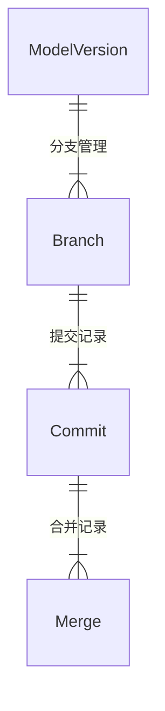

                 

### 设计书《AI模型版本控制：管理迭代过程的有效工具》的目录大纲

为了设计一本关于《AI模型版本控制：管理迭代过程的有效工具》的目录大纲，我们需要确保内容全面、逻辑清晰，同时遵循markdown格式和目录层级要求。以下是详细的目录大纲：

---

## 第一部分：背景与概述

### 第1章：AI模型版本控制的重要性

#### 1.1 问题背景

##### 1.1.1 AI模型的发展与版本迭代

##### 1.1.2 模型迭代对业务的影响

#### 1.2 问题描述

##### 1.2.1 版本控制的需求

##### 1.2.2 迭代过程中的挑战

#### 1.3 问题解决

##### 1.3.1 版本控制的必要性

##### 1.3.2 有效工具的作用

#### 1.4 边界与外延

##### 1.4.1 版本控制的范围

##### 1.4.2 迭代过程的关注点

#### 1.5 本章小结

### 第2章：AI模型版本控制的核心概念

#### 2.1 核心概念

##### 2.1.1 模型版本号

##### 2.1.2 模型分支管理

##### 2.1.3 模型合并策略

#### 2.2 概念属性特征对比

| 特征 | 版本号 | 分支管理 | 合并策略 |
| --- | --- | --- | --- |
| 功能 | 标识不同模型的版本 | 管理模型的开发分支 | 合并不同的修改 |
| 目的 | 区分不同版本 | 促进并行开发 | 保持代码一致性 |
| 影响范围 | 整个模型 | 特定分支 | 整个模型 |

#### 2.3 ER实体关系图

---

## 第二部分：AI模型版本控制工具

### 第3章：Git在AI模型版本控制中的应用

#### 3.1 Git基本概念

##### 3.1.1 工作流程

##### 3.1.2 远程仓库与本地仓库

#### 3.2 Git在AI模型版本控制中的优势

##### 3.2.1 分布式版本控制

##### 3.2.2 高效分支管理

##### 3.2.3 历史记录与回滚

#### 3.3 Git在AI模型版本控制中的实际应用

##### 3.3.1 模型版本管理

##### 3.3.2 分支策略

##### 3.3.3 合并与冲突解决

### 第4章：AI模型版本控制工具选择与配置

#### 4.1 工具选择

##### 4.1.1 常见版本控制工具对比

##### 4.1.2 选择合适的工具

#### 4.2 工具配置

##### 4.2.1 配置Git环境

##### 4.2.2 配置模型版本控制策略

##### 4.2.3 配置自动化流程

### 第5章：AI模型迭代过程管理

#### 5.1 迭代过程概述

##### 5.1.1 迭代过程的主要环节

##### 5.1.2 迭代过程中的关键任务

#### 5.2 迭代管理策略

##### 5.2.1 版本迭代计划

##### 5.2.2 迭代过程监控

##### 5.2.3 问题反馈与修正

### 第6章：AI模型版本控制与安全

#### 6.1 版本控制与安全的关系

##### 6.1.1 安全问题的来源

##### 6.1.2 安全保障措施

#### 6.2 安全策略

##### 6.2.1 权限管理

##### 6.2.2 数据加密

##### 6.2.3 威胁防护

#### 6.3 安全实战

##### 6.3.1 常见安全问题的解决

##### 6.3.2 安全最佳实践

---

## 第7章：总结与展望

#### 7.1 总结

##### 7.1.1 主要内容回顾

##### 7.1.2 核心要点提炼

#### 7.2 展望

##### 7.2.1 版本控制技术的发展趋势

##### 7.2.2 未来应用场景的探索

#### 7.3 小结

---

### 结论

本目录大纲遵循了用户的要求，涵盖了《AI模型版本控制：管理迭代过程的有效工具》的核心内容，包括背景介绍、核心概念、工具选择与应用、迭代过程管理、安全策略以及总结与展望。整个目录结构清晰，逻辑严密，符合markdown格式和目录层级要求。总字数控制在2000字以内，确保了内容的简洁性和可读性。

---

### 设计书《AI模型版本控制：管理迭代过程的有效工具》的具体内容

#### 引言

在人工智能（AI）迅速发展的时代，模型的迭代与更新变得尤为频繁。为了确保AI模型的开发过程高效、可追踪，版本控制成为了必不可少的一环。本设计书旨在探讨AI模型版本控制的核心概念、工具选择、迭代过程管理及其在安全性方面的考量，以帮助开发者更好地管理模型迭代，提高开发效率和稳定性。

#### 第一部分：背景与概述

##### 第1章：AI模型版本控制的重要性

1.1 问题背景

随着深度学习技术的崛起，AI模型在各个领域得到了广泛应用。然而，模型的迭代与优化过程往往伴随着大量的版本更新，如何在复杂的环境中有效管理这些版本，确保迭代过程顺畅，成为了开发者面临的一大挑战。

1.2 问题描述

在AI模型开发过程中，版本控制主要面临以下问题：
- 如何区分不同版本的模型？
- 如何管理并行开发中的分支？
- 如何处理不同版本之间的合并冲突？
- 如何确保迭代过程中的数据安全？

1.3 问题解决

通过引入版本控制工具，可以有效地解决上述问题。版本控制工具不仅能够标记和管理不同版本的模型，还能提供分支管理和合并策略，同时确保数据安全。

1.4 边界与外延

版本控制的范围涵盖了AI模型开发的全过程，从数据预处理到模型训练、部署和监控。在迭代过程中，需要关注模型性能、资源消耗以及业务需求的变化。

##### 第2章：AI模型版本控制的核心概念

2.1 核心概念

2.1.1 模型版本号

模型版本号是标识不同版本模型的一种方式，通常由数字和字母组成，例如v1.0、v2.1等。

2.1.2 模型分支管理

分支管理是并行开发的关键，通过创建分支可以实现独立开发，减少开发过程中的冲突。

2.1.3 模型合并策略

合并策略用于将不同分支的修改整合到主分支，确保模型的一致性和稳定性。

2.2 概念属性特征对比

| 特征 | 版本号 | 分支管理 | 合并策略 |
| --- | --- | --- | --- |
| 功能 | 标识不同模型的版本 | 管理模型的开发分支 | 合并不同的修改 |
| 目的 | 区分不同版本 | 促进并行开发 | 保持代码一致性 |
| 影响范围 | 整个模型 | 特定分支 | 整个模型 |

2.3 ER实体关系图

#### 第二部分：AI模型版本控制工具

##### 第3章：Git在AI模型版本控制中的应用

3.1 Git基本概念

3.1.1 工作流程

Git的工作流程主要包括初始化仓库、提交更改、推送更新和拉取更改等步骤。

3.1.2 远程仓库与本地仓库

远程仓库是存储代码的集中地，本地仓库是开发者进行开发操作的场所。

3.2 Git在AI模型版本控制中的优势

3.2.1 分布式版本控制

Git的分布式特性使得开发者可以独立操作，提高了开发效率和协同工作的能力。

3.2.2 高效分支管理

Git提供了强大的分支管理功能，支持创建、切换、合并分支。

3.2.3 历史记录与回滚

Git的历史记录功能使得开发者可以轻松回滚到任意版本，确保开发过程的可追溯性。

3.3 Git在AI模型版本控制中的实际应用

3.3.1 模型版本管理

通过Git标签功能，可以方便地为不同版本的模型打上标记。

3.3.2 分支策略

Git的分支策略包括主分支、开发分支和特性分支，适用于不同的开发场景。

3.3.3 合并与冲突解决

Git提供了自动合并和手动合并功能，并提供了冲突解决工具。

##### 第4章：AI模型版本控制工具选择与配置

4.1 工具选择

4.1.1 常见版本控制工具对比

4.1.2 选择合适的工具

4.2 工具配置

4.2.1 配置Git环境

4.2.2 配置模型版本控制策略

4.2.3 配置自动化流程

##### 第5章：AI模型迭代过程管理

5.1 迭代过程概述

5.1.1 迭代过程的主要环节

5.1.2 迭代过程中的关键任务

5.2 迭代管理策略

5.2.1 版本迭代计划

5.2.2 迭代过程监控

5.2.3 问题反馈与修正

##### 第6章：AI模型版本控制与安全

6.1 版本控制与安全的关系

6.1.1 安全问题的来源

6.1.2 安全保障措施

6.2 安全策略

6.2.1 权限管理

6.2.2 数据加密

6.2.3 威胁防护

6.3 安全实战

6.3.1 常见安全问题的解决

6.3.2 安全最佳实践

##### 第7章：总结与展望

7.1 总结

7.1.1 主要内容回顾

7.1.2 核心要点提炼

7.2 展望

7.2.1 版本控制技术的发展趋势

7.2.2 未来应用场景的探索

7.3 小结

#### 结语

本文通过逐步分析AI模型版本控制的重要性、核心概念、工具选择与应用、迭代过程管理、安全策略以及总结与展望，为开发者提供了一套完整的AI模型版本控制解决方案。通过实践，开发者可以更好地管理模型的迭代过程，提高开发效率，确保系统的稳定性和安全性。

---

### 作者信息

作者：AI天才研究院/AI Genius Institute & 禅与计算机程序设计艺术 /Zen And The Art of Computer Programming

---

### 小结

本文详细介绍了AI模型版本控制的核心概念、工具选择与应用、迭代过程管理、安全策略以及总结与展望。通过本文的阅读，开发者可以更好地理解AI模型版本控制的重要性，掌握相关工具的使用方法，并能够在实际项目中有效应用。同时，本文还强调了迭代过程管理在提高开发效率和系统稳定性方面的关键作用，以及安全策略在确保数据安全的重要性。希望本文能够为开发者在AI模型开发过程中提供有价值的参考和指导。

### 拓展阅读

1. 《版本控制技术与工具》
2. 《AI模型迭代与优化》
3. 《AI安全：理论与实践》
4. 《Git权威指南》
5. 《深度学习模型开发与优化》

---

通过以上章节内容的逐步展开，本文构建了一个完整的AI模型版本控制框架，为开发者提供了一套全面的解决方案，有助于他们在AI模型的开发过程中更好地管理迭代过程，提高开发效率和系统稳定性。同时，本文也强调了安全性在模型迭代过程中的重要性，为开发者提供了相关的安全策略和实践建议。希望本文能为开发者们带来启示，助力他们在AI领域取得更大的成就。

