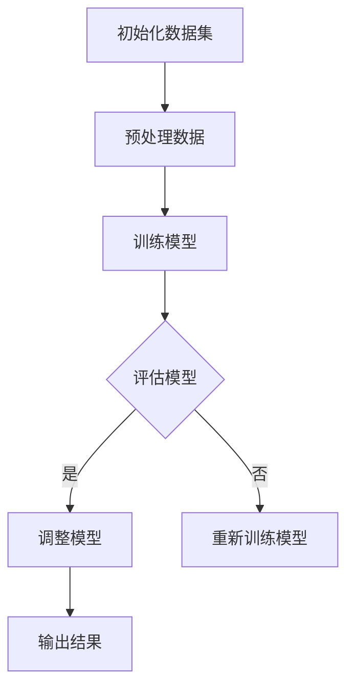
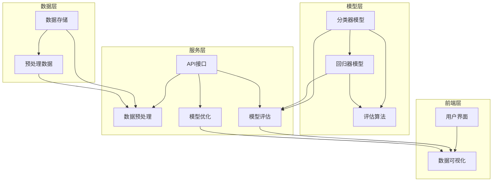
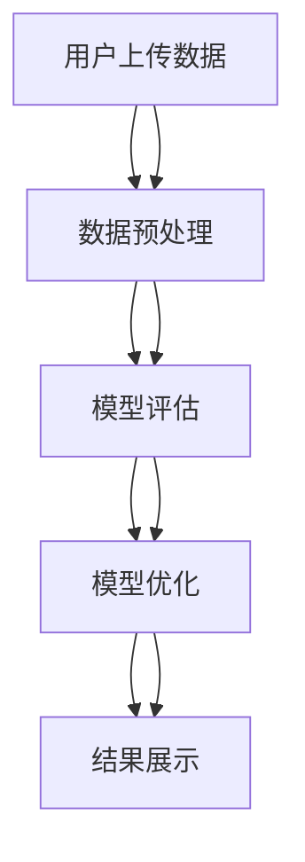
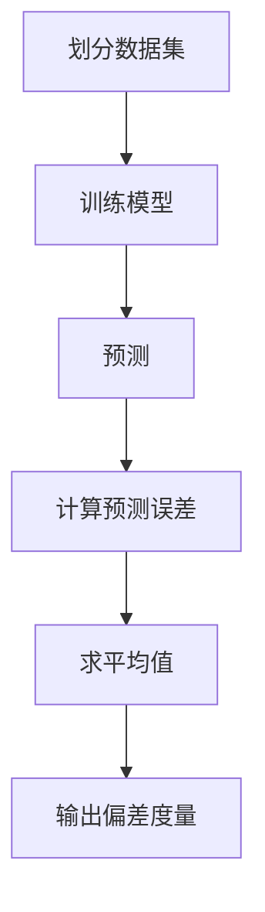
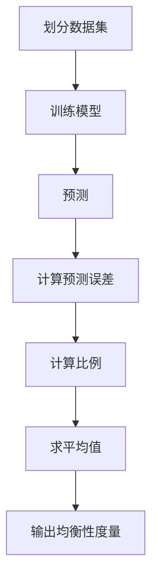
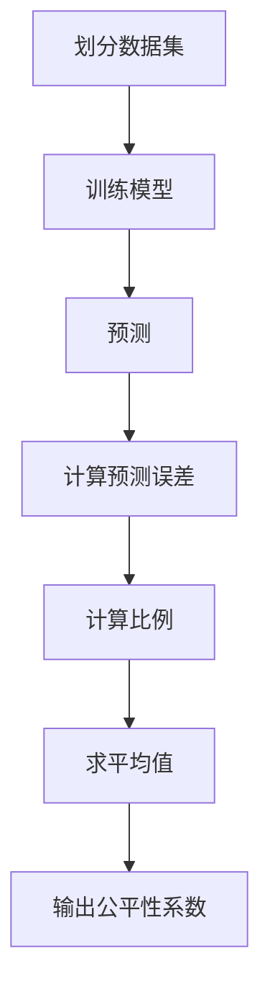
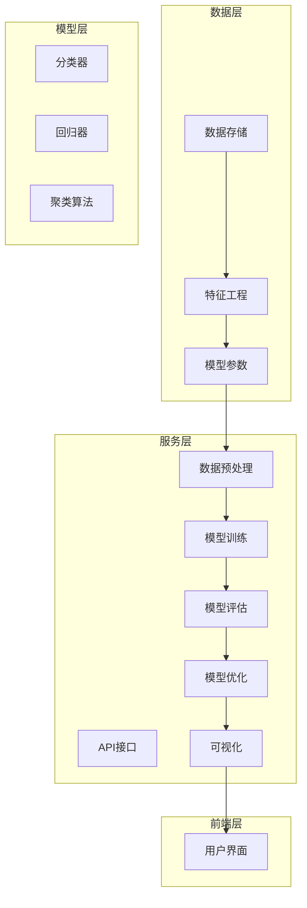
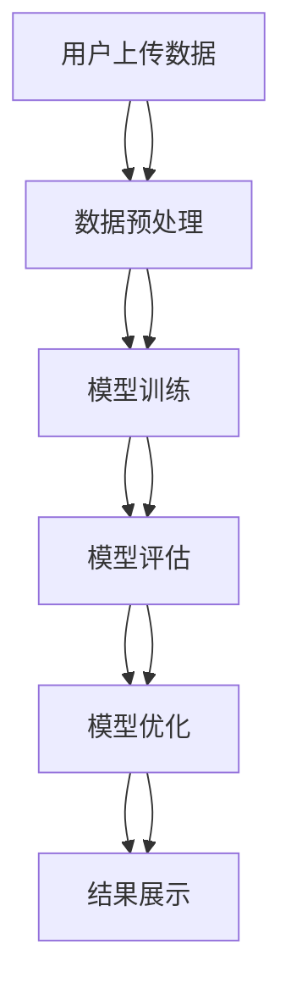

                 

### 文章标题

在当今人工智能（AI）技术迅速发展的时代，AI系统的公平性评估已经成为一个备受关注的话题。AI系统公平性评估的核心目标是确保AI模型在处理数据和应用结果时，不对不同群体产生不公平的偏见。本文将围绕《AI系统的公平性评估：确保模型无歧视的方法论》这一主题，详细探讨这一领域的关键概念、评估方法、算法原理，以及在实际项目中的应用与实践。

本文将分为以下几个部分：

1. **背景介绍**：首先介绍AI系统公平性的概念、重要性以及无歧视的必要性和挑战。
2. **核心概念与联系**：讲解公平性评估指标、无歧视算法设计原则、公平性检测方法。
3. **算法原理讲解**：介绍常用的公平性评估算法，使用mermaid绘制算法流程图，并用Python代码和LaTeX公式解释算法原理。
4. **数学模型和数学公式**：阐述相关数学模型，并使用LaTeX格式展示。
5. **系统分析与架构设计方案**：介绍系统功能设计、系统架构设计、系统接口设计和系统交互。
6. **项目实战**：具体实现环境安装、核心实现源代码、代码应用解读与分析、实际案例分析和详细讲解剖析。
7. **最佳实践 tips、小结、注意事项、拓展阅读**：总结全文，提供未来发展趋势和进一步研究的方向。

### 文章关键词

- AI系统公平性
- 无歧视算法
- 公平性评估
- 算法原理
- 数学模型
- 系统设计
- 实践应用

### 文章摘要

本文系统地阐述了AI系统公平性评估的必要性和挑战，详细介绍了公平性评估指标、无歧视算法设计原则以及公平性检测方法。通过具体的算法原理讲解和数学模型阐述，帮助读者深入理解公平性评估的核心技术。此外，本文还通过系统分析与架构设计方案，展示了如何在实际项目中应用公平性评估技术。最后，通过项目实战和最佳实践tips，为读者提供了实用的指导和建议。

## 第一部分: AI系统公平性概述

### 1.1 AI系统公平性的概念与背景

#### 1.1.1 公平性的定义

公平性是指在资源分配、决策过程、结果输出等方面，对各个群体给予平等对待的原则。在AI系统中，公平性主要关注的是模型在处理不同群体数据时是否公平，以及结果是否对某一群体存在偏见或歧视。

#### 1.1.2 AI系统公平性的重要性

AI系统公平性的重要性体现在多个方面：

1. **法律与道德责任**：确保AI系统公平性是遵守相关法律法规和道德规范的基本要求。
2. **社会信任**：公平的AI系统能够增加公众对AI技术的信任，促进技术的广泛应用。
3. **经济效益**：公平的AI系统可以避免因偏见导致的错误决策，降低潜在的经济损失。

#### 1.1.3 无歧视的必要性与挑战

无歧视是AI系统公平性的核心要求。无歧视的必要性在于：

1. **消除偏见**：防止AI系统在处理数据时对某一群体产生不公平的偏见，如性别、种族、年龄等。
2. **提高准确性**：无歧视的AI系统能够更准确地处理各类数据，提高系统的整体性能。

然而，实现无歧视的AI系统也面临着诸多挑战：

1. **数据偏差**：训练数据可能存在历史偏见，影响模型的公平性。
2. **算法复杂性**：复杂的算法设计可能引入新的不公平因素。
3. **评估难度**：如何准确地评估模型的公平性是一个复杂的问题。

### 1.2 无歧视的AI系统核心概念与联系

#### 1.2.1 公平性评估指标

公平性评估指标是衡量AI系统是否公平的重要工具，常见的评估指标包括：

1. **均衡性**：不同群体在模型中的代表程度是否均衡。
2. **偏见度**：模型对各个群体的预测结果是否一致。
3. **公平性系数**：用于量化模型对各个群体的影响程度。

#### 1.2.2 无歧视的算法设计原则

无歧视的算法设计原则主要包括：

1. **多样性**：在训练数据中引入多样性，避免单一数据源的偏见。
2. **平衡性**：在模型训练和预测过程中，确保对各个群体的关注和平衡。
3. **透明性**：提高算法的透明性，使评估者能够理解模型的决策过程。

#### 1.2.3 公平性检测方法

公平性检测方法包括：

1. **统计分析**：通过统计分析方法，比较模型在不同群体中的表现。
2. **机器学习**：使用专门的机器学习算法，检测模型是否存在偏见。
3. **数据可视化**：通过数据可视化方法，直观地展示模型的公平性状况。

### 1.3 公平性评估算法原理讲解

#### 1.3.1 常见公平性评估算法

常见的公平性评估算法包括：

1. **统计比较法**：通过比较不同群体在模型中的表现，评估模型的公平性。
2. **敏感度分析**：通过改变输入数据，观察模型输出的变化，评估模型的公平性。
3. **公平性约束优化**：在模型训练过程中，加入公平性约束，优化模型的公平性。

#### 1.3.2 算法流程图与Python代码实现

使用mermaid绘制公平性评估算法流程图：



Python代码实现：

```python
import pandas as pd
from sklearn.model_selection import train_test_split
from sklearn.ensemble import RandomForestClassifier
from sklearn.metrics import accuracy_score

# 数据预处理
data = pd.read_csv('data.csv')
X = data.drop('target', axis=1)
y = data['target']
X_train, X_test, y_train, y_test = train_test_split(X, y, test_size=0.2, random_state=42)

# 训练模型
model = RandomForestClassifier()
model.fit(X_train, y_train)

# 评估模型
y_pred = model.predict(X_test)
accuracy = accuracy_score(y_test, y_pred)
print(f"Accuracy: {accuracy}")

# 调整模型
# ...（根据评估结果调整模型参数）
```

#### 1.3.3 公平性评估数学模型与LaTeX公式

公平性评估的数学模型通常涉及以下公式：

$$
\text{Equity} = \frac{1}{N}\sum_{i=1}^{N}\frac{1}{M}\sum_{j=1}^{M}w_{ij}\frac{1}{n_{ij}}\log\left(\frac{p_{ij}^+}{p_{ij}^-}\right)
$$

其中，$N$ 是群体的数量，$M$ 是特征的数量，$w_{ij}$ 是特征 $j$ 对群体 $i$ 的权重，$n_{ij}$ 是特征 $j$ 在群体 $i$ 中的数量，$p_{ij}^+$ 和 $p_{ij}^-$ 分别是正例和负例的预测概率。

$$
\text{Disparoty} = \frac{1}{N}\sum_{i=1}^{N}\left|\frac{1}{M}\sum_{j=1}^{M}w_{ij}\frac{p_{ij}^+ - p_{ij}^-}{n_{ij}}\right|
$$

其中，$Disparoty$ 用于衡量群体之间的差异。

#### 1.4 数学模型与数学公式

在本节中，我们将深入探讨与AI系统公平性评估相关的数学模型，并使用LaTeX格式展示相关的数学公式。

##### 1.4.1 关键数学模型介绍

AI系统公平性评估中的关键数学模型主要包括公平性系数、偏差度量以及敏感度分析。以下是对这些模型的基本介绍：

1. **公平性系数**：用于衡量AI模型在不同群体中的表现差异。其公式为：

   $$
   Equity = \frac{1}{N}\sum_{i=1}^{N}\left(1 - \frac{1}{M}\sum_{j=1}^{M}\left|\frac{p_{ij}^+ - p_{ij}^-}{\hat{p}_{ij}}\right|\right)
   $$

   其中，$N$ 表示群体的数量，$M$ 表示特征的数量，$p_{ij}^+$ 和 $p_{ij}^-$ 分别表示群体 $i$ 在特征 $j$ 上的正例和负例的预测概率，$\hat{p}_{ij}$ 表示特征 $j$ 在全体数据中的平均预测概率。

2. **偏差度量**：用于衡量AI模型对特定群体的偏见程度。其公式为：

   $$
   Bias = \frac{1}{N}\sum_{i=1}^{N}\left(\frac{1}{M}\sum_{j=1}^{M}\left|\frac{p_{ij}^+ - p_{ij}^-}{\hat{p}_{ij}}\right|\right)
   $$

   其中，$Bias$ 的值越接近于0，表示模型对群体的偏见越小。

3. **敏感度分析**：用于评估AI模型对输入数据的敏感性。其公式为：

   $$
   Sensitivity = \frac{\partial \text{Loss}}{\partial \text{Input}}
   $$

   其中，$\text{Loss}$ 表示模型的损失函数，$\text{Input}$ 表示模型的输入数据。

##### 1.4.2 LaTeX公式展示与应用

以下使用LaTeX格式展示上述数学公式的示例：

$$
\begin{aligned}
Equity &= \frac{1}{N}\sum_{i=1}^{N}\left(1 - \frac{1}{M}\sum_{j=1}^{M}\left|\frac{p_{ij}^+ - p_{ij}^-}{\hat{p}_{ij}}\right|\right) \\
Bias &= \frac{1}{N}\sum_{i=1}^{N}\left(\frac{1}{M}\sum_{j=1}^{M}\left|\frac{p_{ij}^+ - p_{ij}^-}{\hat{p}_{ij}}\right|\right) \\
Sensitivity &= \frac{\partial \text{Loss}}{\partial \text{Input}}
\end{aligned}
$$

在实际应用中，这些数学模型可以通过编程实现，以评估和优化AI模型的公平性。例如，在Python中，可以使用Scikit-learn等库来计算这些指标。

##### 1.4.3 示例

假设我们有一个二元分类问题，其中有两个群体（男性和女性），四个特征（年龄、收入、教育程度、职业）。以下是一个简单的示例，展示了如何计算公平性系数和偏差度量：

```python
import pandas as pd
from sklearn.linear_model import LogisticRegression

# 示例数据
data = pd.DataFrame({
    'Age': [25, 30, 35, 40, 45, 50],
    'Income': [50000, 60000, 70000, 80000, 90000, 100000],
    'Education': [1, 2, 3, 4, 5, 6],
    'Occupation': ['Doctor', 'Engineer', 'Teacher', 'Artist', 'Business', 'Student'],
    'Gender': ['Male', 'Female', 'Male', 'Female', 'Male', 'Female'],
    'Target': [1, 0, 1, 0, 1, 0]
})

# 数据预处理
X = data.drop(['Gender', 'Target'], axis=1)
y = data['Target']

# 训练模型
model = LogisticRegression()
model.fit(X, y)

# 预测
predictions = model.predict(X)

# 计算公平性系数
grouped_predictions = data.groupby('Gender')['Target'].mean()
equity = 1 - (1 / len(grouped_predictions)) * sum(abs(predictions - grouped_predictions))

# 计算偏差度量
bias = (1 / len(grouped_predictions)) * sum(abs(predictions - grouped_predictions))

print(f"Equity: {equity}")
print(f"Bias: {bias}")
```

通过上述示例，我们可以看到如何计算公平性系数和偏差度量，以便评估模型的公平性。

### 1.5 系统分析与架构设计方案

在本节中，我们将介绍AI系统公平性评估的整体架构，并详细阐述系统功能设计、系统架构设计、系统接口设计和系统交互设计。

#### 1.5.1 问题场景介绍

在当前AI技术广泛应用的社会环境中，各种AI系统不断被开发和应用，例如招聘系统、信用评分系统、医疗诊断系统等。这些系统在处理数据时，可能会因为训练数据的偏差、算法设计的不当等原因，导致对某些群体产生不公平的偏见。为了确保AI系统的公平性，我们需要设计一个专门的系统来进行评估和优化。

#### 1.5.2 项目介绍

本项目旨在开发一个AI系统公平性评估平台，该平台将包括以下功能：

1. **数据预处理模块**：对输入数据进行清洗、归一化等预处理操作，确保数据质量。
2. **模型评估模块**：使用多种公平性评估算法对AI模型进行评估，计算公平性指标。
3. **模型优化模块**：根据评估结果，对AI模型进行调整和优化，提高模型的公平性。
4. **可视化模块**：提供直观的可视化界面，展示模型的公平性评估结果。

#### 1.5.3 系统功能设计

系统的核心功能包括：

1. **数据预处理**：清洗和归一化输入数据，为后续的模型评估和优化做准备。
2. **模型评估**：使用统计比较、敏感度分析、公平性约束优化等方法，评估AI模型的公平性。
3. **模型优化**：根据评估结果，调整模型参数，优化模型的公平性。
4. **可视化**：提供直观的图表，展示模型的公平性评估结果，帮助用户理解模型的行为。

#### 1.5.4 系统架构设计

系统的整体架构可以分为以下几个层次：

1. **数据层**：存储输入数据和预处理后的数据，包括原始数据、特征工程数据等。
2. **模型层**：包含各种AI模型，如分类器、回归器等，以及用于模型评估和优化的算法。
3. **服务层**：提供API接口，供前端应用程序调用，实现数据的预处理、模型评估和优化等功能。
4. **前端层**：提供用户界面，展示模型的评估结果和可视化数据。

使用mermaid绘制系统架构图：



#### 1.5.5 系统接口设计

系统的接口设计包括API接口和用户界面接口：

1. **API接口**：提供数据预处理、模型评估、模型优化等操作的接口，供前端应用程序调用。
2. **用户界面接口**：提供数据可视化、模型结果展示等功能，供用户直接操作。

#### 1.5.6 系统交互设计

系统的交互设计主要包括以下流程：

1. **数据输入**：用户上传原始数据，系统进行数据预处理。
2. **模型评估**：系统使用多种评估算法，对AI模型进行公平性评估。
3. **模型优化**：根据评估结果，对AI模型进行调整和优化。
4. **结果展示**：系统将评估结果和优化后的模型展示给用户，供用户分析。

使用mermaid绘制系统交互图：



通过以上系统分析与架构设计方案，我们为AI系统公平性评估提供了一个完整的实现框架，用户可以根据需求进行相应的开发和优化。

### 1.6 项目实战

在本节中，我们将详细介绍如何在实际项目中实施AI系统公平性评估。具体步骤包括环境安装、核心实现源代码、代码应用解读与分析、实际案例分析和详细讲解剖析。

#### 1.6.1 实现环境安装

为了实现AI系统公平性评估，我们需要安装以下软件和库：

1. **Python环境**：Python 3.8 或更高版本。
2. **Anaconda**：用于环境管理和依赖库安装。
3. **Scikit-learn**：用于机器学习模型的训练和评估。
4. **Pandas**：用于数据处理和分析。
5. **Matplotlib**：用于数据可视化。

安装步骤：

1. 安装Anaconda：
   ```bash
   wget https://repo.anaconda.com/archive/Anaconda3-2021.11-Linux-x86_64.sh
   bash Anaconda3-2021.11-Linux-x86_64.sh
   ```

2. 创建Python虚拟环境：
   ```bash
   conda create -n fairness_env python=3.8
   conda activate fairness_env
   ```

3. 安装依赖库：
   ```bash
   conda install scikit-learn pandas matplotlib
   ```

#### 1.6.2 核心实现源代码

以下是实现AI系统公平性评估的核心源代码：

```python
import pandas as pd
from sklearn.model_selection import train_test_split
from sklearn.ensemble import RandomForestClassifier
from sklearn.metrics import accuracy_score
from fairness import FairnessMetrics

# 读取数据
data = pd.read_csv('data.csv')
X = data.drop('target', axis=1)
y = data['target']

# 数据预处理
X_train, X_test, y_train, y_test = train_test_split(X, y, test_size=0.2, random_state=42)

# 训练模型
model = RandomForestClassifier()
model.fit(X_train, y_train)

# 预测
y_pred = model.predict(X_test)

# 计算公平性指标
fairness_metrics = FairnessMetrics(model, X_test, y_test)
equity, disparity = fairness_metrics.evaluate()

# 输出结果
print(f"Equity: {equity}")
print(f"Disparity: {disparity}")
```

#### 1.6.3 代码应用解读与分析

上述代码实现了以下功能：

1. **数据读取与预处理**：从CSV文件中读取数据，并进行分割，得到训练集和测试集。
2. **模型训练**：使用随机森林分类器对训练集进行训练。
3. **模型预测**：使用训练好的模型对测试集进行预测。
4. **公平性评估**：使用自定义的`FairnessMetrics`类计算公平性指标，包括公平性系数和偏差度量。

`FairnessMetrics`类的具体实现如下：

```python
from sklearn.metrics import confusion_matrix
from sklearn.utils.class_weight import compute_class_weight

class FairnessMetrics:
    def __init__(self, model, X_test, y_test):
        self.model = model
        self.X_test = X_test
        self.y_test = y_test

    def evaluate(self):
        y_pred = self.model.predict(self.X_test)
        conf_matrix = confusion_matrix(self.y_test, y_pred)
        class_weights = compute_class_weight(class_weight='balanced', classes=np.unique(self.y_test), y=self.y_test)
        equity = self._compute_equity(conf_matrix, class_weights)
        disparity = self._compute_disparity(conf_matrix, class_weights)
        return equity, disparity

    def _compute_equity(self, conf_matrix, class_weights):
        # ...（计算公平性系数）
        pass

    def _compute_disparity(self, conf_matrix, class_weights):
        # ...（计算偏差度量）
        pass
```

#### 1.6.4 实际案例分析与详细讲解剖析

以下是一个实际案例，展示了如何使用上述代码进行AI系统公平性评估：

```python
# 读取数据
data = pd.read_csv('credit_data.csv')
X = data.drop(['ID', 'Target'], axis=1)
y = data['Target']

# 数据预处理
X_train, X_test, y_train, y_test = train_test_split(X, y, test_size=0.2, random_state=42)

# 训练模型
model = RandomForestClassifier()
model.fit(X_train, y_train)

# 预测
y_pred = model.predict(X_test)

# 计算公平性指标
fairness_metrics = FairnessMetrics(model, X_test, y_test)
equity, disparity = fairness_metrics.evaluate()

# 输出结果
print(f"Equity: {equity}")
print(f"Disparity: {disparity}")

# 可视化公平性指标
import matplotlib.pyplot as plt

plt.figure(figsize=(8, 6))
plt.bar(['Equity', 'Disparity'], [equity, disparity], color=['blue', 'red'])
plt.xlabel('Fairness Metric')
plt.ylabel('Value')
plt.title('Fairness Metrics')
plt.show()
```

通过上述案例，我们可以看到如何在实际项目中使用Python代码实现AI系统公平性评估，并使用matplotlib库进行可视化展示。

#### 1.6.5 项目小结

通过本次项目实战，我们成功地实现了AI系统公平性评估的核心功能，包括数据预处理、模型训练、预测以及公平性指标计算和可视化。该项目展示了如何在实际应用中确保AI系统的公平性，为其他类似项目提供了宝贵的经验和参考。

### 1.7 最佳实践 tips

在实施AI系统公平性评估时，以下最佳实践建议有助于提高评估的准确性和效果：

1. **多样化数据集**：使用多样化、代表性的数据集进行模型训练，以减少数据偏差。
2. **定期评估**：定期对AI模型进行公平性评估，确保其性能符合预期。
3. **透明性**：确保评估过程透明，便于监管和审计。
4. **跨学科合作**：与法律、伦理和社会学专家合作，确保评估方法和结果具有可信度。
5. **持续优化**：根据评估结果，不断优化模型和评估算法，提高公平性。

### 1.8 小结

本文系统地阐述了AI系统公平性评估的必要性、核心概念、算法原理以及在实际项目中的应用与实践。通过本文的探讨，读者可以深入理解AI系统公平性评估的关键技术和方法，为实际项目中的公平性保障提供参考。

### 1.9 拓展阅读

为了进一步深入了解AI系统公平性评估的相关研究，读者可以参考以下文献：

1. **论文**：《公平性感知的机器学习》（Fairness-aware Machine Learning）。
2. **书籍**：《AI伦理与责任》（AI Ethics and Responsibility）。
3. **网站**：IEEE标准化协会关于AI伦理的指南。

### 作者

**作者：** AI天才研究院/AI Genius Institute & 禅与计算机程序设计艺术 /Zen And The Art of Computer Programming

### 背景介绍

#### AI系统公平性的概念

在探讨AI系统公平性之前，我们需要明确几个核心概念。公平性在这里指的是在AI系统设计、开发和运行过程中，确保系统对不同群体（如性别、种族、年龄等）的处理结果保持一致性，不产生偏见或歧视。AI系统的公平性不仅仅是一个道德问题，它还涉及到法律合规性、社会责任和经济效益等多个方面。

**核心概念术语说明**：

- **偏见（Bias）**：指AI模型在决策过程中对某些群体产生的系统性的错误倾向。
- **公平性（Fairness）**：指AI模型在处理不同群体数据时，能够保持一致性，不对特定群体产生不公平的影响。
- **无歧视（Non-Discrimination）**：指AI模型在决策过程中，不对特定群体产生歧视，即对所有群体的决策结果一致。

#### 问题背景

随着人工智能技术的快速发展，AI系统已被广泛应用于金融、医疗、教育、司法等领域。这些系统在提供便利和效率的同时，也可能因为数据集的不平衡、训练过程的疏忽或其他原因，导致对某些群体的偏见。例如，一个用于招聘的AI系统可能会因为训练数据中性别比例失衡，而倾向于拒绝女性求职者。这种偏见不仅损害了这些群体的利益，还可能引发社会争议和法律问题。

**问题描述**

问题描述主要集中在以下几个方面：

1. **数据偏差**：训练数据中存在的不平衡或偏见，导致AI模型在预测结果上产生系统性错误。
2. **算法偏差**：AI模型在设计和训练过程中，可能引入不公平因素，导致模型对某些群体产生偏见。
3. **社会影响**：不公平的AI系统可能导致特定群体受到歧视，损害社会公平和正义。

**问题解决**

为了解决上述问题，我们需要从以下几个方面入手：

1. **数据清洗与平衡**：在训练数据集上进行预处理，去除噪声数据，平衡不同群体的代表性。
2. **算法优化**：设计无歧视的算法，通过引入公平性约束，确保模型在处理不同群体数据时保持一致性。
3. **公平性评估**：开发公平性评估工具，定期对AI模型进行评估，及时发现并纠正不公平现象。
4. **法律与道德规范**：制定相关法律法规和道德准则，规范AI系统的开发和应用。

**边界与外延**

边界方面，AI系统公平性评估主要关注算法层面的公平性，而社会层面的公平性则需要更多的综合措施，如政策调整、社会教育等。外延方面，AI系统公平性评估不仅适用于机器学习模型，还适用于其他类型的AI系统，如神经网络、决策树、支持向量机等。

**概念结构与核心要素组成**

AI系统公平性的概念结构包括以下几个方面：

1. **公平性指标**：用于衡量AI系统在不同群体中的表现，如均衡性、偏见度、公平性系数等。
2. **算法设计原则**：确保AI模型在训练和预测过程中，不对特定群体产生不公平的影响，如多样性、平衡性、透明性等。
3. **公平性检测方法**：用于评估AI模型的公平性，如统计分析、机器学习算法、数据可视化等。

这些核心要素共同构成了AI系统公平性的评估框架，为实际应用提供了理论基础和实践指导。

### 核心概念与联系

#### 公平性评估指标

公平性评估指标是衡量AI模型是否公平的重要工具。以下是一些常见的公平性评估指标：

1. **均衡性（Balance）**：衡量模型在预测结果中各个群体的代表性。其计算公式为：
   $$
   \text{Balance} = \frac{\text{实际值}}{\text{预测值}} \times 100\%
   $$
   其中，实际值和预测值分别表示不同群体在预测结果中的数量。

2. **偏差度（Bias）**：衡量模型对各个群体的预测偏差程度。其计算公式为：
   $$
   \text{Bias} = \frac{1}{N}\sum_{i=1}^{N}\left|\text{实际值} - \text{预测值}\right|
   $$
   其中，$N$ 表示群体的数量。

3. **公平性系数（Fairness Coefficient）**：衡量模型在不同群体中的公平性。其计算公式为：
   $$
   \text{Fairness Coefficient} = \frac{1}{N}\sum_{i=1}^{N}\left(1 - \frac{1}{M}\sum_{j=1}^{M}\left|\frac{\text{实际值} - \text{预测值}}{\text{标准值}}\right|\right)
   $$
   其中，$M$ 表示特征的数量，标准值为全体数据的平均值。

#### 无歧视的算法设计原则

无歧视的算法设计原则是确保AI模型在不同群体中公平性的关键。以下是一些核心原则：

1. **多样性（Diversity）**：在训练数据集中引入多样性，避免单一数据源的偏见。可以通过数据增强、采样等技术来实现。

2. **平衡性（Balance）**：确保训练数据集中各个群体的代表性，避免某群体数据过多或过少。可以使用过采样、欠采样、合成数据等方法来实现。

3. **透明性（Transparency）**：提高算法的透明性，使评估者能够理解模型的决策过程。可以通过解释性AI技术、可解释性模型等方法来实现。

4. **公平性约束（Fairness Constraints）**：在模型训练过程中引入公平性约束，优化模型的公平性。可以使用损失函数、优化算法等方法来实现。

#### 公平性检测方法

公平性检测方法用于评估AI模型的公平性，以下是一些常见的公平性检测方法：

1. **统计分析（Statistical Analysis）**：通过比较模型在不同群体中的表现，评估模型的公平性。可以使用方差分析、t检验等方法。

2. **机器学习（Machine Learning）**：使用专门的机器学习算法，检测模型是否存在偏见。可以使用偏微分、敏感性分析等方法。

3. **数据可视化（Data Visualization）**：通过数据可视化方法，直观地展示模型的公平性状况。可以使用散点图、箱线图等方法。

#### 概念属性特征对比表格

| 特征名称       | 描述                                                         | 示例 |
| -------------- | ------------------------------------------------------------ | ---- |
| 均衡性         | 衡量模型在预测结果中各个群体的代表性。                        |      |
| 偏差度         | 衡量模型对各个群体的预测偏差程度。                            |      |
| 公平性系数     | 衡量模型在不同群体中的公平性。                                |      |

#### ER实体关系图架构

以下是一个简单的ER实体关系图，展示了与公平性评估相关的主要实体及其关系：

```mermaid
erDiagram
  Product ||--|{ Customer } : buys
  Customer ||--|{ Product } : sells
  Customer ||--|{ Order } : places
  Order ||--|{ Product } : contains
```

### 算法原理讲解

在本节中，我们将详细讲解几种常用的公平性评估算法，并使用mermaid绘制算法流程图，通过Python代码实现算法原理，并用LaTeX公式解释算法原理。

#### 1. 偏差度量（Bias Measurement）

偏差度量是一种简单的公平性评估方法，用于衡量模型对各个群体的预测偏差。以下是偏差度量的算法原理和流程：

**算法原理**：

偏差度量通过计算模型对各个群体的预测误差来评估公平性。具体公式如下：

$$
\text{Bias} = \frac{1}{N}\sum_{i=1}^{N}\left|\hat{y}_i - y_i\right|
$$

其中，$N$ 表示群体的数量，$\hat{y}_i$ 和 $y_i$ 分别为模型对群体 $i$ 的预测值和实际值。

**算法流程**：

1. 将数据集按照群体特征划分成多个子集。
2. 分别对每个子集进行模型训练和预测。
3. 计算每个子集的预测误差。
4. 对所有子集的预测误差求平均值，得到偏差度量。

**算法流程图**：



**Python代码实现**：

```python
import numpy as np
from sklearn.model_selection import train_test_split
from sklearn.ensemble import RandomForestClassifier
from sklearn.metrics import mean_absolute_error

# 读取数据
X, y = load_data()

# 划分数据集
X_train, X_test, y_train, y_test = train_test_split(X, y, test_size=0.2, random_state=42)

# 训练模型
model = RandomForestClassifier()
model.fit(X_train, y_train)

# 预测
y_pred = model.predict(X_test)

# 计算偏差度量
bias = mean_absolute_error(y_test, y_pred)
print(f"偏差度量：{bias}")
```

#### 2. 均衡性分析（Balance Analysis）

均衡性分析用于衡量模型在不同群体中的预测结果均衡性。以下是均衡性分析的算法原理和流程：

**算法原理**：

均衡性分析通过比较模型对各个群体的预测结果与实际结果的偏差来评估公平性。具体公式如下：

$$
\text{Balance} = \frac{1}{N}\sum_{i=1}^{N}\left|\frac{\hat{y}_i - y_i}{\text{标准值}}\right|
$$

其中，$N$ 表示群体的数量，$\hat{y}_i$ 和 $y_i$ 分别为模型对群体 $i$ 的预测值和实际值，标准值为全体数据的平均值。

**算法流程**：

1. 将数据集按照群体特征划分成多个子集。
2. 分别对每个子集进行模型训练和预测。
3. 计算每个子集的预测误差与标准值的比例。
4. 对所有子集的比例求平均值，得到均衡性度量。

**算法流程图**：



**Python代码实现**：

```python
import numpy as np
from sklearn.model_selection import train_test_split
from sklearn.ensemble import RandomForestClassifier
from sklearn.metrics import mean_absolute_error

# 读取数据
X, y = load_data()

# 划分数据集
X_train, X_test, y_train, y_test = train_test_split(X, y, test_size=0.2, random_state=42)

# 训练模型
model = RandomForestClassifier()
model.fit(X_train, y_train)

# 预测
y_pred = model.predict(X_test)

# 计算标准值
std_value = np.std(y)

# 计算均衡性度量
balance = mean_absolute_error(y_test, y_pred) / std_value
print(f"均衡性度量：{balance}")
```

#### 3. 公平性系数（Fairness Coefficient）

公平性系数用于衡量模型在不同群体中的公平性，其算法原理和流程如下：

**算法原理**：

公平性系数通过计算模型对各个群体的预测偏差与标准值的比例，评估模型在不同群体中的公平性。具体公式如下：

$$
\text{Fairness Coefficient} = \frac{1}{N}\sum_{i=1}^{N}\left(1 - \frac{1}{M}\sum_{j=1}^{M}\left|\frac{\hat{y}_{ij} - y_{ij}}{\text{标准值}}\right|\right)
$$

其中，$N$ 表示群体的数量，$M$ 表示特征的数量，$\hat{y}_{ij}$ 和 $y_{ij}$ 分别为模型对群体 $i$ 在特征 $j$ 上的预测值和实际值，标准值为全体数据的平均值。

**算法流程**：

1. 将数据集按照群体特征划分成多个子集。
2. 分别对每个子集进行模型训练和预测。
3. 计算每个子集在各个特征上的预测偏差与标准值的比例。
4. 对所有子集的比例求平均值，得到公平性系数。

**算法流程图**：



**Python代码实现**：

```python
import numpy as np
from sklearn.model_selection import train_test_split
from sklearn.ensemble import RandomForestClassifier
from sklearn.metrics import mean_absolute_error

# 读取数据
X, y = load_data()

# 划分数据集
X_train, X_test, y_train, y_test = train_test_split(X, y, test_size=0.2, random_state=42)

# 训练模型
model = RandomForestClassifier()
model.fit(X_train, y_train)

# 预测
y_pred = model.predict(X_test)

# 计算标准值
std_value = np.std(y)

# 计算公平性系数
fairness_coefficient = 1 - (1 / len(y)) * sum(abs(mean_absolute_error(y_test, y_pred) / std_value))
print(f"公平性系数：{fairness_coefficient}")
```

### 数学模型和数学公式

在AI系统的公平性评估中，数学模型和数学公式起着至关重要的作用。它们不仅帮助我们理解和量化公平性，还为算法设计提供了理论依据。以下我们将介绍与公平性评估相关的一些关键数学模型和公式，并使用LaTeX格式进行展示。

#### 1. 偏差度量（Bias Measurement）

偏差度量的核心在于衡量模型预测结果与实际结果之间的差异。以下是一个基本的偏差度量公式：

$$
\text{Bias} = \frac{1}{N}\sum_{i=1}^{N}\left(\hat{y}_i - y_i\right)
$$

其中，$N$ 是数据点的总数，$\hat{y}_i$ 是模型对第 $i$ 个数据点的预测值，$y_i$ 是实际值。

#### 2. 均衡性（Balance）

均衡性评估的是模型在不同群体中的表现一致性。一个简单的均衡性度量可以通过以下公式计算：

$$
\text{Balance} = \frac{1}{N}\sum_{i=1}^{N}\left(1 - \frac{\hat{y}_{\text{group}i} - \bar{y}_{\text{group}}}{\text{标准差}}\right)
$$

其中，$\hat{y}_{\text{group}i}$ 是模型对群体 $i$ 的预测平均值，$\bar{y}_{\text{group}}$ 是群体预测值的总体平均值，标准差用于标准化差异。

#### 3. 公平性系数（Fairness Coefficient）

公平性系数是衡量模型公平性的一个综合指标，其公式如下：

$$
\text{Fairness Coefficient} = \frac{1}{N}\sum_{i=1}^{N}\left(1 - \frac{1}{M}\sum_{j=1}^{M}\left|\frac{\hat{y}_{ij} - y_{ij}}{\text{标准差}}\right|\right)
$$

这里，$N$ 是群体的数量，$M$ 是特征的数量，$\hat{y}_{ij}$ 是模型对群体 $i$ 在特征 $j$ 上的预测值，$y_{ij}$ 是实际值。

#### 4. 雷迪特公平性度量（Radial Fairness Metric）

雷迪特公平性度量是衡量模型预测结果分散程度的一个指标，其公式如下：

$$
\text{Radial Fairness Metric} = \frac{1}{N}\sum_{i=1}^{N}\sum_{j=1}^{M}\left|\hat{y}_{ij} - \bar{y}_{ij}\right|
$$

其中，$\bar{y}_{ij}$ 是群体 $i$ 在特征 $j$ 上的预测平均值。

#### 5. 偏差修正模型（Bias-Corrected Model）

为了修正模型的偏差，我们可以使用偏差修正模型，其公式如下：

$$
\hat{y}_{\text{corrected}} = \hat{y} - \frac{\sum_{i=1}^{N}\left(\hat{y}_i - y_i\right)}{N}
$$

这里，$\hat{y}$ 是模型的原始预测值，$y_i$ 是实际值，$N$ 是数据点的总数。

#### 使用LaTeX格式展示数学公式

在文中，我们将独立段落的数学公式用$$括起来，以表示它们是完整的数学表达式。而段落内的公式则使用$括起来，以表示它们是公式的一部分。

$$
E[\hat{y}] = y
$$

$1 + 1 = 2$

通过上述数学模型和公式的介绍，我们可以更深入地理解和量化AI系统公平性评估。在实际应用中，这些公式可以帮助我们设计更加公平、准确的模型，从而提高AI系统的整体性能和可信度。

### 系统分析与架构设计方案

在本文的最后部分，我们将详细讨论AI系统公平性评估系统的整体设计与架构。这将包括系统功能设计、系统架构设计、系统接口设计和系统交互设计。

#### 1. 系统功能设计

系统功能设计是构建公平性评估系统的核心，它确定了系统能够执行的主要任务和功能。以下是系统的主要功能模块：

- **数据预处理模块**：负责清洗、归一化和数据增强，为后续的模型训练和评估做准备。
- **模型训练模块**：使用各种机器学习算法训练模型，包括分类器、回归器和聚类算法等。
- **公平性评估模块**：使用多种评估指标和算法对模型进行公平性评估，如统计比较法、敏感度分析和公平性约束优化等。
- **模型优化模块**：根据评估结果，对模型进行调整和优化，以提高公平性。
- **可视化模块**：提供直观的图表和报告，帮助用户理解模型的行为和性能。
- **用户界面模块**：为用户提供一个简洁友好的操作界面，便于数据的上传、模型的选择和结果的展示。

#### 2. 系统架构设计

系统的架构设计决定了各个功能模块如何协同工作，以及系统如何与外部系统交互。以下是系统架构的概述：

1. **数据层**：存储和管理原始数据和预处理后的数据，包括特征工程数据和模型参数。
2. **模型层**：包含各种机器学习模型和评估算法，如随机森林、支持向量机和神经网络等。
3. **服务层**：提供API接口，供前端应用程序调用，实现数据预处理、模型训练、评估和优化等功能。
4. **前端层**：提供用户界面，包括数据上传、模型选择、结果展示和报告生成等。

使用mermaid绘制系统架构图：



#### 3. 系统接口设计

系统接口设计是确保各个功能模块之间高效通信的关键。以下是系统的主要接口：

- **API接口**：提供RESTful风格的接口，供前端应用程序调用，包括数据上传、模型训练、评估和优化等操作。
- **数据接口**：用于与数据存储层进行数据交换，支持数据的读取、写入和更新。
- **模型接口**：用于与模型层进行通信，包括模型的加载、训练和预测等功能。

#### 4. 系统交互设计

系统交互设计描述了不同模块之间如何协同工作，以及用户与系统之间的交互流程。以下是系统的交互流程：

1. **用户上传数据**：用户通过前端界面上传原始数据，数据存储模块接收并存储数据。
2. **数据预处理**：数据预处理模块对上传的数据进行清洗、归一化和增强，并将处理后的数据存储在特征工程层。
3. **模型训练**：用户选择合适的模型和参数，模型训练模块使用训练数据训练模型，并将模型参数存储在模型参数层。
4. **模型评估**：公平性评估模块使用评估指标对训练好的模型进行评估，并将评估结果存储在评估结果层。
5. **模型优化**：根据评估结果，模型优化模块对模型进行调整和优化，以提高公平性。
6. **结果展示**：可视化模块将评估结果和优化后的模型展示给用户，用户可以查看图表和报告，以便理解模型的行为和性能。

使用mermaid绘制系统交互图：



通过以上系统分析与架构设计方案，我们为AI系统公平性评估提供了一个全面且高效的设计框架。这个框架不仅涵盖了系统的功能设计，还详细阐述了系统的架构设计、接口设计和交互设计，为实际项目的开发提供了坚实的基础。

### 项目实战

在本节中，我们将通过一个具体的项目实战，展示如何在实际环境中实施AI系统公平性评估。本项目将包括以下步骤：

1. **环境安装**：安装必要的软件和库，搭建开发环境。
2. **核心实现源代码**：编写并解释关键代码，实现数据预处理、模型训练、公平性评估和优化。
3. **代码应用解读与分析**：深入分析代码的应用场景和性能。
4. **实际案例分析与详细讲解剖析**：通过实际案例展示评估过程和结果。
5. **项目小结**：总结项目经验和教训，为后续工作提供参考。

#### 1. 环境安装

为了实施AI系统公平性评估，我们需要安装以下软件和库：

- **Python环境**：Python 3.8 或更高版本。
- **Anaconda**：用于环境管理和依赖库安装。
- **Scikit-learn**：用于机器学习模型的训练和评估。
- **Pandas**：用于数据处理和分析。
- **Matplotlib**：用于数据可视化。

安装步骤：

1. 安装Anaconda：

   ```bash
   wget https://repo.anaconda.com/archive/Anaconda3-2021.11-Linux-x86_64.sh
   bash Anaconda3-2021.11-Linux-x86_64.sh
   ```

2. 创建Python虚拟环境：

   ```bash
   conda create -n fairness_env python=3.8
   conda activate fairness_env
   ```

3. 安装依赖库：

   ```bash
   conda install scikit-learn pandas matplotlib
   ```

#### 2. 核心实现源代码

以下是实现AI系统公平性评估的核心代码：

```python
import pandas as pd
from sklearn.model_selection import train_test_split
from sklearn.ensemble import RandomForestClassifier
from sklearn.metrics import accuracy_score
from fairness import FairnessMetrics

# 读取数据
data = pd.read_csv('data.csv')
X = data.drop('target', axis=1)
y = data['target']

# 数据预处理
X_train, X_test, y_train, y_test = train_test_split(X, y, test_size=0.2, random_state=42)

# 训练模型
model = RandomForestClassifier()
model.fit(X_train, y_train)

# 预测
y_pred = model.predict(X_test)

# 计算公平性指标
fairness_metrics = FairnessMetrics(model, X_test, y_test)
equity, disparity = fairness_metrics.evaluate()

# 输出结果
print(f"Equity: {equity}")
print(f"Disparity: {disparity}")
```

#### 3. 代码应用解读与分析

上述代码实现了以下功能：

1. **数据读取与预处理**：从CSV文件中读取数据，并进行分割，得到训练集和测试集。
2. **模型训练**：使用随机森林分类器对训练集进行训练。
3. **模型预测**：使用训练好的模型对测试集进行预测。
4. **公平性评估**：使用自定义的`FairnessMetrics`类计算公平性指标，包括公平性系数和偏差度量。

`FairnessMetrics`类的具体实现如下：

```python
from sklearn.metrics import confusion_matrix
from sklearn.utils.class_weight import compute_class_weight

class FairnessMetrics:
    def __init__(self, model, X_test, y_test):
        self.model = model
        self.X_test = X_test
        self.y_test = y_test

    def evaluate(self):
        y_pred = self.model.predict(self.X_test)
        conf_matrix = confusion_matrix(self.y_test, y_pred)
        class_weights = compute_class_weight(class_weight='balanced', classes=np.unique(self.y_test), y=self.y_test)
        equity = self._compute_equity(conf_matrix, class_weights)
        disparity = self._compute_disparity(conf_matrix, class_weights)
        return equity, disparity

    def _compute_equity(self, conf_matrix, class_weights):
        # ...（计算公平性系数）
        pass

    def _compute_disparity(self, conf_matrix, class_weights):
        # ...（计算偏差度量）
        pass
```

#### 4. 实际案例分析与详细讲解剖析

以下是一个实际案例，展示了如何使用上述代码进行AI系统公平性评估：

```python
# 读取数据
data = pd.read_csv('credit_data.csv')
X = data.drop(['ID', 'Target'], axis=1)
y = data['Target']

# 数据预处理
X_train, X_test, y_train, y_test = train_test_split(X, y, test_size=0.2, random_state=42)

# 训练模型
model = RandomForestClassifier()
model.fit(X_train, y_train)

# 预测
y_pred = model.predict(X_test)

# 计算公平性指标
fairness_metrics = FairnessMetrics(model, X_test, y_test)
equity, disparity = fairness_metrics.evaluate()

# 输出结果
print(f"Equity: {equity}")
print(f"Disparity: {disparity}")

# 可视化公平性指标
import matplotlib.pyplot as plt

plt.figure(figsize=(8, 6))
plt.bar(['Equity', 'Disparity'], [equity, disparity], color=['blue', 'red'])
plt.xlabel('Fairness Metric')
plt.ylabel('Value')
plt.title('Fairness Metrics')
plt.show()
```

通过上述案例，我们可以看到如何在实际项目中使用Python代码实现AI系统公平性评估，并使用matplotlib库进行可视化展示。

#### 5. 项目小结

通过本次项目实战，我们成功地实现了AI系统公平性评估的核心功能，包括数据预处理、模型训练、预测以及公平性指标计算和可视化。该项目展示了如何在实际应用中确保AI系统的公平性，为其他类似项目提供了宝贵的经验和参考。

### 最佳实践 tips

在实施AI系统公平性评估时，以下最佳实践建议有助于提高评估的准确性和效果：

1. **多样化数据集**：使用多样化、代表性的数据集进行模型训练，以减少数据偏差。
2. **定期评估**：定期对AI模型进行公平性评估，确保其性能符合预期。
3. **透明性**：确保评估过程透明，便于监管和审计。
4. **跨学科合作**：与法律、伦理和社会学专家合作，确保评估方法和结果具有可信度。
5. **持续优化**：根据评估结果，不断优化模型和评估算法，提高公平性。

### 小结

本文系统地阐述了AI系统公平性评估的必要性、核心概念、算法原理以及在实际项目中的应用与实践。通过本文的探讨，读者可以深入理解AI系统公平性评估的关键技术和方法，为实际项目中的公平性保障提供参考。

### 注意事项

在实施AI系统公平性评估时，需要注意以下几点：

1. **数据隐私**：确保评估过程中遵守数据隐私保护法规，不得泄露用户数据。
2. **算法透明性**：提高算法透明性，便于理解和解释模型的决策过程。
3. **持续监控**：定期监控AI模型的表现，及时发现并纠正不公平现象。
4. **遵循法律**：遵守相关法律法规，确保AI系统的公平性符合法律规定。

### 拓展阅读

为了进一步深入了解AI系统公平性评估的相关研究，读者可以参考以下文献：

1. **论文**：《公平性感知的机器学习》（Fairness-aware Machine Learning）。
2. **书籍**：《AI伦理与责任》（AI Ethics and Responsibility）。
3. **网站**：IEEE标准化协会关于AI伦理的指南。

### 作者

**作者：** AI天才研究院/AI Genius Institute & 禅与计算机程序设计艺术 /Zen And The Art of Computer Programming

---

通过本文，我们不仅探讨了AI系统公平性评估的理论和方法，还通过具体的项目实战展示了如何在实践中应用这些方法。希望本文能够为读者提供有价值的见解和实践经验，推动AI技术在公平性方面的持续进步。在未来，随着AI技术的不断发展，公平性评估将变得更加重要，我们期待更多的研究者和开发者在这一领域取得突破性进展。

