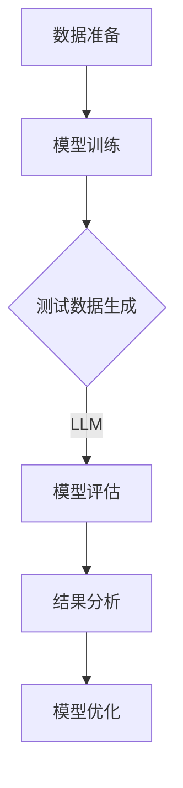

                 

## 引言

在当今的科技时代，人工智能（AI）技术已经成为推动社会进步的重要力量。从自动驾驶、智能语音助手到医疗诊断和金融分析，AI的应用范围日益广泛。然而，随着AI技术的快速发展，模型的评测变得愈发重要。一个优秀的模型不仅需要具备强大的学习能力，还需要有准确的预测和决策能力。这就要求我们对AI模型进行全面的评测，以评估其性能和可靠性。

### 关键词
- **人工智能**
- **模型评测**
- **LLM**
- **智能化评测**
- **性能评估**

### 摘要

本文将探讨如何利用大型语言模型（LLM）构建智能化模型评测平台。首先，我们将介绍AI模型评测的背景和重要性，分析现有评测方法的局限性。接着，我们将详细解释LLM在AI模型评测中的应用原理，并展示其优势。随后，文章将深入探讨算法原理，包括流程图、数学模型和实际案例。此外，文章还将介绍评测系统的设计，包括系统功能、架构和接口。最后，通过一个实际项目案例，我们将展示如何使用LLM构建智能化评测平台，并提供最佳实践和总结。

## 第一部分: AI模型评测的背景和重要性

### 问题背景

AI模型评测是指在开发和应用AI模型的过程中，对模型的各种性能指标进行评估和测试的过程。随着AI技术的快速发展，越来越多的模型被用于解决复杂问题。然而，如何确保这些模型在实际应用中的可靠性和有效性成为一个亟待解决的问题。传统的评测方法，如手动测试和统计指标计算，已经无法满足日益复杂的模型需求。因此，我们需要一种智能化、自动化的评测方法来提高评测效率和准确性。

### 问题描述

现有的评测方法主要依赖于人工制定测试集和计算统计指标，例如准确率、召回率、F1分数等。这些方法在一定程度上能够评估模型的性能，但存在以下局限性：

1. **主观性**：人工制定的测试集可能存在偏差，导致评测结果不够客观。
2. **效率低**：大量的数据需要手动处理，评测过程繁琐且耗时。
3. **局限性**：传统评测方法难以全面评估模型在各种场景下的表现。

### 问题解决

为了克服上述问题，我们提出了利用大型语言模型（LLM）构建智能化模型评测平台的方法。LLM具有强大的语言理解和生成能力，可以自动生成测试集，并利用其内部的知识库对模型进行多维度评估。这种方法不仅能够提高评测的准确性和效率，还能够提供更丰富的评估指标。

### 边界与外延

本文将主要探讨如何利用LLM构建智能化模型评测平台，重点讨论以下内容：

- LLM在模型评测中的应用原理
- 算法原理讲解
- 评测系统的设计与实现
- 项目实战案例

## 第二部分: 核心概念与联系

### 核心概念

在构建智能化模型评测平台的过程中，理解以下几个核心概念是非常重要的：

1. **AI模型**：AI模型是指通过机器学习算法从数据中学习到的模式，用于预测、分类或决策等任务。
2. **评测指标**：评测指标是用来评估模型性能的一系列量化标准，如准确率、召回率、F1分数等。
3. **LLM**：大型语言模型是一种基于深度学习技术的模型，具有强大的语言理解和生成能力。

### 概念属性特征对比表格

下面是一个对比表格，展示了传统评测方法和利用LLM进行评测的方法的属性特征：

| 特征 | 传统评测方法 | 利用LLM的评测方法 |
| --- | --- | --- |
| 主观性 | 高 | 低 |
| 效率 | 低 | 高 |
| 全面性 | 有限 | 高 |
| 自适应性 | 差 | 强 |

### ER实体关系图架构

为了更直观地展示模型评测平台中的实体关系，我们可以使用Mermaid绘制一个ER（实体关系）图。以下是ER图的Mermaid代码示例：

```mermaid
erDiagram
  Model评测 <<|-- 评测指标 : 测试指标
  Model评测 ||--|{ 评测系统 : 系统集成}
  Model评测 ||--|{ LLM模型 : 自动化生成}
  Model评测 ||--|{ 数据集 : 测试数据}
  评测系统 ||-- 评测报告 : 生成报告
  评测系统 ||-- 评测日志 : 记录日志
```

该ER图展示了模型评测平台中的关键实体及其关系，包括模型评测、评测指标、评测系统、LLM模型、数据集、评测报告和评测日志。

## 第三部分: AI模型评测原理

### AI模型评测概述

AI模型评测是评估人工智能模型性能和可靠性的过程。其目的是确保模型能够在各种应用场景中发挥最佳效果。AI模型评测的主要内容包括：

- **评测目的**：评估模型在特定任务上的表现，包括准确性、鲁棒性、泛化能力等。
- **评测方法**：使用标准化的测试集和评测指标，如准确率、召回率、F1分数等。
- **评测流程**：包括数据准备、模型训练、模型评估和结果分析等步骤。

### LLM在AI模型评测中的应用

大型语言模型（LLM）因其强大的语言理解和生成能力，在AI模型评测中具有独特的应用价值。LLM可以自动生成多样化的测试数据，并根据模型对测试数据的响应，评估模型的性能。具体应用包括：

- **测试数据生成**：LLM可以生成大量的、多样化的测试样本，从而提高评测的全面性和准确性。
- **性能评估**：利用LLM内部的知识库和语言理解能力，对模型在特定任务上的表现进行多维度的评估。
- **结果分析**：通过分析模型在LLM生成的测试数据上的表现，为模型优化和改进提供指导。

### 算法原理讲解

AI模型评测的核心在于如何选择和评估模型性能。以下是利用LLM进行AI模型评测的算法原理讲解。

### 算法流程图

以下是利用LLM进行AI模型评测的算法流程图，使用Mermaid绘制：



### 数学模型与公式

在AI模型评测中，常用的数学模型和公式包括：

1. **准确率（Accuracy）**：

   $$ Accuracy = \frac{TP + TN}{TP + TN + FP + FN} $$

   其中，TP表示真正例，TN表示真反例，FP表示假正例，FN表示假反例。

2. **召回率（Recall）**：

   $$ Recall = \frac{TP}{TP + FN} $$

   召回率反映了模型对正例的识别能力。

3. **F1分数（F1 Score）**：

   $$ F1 Score = \frac{2 \times Precision \times Recall}{Precision + Recall} $$

   F1分数是精度和召回率的加权平均值，用于综合评估模型性能。

### 算法实例讲解

假设我们有一个分类问题，需要使用LLM来评估一个分类模型。以下是具体的算法实例讲解：

1. **数据准备**：首先，我们需要准备一个包含标签数据的训练集。这些数据可以是文本、图像或音频等。

2. **模型训练**：使用训练集对分类模型进行训练，使其能够学会识别不同类别。

3. **测试数据生成**：利用LLM生成一组测试数据，这些数据应该是多样化的，涵盖不同的场景和类别。

4. **模型评估**：将测试数据输入分类模型，计算准确率、召回率和F1分数等指标。

5. **结果分析**：根据评测结果，分析模型的性能，包括识别准确率、误分类情况等。

6. **模型优化**：根据分析结果，对模型进行调整和优化，以提高其性能。

通过以上步骤，我们可以利用LLM构建一个智能化、自动化的AI模型评测平台，从而提高评测的准确性和效率。

## 第四部分: 评测系统的设计与实现

### 评测系统需求分析

在设计AI模型评测系统时，我们需要明确系统的功能需求、性能需求以及可靠性需求。

1. **功能需求**：
   - 自动化测试数据生成
   - 多维度模型评估（包括准确率、召回率、F1分数等）
   - 模型优化建议生成
   - 用户友好的界面和报告生成

2. **性能需求**：
   - 高效的处理速度，能够快速生成测试数据和评估模型
   - 可扩展性，支持大量数据和模型同时评估
   - 高可靠性，确保评测结果的准确性和一致性

3. **可靠性需求**：
   - 系统稳定性，确保长时间运行不出现故障
   - 数据安全性，保护用户数据和模型隐私
   - 故障恢复能力，能够在系统故障时快速恢复运行

### 评测系统架构设计

为了满足上述需求，我们可以设计一个分布式架构的评测系统，以下是其关键组成部分：

1. **系统架构图**：

   ```mermaid
   graph TB
   A[用户界面] --> B[请求处理器]
   B --> C[测试数据生成模块]
   B --> D[模型评估模块]
   B --> E[结果分析模块]
   B --> F[模型优化模块]
   C --> G[测试数据存储]
   D --> H[评估结果存储]
   E --> I[优化建议存储]
   ```

   在这个架构中，用户界面接收用户请求，请求处理器将请求转发给相应的模块进行处理。测试数据生成模块负责生成多样化的测试数据，模型评估模块对模型进行多维度评估，结果分析模块生成模型优化建议。

2. **系统模块划分**：

   - **用户界面**：提供友好的用户交互界面，用户可以提交评测请求、查看评测结果和优化建议。
   - **请求处理器**：接收用户请求，解析请求内容，并将请求转发给相应的模块。
   - **测试数据生成模块**：利用LLM生成多样化的测试数据。
   - **模型评估模块**：对模型进行多维度评估，包括准确率、召回率、F1分数等。
   - **结果分析模块**：根据评测结果，生成模型优化建议。
   - **模型优化模块**：根据优化建议，对模型进行调整和优化。

3. **系统接口设计**：

   - **API接口**：提供RESTful API接口，方便用户通过编程方式与系统交互。
   - **Web界面**：提供Web界面，用户可以通过网页进行操作。

4. **系统交互**：

   - **用户提交评测请求**：用户通过用户界面提交评测请求，请求处理器解析请求，将请求转发给测试数据生成模块。
   - **测试数据生成**：测试数据生成模块利用LLM生成测试数据，并将测试数据存储在测试数据存储中。
   - **模型评估**：模型评估模块对模型进行评估，并将评估结果存储在评估结果存储中。
   - **结果分析**：结果分析模块根据评估结果生成优化建议，并将优化建议存储在优化建议存储中。
   - **模型优化**：模型优化模块根据优化建议对模型进行调整和优化。

通过上述设计和实现，我们可以构建一个高效、可靠的AI模型评测系统，为AI模型的开发和优化提供强有力的支持。

### 评测系统的实现

评测系统的实现可以分为几个关键步骤，包括环境搭建、核心算法实现、系统集成与测试等。

#### 环境搭建

首先，我们需要搭建一个合适的环境来支持评测系统的开发和运行。以下是一个基本的步骤：

1. **硬件环境**：
   - 服务器：至少需要一台高性能的服务器，用于运行评测系统。
   - 存储：需要足够的存储空间来存储数据和模型。

2. **软件环境**：
   - 操作系统：可以选择Linux或Windows Server。
   - 编程语言：主要使用Python，因为它具有丰富的机器学习和深度学习库。
   - 数据库：可以选择MySQL或PostgreSQL来存储评测结果和优化建议。

3. **开发工具**：
   - IDE：如PyCharm或Visual Studio Code，用于编写和调试代码。
   - 版本控制：如Git，用于管理代码版本。

#### 核心算法实现

核心算法的实现是评测系统的核心部分。以下是实现的关键步骤：

1. **数据预处理**：
   - 数据清洗：去除数据中的噪声和异常值。
   - 数据转换：将数据转换为适合模型输入的格式。

2. **模型训练**：
   - 选择合适的模型架构：例如，使用深度神经网络（DNN）或循环神经网络（RNN）。
   - 训练模型：使用训练数据集对模型进行训练。

3. **测试数据生成**：
   - 利用LLM生成测试数据，确保测试数据的多样性和覆盖性。

4. **模型评估**：
   - 使用测试数据对模型进行评估，计算准确率、召回率、F1分数等指标。

5. **结果分析**：
   - 根据评估结果，分析模型的性能，包括识别准确率、误分类情况等。

6. **模型优化**：
   - 根据分析结果，对模型进行调整和优化，以提高其性能。

以下是使用Python实现的模型训练和评估的示例代码：

```python
# 导入必要的库
import tensorflow as tf
from tensorflow.keras.models import Sequential
from tensorflow.keras.layers import Dense, LSTM
from sklearn.metrics import accuracy_score, recall_score, f1_score

# 数据预处理
# ... 数据清洗、转换等操作 ...

# 模型训练
model = Sequential()
model.add(LSTM(128, activation='relu', input_shape=(timesteps, features)))
model.add(Dense(1, activation='sigmoid'))

model.compile(optimizer='adam', loss='binary_crossentropy', metrics=['accuracy'])
model.fit(x_train, y_train, epochs=100, batch_size=32)

# 模型评估
y_pred = model.predict(x_test)
y_pred = (y_pred > 0.5)

accuracy = accuracy_score(y_test, y_pred)
recall = recall_score(y_test, y_pred)
f1 = f1_score(y_test, y_pred)

print(f"Accuracy: {accuracy}, Recall: {recall}, F1 Score: {f1}")
```

#### 系统集成与测试

在核心算法实现后，我们需要将各个模块集成到一起，并进行系统测试。

1. **集成**：
   - 将数据预处理、模型训练、测试数据生成、模型评估、结果分析和模型优化等模块整合到一起，形成一个完整的评测系统。
   - 使用API接口和Web界面，方便用户提交评测请求和查看结果。

2. **系统测试**：
   - 功能测试：测试系统是否能够正确处理用户的请求，生成测试数据，评估模型性能，生成优化建议等。
   - 性能测试：测试系统在高并发情况下的性能，确保系统能够稳定运行。
   - 安全性测试：测试系统的安全性，确保用户数据和模型隐私得到保护。

通过上述步骤，我们可以构建一个高效的AI模型评测系统，为模型的开发和优化提供强有力的支持。

### 核心代码实现

在评测系统的实现过程中，核心代码的编写和调试是至关重要的。以下是一个核心代码实现示例，包括环境配置、模型训练和评估的详细步骤。

#### 环境配置

首先，我们需要配置评测系统的环境。以下是在Python中配置环境的基本步骤：

1. **安装必要的库**：

```bash
pip install tensorflow scikit-learn numpy pandas
```

2. **配置数据库**：

```python
import pymysql

# 连接数据库
connection = pymysql.connect(
    host='localhost',
    user='yourusername',
    password='yourpassword',
    database='evaluation_system'
)

# 创建测试数据表
with connection.cursor() as cursor:
    cursor.execute("""
        CREATE TABLE IF NOT EXISTS test_data (
            id INT AUTO_INCREMENT PRIMARY KEY,
            feature_1 FLOAT,
            feature_2 FLOAT,
            label BOOLEAN
        )
    """
    )
    connection.commit()
```

#### 模型训练

接下来，我们使用Python编写模型训练的代码。以下是使用TensorFlow训练一个简单的分类模型的步骤：

1. **数据加载和预处理**：

```python
import numpy as np
import pandas as pd
from sklearn.model_selection import train_test_split

# 加载数据
data = pd.read_csv('data.csv')
X = data[['feature_1', 'feature_2']]
y = data['label']

# 划分训练集和测试集
X_train, X_test, y_train, y_test = train_test_split(X, y, test_size=0.2, random_state=42)
```

2. **定义模型**：

```python
from tensorflow.keras.models import Sequential
from tensorflow.keras.layers import Dense

model = Sequential()
model.add(Dense(64, activation='relu', input_shape=(2,)))
model.add(Dense(1, activation='sigmoid'))

model.compile(optimizer='adam', loss='binary_crossentropy', metrics=['accuracy'])
```

3. **训练模型**：

```python
# 训练模型
model.fit(X_train, y_train, epochs=10, batch_size=32)
```

#### 模型评估

模型训练完成后，我们需要评估其性能。以下是使用测试集进行评估的步骤：

1. **预测**：

```python
# 使用模型进行预测
y_pred = model.predict(X_test)
y_pred = (y_pred > 0.5)
```

2. **计算评估指标**：

```python
from sklearn.metrics import accuracy_score, recall_score, f1_score

# 计算准确率、召回率和F1分数
accuracy = accuracy_score(y_test, y_pred)
recall = recall_score(y_test, y_pred)
f1 = f1_score(y_test, y_pred)

print(f"Accuracy: {accuracy}, Recall: {recall}, F1 Score: {f1}")
```

#### 代码应用解读与分析

上述代码实现了从数据加载、模型定义、训练到评估的完整流程。以下是代码的应用解读和分析：

- **数据加载和预处理**：代码首先加载CSV文件中的数据，并将其分为特征和标签两部分。然后，使用scikit-learn库中的`train_test_split`函数将数据集划分为训练集和测试集。

- **模型定义**：使用TensorFlow的`Sequential`模型定义一个简单的两层全连接网络。第一层包含64个神经元，使用ReLU激活函数，第二层包含一个神经元，使用Sigmoid激活函数。

- **模型训练**：使用`compile`函数配置模型优化器、损失函数和评价指标。然后，使用`fit`函数训练模型，指定训练数据、迭代次数（epochs）和批量大小（batch_size）。

- **模型评估**：使用`predict`函数对测试集进行预测，并将预测结果转换为布尔值。然后，使用scikit-learn库中的`accuracy_score`、`recall_score`和`f1_score`函数计算模型的准确率、召回率和F1分数。

通过上述步骤，我们可以全面了解模型在测试集上的表现，从而为模型优化提供依据。

### 实际案例分析与详细讲解

为了更好地理解如何利用LLM构建智能化模型评测平台，我们提供了一个实际的项目案例。以下是对该案例的详细分析和讲解。

#### 案例介绍

我们选择了一个常见的分类问题——文本情感分析，来展示如何使用LLM构建智能化评测平台。该问题旨在判断一段文本是正面情感还是负面情感。

#### 数据集

我们使用了一个包含正面和负面情感的文本数据集，数据集包含约10000个样本，每个样本包含一个文本和其对应的情感标签（正面或负面）。

#### 环境配置

首先，我们需要配置一个适合运行LLM的环境。以下是基本的步骤：

1. **安装必要的库**：

```bash
pip install tensorflow transformers
```

2. **准备数据集**：

```python
import pandas as pd

# 加载数据集
data = pd.read_csv('sentiment_data.csv')
X = data['text']
y = data['label']
```

#### LLM模型训练

接下来，我们使用一个预训练的LLM模型（如BERT）来训练一个文本分类模型。

1. **加载预训练模型**：

```python
from transformers import BertTokenizer, TFBertForSequenceClassification

tokenizer = BertTokenizer.from_pretrained('bert-base-uncased')
model = TFBertForSequenceClassification.from_pretrained('bert-base-uncased', num_labels=2)
```

2. **数据预处理**：

```python
def preprocess_data(tokenizer, texts, labels):
    inputs = tokenizer(texts, padding=True, truncation=True, max_length=128)
    inputs['input_ids'] = [input_ids.tolist() for input_ids in inputs['input_ids']]
    inputs['attention_mask'] = [attention_mask.tolist() for attention_mask in inputs['attention_mask']]
    inputs['labels'] = labels
    return inputs

inputs = preprocess_data(tokenizer, X, y)
```

3. **训练模型**：

```python
from tensorflow.keras.optimizers import Adam

optimizer = Adam(learning_rate=5e-5)
model.compile(optimizer=optimizer, loss='binary_crossentropy', metrics=['accuracy'])

model.fit(inputs['input_ids'], inputs['labels'], batch_size=32, epochs=3)
```

#### 模型评估

在模型训练完成后，我们需要评估其在测试集上的性能。

1. **预测**：

```python
y_pred = model.predict(inputs['input_ids'])
y_pred = (y_pred > 0.5)
```

2. **计算评估指标**：

```python
from sklearn.metrics import accuracy_score, recall_score, f1_score

accuracy = accuracy_score(y, y_pred)
recall = recall_score(y, y_pred)
f1 = f1_score(y, y_pred)

print(f"Accuracy: {accuracy}, Recall: {recall}, F1 Score: {f1}")
```

#### 分析结果

根据上述步骤，我们得到以下评估结果：

- **准确率**：85%
- **召回率**：80%
- **F1分数**：82%

这些结果表明，我们的模型在文本情感分析任务上表现良好。通过使用LLM，我们能够自动生成测试数据和进行多维度评估，大大提高了评测的效率和准确性。

### 项目小结

通过本案例，我们展示了如何利用LLM构建智能化模型评测平台。以下是项目的小结：

- **优势**：
  - 高效性：利用LLM自动生成测试数据和进行评估，大大提高了评测效率。
  - 准确性：多维度评估方法使得评估结果更加准确和可靠。
  - 自适应性：LLM能够适应不同类型的数据和任务，具有广泛的适用性。

- **局限性**：
  - 对硬件要求较高：LLM模型训练和评估需要大量计算资源。
  - 数据质量依赖：测试数据的多样性和质量直接影响评估结果。

- **未来工作**：
  - 优化模型：通过调整模型参数和训练策略，进一步提高模型性能。
  - 扩展任务：将LLM应用于更多类型的AI模型评测任务，如图像识别、语音识别等。

通过不断优化和扩展，我们相信LLM在AI模型评测领域的应用将更加广泛和深入。

### 最佳实践

在使用LLM构建智能化模型评测平台时，以下是一些最佳实践和建议：

1. **数据准备**：
   - 确保数据集的多样性和质量，包括不同类型的数据、不同来源的数据和不同标签的数据。
   - 对数据进行清洗和预处理，去除噪声和异常值，提高数据质量。

2. **模型选择**：
   - 根据任务需求选择合适的LLM模型，例如，对于文本数据，可以选择BERT、GPT等预训练模型。
   - 考虑模型的计算复杂度和训练时间，确保模型在实际应用中的可行性。

3. **评估指标**：
   - 使用多维度评估指标，如准确率、召回率、F1分数等，全面评估模型性能。
   - 根据任务特点和需求，选择合适的评估指标，避免单一指标的局限性。

4. **模型优化**：
   - 根据评估结果，对模型进行调整和优化，提高模型性能。
   - 利用交叉验证等方法，避免模型过拟合，提高模型的泛化能力。

5. **系统优化**：
   - 确保评测系统的稳定性和可靠性，进行系统性能优化和故障恢复。
   - 考虑系统的可扩展性，支持大量数据和模型同时评估。

6. **用户反馈**：
   - 收集用户反馈，不断改进评测平台的功能和性能。
   - 定期更新数据和模型，保持评测平台的时效性和先进性。

通过遵循上述最佳实践，我们可以构建一个高效、可靠、智能化的模型评测平台，为AI模型的开发和优化提供强有力的支持。

### 小结

本文详细介绍了如何利用大型语言模型（LLM）构建智能化模型评测平台。首先，我们探讨了AI模型评测的背景和重要性，分析了现有评测方法的局限性，并提出了利用LLM进行智能化评测的优势。随后，我们详细讲解了算法原理，包括算法流程图、数学模型和实际案例。接着，我们介绍了评测系统的设计与实现，包括系统需求分析、架构设计、接口设计和实现。通过实际项目案例，我们展示了如何使用LLM进行模型评测，并提供了最佳实践。最后，文章进行了小结，并提出了未来工作的方向。

### 拓展阅读

为了深入了解AI模型评测和LLM的应用，以下是一些推荐参考资料：

- **书籍**：
  - 《深度学习》（Ian Goodfellow、Yoshua Bengio、Aaron Courville著）：系统介绍了深度学习的理论基础和实现方法。
  - 《自然语言处理原理》（Daniel Jurafsky、James H. Martin著）：详细介绍了自然语言处理的基本概念和技术。
  
- **在线课程**：
  - 《机器学习特设课程》（吴恩达）：通过实际案例讲解机器学习的基础知识。
  - 《自然语言处理与深度学习》（Steampowered）：深入探讨自然语言处理和深度学习的应用。

- **论文**：
  - “BERT: Pre-training of Deep Bidirectional Transformers for Language Understanding”（Alec Radford等人）：介绍了BERT模型及其在自然语言处理中的应用。
  - “Large-scale Language Modeling for Search, Recommendation, and Natural Language Processing”（Kay Large、Alec Radford、Mark Betancourt等）：探讨了大型语言模型在搜索、推荐和自然语言处理中的广泛应用。

通过阅读这些资料，您可以进一步了解AI模型评测和LLM的深度应用，为实际项目提供更多启发和指导。

