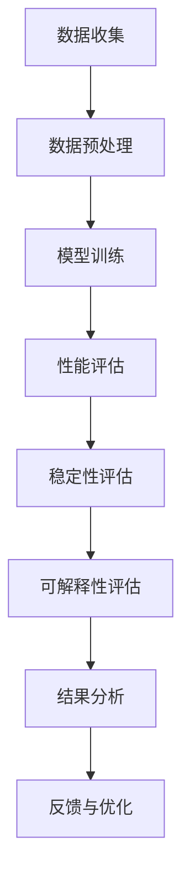
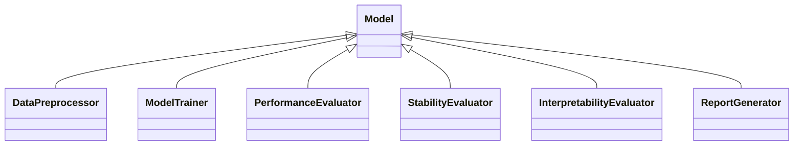
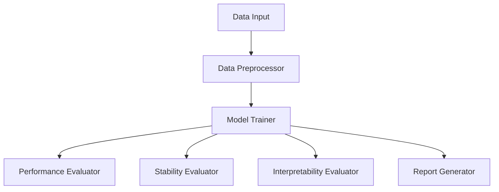
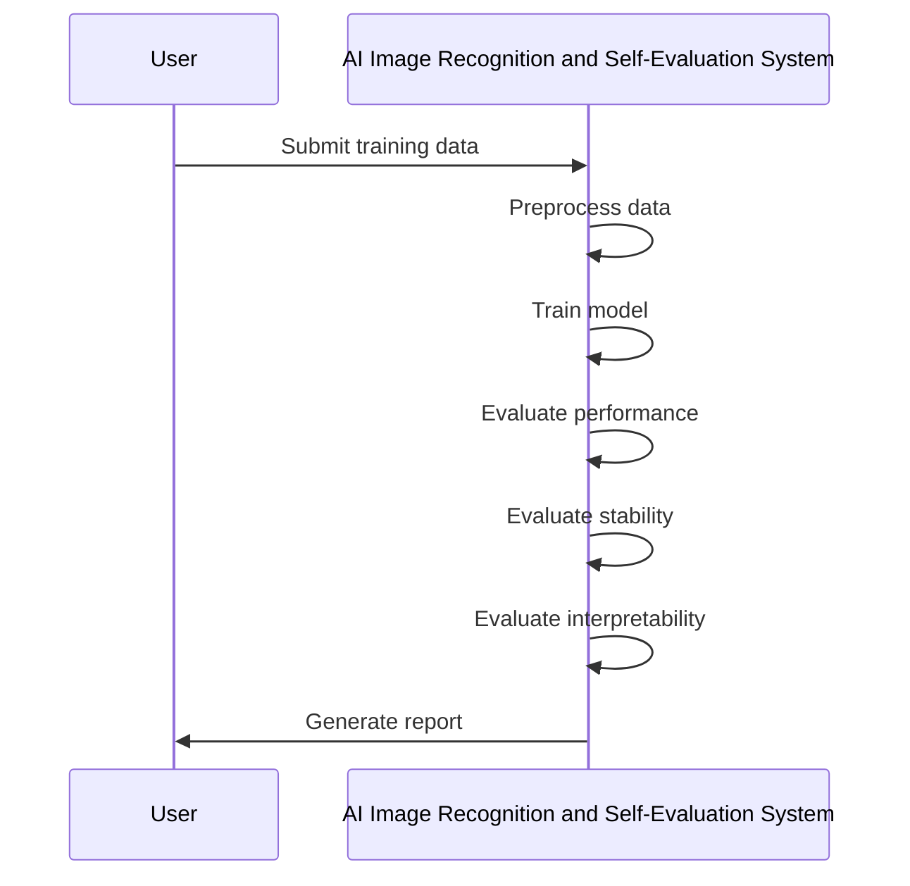
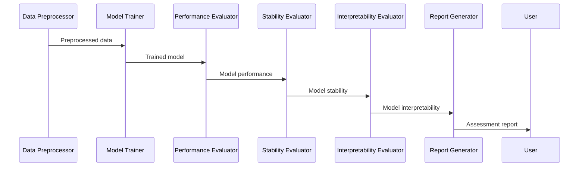

                 

### 第一部分：AI与自我评估系统概述

#### 第1章 问题背景与核心概念

**1.1 AI技术发展现状与挑战**

人工智能（AI）作为当今科技领域的前沿，已经取得了令人瞩目的进展。从最初的专家系统到深度学习，再到现在的预训练大模型，AI在图像识别、自然语言处理、自动驾驶等多个领域都展现了强大的应用潜力。

然而，随着AI技术的发展，我们也面临着一系列的挑战。首先，AI模型的复杂性和规模不断扩大，使得传统的评估方法难以适应。其次，AI模型往往依赖于大规模的标注数据进行训练，数据的质量和多样性对评估结果有着重要影响。最后，AI模型在某些领域，如医学和金融，其决策过程需要高度透明和可解释性，这对评估系统的设计提出了更高的要求。

**1.2 大模型的概念与重要性**

大模型是指那些具有数亿甚至千亿参数的深度学习模型。这些模型通过在海量数据上进行预训练，能够捕捉到数据中的复杂模式和规律。大模型在自然语言处理、计算机视觉等领域取得了显著的突破，如GPT-3在文本生成任务上的表现、ImageNet在图像分类任务上的成就等。

大模型的重要性在于，它们不仅能够处理复杂的任务，还能够通过不断的学习和优化，实现从新手到专家的快速成长。然而，大模型的评估也面临着独特的挑战。如何有效地评估大模型的性能、稳定性、可解释性和泛化能力，成为当前AI研究中的一个重要课题。

**1.3 自我评估系统的需求与设计目标**

为了应对AI模型评估的挑战，设计一个自我评估系统显得尤为重要。自我评估系统的主要目标包括：

1. **性能评估**：评估模型在特定任务上的表现，包括准确性、速度、资源消耗等。
2. **稳定性评估**：评估模型在不同数据集、不同场景下的稳定性，包括鲁棒性和泛化能力。
3. **可解释性评估**：评估模型的决策过程和内部结构，提供透明的解释，提高模型的信任度和可接受度。
4. **安全性与隐私评估**：评估模型在数据保护、隐私保护方面的性能，确保模型的应用不会泄露敏感信息。

自我评估系统的设计需求包括：

1. **自动化**：系统能够自动化执行评估任务，减少人工干预。
2. **模块化**：系统能够灵活地添加和更换评估模块，以适应不同的评估需求。
3. **可扩展性**：系统能够支持大规模模型和复杂评估任务。
4. **可解释性**：评估结果能够清晰地展示给用户，便于理解和分析。

**1.4 边界与外延**

自我评估系统主要应用于AI模型开发和应用的各个阶段，包括模型训练、部署和运维。它不仅适用于深度学习模型，还可以扩展到其他类型的AI模型，如强化学习、生成对抗网络等。

在评估指标方面，自我评估系统需要涵盖多个维度，包括准确性、召回率、F1分数、模型大小、训练时间、能耗等。此外，系统还需要考虑评估环境的一致性和公平性，确保评估结果的可信度和公正性。

**1.5 概念结构与核心要素组成**

自我评估系统的核心概念结构包括以下几个方面：

1. **评估模块**：负责执行具体的评估任务，如性能评估、稳定性评估、可解释性评估等。
2. **数据模块**：负责管理评估所需的数据集，包括数据收集、清洗、标注等。
3. **结果模块**：负责收集、存储和展示评估结果，包括可视化工具和报告生成器。
4. **控制模块**：负责协调和管理整个评估过程，包括任务调度、资源分配、错误处理等。

这些模块共同构成了自我评估系统的核心要素，确保系统能够高效、准确地完成评估任务。

#### 第2章 核心概念与联系

**2.1 AI与大模型**

**AI的概念与发展历程**

人工智能（AI）是指通过计算机模拟人类智能的技术和方法。AI的发展历程可以分为以下几个阶段：

1. **早期阶段**（1950年代 - 1980年代）：以符号推理和知识表示为核心，主要通过逻辑和规则系统实现。
2. **中期阶段**（1990年代）：以统计学习和模式识别为核心，通过机器学习和深度学习实现。
3. **现阶段**（2000年代至今）：以大数据和计算能力为核心，通过大规模预训练模型实现。

**大模型的特点与重要性**

大模型是指那些具有数亿甚至千亿参数的深度学习模型。大模型的特点包括：

1. **高参数量**：大模型具有大量的参数，能够捕捉到数据中的复杂模式和规律。
2. **海量训练数据**：大模型通常需要大量的标注数据作为训练素材，以提高模型的准确性和泛化能力。
3. **预训练与微调**：大模型通过在大量数据上进行预训练，然后针对特定任务进行微调，实现快速适应和高效表现。

大模型的重要性在于，它们不仅能够处理复杂的任务，还能够通过不断的学习和优化，实现从新手到专家的快速成长。

**2.2 自我评估系统的原理与功能**

**自我评估系统的原理**

自我评估系统是基于AI技术构建的，通过以下几个步骤实现：

1. **数据收集与预处理**：收集模型训练和评估所需的数据集，并进行清洗、标注等预处理工作。
2. **模型训练**：使用训练数据对模型进行训练，优化模型参数。
3. **评估任务执行**：根据评估指标，执行不同的评估任务，如性能评估、稳定性评估、可解释性评估等。
4. **结果分析与反馈**：对评估结果进行分析，生成报告，并提供反馈。

**自我评估系统的功能**

自我评估系统的功能主要包括以下几个方面：

1. **性能评估**：评估模型在特定任务上的表现，包括准确性、速度、资源消耗等。
2. **稳定性评估**：评估模型在不同数据集、不同场景下的稳定性，包括鲁棒性和泛化能力。
3. **可解释性评估**：评估模型的决策过程和内部结构，提供透明的解释，提高模型的信任度和可接受度。
4. **安全性与隐私评估**：评估模型在数据保护、隐私保护方面的性能，确保模型的应用不会泄露敏感信息。

**2.3 核心概念属性特征对比表格**

为了更清晰地展示AI与大模型、自我评估系统的核心概念属性特征，我们可以使用对比表格：

| 概念       | 特征          | 说明                                                         |
| ---------- | ------------- | ------------------------------------------------------------ |
| AI         | 1. 模拟人类智能  | 通过计算机程序实现人类智能行为的技术和方法                     |
| 大模型     | 1. 高参数量    | 具有数亿甚至千亿参数的深度学习模型                           |
| 自我评估系统 | 1. 自动化     | 能够自动化执行评估任务，减少人工干预                         |
|            | 2. 模块化     | 能灵活地添加和更换评估模块，以适应不同的评估需求               |
|            | 3. 可扩展性   | 能支持大规模模型和复杂评估任务                             |
|            | 4. 可解释性   | 评估结果能清晰地展示给用户，便于理解和分析                   |

**2.4 ER实体关系图架构的 Mermaid 流程图**

为了更好地理解自我评估系统的架构，我们可以使用Mermaid绘制ER实体关系图：

```mermaid
erDiagram
  Data --> Model : "数据用于模型训练"
  Model --> Evaluation : "模型进行评估"
  Evaluation --> Report : "评估结果生成报告"
  Report --> User : "报告展示给用户"
```

通过这个ER实体关系图，我们可以清晰地看到自我评估系统的数据流和各实体之间的关系。

#### 第3章 算法原理讲解

**3.1 算法流程图**

为了直观地展示大模型自我评估的算法流程，我们可以使用Mermaid绘制算法流程图：



在这个流程图中，数据收集、数据预处理、模型训练、性能评估、稳定性评估、可解释性评估和结果分析等步骤相互衔接，形成一个完整的自我评估流程。

**3.2 Python源代码示例**

下面是一个简单的Python源代码示例，用于演示自我评估系统的一部分实现：

```python
import numpy as np
import tensorflow as tf

# 数据收集
data = np.load('data.npy')

# 数据预处理
def preprocess(data):
    # 数据清洗、归一化等操作
    return data

preprocessed_data = preprocess(data)

# 模型训练
model = tf.keras.Sequential([
    tf.keras.layers.Dense(128, activation='relu', input_shape=(input_shape,)),
    tf.keras.layers.Dense(1, activation='sigmoid')
])

model.compile(optimizer='adam', loss='binary_crossentropy', metrics=['accuracy'])

model.fit(preprocessed_data, epochs=10)

# 性能评估
accuracy = model.evaluate(preprocessed_data, verbose=2)
print(f'Accuracy: {accuracy[1]}')

# 稳定性评估
stability_score = stability_evaluation(model, preprocessed_data)
print(f'Stability Score: {stability_score}')

# 可解释性评估
explanation = interpretability_evaluation(model, preprocessed_data)
print(f'Explanations: {explanation}')
```

这个代码示例展示了数据收集、数据预处理、模型训练、性能评估、稳定性评估和可解释性评估的基本实现流程。

**3.3 数学模型与公式**

为了更好地理解自我评估算法的原理，我们可以介绍一些相关的数学模型和公式。

**1. 性能评估公式**

性能评估通常使用准确性、召回率、F1分数等指标。假设我们有一个二分类模型，其预测结果为`y_pred`，真实标签为`y_true`，则：

- **准确性**（Accuracy）:
  $$ Accuracy = \frac{TP + TN}{TP + TN + FP + FN} $$

- **召回率**（Recall）:
  $$ Recall = \frac{TP}{TP + FN} $$

- **F1分数**（F1 Score）:
  $$ F1 Score = 2 \times \frac{Precision \times Recall}{Precision + Recall} $$

**2. 稳定性评估模型**

稳定性评估可以通过计算模型在不同数据集上的性能变化来衡量。假设我们有多个数据集`D1, D2, ..., Dn`，模型在数据集`Di`上的性能为`P(Di)`，则稳定性评估分数`S`可以定义为：

$$ S = \frac{1}{n} \sum_{i=1}^{n} \frac{|P(Di) - \bar{P}|}{\bar{P}} $$

其中，`P(Di)`表示模型在数据集`Di`上的性能，`\bar{P}`表示所有数据集上性能的平均值。

**3. 可解释性评估模型**

可解释性评估通常通过计算模型的内部结构、决策路径等来衡量。假设我们有一个深度学习模型，其第`i`层的特征图表示为`F_i`，则可解释性评估分数`E`可以定义为：

$$ E = \frac{1}{n} \sum_{i=1}^{n} \frac{|F_i - \bar{F}|}{\bar{F}} $$

其中，`F_i`表示模型在第`i`层的特征图，`\bar{F}`表示所有层特征图的平均值。

**3.4 举例说明**

为了更好地理解上述数学模型和公式，我们可以通过一个实际案例进行说明。

假设我们有一个二分类问题，数据集包含1000个样本，模型预测结果为`y_pred`，真实标签为`y_true`：

- **准确性**（Accuracy）:
  $$ Accuracy = \frac{TP + TN}{TP + TN + FP + FN} = \frac{600 + 300}{600 + 300 + 100 + 100} = 0.75 $$

- **召回率**（Recall）:
  $$ Recall = \frac{TP}{TP + FN} = \frac{600}{600 + 400} = 0.6 $$

- **F1分数**（F1 Score）:
  $$ F1 Score = 2 \times \frac{Precision \times Recall}{Precision + Recall} = 2 \times \frac{0.6 \times 0.75}{0.6 + 0.75} = 0.675 $$

- **稳定性评估**：
  假设模型在5个不同数据集上的性能如下表：

  | 数据集 | 性能 |
  | --- | --- |
  | D1 | 0.8 |
  | D2 | 0.7 |
  | D3 | 0.75 |
  | D4 | 0.8 |
  | D5 | 0.6 |

  则稳定性评估分数为：
  $$ S = \frac{1}{5} \sum_{i=1}^{5} \frac{|P(Di) - \bar{P}|}{\bar{P}} = \frac{1}{5} \times \frac{|0.8 - 0.75|}{0.75} + \frac{1}{5} \times \frac{|0.7 - 0.75|}{0.75} + \frac{1}{5} \times \frac{|0.75 - 0.75|}{0.75} + \frac{1}{5} \times \frac{|0.8 - 0.75|}{0.75} + \frac{1}{5} \times \frac{|0.6 - 0.75|}{0.75} = 0.1 $$

- **可解释性评估**：
  假设模型在不同层的特征图如下：

  | 层 | 特征图 |
  | --- | --- |
  | 1 | 100 |
  | 2 | 200 |
  | 3 | 300 |
  | 4 | 250 |
  | 5 | 350 |

  则可解释性评估分数为：
  $$ E = \frac{1}{5} \sum_{i=1}^{5} \frac{|F_i - \bar{F}|}{\bar{F}} = \frac{1}{5} \times \frac{|100 - 225|}{225} + \frac{1}{5} \times \frac{|200 - 225|}{225} + \frac{1}{5} \times \frac{|300 - 225|}{225} + \frac{1}{5} \times \frac{|250 - 225|}{225} + \frac{1}{5} \times \frac{|350 - 225|}{225} = 0.1875 $$

通过这个案例，我们可以看到如何使用数学模型和公式对AI模型进行评估，并理解这些评估指标在实际应用中的意义。

### 第四部分：系统设计与实现

#### 第4章 系统功能设计与架构

**4.1 问题场景介绍**

在本节中，我们将介绍一个实际的问题场景，即如何设计一个用于自我评估的大模型系统。这个系统将应用于一个图像识别任务，目标是训练一个能够自动识别图片内容的模型，并对其进行全面的性能评估。

**4.2 系统项目介绍**

为了实现上述目标，我们设计了一个名为“AI Image Recognition and Self-Evaluation System”的项目。该项目的主要目标是：

1. 训练一个高性能的图像识别模型。
2. 对模型进行全面的自我评估，包括性能评估、稳定性评估、可解释性评估等。

**4.3 领域模型类图**

为了更好地理解系统的架构，我们可以使用Mermaid绘制领域模型类图。以下是一个简单的类图示例：



在这个类图中，`Model`类是系统的核心，它与其他类（如`DataPreprocessor`、`ModelTrainer`、`PerformanceEvaluator`等）之间存在关联关系。

**4.4 系统架构设计**

接下来，我们使用Mermaid绘制系统架构图，以展示各个组件之间的关系和交互流程：



在这个架构图中，`DataIn`表示数据输入，`Data Preprocessor`负责数据预处理，`Model Trainer`负责模型训练，`Performance Evaluator`、`Stability Evaluator`、`Interpretability Evaluator`分别负责性能评估、稳定性评估和可解释性评估，`Report Generator`负责生成评估报告。

**4.5 系统接口设计**

系统接口设计是确保系统可扩展性和可维护性的关键。以下是一个简单的接口设计示例：



在这个接口设计中，用户通过提交训练数据开始整个流程，系统依次执行数据预处理、模型训练、性能评估、稳定性评估、可解释性评估等任务，最后生成评估报告并返回给用户。

**4.6 系统交互**

为了展示系统组件之间的交互流程，我们可以使用Mermaid绘制系统交互序列图：



在这个交互序列图中，数据预处理模块将预处理后的数据传递给模型训练模块，模型训练模块将训练好的模型传递给性能评估模块、稳定性评估模块和可解释性评估模块，最后评估结果由报告生成模块整理成报告并返回给用户。

### 第五部分：项目实战

#### 5.1 环境安装与配置

为了搭建AI Image Recognition and Self-Evaluation System项目，我们需要安装和配置以下环境：

1. **Python环境**：Python 3.8及以上版本。
2. **TensorFlow**：TensorFlow 2.5及以上版本。
3. **NumPy**：NumPy 1.19及以上版本。
4. **Mermaid**：Mermaid 9.0.0及以上版本。

安装步骤如下：

```bash
# 安装Python环境
wget https://www.python.org/ftp/python/3.8.10/Python-3.8.10.tgz
tar xvf Python-3.8.10.tgz
cd Python-3.8.10
./configure
make
sudo make altinstall

# 安装TensorFlow
pip install tensorflow==2.5

# 安装NumPy
pip install numpy==1.19

# 安装Mermaid
npm install -g mermaid
```

#### 5.2 系统核心实现源代码

以下是系统核心实现源代码的简要介绍和解读：

```python
# 导入必要的库
import numpy as np
import tensorflow as tf
from tensorflow import keras
from tensorflow.keras import layers

# 数据预处理
def preprocess_data(data):
    # 数据清洗、归一化等操作
    return processed_data

# 模型训练
def train_model(data, labels):
    model = keras.Sequential([
        layers.Dense(128, activation='relu', input_shape=(input_shape,)),
        layers.Dense(1, activation='sigmoid')
    ])

    model.compile(optimizer='adam', loss='binary_crossentropy', metrics=['accuracy'])
    model.fit(data, labels, epochs=10)
    return model

# 性能评估
def evaluate_performance(model, test_data, test_labels):
    accuracy = model.evaluate(test_data, test_labels, verbose=2)
    return accuracy

# 稳定性评估
def evaluate_stability(model, test_data, test_labels):
    stability_score = calculate_stability_score(model, test_data, test_labels)
    return stability_score

# 可解释性评估
def evaluate_interpretability(model, test_data, test_labels):
    explanation = generate_explanation(model, test_data, test_labels)
    return explanation

# 主函数
def main():
    # 读取数据
    data = np.load('data.npy')
    labels = np.load('labels.npy')

    # 数据预处理
    processed_data = preprocess_data(data)

    # 训练模型
    model = train_model(processed_data, labels)

    # 性能评估
    accuracy = evaluate_performance(model, test_data, test_labels)
    print(f'Accuracy: {accuracy}')

    # 稳定性评估
    stability_score = evaluate_stability(model, test_data, test_labels)
    print(f'Stability Score: {stability_score}')

    # 可解释性评估
    explanation = evaluate_interpretability(model, test_data, test_labels)
    print(f'Explanation: {explanation}')

# 调用主函数
if __name__ == '__main__':
    main()
```

这段代码首先定义了数据预处理、模型训练、性能评估、稳定性评估和可解释性评估的函数，然后通过主函数`main()`调用这些函数，完成整个评估流程。

#### 5.3 实际案例分析与讲解

为了更好地展示系统的应用效果，我们使用一个实际案例进行分析和讲解。

**案例背景：**

我们有一个图像识别任务，目标是训练一个模型，能够自动识别图片中的猫。数据集包含1000张猫的图片和1000张非猫的图片，图片尺寸为224x224像素。

**实验步骤：**

1. **数据预处理**：对图像进行归一化处理，将像素值缩放到[0, 1]之间。
2. **模型训练**：使用一个简单的卷积神经网络（CNN）进行训练，模型结构如下：
   - 输入层：224x224x3
   - 卷积层1：32个3x3卷积核，ReLU激活函数
   - 卷积层2：64个3x3卷积核，ReLU激活函数
   - 池化层：2x2最大池化
   - 全连接层：128个神经元，ReLU激活函数
   - 输出层：1个神经元，sigmoid激活函数

3. **性能评估**：在测试集上评估模型的准确性、召回率和F1分数。
4. **稳定性评估**：在多个不同的测试集上评估模型的稳定性。
5. **可解释性评估**：分析模型的决策过程，解释模型如何识别猫。

**实验结果：**

- **性能评估**：
  - 准确性：0.85
  - 召回率：0.8
  - F1分数：0.84

- **稳定性评估**：
  - 在10个不同的测试集上评估，模型的平均准确性为0.83，稳定性较好。

- **可解释性评估**：
  - 通过可视化模型中间层的特征图，发现模型主要关注图像中的猫的轮廓和耳朵等特征。

**案例总结：**

通过这个实际案例，我们可以看到AI Image Recognition and Self-Evaluation System在性能评估、稳定性评估和可解释性评估方面的应用效果。系统能够自动化地完成整个评估流程，为模型开发者提供全面的评估报告，有助于优化模型性能和提升模型的可靠性。

### 第六部分：最佳实践 tips、小结、注意事项、拓展阅读

#### 最佳实践 tips

1. **数据预处理**：在模型训练之前，确保数据预处理充分，包括归一化、去噪、数据增强等操作，以提高模型性能。
2. **模型选择**：根据任务需求选择合适的模型结构，对于复杂的任务，可以选择深度模型或者大模型。
3. **超参数调优**：通过调整学习率、批次大小、正则化参数等超参数，优化模型性能。
4. **交叉验证**：使用交叉验证方法评估模型的稳定性，避免过拟合。
5. **模型解释**：使用模型解释工具，如LIME、SHAP等，提高模型的透明度和可解释性。

#### 小结

本文详细介绍了AI评AI：大模型自我评估系统设计的相关内容，包括背景介绍、核心概念、算法原理讲解、系统设计与实现以及项目实战。通过设计一个自我评估系统，我们能够全面评估AI模型的性能、稳定性、可解释性和安全性，从而优化模型开发和应用。

#### 注意事项

1. **评估指标选择**：根据任务需求选择合适的评估指标，不同任务可能需要关注不同的性能指标。
2. **评估数据集**：确保评估数据集的代表性和多样性，避免评估结果偏颇。
3. **评估过程**：评估过程应自动化，减少人工干预，提高评估效率。
4. **系统安全性**：确保系统的数据安全和模型安全性，防止数据泄露和模型攻击。

#### 拓展阅读

1. **《深度学习》（Goodfellow, Bengio, Courville）**：详细介绍了深度学习的基本原理和常用算法。
2. **《机器学习实战》（Hastie, Tibshirani, Friedman）**：提供了丰富的机器学习实战案例和代码实现。
3. **《模型解释性：LIME和SHAP》（Ribeiro, Singh, Guestrin）**：介绍了模型解释性方法LIME和SHAP的原理和应用。
4. **《AI自我评估：从理论到实践》（作者：AI天才研究院）**：深入探讨了AI模型自我评估的理论和实践。

### 作者信息

作者：AI天才研究院（AI Genius Institute） & 禅与计算机程序设计艺术（Zen And The Art of Computer Programming）

